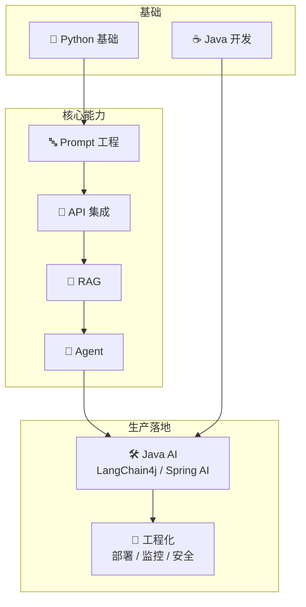

# AI 学习路线

> 从编程语言到 AI 大模型应用开发，系统化的 AI 技术栈学习路径。面向 Java 开发者，兼顾 Python 生态。

## 学习路线

## 模块导航

| 模块 | 说明 | 适合人群 | 状态 |
|------|------|---------|------|
| [Python 基础](/ai/python/) | 语法、数据结构、数据分析、AI/ML 入门 | 零基础 / 有其他语言基础 | ✅ 完成 |
| [AI 大模型应用开发](/ai/ai-app-dev/) | Prompt 工程、API 集成、RAG、Agent、Java AI | 有 Python + Java 基础 | 🚧 进行中 |

## 为什么 Java 开发者要学 AI？

- **企业刚需**：AI 正在重塑各行各业，能将 AI 能力接入企业系统的人才是稀缺资源
- **你的主场**：大部分人只会 Python，但生产环境往往需要 Java。Spring AI + LangChain4j 正在快速成熟
- **技术融合**：LangChain、Spring AI 等框架让 Java + AI 成为现实
- **先发优势**：现在入局正是时候，竞争还没那么卷

## 推荐学习顺序

1. **Python 基础**（阶段一~三学完就够用）
2. **Prompt 工程**（快速上手，立竿见影）
3. **API 集成**（理解模型调用机制）
4. **RAG**（企业最需要的能力）
5. **Agent**（前沿方向，智能体开发）
6. **Java AI**（回到 Java 做生产应用）
7. **工程化**（部署、监控、安全）
