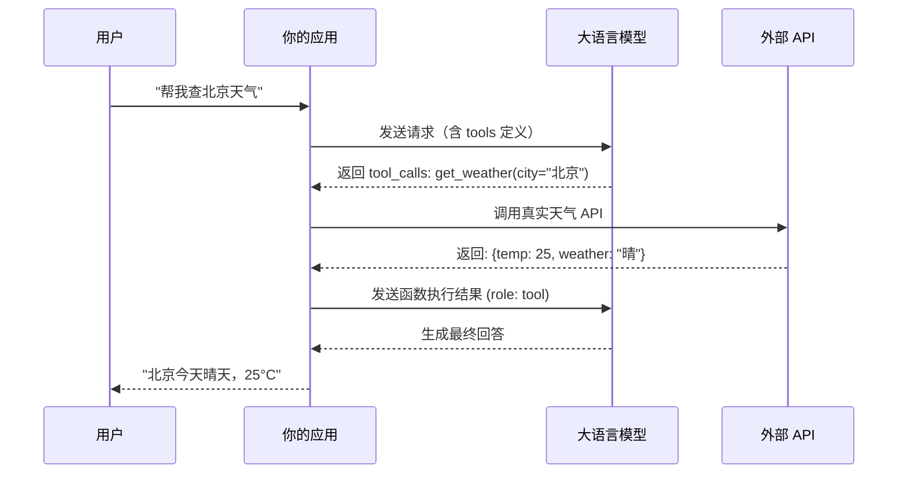
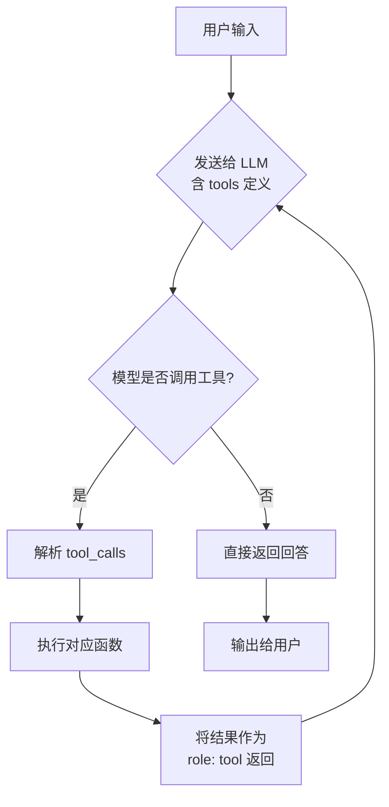

## 引言：让 LLM 长出"手和脚"

前面的章节中，我们一直在和 LLM "聊天"——问它问题，它回答。但如果你想让 LLM 帮你查一下今天的天气呢？帮你在数据库里搜一条数据呢？帮你发一封邮件呢？

LLM 本身是被关在"黑盒"里的，它不知道今天的天气，也连不上你的数据库，更没有你的邮箱密码。它只是一个语言模型，只能根据训练数据生成文本。

**Function Calling（工具调用）就是给 LLM 装上"手和脚"的机制。** 通过 Function Calling，LLM 可以告诉你："嘿，你需要调用这个函数，参数是这样这样的"，然后你（或你的代码）去执行这个函数，把结果返回给 LLM，LLM 再根据结果给出最终回答。

这是 Agent 的核心能力之一。没有 Function Calling，Agent 就只是个聊天机器人；有了它，Agent 才能真正"行动"。

---

## 什么是 Function Calling？

Function Calling 是一种让大语言模型能够"调用外部工具"的机制。这里的"调用"打了引号，因为**模型本身并不执行任何代码**，它只是输出一段结构化的 JSON，告诉你应该调用什么函数、传什么参数。

用一个简单的类比：

> 你是一个老板（用户），LLM 是你的秘书，Function Calling 是秘书的"指令条"。
> 
> 你说："帮我查一下北京明天的天气。"
> 
> 秘书不会自己跑去气象局，而是给你写一张指令条：**"调用 `get_weather(city='北京', date='明天')`"**。
> 
> 你拿着这张条子去查天气，把结果（"晴天，25°C"）告诉秘书。
> 
> 秘书再根据这个结果，整理成一段话回复你："北京明天是晴天，气温 25°C，适合出行。"

这个过程中：
1. **模型不执行函数** —— 它只生成指令
2. **你负责执行函数** —— 在你的代码里调用真实的 API
3. **把结果返回给模型** —— 让模型基于结果生成最终回答

:::tip 核心理解
Function Calling 不是让 LLM 直接执行代码，而是让 LLM 输出结构化的函数调用指令，由你的应用程序执行后，再把结果喂回给 LLM。
:::

---

## Function Calling 的工作原理

让我们从整体流程来理解 Function Calling 是怎么工作的：



整个流程分为 **5 个步骤**：

1. **定义工具**：你告诉 LLM 有哪些函数可用，每个函数的名称、描述、参数格式
2. **发送请求**：用户的问题 + 工具定义一起发给 LLM
3. **模型决策**：LLM 判断是否需要调用工具，如果需要，输出函数名和参数
4. **执行函数**：你的代码解析 LLM 的输出，调用真实的函数/API
5. **返回结果**：把函数执行结果发回给 LLM，让它生成最终回答

:::warning 重要概念
LLM 的输出不是一个随机字符串，而是一段**严格遵循 JSON Schema 的结构化数据**。这是 Function Calling 的关键——模型被训练成能够输出符合预定义格式的 JSON。
:::

---

## OpenAI Function Calling 详解

OpenAI 是最早推出标准化 Function Calling API 的厂商之一，后来其他厂商基本都兼容了这个格式。我们先以 OpenAI 的 API 为例，详细讲解每个细节。

### 安装与准备

```bash
pip install openai
```

```python
from openai import OpenAI

client = OpenAI(api_key="your-api-key")
```

### tools 参数格式

在调用 Chat Completions API 时，通过 `tools` 参数定义可用函数。每个工具包含 `type`（固定为 `function`）和 `function` 对象：

```python
tools = [
    {
        "type": "function",
        "function": {
            "name": "get_weather",           # 函数名
            "description": "获取指定城市的天气信息",  # 函数描述（非常重要！）
            "parameters": {                    # 参数定义（JSON Schema）
                "type": "object",
                "properties": {
                    "city": {
                        "type": "string",
                        "description": "城市名称，例如：北京、上海"
                    },
                    "date": {
                        "type": "string",
                        "description": "日期，格式：YYYY-MM-DD，不传则默认今天"
                    }
                },
                "required": ["city"]           # 必填参数
            }
        }
    }
]
```

:::tip description 是灵魂
`description` 字段极其重要！模型完全依靠描述来决定是否调用这个函数、传什么参数。描述越清晰，模型的表现越好。模糊的描述会导致模型选错函数或传错参数。
:::

#### 完整示例：天气查询

让我们写一个完整的、能跑的天气查询示例：

```python
from openai import OpenAI

client = OpenAI(api_key="your-api-key")

# 1. 定义工具
tools = [
    {
        "type": "function",
        "function": {
            "name": "get_weather",
            "description": "获取指定城市的当前天气信息",
            "parameters": {
                "type": "object",
                "properties": {
                    "city": {
                        "type": "string",
                        "description": "城市名称"
                    }
                },
                "required": ["city"]
            }
        }
    }
]

# 2. 定义实际的函数实现
def get_weather(city: str) -> dict:
    """模拟天气查询（实际中应该调用真实的天气 API）"""
    # 这里用模拟数据，实际项目中可以调用和风天气、OpenWeather 等API
    weather_db = {
        "北京": {"temperature": 25, "weather": "晴天", "humidity": 40},
        "上海": {"temperature": 28, "weather": "多云", "humidity": 65},
        "广州": {"temperature": 32, "weather": "雷阵雨", "humidity": 80},
    }
    if city in weather_db:
        return weather_db[city]
    return {"error": f"未找到城市 {city} 的天气数据"}

# 3. 发送请求
response = client.chat.completions.create(
    model="gpt-4o",
    messages=[
        {"role": "user", "content": "北京今天天气怎么样？"}
    ],
    tools=tools
)

# 4. 检查是否有 tool_calls
message = response.choices[0].message
print(f"模型是否要调用工具: {message.tool_calls is not None}")

if message.tool_calls:
    for tool_call in message.tool_calls:
        function_name = tool_call.function.name
        function_args = eval(tool_call.function.arguments)  # JSON 字符串 -> dict
        print(f"函数名: {function_name}")
        print(f"参数: {function_args}")
        
        # 5. 执行函数
        result = get_weather(**function_args)
        print(f"执行结果: {result}")
        
        # 6. 把结果返回给模型
        second_response = client.chat.completions.create(
            model="gpt-4o",
            messages=[
                {"role": "user", "content": "北京今天天气怎么样？"},
                message,  # 包含 tool_calls 的 assistant 消息
                {
                    "role": "tool",
                    "tool_call_id": tool_call.id,
                    "content": str(result)
                }
            ]
        )
        print(f"\n最终回答: {second_response.choices[0].message.content}")
```

**运行结果：**

```
模型是否要调用工具: True
函数名: get_weather
参数: {'city': '北京'}
执行结果: {'temperature': 25, 'weather': '晴天', 'humidity': 40}

最终回答: 北京今天天气晴朗，气温25°C，湿度40%，非常适合外出活动！
```

### tool_choice 参数

`tool_choice` 控制模型在什么情况下调用工具：

| 值 | 行为 |
|---|---|
| `"auto"`（默认） | 模型自己决定是否调用工具 |
| `"none"` | 模型不调用任何工具，直接回答 |
| `"required"` | 模型必须调用至少一个工具 |
| `{"type": "function", "function": {"name": "xxx"}}` | 强制调用指定函数 |

```python
# 强制模型必须调用工具
response = client.chat.completions.create(
    model="gpt-4o",
    messages=[{"role": "user", "content": "你好"}],
    tools=tools,
    tool_choice="required"  # 即使不需要，也必须调一个函数
)

# 强制调用特定函数
response = client.chat.completions.create(
    model="gpt-4o",
    messages=[{"role": "user", "content": "北京天气"}],
    tools=tools,
    tool_choice={"type": "function", "function": {"name": "get_weather"}}
)
```

:::warning tool_choice 的使用场景
- `auto`：最常用，适用于大多数场景
- `required`：当你确定用户的请求一定需要工具时（比如结构化数据提取）
- 指定函数：当你知道该调用哪个函数时（比如多步骤流程中的固定步骤）
- `none`：几乎不用，除非你想明确禁止工具调用
:::

### 响应中的 tool_calls

当模型决定调用工具时，响应消息的 `tool_calls` 字段会包含调用信息：

```python
message = response.choices[0].message
# message.tool_calls 是一个列表

for tool_call in message.tool_calls:
    print(f"ID: {tool_call.id}")           # 用于后续返回结果时关联
    print(f"函数名: {tool_call.function.name}")
    print(f"参数 JSON: {tool_call.function.arguments}")
    # arguments 是 JSON 字符串，需要解析
    args = json.loads(tool_call.function.arguments)
    print(f"解析后参数: {args}")
```

**注意**：`tool_call.id` 非常重要！当你把函数结果返回给模型时，需要通过这个 ID 关联是哪次调用。

### 执行函数后返回结果（role: tool）

函数执行完后，把结果作为 `role: tool` 的消息追加到对话中：

```python
messages.append(message)  # assistant 消息（包含 tool_calls）

for tool_call in message.tool_calls:
    result = execute_function(tool_call.function.name, tool_call.function.arguments)
    messages.append({
        "role": "tool",
        "tool_call_id": tool_call.id,  # 必须！用于关联
        "content": str(result)          # 函数执行结果
    })

# 再次请求模型，让它基于工具结果生成最终回答
response = client.chat.completions.create(
    model="gpt-4o",
    messages=messages,
    tools=tools
)
```

:::danger 常见错误：忘记传 tool_call_id
返回 tool 结果时，`tool_call_id` 是必填的！如果不传，模型无法把结果和之前的调用关联起来，会导致错误。
:::

---

## 更多完整代码示例

### 示例 2：数据库查询

```python
import json
from openai import OpenAI

client = OpenAI(api_key="your-api-key")

# 模拟数据库
products_db = [
    {"id": 1, "name": "MacBook Pro 16", "price": 19999, "stock": 15, "category": "电脑"},
    {"id": 2, "name": "iPhone 15 Pro", "price": 8999, "stock": 50, "category": "手机"},
    {"id": 3, "name": "AirPods Pro 2", "price": 1899, "stock": 100, "category": "配件"},
    {"id": 4, "name": "iPad Air", "price": 4799, "stock": 30, "category": "平板"},
    {"id": 5, "name": "Apple Watch Ultra", "price": 6499, "stock": 20, "category": "手表"},
]

def search_products(category: str = None, max_price: float = None, min_stock: int = None) -> list:
    """搜索商品"""
    results = products_db
    if category:
        results = [p for p in results if p["category"] == category]
    if max_price:
        results = [p for p in results if p["price"] <= max_price]
    if min_stock:
        results = [p for p in results if p["stock"] >= min_stock]
    return results

def get_product_detail(product_id: int) -> dict:
    """获取商品详情"""
    for p in products_db:
        if p["id"] == product_id:
            return p
    return {"error": "商品不存在"}

tools = [
    {
        "type": "function",
        "function": {
            "name": "search_products",
            "description": "根据条件搜索商品列表。可按分类、价格上限、库存下限筛选。",
            "parameters": {
                "type": "object",
                "properties": {
                    "category": {"type": "string", "description": "商品分类：电脑、手机、配件、平板、手表"},
                    "max_price": {"type": "number", "description": "价格上限"},
                    "min_stock": {"type": "integer", "description": "最低库存数量"}
                }
            }
        }
    },
    {
        "type": "function",
        "function": {
            "name": "get_product_detail",
            "description": "获取指定商品的详细信息",
            "parameters": {
                "type": "object",
                "properties": {
                    "product_id": {"type": "integer", "description": "商品ID"}
                },
                "required": ["product_id"]
            }
        }
    }
]

def execute_function(name: str, arguments: str):
    """执行函数并返回结果"""
    args = json.loads(arguments)
    if name == "search_products":
        return json.dumps(search_products(**args), ensure_ascii=False)
    elif name == "get_product_detail":
        return json.dumps(get_product_detail(**args), ensure_ascii=False)
    return json.dumps({"error": f"未知函数: {name}"})

# 测试
response = client.chat.completions.create(
    model="gpt-4o",
    messages=[{"role": "user", "content": "我想买个手机，预算 10000 以内的，有货的"}],
    tools=tools
)

message = response.choices[0].message
print(f"调用的函数: {[tc.function.name for tc in message.tool_calls]}")
print(f"参数: {[tc.function.arguments for tc in message.tool_calls]}")

# 执行并返回结果
messages = [{"role": "user", "content": "我想买个手机，预算 10000 以内的，有货的"}, message]
for tc in message.tool_calls:
    result = execute_function(tc.function.name, tc.function.arguments)
    messages.append({"role": "tool", "tool_call_id": tc.id, "content": result})

final = client.chat.completions.create(model="gpt-4o", messages=messages, tools=tools)
print(f"\n最终回答:\n{final.choices[0].message.content}")
```

**运行结果：**

```
调用的函数: ['search_products']
参数: ['{"category": "手机", "max_price": 10000, "min_stock": 1}']

最终回答:
根据您的需求，我找到了以下符合条件的手机：

📱 **iPhone 15 Pro**
- 价格：¥8,999
- 库存：50 台
- 分类：手机

这款手机在您 10000 元的预算内，并且目前有充足的库存。需要了解更多详情吗？
```

### 示例 3：发送邮件

```python
import json
from openai import OpenAI

client = OpenAI(api_key="your-api-key")

# 模拟邮件发送
sent_emails = []

def send_email(to: str, subject: str, body: str, cc: list = None) -> dict:
    """发送邮件（模拟）"""
    email = {"to": to, "subject": subject, "body": body, "cc": cc or []}
    sent_emails.append(email)
    return {"status": "success", "message": f"邮件已发送至 {to}", "email_id": len(sent_emails)}

tools = [
    {
        "type": "function",
        "function": {
            "name": "send_email",
            "description": "发送一封邮件",
            "parameters": {
                "type": "object",
                "properties": {
                    "to": {"type": "string", "description": "收件人邮箱地址"},
                    "subject": {"type": "string", "description": "邮件主题"},
                    "body": {"type": "string", "description": "邮件正文"},
                    "cc": {
                        "type": "array",
                        "items": {"type": "string"},
                        "description": "抄送人邮箱列表（可选）"
                    }
                },
                "required": ["to", "subject", "body"]
            }
        }
    }
]

def execute_function(name: str, arguments: str):
    args = json.loads(arguments)
    if name == "send_email":
        result = send_email(**args)
        return json.dumps(result, ensure_ascii=False)
    return json.dumps({"error": f"未知函数: {name}"})

# 测试
response = client.chat.completions.create(
    model="gpt-4o",
    messages=[
        {"role": "user", "content": "帮我给 zhangsan@example.com 发一封邮件，主题是'项目进度汇报'，内容是'本周完成了 80% 的开发任务，预计下周三可以提交测试。'抄送给 lisi@example.com。"}
    ],
    tools=tools
)

message = response.choices[0].message
print(f"函数名: {message.tool_calls[0].function.name}")
print(f"参数: {message.tool_calls[0].function.arguments}")

messages = [
    {"role": "user", "content": "帮我给 zhangsan@example.com 发一封邮件..."},
    message
]
for tc in message.tool_calls:
    result = execute_function(tc.function.name, tc.function.arguments)
    messages.append({"role": "tool", "tool_call_id": tc.id, "content": result})

final = client.chat.completions.create(model="gpt-4o", messages=messages, tools=tools)
print(f"\n最终回答:\n{final.choices[0].message.content}")
```

**运行结果：**

```
函数名: send_email
参数: {"to": "zhangsan@example.com", "subject": "项目进度汇报", "body": "本周完成了 80% 的开发任务，预计下周三可以提交测试。", "cc": ["lisi@example.com"]}

最终回答:
邮件已成功发送！✉️

- **收件人**: zhangsan@example.com
- **抄送**: lisi@example.com
- **主题**: 项目进度汇报
- **正文**: 本周完成了 80% 的开发任务，预计下周三可以提交测试。

邮件已送达，如有其他需要请告诉我。
```

---

## 多函数调用

一次请求中可以定义多个工具，模型会根据用户的问题自动选择需要调用的函数：

```python
tools = [
    {
        "type": "function",
        "function": {
            "name": "get_weather",
            "description": "获取城市天气",
            "parameters": {
                "type": "object",
                "properties": {
                    "city": {"type": "string", "description": "城市名"}
                },
                "required": ["city"]
            }
        }
    },
    {
        "type": "function",
        "function": {
            "name": "search_flights",
            "description": "搜索航班信息",
            "parameters": {
                "type": "object",
                "properties": {
                    "from": {"type": "string", "description": "出发城市"},
                    "to": {"type": "string", "description": "到达城市"},
                    "date": {"type": "string", "description": "出发日期"}
                },
                "required": ["from", "to", "date"]
            }
        }
    },
    {
        "type": "function",
        "function": {
            "name": "calculate",
            "description": "数学计算器，支持基本四则运算和幂运算",
            "parameters": {
                "type": "object",
                "properties": {
                    "expression": {"type": "string", "description": "数学表达式，例如 '2 + 3 * 4' 或 '2 ** 10'"}
                },
                "required": ["expression"]
            }
        }
    }
]
```

用户问"北京天气怎么样？顺便帮我算一下 123 * 456"，模型会同时调用两个函数。

---

## 并行函数调用

OpenAI 的较新模型支持**并行函数调用**——在一次响应中同时调用多个函数，而不是一次一个。这在需要多个独立数据源时特别有用。

```python
import json
from openai import OpenAI

client = OpenAI(api_key="your-api-key")

# 定义多个工具
tools = [
    {
        "type": "function",
        "function": {
            "name": "get_weather",
            "description": "获取城市天气",
            "parameters": {
                "type": "object",
                "properties": {"city": {"type": "string", "description": "城市名"}},
                "required": ["city"]
            }
        }
    },
    {
        "type": "function",
        "function": {
            "name": "get_stock_price",
            "description": "获取股票实时价格",
            "parameters": {
                "type": "object",
                "properties": {"symbol": {"type": "string", "description": "股票代码"}},
                "required": ["symbol"]
            }
        }
    },
    {
        "type": "function",
        "function": {
            "name": "get_news",
            "description": "获取最新新闻",
            "parameters": {
                "type": "object",
                "properties": {"topic": {"type": "string", "description": "新闻主题"}},
                "required": ["topic"]
            }
        }
    }
]

def execute_function(name, args_str):
    args = json.loads(args_str)
    if name == "get_weather":
        return json.dumps({"city": args["city"], "temp": 25, "weather": "晴"})
    elif name == "get_stock_price":
        return json.dumps({"symbol": args["symbol"], "price": 150.25, "change": "+2.3%"})
    elif name == "get_news":
        return json.dumps({"topic": args["topic"], "headlines": ["新闻标题1", "新闻标题2"]})
    return json.dumps({"error": "unknown"})

# 用户同时问了多个独立的问题
response = client.chat.completions.create(
    model="gpt-4o",
    messages=[
        {"role": "user", "content": "帮我查一下北京天气、苹果股票价格、最新的 AI 新闻"}
    ],
    tools=tools
)

message = response.choices[0].message
print(f"并行调用了 {len(message.tool_calls)} 个函数:")
for tc in message.tool_calls:
    print(f"  - {tc.function.name}({tc.function.arguments})")
```

**运行结果：**

```
并行调用了 3 个函数:
  - get_weather({"city": "北京"})
  - get_stock_price({"symbol": "AAPL"})
  - get_news({"topic": "AI"})
```

```python
# 执行所有函数并返回结果
messages = [
    {"role": "user", "content": "帮我查一下北京天气、苹果股票价格、最新的 AI 新闻"},
    message
]
for tc in message.tool_calls:
    result = execute_function(tc.function.name, tc.function.arguments)
    messages.append({"role": "tool", "tool_call_id": tc.id, "content": result})

final = client.chat.completions.create(model="gpt-4o", messages=messages, tools=tools)
print(final.choices[0].message.content)
```

**运行结果：**

```
以下是您要查询的信息：

🌤️ **北京天气**
- 温度：25°C
- 天气：晴

📈 **苹果股票 (AAPL)**
- 当前价格：$150.25
- 涨跌幅：+2.3%

📰 **AI 最新新闻**
- 新闻标题1
- 新闻标题2
```

:::tip 并行 vs 串行
并行函数调用可以显著减少响应时间。如果三个函数分别需要 1 秒，串行需要 3 秒，并行只需要 1 秒。但注意：只有当函数之间没有依赖关系时才能并行。
:::

---

## 复杂参数类型

### 嵌套 JSON Schema

参数不只是简单的 string/number，还可以嵌套：

```python
tools = [
    {
        "type": "function",
        "function": {
            "name": "create_order",
            "description": "创建一个订单",
            "parameters": {
                "type": "object",
                "properties": {
                    "customer": {
                        "type": "object",
                        "description": "客户信息",
                        "properties": {
                            "name": {"type": "string", "description": "客户姓名"},
                            "phone": {"type": "string", "description": "手机号"},
                            "address": {
                                "type": "object",
                                "description": "收货地址",
                                "properties": {
                                    "province": {"type": "string"},
                                    "city": {"type": "string"},
                                    "detail": {"type": "string"}
                                },
                                "required": ["province", "city", "detail"]
                            }
                        },
                        "required": ["name", "phone", "address"]
                    },
                    "items": {
                        "type": "array",
                        "description": "商品列表",
                        "items": {
                            "type": "object",
                            "properties": {
                                "product_id": {"type": "integer"},
                                "quantity": {"type": "integer", "description": "数量"},
                                "price": {"type": "number"}
                            },
                            "required": ["product_id", "quantity"]
                        }
                    },
                    "shipping_method": {
                        "type": "string",
                        "enum": ["standard", "express", "overnight"],
                        "description": "配送方式"
                    }
                },
                "required": ["customer", "items"]
            }
        }
    }
]
```

### 枚举类型

使用 `enum` 限制参数的取值范围，防止模型生成无效值：

```python
{
    "type": "string",
    "enum": ["pending", "processing", "shipped", "delivered", "cancelled"],
    "description": "订单状态"
}
```

### 必填与选填

通过 `required` 数组指定必填参数。不在 `required` 中的参数就是选填的：

```python
{
    "type": "object",
    "properties": {
        "query": {"type": "string", "description": "搜索关键词"},
        "page": {"type": "integer", "description": "页码，默认第1页"},
        "limit": {"type": "integer", "description": "每页条数，默认10"},
        "sort_by": {"type": "string", "enum": ["price_asc", "price_desc", "date"], "description": "排序方式"}
    },
    "required": ["query"]  # 只有 query 是必填的
}
```

---

## Function Calling 的常见陷阱

### 陷阱 1：参数类型不匹配

模型输出的参数类型可能和你的函数期望的不一致：

```python
# 你期望的参数
def search_products(max_price: float): ...

# 模型可能输出
{"max_price": "一万"}  # 字符串，不是数字！
```

**解决方案**：在函数内部做类型转换，或者在 description 中明确说明格式：

```python
"max_price": {
    "type": "number",
    "description": "价格上限，必须是数字，例如 10000，不要写'一万'"
}
```

### 陷阱 2：描述不清导致选错函数

如果你有两个相似的函数，模型可能会选错：

```python
# ❌ 不好的描述
{"name": "search", "description": "搜索数据"}
{"name": "query", "description": "查询数据"}

# ✅ 好的描述
{"name": "search_products", "description": "在商品数据库中搜索商品，支持按名称、分类、价格筛选"}
{"name": "search_orders", "description": "在订单系统中查询订单，支持按订单号、日期范围、状态筛选"}
```

### 陷阱 3：忘记处理无工具调用的情况

模型可能决定不调用任何工具（比如用户只是聊天）：

```python
message = response.choices[0].message

if message.content:
    # 模型直接回答了，没有调用工具
    print(message.content)
elif message.tool_calls:
    # 模型要调用工具
    for tc in message.tool_calls:
        # 执行工具...
else:
    # 两者都没有（罕见，但可能发生）
    print("抱歉，我无法理解您的问题。")
```

### 陷阱 4：函数执行失败

真实世界的 API 可能失败（网络超时、权限不足等）：

```python
try:
    result = call_external_api(...)
    return {"success": True, "data": result}
except Exception as e:
    # 把错误信息返回给模型，让它决定怎么回复用户
    return {"success": False, "error": str(e)}
```

:::danger 安全提示
Function Calling 让 LLM 能"指导"你的代码执行操作。务必做好权限控制和输入验证！模型生成的参数可能包含恶意内容，不要直接拼接 SQL、执行 shell 命令等。
:::

---

## 国产模型的 Function Calling 支持

国内主流大模型厂商都已支持 Function Calling，接口格式大多兼容 OpenAI。下面是几个主流厂商的使用方式。

### 智谱 GLM

```python
from openai import OpenAI

# 智谱兼容 OpenAI 格式
client = OpenAI(
    api_key="your-zhipu-api-key",
    base_url="https://open.bigmodel.cn/api/paas/v4"
)

response = client.chat.completions.create(
    model="glm-4-plus",
    messages=[{"role": "user", "content": "北京天气"}],
    tools=tools  # 格式和 OpenAI 一样
)
```

### DeepSeek

```python
client = OpenAI(
    api_key="your-deepseek-api-key",
    base_url="https://api.deepseek.com/v1"
)

response = client.chat.completions.create(
    model="deepseek-chat",
    messages=[{"role": "user", "content": "北京天气"}],
    tools=tools
)
```

### 通义千问（阿里云）

```python
client = OpenAI(
    api_key="your-qwen-api-key",
    base_url="https://dashscope.aliyuncs.com/compatible-mode/v1"
)

response = client.chat.completions.create(
    model="qwen-plus",
    messages=[{"role": "user", "content": "北京天气"}],
    tools=tools
)
```

:::tip 兼容性
大多数国产模型都兼容 OpenAI 的 Function Calling 格式，你可以用同一个 `tools` 定义，只需切换 `base_url` 和 `model` 即可。但不同模型在复杂参数（如嵌套对象、数组）的处理能力上有差异，建议实测。
:::

---

## 实战：搭建多功能智能助手

现在我们来把前面的知识整合起来，搭建一个能查天气、搜索、算数学的智能助手。

```python
import json
from openai import OpenAI

client = OpenAI(api_key="your-api-key")

# ========== 工具实现 ==========

def get_weather(city: str) -> str:
    """查询天气"""
    weather_db = {
        "北京": {"temp": 25, "weather": "晴", "humidity": 40, "wind": "北风3级"},
        "上海": {"temp": 28, "weather": "多云", "humidity": 65, "wind": "东风2级"},
        "广州": {"temp": 32, "weather": "雷阵雨", "humidity": 80, "wind": "南风4级"},
        "深圳": {"temp": 31, "weather": "阴", "humidity": 75, "wind": "东南风2级"},
        "杭州": {"temp": 27, "weather": "小雨", "humidity": 70, "wind": "东风1级"},
    }
    if city in weather_db:
        data = weather_db[city]
        return json.dumps(data, ensure_ascii=False)
    return json.dumps({"error": f"未找到 {city} 的天气数据"}, ensure_ascii=False)

def web_search(query: str) -> str:
    """搜索网页（模拟）"""
    # 实际中可以调用搜索 API（Bing、Google、SerpAPI 等）
    search_results = {
        "Python 教程": "Python 是一种广泛使用的高级编程语言...",
        "最新 AI 新闻": "2024年AI领域取得重大突破...",
        "菜谱 红烧肉": "红烧肉是一道经典的中国菜...",
    }
    for key, value in search_results.items():
        if key in query or query in key:
            return json.dumps({"query": query, "result": value}, ensure_ascii=False)
    return json.dumps({"query": query, "result": "未找到相关结果，请尝试其他关键词"}, ensure_ascii=False)

def calculate(expression: str) -> str:
    """数学计算"""
    try:
        # 安全的数学计算（只允许数字和基本运算符）
        allowed = set("0123456789+-*/.() **")
        if all(c in allowed for c in expression):
            result = eval(expression)
            return json.dumps({"expression": expression, "result": result}, ensure_ascii=False)
        return json.dumps({"error": "包含不允许的字符"}, ensure_ascii=False)
    except Exception as e:
        return json.dumps({"error": f"计算错误: {str(e)}"}, ensure_ascii=False)

# ========== 工具定义 ==========

tools = [
    {
        "type": "function",
        "function": {
            "name": "get_weather",
            "description": "查询指定城市的天气信息，包括温度、天气状况、湿度和风力",
            "parameters": {
                "type": "object",
                "properties": {
                    "city": {"type": "string", "description": "城市名称，如：北京、上海、广州"}
                },
                "required": ["city"]
            }
        }
    },
    {
        "type": "function",
        "function": {
            "name": "web_search",
            "description": "在互联网上搜索信息。适用于查找知识、新闻、教程等",
            "parameters": {
                "type": "object",
                "properties": {
                    "query": {"type": "string", "description": "搜索关键词"}
                },
                "required": ["query"]
            }
        }
    },
    {
        "type": "function",
        "function": {
            "name": "calculate",
            "description": "数学计算器，支持加减乘除和幂运算",
            "parameters": {
                "type": "object",
                "properties": {
                    "expression": {"type": "string", "description": "数学表达式，如 '2 + 3 * 4'、'(100 - 20) / 4'、'2 ** 10'"}
                },
                "required": ["expression"]
            }
        }
    }
]

# ========== 函数映射 ==========

function_map = {
    "get_weather": get_weather,
    "web_search": web_search,
    "calculate": calculate,
}

# ========== 核心循环 ==========

def chat(user_input: str) -> str:
    """智能助手核心对话函数"""
    messages = [{"role": "user", "content": user_input}]
    
    # 最多执行 5 轮工具调用（防止死循环）
    max_iterations = 5
    for i in range(max_iterations):
        response = client.chat.completions.create(
            model="gpt-4o",
            messages=messages,
            tools=tools
        )
        
        message = response.choices[0].message
        
        # 如果模型直接回答了（没有工具调用），返回结果
        if not message.tool_calls:
            return message.content
        
        # 把 assistant 消息（含 tool_calls）加入对话
        messages.append(message)
        
        # 执行所有工具调用
        for tool_call in message.tool_calls:
            func_name = tool_call.function.name
            func_args = json.loads(tool_call.function.arguments)
            
            print(f"  [工具调用] {func_name}({func_args})")
            
            # 执行函数
            if func_name in function_map:
                result = function_map[func_name](**func_args)
            else:
                result = json.dumps({"error": f"未知函数: {func_name}"}, ensure_ascii=False)
            
            print(f"  [执行结果] {result}")
            
            # 把结果返回给模型
            messages.append({
                "role": "tool",
                "tool_call_id": tool_call.id,
                "content": result
            })
    
    return "抱歉，处理时间过长，请简化您的问题。"

# ========== 测试 ==========

print("=" * 60)
print("测试 1: 天气查询")
print("=" * 60)
print(chat("北京和上海今天哪个更适合出门？"))
# 运行结果:
#   [工具调用] get_weather({'city': '北京'})
#   [执行结果] {"temp": 25, "weather": "晴", "humidity": 40, "wind": "北风3级"}
#   [工具调用] get_weather({'city': '上海'})
#   [执行结果] {"temp": 28, "weather": "多云", "humidity": 65, "wind": "东风2级"}
# 北京今天天气晴朗，气温25°C，湿度较低，风力适中，非常适合出门活动。
# 上海今天多云，气温28°C，湿度较高，虽然也可以出门，但体感可能会比较闷热。
# 综合来看，北京今天更适合出门！

print("\n" + "=" * 60)
print("测试 2: 数学计算")
print("=" * 60)
print(chat("帮我算一下，如果我有 10000 块钱，买 3 台 2999 的手机后还剩多少？"))
# 运行结果:
#   [工具调用] calculate({'expression': '10000 - 3 * 2999'})
#   [执行结果] {"expression": "10000 - 3 * 2999", "result": 1003}
# 买 3 台 2999 元的手机总共需要 8997 元，10000 元减去 8997 元，还剩 **1003 元**。

print("\n" + "=" * 60)
print("测试 3: 纯聊天（不需要工具）")
print("=" * 60)
print(chat("你好，你叫什么名字？"))
# 运行结果:
# 你好！我是一个智能助手，可以帮你查天气、搜索信息、做数学计算。有什么可以帮你的吗？

print("\n" + "=" * 60)
print("测试 4: 组合任务")
print("=" * 60)
print(chat("广州现在天气怎么样？如果下雨的话帮我算一下买 5 把伞（每把 35 元）要多少钱"))
# 运行结果:
#   [工具调用] get_weather({'city': '广州'})
#   [执行结果] {"temp": 32, "weather": "雷阵雨", "humidity": 80, "wind": "南风4级"}
#   [工具调用] calculate({'expression': '5 * 35'})
#   [执行结果] {"expression": "5 * 35", "result": 175}
# 广州现在的天气是**雷阵雨**，气温 32°C，湿度 80%，确实在下雨，建议带伞出门！
# 
# 买 5 把伞（每把 35 元）总共需要 **175 元**。
```

这个智能助手的架构可以概括为：



:::tip 多轮工具调用
上面的 `chat` 函数支持多轮工具调用——模型可以先用工具 A 获取数据，再根据数据决定是否需要调用工具 B。这在复杂任务中非常有用，比如"先查天气，如果下雨就搜索室内活动推荐"。
:::

---

## 总结

Function Calling 是 Agent 能力的基石。通过它，LLM 从一个"只会说话的大脑"变成了一个"能操作外部世界的智能体"。

**核心要点回顾：**

1. **Function Calling 不是让 LLM 执行代码**，而是让 LLM 输出结构化的函数调用指令
2. **`tools` 参数定义可用函数**，包括名称、描述、参数的 JSON Schema
3. **`tool_choice` 控制调用策略**：auto、none、required 或指定函数
4. **`tool_calls` 是模型的输出**，包含函数名和参数 JSON
5. **`role: tool` 是结果回传**，必须带 `tool_call_id` 关联
6. **并行调用**可以同时执行多个独立函数，减少延迟
7. **description 是灵魂**——写好描述是 Function Calling 成败的关键

**下一步学习方向：**

- Function Calling 只是 Agent 的一小部分。下一章我们将学习 **ReAct 框架**，让 Agent 学会"推理 → 行动 → 观察"的循环
- 之后会学习**多 Agent 协作**和**记忆系统**，让 Agent 变得更强大

---

## 练习题

### 题目 1：基础概念

解释 Function Calling 中"模型不执行代码"的含义。为什么这样设计？如果让模型直接执行代码会有什么风险？

### 题目 2：工具定义

为以下场景编写 `tools` 参数定义：
- 一个"备忘录"函数，可以创建（标题+内容）、查询（按标题搜索）、删除备忘录
- 要求包含合适的 description、parameters 和 required 字段

### 题目 3：实现一个转账工具

编写一个完整的 Function Calling 示例，包含：
- `transfer_money(from_account, to_account, amount)` 工具定义
- 用户说"帮我把 500 块从我的储蓄卡转到信用卡"时，模型正确调用函数
- 包含参数校验（金额必须是正数，账户号不能为空）

### 题目 4：多轮工具调用

修改文中的智能助手，添加一个"汇率换算"工具 `convert_currency(amount, from_currency, to_currency)`。让用户能够问"100 美元等于多少人民币？如果我用这些钱买手机，能买几台 2999 的？"

### 题目 5：错误处理

当模型调用的函数执行失败时（比如天气 API 超时），应该如何处理？编写代码实现以下逻辑：
1. 捕获函数执行异常
2. 将错误信息作为 tool result 返回给模型
3. 让模型向用户友好地解释错误
4. 如果连续失败 3 次，停止重试并提示用户

### 题目 6：国产模型适配

选择一个国产模型（智谱/DeepSeek/通义），将文中的智能助手代码改为使用该模型。测试以下场景并记录结果差异：
- 单函数调用
- 并行函数调用
- 复杂嵌套参数
- 不需要工具的纯聊天
