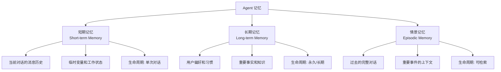
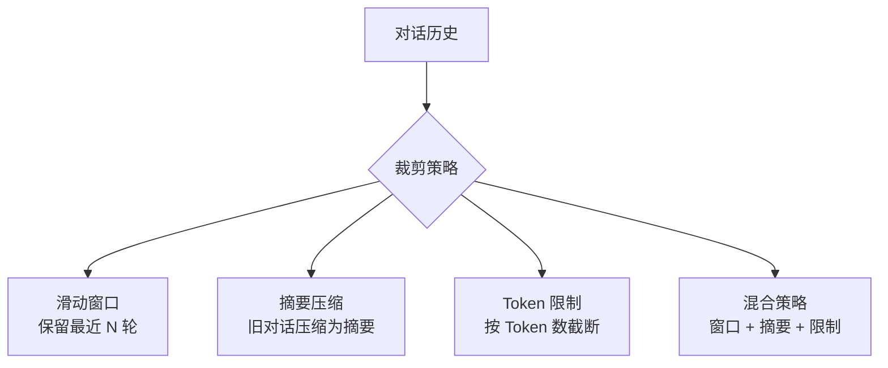
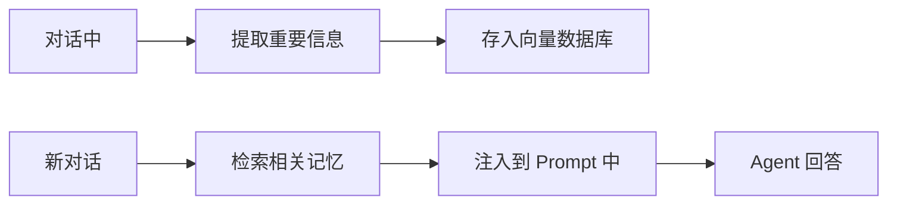
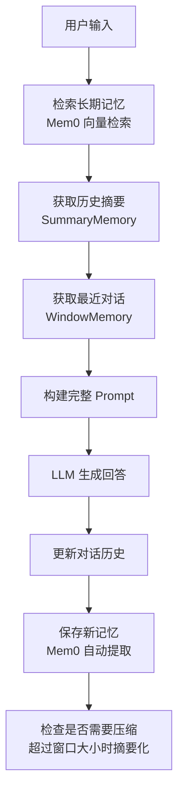

## 引言：没有记忆的 Agent 只能"失忆"

想象一下，如果你每天醒来都忘了前一天发生的所有事情——不记得朋友的名字、不记得正在做的项目、不记得自己的喜好。那你的生活将陷入混乱。

LLM 就是这样的"失忆症患者"。每次对话都是全新的开始，它不记得上一次聊了什么，不记得你的名字和偏好。这在简单的问答场景下没问题，但对于一个 Agent 来说——尤其是需要长期交互的个人助手——**没有记忆就等于没有智能**。

本章我们将深入探讨 Agent 的记忆系统：如何让 Agent "记住"过去的信息，如何在对话之间保持上下文，如何从海量历史中检索相关的记忆。

---

## 为什么 Agent 需要记忆？

### 无状态的 LLM

LLM 本质上是**无状态**的——每次 API 调用都是独立的，模型不会记住之前的内容：

```python
from openai import OpenAI

client = OpenAI(api_key="your-api-key")

# 第一轮对话
response1 = client.chat.completions.create(
    model="gpt-4o",
    messages=[{"role": "user", "content": "我叫张三"}]
)
print(response1.choices[0].message.content)
# 输出: "你好张三！有什么可以帮你的？"

# 第二轮对话（独立的请求，模型不知道之前的对话）
response2 = client.chat.completions.create(
    model="gpt-4o",
    messages=[{"role": "user", "content": "我叫什么名字？"}]
)
print(response2.choices[0].message.content)
# 输出: "抱歉，我不知道您的名字，因为我们还没有自我介绍过。"
```

:::warning 关键理解
LLM 之所以"失忆"，不是因为模型本身没有记忆能力，而是因为**每次 API 调用都是独立的**。模型只在当前请求的消息历史范围内"记忆"。如果你把之前的对话作为消息历史传进去，模型就能"记住"。
:::

### 有状态的对话

要实现"记忆"，最简单的方式就是把历史消息都传给模型：

```python
# 手动维护对话历史
messages = [
    {"role": "user", "content": "我叫张三"},
    {"role": "assistant", "content": "你好张三！"},
    {"role": "user", "content": "我叫什么名字？"},
]

response = client.chat.completions.create(
    model="gpt-4o",
    messages=messages
)
print(response.choices[0].message.content)
# 输出: "你叫张三。"
```

这看起来很简单，但问题在于：**随着对话越来越长，Token 消耗会越来越大，最终超出模型的上下文窗口限制**。

---

## 记忆的类型

Agent 的记忆可以分为三类：



### 短期记忆（Short-term Memory）

- **定义**：当前对话的上下文，包括最近几轮的消息
- **存储**：直接放在 messages 数组中
- **特点**：容量有限（Token 限制），随对话增长
- **类比**：你的"工作记忆"——能记住当前在做什么，但容量有限

### 长期记忆（Long-term Memory）

- **定义**：跨对话持久存储的信息，如用户偏好、重要事实
- **存储**：向量数据库、键值存储、文件系统
- **特点**：容量大，需要检索才能使用
- **类比**：你的"长期记忆"——记得自己的名字、爱好、经历

### 情景记忆（Episodic Memory）

- **定义**：过去对话的完整记录，可以按场景检索
- **存储**：结构化的对话日志，带时间戳和标签
- **特点**：保留完整的上下文，检索成本较高
- **类比**：你的"日记"——记得某天发生了什么，在什么场景下

:::tip 实际应用中
大多数 Agent 应用只需要**短期记忆 + 长期记忆**的组合。情景记忆适合需要精确回溯历史对话的场景（如客服系统、心理咨询）。
:::

---

## 对话历史管理

### 直接传历史消息

最简单的方式——把所有历史消息都传给模型：

```python
class SimpleChatBot:
    def __init__(self):
        self.messages = []
    
    def chat(self, user_input: str) -> str:
        self.messages.append({"role": "user", "content": user_input})
        
        response = client.chat.completions.create(
            model="gpt-4o",
            messages=self.messages
        )
        
        assistant_message = response.choices[0].message.content
        self.messages.append({"role": "assistant", "content": assistant_message})
        
        return assistant_message

bot = SimpleChatBot()
print(bot.chat("我叫张三，是一名 Java 开发者"))
print(bot.chat("我喜欢用 Spring Boot"))
print(bot.chat("你还记得我的名字和职业吗？"))

# 运行结果:
# 你好张三！很高兴认识你，作为一名 Java 开发者，你一定对 Spring Boot 很熟悉吧！
# Spring Boot 确实是个很棒的框架！它让 Java 开发变得简单高效...
# 当然记得！你叫张三，是一名 Java 开发者，喜欢使用 Spring Boot 框架。
```

**问题**：随着对话轮数增加，messages 越来越长，最终会超出 Token 限制。

```python
# 假设每轮对话平均 200 tokens
# GPT-4o 的上下文窗口: 128,000 tokens
# 理论上可以保留约 640 轮对话
# 但实际中，加上 System Prompt 和 Function Calling 定义，
# 可用空间会更少

# 而且费用也会线性增长！
# 100 轮对话 = 20,000 tokens 的历史 = 每次请求都付这些钱
```

:::danger Token 消耗陷阱
直接传历史消息的问题不仅是可能超出上下文窗口，还有**费用**。每条消息都会在每个请求中被发送和计费。100 轮对话后，每次请求都要为 100 轮的历史买单。
:::

### 历史裁剪策略

为了控制 Token 消耗，我们需要对历史消息进行裁剪。常见的策略有：



#### 策略 1：滑动窗口（Sliding Window）

只保留最近 N 轮对话，丢弃更早的：

```python
class WindowChatBot:
    def __init__(self, max_turns: int = 10):
        self.messages = []
        self.max_turns = max_turns
    
    def chat(self, user_input: str) -> str:
        self.messages.append({"role": "user", "content": user_input})
        
        # 裁剪：只保留最近 max_turns 轮（2N 条消息）
        if len(self.messages) > self.max_turns * 2:
            self.messages = self.messages[-self.max_turns * 2:]
        
        response = client.chat.completions.create(
            model="gpt-4o",
            messages=self.messages
        )
        
        reply = response.choices[0].message.content
        self.messages.append({"role": "assistant", "content": reply})
        return reply

bot = WindowChatBot(max_turns=5)

# 对话 1-5: 正常保留
for i in range(5):
    bot.chat(f"第 {i+1} 轮对话")
    print(f"  历史消息数: {len(bot.messages)}")

# 对话 6+: 旧消息被丢弃
for i in range(5, 10):
    bot.chat(f"第 {i+1} 轮对话")
    print(f"  历史消息数: {len(bot.messages)}")

# 运行结果:
#   历史消息数: 2
#   历史消息数: 4
#   历史消息数: 6
#   历史消息数: 8
#   历史消息数: 10
#   历史消息数: 10    ← 开始裁剪
#   历史消息数: 10
#   历史消息数: 10
#   历史消息数: 10
#   历史消息数: 10
```

:::warning 滑动窗口的缺陷
滑动窗口简单粗暴，但会丢失重要信息。比如用户在第 1 轮说了"我对花生过敏"，但第 11 轮问"我能吃什么？"时，这条信息已经被丢弃了。
:::

#### 策略 2：摘要压缩（Summary Compression）

定期将旧的对话历史压缩为一段摘要，只保留摘要和最近的完整对话：

```python
class SummaryChatBot:
    def __init__(self, max_recent: int = 6, summarize_after: int = 10):
        self.messages = []
        self.summary = ""
        self.max_recent = max_recent
        self.summarize_after = summarize_after
    
    def _summarize(self):
        """将旧消息压缩为摘要"""
        old_messages = self.messages[:-self.max_recent]
        if not old_messages:
            return
        
        summary_prompt = f"""请将以下对话历史总结为一段简洁的摘要，
        保留关键信息（用户身份、偏好、重要决定、待办事项）：

对话历史:
{self._format_messages(old_messages)}

摘要:"""
        
        response = client.chat.completions.create(
            model="gpt-4o",
            messages=[{"role": "user", "content": summary_prompt}],
            temperature=0
        )
        
        self.summary = response.choices[0].message.content
        self.messages = self.messages[-self.max_recent:]
        print(f"  [摘要生成] 保留了 {len(self.messages)} 条最近消息")
    
    def _format_messages(self, messages):
        result = []
        for msg in messages:
            role = "用户" if msg["role"] == "user" else "助手"
            result.append(f"{role}: {msg['content'][:100]}")
        return "\n".join(result)
    
    def _get_context(self):
        """构建完整的上下文"""
        context = []
        if self.summary:
            context.append({
                "role": "system",
                "content": f"以下是之前对话的摘要：\n{self.summary}"
            })
        context.extend(self.messages)
        return context
    
    def chat(self, user_input: str) -> str:
        self.messages.append({"role": "user", "content": user_input})
        
        # 检查是否需要压缩
        if len(self.messages) >= self.summarize_after:
            self._summarize()
        
        context = self._get_context()
        
        response = client.chat.completions.create(
            model="gpt-4o",
            messages=context
        )
        
        reply = response.choices[0].message.content
        self.messages.append({"role": "assistant", "content": reply})
        return reply

# 测试
bot = SummaryChatBot(max_recent=4, summarize_after=6)

print("对话阶段:")
bot.chat("我叫张三，是 Java 开发者，喜欢 Spring Boot")
bot.chat("我最近在学 AI 应用开发")
bot.chat("我的公司叫 TechCorp，做企业级 SaaS")
bot.chat("我对花生过敏，不喜欢香菜")
bot.chat("我的邮箱是 zhangsan@techcorp.com")
print(f"  消息数: {len(bot.messages)}")

print("\n触发摘要:")
bot.chat("帮我记住这些信息")
# [摘要生成] 保留了 4 条最近消息
print(f"  消息数: {len(bot.messages)}")
print(f"  摘要: {bot.summary[:200]}...")

print("\n新对话（使用摘要）:")
print(bot.chat("你还记得我叫什么名字，在哪家公司工作吗？"))

# 运行结果:
# 对话阶段:
#   消息数: 2
#   消息数: 4
#   消息数: 6
#   消息数: 8
#   消息数: 10
#
# 触发摘要:
#   [摘要生成] 保留了 4 条最近消息
#   消息数: 6
#   摘要: 用户张三是一名 Java 开发者，喜欢 Spring Boot 框架，正在学习 AI 应用开发。他在 TechCorp 公司工作，该公司从事企业级 SaaS 业务。用户有花生过敏和不喜香菜的饮食限制...
#
# 新对话（使用摘要）:
# 当然记得！你叫张三，在 TechCorp 公司工作，这是一家从事企业级 SaaS 业务的公司。你是一名 Java 开发者，喜欢使用 Spring Boot 框架...
```

#### 策略 3：Token 限制

按 Token 数量截断，确保不超过模型的上下文窗口：

```python
import tiktoken

class TokenLimitedChatBot:
    def __init__(self, max_tokens: int = 8000, model: str = "gpt-4o"):
        self.messages = []
        self.max_tokens = max_tokens
        self.encoding = tiktoken.encoding_for_model(model)
    
    def _count_tokens(self, messages):
        """计算消息列表的 Token 数"""
        total = 0
        for msg in messages:
            total += len(self.encoding.encode(msg["content"]))
            total += 4  # 每条消息的格式开销（role, content 等标记）
        return total
    
    def _trim_messages(self):
        """裁剪消息直到 Token 数在限制内"""
        while self._count_tokens(self.messages) > self.max_tokens:
            # 每次移除最早的一对消息（user + assistant）
            if len(self.messages) >= 2:
                self.messages = self.messages[2:]
            else:
                break
    
    def chat(self, user_input: str) -> str:
        self.messages.append({"role": "user", "content": user_input})
        self._trim_messages()
        
        response = client.chat.completions.create(
            model="gpt-4o",
            messages=self.messages
        )
        
        reply = response.choices[0].message.content
        self.messages.append({"role": "assistant", "content": reply})
        return reply
```

#### 策略对比

| 策略 | 优点 | 缺点 | 适用场景 |
|---|---|---|---|
| 滑动窗口 | 实现简单，Token 可预测 | 丢失旧信息 | 短对话、简单任务 |
| 摘要压缩 | 保留关键信息，Token 可控 | 摘要可能丢失细节 | 长对话、个人助手 |
| Token 限制 | 精确控制 | 实现稍复杂，也可能丢失信息 | 生产环境 |

:::tip 最佳实践
大多数生产环境使用**混合策略**：保留最近 N 轮完整对话 + 更早的对话摘要 + Token 上限兜底。这样既有最近的精确上下文，又有长期的关键信息。
:::

---

## 长期记忆

对话历史管理解决的是"当前对话中怎么保留上下文"。但如果你希望 Agent 跨对话记住信息（比如记住用户的名字、偏好），就需要**长期记忆**。

### 向量存储对话历史

最常用的长期记忆方案：把每条重要信息存入向量数据库，新对话时通过语义检索获取相关记忆。



```python
from openai import OpenAI
import json

client = OpenAI(api_key="your-api-key")

# ========== 简单的向量记忆存储 ==========

class VectorMemory:
    """基于文本匹配的简单记忆存储（生产环境应使用真正的向量数据库）"""
    
    def __init__(self):
        self.memories = []  # [{"text": "...", "embedding": [...], "metadata": {...}}]
    
    def add(self, text: str, metadata: dict = None):
        """存储一条记忆"""
        # 生成 embedding
        response = client.embeddings.create(
            model="text-embedding-3-small",
            input=text
        )
        embedding = response.data[0].embedding
        
        self.memories.append({
            "text": text,
            "embedding": embedding,
            "metadata": metadata or {}
        })
        print(f"  [记忆存储] {text[:50]}...")
    
    def search(self, query: str, top_k: int = 3) -> list:
        """检索相关记忆"""
        if not self.memories:
            return []
        
        # 生成查询的 embedding
        response = client.embeddings.create(
            model="text-embedding-3-small",
            input=query
        )
        query_embedding = response.data[0].embedding
        
        # 计算余弦相似度
        scored = []
        for mem in self.memories:
            similarity = self._cosine_similarity(query_embedding, mem["embedding"])
            scored.append((similarity, mem))
        
        # 排序并返回 top_k
        scored.sort(key=lambda x: x[0], reverse=True)
        return [item[1]["text"] for item in scored[:top_k]]
    
    def _cosine_similarity(self, a, b):
        """计算余弦相似度"""
        dot_product = sum(x * y for x, y in zip(a, b))
        norm_a = sum(x ** 2 for x in a) ** 0.5
        norm_b = sum(x ** 2 for x in b) ** 0.5
        return dot_product / (norm_a * norm_b) if norm_a > 0 and norm_b > 0 else 0

# ========== 使用 ==========

memory = VectorMemory()

# 存储记忆
memory.add("用户叫张三，是一名 Java 开发者", {"type": "identity"})
memory.add("用户喜欢使用 Spring Boot 和 MyBatis 框架", {"type": "preference"})
memory.add("用户对花生过敏，不喜欢香菜", {"type": "health"})
memory.add("用户的公司叫 TechCorp，做企业级 SaaS", {"type": "work"})
memory.add("用户最近在学习 AI 应用开发和大模型", {"type": "interest"})

# 检索相关记忆
print("\n检索 '我的名字是什么':")
results = memory.search("我的名字是什么")
for r in results:
    print(f"  - {r}")

print("\n检索 '我能吃什么':")
results = memory.search("我能吃什么食物")
for r in results:
    print(f"  - {r}")

# 运行结果:
#   [记忆存储] 用户叫张三，是一名 Java 开发者...
#   [记忆存储] 用户喜欢使用 Spring Boot 和 MyBatis 框架...
#   [记忆存储] 用户对花生过敏，不喜欢香菜...
#   [记忆存储] 用户的公司叫 TechCorp，做企业级 SaaS...
#   [记忆存储] 用户最近在学习 AI 应用开发和大模型...
#
# 检索 '我的名字是什么':
#   - 用户叫张三，是一名 Java 开发者
#   - 用户的公司叫 TechCorp，做企业级 SaaS
#   - 用户喜欢使用 Spring Boot 和 MyBatis 框架
#
# 检索 '我能吃什么食物':
#   - 用户对花生过敏，不喜欢香菜
#   - 用户喜欢使用 Spring Boot 和 MyBatis 框架
#   - 用户叫张三，是一名 Java 开发者
```

### 实体记忆

从对话中自动提取关键实体（人名、地点、偏好等），结构化存储：

```python
def extract_entities(conversation: str) -> list:
    """从对话中提取实体"""
    prompt = f"""从以下对话中提取关键实体信息，以 JSON 数组格式返回。
每个实体包含: type（类型）、name（名称）、value（值）、confidence（置信度 0-1）。

对话:
{conversation}

输出格式:
[{{"type": "名字", "name": "用户姓名", "value": "张三", "confidence": 0.95}}]"""

    response = client.chat.completions.create(
        model="gpt-4o",
        messages=[{"role": "user", "content": prompt}],
        temperature=0
    )
    
    try:
        return json.loads(response.choices[0].message.content)
    except:
        return []

# 测试
conversation = """
用户: 我叫张三，是 Java 开发者
助手: 你好张三！
用户: 我在 TechCorp 工作，做 SaaS 产品
用户: 对了，我对花生过敏
"""

entities = extract_entities(conversation)
for e in entities:
    print(f"  [{e['type']}] {e['name']}: {e['value']} (置信度: {e['confidence']})")

# 运行结果:
#   [姓名] 用户姓名: 张三 (置信度: 0.95)
#   [职业] 职业: Java 开发者 (置信度: 0.95)
#   [公司] 工作单位: TechCorp (置信度: 0.9)
#   [行业] 公司业务: SaaS 产品 (置信度: 0.85)
#   [健康] 过敏源: 花生 (置信度: 0.95)
```

### 时间线记忆

按时间组织记忆，便于回溯：

```python
from datetime import datetime

class TimelineMemory:
    """时间线记忆"""
    
    def __init__(self):
        self.events = []
    
    def add_event(self, content: str, event_type: str = "general"):
        """添加事件"""
        self.events.append({
            "timestamp": datetime.now().isoformat(),
            "content": content,
            "type": event_type
        })
    
    def get_recent(self, hours: int = 24) -> list:
        """获取最近 N 小时的事件"""
        from datetime import timedelta
        cutoff = datetime.now() - timedelta(hours=hours)
        return [
            e for e in self.events
            if datetime.fromisoformat(e["timestamp"]) > cutoff
        ]
    
    def get_by_type(self, event_type: str) -> list:
        """按类型筛选事件"""
        return [e for e in self.events if e["type"] == event_type]
    
    def summary(self) -> str:
        """生成时间线摘要"""
        lines = []
        for e in self.events[-10:]:  # 最近 10 条
            lines.append(f"[{e['timestamp'][:16]}] [{e['type']}] {e['content']}")
        return "\n".join(lines)

# 使用
timeline = TimelineMemory()
timeline.add_event("用户说叫张三，Java 开发者", "identity")
timeline.add_event("用户提到对花生过敏", "health")
timeline.add_event("用户询问 Spring Boot 最佳实践", "interest")

print(timeline.summary())

# 运行结果:
# [2024-01-15T10:30] [identity] 用户说叫张三，Java 开发者
# [2024-01-15T10:31] [health] 用户提到对花生过敏
# [2024-01-15T10:32] [interest] 用户询问 Spring Boot 最佳实践
```

---

## LangChain 中的记忆

LangChain 提供了多种开箱即用的记忆组件。

### 安装

```bash
pip install langchain langchain-openai langchain-community
```

### ConversationBufferMemory

最简单的记忆——保存所有对话历史（等于直接传 messages）：

```python
from langchain_openai import ChatOpenAI
from langchain.memory import ConversationBufferMemory
from langchain.chains import ConversationChain

llm = ChatOpenAI(model="gpt-4o", temperature=0)

# 创建带记忆的对话链
memory = ConversationBufferMemory()
conversation = ConversationChain(llm=llm, memory=memory, verbose=True)

# 对话
print(conversation.predict(input="我叫张三"))
# > Entering new ConversationChain chain...
# Prompt after formatting:
# The following is a friendly conversation between a human and an AI...
# Current conversation:
# Human: 我叫张三
# AI:
# 你好张三！很高兴认识你...

print(conversation.predict(input="我叫什么名字？"))
# Current conversation:
# Human: 我叫张三
# AI: 你好张三！很高兴认识你...
# Human: 我叫什么名字？
# AI:
# 你叫张三。

# 查看存储的记忆
print(memory.buffer)
# Human: 我叫张三\nAI: 你好张三！\nHuman: 我叫什么名字？\nAI: 你叫张三。
```

### ConversationSummaryMemory

摘要记忆——自动将旧对话压缩为摘要：

```python
from langchain.memory import ConversationSummaryMemory

memory = ConversationSummaryMemory(llm=llm)
conversation = ConversationChain(llm=llm, memory=memory, verbose=True)

print(conversation.predict(input="我叫张三，是 Java 开发者"))
print(conversation.predict(input="我在 TechCorp 工作"))
print(conversation.predict(input="我对花生过敏"))
print(conversation.predict(input="我喜欢 Spring Boot"))

# 查看摘要
print("\n记忆摘要:")
print(memory.buffer)

# 运行结果:
# 记忆摘要:
# 张三自我介绍是一名 Java 开发者，在 TechCorp 公司工作。
# 他提到对花生过敏，并且喜欢使用 Spring Boot 框架。
```

### ConversationBufferWindowMemory

窗口记忆——只保留最近 K 轮对话：

```python
from langchain.memory import ConversationBufferWindowMemory

memory = ConversationBufferWindowMemory(k=2)  # 保留最近 2 轮
conversation = ConversationChain(llm=llm, memory=memory)

conversation.predict(input="我叫张三")
conversation.predict(input="我是 Java 开发者")
conversation.predict(input="我喜欢 Spring Boot")

# 只保留了最近 2 轮
print(memory.buffer)
# Human: 我是 Java 开发者\nAI: ...\nHuman: 我喜欢 Spring Boot\nAI: ...
# （"我叫张三" 被丢弃了）
```

### VectorStoreRetrieverMemory

向量检索记忆——将对话存入向量数据库，按语义相似度检索：

```python
from langchain.memory import VectorStoreRetrieverMemory
from langchain_openai import OpenAIEmbeddings
from langchain_community.vectorstores import FAISS

# 创建向量存储
embedding = OpenAIEmbeddings()
vectorstore = FAISS.from_texts(
    ["用户叫张三，Java 开发者", "用户喜欢 Spring Boot", "用户对花生过敏"],
    embedding=embedding
)

# 创建检索器
retriever = vectorstore.as_retriever(search_kwargs={"k": 2})

# 创建记忆
memory = VectorStoreRetrieverMemory(retriever=retriever)

# 保存记忆
memory.save_context(
    {"input": "我叫张三"},
    {"output": "你好张三！"}
)
memory.save_context(
    {"input": "我对花生过敏"},
    {"output": "已记录，我会注意推荐食物时避开花生。"}
)

# 检索相关记忆
relevant = memory.load_memory_variables({"prompt": "用户有什么过敏？"})
print(relevant)

# 运行结果:
# {'history': 'Human: 我对花生过敏\nAI: 已记录，我会注意推荐食物时避开花生。'}
```

### 记忆类型对比

| 类型 | 存储 | 检索 | Token 消耗 | 适用场景 |
|---|---|---|---|---|
| BufferMemory | 全部消息 | 直接读取 | 高（线性增长） | 短对话 |
| WindowMemory | 最近 K 轮 | 直接读取 | 固定（2K×Token） | 中等长度对话 |
| SummaryMemory | 摘要文本 | 直接读取 | 低且可控 | 长对话 |
| VectorStoreMemory | 向量数据库 | 语义检索 | 取决于检索数量 | 跨对话长期记忆 |

:::tip 生产环境建议
生产环境通常组合使用：
- **WindowMemory**（短期）：保留最近几轮的精确上下文
- **SummaryMemory**（中期）：更早对话的摘要
- **VectorStoreMemory**（长期）：跨会话的用户偏好和重要信息
:::

---

## Mem0 开源记忆层

[Mem0](https://github.com/mem0ai/mem0) 是一个专门为 AI Agent 设计的开源记忆层，能自动从对话中提取、存储和检索记忆。

### 安装

```bash
pip install mem0ai
```

### 基本使用

```python
from mem0 import Memory

# 初始化
m = Memory()

# 添加记忆（用户 ID 关联）
m.add("我叫张三，是 Java 开发者", user_id="zhangsan")
m.add("我喜欢 Spring Boot 和 MyBatis", user_id="zhangsan")
m.add("我对花生过敏", user_id="zhangsan")
m.add("我在 TechCorp 公司工作", user_id="zhangsan")

# 运行结果:
# [INFO] Adding memory...
# [INFO] Found 1 memory items: 我叫张三，是 Java 开发者
# [INFO] Found 1 memory items: 我喜欢 Spring Boot 和 MyBatis
# [INFO] Found 1 memory items: 我对花生过敏
# [INFO] Found 1 memory items: 我在 TechCorp 公司工作

# 检索记忆
print("\n检索 '我的职业':")
memories = m.search("我的职业是什么", user_id="zhangsan")
for mem in memories:
    print(f"  - {mem['memory']} (相关性: {mem['score']:.2f})")

# 运行结果:
# 检索 '我的职业':
#   - 我叫张三，是 Java 开发者 (相关性: 0.85)
#   - 我在 TechCorp 公司工作 (相关性: 0.62)

print("\n检索 '食物过敏':")
memories = m.search("食物过敏", user_id="zhangsan")
for mem in memories:
    print(f"  - {mem['memory']} (相关性: {mem['score']:.2f})")

# 运行结果:
# 检索 '食物过敏':
#   - 我对花生过敏 (相关性: 0.92)

# 获取所有记忆
print("\n所有记忆:")
all_memories = m.get_all(user_id="zhangsan")
for mem in all_memories:
    print(f"  [{mem['id']}] {mem['memory']}")
    print(f"       创建时间: {mem['created_at']}")

# 运行结果:
# 所有记忆:
#   [abc123] 我叫张三，是 Java 开发者
#        创建时间: 2024-01-15T10:30:00
#   [def456] 我喜欢 Spring Boot 和 MyBatis
#        创建时间: 2024-01-15T10:30:01
#   [ghi789] 我对花生过敏
#        创建时间: 2024-01-15T10:30:02
#   [jkl012] 我在 TechCorp 公司工作
#        创建时间: 2024-01-15T10:30:03

# 更新记忆
m.update("abc123", "我叫张三，是高级 Java 开发工程师，有 5 年经验")

# 删除记忆
m.delete("ghi789")
```

### Mem0 与 Chat 集成

Mem0 可以直接集成到对话中，自动管理记忆：

```python
from mem0 import Memory

m = Memory()

def chat_with_memory(user_input: str, user_id: str = "zhangsan") -> str:
    """带记忆的对话"""
    
    # 1. 检索相关记忆
    relevant_memories = m.search(user_input, user_id=user_id)
    memory_context = "\n".join([f"- {mem['memory']}" for mem in relevant_memories])
    
    # 2. 构建带记忆的 Prompt
    system_prompt = f"""你是一个有记忆的个人助手。以下是关于用户的已知信息：
{memory_context if memory_context else '（暂无已知信息）'}

请根据这些信息回答用户的问题。如果用户提到了新的个人信息，请在回答中自然地确认。"""
    
    # 3. 调用 LLM
    response = client.chat.completions.create(
        model="gpt-4o",
        messages=[
            {"role": "system", "content": system_prompt},
            {"role": "user", "content": user_input}
        ]
    )
    
    reply = response.choices[0].message.content
    
    # 4. 存储新记忆
    m.add(user_input, user_id=user_id)
    
    return reply

# 测试
print("=== 新用户对话 ===")
print(chat_with_memory("我叫张三，是 Java 开发者"))
print(chat_with_memory("我在 TechCorp 工作"))
print(chat_with_memory("我对花生过敏"))

print("\n=== 模拟新会话（记忆仍在） ===")
print(chat_with_memory("你还记得我是谁吗？我有什么过敏？"))

# 运行结果:
# === 新用户对话 ===
# 你好张三！很高兴认识一位 Java 开发者。有什么可以帮你的吗？
# TechCorp 是一家不错的公司！你在那里主要负责什么方向呢？
# 好的，我已经记住了。以后推荐食物或餐厅时会避开含花生的选项。
#
# === 模拟新会话（记忆仍在） ===
# 当然记得！你叫张三，是一名 Java 开发者，在 TechCorp 工作。你提到对花生过敏，我会注意在推荐食物时避开花生及含花生的制品。
```

:::tip Mem0 的优势
Mem0 相比手动实现的记忆管理：
1. **自动提取**：不需要手动定义提取规则
2. **智能去重**：相似的记忆会自动合并
3. **冲突检测**：当新信息与旧记忆矛盾时，会自动更新
4. **多用户支持**：通过 user_id 隔离不同用户的记忆
5. **开源免费**：可以自托管，数据完全可控
:::

---

## 记忆的评估

怎么知道你的记忆系统好不好？需要关注以下几个指标：

### 1. 召回率（Recall）

当需要某条记忆时，系统能检索到的比例。

```python
def evaluate_recall(memory_system, test_cases):
    """评估记忆召回率"""
    hits = 0
    total = len(test_cases)
    
    for query, expected_ids in test_cases:
        results = memory_system.search(query)
        result_ids = {r["id"] for r in results}
        
        if any(eid in result_ids for eid in expected_ids):
            hits += 1
            print(f"  [✓] '{query}' → 找到相关记忆")
        else:
            print(f"  [✗] '{query}' → 未找到相关记忆")
    
    print(f"\n召回率: {hits}/{total} = {hits/total:.1%}")
    return hits / total

# 测试用例
test_cases = [
    ("我的职业", ["mem_001"]),      # 应该召回"Java 开发者"
    ("食物过敏", ["mem_003"]),      # 应该召回"花生过敏"
    ("工作单位", ["mem_004"]),      # 应该召回"TechCorp"
]

# recall = evaluate_recall(my_memory, test_cases)
```

### 2. 相关性（Relevance）

检索出的记忆是否真的与查询相关。

```python
def evaluate_relevance(memory_system, test_cases):
    """评估检索相关性"""
    total_score = 0
    
    for query, relevant_count in test_cases:
        results = memory_system.search(query, top_k=5)
        # 人工标注或 LLM 判断前 N 条结果中有多少条是相关的
        print(f"  查询: '{query}'")
        for i, r in enumerate(results):
            print(f"    [{i+1}] {r['memory'][:60]}... (相关: 待标注)")
    
    # 实际中可以用 LLM 来判断相关性
    # 这里简化为人工评估
```

### 3. 一致性（Consistency）

当用户信息更新时，旧记忆是否被正确处理。

```python
# 场景：用户之前说不喜欢咖啡，后来改口说喜欢
memory.add("我不喜欢喝咖啡", user_id="user1")
memory.add("我现在开始喜欢喝咖啡了", user_id="user1")

# 检索
results = memory.search("用户喜欢咖啡吗", user_id="user1")
# 理想结果：应该返回最新的偏好（喜欢），或者同时返回新旧两条并标注更新
```

:::warning 一致性是难点
记忆一致性是多 Agent 和长期记忆系统中最大的挑战之一。用户的偏好可能随时间变化，Agent 需要：
1. 识别矛盾信息（旧记忆说 A，新对话说 not A）
2. 用新信息更新旧记忆（而不是简单追加）
3. 保留变化历史（"用户之前不喜欢 X，现在喜欢了"）

Mem0 在这方面做得比较好，会自动检测和更新矛盾的记忆。
:::

---

## 实战：有长期记忆的个人助手

现在，我们来搭建一个完整的、有长期记忆的个人助手。它能够：

1. **记住用户的个人信息**（名字、职业、偏好等）
2. **跨会话保持记忆**（关闭再打开仍然记得）
3. **智能检索相关记忆**（根据当前问题自动检索）
4. **对话历史管理**（滑动窗口 + 摘要）

```python
import json
import os
from datetime import datetime
from openai import OpenAI
from mem0 import Memory

client = OpenAI(api_key="your-api-key")

# ========== 记忆系统 ==========

class PersonalAssistantMemory:
    """个人助手的记忆系统"""
    
    def __init__(self, user_id: str):
        self.user_id = user_id
        self.mem0 = Memory()
        self.conversation_history = []  # 当前会话的对话历史
        self.max_history = 10  # 保留最近 10 轮
        self.summary = ""      # 更早对话的摘要
    
    def add_to_history(self, role: str, content: str):
        """添加消息到对话历史"""
        self.conversation_history.append({"role": role, "content": content})
        
        # 超过限制时压缩
        if len(self.conversation_history) > self.max_history * 2:
            self._compress_history()
    
    def _compress_history(self):
        """压缩旧对话为摘要"""
        old = self.conversation_history[:self.max_history]
        new = self.conversation_history[self.max_history:]
        
        prompt = "总结以下对话的关键信息：\n"
        for msg in old:
            role = "用户" if msg["role"] == "user" else "助手"
            prompt += f"{role}: {msg['content']}\n"
        
        response = client.chat.completions.create(
            model="gpt-4o",
            messages=[{"role": "user", "content": prompt}],
            temperature=0
        )
        
        self.summary = response.choices[0].message.content
        self.conversation_history = new
        print(f"  [记忆] 对话历史已压缩，保留最近 {len(new)} 条")
    
    def get_context(self, query: str) -> str:
        """获取完整的上下文（记忆 + 摘要 + 最近对话）"""
        parts = []
        
        # 1. 长期记忆
        memories = self.mem0.search(query, user_id=self.user_id)
        if memories:
            memory_text = "\n".join([f"- {m['memory']}" for m in memories])
            parts.append(f"关于用户的已知信息:\n{memory_text}")
        
        # 2. 历史摘要
        if self.summary:
            parts.append(f"之前对话的摘要:\n{self.summary}")
        
        return "\n\n".join(parts)
    
    def save_new_memory(self, user_input: str):
        """保存新的长期记忆"""
        self.mem0.add(user_input, user_id=self.user_id)

# ========== 个人助手 ==========

class PersonalAssistant:
    """有长期记忆的个人助手"""
    
    def __init__(self, user_id: str):
        self.memory = PersonalAssistantMemory(user_id)
    
    def chat(self, user_input: str) -> str:
        """与用户对话"""
        
        # 1. 获取上下文
        context = self.memory.get_context(user_input)
        
        # 2. 构建 Prompt
        system_prompt = f"""你是一个有记忆的个人助手。你的目标是提供个性化、贴心的服务。

{context if context else "暂无关于用户的已知信息。"}

规则：
1. 如果有关于用户的信息，利用这些信息提供个性化的回答
2. 如果用户提到了新的个人信息，自然地确认并记住
3. 语气友好但不谄媚，像一个靠谱的朋友
4. 回答简洁，不要啰嗦"""
        
        messages = [{"role": "system", "content": system_prompt}]
        messages.extend(self.memory.conversation_history)
        messages.append({"role": "user", "content": user_input})
        
        # 3. 调用 LLM
        response = client.chat.completions.create(
            model="gpt-4o",
            messages=messages,
            temperature=0.7
        )
        
        reply = response.choices[0].message.content
        
        # 4. 更新记忆
        self.memory.add_to_history("user", user_input)
        self.memory.add_to_history("assistant", reply)
        self.memory.save_new_memory(user_input)
        
        return reply
    
    def show_memories(self):
        """显示所有记忆"""
        all_memories = self.memory.mem0.get_all(user_id=self.memory.user_id)
        print(f"\n当前用户的所有记忆 ({len(all_memories)} 条):")
        for mem in all_memories:
            print(f"  [{mem['id'][:8]}] {mem['memory']}")

# ========== 测试 ==========

print("=" * 60)
print("🤖 有长期记忆的个人助手")
print("=" * 60)

assistant = PersonalAssistant(user_id="zhangsan")

print("\n--- 第一次会话 ---")
print(f"用户: 你好，我叫张三")
print(f"助手: {assistant.chat('你好，我叫张三')}")

print(f"\n用户: 我是一名 Java 开发者，在 TechCorp 工作")
print(f"助手: {assistant.chat('我是一名 Java 开发者，在 TechCorp 工作')}")

print(f"\n用户: 我对花生过敏，也不喜欢香菜")
print(f"助手: {assistant.chat('我对花生过敏，也不喜欢香菜')}")

print(f"\n用户: 我最近在学 AI 应用开发，特别是 Agent")
print(f"助手: {assistant.chat('我最近在学 AI 应用开发，特别是 Agent')}")

assistant.show_memories()

print("\n--- 模拟新会话（记忆仍在） ---")
new_assistant = PersonalAssistant(user_id="zhangsan")

print(f"\n用户: 你还记得我是谁吗？")
print(f"助手: {new_assistant.chat('你还记得我是谁吗？')}")

print(f"\n用户: 帮我推荐一家适合我的餐厅")
print(f"助手: {new_assistant.chat('帮我推荐一家适合我的餐厅')}")

print(f"\n用户: 有没有适合 Java 开发者学的 AI 框架？")
print(f"助手: {new_assistant.chat('有没有适合 Java 开发者学的 AI 框架？')}")

# 运行结果:
# ============================================================
# 🤖 有长期记忆的个人助手
# ============================================================
#
# --- 第一次会话 ---
# 用户: 你好，我叫张三
# 助手: 你好张三！很高兴认识你。有什么可以帮你的吗？
#
# 用户: 我是一名 Java 开发者，在 TechCorp 工作
# 助手: TechCorp 是做企业级 SaaS 的公司对吧？Java 开发者在 SaaS 领域很有优势。你主要做后端还是全栈？
#
# 用户: 我对花生过敏，也不喜欢香菜
# 助手: 记住了！以后推荐吃的会避开花生和香菜。还有什么其他饮食偏好吗？
#
# 用户: 我最近在学 AI 应用开发，特别是 Agent
# 助手: AI Agent 是个很热门的方向！你作为 Java 开发者，可以关注 Spring AI 和 LangChain4j 这两个框架。
#
# 当前用户的所有记忆 (4 条):
#   [abc12345] 我叫张三
#   [def67890] 我是一名 Java 开发者，在 TechCorp 工作
#   [ghi11223] 我对花生过敏，也不喜欢香菜
#   [jkl44556] 我最近在学 AI 应用开发，特别是 Agent
#
# --- 模拟新会话（记忆仍在） ---
# 用户: 你还记得我是谁吗？
# 助手: 当然记得！你叫张三，是一名 Java 开发者，在 TechCorp 工作。最近在学习 AI 应用开发，特别是 Agent 方向。
#
# 用户: 帮我推荐一家适合我的餐厅
# 助手: 基于你的情况，我推荐你试试以下类型的餐厅：
# 1. 川菜馆（选不含花生的菜品，如麻婆豆腐可以用腰果代替花生）
# 2. 日料店（通常不用香菜，也较少使用花生）
# 3. 意大利餐厅（基本不涉及花生和香菜）
# 记得点菜时跟服务员确认一下哦！
#
# 用户: 有没有适合 Java 开发者学的 AI 框架？
# 助手: 作为 Java 开发者，推荐你关注这几个框架：
# 1. **Spring AI** - Spring 生态的 AI 集成框架，和 Spring Boot 无缝集成
# 2. **LangChain4j** - LangChain 的 Java 版本，API 设计更符合 Java 习惯
# 3. **Semantic Kernel Java** - 微软的 AI 编排框架
# 你现在在学 Agent 相关的内容，Spring AI 和 LangChain4j 都对 Agent 开发有很好的支持。
```

这个完整的个人助手架构可以概括为：



:::tip 三层记忆架构
这个实战用了一个**三层记忆架构**：
1. **长期记忆层**（Mem0）：跨会话持久化，语义检索
2. **中期记忆层**（摘要）：旧对话的压缩表示
3. **短期记忆层**（窗口）：最近几轮的完整对话

这是目前最成熟的 Agent 记忆架构，在生产环境中被广泛使用。
:::

---

## 总结

记忆系统是 Agent 从"聊天机器人"进化为"真正的助手"的关键能力。

**核心要点回顾：**

1. **LLM 是无状态的**，需要通过消息历史实现"记忆"
2. **三种记忆类型**：短期（当前对话）、长期（跨对话持久化）、情景（完整历史）
3. **对话历史管理**：滑动窗口、摘要压缩、Token 限制——各有优劣
4. **长期记忆实现**：向量存储 + 语义检索是最主流的方案
5. **LangChain 记忆组件**：Buffer、Window、Summary、VectorStore
6. **Mem0**：开源记忆层，自动提取和检索，推荐使用
7. **记忆评估**：召回率、相关性、一致性
8. **最佳实践**：三层架构（长期向量记忆 + 中期摘要 + 短期窗口）

**至此，Agent 模块的四个核心能力全部讲完：**

| 章节 | 能力 | 关键词 |
|---|---|---|
| Function Calling | 调用工具 | tools、tool_calls、role: tool |
| ReAct | 推理行动 | Thought → Action → Observation |
| 多 Agent | 协作分工 | Supervisor、CrewAI、LangGraph |
| 记忆系统 | 记住信息 | 短期/长期记忆、向量检索、Mem0 |

掌握了这四个能力，你就具备了构建任意 Agent 应用的基础。接下来可以尝试将它们组合起来，构建更复杂的 AI 应用。

---

## 练习题

### 题目 1：记忆策略选择

为以下场景选择最合适的记忆策略，并说明理由：
1. 一个一次性使用的代码生成工具（用户输入需求，生成代码）
2. 一个长期使用的个人健康助手（需要记住用户的健康状况、用药记录）
3. 一个客服机器人（需要记住当前对话的上下文，但不需要跨对话记忆）
4. 一个心理咨询 AI（需要完整的对话历史和时间线）

### 题目 2：实现摘要压缩

手动实现一个对话历史压缩器：
1. 当消息超过 20 条时，自动触发压缩
2. 将最早 10 条消息压缩为摘要（调用 LLM）
3. 保留摘要 + 最近 10 条消息
4. 测试：连续对话 30 轮，验证压缩是否正常工作

### 题目 3：向量记忆实现

不使用 Mem0，手动实现一个向量记忆系统：
1. 使用 FAISS 或 Chroma 作为向量数据库
2. 从对话中自动提取重要信息（调用 LLM）
3. 存储为向量
4. 新对话时检索相关记忆
5. 测试存储 10 条记忆，验证检索准确性

### 题目 4：记忆冲突处理

实现记忆冲突检测和解决机制：
1. 检测新信息是否与已有记忆矛盾（如之前说"不喜欢 X"，现在说"喜欢 X"）
2. 更新旧记忆而不是简单追加
3. 保留变化历史（"2024-01 改为喜欢 X"）
4. 测试：用户先说"我不用 Mac"，一周后说"我最近换了 MacBook"

### 题目 5：完整记忆助手

搭建一个有完整记忆系统的客服助手：
1. 支持多用户（通过 user_id 隔离）
2. 记住用户的个人信息和偏好
3. 记住用户的历史问题和解决方案
4. 新对话时能利用历史记忆提供更精准的服务
5. 实现记忆的增删改查接口

### 题目 6：记忆 vs 上下文窗口

分析以下问题：
1. 如果模型的上下文窗口无限大（比如 1 亿 Token），还需要记忆系统吗？为什么？
2. 摘要压缩会丢失信息吗？如何最小化信息丢失？
3. 在什么情况下，"记住所有对话原文"比"只记摘要"更好？反过来呢？
4. 如何评估你的记忆系统是否"记住了对的东西"？
