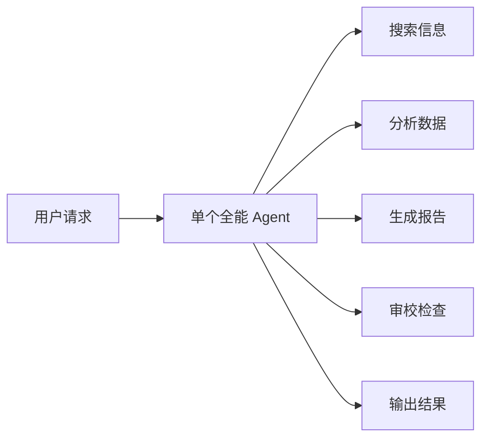
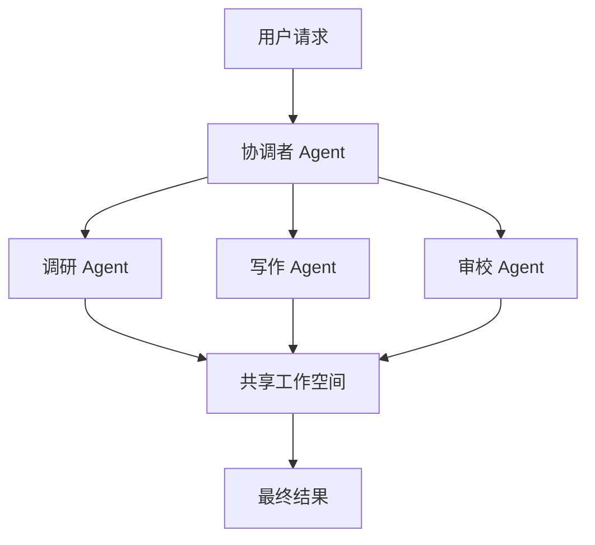
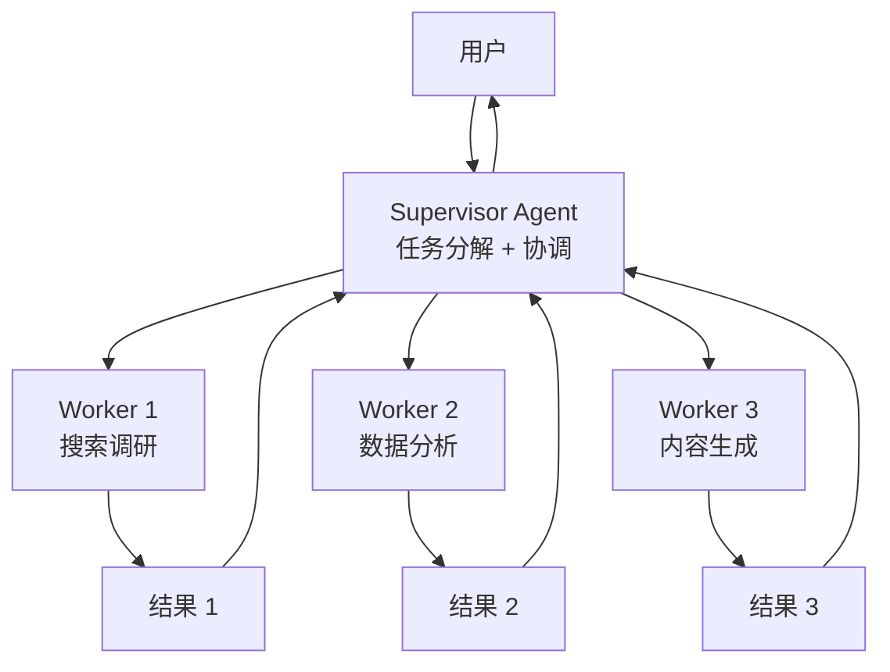
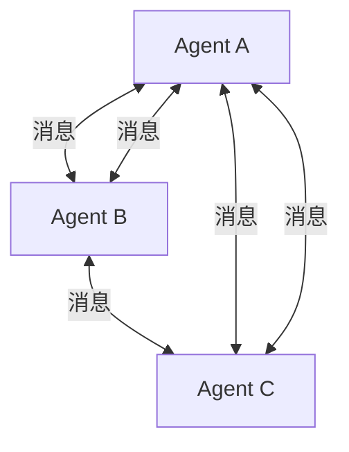
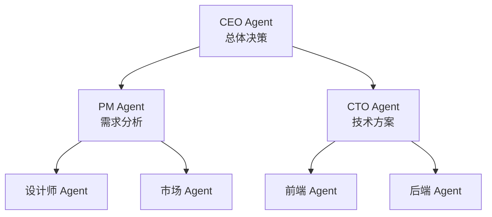
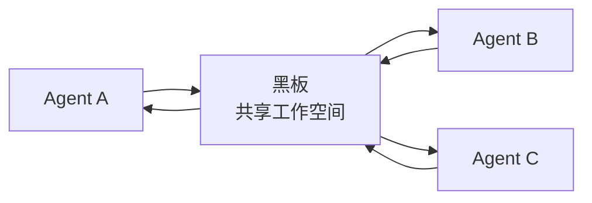
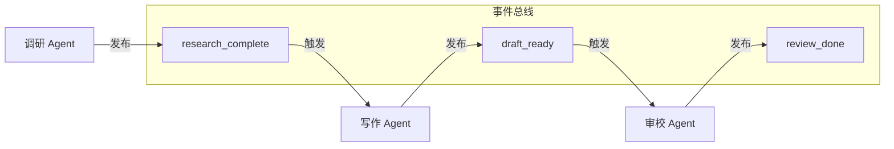
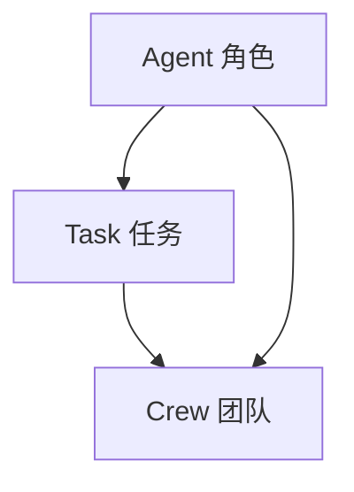
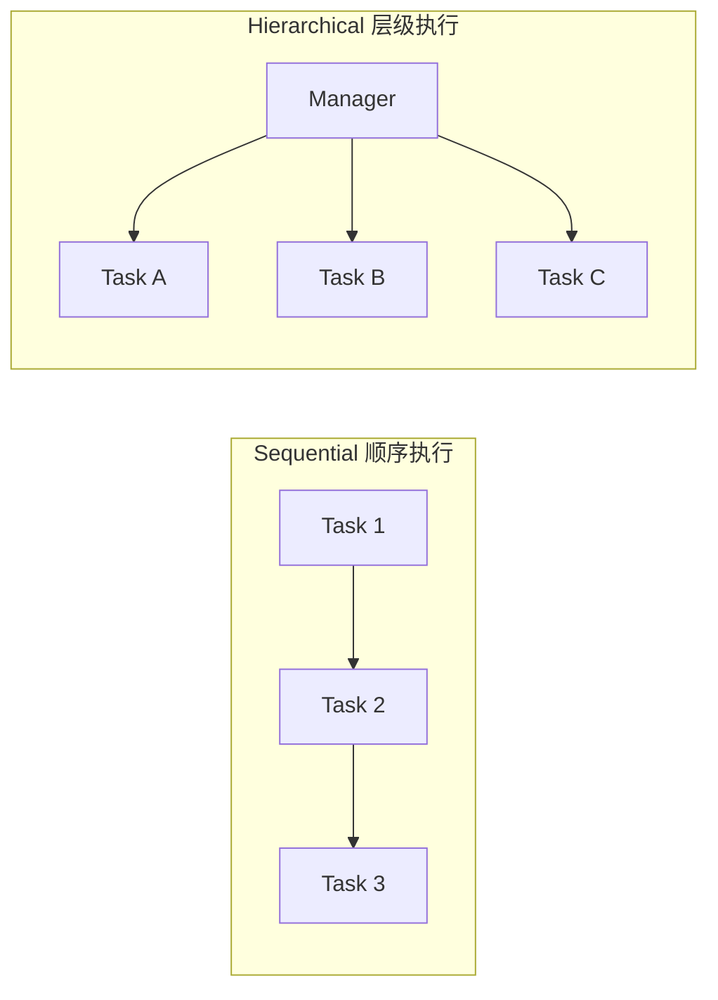
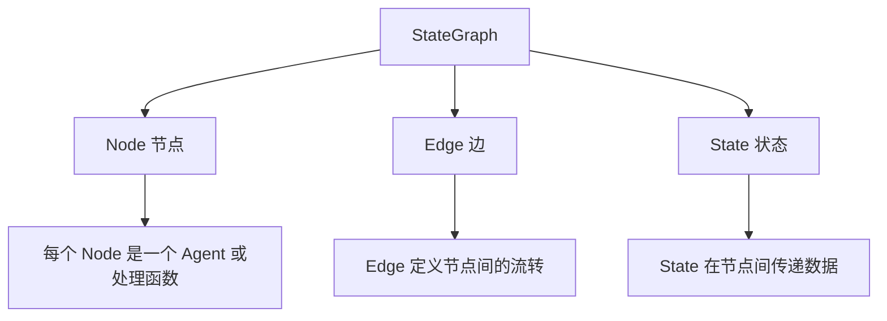

## 引言：一个人干不完的活，一群人来

前面两章，我们学习了 Function Calling（让 Agent 调用工具）和 ReAct（让 Agent 逐步推理）。但这些都还是**单个 Agent** 在工作——就像一个全栈工程师，既要写代码、又要做测试、还要写文档，虽然能力很强，但效率和专业化程度都不够。

真实世界的复杂任务往往需要**分工协作**。写一篇文章需要有人调研、有人写作、有人审校。开发一个项目需要产品经理、开发者、测试工程师各司其职。

**多 Agent 系统**（Multi-Agent System）就是让多个 AI Agent 像团队一样协作完成复杂任务。每个 Agent 有自己的角色、能力和专长，通过沟通和协调，共同完成单个 Agent 无法高效完成的任务。

---

## 为什么需要多 Agent？

### 单 Agent 的局限




单个 Agent 的问题：

| 问题 | 说明 |
|---|---|
| **角色冲突** | 写代码时需要"创造者"思维，做测试时需要"质疑者"思维，一个 Prompt 很难兼顾 |
| **上下文过长** | 所有任务的上下文混在一起，容易丢失重要信息 |
| **无法并行** | 搜索、计算、写作本可以同时进行，单 Agent 只能串行 |
| **缺乏专业深度** | "什么都会一点"的 Agent，不如"专精一件事"的 Agent |

### 多 Agent 的优势




| 优势 | 说明 |
|---|---|
| **专业化** | 每个 Agent 专注一件事，Prompt 更精准 |
| **并行执行** | 独立任务可以同时进行 |
| **互相纠错** | Agent 之间可以互相检查、互相质疑 |
| **可扩展** | 需要新能力就加新 Agent，不用改现有 Agent |
| **更接近真实团队** | 模拟真实组织的工作方式 |

:::tip 什么时候用多 Agent？
- 任务可以明确拆分为多个子任务
- 子任务之间有依赖关系或需要协调
- 需要不同"视角"或"专业领域"的处理
- 单个 Agent 的 Prompt 已经太长太复杂
:::

---

## 多 Agent 架构模式

### 1. 主管-工人模式（Supervisor-Worker）

最常用的模式。一个"主管" Agent 负责理解任务、分配工作、汇总结果；多个"工人" Agent 负责执行具体子任务。




**适用场景**：任务可以清晰分解为独立子任务。

**优点**：结构简单，控制流清晰。
**缺点**：Supervisor 是瓶颈，如果它判断失误，整个流程都会出问题。

### 2. 对等协作模式（Peer-to-Peer）

没有中心控制者，所有 Agent 平等协作，通过消息传递协调工作。




**适用场景**：没有明确的上下级关系，需要多方讨论和协商。

**优点**：去中心化，灵活。
**缺点**：可能陷入无休止的讨论，难以控制流程。

### 3. 层级模式（Hierarchical）

多级主管，层层分解任务。类似公司的组织架构。




**适用场景**：大型复杂项目，需要多级分解和审批。

**优点**：贴近真实组织架构，可处理复杂流程。
**缺点**：层级多会导致延迟高，信息传递可能失真。

### 4. 黑板模式（Blackboard）

所有 Agent 共享一个"黑板"（共享工作空间），各自往上面写信息，也可以读取其他人的信息。




**适用场景**：多个 Agent 需要共享中间结果和状态。

**优点**：解耦，Agent 之间不直接通信。
**缺点**：黑板可能成为信息瓶颈，Agent 需要判断什么时候该读写。

:::tip 选择建议
- 大多数场景用 **Supervisor-Worker** 就够了
- 需要讨论和协商时用 **Peer-to-Peer**
- 复杂企业流程用 **Hierarchical**
- 需要共享大量中间状态时用 **Blackboard**
:::

---

## Agent 通信机制

多个 Agent 之间需要"说话"，常见方式有三种：

### 1. 消息传递

Agent 之间直接发送消息，像聊天一样。

```python
# Agent A 发消息给 Agent B
agent_b.receive(Message(from="Agent A", content="调研结果如下..."))
```

### 2. 共享状态

所有 Agent 读写同一个状态对象（类似黑板的简化版）。

```python
state = {"research": "", "draft": "", "review_notes": ""}

researcher.update_state(state, research="调研完成...")
writer.read_state(state)  # 读取调研结果
writer.update_state(state, draft="初稿完成...")
reviewer.read_state(state)  # 读取初稿进行审校
```

### 3. 事件驱动

Agent 发布事件，其他 Agent 订阅并响应。

```python
event_bus.subscribe("research_complete", writer.on_research_complete)
event_bus.publish("research_complete", data={"result": "..."})
# writer.on_research_complete 被自动调用
```




---

## 多 Agent 框架对比

目前主流的多 Agent 框架有：

| 框架 | 特点 | 适合场景 | 学习曲线 |
|---|---|---|---|
| **LangGraph** | 图结构，灵活可控 | 需要精细控制流程 | 中等 |
| **AutoGen**（微软） | 对话驱动，自然语言协调 | 研究、原型验证 | 低 |
| **CrewAI** | 角色驱动，概念直观 | 快速搭建团队 | 低 |
| **MetaGPT** | 模拟软件公司 | 软件开发项目 | 中等 |

:::tip 框架选择
- **CrewAI**：最适合入门，概念清晰（角色+任务+团队）
- **LangGraph**：适合需要精细控制的复杂流程
- **AutoGen**：适合研究探索和对话式协作
- **MetaGPT**：适合软件开发场景
:::

---

## CrewAI 详解

CrewAI 是目前最易上手的多 Agent 框架。它的核心理念就像组建一个真实的工作团队。

### 安装

```bash
pip install crewai langchain-openai
```

### 核心概念

CrewAI 有三个核心概念：




1. **Agent（角色）**：谁来做？定义角色、目标、背景故事
2. **Task（任务）**：做什么？定义任务描述和期望输出
3. **Crew（团队）**：怎么协作？定义 Agent 和 Task 的组合方式

### Agent 定义

```python
from crewai import Agent

researcher = Agent(
    role="高级调研员",
    goal="深入研究主题，收集全面准确的信息",
    backstory="""你是一位经验丰富的研究员，擅长从多个来源收集信息，
    能够辨别信息的可靠性，并从中提取关键洞察。
    你总是力求客观、全面、准确。""",
    llm="gpt-4o",
    verbose=True,
    allow_delegation=False,  # 不允许把任务委托给其他 Agent
)

writer = Agent(
    role="技术写作专家",
    goal="将调研结果转化为清晰、有深度的技术文章",
    backstory="""你是一位资深技术写作者，擅长将复杂的技术概念
    用通俗易懂的语言表达。你的文章结构清晰、逻辑严密、
    可读性强，深受读者喜爱。""",
    llm="gpt-4o",
    verbose=True,
    allow_delegation=False,
)

reviewer = Agent(
    role="质量审核编辑",
    goal="审核文章质量，确保内容准确、完整、无遗漏",
    backstory="""你是一位严格的编辑，对内容的准确性、逻辑性、
    可读性有极高要求。你善于发现事实错误、逻辑漏洞和
    表达不当之处，并给出建设性的修改建议。""",
    llm="gpt-4o",
    verbose=True,
    allow_delegation=False,
)
```

:::tip backstory 是关键
`backstory`（背景故事）对 Agent 的表现影响很大。好的 backstory 能让 LLM 更好地"进入角色"，产出质量更高。写得越具体、越有个性，效果越好。
:::

### Task 定义

```python
from crewai import Task

research_task = Task(
    description="""调研 LangChain 框架，收集以下信息：
    1. LangChain 的核心组件有哪些？
    2. LangChain 的最新版本和主要功能
    3. LangChain 的优缺点
    4. LangChain 与其他框架（如 LlamaIndex）的对比
    
    确保信息准确、全面，注明信息来源。""",
    expected_output="一份详细的调研报告，包含所有要求的方面",
    agent=researcher,  # 指定由谁来做
)

writing_task = Task(
    description="""基于调研报告，撰写一篇关于 LangChain 的技术文章：
    1. 文章开头要有吸引人的引言
    2. 主体部分要涵盖核心组件、功能特性、优缺点
    3. 与其他框架的对比要客观公正
    4. 文末给出适用场景建议
    
    文章风格：专业但不枯燥，适合有编程基础的读者。""",
    expected_output="一篇 2000 字左右的技术文章，结构清晰，可读性强",
    agent=writer,
    context=[research_task],  # 依赖调研任务的结果
)

review_task = Task(
    description="""审核技术文章，检查以下方面：
    1. 事实是否准确
    2. 逻辑是否通顺
    3. 是否有遗漏的重要内容
    4. 表达是否清晰
    5. 格式是否规范
    
    给出详细的修改建议，如有必要请直接修改。""",
    expected_output="审核后的最终文章，附审核意见",
    agent=reviewer,
    context=[writing_task],  # 依赖写作任务的结果
)
```

### Crew 定义

```python
from crewai import Crew, Process

crew = Crew(
    agents=[researcher, writer, reviewer],
    tasks=[research_task, writing_task, review_task],
    process=Process.sequential,  # 顺序执行
    verbose=True,
)

# 启动！
result = crew.kickoff()
print(result)
```

### 完整示例：技术文章生成团队

```python
import os
from crewai import Agent, Task, Crew, Process

os.environ["OPENAI_API_KEY"] = "your-api-key"

# ========== 1. 定义 Agent ==========

researcher = Agent(
    role="高级技术调研员",
    goal="对技术主题进行全面深入的调研",
    backstory="""你是一位在科技公司工作 10 年的技术调研专家。
    你擅长快速理解新技术，从官方文档、学术论文、技术博客等多个
    来源收集信息，并能辨别信息的可靠性。你的调研报告以
    全面、准确、有条理著称。""",
    llm="gpt-4o",
    verbose=True,
)

writer = Agent(
    role="技术内容创作者",
    goal="创作高质量的技术文章和教程",
    backstory="""你是一位知名的技术博主，拥有百万粉丝。
    你擅长将复杂的技术概念用简洁生动的语言表达出来。
    你的文章总是结构清晰、深入浅出、配有实用的代码示例。
    读者评价你的文章'看完就能上手实操'。""",
    llm="gpt-4o",
    verbose=True,
)

# ========== 2. 定义 Task ==========

research_task = Task(
    description="调研 Function Calling 技术：它是什么、工作原理、主流模型的支持情况、实际应用场景。",
    expected_output="一份结构化的调研报告，包含定义、原理、模型支持、应用场景",
    agent=researcher,
)

writing_task = Task(
    description="基于调研报告，写一篇 Function Calling 入门教程。要求：有引言吸引读者、有原理图解、有代码示例、有总结。风格通俗有趣。",
    expected_output="一篇 1500 字左右的技术教程，通俗易懂",
    agent=writer,
    context=[research_task],
)

# ========== 3. 组建 Crew ==========

crew = Crew(
    agents=[researcher, writer],
    tasks=[research_task, writing_task],
    process=Process.sequential,
    verbose=True,
)

# ========== 4. 执行 ==========

print("🚀 启动技术文章生成团队...")
result = crew.kickoff()

print("\n" + "=" * 60)
print("最终输出:")
print("=" * 60)
print(result)

# 运行结果:
# 🚀 启动技术文章生成团队...
#
# [2024/01/15 10:30:01][INFO] Starting Crew...
# [2024/01/15 10:30:01][INFO] Working Agent: 高级技术调研员
# [2024/01/15 10:30:15][INFO] Agent 高级技术调研员 completed task.
# [2024/01/15 10:30:15][INFO] Working Agent: 技术内容创作者
# [2024/01/15 10:30:45][INFO] Agent 技术内容创作者 completed task.
# [2024/01/15 10:30:45][INFO] Crew completed.
#
# ============================================================
# 最终输出:
# ============================================================
# # Function Calling：让 AI 长出"手和脚"
# 
# 你有没有想过，如果 ChatGPT 不只能"说话"，还能帮你查天气、
# 搜索资料、操作数据库，那该多好？Function Calling 就是
# 让这一切成为现实的技术...
# 
# ## 什么是 Function Calling？
# Function Calling 是一种让大语言模型能够调用外部工具的机制...
# 
# ## 工作原理
# （原理图解）
# 
# ## 代码示例
# ```python
# ...
# ```
# 
# ## 总结
# Function Calling 是 Agent 的核心能力之一...
```

### Crew 的执行模式

CrewAI 支持两种执行模式：




```python
# 顺序执行：任务按定义顺序一个接一个
crew = Crew(
    agents=[researcher, writer, reviewer],
    tasks=[research_task, writing_task, review_task],
    process=Process.sequential,
)

# 层级执行：Manager Agent 自动分配任务
crew = Crew(
    agents=[researcher, writer, reviewer],
    tasks=[research_task, writing_task, review_task],
    process=Process.hierarchical,  # 自动创建 Manager
    manager_llm="gpt-4o",
)
```

:::warning Hierarchical 模式的注意
Hierarchical 模式会自动创建一个 Manager Agent，它会自主决定任务的执行顺序和分配方式。这更灵活，但也更难预测——Manager 可能做出非预期的决策。适合探索性任务，不适合需要严格控制流程的场景。
:::

---

## LangGraph 详解

LangGraph 用**图（Graph）**的方式构建多 Agent 系统，比 CrewAI 更灵活，也更适合复杂的工作流。

### 核心概念




- **StateGraph**：整个工作流的图结构
- **Node**：图中的节点，每个节点可以是一个 Agent 或处理函数
- **Edge**：节点之间的连接，可以是固定的，也可以是条件路由
- **State**：在整个图中流转的状态数据

### 代码示例：两个 Agent 协作完成代码审查

```python
import json
from typing import Annotated, TypedDict
from langchain_openai import ChatOpenAI
from langgraph.graph import StateGraph, START, END
from langgraph.graph.message import add_messages

# ========== 1. 定义状态 ==========

class CodeReviewState(TypedDict):
    code: str                    # 待审查的代码
    review_result: str           # 审查结果
    fixed_code: str              # 修复后的代码
    messages: list               # 消息历史

# ========== 2. 定义 Agent 节点 ==========

llm = ChatOpenAI(model="gpt-4o", temperature=0)

def reviewer_node(state: CodeReviewState):
    """代码审查 Agent"""
    prompt = f"""你是一位资深代码审查专家。请审查以下代码，检查：
    1. 潜在的 Bug
    2. 安全漏洞
    3. 性能问题
    4. 代码规范
    5. 可读性和可维护性

    待审查代码:
    ```python
    {state['code']}
    ```

    请给出详细的审查意见，如果发现问题，请说明问题的位置和修复建议。
    最后给出一个总体评分（1-10）。

    格式：
    问题列表：
    - [严重程度] 问题描述 + 修复建议
    
    总体评分：X/10
    """
    
    response = llm.invoke([{"role": "user", "content": prompt}])
    review_result = response.content
    
    return {"review_result": review_result}

def fixer_node(state: CodeReviewState):
    """代码修复 Agent"""
    prompt = f"""你是一位经验丰富的开发工程师。根据审查意见修复代码。

    原始代码:
    ```python
    {state['code']}
    ```

    审查意见:
    {state['review_result']}

    请输出修复后的完整代码，只输出代码，不要其他内容。
    """
    
    response = llm.invoke([{"role": "user", "content": prompt}])
    fixed_code = response.content
    
    return {"fixed_code": fixed_code}

# ========== 3. 条件路由 ==========

def should_fix(state: CodeReviewState):
    """根据审查结果决定是否需要修复"""
    review = state.get("review_result", "")
    
    # 检查评分
    for line in review.split("\n"):
        if "总体评分" in line or "评分" in line:
            try:
                score = int("".join(c for c in line if c.isdigit()))
                if score >= 8:
                    return "skip"  # 代码质量好，不需要修复
            except:
                pass
    
    # 检查是否有严重问题
    if "严重" in review or "[高]" in review or "Critical" in review:
        return "fix"  # 有严重问题，需要修复
    
    return "skip"  # 没有严重问题

# ========== 4. 构建图 ==========

graph = StateGraph(CodeReviewState)

# 添加节点
graph.add_node("reviewer", reviewer_node)
graph.add_node("fixer", fixer_node)

# 添加边
graph.add_edge(START, "reviewer")          # 开始 → 审查
graph.add_conditional_edges(
    "reviewer",
    should_fix,
    {
        "fix": "fixer",                    # 需要修复 → 修复
        "skip": END                        # 不需要 → 结束
    }
)
graph.add_edge("fixer", END)               # 修复 → 结束

# 编译
app = graph.compile()

# ========== 5. 运行 ==========

code_to_review = '''
def get_user(user_id):
    query = "SELECT * FROM users WHERE id = " + user_id
    result = db.execute(query)
    password = result[0]["password"]
    print("用户密码是: " + password)
    return result
'''

result = app.invoke({"code": code_to_review})

print("=" * 60)
print("代码审查结果:")
print("=" * 60)
print(result["review_result"])

print("\n" + "=" * 60)
print("修复后代码:")
print("=" * 60)
print(result.get("fixed_code", "无需修复"))

# 运行结果:
# ============================================================
# 代码审查结果:
# ============================================================
# 问题列表：
# - [严重] SQL 注入漏洞：使用字符串拼接构建 SQL 查询，
#   攻击者可以通过 user_id 注入恶意 SQL。
#   修复建议：使用参数化查询。
# - [严重] 密码明文打印：直接打印用户密码到控制台。
#   修复建议：永远不要记录或打印密码。
# - [中等] 密码明文存储：从数据库直接获取明文密码。
#   修复建议：密码应该使用 bcrypt 等算法哈希存储。
# - [低] 缺少错误处理：没有处理查询失败的情况。
#   修复建议：添加 try-except 和空结果检查。
#
# 总体评分：2/10
#
# ============================================================
# 修复后代码:
# ============================================================
# def get_user(user_id: int) -> dict | None:
#     """根据 ID 获取用户信息（不包含敏感字段）"""
#     try:
#         query = "SELECT id, username, email FROM users WHERE id = %s"
#         result = db.execute(query, (user_id,))
#         if not result:
#             return None
#         return result[0]
#     except DatabaseError as e:
#         logger.error(f"查询用户失败: {e}")
#         return None
```

### LangGraph 的工作流可视化

上面的代码审查流程用图来表示就是：

```mermaid
flowchart TD
    START(["开始"]) --> A["代码审查 Agent<br/>reviewer_node"]
    A --> B{should_fix<br/>条件判断}
    B -->|有严重问题| C["代码修复 Agent<br/>fixer_node"]
    B -->|质量合格| END(["结束"])
    C --> END
```

```mermaid
flowchart TD
    START(["开始"]) --> A["代码审查 Agent<br/>reviewer_node"]
    A --> B{should_fix<br/>条件判断}
    B -->|有严重问题| C["代码修复 Agent<br/>fixer_node"]
    B -->|质量合格| END(["结束"])
    C --> END
```


### 更复杂的多 Agent 流程

LangGraph 的真正威力在于构建复杂的多步骤、多 Agent 流程：

```python
from langgraph.graph import StateGraph, START, END

class ProjectState(TypedDict):
    requirement: str
    design: str
    code: str
    test_result: str
    status: str  # "pass" or "fail"

# 节点定义
def requirement_analyst(state): ...
def architect(state): ...
def developer(state): ...
def tester(state): ...

# 条件路由
def check_test(state):
    if state["test_result"] == "pass":
        return "deploy"
    return "fix"

# 构建图
graph = StateGraph(ProjectState)

graph.add_node("analyst", requirement_analyst)
graph.add_node("architect", architect)
graph.add_node("developer", developer)
graph.add_node("tester", tester)
graph.add_node("fixer", developer)  # 复用 developer

graph.add_edge(START, "analyst")
graph.add_edge("analyst", "architect")
graph.add_edge("architect", "developer")
graph.add_edge("developer", "tester")
graph.add_conditional_edges("tester", check_test, {
    "deploy": END,
    "fix": "fixer"
})
graph.add_edge("fixer", "tester")  # 修复后重新测试

app = graph.compile()
```

```mermaid
flowchart TD
    START(["开始"]) --> A["需求分析师"]
    A --> B["架构师"]
    B --> C["开发者"]
    C --> D["测试工程师"]
    D --> E{测试通过?}
    E -->|是| END(["部署"])
    E -->|否| F["修复 Bug"]
    F --> D
```

```mermaid
flowchart TD
    START(["开始"]) --> A["需求分析师"]
    A --> B["架构师"]
    B --> C["开发者"]
    C --> D["测试工程师"]
    D --> E{测试通过?}
    E -->|是| END(["部署"])
    E -->|否| F["修复 Bug"]
    F --> D
```


:::tip LangGraph vs CrewAI
- **CrewAI**：快速搭建，适合简单线性流程，学习成本低
- **LangGraph**：灵活可控，适合复杂分支流程，需要更多代码
- 如果你的流程有复杂的条件分支和循环，选 LangGraph；如果只是顺序执行几个任务，选 CrewAI
:::

---

## 实战：搭建软件开发团队

现在我们来搭建一个完整的"虚拟软件开发团队"——产品经理、开发工程师、测试工程师三个 Agent 协作完成需求分析。

### 用 CrewAI 实现

```python
import os
from crewai import Agent, Task, Crew, Process

os.environ["OPENAI_API_KEY"] = "your-api-key"

# ========== 1. 定义角色 ==========

product_manager = Agent(
    role="产品经理",
    goal="分析用户需求，产出清晰的产品需求文档",
    backstory="""你是一位有 8 年经验的互联网产品经理，曾在多家大厂工作。
    你擅长用户调研、需求分析、产品规划。你总是站在用户角度思考问题，
    能把模糊的用户需求转化为清晰的产品需求。你的 PRD 以逻辑清晰、
    优先级合理、可执行性强著称。""",
    llm="gpt-4o",
    verbose=True,
)

developer = Agent(
    role="高级开发工程师",
    goal="根据需求文档进行技术方案设计",
    backstory="""你是一位全栈开发工程师，精通 Java、Python、React 等技术。
    你擅长技术选型、架构设计、API 设计。你能准确评估需求的
    技术复杂度，给出合理的技术方案。你注重代码质量、
    系统可维护性和可扩展性。""",
    llm="gpt-4o",
    verbose=True,
)

tester = Agent(
    role="测试工程师",
    goal="根据需求和技术方案设计测试用例",
    backstory="""你是一位资深 QA 工程师，擅长测试策略制定、
    测试用例设计、自动化测试。你总能发现别人忽略的边界情况。
    你对质量有近乎偏执的追求，坚信'没有测试过的代码就是废代码'。
    你的测试用例覆盖率高、场景全面。""",
    llm="gpt-4o",
    verbose=True,
)

# ========== 2. 定义任务 ==========

analysis_task = Task(
    description="""用户提出了以下需求：
    "我想做一个待办事项（Todo）应用，支持：
    1. 添加、编辑、删除待办事项
    2. 按优先级排序（高、中、低）
    3. 设置截止日期，到期提醒
    4. 支持标签分类
    5. 数据同步到云端"

    请分析这个需求，输出：
    1. 用户故事（User Story）
    2. 功能优先级排序（MVP vs 后续版本）
    3. 非功能性需求（性能、安全、可用性）
    4. 潜在风险和挑战""",
    expected_output="一份完整的产品需求分析文档",
    agent=product_manager,
)

tech_design_task = Task(
    description="""基于产品需求分析文档，设计技术方案：
    1. 技术栈选择（前端、后端、数据库、云服务）
    2. 系统架构设计
    3. API 设计（RESTful 或 GraphQL）
    4. 数据库表设计
    5. 关键技术难点和解决方案""",
    expected_output="一份详细的技术方案文档",
    agent=developer,
    context=[analysis_task],
)

test_plan_task = Task(
    description="""基于需求文档和技术方案，设计测试计划：
    1. 测试策略（功能测试、性能测试、安全测试）
    2. 核心功能的测试用例（至少覆盖所有用户故事）
    3. 边界情况和异常场景
    4. 自动化测试建议""",
    expected_output="一份完整的测试计划文档",
    agent=tester,
    context=[analysis_task, tech_design_task],
)

# ========== 3. 组建团队 ==========

dev_team = Crew(
    agents=[product_manager, developer, tester],
    tasks=[analysis_task, tech_design_task, test_plan_task],
    process=Process.sequential,
    verbose=True,
)

# ========== 4. 启动 ==========

print("🏗️ 启动虚拟开发团队...")
print("=" * 60)

result = dev_team.kickoff()

print("\n" + "=" * 60)
print("团队协作完成！输出结果：")
print("=" * 60)
print(result)

# 运行结果:
# 🏗️ 启动虚拟开发团队...
# ============================================================
# [INFO] Starting Crew...
# [INFO] Working Agent: 产品经理
# [INFO] Agent 产品经理 completed task: 需求分析文档
# [INFO] Working Agent: 高级开发工程师
# [INFO] Agent 高级开发工程师 completed task: 技术方案文档
# [INFO] Working Agent: 测试工程师
# [INFO] Agent 测试工程师 completed task: 测试计划文档
# [INFO] Crew completed.
#
# ============================================================
# 团队协作完成！输出结果：
# ============================================================
#
# ## 产品需求分析文档
#
# ### 用户故事
# US-1: 作为用户，我想添加待办事项，以便记录我需要做的事情
# US-2: 作为用户，我想设置优先级，以便知道先做哪件事
# ...
#
# ### 功能优先级
# MVP（V1.0）：添加/编辑/删除、优先级排序
# V1.1：截止日期提醒
# V1.2：标签分类
# V2.0：云端同步
#
# ## 技术方案
# - 前端：React + TypeScript + TailwindCSS
# - 后端：Spring Boot + Java 21
# - 数据库：PostgreSQL
# - 缓存：Redis
# - 云服务：阿里云 OSS + 阿里云短信
# ...
#
# ## 测试计划
# TC-001: 添加待办事项 - 正常流程
# TC-002: 添加待办事项 - 空标题
# TC-003: 添加待办事项 - 超长标题（>500字符）
# ...
```

### 用 LangGraph 实现（带并行执行）

同样的任务，用 LangGraph 实现可以支持并行执行——开发工程师和测试工程师可以同时工作（测试工程师先写测试计划，不需要等开发完成）：

```python
from typing import Annotated, TypedDict
from langchain_openai import ChatOpenAI
from langgraph.graph import StateGraph, START, END

class DevProjectState(TypedDict):
    requirement: str
    prd: str
    tech_design: str
    test_plan: str

llm = ChatOpenAI(model="gpt-4o", temperature=0)

def pm_agent(state: DevProjectState):
    """产品经理：分析需求"""
    prompt = f"""你是产品经理。分析以下需求，输出 PRD：
    {state['requirement']}
    输出：用户故事、优先级、非功能性需求"""
    response = llm.invoke([{"role": "user", "content": prompt}])
    return {"prd": response.content}

def dev_agent(state: DevProjectState):
    """开发工程师：技术方案"""
    prompt = f"""你是开发工程师。根据 PRD 设计技术方案：
    PRD: {state['prd']}
    输出：技术栈、架构、API 设计、数据库设计"""
    response = llm.invoke([{"role": "user", "content": prompt}])
    return {"tech_design": response.content}

def qa_agent(state: DevProjectState):
    """测试工程师：测试计划"""
    prompt = f"""你是测试工程师。根据 PRD 设计测试计划：
    PRD: {state['prd']}
    输出：测试策略、核心测试用例、边界情况"""
    response = llm.invoke([{"role": "user", "content": prompt}])
    return {"test_plan": response.content}

def final_summary(state: DevProjectState):
    """汇总所有输出"""
    return {
        "final": f"PRD:\n{state['prd']}\n\n技术方案:\n{state['tech_design']}\n\n测试计划:\n{state['test_plan']}"
    }

# 构建图
graph = StateGraph(DevProjectState)

graph.add_node("pm", pm_agent)
graph.add_node("dev", dev_agent)
graph.add_node("qa", qa_agent)
graph.add_node("summary", final_summary)

# 流程：PM → 并行(开发+测试) → 汇总
graph.add_edge(START, "pm")
graph.add_edge("pm", "dev")     # PM 完成后 → 开发
graph.add_edge("pm", "qa")      # PM 完成后 → 测试（并行！）
graph.add_edge("dev", "summary")
graph.add_edge("qa", "summary")
graph.add_edge("summary", END)

app = graph.compile()

# 运行
result = app.invoke({
    "requirement": "做一个待办事项应用，支持增删改查、优先级、截止日期、标签、云同步"
})

print("PRD 预览:", result["prd"][:200], "...")
print("技术方案预览:", result["tech_design"][:200], "...")
print("测试计划预览:", result["test_plan"][:200], "...")
```

```mermaid
flowchart TD
    START(["开始"]) --> PM["产品经理<br/>需求分析"]
    PM --> DEV["开发工程师<br/>技术方案"]
    PM --> QA["测试工程师<br/>测试计划"]
    DEV --> S["汇总输出"]
    QA --> S
    S --> END(["结束"])
```

```mermaid
flowchart TD
    START(["开始"]) --> PM["产品经理<br/>需求分析"]
    PM --> DEV["开发工程师<br/>技术方案"]
    PM --> QA["测试工程师<br/>测试计划"]
    DEV --> S["汇总输出"]
    QA --> S
    S --> END(["结束"])
```


**注意**：在 LangGraph 中，当一个节点有多个出边指向不同节点时，这些节点会**并行执行**。上面的开发工程师和测试工程师就是并行工作的，大大提高了效率。

:::tip 并行的威力
如果 PM 分析需要 30 秒，开发设计需要 45 秒，测试计划需要 40 秒：
- 串行：30 + 45 + 40 = 115 秒
- 并行（开发+测试）：30 + max(45, 40) = 75 秒
- 节省了 35% 的时间！
:::

---

## 总结

多 Agent 协作是 AI 应用的前沿方向，让多个专业化的 Agent 像团队一样协同工作。

**核心要点回顾：**

1. **为什么需要多 Agent**：专业化、并行执行、互相纠错、可扩展
2. **四种架构模式**：Supervisor-Worker（最常用）、Peer-to-Peer、Hierarchical、Blackboard
3. **三种通信机制**：消息传递、共享状态、事件驱动
4. **CrewAI**：概念最直观（角色+任务+团队），适合快速搭建
5. **LangGraph**：图结构更灵活，支持条件路由和并行执行
6. **选择建议**：简单流程用 CrewAI，复杂流程用 LangGraph

**常见挑战：**

| 挑战 | 解决方案 |
|---|---|
| Agent 间信息丢失 | 使用结构化的状态传递，而不是自由对话 |
| 死循环/无休止讨论 | 设置最大轮次限制 |
| 成本过高 | 合理选择模型（不需要每步都用 GPT-4o） |
| 结果质量不稳定 | 添加验证节点，互相审查 |
| 调试困难 | 打印每个 Agent 的输入输出，逐步排查 |

**下一步**：Agent 不只需要协作能力，还需要**记忆能力**——记住过去的对话和用户偏好。下一章我们将学习 **记忆系统**。

---

## 练习题

### 题目 1：架构选择

为以下场景选择最合适的多 Agent 架构模式，并说明理由：
1. 自动生成一份市场调研报告（需要搜索、分析、写作）
2. 一个辩论 AI（正方和反方 Agent 互相辩论）
3. 一个自动化软件测试平台（开发提交代码 → 自动测试 → 自动修复 → 重新测试）
4. 一个多人协作的白板应用（多个 Agent 同时编辑，实时同步）

### 题目 2：CrewAI 实践

用 CrewAI 搭建一个"翻译团队"：
- **翻译员**：将中文文章翻译成英文
- **校对员**：检查翻译质量，修正语法和表达
- **本地化专家**：确保翻译符合英语母语者的阅读习惯

要求：每个 Agent 都有详细的 backstory，测试一段中文技术文章的翻译。

### 题目 3：LangGraph 条件路由

用 LangGraph 实现一个"文章分类和处理"系统：
1. **分类 Agent**：判断文章类型（技术/商业/娱乐）
2. 如果是技术文章 → **技术分析师**（提取技术要点）
3. 如果是商业文章 → **商业分析师**（提取商业洞察）
4. 如果是娱乐文章 → **摘要 Agent**（生成简短摘要）

### 题目 4：并行优化

分析以下任务的依赖关系，用 LangGraph 设计一个最优的并行执行流程：
- 需求分析（必须最先执行）
- UI 设计（依赖需求分析）
- 后端开发（依赖需求分析）
- 前端开发（依赖 UI 设计）
- API 开发（依赖需求分析）
- 集成测试（依赖前端和后端都完成）

画出流程图并实现代码。

### 题目 5：Agent 通信

实现一个简单的"讨论式"多 Agent 系统：
- 3 个 Agent 分别代表不同观点（支持 AI 取代程序员 / 反对 AI 取代程序员 / 中立观点）
- 每轮讨论，每个 Agent 发表观点并回应其他 Agent
- 最多进行 3 轮讨论
- 最后由一个"裁判 Agent"总结各方观点，给出结论

### 题目 6：框架对比

用 CrewAI 和 LangGraph 分别实现同一个任务（比如"调研一个技术主题并生成报告"），对比：
1. 代码量和复杂度
2. 执行时间（考虑并行）
3. 输出质量
4. 灵活性和可扩展性
5. 调试难度
