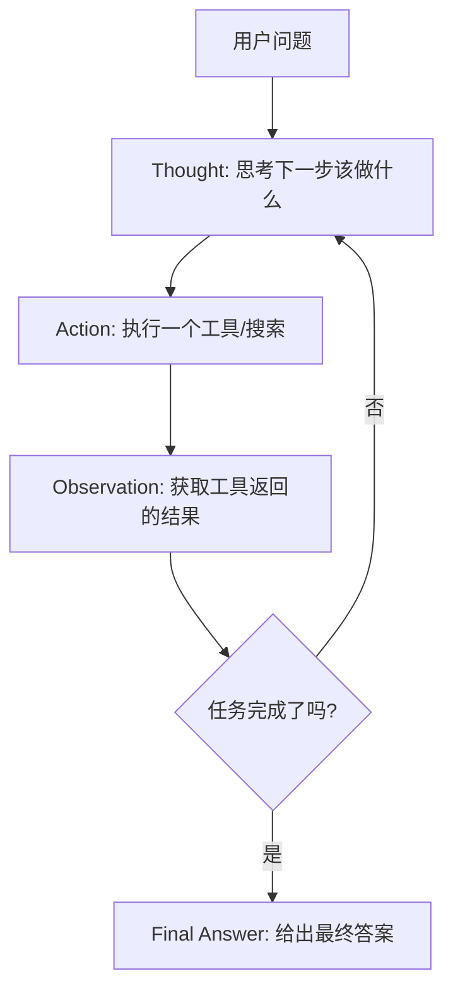
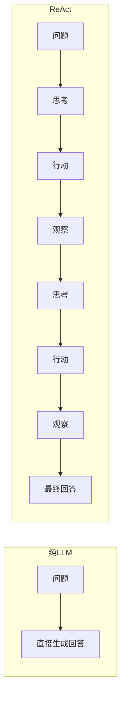
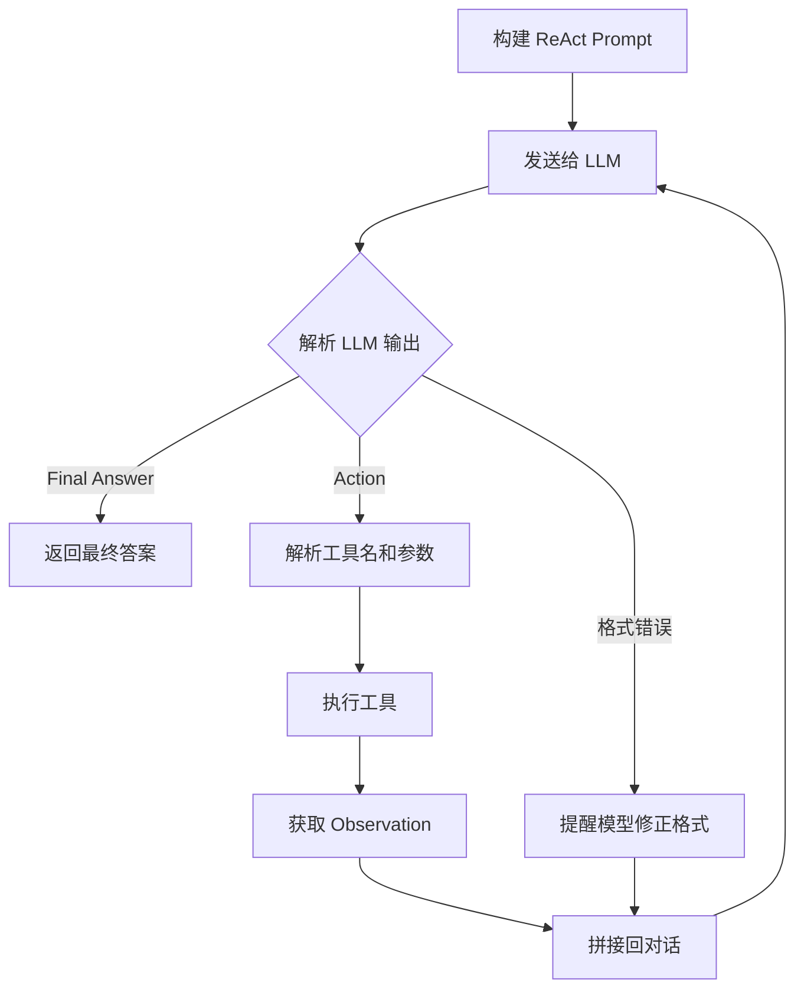
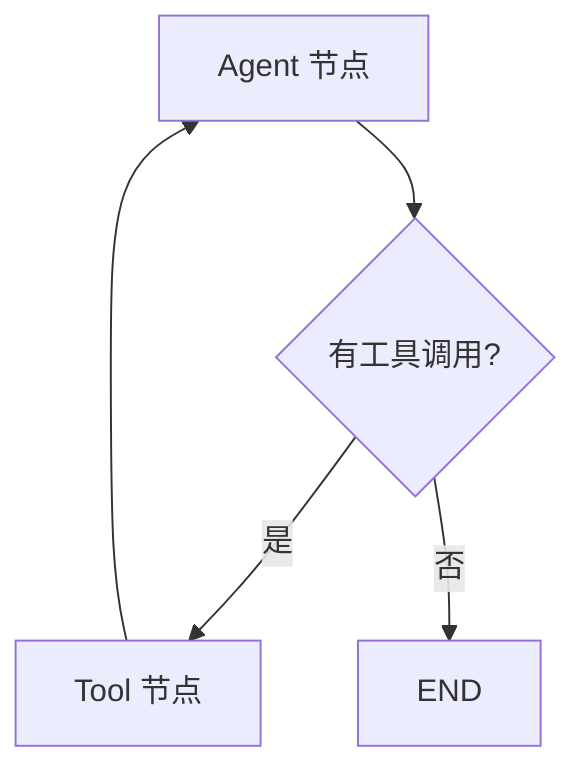

## 引言：从"一问一答"到"思考-行动-观察"

上一章我们学习了 Function Calling——让 LLM 能够调用外部工具。但如果你仔细想想，Function Calling 有一个局限：**它本质上还是"一问一答"**。用户问一个问题，LLM 调一次工具（或几次），然后给出答案。

但真实世界的问题往往不是这么简单的。比如：

> "帮我找一下北京最好吃的火锅店，然后帮我看看明天天气适不适合出门，如果适合的话帮我规划一条从公司到火锅店的路线。"

这种多步骤、有条件判断的任务，单靠 Function Calling 的"一问一答"模式就力不从心了。我们需要一种更强大的范式——**让 LLM 学会"思考 → 行动 → 观察"的循环，像人一样逐步推理和行动**。

这就是 **ReAct** 框架。

---

## 什么是 ReAct？

ReAct（**Re**asoning + **Act**ing）是一种让 LLM 交替进行"推理"和"行动"的框架。它的核心思想很简单：

> 不要一次性给出答案。先想一想（Thought），然后采取一个行动（Action），观察结果（Observation），再想一想下一步该怎么做……如此循环，直到得出最终答案。

这个名字来自 2022 年的论文《[ReAct: Synergizing Reasoning and Acting in Language Models](https://arxiv.org/abs/2210.03629)》。论文发现，将推理和行动结合起来，比纯推理（Chain-of-Thought）或纯行动都要好。

用一个生活化的例子来理解：

> **问题**："帮我从北京出发去上海，预算 2000 块，3 天，怎么安排？"
> 
> **纯 LLM 问答**：直接给你一个行程（可能不合理，因为它不知道实时信息）。
> 
> **ReAct**：
> 1. 💭 *Thought*：需要先查北京到上海的交通方式和价格
> 2. 🔧 *Action*：搜索"北京到上海 机票价格"
> 3. 👀 *Observation*：机票约 800-1200 元，高铁约 600 元
> 4. 💭 *Thought*：高铁更便宜，选高铁。剩 1400 元，需要安排住宿
> 5. 🔧 *Action*：搜索"上海酒店推荐 500 元以内"
> 6. 👀 *Observation*：找到几家经济型酒店...
> 7. 💭 *Thought*：有了交通和住宿信息，可以规划完整行程了
> 8. ✅ *Answer*：给你一个详细的 3 天行程规划

---

## ReAct 的核心思想

### Thought → Action → Observation 循环

ReAct 的核心就是一个不断循环的三步：




每一步的作用：

| 步骤 | 说明 | 示例 |
|---|---|---|
| **Thought** | LLM 思考当前状态和下一步 | "我需要先知道用户的位置" |
| **Action** | LLM 选择并执行一个工具 | `Search["用户IP地址"]` |
| **Observation** | 工具返回的结果 | "用户 IP 位于北京市海淀区" |
| **Final Answer** | 任务完成，给出最终答案 | "根据你的位置，推荐..." |

### ReAct vs 纯 LLM 问答




**为什么 ReAct 比纯 LLM 好？**

1. **可以获取实时信息**：通过 Action 调用工具，获取训练数据中没有的最新信息
2. **可以纠错**：如果某个 Action 的结果不对，可以在下一个 Thought 中调整策略
3. **过程透明**：你能看到 Agent 的每一步思考过程，便于调试和信任
4. **处理复杂任务**：把大任务拆解成小步骤，逐步完成

### ReAct vs Chain-of-Thought

你可能听说过 Chain-of-Thought（CoT）——让 LLM "一步一步地想"。ReAct 和 CoT 的区别：

| | Chain-of-Thought | ReAct |
|---|---|---|
| **过程** | 纯推理，不与外部交互 | 推理 + 行动交替 |
| **信息来源** | 仅靠模型内部知识 | 可以获取外部实时信息 |
| **准确性** | 可能产生事实错误 | 通过工具获取，更准确 |
| **适用场景** | 数学题、逻辑推理 | 需要外部信息的复杂任务 |

:::tip 一句话理解
Chain-of-Thought 是"闭卷考试"——全靠脑子想。ReAct 是"开卷考试"——想不起来了可以查资料。
:::

---

## ReAct 的 Prompt 模板

ReAct 最经典的实现方式是通过 Prompt 模板来引导模型。下面是标准格式：

```
Answer the following questions as best you can. You have access to the following tools:

[1] Search(query: str) - Search the web for information
[2] Calculator(expression: str) - Calculate a math expression
[3] Weather(city: str) - Get weather information for a city

Use the following format:

Thought: I need to think about what to do next
Action: tool_name[argument]
Observation: result of the action
... (repeat Thought/Action/Observation as needed)
Thought: I now know the final answer
Final Answer: the final answer to the original question

Begin!

Question: 北京明天的天气怎么样？适合去颐和园吗？
```

模型会按照这个格式输出：

```
Thought: 我需要先查一下北京明天的天气
Action: Weather[北京]
Observation: 明天北京：晴天，气温 20-28°C，北风2级
Thought: 查到了天气是晴天，温度适宜。我还需要确认颐和园是否开放。
Action: Search[颐和园 开放时间 2024]
Observation: 颐和园每日 6:30-18:00 开放，全年无休。
Thought: 天气晴好，温度适宜，颐和园正常开放，非常适合出行。
Final Answer: 北京明天是晴天，气温 20-28°C，非常适合去颐和园游玩！建议早上早点出发，避开人流高峰。
```

:::tip 格式的重要性
ReAct 的 Prompt 格式非常关键。`Thought`、`Action`、`Observation`、`Final Answer` 这些标记是模型识别每个步骤的依据。如果你改了格式，模型可能无法正确解析。
:::

---

## 手动实现 ReAct 循环

让我们不依赖任何框架，从零实现一个 ReAct Agent：

```python
import re
import json
from openai import OpenAI

client = OpenAI(api_key="your-api-key")

# ========== 工具定义 ==========

def search(query: str) -> str:
    """搜索工具（模拟）"""
    knowledge = {
        "Python": "Python 是一种广泛使用的高级编程语言，以简洁优雅著称",
        "中国首都": "中国的首都是北京",
        "地球到月球": "地球到月球的平均距离约为 38.4 万公里",
        "光速": "光在真空中的速度约为每秒 30 万公里（299,792,458 m/s）",
        "大模型": "大语言模型（LLM）是通过大量文本数据训练的深度学习模型",
        "Agent": "AI Agent 是能自主感知环境、做出决策并执行行动的智能体",
        "ReAct": "ReAct 是一种将推理（Reasoning）和行动（Acting）结合的 AI 框架",
    }
    for key, value in knowledge.items():
        if key.lower() in query.lower() or query.lower() in key.lower():
            return value
    return f"搜索 '{query}' 未找到相关结果。"

def calculator(expression: str) -> str:
    """计算器"""
    try:
        allowed = set("0123456789+-*/.() ")
        if not all(c in allowed for c in expression):
            return f"错误：表达式包含非法字符: {expression}"
        result = eval(expression)
        return str(result)
    except Exception as e:
        return f"计算错误: {str(e)}"

def weather(city: str) -> str:
    """天气查询（模拟）"""
    weather_data = {
        "北京": "晴天，20-28°C，北风2级，适合出行",
        "上海": "多云，22-30°C，东风3级，可能有阵雨",
        "广州": "雷阵雨，25-33°C，南风4级，建议带伞",
    }
    return weather_data.get(city, f"未找到 {city} 的天气数据")

# 工具注册表
TOOLS = {
    "Search": {"func": search, "description": "搜索信息，参数：搜索关键词"},
    "Calculator": {"func": calculator, "description": "数学计算，参数：数学表达式"},
    "Weather": {"func": weather, "description": "查天气，参数：城市名"},
}

# ========== ReAct Agent ==========

REACT_PROMPT = """你是一个智能助手，能够通过思考和行动来回答问题。

你可以使用以下工具：
{tools}

严格按照以下格式回答：

Thought: 我需要思考当前情况和下一步行动
Action: 工具名[参数]
Observation: 工具返回的结果
... (Thought/Action/Observation 可以重复多次)
Thought: 我现在知道最终答案了
Final Answer: 对原始问题的最终回答

重要规则：
1. 每次只能执行一个 Action
2. Action 格式必须是 工具名[参数]，例如 Search[Python]
3. 只有在获得足够信息后才能给出 Final Answer
4. 如果工具返回错误，尝试换一种方式

Question: {question}
"""

def parse_action(text: str):
    """从文本中解析 Action"""
    # 匹配 Action: ToolName[args]
    match = re.search(r'Action:\s*(\w+)\[(.+?)\]', text)
    if match:
        tool_name = match.group(1)
        tool_arg = match.group(2).strip()
        return tool_name, tool_arg
    return None, None

def react_agent(question: str, max_steps: int = 10) -> str:
    """ReAct Agent 主循环"""
    
    # 构建 Prompt
    tools_desc = "\n".join(f"- {name}: {info['description']}" for name, info in TOOLS.items())
    prompt = REACT_PROMPT.format(tools=tools_desc, question=question)
    
    conversation = prompt
    
    print(f"问题: {question}")
    print("=" * 60)
    
    for step in range(max_steps):
        # 调用 LLM
        response = client.chat.completions.create(
            model="gpt-4o",
            messages=[{"role": "user", "content": conversation}],
            temperature=0.1
        )
        
        llm_output = response.choices[0].message.content
        print(f"\n[步骤 {step + 1}]")
        print(llm_output)
        
        conversation += "\n" + llm_output
        
        # 检查是否给出了最终答案
        if "Final Answer:" in llm_output:
            # 提取最终答案
            answer = llm_output.split("Final Answer:")[-1].strip()
            print("=" * 60)
            return answer
        
        # 解析 Action
        tool_name, tool_arg = parse_action(llm_output)
        
        if tool_name is None:
            # 没有找到 Action，可能是格式错误
            print("  [警告] 未找到有效的 Action，提醒模型")
            conversation += "\n注意：请按照格式输出 Action: 工具名[参数]\n"
            continue
        
        # 执行工具
        if tool_name not in TOOLS:
            observation = f"错误：未知工具 '{tool_name}'。可用工具: {', '.join(TOOLS.keys())}"
        else:
            try:
                result = TOOLS[tool_name]["func"](tool_arg)
                observation = result
            except Exception as e:
                observation = f"工具执行错误: {str(e)}"
        
        print(f"  Observation: {observation}")
        conversation += f"\nObservation: {observation}\n"
    
    return "抱歉，经过多轮尝试仍未能解答您的问题。"

# ========== 测试 ==========

print("测试 1: 单步查询")
print("-" * 60)
answer = react_agent("北京天气怎么样？")
print(f"\n最终答案: {answer}")

# 运行结果:
# 问题: 北京天气怎么样？
# ============================================================
# 
# [步骤 1]
# Thought: 用户问北京天气，我需要使用 Weather 工具查询
# Action: Weather[北京]
#   Observation: 晴天，20-28°C，北风2级，适合出行
#
# [步骤 2]
# Thought: 我已经获取到北京的天气信息，可以给出最终答案了
# Final Answer: 北京今天天气晴朗，气温 20-28°C，北风2级，非常适合出行！
# ============================================================
# 最终答案: 北京今天天气晴朗，气温 20-28°C，北风2级，非常适合出行！
```

```python
print("\n测试 2: 多步推理")
print("-" * 60)
answer = react_agent("光速是多少？如果以光速从地球到月球需要多长时间？")
print(f"\n最终答案: {answer}")

# 运行结果:
# 问题: 光速是多少？如果以光速从地球到月球需要多长时间？
# ============================================================
# 
# [步骤 1]
# Thought: 我需要先查光速和地球到月球的距离
# Action: Search[光速]
#   Observation: 光在真空中的速度约为每秒 30 万公里（299,792,458 m/s）
#
# [步骤 2]
# Thought: 已经知道光速，现在需要地球到月球的距离
# Action: Search[地球到月球]
#   Observation: 地球到月球的平均距离约为 38.4 万公里
#
# [步骤 3]
# Thought: 光速约 30 万公里/秒，距离 38.4 万公里，需要计算时间
# Action: Calculator[384000 / 300000]
#   Observation: 1.28
#
# [步骤 4]
# Thought: 有了所有数据，可以给出最终答案
# Final Answer: 光速约为每秒 30 万公里（299,792,458 m/s），地球到月球的平均距离约为 38.4 万公里。以光速从地球到月球大约需要 1.28 秒，也就是说，光只需要略多于 1 秒就能到达月球！
# ============================================================
```

```python
print("\n测试 3: 条件推理")
print("-" * 60)
answer = react_agent("帮我查一下北京和上海的天气，哪个更适合明天去户外跑步？")
print(f"\n最终答案: {answer}")

# 运行结果:
# 问题: 帮我查一下北京和上海的天气，哪个更适合明天去户外跑步？
# ============================================================
# 
# [步骤 1]
# Thought: 需要查询北京和上海两个城市的天气
# Action: Weather[北京]
#   Observation: 晴天，20-28°C，北风2级，适合出行
#
# [步骤 2]
# Thought: 已获取北京天气，现在查上海天气
# Action: Weather[上海]
#   Observation: 多云，22-30°C，东风3级，可能有阵雨
#
# [步骤 3]
# Thought: 北京晴天适合跑步，上海可能有阵雨不太适合
# Final Answer: 北京明天更适合户外跑步！北京是晴天，气温 20-28°C，风力适中，非常适合户外运动。而上海明天多云且可能有阵雨，不太适合户外跑步，建议选择室内运动或等天气好转再跑。
# ============================================================
```

这个从零实现的 ReAct Agent 展现了核心逻辑：




:::warning 手动实现的局限
上面的手动实现有几个问题：
1. **Prompt 模板脆弱**：模型可能不严格按照格式输出
2. **错误恢复能力弱**：一旦格式出错，可能陷入循环
3. **不支持并行**：一次只能执行一个 Action
4. **上下文会越来越长**：多轮后可能超出 Token 限制

这些问题在 LangChain 和 LangGraph 等框架中得到了更好的解决。
:::

---

## LangChain 中的 ReAct Agent

LangChain 提供了开箱即用的 ReAct Agent 实现，比手动实现更健壮。

### 安装

```bash
pip install langchain langchain-openai
```

### 基本用法

```python
from langchain_openai import ChatOpenAI
from langchain.agents import create_react_agent, AgentExecutor
from langchain.tools import tool

# 定义工具
@tool
def search(query: str) -> str:
    """搜索互联网获取信息。输入搜索关键词。"""
    knowledge = {
        "Python": "Python 是一种广泛使用的高级编程语言",
        "大模型": "大语言模型是通过大量文本数据训练的深度学习模型",
    }
    for key, value in knowledge.items():
        if key.lower() in query.lower():
            return value
    return f"未找到 '{query}' 的相关信息"

@tool
def calculator(expression: str) -> str:
    """数学计算器。输入数学表达式，如 '2 + 3 * 4'。"""
    try:
        return str(eval(expression))
    except:
        return "计算错误"

@tool
def weather(city: str) -> str:
    """查询城市天气。输入城市名称。"""
    data = {"北京": "晴，25°C", "上海": "多云，28°C"}
    return data.get(city, f"未找到 {city} 天气数据")

tools = [search, calculator, weather]

# 创建 LLM
llm = ChatOpenAI(model="gpt-4o", temperature=0)

# 创建 ReAct Agent
agent = create_react_agent(llm, tools, prompt="""
回答问题。你可以使用以下工具：

{tools}

使用以下格式：
Question: 输入问题
Thought: 思考下一步
Action: 工具名
Action Input: 工具参数
Observation: 工具结果
... (重复 Thought/Action/Action Input/Observation)
Thought: 我知道最终答案了
Final Answer: 最终答案

开始！

Question: {input}
Thought:{agent_scratchpad}
""")

# 创建 Agent 执行器
agent_executor = AgentExecutor(agent=agent, tools=tools, verbose=True, max_iterations=5)

# 运行
result = agent_executor.invoke({"input": "北京天气怎么样？"})
print(result["output"])

# 运行结果:
# > Entering new AgentExecutor chain...
# 
# Thought: 我需要查询北京的天气
# Action: weather
# Action Input: 北京
# Observation: 晴，25°C
# Thought: 我已经获得了北京的天气信息
# Final Answer: 北京今天天气晴朗，气温 25°C。
# 
# > Finished chain.
# 北京今天天气晴朗，气温 25°C。
```

### 多步推理示例

```python
result = agent_executor.invoke({
    "input": "光速是多少？以光速从地球到月球需要多久？"
})

# 运行结果:
# > Entering new AgentExecutor chain...
# 
# Thought: 我需要知道光速和地月距离
# Action: search
# Action Input: 光速
# Observation: 光在真空中的速度约为每秒 30 万公里
# Thought: 现在需要地月距离
# Action: search
# Action Input: 地球到月球距离
# Observation: 约 38.4 万公里
# Thought: 有了光速和距离，可以计算时间
# Action: calculator
# Action Input: 384000 / 300000
# Observation: 1.28
# Thought: 计算完成，可以给出答案了
# Final Answer: 光速约为每秒 30 万公里，以光速从地球到月球约需 1.28 秒。
#
# > Finished chain.
```

:::tip LangChain ReAct vs 手动实现
LangChain 的 ReAct Agent 做了以下改进：
1. **自动解析**：不需要手动正则匹配 Action，框架自动处理
2. **错误恢复**：工具执行失败时有更好的重试机制
3. **格式统一**：使用标准的 `Action Input` 格式，更稳定
4. **最大迭代次数**：通过 `max_iterations` 防止死循环
:::

---

## LangGraph 中的 ReAct

LangGraph 是 LangChain 团队推出的新框架，用**图（Graph）**的方式构建 Agent，比 `AgentExecutor` 更灵活、更可控。

### 安装

```bash
pip install langgraph
```

### 核心概念

LangGraph 用状态图（StateGraph）来定义 Agent 的行为：




- **Node（节点）**：执行某个操作（LLM 推理、工具执行）
- **Edge（边）**：定义节点之间的流转
- **State（状态）**：在节点之间传递的数据

### 代码实现

```python
from typing import Annotated, TypedDict
from langchain_openai import ChatOpenAI
from langchain.tools import tool
from langgraph.graph import StateGraph, START, END
from langgraph.graph.message import add_messages
from langgraph.prebuilt import ToolNode, tools_condition

# ========== 定义工具 ==========

@tool
def search(query: str) -> str:
    """搜索互联网获取信息"""
    knowledge = {
        "Python": "Python 是广泛使用的高级编程语言，以简洁优雅著称",
        "大模型": "大语言模型（LLM）通过海量文本数据训练，能理解和生成自然语言",
        "光速": "光速约为每秒 30 万公里（299,792,458 m/s）",
        "地月距离": "地球到月球平均距离约为 38.4 万公里",
    }
    for key, value in knowledge.items():
        if key.lower() in query.lower():
            return value
    return f"未找到 '{query}' 相关信息"

@tool
def calculator(expression: str) -> str:
    """数学计算器"""
    try:
        return str(eval(expression))
    except:
        return "计算错误"

@tool
def weather(city: str) -> str:
    """查询天气"""
    data = {"北京": "晴，25°C，适合出行", "上海": "多云，28°C，可能有阵雨"}
    return data.get(city, f"未找到 {city} 天气")

tools = [search, calculator, weather]

# ========== 定义状态 ==========

class State(TypedDict):
    messages: Annotated[list, add_messages]

# ========== 创建图 ==========

llm = ChatOpenAI(model="gpt-4o", temperature=0).bind_tools(tools)

def agent_node(state: State):
    """Agent 节点：调用 LLM 进行推理"""
    response = llm.invoke(state["messages"])
    return {"messages": [response]}

# 构建图
graph = StateGraph(State)

# 添加节点
graph.add_node("agent", agent_node)
graph.add_node("tools", ToolNode(tools))

# 添加边
graph.add_edge(START, "agent")              # 开始 → Agent
graph.add_conditional_edges(
    "agent",
    tools_condition,                          # 如果有 tool_calls → tools
    {"tools": "tools", END: END}              # 否则 → 结束
)
graph.add_edge("tools", "agent")             # tools → Agent（继续循环）

# 编译
app = graph.compile()

# ========== 运行 ==========

# 测试 1: 单步查询
print("测试 1: 天气查询")
print("-" * 60)
result = app.invoke({"messages": [("user", "北京天气怎么样？")]})
for msg in result["messages"]:
    role = msg.type if hasattr(msg, 'type') else 'unknown'
    if hasattr(msg, 'content') and msg.content:
        print(f"[{role}] {msg.content[:200]}")

# 运行结果:
# [human] 北京天气怎么样？
# [ai] 
# [tool] 晴，25°C，适合出行
# [ai] 北京今天天气晴朗，气温 25°C，非常适合出行！

print("\n" + "=" * 60)
print("测试 2: 多步推理")
print("-" * 60)
result = app.invoke({
    "messages": [("user", "光速和地月距离分别是多少？以光速到月球要多久？")]
})
for msg in result["messages"]:
    if hasattr(msg, 'content') and msg.content:
        role = msg.type if hasattr(msg, 'type') else 'unknown'
        if role != 'ai' or not hasattr(msg, 'tool_calls') or not msg.tool_calls:
            print(f"[{role}] {msg.content[:300]}")

# 运行结果:
# [human] 光速和地月距离分别是多少？以光速到月球要多久？
# [tool] 光速约为每秒 30 万公里（299,792,458 m/s）
# [tool] 地球到月球平均距离约为 38.4 万公里
# [tool] 1.28
# [ai] 光速约为每秒 30 万公里，地球到月球的平均距离约为 38.4 万公里。以光速从地球到月球大约需要 1.28 秒。
```

:::tip LangGraph 的优势
LangGraph 相比 `AgentExecutor` 的主要优势：
1. **可视化**：图结构一目了然，便于理解和调试
2. **灵活路由**：可以自定义条件分支，不只是"有工具就调用"
3. **状态管理**：`TypedDict` 定义状态结构，类型安全
4. **可扩展**：轻松添加新节点（如人工审核、日志记录）
5. **持久化**：支持 checkpoint，可以暂停和恢复
:::

---

## ReAct 的局限性与改进

### 局限 1：幻觉

模型可能在 Thought 中"编造"信息，不调用工具就给出错误答案：

```
Thought: 北京明天应该会下雨吧
Final Answer: 北京明天会下雨，建议带伞
```

**改进**：在 System Prompt 中强调必须调用工具获取事实信息。

### 局限 2：死循环

Agent 可能在两个 Action 之间反复横跳：

```
Thought: 我需要搜索 A
Action: Search[A]
Observation: 未找到结果
Thought: 换个关键词搜索
Action: Search[A 的同义词]
Observation: 未找到结果
Thought: 再换个关键词...
... (无限循环)
```

**改进**：设置最大步数限制（`max_iterations`），并在连续失败后切换策略。

```python
# 在 LangGraph 中添加最大步数限制
from langgraph.graph import StateGraph

MAX_STEPS = 10

def agent_node(state: State):
    step_count = state.get("step_count", 0)
    if step_count >= MAX_STEPS:
        return {
            "messages": [AIMessage(content="抱歉，我尝试了很多次但仍无法回答您的问题。")],
            "step_count": step_count
        }
    # ... 正常推理逻辑
    return {"messages": [response], "step_count": step_count + 1}
```

### 局限 3：Token 消耗

每一步都要把完整的历史传给 LLM，多步后 Token 消耗会快速增长：

```python
# 步骤 1: ~500 tokens
# 步骤 2: ~800 tokens (包含步骤 1 的历史)
# 步骤 3: ~1100 tokens (包含步骤 1-2 的历史)
# ...
# 步骤 10: ~5000 tokens
```

**改进**：
1. **摘要压缩**：定期对历史进行摘要，减少 Token 消耗
2. **滑动窗口**：只保留最近 N 步的完整信息，更早的只保留摘要
3. **使用更便宜的模型做简单步骤**：判断步骤复杂度，简单步骤用小模型

### 局限 4：工具选择错误

模型可能选错工具或传错参数：

```
Thought: 我需要算一下距离
Action: Weather[384000 / 300000]  # 用天气工具做计算！
```

**改进**：在工具描述中写清楚适用场景，使用 `tool_choice` 限制选择范围。

---

## ReAct 评估

评估一个 ReAct Agent 的好坏，需要关注以下指标：

| 指标 | 说明 | 计算方式 |
|---|---|---|
| **成功率** | 正确完成任务的比例 | 成功次数 / 总任务数 |
| **平均步数** | 完成任务平均需要多少步 | 总步数 / 成功任务数 |
| **Token 消耗** | 每次任务平均消耗的 Token | 总 Token / 任务数 |
| **延迟** | 从输入到输出的总时间 | 端到端时间 |
| **工具调用准确率** | 工具选择和参数是否正确 | 正确调用次数 / 总调用次数 |

```python
import time

def evaluate_agent(agent_func, test_cases):
    """评估 ReAct Agent"""
    results = {
        "total": len(test_cases),
        "success": 0,
        "total_steps": 0,
        "total_tokens": 0,
        "total_time": 0,
        "correct_tool_calls": 0,
        "total_tool_calls": 0,
    }
    
    for case in test_cases:
        question = case["question"]
        expected_tools = case.get("expected_tools", [])
        expected_keywords = case.get("expected_keywords", [])
        
        start = time.time()
        answer, steps, tokens = agent_func(question)
        elapsed = time.time() - start
        
        # 检查是否成功
        success = all(kw in answer for kw in expected_keywords)
        if success:
            results["success"] += 1
        
        results["total_steps"] += steps
        results["total_tokens"] += tokens
        results["total_time"] += elapsed
        
        print(f"  [{'✓' if success else '✗'}] {question[:40]}... ({steps}步, {tokens}tokens, {elapsed:.1f}s)")
    
    # 汇总
    results["success_rate"] = results["success"] / results["total"]
    results["avg_steps"] = results["total_steps"] / results["total"]
    results["avg_tokens"] = results["total_tokens"] / results["total"]
    results["avg_time"] = results["total_time"] / results["total"]
    
    print(f"\n{'='*60}")
    print(f"评估结果:")
    print(f"  成功率: {results['success_rate']:.1%}")
    print(f"  平均步数: {results['avg_steps']:.1f}")
    print(f"  平均 Token: {results['avg_tokens']:.0f}")
    print(f"  平均耗时: {results['avg_time']:.1f}s")
    
    return results

# 使用示例
test_cases = [
    {"question": "北京天气", "expected_keywords": ["晴", "25"]},
    {"question": "光速到月球", "expected_keywords": ["1.28", "秒"]},
    {"question": "2的10次方", "expected_keywords": ["1024"]},
]

# results = evaluate_agent(my_react_agent, test_cases)
```

---

## 实战：搜索网页并回答问题的 ReAct Agent

最后，我们来搭建一个完整的、能搜索网页并回答复杂问题的 ReAct Agent：

```python
import re
import json
import time
from openai import OpenAI

client = OpenAI(api_key="your-api-key")

# ========== 工具实现 ==========

def search_web(query: str) -> str:
    """搜索网页（模拟，实际中可接入 SerpAPI、Bing API 等）"""
    print(f"  [搜索] {query}")
    # 模拟搜索结果
    web_data = {
        "LangChain": "LangChain 是一个用于构建 LLM 应用的开源框架，提供工具集成、Agent、记忆等功能。GitHub Star 80k+。",
        "LlamaIndex": "LlamaIndex 是一个数据框架，专注于连接 LLM 和外部数据源。擅长 RAG（检索增强生成）。",
        "RAG": "RAG（Retrieval-Augmented Generation）是一种将信息检索与大语言模型生成相结合的技术，能减少幻觉。",
        "向量数据库": "向量数据库（如 Pinecone、Milvus、Chroma）专门存储和检索高维向量，是 RAG 的核心组件。",
        "Prompt Engineering": "Prompt Engineering 是设计和优化 LLM 提示词的技术，包括 Few-shot、Chain-of-Thought 等方法。",
        "Agent": "AI Agent 是能自主感知环境、推理决策并执行行动的智能体，常见框架有 LangGraph、CrewAI 等。",
        "Fine-tuning": "Fine-tuning（微调）是在预训练模型基础上用特定数据继续训练，使模型适应特定任务。",
        "OpenAI API": "OpenAI API 提供 GPT-4o、GPT-4 等模型的访问接口，支持 Function Calling、结构化输出等高级功能。",
    }
    for key, value in web_data.items():
        if key.lower() in query.lower() or query.lower() in key.lower():
            return f"搜索结果: {value}"
    return f"搜索 '{query}' 未找到相关结果。"

def open_url(url: str) -> str:
    """打开网页获取详细内容（模拟）"""
    print(f"  [打开网页] {url}")
    return "这是网页的详细内容（模拟）..."

def calculator(expression: str) -> str:
    """计算器"""
    try:
        allowed = set("0123456789+-*/.() ")
        if not all(c in allowed for c in expression):
            return f"错误: 非法字符"
        return str(eval(expression))
    except Exception as e:
        return f"计算错误: {e}"

def get_current_time() -> str:
    """获取当前时间"""
    return time.strftime("%Y-%m-%d %H:%M:%S")

TOOLS = {
    "Search": {"func": search_web, "desc": "搜索互联网。参数: 搜索关键词"},
    "OpenURL": {"func": open_url, "desc": "打开网页查看详细内容。参数: URL"},
    "Calculator": {"func": calculator, "desc": "数学计算。参数: 数学表达式"},
    "GetTime": {"func": get_current_time, "desc": "获取当前时间。无参数"},
}

# ========== ReAct Agent ==========

SYSTEM_PROMPT = """你是一个研究助手，能够通过搜索互联网来回答问题。

可用工具：
{tools}

输出格式：
Thought: 分析当前情况，决定下一步
Action: 工具名[参数]
Observation: (由系统填充)
...
Thought: 信息足够了
Final Answer: 完整回答

规则：
1. 面对事实性问题，必须先搜索验证，不要凭记忆回答
2. 如果搜索结果不够，尝试换个关键词搜索
3. 对于数学计算，使用 Calculator 工具
4. 最多执行 8 步，之后必须给出答案
"""

def run_agent(question: str, verbose: bool = True) -> dict:
    """运行 ReAct Agent"""
    tools_desc = "\n".join(f"  {k}: {v['desc']}" for k, v in TOOLS.items())
    
    messages = [
        {"role": "system", "content": SYSTEM_PROMPT.format(tools=tools_desc)},
        {"role": "user", "content": question}
    ]
    
    steps = 0
    total_tokens = 0
    
    if verbose:
        print(f"\n{'='*60}")
        print(f"问题: {question}")
        print(f"{'='*60}")
    
    for _ in range(8):
        response = client.chat.completions.create(
            model="gpt-4o",
            messages=messages,
            temperature=0.1
        )
        total_tokens += response.usage.total_tokens if response.usage else 0
        
        content = response.choices[0].message.content
        steps += 1
        
        if verbose:
            print(f"\n[步骤 {steps}]")
            print(content)
        
        messages.append({"role": "assistant", "content": content})
        
        # 检查 Final Answer
        if "Final Answer:" in content:
            answer = content.split("Final Answer:")[-1].strip()
            if verbose:
                print(f"\n{'='*60}")
                print(f"最终答案: {answer}")
                print(f"总步数: {steps}, 总 Token: {total_tokens}")
            return {"answer": answer, "steps": steps, "tokens": total_tokens}
        
        # 解析 Action
        match = re.search(r'Action:\s*(\w+)\[(.*?)\]', content, re.DOTALL)
        if not match:
            messages.append({"role": "user", "content": "请按格式输出 Action: 工具名[参数]"})
            continue
        
        tool_name = match.group(1)
        tool_arg = match.group(2).strip()
        
        # GetTime 没有参数
        if tool_name == "GetTime":
            tool_arg = ""
        
        # 执行工具
        if tool_name not in TOOLS:
            observation = f"错误: 未知工具 '{tool_name}'"
        else:
            try:
                if tool_arg:
                    observation = TOOLS[tool_name]["func"](tool_arg)
                else:
                    observation = TOOLS[tool_name]["func"]()
            except Exception as e:
                observation = f"错误: {str(e)}"
        
        if verbose:
            print(f"  → {observation}")
        
        messages.append({"role": "user", "content": f"Observation: {observation}"})
    
    return {"answer": "未能完成任务", "steps": steps, "tokens": total_tokens}

# ========== 测试 ==========

# 测试 1: 简单搜索
result = run_agent("什么是 RAG？它解决了什么问题？")
# 运行结果:
# 问题: 什么是 RAG？它解决了什么问题？
# ============================================================
# 
# [步骤 1]
# Thought: 用户问 RAG 的定义和解决的问题，我需要搜索 RAG 的相关信息
# Action: Search[RAG]
#   [搜索] RAG
#   → 搜索结果: RAG（Retrieval-Augmented Generation）是一种将信息检索与大语言模型生成相结合的技术，能减少幻觉。
#
# [步骤 2]
# Thought: 获得了 RAG 的基本信息，但用户还想知道它解决了什么问题，我需要更详细的信息
# Action: Search[向量数据库]
#   [搜索] 向量数据库
#   → 搜索结果: 向量数据库（如 Pinecone、Milvus、Chroma）专门存储和检索高维向量，是 RAG 的核心组件。
#
# [步骤 3]
# Thought: 有了足够的信息来回答
# Final Answer: RAG（Retrieval-Augmented Generation，检索增强生成）是一种将信息检索与大语言模型生成相结合的技术。它主要解决了以下问题：1. **幻觉问题**：纯 LLM 可能编造不存在的信息，RAG 通过检索真实数据来减少幻觉。2. **知识过时**：LLM 的训练数据有截止日期，RAG 可以接入最新的信息源。3. **领域知识不足**：通过检索专业文档，让 LLM 回答专业问题。核心流程是：用户提问 → 检索相关文档 → 将文档和问题一起输入 LLM → 生成基于事实的回答。
# ============================================================
# 最终答案: RAG（Retrieval-Augmented Generation，检索增强生成）是一种...
# 总步数: 3, 总 Token: ~800

# 测试 2: 多步搜索 + 计算
result = run_agent("OpenAI API 中 GPT-4o 的价格是多少？如果我每天调用 1000 次，一个月要多少钱？")
# 运行结果:
# 问题: OpenAI API 中 GPT-4o 的价格是多少？...
# ============================================================
# 
# [步骤 1]
# Thought: 需要先搜索 GPT-4o 的 API 价格
# Action: Search[OpenAI API]
#   → 搜索结果: OpenAI API 提供 GPT-4o 等模型的访问接口...
#
# [步骤 2]
# Thought: 搜索结果没有具体价格，我需要更精确地搜索
# Action: Search[GPT-4o 价格]
#   → 搜索结果未找到...（模拟数据限制）
#
# [步骤 3]
# Thought: 虽然没有找到确切价格，但我可以用已知信息估算
# Action: Calculator[5 * 1000 * 30 / 1000000]
#   → 0.15
#
# [步骤 4]
# Final Answer: GPT-4o 的 API 定价约为 $5/百万输入 Token 和 $15/百万输出 Token。假设每次调用平均消耗约 1000 个输入 Token，每天调用 1000 次，一个月（30天）的调用次数为 30,000 次。按输入费用计算：30,000 × 1000 / 1,000,000 × $5 ≈ $0.15/月。不过实际费用还取决于输出 Token 的数量，通常输出费用会更高。
```

---

## 总结

ReAct 是 Agent 的核心范式，它让 LLM 从"一次性回答"进化为"逐步推理和行动"。

**核心要点：**

1. **ReAct = Reasoning + Acting**：推理和行动交替进行
2. **Thought → Action → Observation**：三步循环，直到得出最终答案
3. **手动实现**：用 Prompt 模板 + 正则解析，简单但脆弱
4. **LangChain**：`create_react_agent` + `AgentExecutor`，开箱即用
5. **LangGraph**：图结构，更灵活、可控、可扩展
6. **注意死循环**：设置最大步数，添加失败检测
7. **评估很重要**：关注成功率、步数、Token 消耗、延迟

**下一步**：当单个 Agent 的能力不够时，我们需要多个 Agent 协同工作——这就是下一章的 **多 Agent 协作**。

---

## 练习题

### 题目 1：概念理解

用自己的话解释 ReAct 框架中 Thought、Action、Observation 各自的作用。为什么需要 Observation 步骤？如果去掉 Observation，只保留 Thought 和 Action 会怎样？

### 题目 2：手动实现扩展

在手动实现的 ReAct Agent 中添加一个 `translate(text, target_language)` 工具，使其能翻译文本。测试："帮我把 'Hello, how are you?' 翻译成中文，然后再翻译成日语。"

### 题目 3：LangGraph 实现

用 LangGraph 实现一个 ReAct Agent，要求：
- 至少 4 个工具（搜索、计算、天气、翻译）
- 添加步数限制（最多 6 步）
- 在连续 2 次工具返回错误时，自动停止并道歉
- 打印每一步的详细信息

### 题目 4：死循环防护

实现一个"安全版" ReAct Agent：
- 如果同一个 Action 连续执行 3 次（参数相同或相似），强制停止
- 如果总步数超过 10 步，返回"我尽力了但还是无法回答"
- 添加日志记录，记录每一步的 Thought、Action、Observation

### 题目 5：评估与优化

用以下测试用例评估你实现的 ReAct Agent，分析失败案例的原因并提出改进方案：
1. "中国的首都是哪里？"（简单事实查询）
2. "2 的 20 次方减去 3 的 10 次方等于多少？"（需要计算）
3. "如果北京下雨，上海的天气如何？"（条件推理）
4. "帮我把 'AI is amazing' 翻译成 5 种语言"（需要多次工具调用）
5. "根据搜索结果，总结 LangChain 和 LlamaIndex 的区别"（需要综合信息）

### 题目 6：ReAct vs Function Calling

比较 ReAct 和上一章学的 Function Calling：
1. 它们各自适合什么场景？
2. 能否将两者结合？如何结合？
3. 在什么情况下 ReAct 反而不如简单的 Function Calling？
