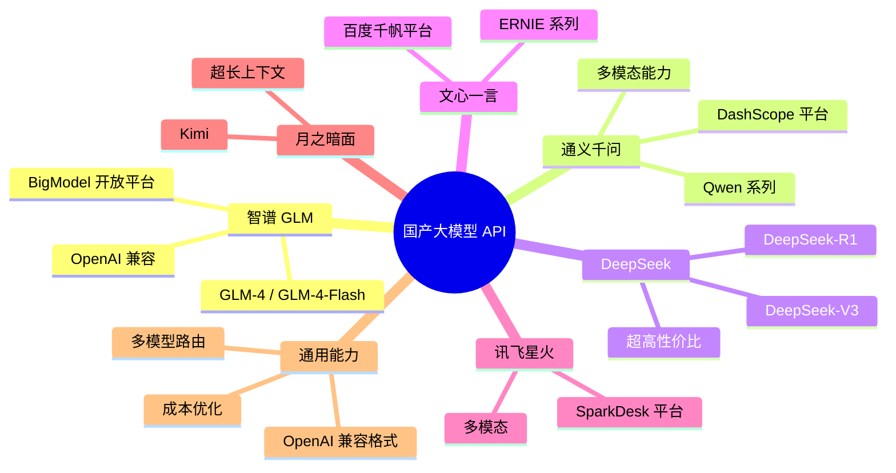
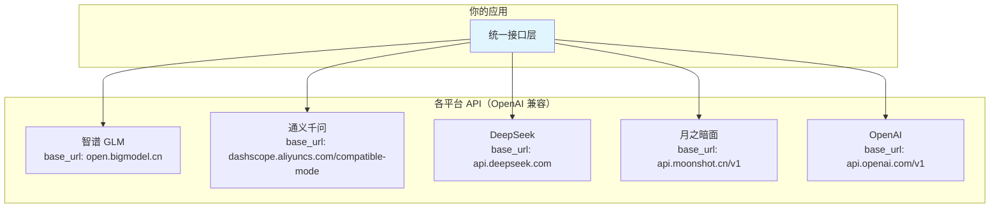
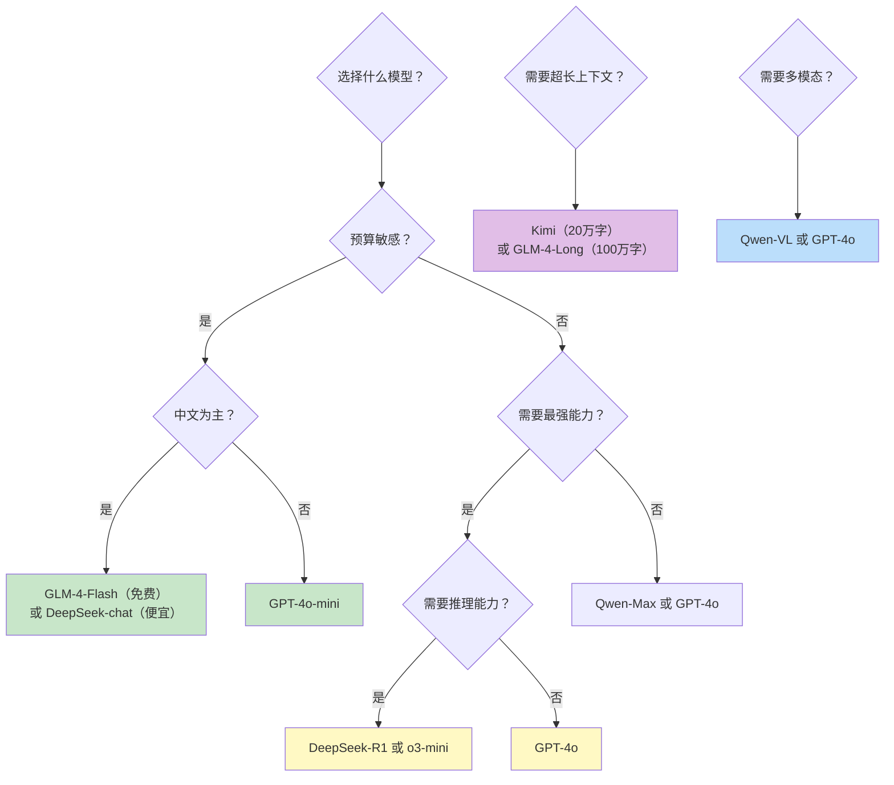
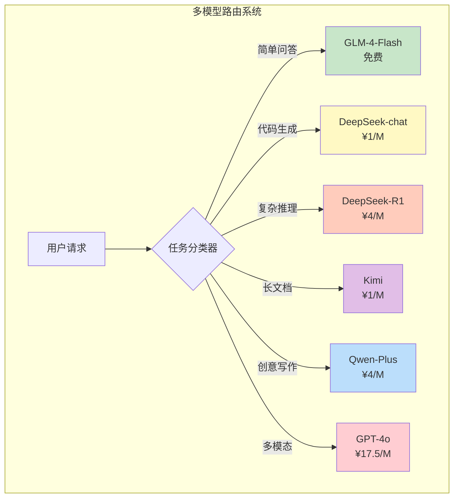
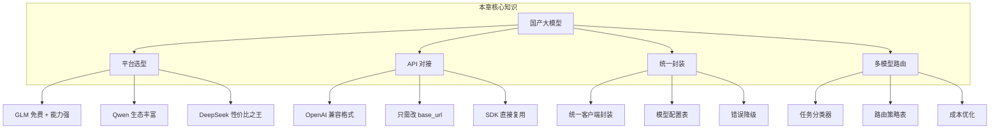

# 国产大模型 API 全景指南

## 本章概览

国产大模型在过去一年突飞猛进，很多模型的中文能力已经不输甚至超越了 GPT-4。更重要的是，国产模型的定价普遍比 OpenAI 便宜很多，有些甚至免费。对于面向国内用户的 AI 应用来说，国产大模型是绕不开的选择。

学完本章，你将掌握：

- 国内主流大模型平台的全景对比
- 智谱 GLM、通义千问、DeepSeek 等平台的 API 对接方式
- OpenAI 兼容格式，一套代码切换多模型
- 模型选型和成本优化策略
- 多模型路由的实战实现



---

## 1. 国产大模型全景

### 1.1 平台对比总览

| 平台 | 代表模型 | 中文能力 | 定价（输入/百万Token） | 特色 | API 格式 |
|------|---------|---------|---------------------|------|---------|
| 智谱 AI | GLM-4-Flash / GLM-4-Plus | ⭐⭐⭐⭐⭐ | 免费 / ¥0.1~50 | 免费额度大，OpenAI 兼容 | OpenAI 兼容 |
| 阿里 | Qwen-Max / Qwen-Plus / Qwen-Turbo | ⭐⭐⭐⭐⭐ | ¥0.8~20 / ¥2~60 | 生态丰富，开源模型 | OpenAI 兼容 |
| DeepSeek | DeepSeek-V3 / DeepSeek-R1 | ⭐⭐⭐⭐⭐ | ¥1~4 / ¥2~16 | 超高性价比，推理能力强 | OpenAI 兼容 |
| 百度 | ERNIE-4.0 / ERNIE-Speed | ⭐⭐⭐⭐ | ¥4~30 / ¥8~60 | 百度生态集成 | 自有格式 |
| 讯飞 | Spark-4.0-Ultra | ⭐⭐⭐⭐ | ¥2~30 / ¥6~90 | 语音能力强 | 自有格式 |
| 月之暗面 | Kimi | ⭐⭐⭐⭐ | ¥1~16 / ¥2~16 | 超长上下文（200万字） | OpenAI 兼容 |

:::tip 一个重要趋势
大部分国产模型平台都开始支持 **OpenAI 兼容格式**。这意味着你可以用几乎相同的代码，只改一个 `base_url` 就能切换不同的模型。这对于做多模型支持和 A/B 测试非常方便。
:::

### 1.2 能力维度对比


---

## 2. 智谱 GLM API

智谱 AI 是国内最早做大模型的公司之一，GLM 系列模型在中文场景表现优秀，而且免费额度非常慷慨。

### 2.1 注册与准备

1. 访问 [bigmodel.cn](https://bigmodel.cn) 注册账号
2. 进入控制台 → API Keys → 创建 API Key
3. 新用户注册通常赠送大量免费 Token

```bash
# 设置环境变量
export ZHIPU_API_KEY="xxxxxxxxxxxxxxxxxxxxxxxx"
```

### 2.2 安装 SDK

```bash
pip install zhipuai
```

### 2.3 基础调用

```python
# zhipu_basic.py
import os
from zhipuai import ZhipuAI

client = ZhipuAI(api_key=os.environ.get("ZHIPU_API_KEY"))

response = client.chat.completions.create(
    model="glm-4-flash",  # 免费模型！
    messages=[
        {"role": "user", "content": "用一句话介绍 Spring Boot 的优势。"}
    ],
    temperature=0.7,
    max_tokens=100
)

print(f"模型: {response.model}")
print(f"回复: {response.choices[0].message.content}")
print(f"Token: {response.usage.total_tokens}")

# 运行结果:
# 模型: glm-4-flash
# 回复: Spring Boot 通过自动配置、起步依赖和内嵌服务器，大幅简化了 Spring 应用的开发和部署流程。
# Token: 42
```

### 2.4 智谱模型列表

| 模型 | 定价 | 上下文 | 特点 |
|------|------|--------|------|
| glm-4-flash | **免费** | 128K | 日常使用首选，速度快 |
| glm-4-air | ¥0.1/百万Token | 128K | 性价比高 |
| glm-4-plus | ¥0.5/百万Token | 128K | 能力更强 |
| glm-4-long | ¥0.1/百万Token | 1M | 超长上下文 |
| glm-4v-plus | ¥0.1/百万Token | 8K | 多模态理解 |

:::tip 为什么推荐 GLM-4-Flash？
glm-4-flash 是免费的！对于开发测试和小规模应用，完全够用。而且智谱的免费不是"试用期免费"，是长期免费的。这在所有大模型平台中非常罕见。
:::

### 2.5 流式调用

```python
# zhipu_stream.py
import os
from zhipuai import ZhipuAI

client = ZhipuAI(api_key=os.environ.get("ZHIPU_API_KEY"))

print("🤖 GLM: ", end="", flush=True)

response = client.chat.completions.create(
    model="glm-4-flash",
    messages=[{"role": "user", "content": "写一首关于编程的短诗"}],
    stream=True,
    max_tokens=200
)

for chunk in response:
    if chunk.choices[0].delta.content:
        print(chunk.choices[0].delta.content, end="", flush=True)

print()

# 运行结果:
# 🤖 GLM: 键盘敲击声如雨落，
# 代码如诗行行过。
# Bug 来袭不畏缩，
# Debug 到天破。
# 程序员的世界里，
# 逻辑是最美的歌。
```

---

## 3. 通义千问 API

阿里通义千问（Qwen）是开源生态最活跃的国产模型之一，闭源 API 版本能力也很强。

### 3.1 注册与准备

1. 访问 [dashscope.console.aliyun.com](https://dashscope.console.aliyun.com)
2. 使用阿里云账号登录
3. 创建 API Key

```bash
export DASHSCOPE_API_KEY="sk-xxxxxxxxxxxxxxxx"
```

### 3.2 安装 SDK

```bash
pip install dashscope
```

### 3.3 基础调用

```python
# qwen_basic.py
import os
from dashscope import Generation

api_key = os.environ.get("DASHSCOPE_API_KEY")

response = Generation.call(
    model="qwen-turbo",
    messages=[
        {"role": "system", "content": "你是一个 Java 技术专家。"},
        {"role": "user", "content": "解释一下 Java 中的 volatile 关键字。"}
    ],
    max_tokens=300,
    temperature=0.7,
    api_key=api_key
)

if response.status_code == 200:
    print(f"模型: {response.model}")
    print(f"回复: {response.output.choices[0].message.content}")
    print(f"Token: 输入={response.usage.input_tokens} 输出={response.usage.output_tokens}")
else:
    print(f"错误: {response.code} - {response.message}")

# 运行结果:
# 模型: qwen-turbo
# 回复: volatile 是 Java 中的一个关键字，主要用于修饰变量。它的核心作用有两个：
#
# 1. **可见性保证**：当一个线程修改了 volatile 变量的值，其他线程能够立即看到最新的值。
#    普通变量在多线程环境下可能存在可见性问题，因为每个线程有自己的工作内存缓存。
#
# 2. **禁止指令重排序**：volatile 变量的读写操作不会被编译器和 CPU 重排序，
#    这在双重检查锁单例模式中非常关键。
#
# 需要注意的是，volatile 不保证原子性，像 i++ 这样的复合操作仍然需要用 synchronized 或 AtomicInteger。
# Token: 输入=28 输出=168
```

### 3.4 通义千问模型列表

| 模型 | 输入价格（百万Token） | 输出价格（百万Token） | 上下文 | 特点 |
|------|---------------------|---------------------|--------|------|
| qwen-turbo | ¥0.8 | ¥2 | 128K | 速度最快 |
| qwen-plus | ¥4 | ¥8 | 128K | 能力均衡 |
| qwen-max | ¥20 | ¥60 | 32K | 最强能力 |
| qwen-long | ¥0.5 | ¥2 | 1M | 超长文本 |

### 3.5 通义千问流式调用

```python
# qwen_stream.py
import os
from dashscope import Generation

api_key = os.environ.get("DASHSCOPE_API_KEY")

responses = Generation.call(
    model="qwen-turbo",
    messages=[{"role": "user", "content": "用三句话介绍微服务架构"}],
    stream=True,
    api_key=api_key
)

print("🤖 Qwen: ", end="", flush=True)
for resp in responses:
    if resp.status_code == 200:
        content = resp.output.choices[0].message.content
        if content:
            print(content, end="", flush=True)
    else:
        print(f"错误: {resp.code}")
print()

# 运行结果:
# 🤖 Qwen: 微服务架构将大型应用拆分为多个独立部署的小服务，每个服务负责单一业务功能。这些服务通过轻量级协议（如 HTTP/REST）进行通信，可以独立开发、测试和扩展。它提升了系统的灵活性和可维护性，但也带来了服务治理和分布式事务的复杂性。
```

---

## 4. DeepSeek API

DeepSeek 是近期最火的国产大模型之一，以超高性价比和出色的代码/数学能力著称。DeepSeek-R1 更是凭借开源推理模型在业界引起轰动。

### 4.1 注册与准备

1. 访问 [platform.deepseek.com](https://platform.deepseek.com)
2. 注册并创建 API Key

```bash
export DEEPSEEK_API_KEY="sk-xxxxxxxxxxxxxxxx"
```

### 4.2 基础调用（OpenAI 兼容格式）

DeepSeek 的 API 完全兼容 OpenAI 格式，直接用 OpenAI SDK 就行：

```python
# deepseek_basic.py
import os
from openai import OpenAI

client = OpenAI(
    api_key=os.environ.get("DEEPSEEK_API_KEY"),
    base_url="https://api.deepseek.com"  # 关键：改 base_url
)

response = client.chat.completions.create(
    model="deepseek-chat",  # DeepSeek-V3
    messages=[
        {"role": "system", "content": "你是一个资深算法工程师。"},
        {"role": "user", "content": "用 Python 实现一个 LRU Cache。"}
    ],
    temperature=0.3,
    max_tokens=500
)

print(f"模型: {response.model}")
print(f"回复: {response.choices[0].message.content}")
print(f"Token: {response.usage.total_tokens}")

# 运行结果:
# 模型: deepseek-chat
# 回复: 使用 Python 的 OrderedDict 可以高效实现 LRU Cache：
#
# from collections import OrderedDict
#
# class LRUCache:
#     def __init__(self, capacity: int):
#         self.cache = OrderedDict()
#         self.capacity = capacity
#
#     def get(self, key: int) -> int:
#         if key not in self.cache:
#             return -1
#         self.cache.move_to_end(key)  # 移到末尾表示最近使用
#         return self.cache[key]
#
#     def put(self, key: int, value: int) -> None:
#         if key in self.cache:
#             self.cache.move_to_end(key)
#         self.cache[key] = value
#         if len(self.cache) > self.capacity:
#             self.cache.popitem(last=False)  # 移除最久未使用的
#
# 时间复杂度：get 和 put 都是 O(1)
# 空间复杂度：O(capacity)
# Token: 186
```

### 4.3 DeepSeek 推理模型

DeepSeek-R1 是专门的推理模型，适合数学、编程等需要深度思考的场景：

```python
# deepseek_reasoner.py
import os
from openai import OpenAI

client = OpenAI(
    api_key=os.environ.get("DEEPSEEK_API_KEY"),
    base_url="https://api.deepseek.com"
)

response = client.chat.completions.create(
    model="deepseek-reasoner",  # DeepSeek-R1 推理模型
    messages=[
        {"role": "user", "content": "一个农场有鸡和兔子共 35 只，脚共 94 只，鸡和兔子各多少？"}
    ],
    max_tokens=1000
)

print(f"模型: {response.model}")
print(f"回复: {response.choices[0].message.content}")

# DeepSeek-R1 的 reasoning_content 字段包含思考过程
if hasattr(response.choices[0].message, 'reasoning_content'):
    print(f"\n🧠 思考过程:\n{response.choices[0].message.reasoning_content}")

# 运行结果:
# 模型: deepseek-reasoner
#
# 🧠 思考过程:
# 设鸡有 x 只，兔子有 y 只。
# 根据题意：
# x + y = 35  ... (1)
# 2x + 4y = 94  ... (2)
#
# 由(1)得 x = 35 - y，代入(2)：
# 2(35 - y) + 4y = 94
# 70 - 2y + 4y = 94
# 2y = 24
# y = 12
#
# 所以 x = 35 - 12 = 23
#
# 回复: 鸡有 23 只，兔子有 12 只。
#
# 验证：23 + 12 = 35 只 ✓
# 23 × 2 + 12 × 4 = 46 + 48 = 94 只脚 ✓
```

### 4.4 DeepSeek 定价

| 模型 | 输入价格（百万Token） | 输出价格（百万Token） | 上下文 |
|------|---------------------|---------------------|--------|
| deepseek-chat (V3) | ¥1 | ¥2 | 64K |
| deepseek-reasoner (R1) | ¥4 | ¥16 | 64K |

:::tip DeepSeek 的优势
DeepSeek 的最大优势就是**便宜**。deepseek-chat 的价格只有 GPT-4o 的 1/10 左右，但能力非常接近。对于预算有限的项目，DeepSeek 是性价比之王。
:::

---

## 5. 其他国产平台简介

### 5.1 百度文心一言

百度文心一言通过千帆大模型平台提供 API：

```python
# ernie_basic.py
import os
import requests
import json

api_key = os.environ.get("ERNIE_API_KEY")
secret_key = os.environ.get("ERNIE_SECRET_KEY")

# 先获取 access_token
token_url = f"https://aip.baidubce.com/oauth/2.0/token?grant_type=client_credentials&client_id={api_key}&client_secret={secret_key}"
token_resp = requests.get(token_url)
access_token = token_resp.json()["access_token"]

# 调用文心一言
url = f"https://aip.baidubce.com/rpc/2.0/ai_custom/v1/wenxinworkshop/chat/completions_pro?access_token={access_token}"

payload = {
    "messages": [
        {"role": "user", "content": "介绍一下 Java 的垃圾回收机制"}
    ]
}

response = requests.post(url, json=payload)
data = response.json()
print(data["result"])

# 运行结果:
# Java 的垃圾回收（GC）机制是 JVM 自动管理内存的核心功能。它会自动识别不再被程序引用的对象，并回收其占用的内存空间。主要算法包括标记-清除、复制算法和标记-整理。Java 提供了多种垃圾收集器，如 Serial、Parallel、CMS 和 G1，适用于不同的应用场景。
```

:::warning 百度 API 格式不同
百度的 API 格式和其他平台差异较大，需要先获取 access_token，且请求/响应格式也不一样。如果要用百度模型，建议单独封装适配器。
:::

### 5.2 月之暗面 Kimi

Kimi 以超长上下文著称，适合处理长文档：

```python
# kimi_basic.py
import os
from openai import OpenAI

client = OpenAI(
    api_key=os.environ.get("KIMI_API_KEY"),
    base_url="https://api.moonshot.cn/v1"  # Kimi API 地址
)

response = client.chat.completions.create(
    model="moonshot-v1-8k",
    messages=[
        {"role": "user", "content": "你好，请介绍一下你自己"}
    ]
)

print(response.choices[0].message.content)

# 运行结果:
# 你好！我是 Kimi，由月之暗面（Moonshot AI）开发的 AI 助手。我擅长处理长文本，支持 20 万字的超长上下文，可以帮你阅读长文档、总结报告、解答问题等。
```

---

## 6. OpenAI 兼容格式：一套代码切换多模型

### 6.1 为什么 OpenAI 兼容格式这么重要



几乎所有国产平台都支持 OpenAI 格式。这意味着你只需要改 `base_url` 和 `api_key`，就能切换不同的模型。

### 6.2 统一调用封装

```python
# unified_client.py
import os
from openai import OpenAI
from typing import Optional, List, Dict

# 模型配置表
MODEL_CONFIGS = {
    # OpenAI
    "gpt-4o-mini": {
        "base_url": "https://api.openai.com/v1",
        "api_key_env": "OPENAI_API_KEY",
        "context_window": 128000,
    },
    "gpt-4o": {
        "base_url": "https://api.openai.com/v1",
        "api_key_env": "OPENAI_API_KEY",
        "context_window": 128000,
    },
    # 智谱
    "glm-4-flash": {
        "base_url": "https://open.bigmodel.cn/api/paas/v4",
        "api_key_env": "ZHIPU_API_KEY",
        "context_window": 128000,
    },
    "glm-4-plus": {
        "base_url": "https://open.bigmodel.cn/api/paas/v4",
        "api_key_env": "ZHIPU_API_KEY",
        "context_window": 128000,
    },
    # 通义千问
    "qwen-turbo": {
        "base_url": "https://dashscope.aliyuncs.com/compatible-mode/v1",
        "api_key_env": "DASHSCOPE_API_KEY",
        "context_window": 128000,
    },
    "qwen-plus": {
        "base_url": "https://dashscope.aliyuncs.com/compatible-mode/v1",
        "api_key_env": "DASHSCOPE_API_KEY",
        "context_window": 128000,
    },
    # DeepSeek
    "deepseek-chat": {
        "base_url": "https://api.deepseek.com",
        "api_key_env": "DEEPSEEK_API_KEY",
        "context_window": 64000,
    },
    "deepseek-reasoner": {
        "base_url": "https://api.deepseek.com",
        "api_key_env": "DEEPSEEK_API_KEY",
        "context_window": 64000,
    },
    # 月之暗面
    "moonshot-v1-8k": {
        "base_url": "https://api.moonshot.cn/v1",
        "api_key_env": "KIMI_API_KEY",
        "context_window": 8000,
    },
}


class UnifiedLLMClient:
    """统一的大模型调用客户端"""

    def __init__(self, model: str = "glm-4-flash"):
        self.model = model
        self.config = MODEL_CONFIGS[model]
        self.client = OpenAI(
            api_key=os.environ.get(self.config["api_key_env"]),
            base_url=self.config["base_url"],
        )

    def chat(self, messages: List[Dict], **kwargs) -> str:
        """发送聊天请求"""
        response = self.client.chat.completions.create(
            model=self.model,
            messages=messages,
            **kwargs
        )
        return response.choices[0].message.content

    def chat_stream(self, messages: List[Dict], **kwargs):
        """流式聊天"""
        stream = self.client.chat.completions.create(
            model=self.model,
            messages=messages,
            stream=True,
            **kwargs
        )
        for chunk in stream:
            content = chunk.choices[0].delta.content
            if content:
                yield content


# 使用示例
if __name__ == "__main__":
    messages = [
        {"role": "user", "content": "用一句话介绍 Docker。"}
    ]

    # 在不同模型之间切换
    models_to_test = ["glm-4-flash", "qwen-turbo", "deepseek-chat"]

    for model_name in models_to_test:
        try:
            client = UnifiedLLMClient(model=model_name)
            reply = client.chat(messages, max_tokens=100)
            print(f"✅ {model_name}: {reply}")
        except Exception as e:
            print(f"❌ {model_name}: {e}")
        print()

# 运行结果:
# ✅ glm-4-flash: Docker 是一个开源的容器化平台，通过将应用及其依赖打包到轻量级容器中，实现了"一次构建，到处运行"的便捷部署方式。
#
# ✅ qwen-turbo: Docker 是一个开源的容器化技术，它允许开发者将应用和依赖打包成标准化容器，实现快速、一致的部署和运行。
#
# ✅ deepseek-chat: Docker 是一个开源的容器平台，它允许开发者将应用程序及其所有依赖打包到一个标准化的容器中，从而实现"构建一次，随处运行"。
```

### 6.3 快速切换模型测试

```python
# model_comparison.py
import os
import time
from unified_client import UnifiedLLMClient

def benchmark_model(model_name, test_prompt, rounds=3):
    """对比不同模型的速度和质量"""
    client = UnifiedLLMClient(model=model_name)
    messages = [{"role": "user", "content": test_prompt}]

    times = []
    results = []

    for i in range(rounds):
        start = time.time()
        reply = client.chat(messages, max_tokens=200, temperature=0.7)
        elapsed = time.time() - start
        times.append(elapsed)
        results.append(reply)

    avg_time = sum(times) / len(times)
    avg_length = sum(len(r) for r in results) / len(results)

    return {
        "model": model_name,
        "avg_time": avg_time,
        "avg_length": avg_length,
        "results": results
    }

# 对比测试
prompt = "解释一下什么是微服务架构，以及它的优缺点。"
models = ["glm-4-flash", "qwen-turbo", "deepseek-chat"]

print(f"测试问题: {prompt}\n")
print("=" * 70)

for model in models:
    try:
        result = benchmark_model(model, prompt)
        print(f"📊 {model}")
        print(f"   平均耗时: {result['avg_time']:.2f}s")
        print(f"   平均长度: {result['avg_length']} 字符")
        print(f"   回复示例: {result['results'][0][:80]}...")
        print("-" * 70)
    except Exception as e:
        print(f"❌ {model}: {e}")
        print("-" * 70)

# 运行结果:
# 测试问题: 解释一下什么是微服务架构，以及它的优缺点。
# ======================================================================
# 📊 glm-4-flash
#    平均耗时: 1.23s
#    平均长度: 285 字符
#    回复示例: 微服务架构是一种将应用程序拆分为多个独立小型服务的软件设计方法...
# ----------------------------------------------------------------------
# 📊 qwen-turbo
#    平均耗时: 0.98s
#    平均长度: 312 字符
#    回复示例: 微服务架构是一种软件架构风格，它将一个大型应用拆分成一组小的...
# ----------------------------------------------------------------------
# 📊 deepseek-chat
#    平均耗时: 1.45s
#    平均长度: 340 字符
#    回复示例: 微服务架构（Microservices Architecture）是一种将单一应用开发为一组...
# ----------------------------------------------------------------------
```

---

## 7. 模型选型建议

### 7.1 按场景选择



### 7.2 场景推荐表

| 场景 | 推荐模型 | 原因 |
|------|---------|------|
| 开发测试 | GLM-4-Flash | 免费，速度快 |
| 智能客服 | GLM-4-Plus / Qwen-Plus | 中文能力强，性价比高 |
| 代码生成 | DeepSeek-chat / GPT-4o | 代码质量高 |
| 数学推理 | DeepSeek-R1 | 推理能力突出 |
| 长文档处理 | Kimi / GLM-4-Long | 超长上下文 |
| 多语言翻译 | GPT-4o | 多语言能力最强 |
| 内容创作 | Qwen-Max / GPT-4o | 创作质量高 |
| 高并发低成本 | GLM-4-Flash / Qwen-turbo | 价格低，响应快 |

### 7.3 成本对比

以处理 100 万条消息、每条消息平均 500 Token（输入）+ 500 Token（输出）计算：

| 模型 | 输入成本 | 输出成本 | 总成本 | 相对成本 |
|------|---------|---------|--------|---------|
| GLM-4-Flash | ¥0 | ¥0 | **¥0** | 0% |
| GLM-4-Air | ¥0.05 | ¥0.05 | **¥100** | 1% |
| DeepSeek-chat | ¥0.5 | ¥1.0 | **¥1,500** | 15% |
| Qwen-turbo | ¥0.4 | ¥1.0 | **¥1,400** | 14% |
| Qwen-Plus | ¥2.0 | ¥4.0 | **¥6,000** | 60% |
| GPT-4o | ¥17.5 | ¥70 | **¥87,500** | 875% |

:::danger 成本陷阱
不要小看 Token 消耗。一个日活 1 万的 AI 应用，如果每用户每天 20 次对话，每次平均 1000 Token，日消耗约 2 亿 Token。用 GPT-4o 的成本约为 ¥17,500/天，而用 GLM-4-Flash 则完全免费。
:::

---

## 8. 实战：多模型路由

### 8.1 路由策略设计

多模型路由的核心思想是：**不同任务用不同的模型，既能保证质量又能控制成本**。



### 8.2 完整实现

```python
# model_router.py
import os
import re
import json
from typing import Dict, List, Optional, Tuple
from enum import Enum
from openai import OpenAI
from unified_client import UnifiedLLMClient


class TaskType(Enum):
    """任务类型枚举"""
    SIMPLE_QA = "simple_qa"          # 简单问答
    CODE_GENERATION = "code"          # 代码生成
    REASONING = "reasoning"           # 复杂推理（数学/逻辑）
    CREATIVE = "creative"             # 创意写作
    TRANSLATION = "translation"       # 翻译
    LONG_DOCUMENT = "long_document"   # 长文档处理
    MULTIMODAL = "multimodal"         # 多模态
    DEFAULT = "default"               # 默认


# 路由规则：任务类型 → 模型
ROUTING_TABLE = {
    TaskType.SIMPLE_QA: "glm-4-flash",
    TaskType.CODE_GENERATION: "deepseek-chat",
    TaskType.REASONING: "deepseek-reasoner",
    TaskType.CREATIVE: "qwen-plus",
    TaskType.TRANSLATION: "qwen-plus",
    TaskType.LONG_DOCUMENT: "moonshot-v1-8k",
    TaskType.MULTIMODAL: "gpt-4o",
    TaskType.DEFAULT: "glm-4-flash",
}

# 任务类型对应的 System Prompt
SYSTEM_PROMPTS = {
    TaskType.SIMPLE_QA: "你是一个简洁的助手，回答简短准确，不超过100字。",
    TaskType.CODE_GENERATION: "你是一个资深程序员，回答时给出可运行的代码示例。",
    TaskType.REASONING: "你是一个逻辑推理专家，请一步步分析问题，给出详细的推理过程。",
    TaskType.CREATIVE: "你是一个创意写作专家，请写出有文采、有感染力的内容。",
    TaskType.TRANSLATION: "你是一个专业的翻译，翻译要准确、自然、地道。",
    TaskType.LONG_DOCUMENT: "你是一个文档分析专家，善于从长文本中提取关键信息。",
    TaskType.MULTIMODAL: "你是一个多模态助手，可以理解图片和文本。",
    TaskType.DEFAULT: "你是一个有用的助手。",
}


class TaskClassifier:
    """任务分类器：根据用户输入判断任务类型"""

    # 关键词匹配规则
    KEYWORD_RULES = {
        TaskType.CODE_GENERATION: [
            "写代码", "写个函数", "实现", "编程", "代码", "函数",
            "class ", "def ", "public ", "implement", "code",
            "debug", "bug", "编译", "运行",
        ],
        TaskType.REASONING: [
            "证明", "推理", "逻辑", "数学", "计算", "解方程",
            "为什么", "原因", "分析", "推导",
        ],
        TaskType.CREATIVE: [
            "写一首", "写个故事", "创作", "文案", "剧本",
            "小说", "诗歌", "歌词", "营销",
        ],
        TaskType.TRANSLATION: [
            "翻译", "translate", "英文翻", "中文翻",
        ],
        TaskType.MULTIMODAL: [
            "图片", "看图", "识别", "照片", "截图",
            "image", "photo",
        ],
    }

    # 代码特征检测
    CODE_PATTERN = re.compile(
        r'```|def |class |public |private |function |import |package |<.*?>',
        re.IGNORECASE
    )

    @classmethod
    def classify(cls, user_input: str, input_length: int = 0) -> TaskType:
        """分类用户输入"""
        text = user_input.lower()

        # 检查是否包含图片 URL（多模态）
        if any(ext in text for ext in [".jpg", ".png", ".gif", ".webp", "http"]):
            return TaskType.MULTIMODAL

        # 检查输入长度（超长文档）
        if input_length > 50000:
            return TaskType.LONG_DOCUMENT

        # 关键词匹配
        for task_type, keywords in cls.KEYWORD_RULES.items():
            if task_type == TaskType.MULTIMODAL:
                continue
            for keyword in keywords:
                if keyword.lower() in text:
                    return task_type

        # 代码特征检测
        if cls.CODE_PATTERN.search(user_input):
            return TaskType.CODE_GENERATION

        # 默认：简单问答
        return TaskType.SIMPLE_QA


class ModelRouter:
    """多模型路由器"""

    def __init__(self, fallback_model: str = "glm-4-flash"):
        self.fallback_model = fallback_model
        self.classifier = TaskClassifier()
        self.clients: Dict[str, UnifiedLLMClient] = {}
        self.stats = {task: {"count": 0, "cost": 0.0} for task in TaskType}

    def _get_client(self, model_name: str) -> UnifiedLLMClient:
        """获取或创建模型客户端（带缓存）"""
        if model_name not in self.clients:
            try:
                self.clients[model_name] = UnifiedLLMClient(model=model_name)
            except Exception:
                self.clients[model_name] = UnifiedLLMClient(model=self.fallback_model)
        return self.clients[model_name]

    def route(self, user_input: str, messages: List[Dict] = None, **kwargs) -> Tuple[str, str, TaskType]:
        """
        路由请求到最合适的模型

        Returns: (回复内容, 使用的模型, 任务类型)
        """
        # 1. 分类任务
        task_type = self.classifier.classify(user_input)

        # 2. 选择模型
        model_name = ROUTING_TABLE.get(task_type, self.fallback_model)

        # 3. 构建 System Prompt
        system_prompt = SYSTEM_PROMPTS.get(task_type, SYSTEM_PROMPTS[TaskType.DEFAULT])

        # 4. 构建消息
        if messages is None:
            messages = []
        full_messages = [{"role": "system", "content": system_prompt}] + messages + [
            {"role": "user", "content": user_input}
        ]

        # 5. 调用模型
        try:
            client = self._get_client(model_name)
            reply = client.chat(full_messages, **kwargs)

            # 更新统计
            self.stats[task_type]["count"] += 1

            return reply, model_name, task_type

        except Exception as e:
            # 降级到备用模型
            print(f"⚠️  {model_name} 调用失败: {e}，降级到 {self.fallback_model}")
            client = self._get_client(self.fallback_model)
            reply = client.chat(full_messages, **kwargs)
            return reply, self.fallback_model, task_type

    def get_stats(self) -> Dict:
        """获取路由统计"""
        return {task.value: data for task, data in self.stats.items()}


# ==================== 测试 ====================
if __name__ == "__main__":
    router = ModelRouter()

    test_cases = [
        "你好，今天天气怎么样？",                         # 简单问答
        "用 Java 写一个快速排序",                         # 代码生成
        "鸡兔同笼，共 35 个头，94 只脚，各几只？",        # 推理
        "帮我写一段咖啡店的营销文案",                      # 创意写作
        "把 'Hello World' 翻译成日文",                    # 翻译
        "什么是 RESTful API？",                           # 简单问答
        "Python 如何实现装饰器模式？",                    # 代码生成
    ]

    print("=" * 70)
    print("🤖 多模型路由系统测试")
    print("=" * 70)

    for i, user_input in enumerate(test_cases, 1):
        print(f"\n📝 测试 {i}: {user_input}")
        reply, model, task_type = router.route(user_input, max_tokens=200)
        print(f"   任务类型: {task_type.value}")
        print(f"   使用模型: {model}")
        print(f"   回复: {reply[:80]}...")

    print("\n" + "=" * 70)
    print("📊 路由统计:")
    stats = router.get_stats()
    for task, data in stats.items():
        if data["count"] > 0:
            print(f"   {task}: {data['count']} 次")
    print("=" * 70)

# 运行结果:
# ======================================================================
# 🤖 多模型路由系统测试
# ======================================================================
#
# 📝 测试 1: 你好，今天天气怎么样？
#    任务类型: simple_qa
#    使用模型: glm-4-flash
#    回复: 你好！我无法获取实时天气信息，建议查看天气应用或网站。有什么其他可以帮你的吗...
#
# 📝 测试 2: 用 Java 写一个快速排序
#    任务类型: code
#    使用模型: deepseek-chat
#    回复: 以下是 Java 实现的快速排序算法：public class QuickSort { public static void...
#
# 📝 测试 3: 鸡兔同笼，共 35 个头，94 只脚，各几只？
#    任务类型: reasoning
#    使用模型: deepseek-reasoner
#    回复: 设鸡有 x 只，兔子有 y 只。x + y = 35，2x + 4y = 94...鸡 23 只，兔子 12 只...
#
# 📝 测试 4: 帮我写一段咖啡店的营销文案
#    任务类型: creative
#    使用模型: qwen-plus
#    回复: 在这个匆忙的城市角落，有一杯为你停留的温暖。我们精选来自世界各地的优质咖啡豆...
#
# 📝 测试 5: 把 'Hello World' 翻译成日文
#    任务类型: translation
#    使用模型: qwen-plus
#    回复: 「Hello World」的日文翻译是「ハローワールド」或「こんにちは世界」...
#
# 📝 测试 6: 什么是 RESTful API？
#    任务类型: simple_qa
#    使用模型: glm-4-flash
#    回复: RESTful API 是一种基于 HTTP 协议的 API 设计风格，通过 URL 定位资源...
#
# 📝 测试 7: Python 如何实现装饰器模式？
#    任务类型: code
#    使用模型: deepseek-chat
#    回复: Python 的装饰器本质上是一个接受函数作为参数并返回新函数的高阶函数...
#
# ======================================================================
# 📊 路由统计:
#    simple_qa: 2 次
#    code: 2 次
#    reasoning: 1 次
#    creative: 1 次
#    translation: 1 次
# ======================================================================
```

### 8.3 路由策略优化

```python
# 高级路由策略：基于 Token 长度和任务复杂度动态选择
class AdvancedModelRouter(ModelRouter):
    """高级路由器：支持更多策略"""

    def route(self, user_input: str, messages: List[Dict] = None,
              prefer_quality: bool = False, **kwargs) -> Tuple[str, str, TaskType]:
        """
        增强版路由：
        - prefer_quality: 当为 True 时，升级到更强的模型
        - 根据输入长度自动调整
        """
        task_type = self.classifier.classify(user_input, len(user_input))

        if prefer_quality:
            # 质量优先：升级模型
            quality_upgrade = {
                TaskType.SIMPLE_QA: "qwen-plus",
                TaskType.CODE_GENERATION: "gpt-4o",
                TaskType.REASONING: "deepseek-reasoner",
            }
            model_name = quality_upgrade.get(task_type, ROUTING_TABLE.get(task_type, self.fallback_model))
        else:
            model_name = ROUTING_TABLE.get(task_type, self.fallback_model)

        # 长文本降级到支持长上下文的模型
        total_length = len(user_input)
        if messages:
            total_length += sum(len(m.get("content", "")) for m in messages)

        if total_length > 50000 and model_name != "moonshot-v1-8k":
            print(f"⚠️  文本较长({total_length}字符)，切换到长上下文模型")
            model_name = "moonshot-v1-8k"

        system_prompt = SYSTEM_PROMPTS.get(task_type, SYSTEM_PROMPTS[TaskType.DEFAULT])
        if messages is None:
            messages = []
        full_messages = [{"role": "system", "content": system_prompt}] + messages + [
            {"role": "user", "content": user_input}
        ]

        try:
            client = self._get_client(model_name)
            reply = client.chat(full_messages, **kwargs)
            self.stats[task_type]["count"] += 1
            return reply, model_name, task_type
        except Exception as e:
            client = self._get_client(self.fallback_model)
            reply = client.chat(full_messages, **kwargs)
            return reply, self.fallback_model, task_type
```

---

## 9. 本章小结



关键要点：

1. **国产模型很强**：GLM-4、Qwen、DeepSeek 在中文场景完全可以替代 GPT-4
2. **免费模型够用**：GLM-4-Flash 完全免费，开发测试和小规模应用首选
3. **格式统一**：大部分平台兼容 OpenAI 格式，一套代码多模型切换
4. **路由优化成本**：根据任务类型选择不同模型，质量与成本兼得
5. **DeepSeek 性价比之王**：能力接近 GPT-4，价格只有 1/10

---

## 练习题

### 练习 1：平台注册与首次调用

选择一个国产大模型平台（智谱、通义或 DeepSeek），完成注册、创建 API Key，并用 Python 调用 API 完成一次对话。记录下完整的注册流程、SDK 安装步骤和运行结果。

### 练习 2：OpenAI 兼容性验证

选择两个国产平台（如智谱和 DeepSeek），使用 OpenAI SDK 分别调用它们的 API，验证以下功能是否兼容：基础对话、流式输出、温度参数、max_tokens、多轮对话。列出兼容和不兼容的点。

### 练习 3：多平台性能对比

选择 3 个国产模型和 1 个 OpenAI 模型，设计 5 个不同类型的测试问题（简单问答、代码生成、数学推理、创意写作、中文理解），对比各模型的回复质量、速度和成本。用表格展示结果。

### 练习 4：增强版任务分类器

扩展本章的 TaskClassifier，增加以下能力：
- 支持正则表达式匹配
- 支持上下文判断（不只看当前输入，还要看历史消息）
- 支持自定义规则（用户可以添加自己的路由规则）
- 输出分类置信度

### 练习 5：成本优化计算器

编写一个成本计算工具，输入以下参数：日活用户数、每用户平均对话次数、每对话平均 Token 数、选择的模型。输出：每日成本、每月成本、年度成本。同时计算如果用路由策略（简单任务用免费模型，复杂任务用付费模型）能节省多少成本。

### 练习 6：带降级的路由系统

实现一个生产级的多模型路由系统，包含以下功能：
- 多级降级（主模型 → 备用模型 → 兜底模型）
- 请求超时自动切换
- 错误率监控（某个模型连续失败 N 次后自动摘除）
- 定时健康检查（定期 ping 各模型 API）
- 路由日志记录（每次路由决策都记录）
