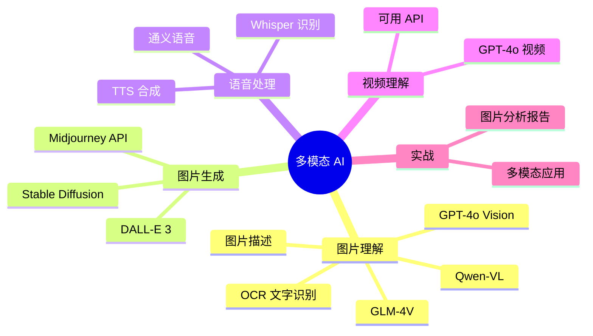
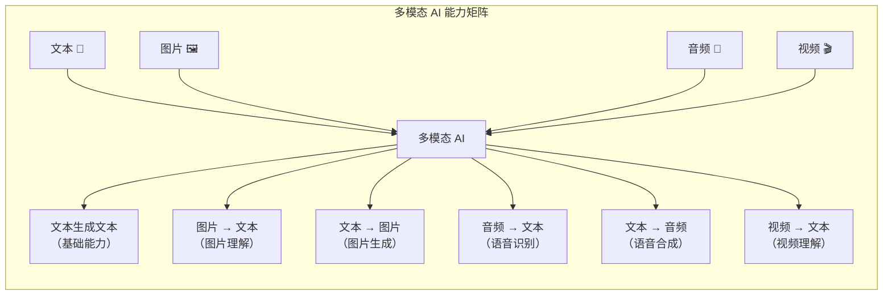
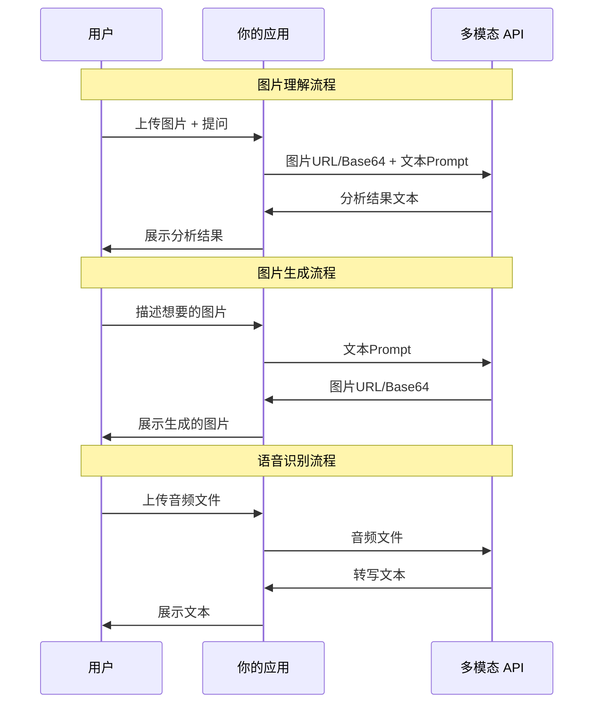
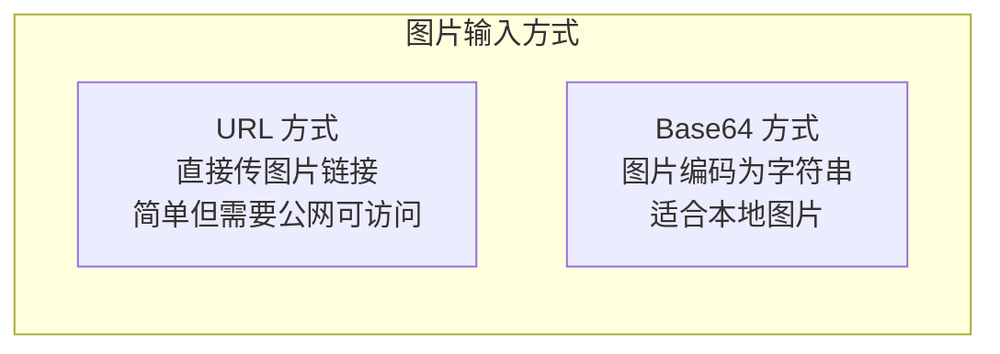
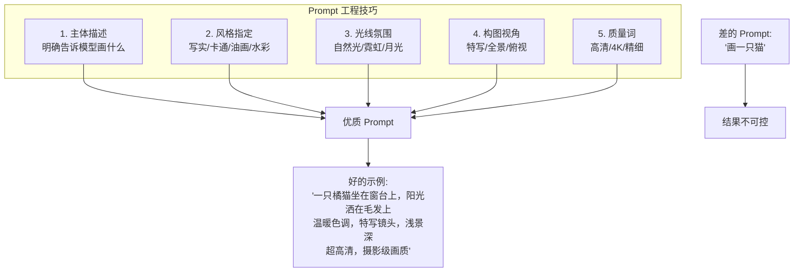
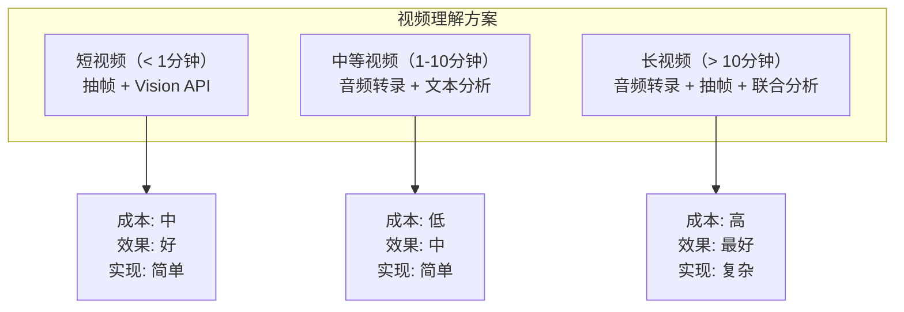
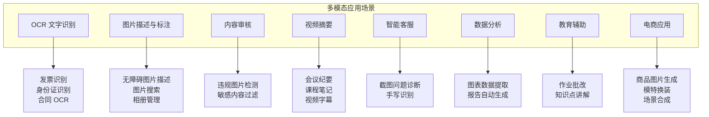
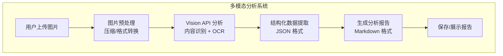
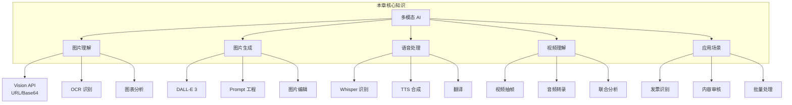

# 多模态 AI 完全指南

## 本章概览

多模态 AI 是大模型领域最激动人心的进展之一。从只能处理纯文本，到能"看"图片、"听"音频、"读"视频，AI 的感知能力正在快速接近人类水平。OpenAI 的 GPT-4o、智谱的 GLM-4V、通义的 Qwen-VL 等模型，让开发者可以用简单的 API 调用实现图片理解、图片生成、语音识别等强大功能。

学完本章，你将掌握：

- 多模态 AI 的能力全景图
- Vision API：让 AI 看懂图片
- 图片生成 API：让 AI 创作图片
- 语音识别与合成 API
- 视频理解 API
- 多模态应用场景与实战案例



---

## 1. 多模态 AI 概览

### 1.1 什么是多模态

"模态"指的是信息的载体形式。文本、图片、音频、视频都是不同的模态。多模态 AI 就是能同时理解和处理多种模态信息的 AI 系统。



### 1.2 主流多模态模型对比

| 模型 | 图片理解 | 图片生成 | 语音识别 | 语音合成 | 视频理解 | 特点 |
|------|---------|---------|---------|---------|---------|------|
| GPT-4o | ✅ | ✅ (DALL-E) | ✅ (Whisper) | ✅ (TTS) | ✅ | 全能，但贵 |
| GLM-4V | ✅ | ❌ | ✅ (合作) | ✅ (合作) | ❌ | 中文图片理解强 |
| Qwen-VL | ✅ | ❌ | ✅ (合作) | ✅ (合作) | ❌ | 开源生态好 |
| DeepSeek-VL | ✅ | ❌ | ❌ | ❌ | ❌ | 代码图表理解强 |
| Gemini | ✅ | ✅ | ✅ | ✅ | ✅ | Google 生态 |
| Claude | ✅ | ❌ | ❌ | ❌ | ❌ | 长文档+图片 |

### 1.3 多模态 API 的通用模式



---

## 2. 图片理解（Vision API）

### 2.1 GPT-4o Vision

GPT-4o 是目前最强大的通用多模态模型，可以理解图片内容、分析图表、读取文档等。

#### 图片输入方式

Vision API 支持两种图片输入方式：

1. **URL 方式**：提供图片的公开 URL
2. **Base64 方式**：将图片编码为 Base64 字符串



#### 基础调用（URL 方式）

```python
# vision_url.py
import os
from openai import OpenAI

client = OpenAI(api_key=os.environ.get("OPENAI_API_KEY"))

response = client.chat.completions.create(
    model="gpt-4o",
    messages=[
        {
            "role": "user",
            "content": [
                {
                    "type": "text",
                    "text": "请详细描述这张图片的内容。"
                },
                {
                    "type": "image_url",
                    "image_url": {
                        "url": "https://upload.wikimedia.org/wikipedia/commons/thumb/d/d7/Blue_mosque_Istanbul_Turkey_retouched.jpg/800px-Blue_mosque_Istanbul_Turkey_retouched.jpg",
                        "detail": "high"  # low / high / auto
                    }
                }
            ]
        }
    ],
    max_tokens=500
)

print(response.choices[0].message.content)

# 运行结果:
# 这是一张伊斯坦布尔蓝色清真寺（苏丹艾哈迈德清真寺）的照片。照片展示了清真寺标志性的六座宣礼塔和巨大的中央穹顶。
# 建筑外墙为浅蓝色，装饰有精美的伊斯兰几何图案。前景可以看到庭院和喷泉。
# 天空晴朗，蓝天的颜色与清真寺的蓝色装饰相得益彰。整体构图大气，展现了奥斯曼建筑的宏伟。
```

#### 基础调用（Base64 方式）

```python
# vision_base64.py
import os
import base64
from openai import OpenAI

client = OpenAI(api_key=os.environ.get("OPENAI_API_KEY"))

# 读取本地图片并编码为 Base64
def encode_image(image_path):
    with open(image_path, "rb") as image_file:
        return base64.b64encode(image_file.read()).decode("utf-8")

# 编码图片
image_path = "screenshot.png"  # 替换为你的图片路径
base64_image = encode_image(image_path)

response = client.chat.completions.create(
    model="gpt-4o",
    messages=[
        {
            "role": "user",
            "content": [
                {
                    "type": "text",
                    "text": "这张图片里有什么？请用中文描述。"
                },
                {
                    "type": "image_url",
                    "image_url": {
                        "url": f"data:image/png;base64,{base64_image}"
                    }
                }
            ]
        }
    ],
    max_tokens=500
)

print(response.choices[0].message.content)

# 运行结果（假设图片是一个 Spring Boot 项目结构截图）:
# 这张图片显示了一个 Spring Boot 项目的目录结构，包含以下内容：
# - src/main/java 下有控制器、服务、实体等包
# - src/main/resources 下有 application.yml 配置文件
# - pom.xml 是 Maven 构建文件
# 这是一个标准的 Spring Boot 分层架构项目。
```

#### detail 参数详解

`detail` 参数控制图片的解析精度：

| 值 | Token 消耗 | 适用场景 |
|------|-----------|---------|
| `low` | 约 85 tokens | 简单描述、快速处理 |
| `high` | 约 765 tokens（1105×1105 像素） | 需要细节分析 |
| `auto` | 自动决定 | 让模型自行判断 |

:::tip 成本提示
Vision API 的图片 Token 消耗远高于纯文本。一张 high detail 的图片约消耗 765 个 input tokens。如果需要分析大量图片，注意控制成本。
:::

### 2.2 多图片分析

Vision API 支持同时传入多张图片：

```python
# vision_multi.py
import os
from openai import OpenAI

client = OpenAI(api_key=os.environ.get("OPENAI_API_KEY"))

response = client.chat.completions.create(
    model="gpt-4o",
    messages=[
        {
            "role": "user",
            "content": [
                {
                    "type": "text",
                    "text": "请对比这两张图片，找出它们的相同点和不同点。"
                },
                {
                    "type": "image_url",
                    "image_url": {
                        "url": "https://images.unsplash.com/photo-1494526585095-c41746248156?w=400",
                        "detail": "low"
                    }
                },
                {
                    "type": "image_url",
                    "image_url": {
                        "url": "https://images.unsplash.com/photo-1506744038136-46273834b3fb?w=400",
                        "detail": "low"
                    }
                }
            ]
        }
    ],
    max_tokens=500
)

print(response.choices[0].message.content)

# 运行结果:
# 这两张图片的对比分析：
#
# 相同点：
# - 都是风景摄影作品，构图精美
# - 都展现了自然景观的壮美
# - 色彩丰富，光影效果出色
#
# 不同点：
# - 第一张是城市建筑景观（可能是欧洲古堡），第二张是自然山水风光
# - 第一张色调偏暖，第二张色调偏冷（蓝色、绿色为主）
# - 第一张有人物元素，第二张是纯自然景观
# - 构图角度不同：第一张是仰视，第二张是平视
```

### 2.3 实用场景示例

#### OCR 文字识别

```python
# ocr_example.py
import os
import base64
from openai import OpenAI

client = OpenAI(api_key=os.environ.get("OPENAI_API_KEY"))

def encode_image(image_path):
    with open(image_path, "rb") as f:
        return base64.b64encode(f.read()).decode("utf-8")

# 假设有一张包含代码截图的图片
base64_image = encode_image("code_screenshot.png")

response = client.chat.completions.create(
    model="gpt-4o",
    messages=[
        {
            "role": "user",
            "content": [
                {
                    "type": "text",
                    "text": """请识别这张图片中的所有文字和代码，并按以下格式输出：
1. 完整还原代码内容（保持格式）
2. 分析代码的功能
3. 如果代码有错误，指出并给出修复建议"""
                },
                {
                    "type": "image_url",
                    "image_url": {"url": f"data:image/png;base64,{base64_image}"}
                }
            ]
        }
    ],
    max_tokens=1000
)

print(response.choices[0].message.content)

# 运行结果（假设图片中是一个 Java 类的截图）:
# 1. 完整还原代码：
# public class UserService {
#     private UserRepository repo;
#
#     public User getUser(Long id) {
#         return repo.findById(id).orElse(null);
#     }
#
#     public User createUser(String name, String email) {
#         User user = new User(name, email);
#         return repo.save(user);
#     }
# }
#
# 2. 功能分析：
# 这是一个简单的用户服务类，提供用户查询和创建功能。依赖注入了 UserRepository。
#
# 3. 改进建议：
# - orElse(null) 应该改为 orElseThrow()，避免返回 null
# - 缺少参数校验（name 和 email 可能为空）
# - 建议添加 @Service 注解和构造器注入
```

#### 图表分析

```python
# chart_analysis.py
import os
from openai import OpenAI

client = OpenAI(api_key=os.environ.get("OPENAI_API_KEY"))

response = client.chat.completions.create(
    model="gpt-4o",
    messages=[
        {
            "role": "user",
            "content": [
                {
                    "type": "text",
                    "text": """请分析这张图表：
1. 图表类型是什么？
2. 描述数据趋势
3. 提取所有具体数值
4. 给出你的解读和建议"""
                },
                {
                    "type": "image_url",
                    "image_url": {
                        "url": "https://upload.wikimedia.org/wikipedia/commons/thumb/4/48/GDP_of_China_since_1952.svg/800px-GDP_of_China_since_1952.svg.png",
                        "detail": "high"
                    }
                }
            ]
        }
    ],
    max_tokens=800
)

print(response.choices[0].message.content)

# 运行结果:
# 1. 图表类型：折线图/面积图
#
# 2. 数据趋势：
# - 1952-1978年：GDP 增长缓慢，基本维持在较低水平
# - 1978年后（改革开放）：开始快速增长
# - 2000年后：增长加速，曲线陡峭上升
# - 整体呈现指数增长趋势
#
# 3. 关键数值（约）：
# - 1952年：约 680 亿元
# - 1978年：约 3679 亿元
# - 2000年：约 10万亿元
# - 2010年：约 41万亿元
# - 最新：约 126万亿元
#
# 4. 解读：
# 改革开放是经济增长的关键转折点。近年来增速有所放缓，
# 但从绝对值看仍然是全球第二大经济体。
```

### 2.4 智谱 GLM-4V

智谱的 GLM-4V 在中文图片理解场景表现优秀：

```python
# glm4v_example.py
import os
import base64
from zhipuai import ZhipuAI

client = ZhipuAI(api_key=os.environ.get("ZHIPU_API_KEY"))

# 读取图片
with open("photo.jpg", "rb") as f:
    image_base64 = base64.b64encode(f.read()).decode("utf-8")

response = client.chat.completions.create(
    model="glm-4v-plus",
    messages=[
        {
            "role": "user",
            "content": [
                {
                    "type": "image_url",
                    "image_url": {"url": f"data:image/jpeg;base64,{image_base64}"}
                },
                {
                    "type": "text",
                    "text": "请描述这张图片的内容。"
                }
            ]
        }
    ],
    max_tokens=300
)

print(response.choices[0].message.content)

# 运行结果:
# 这是一张城市夜景照片。画面中可以看到高楼大厦的灯光倒映在河面上，
# 形成美丽的对称效果。天空呈现深蓝色，远处有微弱的云层。
# 桥梁横跨河面，桥上和桥下的灯光交相辉映。
```

### 2.5 通义 Qwen-VL

```python
# qwen_vl_example.py
import os
from openai import OpenAI

# 通义千问 VL 也支持 OpenAI 兼容格式
client = OpenAI(
    api_key=os.environ.get("DASHSCOPE_API_KEY"),
    base_url="https://dashscope.aliyuncs.com/compatible-mode/v1"
)

response = client.chat.completions.create(
    model="qwen-vl-plus",
    messages=[
        {
            "role": "user",
            "content": [
                {
                    "type": "image_url",
                    "image_url": {
                        "url": "https://img.alicdn.com/tfs/TB1gwoyv.T1gK0jSZFrXXcNCXXa-600-400.jpg"
                    }
                },
                {
                    "type": "text",
                    "text": "这张图片里有什么？"
                }
            ]
        }
    ],
    max_tokens=300
)

print(response.choices[0].message.content)

# 运行结果:
# 这张图片展示了一个温馨的室内场景。可以看到一个现代化的厨房，
# 木质台面上摆放着新鲜的蔬菜和水果，背景中有暖色调的灯光照明。
```

---

## 3. 图片生成

### 3.1 DALL-E 3

DALL-E 3 是 OpenAI 的图片生成模型，通过 Chat Completions API 调用：

```python
# dalle_generate.py
import os
from openai import OpenAI

client = OpenAI(api_key=os.environ.get("OPENAI_API_KEY"))

response = client.images.generate(
    model="dall-e-3",
    prompt="一只戴着眼镜的猫坐在电脑前写 Java 代码，赛博朋克风格，高清",
    size="1024x1024",      # 1024x1024, 1792x1024, 1024x1792
    quality="hd",           # standard 或 hd
    n=1,                    # 生成数量（1-10）
    style="vivid",          # vivid 或 natural
    response_format="url"   # url 或 b64_json
)

# 获取生成的图片
image_url = response.data[0].url
revised_prompt = response.data[0].revised_prompt

print(f"🖼️ 图片URL: {image_url}")
print(f"📝 修改后的提示词: {revised_prompt}")

# 运行结果:
# 🖼️ 图片URL: https://oaidalleapiprodscus.blob.core.windows.net/protected-images/xxxxx
# 📝 修改后的提示词: A cat wearing round glasses sitting at a desk with multiple monitors displaying Java code. Cyberpunk aesthetic with neon lighting, high detail, 4K resolution. The cat has a focused expression, paws on a mechanical keyboard. Background features a futuristic cityscape through a window with rain.
```

:::tip DALL-E 3 的 Prompt 自动优化
DALL-E 3 会自动重写你的 Prompt，让生成的图片更符合预期。你可以通过 `revised_prompt` 字段看到模型实际使用的 Prompt。如果不满意，可以根据这个修改后的 Prompt 再调整。
:::

#### DALL-E 3 定价

| 尺寸 | quality: standard | quality: hd |
|------|-------------------|-------------|
| 1024×1024 | $0.040/张 | $0.080/张 |
| 1792×1024 | $0.080/张 | $0.120/张 |
| 1024×1792 | $0.080/张 | $0.120/张 |

#### 图片编辑

```python
# dalle_edit.py
import os
from openai import OpenAI

client = OpenAI(api_key=os.environ.get("OPENAI_API_KEY"))

# 注意：图片编辑使用 DALL-E 2
response = client.images.edit(
    model="dall-e-2",
    image=open("original.png", "rb"),      # 原图
    mask=open("mask.png", "rb"),            # 遮罩（白色区域会被替换）
    prompt="在空白处画一只可爱的柯基犬",
    size="1024x1024",
    n=1
)

print(f"编辑后的图片: {response.data[0].url}")

# 运行结果:
# 编辑后的图片: https://oaidalleapiprodscus.blob.core.windows.net/protected-images/yyyyy
```

#### 图片变体

```python
# dalle_variation.py
import os
from openai import OpenAI

client = OpenAI(api_key=os.environ.get("OPENAI_API_KEY"))

response = client.images.create_variation(
    model="dall-e-2",
    image=open("photo.png", "rb"),
    n=2,           # 生成 2 个变体
    size="1024x1024"
)

for i, img in enumerate(response.data):
    print(f"变体 {i+1}: {img.url}")

# 运行结果:
# 变体 1: https://oaidalleapiprodscus.blob.core.windows.net/protected-images/var1
# 变体 2: https://oaidalleapiprodscus.blob.core.windows.net/protected-images/var2
```

### 3.2 Stable Diffusion（通过 Replicate API）

Stable Diffusion 是开源的图片生成模型，可以通过 Replicate 等平台调用：

```python
# stable_diffusion.py
import os
import requests

# 使用 Replicate API（需要注册获取 token）
REPLICATE_API_TOKEN = os.environ.get("REPLICATE_API_TOKEN")

def generate_image(prompt):
    """通过 Replicate API 调用 Stable Diffusion"""
    url = "https://api.replicate.com/v1/predictions"

    headers = {
        "Authorization": f"Token {REPLICATE_API_TOKEN}",
        "Content-Type": "application/json"
    }

    # 创建预测任务
    payload = {
        "version": "sd-3.0",  # Stable Diffusion 3.0
        "input": {
            "prompt": prompt,
            "width": 1024,
            "height": 1024,
            "num_outputs": 1,
        }
    }

    response = requests.post(url, headers=headers, json=payload)
    prediction = response.json()
    print(f"预测任务已创建: {prediction['id']}")
    print(f"状态: {prediction['status']}")

    # 轮询获取结果
    get_url = f"https://api.replicate.com/v1/predictions/{prediction['id']}"

    import time
    while True:
        response = requests.get(get_url, headers=headers)
        result = response.json()
        status = result["status"]

        if status == "succeeded":
            print(f"✅ 图片生成成功!")
            print(f"🖼️ URL: {result['output'][0]}")
            return result["output"][0]
        elif status == "failed":
            print(f"❌ 生成失败: {result.get('error')}")
            return None
        else:
            print(f"⏳ 状态: {status}...")
            time.sleep(3)

# 测试
image_url = generate_image(
    "A cute corgi sitting in front of a computer, pixel art style, 8-bit"
)

# 运行结果:
# 预测任务已创建: abc123xyz
# 状态: starting
# ⏳ 状态: processing...
# ⏳ 状态: processing...
# ✅ 图片生成成功!
# 🖼️ URL: https://replicate.delivery/xxx/output.webp
```

### 3.3 图片生成最佳实践



---

## 4. 语音识别与合成

### 4.1 Whisper 语音识别

OpenAI 的 Whisper 模型支持多语言语音识别：

```python
# whisper_transcribe.py
import os
from openai import OpenAI

client = OpenAI(api_key=os.environ.get("OPENAI_API_KEY"))

# 方式一：上传文件进行转录
with open("meeting_audio.mp3", "rb") as audio_file:
    transcription = client.audio.transcriptions.create(
        model="whisper-1",
        file=audio_file,
        language="zh",            # 指定语言（可选，自动检测也行）
        response_format="verbose_json",  # detailed / json / text / srt / vtt
        temperature=0.0,          # 低温度更准确
    )

print(f"📝 转录文本: {transcription.text}")

if hasattr(transcription, 'segments'):
    print(f"\n📊 详细信息:")
    print(f"   语言: {transcription.language}")
    print(f"   时长: {transcription.duration:.1f}s")
    print(f"\n   分段信息:")
    for seg in transcription.segments:
        start = seg['start']
        end = seg['end']
        text = seg['text']
        print(f"   [{start:.1f}s - {end:.1f}s] {text}")

# 运行结果:
# 📝 转录文本: 今天的会议主要讨论了三个议题。第一，关于新版本发布的时间安排；第二，用户反馈中提到的性能问题；第三，下季度的技术规划。
#
# 📊 详细信息:
#    语言: zh
#    时长: 15.3s
#
#    分段信息:
#    [0.0s - 5.2s] 今天的会议主要讨论了三个议题。
#    [5.2s - 8.1s] 第一，关于新版本发布的时间安排；
#    [8.1s - 12.5s] 第二，用户反馈中提到的性能问题；
#    [12.5s - 15.3s] 第三，下季度的技术规划。
```

#### Whisper 支持的格式

| 格式 | 支持情况 |
|------|---------|
| mp3 | ✅ |
| mp4 | ✅ |
| mpeg | ✅ |
| mpga | ✅ |
| m4a | ✅ |
| wav | ✅ |
| webm | ✅ |

#### Whisper 翻译

```python
# whisper_translate.py
import os
from openai import OpenAI

client = OpenAI(api_key=os.environ.get("OPENAI_API_KEY"))

with open("chinese_audio.mp3", "rb") as audio_file:
    translation = client.audio.translations.create(
        model="whisper-1",
        file=audio_file,
        response_format="text"
    )

print(f"🌐 翻译结果: {translation}")

# 运行结果（假设音频是中文）:
# 🌐 翻译结果: Today's meeting mainly discussed three topics. First, the timeline for the new version release; second, the performance issues mentioned in user feedback; third, the technical planning for next quarter.
```

### 4.2 TTS 语音合成

OpenAI 提供了 Text-to-Speech API：

```python
# tts_generate.py
import os
from openai import OpenAI
from pathlib import Path

client = OpenAI(api_key=os.environ.get("OPENAI_API_KEY"))

speech_file = Path("output_speech.mp3")

response = client.audio.speech.create(
    model="tts-1",        # tts-1（快）或 tts-1-hd（高质量）
    voice="alloy",         # alloy, echo, fable, onyx, nova, shimmer
    input="你好，我是你的 AI 助手。今天有什么可以帮你的吗？",
    speed=1.0,             # 0.25 到 4.0
)

# 保存音频文件
response.stream_to_file(speech_file)
print(f"✅ 语音已保存到: {speech_file}")
print(f"   文件大小: {speech_file.stat().st_size / 1024:.1f} KB")

# 运行结果:
# ✅ 语音已保存到: output_speech.mp3
#    文件大小: 42.3 KB
```

#### TTS 流式输出

```python
# tts_stream.py
import os
from openai import OpenAI

client = OpenAI(api_key=os.environ.get("OPENAI_API_KEY"))

# 流式生成语音
response = client.audio.speech.create(
    model="tts-1",
    voice="nova",
    input="这是一段测试语音，用于验证流式输出功能是否正常工作。",
    response_format="mp3",
)

# 将流式音频写入文件
with open("stream_output.mp3", "wb") as f:
    for chunk in response.iter_bytes(chunk_size=4096):
        f.write(chunk)

print("✅ 流式语音已保存到: stream_output.mp3")
```

#### 可用语音列表

| 语音 | 特点 |
|------|------|
| alloy | 中性，平衡 |
| echo | 男性，温暖 |
| fable | 英式，故事感 |
| onyx | 深沉，专业 |
| nova | 女性，活力 |
| shimmer | 柔和，亲切 |

### 4.3 Whisper 定价

| 模型 | 价格 |
|------|------|
| whisper-1 | $0.006/分钟 |

| 模型 | 价格 |
|------|------|
| tts-1 | $15.00/百万字符 |
| tts-1-hd | $30.00/百万字符 |

---

## 5. 视频理解

### 5.1 GPT-4o 视频理解

GPT-4o 支持视频理解，但需要将视频抽帧为图片后传入：

```python
# video_understanding.py
import os
import base64
from openai import OpenAI

client = OpenAI(api_key=os.environ.get("OPENAI_API_KEY"))

def extract_video_frames(video_path, interval=2):
    """
    从视频中抽取关键帧
    interval: 每隔多少秒抽一帧
    需要安装 ffmpeg: brew install ffmpeg
    """
    import subprocess

    # 创建临时目录
    os.makedirs("frames", exist_ok=True)

    # 使用 ffmpeg 抽帧
    cmd = [
        "ffmpeg", "-i", video_path,
        "-vf", f"fps=1/{interval}",
        "frames/frame_%03d.jpg",
        "-y"
    ]
    subprocess.run(cmd, capture_output=True)

    # 读取所有帧
    frames = []
    for filename in sorted(os.listdir("frames")):
        if filename.endswith(".jpg"):
            with open(f"frames/{filename}", "rb") as f:
                frames.append(base64.b64encode(f.read()).decode("utf-8"))

    return frames


def analyze_video(video_path, question, interval=3, max_frames=10):
    """分析视频内容"""
    frames = extract_video_frames(video_path, interval)

    # 限制帧数
    frames = frames[:max_frames]

    print(f"🎬 提取了 {len(frames)} 帧")

    # 构建消息
    content = [{"type": "text", "text": question}]

    for i, frame in enumerate(frames):
        content.append({
            "type": "image_url",
            "image_url": {
                "url": f"data:image/jpeg;base64,{frame}",
                "detail": "low"  # 视频帧用 low detail 节省 Token
            }
        })

    response = client.chat.completions.create(
        model="gpt-4o",
        messages=[
            {
                "role": "user",
                "content": content
            }
        ],
        max_tokens=1000
    )

    return response.choices[0].message.content

# 使用示例
result = analyze_video(
    "tutorial_video.mp4",
    "请总结这个视频的主要内容，包括：1. 视频讲了什么 2. 关键步骤 3. 要点总结",
    interval=5,
    max_frames=8
)
print(result)

# 运行结果（假设是一个 Java Spring Boot 教程视频）:
# 🎬 提取了 8 帧
#
# 1. 视频内容概述：
# 这是一个 Spring Boot 入门教程视频，演示了如何从零开始创建一个 REST API 项目。
#
# 2. 关键步骤：
# - 使用 Spring Initializr 创建项目骨架
# - 配置 application.yml 数据库连接
# - 创建实体类（Entity）和 Repository
# - 实现 Service 层业务逻辑
# - 创建 Controller 处理 HTTP 请求
# - 使用 Postman 测试 API
#
# 3. 要点总结：
# - Spring Boot 简化了项目配置
# - 遵循 Controller-Service-Repository 分层架构
# - 使用 JPA 进行数据库操作
# - RESTful API 的标准设计规范
```

:::warning 视频理解的限制
1. **不是真正的视频理解**：GPT-4o 是把视频抽帧成图片序列来理解的，不是直接处理视频流
2. **Token 消耗大**：每帧图片都要消耗 Token，长视频成本很高
3. **缺少时序信息**：帧之间的时间间隔和动态变化可能丢失
4. **建议**：短视频（< 1 分钟）用抽帧方式，长视频建议先转录音频再分析
:::

### 5.2 视频理解方案对比



---

## 6. 多模态应用场景

### 6.1 场景总览



### 6.2 智能发票识别

```python
# invoice_ocr.py
import os
import base64
import json
from openai import OpenAI

client = OpenAI(api_key=os.environ.get("OPENAI_API_KEY"))

def analyze_invoice(image_path):
    """分析发票图片，提取结构化数据"""
    with open(image_path, "rb") as f:
        image_data = base64.b64encode(f.read()).decode("utf-8")

    response = client.chat.completions.create(
        model="gpt-4o",
        messages=[
            {
                "role": "system",
                "content": """你是一个发票识别专家。请从发票图片中提取以下信息，并以 JSON 格式返回：
{
    "invoice_type": "发票类型",
    "invoice_number": "发票号码",
    "invoice_date": "开票日期",
    "seller_name": "销售方名称",
    "seller_tax_id": "销售方纳税人识别号",
    "buyer_name": "购买方名称",
    "buyer_tax_id": "购买方纳税人识别号",
    "items": [
        {
            "name": "商品名称",
            "quantity": "数量",
            "unit_price": "单价",
            "amount": "金额",
            "tax_rate": "税率",
            "tax_amount": "税额"
        }
    ],
    "total_amount": "合计金额",
    "total_tax": "合计税额",
    "total_with_tax": "价税合计"
}
只返回 JSON，不要其他内容。"""
            },
            {
                "role": "user",
                "content": [
                    {
                        "type": "image_url",
                        "image_url": {
                            "url": f"data:image/jpeg;base64,{image_data}",
                            "detail": "high"
                        }
                    },
                    {
                        "type": "text",
                        "text": "请识别这张发票"
                    }
                ]
            }
        ],
        max_tokens=1000,
        temperature=0.0  # OCR 场景用 0 温度确保准确
    )

    content = response.choices[0].message.content
    return json.loads(content)

# 使用示例
result = analyze_invoice("invoice.jpg")
print(json.dumps(result, indent=2, ensure_ascii=False))

# 运行结果:
# {
#   "invoice_type": "增值税电子普通发票",
#   "invoice_number": "033001900111",
#   "invoice_date": "2024年01月15日",
#   "seller_name": "北京科技有限公司",
#   "seller_tax_id": "91110108MA01XXXXX",
#   "buyer_name": "上海贸易有限公司",
#   "buyer_tax_id": "91310115MA1HXXXXX",
#   "items": [
#     {
#       "name": "软件开发服务",
#       "quantity": "1",
#       "unit_price": "50000.00",
#       "amount": "50000.00",
#       "tax_rate": "6%",
#       "tax_amount": "3000.00"
#     }
#   ],
#   "total_amount": "50000.00",
#   "total_tax": "3000.00",
#   "total_with_tax": "53000.00"
# }
```

### 6.3 内容审核系统

```python
# content_moderation.py
import os
import base64
from openai import OpenAI

client = OpenAI(api_key=os.environ.get("OPENAI_API_KEY"))

def moderate_image(image_path):
    """图片内容审核"""
    with open(image_path, "rb") as f:
        image_data = base64.b64encode(f.read()).decode("utf-8")

    response = client.chat.completions.create(
        model="gpt-4o",
        messages=[
            {
                "role": "system",
                "content": """你是一个内容审核助手。请检查图片是否包含以下违规内容：
1. 暴力血腥
2. 色情低俗
3. 政治敏感
4. 违法犯罪
5. 虚假信息

请以 JSON 格式返回：
{
    "is_safe": true/false,
    "risk_level": "none/low/medium/high",
    "categories": ["检测到的风险类别"],
    "description": "详细说明",
    "confidence": 0.95
}"""
            },
            {
                "role": "user",
                "content": [
                    {
                        "type": "image_url",
                        "image_url": {
                            "url": f"data:image/jpeg;base64,{image_data}",
                            "detail": "low"
                        }
                    }
                ]
            }
        ],
        max_tokens=500,
        temperature=0.0
    )

    return response.choices[0].message.content

# 使用示例
result = moderate_image("user_upload.jpg")
print(result)

# 运行结果:
# {
#     "is_safe": true,
#     "risk_level": "none",
#     "categories": [],
#     "description": "图片内容为一张风景照片，包含山川、河流和蓝天，未发现违规内容。",
#     "confidence": 0.98
# }
```

---

## 7. 实战：上传图片让 AI 分析内容并生成报告

### 7.1 项目设计



### 7.2 完整代码

```python
# image_analyzer.py
#!/usr/bin/env python3
"""
多模态图片分析工具
- 支持上传图片（URL 或本地文件）
- 自动分析图片内容
- 生成结构化分析报告
"""

import os
import sys
import base64
import json
from datetime import datetime
from pathlib import Path
from openai import OpenAI

client = OpenAI(api_key=os.environ.get("OPENAI_API_KEY"))


class ImageAnalyzer:
    """多模态图片分析器"""

    def __init__(self, model="gpt-4o"):
        self.model = model

    def _encode_image(self, image_path):
        """将本地图片编码为 Base64"""
        with open(image_path, "rb") as f:
            return base64.b64encode(f.read()).decode("utf-8")

    def _detect_image_type(self, image_path):
        """检测图片类型"""
        ext = Path(image_path).suffix.lower()
        type_map = {
            ".jpg": "jpeg", ".jpeg": "jpeg",
            ".png": "png", ".gif": "gif",
            ".webp": "webp", ".bmp": "bmp"
        }
        return type_map.get(ext, "jpeg")

    def analyze(self, image_source, analysis_type="general"):
        """
        分析图片

        Args:
            image_source: 图片路径或 URL
            analysis_type: 分析类型
                - general: 通用描述
                - ocr: 文字识别
                - chart: 图表分析
                - code: 代码截图分析
                - invoice: 发票识别
                - auto: 自动判断
        """
        # 构建 image_url
        if image_source.startswith("http"):
            image_url = {"url": image_source}
        else:
            if not os.path.exists(image_source):
                raise FileNotFoundError(f"图片不存在: {image_source}")
            base64_data = self._encode_image(image_source)
            mime_type = self._detect_image_type(image_source)
            image_url = {"url": f"data:image/{mime_type};base64,{base64_data}"}

        # 自动检测分析类型
        if analysis_type == "auto":
            analysis_type = self._auto_detect_type(image_source, image_url)

        # 根据类型选择 Prompt
        prompts = {
            "general": self._prompt_general,
            "ocr": self._prompt_ocr,
            "chart": self._prompt_chart,
            "code": self._prompt_code,
            "invoice": self._prompt_invoice,
        }

        prompt_func = prompts.get(analysis_type, self._prompt_general)
        system_prompt, user_prompt = prompt_func()

        # 调用 API
        response = client.chat.completions.create(
            model=self.model,
            messages=[
                {"role": "system", "content": system_prompt},
                {
                    "role": "user",
                    "content": [
                        {"type": "text", "text": user_prompt},
                        {"type": "image_url", "image_url": image_url}
                    ]
                }
            ],
            max_tokens=2000,
            temperature=0.0,
        )

        return {
            "type": analysis_type,
            "content": response.choices[0].message.content,
            "model": self.model,
            "timestamp": datetime.now().isoformat(),
            "usage": {
                "prompt_tokens": response.usage.prompt_tokens,
                "completion_tokens": response.usage.completion_tokens,
                "total_tokens": response.usage.total_tokens,
            }
        }

    def _auto_detect_type(self, image_source, image_url):
        """自动检测图片类型"""
        # 先用 Vision API 快速判断
        response = client.chat.completions.create(
            model="gpt-4o-mini",
            messages=[
                {
                    "role": "user",
                    "content": [
                        {
                            "type": "text",
                            "text": "这张图片主要是什么类型？只回答一个词：chart/code/text/invoice/photo/other"
                        },
                        {"type": "image_url", "image_url": image_url}
                    ]
                }
            ],
            max_tokens=20,
            temperature=0.0,
        )

        answer = response.choices[0].message.content.strip().lower()

        type_map = {
            "chart": "chart",
            "code": "code",
            "text": "ocr",
            "invoice": "invoice",
        }

        return type_map.get(answer, "general")

    def _prompt_general(self):
        return (
            "你是一个图片分析专家。请详细描述图片内容。",
            "请从以下维度分析这张图片：\n"
            "1. 整体描述（主题、场景、风格）\n"
            "2. 细节描述（关键元素、颜色、布局）\n"
            "3. 情感/氛围\n"
            "4. 可能的用途或背景"
        )

    def _prompt_ocr(self):
        return (
            "你是一个 OCR 文字识别专家。请准确识别图片中的所有文字。",
            "请识别图片中的所有文字，要求：\n"
            "1. 完整还原文字内容，保持原始格式\n"
            "2. 如果有标题和正文，请区分\n"
            "3. 如果有数字、日期等，请确保准确\n"
            "4. 标注不确定的字符"
        )

    def _prompt_chart(self):
        return (
            "你是一个数据分析专家，擅长解读图表。",
            "请分析这张图表：\n"
            "1. 图表类型\n"
            "2. 数据趋势\n"
            "3. 关键数据点（具体数值）\n"
            "4. 数据洞察和建议\n"
            "5. 用 JSON 格式提取所有数据"
        )

    def _prompt_code(self):
        return (
            "你是一个资深程序员，擅长代码分析和审查。",
            "请分析这张代码截图：\n"
            "1. 编程语言和框架\n"
            "2. 完整还原代码\n"
            "3. 代码功能说明\n"
            "4. 潜在问题和 Bug\n"
            "5. 改进建议"
        )

    def _prompt_invoice(self):
        return (
            "你是一个发票 OCR 专家。请提取发票中的所有信息。",
            "请以 JSON 格式提取发票信息：\n"
            "{\n"
            '  "invoice_type": "",\n'
            '  "invoice_number": "",\n'
            '  "date": "",\n'
            '  "seller": "",\n'
            '  "buyer": "",\n'
            '  "items": [],\n'
            '  "total": ""\n'
            "}\n"
            "只返回 JSON。"
        )

    def generate_report(self, result, output_path=None):
        """生成 Markdown 格式的分析报告"""
        report = f"""# 图片分析报告

## 基本信息
- **分析时间**: {result['timestamp']}
- **使用模型**: {result['model']}
- **分析类型**: {result['type']}
- **Token 消耗**: {result['usage']['total_tokens']} (输入: {result['usage']['prompt_tokens']}, 输出: {result['usage']['completion_tokens']})

## 分析结果

{result['content']}

---

*报告由多模态图片分析工具自动生成*
"""
        if output_path:
            with open(output_path, "w", encoding="utf-8") as f:
                f.write(report)
            print(f"📄 报告已保存到: {output_path}")

        return report


# ==================== 命令行使用 ====================
def main():
    if len(sys.argv) < 2:
        print("用法: python image_analyzer.py <图片路径或URL> [分析类型]")
        print("分析类型: general / ocr / chart / code / invoice / auto")
        print("示例:")
        print("  python image_analyzer.py photo.jpg")
        print("  python image_analyzer.py screenshot.png code")
        print("  python image_analyzer.py chart.png auto")
        sys.exit(1)

    image_source = sys.argv[1]
    analysis_type = sys.argv[2] if len(sys.argv) > 2 else "auto"

    analyzer = ImageAnalyzer()

    print(f"🔍 正在分析图片: {image_source}")
    print(f"   分析类型: {analysis_type}")
    print()

    try:
        result = analyzer.analyze(image_source, analysis_type)

        print("=" * 60)
        print(f"📊 分析结果 ({result['type']})")
        print("=" * 60)
        print(result['content'])
        print()
        print(f"📈 Token: {result['usage']['total_tokens']}")
        print()

        # 生成报告
        timestamp = datetime.now().strftime("%Y%m%d_%H%M%S")
        report_path = f"report_{timestamp}.md"
        analyzer.generate_report(result, report_path)

    except Exception as e:
        print(f"❌ 分析失败: {e}")


if __name__ == "__main__":
    main()
```

### 7.3 运行效果

```bash
# 分析一张代码截图
$ python image_analyzer.py screenshot.png code

🔍 正在分析图片: screenshot.png
   分析类型: code

============================================================
📊 分析结果 (code)
============================================================
1. 编程语言和框架：Java，Spring Boot

2. 完整还原代码：
```java
@RestController
@RequestMapping("/api/users")
public class UserController {

    @Autowired
    private UserService userService;

    @GetMapping("/{id}")
    public ResponseEntity&lt;User&gt; getUser(@PathVariable Long id) {
        User user = userService.findById(id);
        return user != null
            ? ResponseEntity.ok(user)
            : ResponseEntity.notFound().build();
    }
}
```

3. 代码功能说明：
这是一个 Spring Boot REST Controller，提供用户查询 API。
通过 GET /api/users/{id} 获取指定 ID 的用户信息。

4. 潜在问题：
- 使用 @Autowired 字段注入，建议改为构造器注入
- 没有参数校验（id 可能为负数或 null）
- 没有统一异常处理
- 没有日志记录

5. 改进建议：
```java
@RestController
@RequestMapping("/api/users")
@RequiredArgsConstructor
public class UserController {
    private final UserService userService;

    @GetMapping("/{id}")
    public ResponseEntity&lt;User&gt; getUser(@PathVariable @Positive Long id) {
        return userService.findById(id)
            .map(ResponseEntity::ok)
            .orElse(ResponseEntity.notFound().build());
    }
}
```

📈 Token: 856

📄 报告已保存到: report_20240115_143022.md
```

### 7.4 批量分析

```python
# batch_analyze.py
import os
from pathlib import Path
from image_analyzer import ImageAnalyzer

def batch_analyze(directory, pattern="*.jpg"):
    """批量分析目录下的图片"""
    analyzer = ImageAnalyzer()

    images = sorted(Path(directory).glob(pattern))
    print(f"📂 找到 {len(images)} 张图片\n")

    results = []
    for i, img_path in enumerate(images, 1):
        print(f"[{i}/{len(images)}] 分析: {img_path.name}")
        try:
            result = analyzer.analyze(str(img_path), analysis_type="auto")
            results.append({
                "file": img_path.name,
                "type": result["type"],
                "summary": result["content"][:100] + "...",
                "tokens": result["usage"]["total_tokens"]
            })
            print(f"   类型: {result['type']} | Token: {result['usage']['total_tokens']}")
        except Exception as e:
            print(f"   ❌ 失败: {e}")
        print()

    # 汇总
    print("=" * 60)
    print("📊 批量分析汇总")
    print("=" * 60)
    total_tokens = sum(r["tokens"] for r in results)
    print(f"   成功: {len(results)}/{len(images)}")
    print(f"   总 Token: {total_tokens:,}")
    for r in results:
        print(f"   {r['file']}: [{r['type']}] {r['summary']}")

# 使用
batch_analyze("./screenshots", "*.png")

# 运行结果:
# 📂 找到 5 张图片
#
# [1/5] 分析: error_page.png
#    类型: ocr | Token: 342
#
# [2/5] 分析: api_response.png
#    类型: code | Token: 567
#
# [3/5] 分析: sales_chart.png
#    类型: chart | Token: 789
#
# [4/5] 分析: team_photo.jpg
#    类型: general | Token: 234
#
# [5/5] 分析: receipt.jpg
#    类型: invoice | Token: 456
#
# ============================================================
# 📊 批量分析汇总
# ============================================================
#    成功: 5/5
#    总 Token: 2,388
#    error_page.png: [ocr] 图片中显示了一个 HTTP 500 错误页面，包含堆栈信息...
#    api_response.png: [code] 这是一个 JSON API 响应截图，包含用户列表数据...
#    sales_chart.png: [chart] 这是一张柱状图，展示了2024年各月销售额...
#    team_photo.jpg: [general] 一张团队合影，6个人站在办公室前...
#    receipt.jpg: [invoice] 餐饮小票，金额 156.80 元，日期 2024-01-15...
```

---

## 8. 本章小结



关键要点：

1. **图片理解是最成熟的多模态能力**：GPT-4o、GLM-4V、Qwen-VL 都能很好地理解图片
2. **Vision API 的关键参数**：`detail` 控制精度和成本，`temperature=0` 适合 OCR
3. **图片生成选择多样**：DALL-E 3 质量高但贵，Stable Diffusion 开源免费
4. **语音 API 实用性强**：Whisper 识别准确率高，TTS 语音自然
5. **视频理解还需抽帧**：目前没有直接的视频理解 API，需要抽帧或转录音频
6. **成本控制很重要**：多模态 API 的 Token 消耗远高于纯文本，注意优化

---

## 练习题

### 练习 1：多图片对比分析

找到两张同一场景不同时间拍摄的照片（如城市对比、产品迭代等），使用 Vision API 进行详细对比分析。要求输出：相同点、不同点、变化趋势、你的观察和建议。

### 练习 2：智能截图分析工具

开发一个工具，能够：
- 接受代码截图，自动识别编程语言
- 还原代码内容
- 检查代码中的 Bug 和问题
- 给出修复建议和优化后的代码
- 支持批量处理多张截图

### 练习 3：语音转文字 + 摘要

录制一段 1-3 分钟的语音（可以是会议、讲座、播客等），使用 Whisper API 转录为文字，然后用 Chat API 生成摘要。要求：
- 带时间戳的逐字转录
- 生成结构化摘要（要点列表）
- 提取行动项（TODO）

### 练习 4：图片生成 Prompt 优化器

开发一个 Prompt 优化工具：
- 用户输入简单的描述（如"一只猫"）
- AI 自动扩展为高质量的图片生成 Prompt（包含风格、光线、构图、质量等）
- 同时生成多个版本的 Prompt 供用户选择
- 支持一键调用 DALL-E 生成图片

### 练习 5：多模态客服机器人

构建一个支持多模态的客服机器人：
- 用户可以上传截图（如报错截图）让 AI 分析
- AI 能识别截图中的错误信息并给出解决方案
- 支持语音输入（语音 → 文字 → 分析）
- 支持语音输出（分析结果 → 语音）
- 记录完整的对话历史（包括图片和语音）

### 练习 6：自动化文档扫描与归档

实现一个文档扫描系统：
- 接受多张图片（文档照片）
- 使用 Vision API 进行 OCR 识别
- 自动分类文档类型（发票、合同、身份证等）
- 提取结构化数据
- 生成归档报告
- 保存为结构化 JSON 文件
