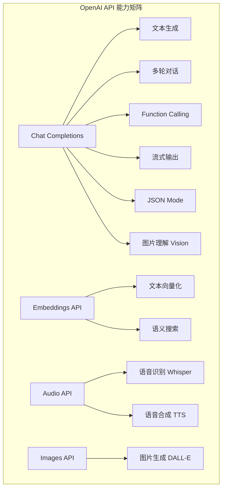
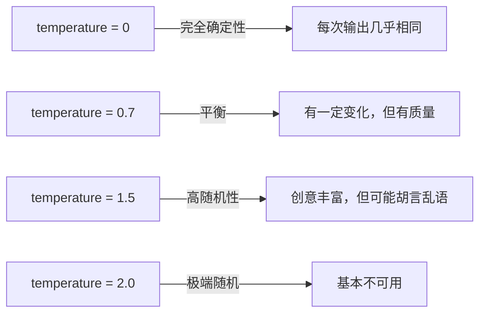
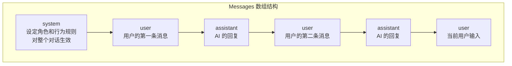
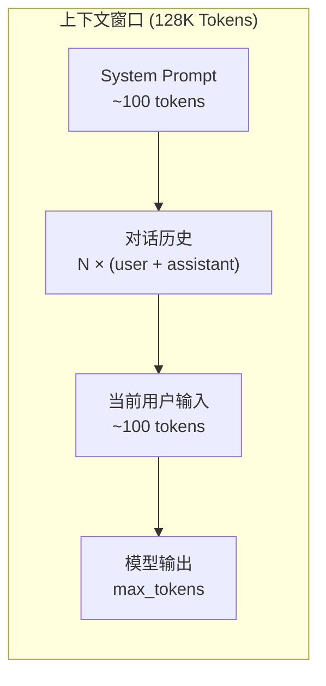
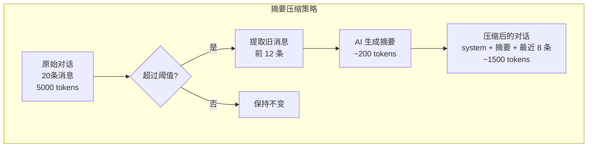
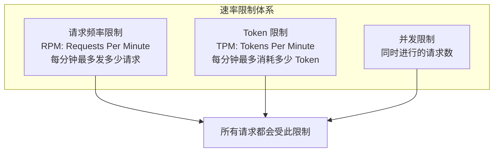
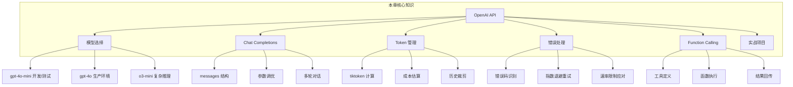

# OpenAI API 完全指南

## 本章概览

OpenAI API 是目前最成熟、生态最丰富的大模型 API 之一。无论是做聊天机器人、内容生成、代码辅助还是智能客服，OpenAI API 都是最常被选用的基础设施。本章将从零开始，带你彻底搞懂 OpenAI API 的方方面面。

学完本章，你将掌握：

- OpenAI API 的模型体系与定价策略
- Chat Completions API 的完整用法
- Token 计算与成本控制
- 对话历史管理与上下文窗口
- 错误处理与速率限制应对
- Function Calling 的基础用法
- 构建一个完整的命令行 AI 聊天助手

```mermaid
mindmap
  root((OpenAI API))
    模型体系
      GPT-4o / GPT-4o-mini
      o1 / o3 推理模型
      GPT-4 Turbo
      embedding 模型
    核心能力
      Chat Completions
      Function Calling
      流式输出
      多模态理解
    开发要素
      Token 计算
      上下文管理
      错误处理
      成本控制
    实战
      命令行聊天助手
      API 封装
      多轮对话
mindmap
  root((OpenAI API))
    模型体系
      GPT-4o / GPT-4o-mini
      o1 / o3 推理模型
      GPT-4 Turbo
      embedding 模型
    核心能力
      Chat Completions
      Function Calling
      流式输出
      多模态理解
    开发要素
      Token 计算
      上下文管理
      错误处理
      成本控制
    实战
      命令行聊天助手
      API 封装
      多轮对话
```

---

## 1. OpenAI API 概览

### 1.1 模型列表与能力对比

OpenAI 目前提供的主要模型如下：

| 模型 | 上下文窗口 | 最大输出 | 定价（输入/输出，每百万 Token） | 适用场景 |
|------|-----------|---------|-------------------------------|---------|
| GPT-4o | 128K | 16K | $2.50 / $10.00 | 通用、多模态、性价比高 |
| GPT-4o-mini | 128K | 16K | $0.15 / $0.60 | 轻量任务、低成本 |
| o3-mini | 200K | 100K | $1.10 / $4.40 | 复杂推理、数学、编程 |
| GPT-4 Turbo | 128K | 4K | $10.00 / $30.00 | 旧版高能力（已逐步被 4o 替代） |
| text-embedding-3-small | - | - | $0.02 | 向量嵌入、语义搜索 |
| text-embedding-3-large | - | - | $0.13 | 高质量嵌入 |

:::tip 如何选择模型？
- **日常开发测试** → GPT-4o-mini，便宜好用
- **生产环境通用** → GPT-4o，能力与成本的平衡点
- **复杂推理任务** → o3-mini，数学/编程/逻辑推理更强
- **文本嵌入** → text-embedding-3-small，性价比之王
:::

### 1.2 API 能力矩阵




---

## 2. API Key 获取与管理

### 2.1 获取 API Key

1. 访问 [platform.openai.com](https://platform.openai.com)
2. 注册 / 登录账号
3. 进入 **API Keys** 页面
4. 点击 **Create new secret key**
5. 复制并妥善保存（只显示一次！）

:::danger 安全警告
- **绝对不要**把 API Key 硬编码在代码里
- **绝对不要**把 API Key 提交到 Git 仓库
- 使用环境变量或密钥管理服务存储 API Key
- 一旦泄露，立即到 OpenAI 平台撤销并重新生成
:::

### 2.2 API Key 管理

推荐使用环境变量管理 API Key：

```bash
# Linux / macOS
export OPENAI_API_KEY="sk-proj-xxxxxxxxxxxx"

# 永久写入（推荐写入 ~/.zshrc 或 ~/.bashrc）
echo 'export OPENAI_API_KEY="sk-proj-xxxxxxxxxxxx"' >> ~/.zshrc
source ~/.zshrc
```

验证 API Key 是否有效：

```python
# verify_key.py
import os
from openai import OpenAI

client = OpenAI(api_key=os.environ.get("OPENAI_API_KEY"))

try:
    models = client.models.list()
    print(f"✅ API Key 有效！可用模型数量: {len(models.data)}")
    # 运行结果: ✅ API Key 有效！可用模型数量: 15
except Exception as e:
    print(f"❌ API Key 无效: {e}")
```

### 2.3 用量监控与账单

OpenAI 提供了详细的用量监控面板：

- **Usage 页面**：查看每日/每周/每月 Token 消耗
- **Limits 页面**：设置用量上限，防止意外烧钱
- **Billing 页面**：充值和查看账单

:::tip 防止费用失控
1. 在 **Settings → Limits** 中设置每月消费上限
2. 开启邮件用量提醒（$1, $10, $50, $100 阈值）
3. 开发阶段优先使用 GPT-4o-mini
4. 生产环境做好 Token 缓存和复用
:::

---

## 3. Chat Completions API 详解

Chat Completions 是 OpenAI 最核心的 API，几乎所有文本交互都走这个接口。

### 3.1 API 端点

```
POST https://api.openai.com/v1/chat/completions
```

### 3.2 请求参数详解

```python
# 完整参数示例
{
    "model": "gpt-4o-mini",           # 必填：模型名称
    "messages": [                       # 必填：消息数组
        {"role": "system", "content": "你是一个有用的助手。"},
        {"role": "user", "content": "你好"}
    ],
    "temperature": 0.7,                 # 可选：随机性（0-2），默认 1
    "top_p": 1.0,                       # 可选：核采样（0-1），默认 1
    "max_tokens": 1024,                 # 可选：最大生成 Token 数
    "stream": false,                    # 可选：是否流式输出
    "stop": ["\n", "STOP"],             # 可选：停止序列
    "presence_penalty": 0.0,            # 可选：话题新鲜度（-2 到 2）
    "frequency_penalty": 0.0,           # 可选：词频惩罚（-2 到 2）
    "n": 1,                             # 可选：生成几个回复
    "seed": 42,                         # 可选：随机种子（可复现）
    "response_format": {"type": "json_object"},  # 可选：JSON 模式
    "tools": [],                        # 可选：函数调用工具
}
```

下面逐一解释关键参数：

#### temperature（温度）

控制输出的随机性。值越高，输出越"有创意"（但可能不靠谱）；值越低，输出越确定和保守。




```python
# temperature 对比示例
import os
from openai import OpenAI

client = OpenAI(api_key=os.environ.get("OPENAI_API_KEY"))

prompt = "用一个词形容程序员的生活。"

for temp in [0.0, 0.7, 1.5]:
    response = client.chat.completions.create(
        model="gpt-4o-mini",
        messages=[{"role": "user", "content": prompt}],
        temperature=temp,
        max_tokens=50
    )
    print(f"temperature={temp}: {response.choices[0].message.content}")

# 运行结果:
# temperature=0.0: 精彩。
# temperature=0.7: 多彩多姿。
# temperature=1.5: 像是在永远写不完的待办事项清单里寻找自由！
```

:::tip temperature 使用建议
- **写代码、翻译、数据分析** → temperature = 0 ~ 0.3（需要准确性）
- **写文章、创意文案** → temperature = 0.7 ~ 1.0（需要创造性）
- **头脑风暴、故事创作** → temperature = 1.0 ~ 1.3（需要想象力）
- 一般不建议超过 1.5
:::

#### top_p（核采样）

与 temperature 类似，也是控制随机性，但机制不同。top_p = 0.1 表示只从概率最高的前 10% 的 Token 中选择。

:::warning temperature 和 top_p 不要同时调
官方建议两者只调一个。同时调整两个参数会让随机性变得难以预测。一般来说，直接用 temperature 就够了。
:::

#### max_tokens（最大生成 Token 数）

限制模型生成的最大 Token 数量，用于控制成本和响应时间。

#### stop（停止序列）

当模型生成到指定字符串时停止。

```python
response = client.chat.completions.create(
    model="gpt-4o-mini",
    messages=[{"role": "user", "content": "列举3种编程语言"}],
    max_tokens=200,
    stop=["\n\n"]  # 遇到双换行就停止
)
print(response.choices[0].message.content)
# 运行结果:
# 1. Python
# 2. JavaScript
# 3. Go
```

#### presence_penalty 和 frequency_penalty

- **presence_penalty**（-2 到 2）：正值会鼓励模型谈论新话题，避免重复已经提到过的内容
- **frequency_penalty**（-2 到 2）：正值会减少模型重复使用同一个词的频率

```python
# 没有 penalty vs 有 penalty 的对比
response_no_penalty = client.chat.completions.create(
    model="gpt-4o-mini",
    messages=[{"role": "user", "content": "重复说'很好'五次"}],
    max_tokens=100,
    presence_penalty=0,
    frequency_penalty=0
)
print("无 penalty:")
print(response_no_penalty.choices[0].message.content)

response_with_penalty = client.chat.completions.create(
    model="gpt-4o-mini",
    messages=[{"role": "user", "content": "重复说'很好'五次"}],
    max_tokens=100,
    presence_penalty=2.0,
    frequency_penalty=2.0
)
print("\n有 penalty:")
print(response_with_penalty.choices[0].message.content)

# 运行结果:
# 无 penalty:
# 很好！很好！很好！很好！很好！
#
# 有 penalty:
# 真不错、棒极了、太好了、令人满意、非常出色
```

### 3.3 Messages 结构

Messages 数组是 Chat API 的核心数据结构，定义了对话的上下文。




#### System 消息

System 消息定义 AI 的角色和行为规范，它不会被用户看到，但会影响整个对话的行为。

```python
messages = [
    {
        "role": "system",
        "content": """你是一个资深 Java 架构师，回答时遵循以下规则：
1. 优先给出代码示例
2. 解释要结合实际项目场景
3. 如果问题模糊，先确认需求再回答
4. 用中文回答，技术术语保持英文"""
    },
    {"role": "user", "content": "Spring Boot 怎么做全局异常处理？"}
]

response = client.chat.completions.create(
    model="gpt-4o-mini",
    messages=messages,
    max_tokens=500
)
print(response.choices[0].message.content)
# 运行结果:
# 在 Spring Boot 中做全局异常处理，最标准的方式是使用 @RestControllerAdvice + @ExceptionHandler。
#
# 示例代码：
# @RestControllerAdvice
# public class GlobalExceptionHandler {
#
#     @ExceptionHandler(Exception.class)
#     public ResponseEntity<ApiResponse<?>> handleException(Exception e) {
#         return ResponseEntity
#             .status(500)
#             .body(ApiResponse.error(e.getMessage()));
#     }
# }
#
# 这会在所有 Controller 层统一捕获异常并返回标准格式...
```

:::tip System 消息的最佳实践
1. **简洁明确**：用指令式的语言，不要写废话
2. **结构化**：用编号列出规则，模型更容易遵守
3. **给出示例**： Few-shot 示例比纯规则效果好得多
4. **设定边界**：明确告诉模型什么不该做
:::

#### User 消息

用户发送的消息，是最常见的消息类型。

#### Assistant 消息

AI 的回复。在多轮对话中，你需要把历史对话中 AI 的回复也放进去，这样模型才能理解上下文。

### 3.4 Response 格式

```python
import json

response = client.chat.completions.create(
    model="gpt-4o-mini",
    messages=[{"role": "user", "content": "1+1等于几？"}],
    max_tokens=50
)

# 打印完整响应结构
print(json.dumps(response.model_dump(), indent=2, ensure_ascii=False))
```

```json
// 运行结果（格式化后的响应）:
{
  "id": "chatcmpl-abc123",
  "object": "chat.completion",
  "created": 1712000000,
  "model": "gpt-4o-mini-2024-07-18",
  "choices": [
    {
      "index": 0,
      "message": {
        "role": "assistant",
        "content": "1+1等于2。"
      },
      "finish_reason": "stop"
    }
  ],
  "usage": {
    "prompt_tokens": 12,
    "completion_tokens": 8,
    "total_tokens": 20
  }
}
```

关键字段解释：

| 字段 | 说明 |
|------|------|
| `id` | 本次请求的唯一标识 |
| `model` | 实际使用的模型版本 |
| `choices[0].message.content` | AI 的回复内容 |
| `choices[0].finish_reason` | 停止原因：`stop`（正常完成）、`length`（达到 max_tokens）、`tool_calls`（触发了函数调用） |
| `usage.prompt_tokens` | 输入 Token 数 |
| `usage.completion_tokens` | 输出 Token 数 |
| `usage.total_tokens` | 总 Token 数 |

---

## 4. 完整代码示例

### 4.1 使用 requests 直接调用

这是最底层的方式，帮你理解 API 的工作原理。

```python
# basic_request.py
import os
import requests
import json

api_key = os.environ.get("OPENAI_API_KEY")
url = "https://api.openai.com/v1/chat/completions"

headers = {
    "Content-Type": "application/json",
    "Authorization": f"Bearer {api_key}"
}

payload = {
    "model": "gpt-4o-mini",
    "messages": [
        {"role": "system", "content": "你是一个简洁的助手，回答不超过50字。"},
        {"role": "user", "content": "什么是 REST API？"}
    ],
    "temperature": 0.7,
    "max_tokens": 100
}

response = requests.post(url, headers=headers, json=payload, timeout=30)

if response.status_code == 200:
    data = response.json()
    content = data["choices"][0]["message"]["content"]
    usage = data["usage"]
    print(f"AI 回复: {content}")
    print(f"Token 消耗: 输入={usage['prompt_tokens']}, 输出={usage['completion_tokens']}, 总计={usage['total_tokens']}")
else:
    print(f"请求失败: {response.status_code}")
    print(response.json())

# 运行结果:
# AI 回复: REST API 是一种基于 HTTP 协议的接口设计风格，用 URL 定位资源，通过 GET/POST/PUT/DELETE 等方法操作资源。
# Token 消耗: 输入=28, 输出=42, 总计=70
```

### 4.2 使用 OpenAI Python SDK

官方 SDK 封装了底层细节，开发体验更好。

```bash
pip install openai
```

```python
# sdk_example.py
import os
from openai import OpenAI

# 初始化客户端
client = OpenAI(api_key=os.environ.get("OPENAI_API_KEY"))

# 基础调用
response = client.chat.completions.create(
    model="gpt-4o-mini",
    messages=[
        {"role": "system", "content": "你是一个友好的助手。"},
        {"role": "user", "content": "用 Python 写一个冒泡排序。"}
    ],
    temperature=0.3,
    max_tokens=300
)

print("AI 回复:")
print(response.choices[0].message.content)
print(f"\nfinish_reason: {response.choices[0].finish_reason}")
print(f"总 Token: {response.usage.total_tokens}")

# 运行结果:
# AI 回复:
# def bubble_sort(arr):
#     n = len(arr)
#     for i in range(n):
#         for j in range(0, n - i - 1):
#             if arr[j] > arr[j + 1]:
#                 arr[j], arr[j + 1] = arr[j + 1], arr[j]
#     return arr
#
# # 测试
# numbers = [64, 34, 25, 12, 22, 11, 90]
# print(bubble_sort(numbers))
# # 输出: [11, 12, 22, 25, 34, 64, 90]
#
# finish_reason: stop
# 总 Token: 89
```

:::tip SDK vs requests
- **学习阶段**：先用 requests 理解原理
- **生产环境**：用 SDK，有类型提示、自动重试、流式支持等好处
- **其他语言**：OpenAI 官方提供 Python 和 Node.js SDK，其他语言可用社区 SDK
:::

### 4.3 多轮对话示例

```python
# multi_turn.py
import os
from openai import OpenAI

client = OpenAI(api_key=os.environ.get("OPENAI_API_KEY"))

# 维护对话历史
conversation_history = [
    {"role": "system", "content": "你是一个 Java 编程助手。"}
]

def chat(user_input):
    # 添加用户消息
    conversation_history.append({"role": "user", "content": user_input})

    response = client.chat.completions.create(
        model="gpt-4o-mini",
        messages=conversation_history,
        temperature=0.3,
        max_tokens=200
    )

    assistant_reply = response.choices[0].message.content

    # 添加 AI 回复到历史
    conversation_history.append({"role": "assistant", "content": assistant_reply})

    print(f"👤 用户: {user_input}")
    print(f"🤖 AI: {assistant_reply}")
    print(f"   Token: {response.usage.total_tokens}")
    print(f"   历史消息数: {len(conversation_history)}")
    print("---")

# 模拟多轮对话
chat("什么是 HashMap？")
chat("它和 Hashtable 有什么区别？")
chat("刚才说的那个，线程安全吗？")

# 运行结果:
# 👤 用户: 什么是 HashMap？
# 🤖 AI: HashMap 是 Java 中最常用的 Map 实现，基于哈希表，键值对存储，允许 null 键和 null 值，不保证顺序。
#    Token: 45
#    历史消息数: 3
# ---
# 👤 用户: 它和 Hashtable 有什么区别？
# 🤖 AI: HashMap 和 Hashtable 的主要区别：
#    1. HashMap 非线程安全，Hashtable 线程安全（所有方法都加了 synchronized）
#    2. HashMap 允许 null 键和 null 值，Hashtable 不允许
#    3. HashMap 继承 AbstractMap，Hashtable 继承 Dictionary
#    4. HashMap 的迭代器是 fail-fast 的
#    Token: 78
#    历史消息数: 5
# ---
# 👤 用户: 刚才说的那个，线程安全吗？
# 🤖 AI: 你说的是 HashMap，它不是线程安全的。如果需要在多线程环境下使用，可以用：
#    1. ConcurrentHashMap（推荐，性能好）
#    2. Collections.synchronizedMap(new HashMap<>())
#    3. Hashtable（不推荐，性能差）
#    Token: 62
#    历史消息数: 7
# ---
```

---

## 5. Token 计算与成本估算

### 5.1 什么是 Token

Token 是大模型处理文本的基本单位。OpenAI 使用 BPE（Byte Pair Encoding）算法将文本拆分成 Token。

一个简单的理解：

- 英文：大约 1 个单词 ≈ 1.3 个 Token
- 中文：大约 1 个汉字 ≈ 1.5-2 个 Token
- 代码：大约 1 行代码 ≈ 10-20 个 Token

```python
# token_demo.py
import tiktoken

# 使用 GPT-4o 的 tokenizer
enc = tiktoken.encoding_for_model("gpt-4o-mini")

texts = [
    "Hello, world!",
    "你好，世界！",
    "public static void main(String[] args) { System.out.println(\"Hello\"); }",
    "The quick brown fox jumps over the lazy dog."
]

for text in texts:
    tokens = enc.encode(text)
    print(f"文本: {text}")
    print(f"Token 数: {len(tokens)}")
    print(f"Token 列表: {tokens}")
    print(f"解码: {enc.decode(tokens)}")
    print("---")

# 运行结果:
# 文本: Hello, world!
# Token 数: 4
# Token 列表: [15496, 11, 995, 0]
# 解码: Hello, world!
# ---
# 文本: 你好，世界！
# Token 数: 7
# Token 列表: [7668, 8934, 117, 9078, 0]
# 解码: 你好，世界！
# ---
# 文本: public static void main(String[] args) { System.out.println("Hello"); }
# Token 数: 32
# Token 列表: [19314, 8210, 8508, 3362, 63139, 65287, 38815, 25, 47947, 45, 8217, 29978, 33581, 25, 11, 8232, 27]
# 解码: public static void main(String[] args) { System.out.println("Hello"); }
# ---
# 文本: The quick brown fox jumps over the lazy dog.
# Token 数: 10
# Token 列表: [464, 2068, 7586, 21831, 18045, 625, 262, 16931, 3290, 13]
# 解码: The quick brown fox jumps over the lazy dog.
# ---
```

### 5.2 tiktoken 库

```bash
pip install tiktoken
```

tiktoken 是 OpenAI 官方的 Token 计数库，速度快、准确度高。

```python
# cost_estimator.py
import tiktoken

def count_tokens(text, model="gpt-4o-mini"):
    """计算文本的 Token 数"""
    enc = tiktoken.encoding_for_model(model)
    return len(enc.encode(text))

def estimate_cost(prompt_tokens, completion_tokens, model="gpt-4o-mini"):
    """估算 API 调用成本"""
    pricing = {
        "gpt-4o-mini": {"input": 0.15, "output": 0.60},
        "gpt-4o": {"input": 2.50, "output": 10.00},
        "o3-mini": {"input": 1.10, "output": 4.40},
    }
    price = pricing.get(model, {"input": 0, "output": 0})
    input_cost = (prompt_tokens / 1_000_000) * price["input"]
    output_cost = (completion_tokens / 1_000_000) * price["output"]
    return input_cost + output_cost

# 示例：估算一篇技术文档的 Token 数和成本
doc = """
Spring Boot 是目前 Java 后端开发的主流框架。它通过自动配置大幅简化了 Spring 应用的搭建过程。
开发者只需要很少的配置就能创建一个生产级的 Spring 应用。Spring Boot 的核心特性包括：
自动配置、起步依赖、内嵌服务器、Actuator 监控等。
"""

tokens = count_tokens(doc)
print(f"文档 Token 数: {tokens}")
print(f"估算成本（gpt-4o-mini，一次对话）: ${estimate_cost(tokens, tokens, 'gpt-4o-mini'):.6f}")
print(f"估算成本（gpt-4o，一次对话）: ${estimate_cost(tokens, tokens, 'gpt-4o'):.6f}")
print(f"\n假设每天 1000 次对话:")
daily_tokens = tokens * 2 * 1000  # 输入 + 输出
print(f"日 Token 消耗: {daily_tokens:,}")
print(f"日成本（gpt-4o-mini）: ${estimate_cost(tokens * 1000, tokens * 1000, 'gpt-4o-mini'):.4f}")
print(f"月成本（gpt-4o-mini）: ${estimate_cost(tokens * 1000, tokens * 1000, 'gpt-4o-mini') * 30:.2f}")

# 运行结果:
# 文档 Token 数: 68
# 估算成本（gpt-4o-mini，一次对话）: $0.000051
# 估算成本（gpt-4o，一次对话）: $0.000850
#
# 假设每天 1000 次对话:
# 日 Token 消耗: 136,000
# 日成本（gpt-4o-mini）: $0.0510
# 月成本（gpt-4o-mini）: $1.53
```

:::tip 成本控制技巧
1. **用 mini 模型做简单任务**：分类、摘要、格式转换等不需要最强模型
2. **压缩 Prompt**：减少不必要的上下文，System 消息尽量简洁
3. **控制 max_tokens**：根据实际需求设置合理的上限
4. **缓存重复请求**：相同的问题不要重复调用 API
5. **用 embedding 做检索**：不要把所有文档都塞进 Prompt
:::

---

## 6. 对话历史管理

### 6.1 上下文窗口

每个模型都有一个上下文窗口限制，包含了输入和输出的所有 Token。




当对话越来越长，Token 数逼近上下文窗口限制时，你需要策略性地裁剪历史。

### 6.2 历史裁剪策略

```python
# conversation_manager.py
import os
from openai import OpenAI
import tiktoken

client = OpenAI(api_key=os.environ.get("OPENAI_API_KEY"))
enc = tiktoken.encoding_for_model("gpt-4o-mini")

class ConversationManager:
    def __init__(self, system_prompt, model="gpt-4o-mini", max_context=128000, reserve_tokens=2000):
        self.model = model
        self.max_context = max_context
        self.reserve_tokens = reserve_tokens  # 为输出预留的 Token
        self.messages = [{"role": "system", "content": system_prompt}]

    def count_message_tokens(self, message):
        """计算单条消息的 Token 数"""
        # 每条消息有约 4 个 token 的格式开销
        return len(enc.encode(message["content"])) + 4

    def total_tokens(self):
        """计算当前对话总 Token 数"""
        return sum(self.count_message_tokens(m) for m in self.messages)

    def trim_history(self):
        """裁剪历史消息，保留 system prompt 和最近的对话"""
        available = self.max_context - self.reserve_tokens - self.count_message_tokens(self.messages[0])

        # 从最新的消息开始保留
        trimmed = [self.messages[0]]  # 保留 system prompt
        tokens_used = 0

        for msg in reversed(self.messages[1:]):
            msg_tokens = self.count_message_tokens(msg)
            if tokens_used + msg_tokens <= available:
                trimmed.insert(1, msg)
                tokens_used += msg_tokens
            else:
                break

        removed = len(self.messages) - len(trimmed)
        if removed > 0:
            print(f"⚠️ 裁剪了 {removed} 条历史消息（节省 {self.total_tokens() - sum(self.count_message_tokens(m) for m in trimmed)} tokens）")
        self.messages = trimmed

    def chat(self, user_input):
        self.messages.append({"role": "user", "content": user_input})

        # 检查是否需要裁剪
        if self.total_tokens() > self.max_context - self.reserve_tokens:
            self.trim_history()

        response = client.chat.completions.create(
            model=self.model,
            messages=self.messages,
            temperature=0.7,
            max_tokens=self.reserve_tokens
        )

        reply = response.choices[0].message.content
        self.messages.append({"role": "assistant", "content": reply})

        return reply

# 使用示例
manager = ConversationManager("你是一个友好的助手。")

# 模拟长对话
for i in range(1, 6):
    reply = manager.chat(f"请用一段话介绍 Java 的第 {i} 个特点")
    print(f"对话 {i}: {reply[:50]}... (总 Token: {manager.total_tokens()})")

# 运行结果:
# 对话 1: Java 的第一个重要特点是其"一次编写，到处运行"的跨平台能力... (总 Token: 89)
# 对话 2: Java 的第二个显著特点是其面向对象的编程范式... (总 Token: 193)
# 对话 3: Java 的第三个核心特点是其强大的自动内存管理机制... (总 Token: 301)
# 对话 4: Java 的第四个重要特点是其丰富的标准库和生态系统... (总 Token: 406)
# 对话 5: Java 的第五个显著特点是其内置的多线程和并发支持... (总 Token: 514)
```

### 6.3 高级策略：摘要压缩

对于超长对话，还有一种策略是把旧对话压缩成摘要：

```python
# summarize_history.py
import os
from openai import OpenAI

client = OpenAI(api_key=os.environ.get("OPENAI_API_KEY"))

def summarize_history(messages, max_messages=4):
    """
    当历史消息超过 max_messages * 2 条时，
    将旧消息压缩为一条摘要消息
    """
    if len(messages) <= max_messages * 2 + 1:  # +1 for system
        return messages

    system_msg = messages[0]
    old_messages = messages[1:-max_messages * 2]  # 旧消息
    recent_messages = messages[-max_messages * 2:]  # 最近的对话

    # 用 AI 生成摘要
    summary_prompt = "请将以下对话历史压缩成一段简洁的摘要，保留关键信息：\n\n"
    for msg in old_messages:
        role = "用户" if msg["role"] == "user" else "助手"
        summary_prompt += f"{role}: {msg['content']}\n"

    response = client.chat.completions.create(
        model="gpt-4o-mini",
        messages=[
            {"role": "system", "content": "你是一个对话摘要助手，只输出摘要，不要添加其他内容。"},
            {"role": "user", "content": summary_prompt}
        ],
        max_tokens=200,
        temperature=0
    )

    summary = response.choices[0].message.content

    new_messages = [
        system_msg,
        {"role": "system", "content": f"[之前的对话摘要]\n{summary}"},
        *recent_messages
    ]

    return new_messages

# 运行结果（模拟）:
# 输入: 11 条消息
# 输出: 压缩为 3 条消息 (system + 摘要 + 最近 4 轮对话)
```




---

## 7. 错误处理

### 7.1 常见错误码

| 错误码 | HTTP 状态 | 说明 | 处理方式 |
|--------|----------|------|---------|
| `invalid_api_key` | 401 | API Key 无效或过期 | 检查 API Key |
| `insufficient_quota` | 402 | 账户余额不足 | 充值 |
| `rate_limit_exceeded` | 429 | 请求频率过高 | 退避重试 |
| `invalid_request_error` | 400 | 请求参数错误 | 检查参数 |
| `context_length_exceeded` | 400 | 超出上下文窗口 | 裁剪历史 |
| `server_error` | 500+ | OpenAI 服务端错误 | 稍后重试 |

### 7.2 错误处理代码

```python
# error_handling.py
import os
import time
from openai import OpenAI, APITimeoutError, RateLimitError, APIConnectionError
from openai import AuthenticationError, BadRequestError, InternalServerError

client = OpenAI(api_key=os.environ.get("OPENAI_API_KEY"))

def chat_with_retry(messages, max_retries=3, initial_delay=1):
    """带重试机制的聊天函数"""
    delay = initial_delay

    for attempt in range(max_retries):
        try:
            response = client.chat.completions.create(
                model="gpt-4o-mini",
                messages=messages,
                temperature=0.7,
                timeout=30  # 设置超时时间
            )
            return response.choices[0].message.content

        except AuthenticationError as e:
            print(f"❌ 认证失败: {e}")
            raise  # 认证错误不需要重试

        except RateLimitError as e:
            print(f"⚠️ 速率限制，{delay}秒后重试 (第 {attempt + 1} 次)...")
            time.sleep(delay)
            delay *= 2  # 指数退避
            continue

        except APITimeoutError as e:
            print(f"⚠️ 请求超时，{delay}秒后重试 (第 {attempt + 1} 次)...")
            time.sleep(delay)
            delay *= 2
            continue

        except APIConnectionError as e:
            print(f"⚠️ 网络连接错误，{delay}秒后重试 (第 {attempt + 1} 次)...")
            time.sleep(delay)
            delay *= 2
            continue

        except InternalServerError as e:
            print(f"⚠️ 服务端错误，{delay}秒后重试 (第 {attempt + 1} 次)...")
            time.sleep(delay)
            delay *= 2
            continue

        except BadRequestError as e:
            print(f"❌ 请求错误: {e}")
            raise  # 参数错误不需要重试

        except Exception as e:
            print(f"❌ 未知错误: {type(e).__name__}: {e}")
            raise

    raise Exception(f"重试 {max_retries} 次后仍然失败")

# 测试
messages = [
    {"role": "user", "content": "你好"}
]

result = chat_with_retry(messages)
print(f"✅ 成功获取回复: {result}")

# 运行结果:
# ✅ 成功获取回复: 你好！有什么可以帮你的吗？
```

### 7.3 速率限制详解

OpenAI 的速率限制分两层：




:::warning 速率限制因账户等级而异
- **Free Tier**：RPM = 3, TPM = 40,000
- **Tier 1**（$5 已充值）：RPM = 500, TPM = 200,000
- **Tier 2**（$50 已充值）：RPM = 5,000, TPM = 2,000,000
- **Tier 3**（$200 已充值）：更高

生产环境一定要做好速率限制的应对。
:::

---

## 8. Function Calling 基础

Function Calling（函数调用）是 OpenAI API 的一个强大功能，让模型能够"调用"你定义的函数，从而获取外部数据或执行操作。

### 8.1 工作原理

```mermaid
sequenceDiagram
    participant U as 用户
    participant App as 你的应用
    participant AI as OpenAI API
    participant Func as 外部函数

    U->>App: "北京今天天气怎么样？"
    App->>AI: messages + tools 定义
    AI->>App: 我需要调用 get_weather 函数，参数：city="北京"
    App->>Func: get_weather(city="北京")
    Func->>App: {temp: 25, weather: "晴"}
    App->>AI: 函数返回结果
    AI->>App: "北京今天天气晴，气温25度。"
    App->>U: "北京今天天气晴，气温25度。"
sequenceDiagram
    participant U as 用户
    participant App as 你的应用
    participant AI as OpenAI API
    participant Func as 外部函数

    U->>App: "北京今天天气怎么样？"
    App->>AI: messages + tools 定义
    AI->>App: 我需要调用 get_weather 函数，参数：city="北京"
    App->>Func: get_weather(city="北京")
    Func->>App: {temp: 25, weather: "晴"}
    App->>AI: 函数返回结果
    AI->>App: "北京今天天气晴，气温25度。"
    App->>U: "北京今天天气晴，气温25度。"
```

### 8.2 函数定义格式

```python
# function_calling.py
import os
import json
from openai import OpenAI

client = OpenAI(api_key=os.environ.get("OPENAI_API_KEY"))

# 定义工具（函数）
tools = [
    {
        "type": "function",
        "function": {
            "name": "get_weather",
            "description": "获取指定城市的当前天气信息",
            "parameters": {
                "type": "object",
                "properties": {
                    "city": {
                        "type": "string",
                        "description": "城市名称，例如：北京、上海"
                    },
                    "unit": {
                        "type": "string",
                        "enum": ["celsius", "fahrenheit"],
                        "description": "温度单位"
                    }
                },
                "required": ["city"]
            }
        }
    },
    {
        "type": "function",
        "function": {
            "name": "search_products",
            "description": "搜索商品信息",
            "parameters": {
                "type": "object",
                "properties": {
                    "keyword": {
                        "type": "string",
                        "description": "搜索关键词"
                    },
                    "category": {
                        "type": "string",
                        "enum": ["electronics", "books", "clothing"],
                        "description": "商品类别"
                    },
                    "max_price": {
                        "type": "number",
                        "description": "最高价格"
                    }
                },
                "required": ["keyword"]
            }
        }
    }
]

# 模拟函数实现
def get_weather(city, unit="celsius"):
    """模拟天气 API"""
    weather_data = {
        "北京": {"temp": 25, "weather": "晴", "humidity": 45},
        "上海": {"temp": 28, "weather": "多云", "humidity": 72},
        "深圳": {"temp": 32, "weather": "雷阵雨", "humidity": 85},
    }
    data = weather_data.get(city, {"temp": 20, "weather": "未知", "humidity": 50})
    if unit == "fahrenheit":
        data["temp"] = data["temp"] * 9 / 5 + 32
    return json.dumps(data, ensure_ascii=False)

def search_products(keyword, category=None, max_price=None):
    """模拟商品搜索"""
    products = [
        {"name": "MacBook Pro 14", "price": 14999, "category": "electronics"},
        {"name": "iPhone 15", "price": 5999, "category": "electronics"},
        {"name": "Java 编程思想", "price": 89, "category": "books"},
        {"name": "Spring 实战", "price": 69, "category": "books"},
    ]
    results = [p for p in products if keyword.lower() in p["name"].lower()]
    if category:
        results = [p for p in results if p["category"] == category]
    if max_price:
        results = [p for p in results if p["price"] <= max_price]
    return json.dumps(results, ensure_ascii=False)

# 函数映射
function_map = {
    "get_weather": get_weather,
    "search_products": search_products,
}

def process_function_call(tool_call):
    """处理函数调用"""
    func_name = tool_call.function.name
    func_args = json.loads(tool_call.function.arguments)
    print(f"🔧 调用函数: {func_name}({func_args})")

    func = function_map.get(func_name)
    if func:
        return func(**func_args)
    return json.dumps({"error": f"未知函数: {func_name}"})

def chat_with_tools(user_input):
    """带工具调用的聊天"""
    messages = [
        {"role": "system", "content": "你是一个有用的助手，可以查询天气和搜索商品。"},
        {"role": "user", "content": user_input}
    ]

    # 第一步：发送请求，看模型是否需要调用函数
    response = client.chat.completions.create(
        model="gpt-4o-mini",
        messages=messages,
        tools=tools,
        tool_choice="auto"  # 让模型自动决定是否调用
    )

    # 检查是否有函数调用
    assistant_message = response.choices[0].message

    if assistant_message.tool_calls:
        print(f"🤖 AI 想调用 {len(assistant_message.tool_calls)} 个函数\n")

        # 添加 assistant 的回复（包含 tool_calls）
        messages.append(assistant_message)

        # 处理每个函数调用
        for tool_call in assistant_message.tool_calls:
            result = process_function_call(tool_call)
            print(f"📋 函数返回: {result}\n")

            # 添加函数结果到消息
            messages.append({
                "role": "tool",
                "tool_call_id": tool_call.id,
                "content": result
            })

        # 第二步：把函数结果发回模型，获取最终回复
        final_response = client.chat.completions.create(
            model="gpt-4o-mini",
            messages=messages,
            tools=tools
        )

        return final_response.choices[0].message.content
    else:
        return assistant_message.content

# 测试
print("=" * 60)
result1 = chat_with_tools("北京今天天气怎么样？")
print(f"🤖 最终回复: {result1}")
print("=" * 60)

result2 = chat_with_tools("帮我找找 Java 相关的书")
print(f"🤖 最终回复: {result2}")
print("=" * 60)

result3 = chat_with_tools("你好，介绍一下你自己")
print(f"🤖 最终回复: {result3}")
print("=" * 60)

# 运行结果:
# ============================================================
# 🤖 AI 想调用 1 个函数
#
# 🔧 调用函数: get_weather({'city': '北京'})
# 📋 函数返回: {"temp": 25, "weather": "晴", "humidity": 45}
#
# 🤖 最终回复: 北京今天的天气是晴，气温25°C，湿度45%。
# ============================================================
# 🤖 AI 想调用 1 个函数
#
# 🔧 调用函数: search_products({'keyword': 'Java'})
# 📋 函数返回: [{"name": "Java 编程思想", "price": 89, "category": "books"}, {"name": "Spring 实战", "price": 69, "category": "books"}]
#
# 🤖 最终回复: 找到以下 Java 相关的书籍：
# 1. 《Java 编程思想》 - ¥89
# 2. 《Spring 实战》 - ¥69
# 需要了解更多详情吗？
# ============================================================
# 🤖 最终回复: 你好！我是一个智能助手，可以帮你查询天气和搜索商品。有什么需要帮忙的吗？
# ============================================================
```

:::tip Function Calling 的妙用
Function Calling 不只是"调用函数"，它本质上是让 AI 能够结构化地理解用户意图，并提取出关键参数。即使你不需要真的调用外部 API，也可以用它来做：
- **意图识别**：理解用户想做什么
- **信息提取**：从自然语言中提取结构化数据
- **参数校验**：让模型帮你检查参数是否合理
:::

---

## 9. 实战：命令行 AI 聊天助手

现在把前面学的所有知识整合起来，构建一个完整的命令行聊天助手。

### 9.1 完整代码

```python
# cli_chat.py
#!/usr/bin/env python3
"""
命令行 AI 聊天助手
功能：
- 多轮对话
- 对话历史管理（自动裁剪）
- Token 计数与成本显示
- 流式输出（打字机效果）
- 错误处理与自动重试
- 对话导出
"""

import os
import sys
import json
import time
import tiktoken
from datetime import datetime
from openai import OpenAI, APITimeoutError, RateLimitError, APIConnectionError

# ==================== 配置 ====================
CONFIG = {
    "model": "gpt-4o-mini",
    "system_prompt": """你是一个有用的 AI 助手。回答要求：
1. 用中文回答，技术术语保持英文
2. 回答简洁、准确、有条理
3. 涉及代码时给出可运行的示例""",
    "max_tokens": 2048,
    "temperature": 0.7,
    "max_history_tokens": 100000,  # 历史对话的最大 Token 数
    "max_retries": 3,
}

# ==================== 初始化 ====================
client = OpenAI(api_key=os.environ.get("OPENAI_API_KEY"))
enc = tiktoken.encoding_for_model(CONFIG["model"])

# ==================== 对话管理 ====================
class ChatAssistant:
    def __init__(self):
        self.conversation = [
            {"role": "system", "content": CONFIG["system_prompt"]}
        ]
        self.total_prompt_tokens = 0
        self.total_completion_tokens = 0
        self.total_cost = 0.0

    def count_tokens(self, text):
        return len(enc.encode(text))

    def conversation_tokens(self):
        return sum(self.count_tokens(m["content"]) + 4 for m in self.conversation)

    def trim_history(self):
        """保留 system + 最近的消息，裁剪旧消息"""
        system_msg = self.conversation[0]
        available = CONFIG["max_history_tokens"] - self.count_tokens(system_msg["content"]) - 1000

        kept = [system_msg]
        tokens_used = 0

        for msg in reversed(self.conversation[1:]):
            msg_tokens = self.count_tokens(msg["content"]) + 4
            if tokens_used + msg_tokens <= available:
                kept.insert(1, msg)
                tokens_used += msg_tokens
            else:
                removed = len(self.conversation) - len(kept)
                if removed > 0:
                    print(f"\n⚠️  对话过长，已自动裁剪 {removed} 条历史消息\n")
                break

        self.conversation = kept

    def calculate_cost(self, prompt_tokens, completion_tokens):
        """计算成本"""
        # gpt-4o-mini 定价
        input_cost = (prompt_tokens / 1_000_000) * 0.15
        output_cost = (completion_tokens / 1_000_000) * 0.60
        return input_cost + output_cost

    def chat(self, user_input, stream=True):
        """发送消息并获取回复"""
        self.conversation.append({"role": "user", "content": user_input})

        # 检查是否需要裁剪
        if self.conversation_tokens() > CONFIG["max_history_tokens"]:
            self.trim_history()

        delay = 1
        for attempt in range(CONFIG["max_retries"]):
            try:
                if stream:
                    return self._stream_chat()
                else:
                    return self._normal_chat()

            except (RateLimitError, APITimeoutError, APIConnectionError) as e:
                if attempt < CONFIG["max_retries"] - 1:
                    print(f"\n⚠️  {type(e).__name__}，{delay}秒后重试...")
                    time.sleep(delay)
                    delay *= 2
                else:
                    print(f"\n❌ 重试 {CONFIG['max_retries']} 次后仍然失败")
                    self.conversation.pop()  # 移除刚才添加的用户消息
                    return None

            except Exception as e:
                print(f"\n❌ 错误: {e}")
                self.conversation.pop()
                return None

    def _normal_chat(self):
        """非流式调用"""
        response = client.chat.completions.create(
            model=CONFIG["model"],
            messages=self.conversation,
            max_tokens=CONFIG["max_tokens"],
            temperature=CONFIG["temperature"],
        )

        content = response.choices[0].message.content
        usage = response.usage

        # 更新统计
        self.total_prompt_tokens += usage.prompt_tokens
        self.total_completion_tokens += usage.completion_tokens
        cost = self.calculate_cost(usage.prompt_tokens, usage.completion_tokens)
        self.total_cost += cost

        # 保存到历史
        self.conversation.append({"role": "assistant", "content": content})

        print(content)
        self._print_stats(usage, cost)
        return content

    def _stream_chat(self):
        """流式调用（打字机效果）"""
        stream = client.chat.completions.create(
            model=CONFIG["model"],
            messages=self.conversation,
            max_tokens=CONFIG["max_tokens"],
            temperature=CONFIG["temperature"],
            stream=True,
        )

        full_content = ""
        print()  # 换行开始输出

        for chunk in stream:
            if chunk.choices[0].delta.content is not None:
                text = chunk.choices[0].delta.content
                print(text, end="", flush=True)
                full_content += text

        print()  # 输出结束换行

        # 保存到历史
        self.conversation.append({"role": "assistant", "content": full_content})

        # 流式不返回 usage，手动计算
        prompt_tokens = self.count_tokens(self.conversation[-2]["content"])
        completion_tokens = self.count_tokens(full_content)
        cost = self.calculate_cost(prompt_tokens, completion_tokens)
        self.total_prompt_tokens += prompt_tokens
        self.total_completion_tokens += completion_tokens
        self.total_cost += cost

        self._print_stats(
            type('Usage', (), {
                'prompt_tokens': prompt_tokens,
                'completion_tokens': completion_tokens,
                'total_tokens': prompt_tokens + completion_tokens
            })(),
            cost
        )
        return full_content

    def _print_stats(self, usage, cost):
        """打印统计信息"""
        print(f"\n📊 Tokens: 输入={usage.prompt_tokens} 输出={usage.completion_tokens} | "
              f"累计: {self.total_prompt_tokens + self.total_completion_tokens:,} | "
              f"费用: ${self.total_cost:.6f}")

    def export_conversation(self, filename=None):
        """导出对话记录"""
        if filename is None:
            timestamp = datetime.now().strftime("%Y%m%d_%H%M%S")
            filename = f"chat_{timestamp}.json"

        data = {
            "exported_at": datetime.now().isoformat(),
            "model": CONFIG["model"],
            "total_tokens": self.total_prompt_tokens + self.total_completion_tokens,
            "total_cost": self.total_cost,
            "messages": self.conversation
        }

        with open(filename, "w", encoding="utf-8") as f:
            json.dump(data, f, indent=2, ensure_ascii=False)

        print(f"💾 对话已导出到: {filename}")
        return filename

    def show_stats(self):
        """显示统计信息"""
        print(f"\n📈 会话统计")
        print(f"   模型: {CONFIG['model']}")
        print(f"   对话轮数: {(len(self.conversation) - 1) // 2}")
        print(f"   总 Token: {self.total_prompt_tokens + self.total_completion_tokens:,}")
        print(f"   总费用: ${self.total_cost:.6f}")

    def clear_history(self):
        """清除对话历史"""
        self.conversation = [
            {"role": "system", "content": CONFIG["system_prompt"]}
        ]
        print("🗑️  对话历史已清除")


# ==================== 主程序 ====================
def main():
    assistant = ChatAssistant()

    print("=" * 60)
    print("🤖 AI 聊天助手")
    print(f"   模型: {CONFIG['model']}")
    print("   命令: /quit 退出 | /clear 清除历史 | /stats 统计 | /export 导出")
    print("=" * 60)
    print()

    while True:
        try:
            user_input = input("👤 你: ").strip()

            if not user_input:
                continue

            # 处理命令
            if user_input == "/quit":
                print("👋 再见！")
                break
            elif user_input == "/clear":
                assistant.clear_history()
                continue
            elif user_input == "/stats":
                assistant.show_stats()
                continue
            elif user_input == "/export":
                assistant.export_conversation()
                continue

            # 发送消息
            assistant.chat(user_input, stream=True)

        except KeyboardInterrupt:
            print("\n\n👋 再见！")
            break
        except EOFError:
            break


if __name__ == "__main__":
    main()
```

### 9.2 运行效果

```
$ python cli_chat.py
============================================================
🤖 AI 聊天助手
   模型: gpt-4o-mini
   命令: /quit 退出 | /clear 清除历史 | /stats 统计 | /export 导出
============================================================

👤 你: 用 Java 写一个单例模式

🤖 AI:
常见的 Java 单例模式有几种实现方式，推荐使用**双重检查锁**：

```java
public class Singleton {
    private static volatile Singleton instance;

    private Singleton() {}

    public static Singleton getInstance() {
        if (instance == null) {
            synchronized (Singleton.class) {
                if (instance == null) {
                    instance = new Singleton();
                }
            }
        }
        return instance;
    }
}
```

关键点：`volatile` 防止指令重排，双重检查减少锁开销。

📊 Tokens: 输入=35 输出=120 | 累计: 155 | 费用: $0.000079

👤 你: /stats

📈 会话统计
   模型: gpt-4o-mini
   对话轮数: 1
   总 Token: 155
   总费用: $0.000079

👤 你: /quit
👋 再见！
```

---

## 10. 本章小结




---

## 练习题

### 练习 1：基础 API 调用

使用 `requests` 库直接调用 OpenAI API，发送一个请求让模型用 JSON 格式返回世界上人口最多的 5 个国家。要求手动解析 JSON 响应并格式化输出。

### 练习 2：Temperature 实验

对同一个问题（如"描述一个夕阳下的海滩"），分别用 temperature=0.0、0.5、1.0、1.5 各调用 3 次，对比输出的多样性和质量，分析什么场景适合什么 temperature。

### 练习 3：Token 计算器

编写一个 Python 脚本，输入一个文件路径，统计该文件的 Token 数，并估算使用 gpt-4o-mini 和 gpt-4o 分别处理一次的成本。支持 `.txt`、`.md`、`.java` 文件。

### 练习 4：智能对话管理器

扩展本章的 ConversationManager，实现以下功能：
- 支持设置最大对话轮数（超过后自动裁剪）
- 支持按时间过期（超过 N 分钟的旧消息自动删除）
- 支持关键词高亮（在终端输出中高亮显示用户输入的关键词）

### 练习 5：Function Calling 天气助手

创建一个天气查询助手，支持以下功能：
- 查询指定城市的天气（模拟数据即可）
- 查询指定城市未来 3 天的天气预报
- 如果用户没说城市，提示用户输入城市名
- 支持多个城市天气对比

### 练习 6：成本监控中间件

编写一个 OpenAI API 调用的"中间件"类，每次调用自动记录：调用时间、模型、输入 Token、输出 Token、成本、耗时。提供按日/周/月的统计报告功能，并在单次调用成本超过阈值时发出警告。
