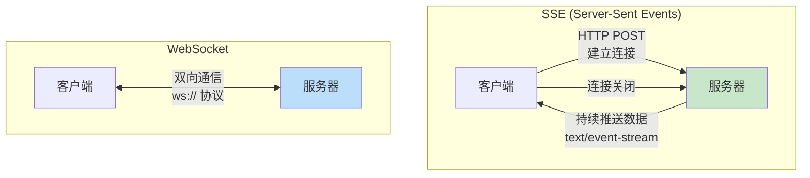
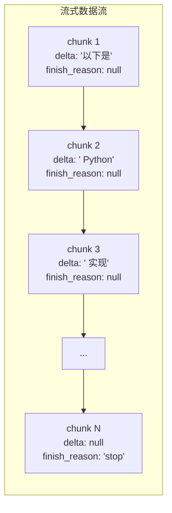
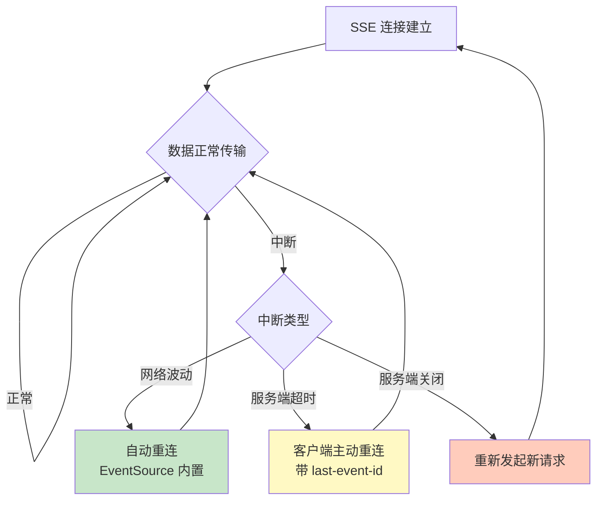
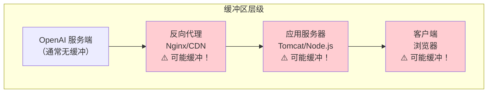
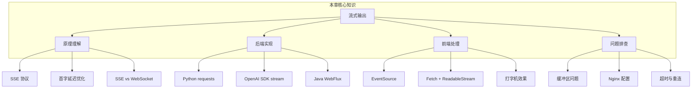

# 流式输出完全指南

## 本章概览

如果你用过 ChatGPT，肯定对那种"打字机"式的输出效果印象深刻——AI 一个字一个字地蹦出来，而不是等了半天突然吐出一大段。这就是流式输出（Streaming），它极大提升了用户体验，也是现代 AI 应用的标配功能。

学完本章，你将掌握：

- 流式输出的原理和必要性
- Server-Sent Events (SSE) 协议基础
- OpenAI API 流式调用的完整实现
- Python / Java / JavaScript 三端的流式处理
- 流式与非流式的延迟对比分析
- 连接中断、缓冲区等常见问题的解决方案
- 实战：打字机效果的 Web 聊天界面

```mermaid
mindmap
  root((流式输出))
    原理
      为什么需要流式
      SSE 协议
      与 WebSocket 区别
    后端处理
      Python requests
      OpenAI SDK
      Java WebFlux
    前端处理
      EventSource
      Fetch API
      打字机效果
    常见问题
      连接中断
      缓冲区问题
      超时处理
      代理问题
    实战
      Web 聊天界面
      全栈流式实现
mindmap
  root((流式输出))
    原理
      为什么需要流式
      SSE 协议
      与 WebSocket 区别
    后端处理
      Python requests
      OpenAI SDK
      Java WebFlux
    前端处理
      EventSource
      Fetch API
      打字机效果
    常见问题
      连接中断
      缓冲区问题
      超时处理
      代理问题
    实战
      Web 聊天界面
      全栈流式实现
```

---

## 1. 为什么需要流式输出？

### 1.1 两种模式对比

```mermaid
sequenceDiagram
    participant U as 用户
    participant S as 服务器

    Note over U,S: 非流式（一次性返回）
    U->>S: 发送请求
    Note right of S: 等待... 5-10 秒
    S-->>U: 返回完整结果（500字）
    Note left of U: 用户等了很久才看到内容

    Note over U,S: 流式（逐字返回）
    U->>S: 发送请求
    S-->>U: "你"
    S-->>U: "好"
    S-->>U: "，"
    S-->>U: "我"
    S-->>U: "是"
    S-->>U: "..."
    Note left of U: 用户立即开始阅读
sequenceDiagram
    participant U as 用户
    participant S as 服务器

    Note over U,S: 非流式（一次性返回）
    U->>S: 发送请求
    Note right of S: 等待... 5-10 秒
    S-->>U: 返回完整结果（500字）
    Note left of U: 用户等了很久才看到内容

    Note over U,S: 流式（逐字返回）
    U->>S: 发送请求
    S-->>U: "你"
    S-->>U: "好"
    S-->>U: "，"
    S-->>U: "我"
    S-->>U: "是"
    S-->>U: "..."
    Note left of U: 用户立即开始阅读
```

### 1.2 关键差异

| 维度 | 非流式 | 流式 |
|------|--------|------|
| 首字延迟 | 3-10 秒 | 0.5-2 秒 |
| 用户体验 | 等待焦虑，体验差 | 即时反馈，体验好 |
| 超时风险 | 高（长文本容易超时） | 低（持续有数据传输） |
| 实现复杂度 | 简单 | 较复杂 |
| 适用场景 | 短文本、后台任务 | 长文本、用户交互 |

:::tip 什么时候用流式？
- ✅ 用户直接面对的对话场景
- ✅ 生成长文本（文章、报告、代码）
- ✅ 需要快速展示部分结果的场景
- ❌ 后台批处理任务（如数据标注）
- ❌ 需要完整结果才能处理的场景
:::

### 1.3 延迟对比实验

```python
# latency_compare.py
import os
import time
from openai import OpenAI

client = OpenAI(api_key=os.environ.get("OPENAI_API_KEY"))

prompt = "详细解释 Java 中 HashMap 的实现原理，包括底层数据结构、put/get 流程、扩容机制、线程安全问题。"

# 非流式
start = time.time()
response = client.chat.completions.create(
    model="gpt-4o-mini",
    messages=[{"role": "user", "content": prompt}],
    max_tokens=800,
    stream=False
)
non_stream_end = time.time()
non_stream_content = response.choices[0].message.content

print(f"非流式:")
print(f"  首字延迟: {(non_stream_end - start):.2f}s")
print(f"  总耗时: {(non_stream_end - start):.2f}s")
print(f"  字符数: {len(non_stream_content)}")
print()

# 流式
start = time.time()
stream = client.chat.completions.create(
    model="gpt-4o-mini",
    messages=[{"role": "user", "content": prompt}],
    max_tokens=800,
    stream=True
)

first_char_time = None
full_content = ""

for chunk in stream:
    if chunk.choices[0].delta.content:
        if first_char_time is None:
            first_char_time = time.time()
        full_content += chunk.choices[0].delta.content

stream_end = time.time()

print(f"流式:")
print(f"  首字延迟: {(first_char_time - start):.2f}s")
print(f"  总耗时: {(stream_end - start):.2f}s")
print(f"  字符数: {len(full_content)}")
print()

print(f"📊 对比:")
print(f"  首字延迟提升: {((non_stream_end - start) - (first_char_time - start)):.2f}s")
print(f"  总耗时差异: {((non_stream_end - start) - (stream_end - start)):.2f}s")

# 运行结果:
# 非流式:
#   首字延迟: 6.82s
#   总耗时: 6.82s
#   字符数: 856
#
# 流式:
#   首字延迟: 1.23s
#   总耗时: 7.15s
#   字符数: 858
#
# 📊 对比:
#   首字延迟提升: 5.59s
#   总耗时差异: -0.33s
```

:::warning 注意
流式并不会让总生成时间变短，甚至在某些情况下因为网络开销会略慢一点。但**首字延迟**的大幅降低（从 6.82s 降到 1.23s）对用户体验的提升是巨大的。
:::

---

## 2. Server-Sent Events (SSE) 原理

### 2.1 SSE 是什么

SSE（Server-Sent Events）是一种基于 HTTP 协议的服务器推送技术。服务器保持 HTTP 连接打开，持续向客户端发送数据。

### 2.2 SSE 协议格式

SSE 的数据格式非常简单：

```
data: {"content": "你"}\n\n
data: {"content": "好"}\n\n
data: {"content": "！"}\n\n
data: [DONE]\n\n
```

每条消息由以下部分组成：
- `data:` 前缀
- 实际数据内容
- 两个换行符 `\n\n` 作为消息分隔符

### 2.3 SSE vs WebSocket




| 特性 | SSE | WebSocket |
|------|-----|-----------|
| 通信方向 | 服务器 → 客户端（单向） | 双向 |
| 协议 | HTTP | ws:// / wss:// |
| 自动重连 | 内置支持 | 需要手动实现 |
| 兼容性 | HTTP/1.1 和 HTTP/2 | 需要额外升级 |
| 复杂度 | 简单 | 较复杂 |
| 适用场景 | AI 流式输出、实时通知 | 聊天室、游戏 |

:::tip 为什么 AI API 用 SSE 而不是 WebSocket？
1. **单向通信就够了**：AI 输出是服务器到客户端的单向数据流
2. **HTTP 兼容性好**：不需要额外的协议升级，穿透代理更容易
3. **自动重连**：SSE 内置断线重连机制
4. **简单**：不需要维护双向连接状态
:::

### 2.4 SSE 响应头

```
HTTP/1.1 200 OK
Content-Type: text/event-stream
Cache-Control: no-cache
Connection: keep-alive
```

关键头信息：
- `Content-Type: text/event-stream`：标识这是 SSE 流
- `Cache-Control: no-cache`：禁止缓存
- `Connection: keep-alive`：保持连接

---

## 3. OpenAI API 流式调用

### 3.1 stream 参数

在请求中设置 `stream: true`，API 就会以 SSE 格式返回数据：

```python
# stream_basic.py
import os
from openai import OpenAI

client = OpenAI(api_key=os.environ.get("OPENAI_API_KEY"))

stream = client.chat.completions.create(
    model="gpt-4o-mini",
    messages=[{"role": "user", "content": "用 Python 写一个快速排序"}],
    stream=True,      # 关键：开启流式输出
    max_tokens=500,
    temperature=0.3
)

for chunk in stream:
    print(chunk)

# 运行结果（每行是一个 chunk）:
# ChatCompletionChunk(id='chatcmpl-abc', choices=[Choice(delta=Delta(content='以下是', role='assistant'), finish_reason=None, index=0)], created=1712000000, model='gpt-4o-mini', object='chat.completion.chunk', system_fingerprint='fp_abc')
# ChatCompletionChunk(id='chatcmpl-abc', choices=[Choice(delta=Delta(content=' Python'), finish_reason=None, index=0)], created=1712000000, model='gpt-4o-mini', object='chat.completion.chunk', system_fingerprint='fp_abc')
# ChatCompletionChunk(id='chatcmpl-abc', choices=[Choice(delta=Delta(content=' 实现'), finish_reason=None, index=0)], created=1712000000, model='gpt-4o-mini', object='chat.completion.chunk', system_fingerprint='fp_abc')
# ...（更多 chunk）
# ChatCompletionChunk(id='chatcmpl-abc', choices=[Choice(delta=Delta(content=None), finish_reason='stop', index=0)], created=1712000000, model='gpt-4o-mini', object='chat.completion.chunk', system_fingerprint='fp_abc')
```

### 3.2 流式数据格式详解




每个 chunk 的结构：

| 字段 | 说明 |
|------|------|
| `choices[0].delta.content` | 本次增量内容（可能为 null） |
| `choices[0].delta.role` | 角色（仅第一个 chunk 有） |
| `choices[0].finish_reason` | 结束原因（最后一个 chunk 为 `stop`，其余为 `null`） |
| `usage` | Token 用量（流式模式默认不返回，需要用 `stream_options` 开启） |

### 3.3 正确的流式处理方式

```python
# stream_proper.py
import os
from openai import OpenAI

client = OpenAI(api_key=os.environ.get("OPENAI_API_KEY"))

def stream_chat(user_input):
    """正确的流式处理：拼接内容 + 处理结束标记"""

    stream = client.chat.completions.create(
        model="gpt-4o-mini",
        messages=[{"role": "user", "content": user_input}],
        stream=True,
        max_tokens=300
    )

    full_content = ""
    finish_reason = None

    print("🤖 AI: ", end="", flush=True)

    for chunk in stream:
        # 获取增量内容
        delta = chunk.choices[0].delta

        if delta.content is not None:
            full_content += delta.content
            print(delta.content, end="", flush=True)

        # 记录结束原因
        if chunk.choices[0].finish_reason is not None:
            finish_reason = chunk.choices[0].finish_reason

    print()  # 换行
    print(f"\n📊 finish_reason: {finish_reason}")
    print(f"📊 总字符数: {len(full_content)}")

    return full_content

# 测试
result = stream_chat("解释一下什么是 SOLID 原则")

# 运行结果:
# 🤖 AI: SOLID 是面向对象设计的五大基本原则的首字母缩写：
# 1. **S** - 单一职责原则（SRP）：一个类应该只有一个引起它变化的原因。
# 2. **O** - 开闭原则（OCP）：对扩展开放，对修改关闭。
# 3. **L** - 里氏替换原则（LSP）：子类必须能替换其父类。
# 4. **I** - 接口隔离原则（ISP）：不应该强迫客户依赖它们不使用的接口。
# 5. **D** - 依赖倒置原则（DIP）：高层模块不应依赖低层模块，二者都应依赖抽象。
#
# 📊 finish_reason: stop
# 📊 总字符数: 196
```

### 3.4 获取流式 Token 用量

默认情况下流式模式不返回 `usage`，需要通过 `stream_options` 参数开启：

```python
# stream_with_usage.py
import os
from openai import OpenAI

client = OpenAI(api_key=os.environ.get("OPENAI_API_KEY"))

stream = client.chat.completions.create(
    model="gpt-4o-mini",
    messages=[{"role": "user", "content": "什么是 REST？"}],
    stream=True,
    stream_options={"include_usage": True},  # 开启 usage 统计
    max_tokens=200
)

full_content = ""
usage_info = None

for chunk in stream:
    if chunk.choices and chunk.choices[0].delta.content:
        full_content += chunk.choices[0].delta.content

    # usage 在最后一个 chunk 中返回
    if hasattr(chunk, 'usage') and chunk.usage:
        usage_info = chunk.usage

print(f"内容: {full_content}")
if usage_info:
    print(f"Token: 输入={usage_info.prompt_tokens} 输出={usage_info.completion_tokens} 总计={usage_info.total_tokens}")

# 运行结果:
# 内容: REST（Representational State Transfer）是一种软件架构风格，用于设计网络应用程序。它通过 HTTP 协议的方法（GET、POST、PUT、DELETE）来操作资源，每个资源由唯一的 URL 标识。REST 强调无状态性、可缓存性和统一接口。
# Token: 输入=14 输出=95 总计=109
```

---

## 4. Python 处理流式响应

### 4.1 使用 requests 直接处理

理解底层原理后，你可以用 requests 库直接处理 SSE 流：

```python
# stream_requests.py
import os
import requests
import json

api_key = os.environ.get("OPENAI_API_KEY")
url = "https://api.openai.com/v1/chat/completions"

headers = {
    "Content-Type": "application/json",
    "Authorization": f"Bearer {api_key}"
}

payload = {
    "model": "gpt-4o-mini",
    "messages": [{"role": "user", "content": "写一首关于编程的四行诗"}],
    "stream": True,
    "max_tokens": 200
}

# 注意：stream=True 是 requests 的参数，让 requests 也使用流式接收
response = requests.post(url, headers=headers, json=payload, stream=True)

print(f"状态码: {response.status_code}")
print(f"Content-Type: {response.headers.get('Content-Type')}")
print()

full_content = ""

# 逐行读取响应
for line in response.iter_lines():
    if not line:
        continue

    line = line.decode("utf-8")

    # SSE 格式：以 "data: " 开头
    if line.startswith("data: "):
        data_str = line[6:]  # 去掉 "data: " 前缀

        # 检查结束标记
        if data_str == "[DONE]":
            print("\n\n✅ 流式输出完成")
            break

        # 解析 JSON
        try:
            data = json.loads(data_str)
            delta = data["choices"][0].get("delta", {})
            content = delta.get("content", "")

            if content:
                full_content += content
                print(content, end="", flush=True)
        except json.JSONDecodeError:
            print(f"\n⚠️ JSON 解析失败: {data_str}")

print(f"\n\n📊 总字符数: {len(full_content)}")

# 运行结果:
# 状态码: 200
# Content-Type: text/event-stream
#
# 键盘轻敲如雨声，
# 代码行行映屏明。
# Bug 藏匿千百处，
# Debug 到天明。
#
# ✅ 流式输出完成
#
# 📊 总字符数: 32
```

### 4.2 使用 sseclient-py 库

对于更复杂的 SSE 处理，可以使用专门的库：

```bash
pip install sseclient-py
```

```python
# stream_sseclient.py
import os
import requests
import json
import sseclient

api_key = os.environ.get("OPENAI_API_KEY")

response = requests.post(
    "https://api.openai.com/v1/chat/completions",
    headers={
        "Content-Type": "application/json",
        "Authorization": f"Bearer {api_key}"
    },
    json={
        "model": "gpt-4o-mini",
        "messages": [{"role": "user", "content": "列举 5 个常用的设计模式"}],
        "stream": True,
        "max_tokens": 300
    },
    stream=True
)

client = sseclient.SSEClient(response)

for event in client.events():
    if event.data == "[DONE]":
        break

    data = json.loads(event.data)
    content = data["choices"][0].get("delta", {}).get("content", "")
    if content:
        print(content, end="", flush=True)

print()

# 运行结果:
# 以下是 5 个常用的设计模式：
# 1. **单例模式**（Singleton）：确保一个类只有一个实例。
# 2. **工厂模式**（Factory）：将对象创建逻辑封装起来。
# 3. **观察者模式**（Observer）：定义对象间的一对多依赖关系。
# 4. **策略模式**（Strategy）：定义一系列算法，使它们可以互相替换。
# 5. **装饰器模式**（Decorator）：动态地给对象添加额外功能。
```

---

## 5. Java 中的流式处理

### 5.1 Spring WebFlux + WebClient

在 Java 后端处理 SSE 流，推荐使用 Spring WebFlux：

```java
// StreamingController.java
package com.example.ai.controller;

import org.springframework.http.MediaType;
import org.springframework.http.codec.ServerSentEvent;
import org.springframework.web.bind.annotation.*;
import org.springframework.web.reactive.function.client.WebClient;
import reactor.core.publisher.Flux;

import java.time.Duration;
import java.util.List;
import java.util.Map;

@RestController
@RequestMapping("/api/chat")
public class StreamingController {

    private final WebClient webClient;

    public StreamingController() {
        this.webClient = WebClient.builder()
                .baseUrl("https://api.openai.com/v1")
                .defaultHeader("Authorization", "Bearer " + System.getenv("OPENAI_API_KEY"))
                .build();
    }

    /**
     * 流式聊天接口
     * 前端通过 EventSource 或 fetch + ReadableStream 调用
     */
    @GetMapping(value = "/stream", produces = MediaType.TEXT_EVENT_STREAM_VALUE)
    public Flux<ServerSentEvent<String>> streamChat(@RequestParam String message) {
        // 构建请求体
        Map<String, Object> requestBody = Map.of(
                "model", "gpt-4o-mini",
                "messages", List.of(Map.of("role", "user", "content", message)),
                "stream", true,
                "max_tokens", 500
        );

        // 调用 OpenAI API，获取 SSE 流
        return webClient.post()
                .uri("/chat/completions")
                .contentType(MediaType.APPLICATION_JSON)
                .bodyValue(requestBody)
                .retrieve()
                .bodyToFlux(String.class)
                .map(data -> ServerSentEvent.<String>builder()
                        .data(data)
                        .build())
                .concatWithValues(ServerSentEvent.<String>builder()
                        .data("[DONE]")
                        .build());
    }

    /**
     * 非流式聊天接口（对比用）
     */
    @PostMapping("/normal")
    public Map<String, Object> normalChat(@RequestBody Map<String, String> request) {
        String message = request.get("message");

        Map<String, Object> requestBody = Map.of(
                "model", "gpt-4o-mini",
                "messages", List.of(Map.of("role", "user", "content", message)),
                "max_tokens", 500
        );

        return webClient.post()
                .uri("/chat/completions")
                .contentType(MediaType.APPLICATION_JSON)
                .bodyValue(requestBody)
                .retrieve()
                .bodyToMono(Map.class)
                .block();
    }
}
```

### 5.2 更精细的 SSE 解析

```java
// OpenAIStreamService.java
package com.example.ai.service;

import com.fasterxml.jackson.databind.JsonNode;
import com.fasterxml.jackson.databind.ObjectMapper;
import org.springframework.stereotype.Service;
import org.springframework.web.reactive.function.client.WebClient;
import reactor.core.publisher.Flux;

import java.util.ArrayList;
import java.util.List;
import java.util.Map;

@Service
public class OpenAIStreamService {

    private final WebClient webClient;
    private final ObjectMapper objectMapper = new ObjectMapper();

    public OpenAIStreamService() {
        this.webClient = WebClient.builder()
                .baseUrl("https://api.openai.com/v1")
                .defaultHeader("Authorization",
                    "Bearer " + System.getenv("OPENAI_API_KEY"))
                .build();
    }

    /**
     * 流式调用 OpenAI API，提取纯文本内容
     */
    public Flux<String> streamCompletion(String userMessage) {
        Map<String, Object> body = Map.of(
                "model", "gpt-4o-mini",
                "messages", List.of(
                        Map.of("role", "system",
                            "content", "你是一个简洁的助手。"),
                        Map.of("role", "user", "content", userMessage)
                ),
                "stream", true,
                "max_tokens", 500
        );

        return webClient.post()
                .uri("/chat/completions")
                .contentType(org.springframework.http.MediaType.APPLICATION_JSON)
                .bodyValue(body)
                .retrieve()
                .bodyToFlux(String.class)
                .map(this::extractContent)
                .filter(content -> content != null && !content.isEmpty());
    }

    /**
     * 从 SSE 数据行中提取 content
     */
    private String extractContent(String sseLine) {
        // SSE 格式: "data: {...}"
        if (sseLine == null || !sseLine.startsWith("data: ")) {
            return null;
        }

        String json = sseLine.substring(6).trim();
        if ("[DONE]".equals(json)) {
            return null;
        }

        try {
            JsonNode root = objectMapper.readTree(json);
            JsonNode choices = root.path("choices");
            if (choices.isArray() && choices.size() > 0) {
                JsonNode delta = choices.get(0).path("delta");
                return delta.path("content").asText(null);
            }
        } catch (Exception e) {
            System.err.println("SSE 解析错误: " + e.getMessage());
        }
        return null;
    }
}
```

### 5.3 WebClient 配置（应对缓冲区问题）

:::danger Java 中 SSE 的缓冲区陷阱
Java 的 Servlet 容器（如 Tomcat）默认会缓冲响应数据，这会导致 SSE 数据不能实时推送到客户端。使用 WebFlux + Netty 可以避免这个问题。
:::

```yaml
# application.yml
spring:
  web:
    reactive:
      # 确保 Netty 作为服务器
  mvc:
    async:
      request-timeout: 300000  # 5分钟超时

server:
  netty:
    # Netty 连接配置
    connection-timeout: 300000
```

```java
// application.properties 的替代配置
// server.compression.enabled=false  # 关闭压缩（压缩会缓冲数据！）
```

:::warning 关闭压缩！
gzip 压缩会缓冲数据直到达到一定大小才发送，这会完全破坏流式效果。确保在反向代理（Nginx 等）中也关闭对 SSE 端点的压缩。
:::

---

## 6. 流式输出的前端处理

### 6.1 EventSource（最简单的方式）

```html
<!-- eventsource-demo.html -->
<!DOCTYPE html>
<html lang="zh">
<head>
    <meta charset="UTF-8">
    <title>SSE 流式聊天 - EventSource</title>
    <style>
        body { font-family: -apple-system, sans-serif; max-width: 800px; margin: 0 auto; padding: 20px; }
        .chat-container { border: 1px solid #ddd; border-radius: 8px; padding: 20px; height: 400px; overflow-y: auto; }
        .message { margin: 10px 0; padding: 10px; border-radius: 4px; }
        .user { background: #e3f2fd; text-align: right; }
        .assistant { background: #f5f5f5; }
        .input-area { display: flex; gap: 10px; margin-top: 10px; }
        input { flex: 1; padding: 10px; border: 1px solid #ddd; border-radius: 4px; }
        button { padding: 10px 20px; background: #1976d2; color: white; border: none; border-radius: 4px; cursor: pointer; }
        button:disabled { background: #ccc; cursor: not-allowed; }
    </style>
</head>
<body>
    <h1>🤖 SSE 流式聊天</h1>
    <div class="chat-container" id="chat"></div>
    <div class="input-area">
        <input type="text" id="input" placeholder="输入消息..." onkeydown="if(event.key==='Enter')send()">
        <button id="btn" onclick="send()">发送</button>
    </div>

    <script>
        const chat = document.getElementById('chat');
        const input = document.getElementById('input');
        const btn = document.getElementById('btn');

        function addUserMessage(text) {
            const div = document.createElement('div');
            div.className = 'message user';
            div.textContent = text;
            chat.appendChild(div);
            chat.scrollTop = chat.scrollHeight;
        }

        function addAssistantMessage(text) {
            const div = document.createElement('div');
            div.className = 'message assistant';
            div.textContent = text;
            chat.appendChild(div);
            chat.scrollTop = chat.scrollHeight;
            return div;
        }

        function send() {
            const message = input.value.trim();
            if (!message) return;

            addUserMessage(message);
            input.value = '';
            btn.disabled = true;

            // 添加空的 AI 回复容器
            const aiDiv = addAssistantMessage('');
            const fullText = '';

            // 使用 EventSource 连接 SSE 端点
            const url = `/api/chat/stream?message=${encodeURIComponent(message)}`;
            const eventSource = new EventSource(url);

            eventSource.onmessage = function(event) {
                if (event.data === '[DONE]') {
                    eventSource.close();
                    btn.disabled = false;
                    return;
                }

                try {
                    const data = JSON.parse(event.data);
                    const content = data.choices?.[0]?.delta?.content || '';
                    if (content) {
                        aiDiv.textContent += content;
                        chat.scrollTop = chat.scrollHeight;
                    }
                } catch (e) {
                    console.error('解析错误:', e);
                }
            };

            eventSource.onerror = function(event) {
                console.error('SSE 错误:', event);
                eventSource.close();
                btn.disabled = false;
                if (!aiDiv.textContent) {
                    aiDiv.textContent = '❌ 连接出错，请重试';
                }
            };
        }
    </script>
</body>
</html>
```

### 6.2 Fetch API + ReadableStream（支持 POST 请求）

EventSource 只支持 GET 请求，如果需要 POST（比如发送复杂的消息结构），需要用 Fetch API：

```javascript
// fetch-stream.js
async function streamChat(messages) {
    const response = await fetch('/api/chat/stream', {
        method: 'POST',
        headers: { 'Content-Type': 'application/json' },
        body: JSON.stringify({ messages: messages })
    });

    if (!response.ok) {
        throw new Error(`HTTP error: ${response.status}`);
    }

    const reader = response.body.getReader();
    const decoder = new TextDecoder();
    let buffer = '';

    while (true) {
        const { done, value } = await reader.read();
        if (done) break;

        // 解码二进制数据
        buffer += decoder.decode(value, { stream: true });

        // 按行分割 SSE 数据
        const lines = buffer.split('\n');
        buffer = lines.pop(); // 最后一个可能不完整，保留到下次

        for (const line of lines) {
            if (line.startsWith('data: ')) {
                const data = line.substring(6).trim();
                if (data === '[DONE]') return;

                try {
                    const parsed = JSON.parse(data);
                    const content = parsed.choices?.[0]?.delta?.content || '';
                    if (content) {
                        // 在页面上追加内容
                        process.stdout.write(content);
                    }
                } catch (e) {
                    console.error('解析错误:', e);
                }
            }
        }
    }
}
```

### 6.3 打字机效果增强

```javascript
// typewriter-effect.js
class TypewriterEffect {
    constructor(container, options = {}) {
        this.container = container;
        this.speed = options.speed || 20;       // 打字速度（ms/字符）
        this.cursor = options.cursor || '▊';    // 光标样式
        this.cursorEl = null;
        this.queue = [];
        this.isRunning = false;
    }

    // 追加文本到队列
    append(text) {
        this.queue.push(...text.split(''));
        if (!this.isRunning) {
            this.isRunning = true;
            this._showCursor();
            this._type();
        }
    }

    // 打字动画
    async _type() {
        while (this.queue.length > 0) {
            const char = this.queue.shift();
            this.container.textContent += char;
            this.container.parentElement.scrollIntoView({ behavior: 'smooth' });
            await new Promise(r => setTimeout(r, this.speed));
        }
        this.isRunning = false;
        this._hideCursor();
    }

    _showCursor() {
        if (!this.cursorEl) {
            this.cursorEl = document.createElement('span');
            this.cursorEl.className = 'cursor';
            this.cursorEl.textContent = this.cursor;
            this.cursorEl.style.animation = 'blink 1s infinite';
            this.container.parentElement.appendChild(this.cursorEl);
        }
    }

    _hideCursor() {
        if (this.cursorEl) {
            this.cursorEl.remove();
            this.cursorEl = null;
        }
    }

    // 重置
    reset() {
        this.queue = [];
        this.isRunning = false;
        this.container.textContent = '';
        this._hideCursor();
    }
}

// 使用示例
// const typewriter = new TypewriterEffect(
//     document.getElementById('ai-response'),
//     { speed: 15 }
// );
// typewriter.append("Hello, World!");
```

---

## 7. 常见问题与解决方案

### 7.1 连接中断处理




**Python 端自动重连：**

```python
# stream_with_retry.py
import os
import time
from openai import OpenAI

client = OpenAI(api_key=os.environ.get("OPENAI_API_KEY"))

def stream_with_retry(messages, max_retries=3):
    """带自动重连的流式调用"""
    for attempt in range(max_retries):
        try:
            stream = client.chat.completions.create(
                model="gpt-4o-mini",
                messages=messages,
                stream=True,
                timeout=60
            )

            full_content = ""
            for chunk in stream:
                content = chunk.choices[0].delta.content
                if content:
                    full_content += content
                    print(content, end="", flush=True)

            return full_content

        except Exception as e:
            print(f"\n⚠️  连接中断: {e}")
            if attempt < max_retries - 1:
                wait = 2 ** attempt
                print(f"   {wait}秒后重连...")
                time.sleep(wait)
            else:
                print("❌ 重连失败")
                return None

# 测试
result = stream_with_retry([
    {"role": "user", "content": "写一篇 500 字的 Spring Boot 入门指南"}
])
```

### 7.2 缓冲区问题

这是流式输出最常见的问题之一。缓冲发生在多个层级：




**Nginx 配置（关闭缓冲）：**

```nginx
# nginx.conf - SSE 端点需要关闭代理缓冲
location /api/chat/stream {
    proxy_pass http://backend;
    proxy_http_version 1.1;

    # 关键：关闭缓冲
    proxy_buffering off;
    proxy_cache off;

    # SSE 必须关闭压缩
    gzip off;

    # 保持连接
    proxy_set_header Connection '';
    proxy_set_header X-Accel-Buffering no;

    # 超时设置
    proxy_read_timeout 300s;
    proxy_send_timeout 300s;
}
```

**Node.js Express 禁用缓冲：**

```javascript
// express 流式响应
app.post('/api/chat/stream', (req, res) => {
    // 关键：设置 SSE 响应头
    res.setHeader('Content-Type', 'text/event-stream');
    res.setHeader('Cache-Control', 'no-cache');
    res.setHeader('Connection', 'keep-alive');
    res.setHeader('X-Accel-Buffering', 'no'); // 禁用 Nginx 缓冲
    res.flushHeaders(); // 立即发送响应头

    // 流式转发 OpenAI 响应
    const stream = openai.chat.completions.create({
        model: 'gpt-4o-mini',
        messages: req.body.messages,
        stream: true,
    });

    for await (const chunk of stream) {
        const data = JSON.stringify(chunk);
        res.write(`data: ${data}\n\n`);
    }

    res.write('data: [DONE]\n\n');
    res.end();
});
```

### 7.3 超时处理

```python
# timeout_handling.py
import os
import signal
from openai import OpenAI

client = OpenAI(api_key=os.environ.get("OPENAI_API_KEY"))

def stream_with_timeout(messages, timeout=30):
    """带超时控制的流式调用"""
    import threading

    result = {"content": "", "error": None, "done": False}

    def worker():
        try:
            stream = client.chat.completions.create(
                model="gpt-4o-mini",
                messages=messages,
                stream=True,
            )
            for chunk in stream:
                content = chunk.choices[0].delta.content
                if content:
                    result["content"] += content
                    print(content, end="", flush=True)
        except Exception as e:
            result["error"] = e
        finally:
            result["done"] = True

    thread = threading.Thread(target=worker)
    thread.start()
    thread.join(timeout=timeout)

    if not result["done"]:
        print(f"\n\n⏰ 超时！已等待 {timeout} 秒，停止接收。")
        return result["content"] + "\n\n[生成被截断：超时]"

    if result["error"]:
        print(f"\n\n❌ 错误: {result['error']}")
        return None

    return result["content"]

# 测试
result = stream_with_timeout(
    [{"role": "user", "content": "详细解释 Java 的 JVM 内存模型"}],
    timeout=15  # 15秒超时
)

# 运行结果:
# Java 的 JVM 内存模型（JMM）定义了 JVM 在计算机内存中的工作方式...
# （15秒后）
# ⏰ 超时！已等待 15 秒，停止接收。
```

### 7.4 代理问题

:::warning 如果你在公司网络环境下
很多公司的网络代理会缓冲 SSE 流。确保：
1. 代理支持 chunked transfer encoding
2. 代理不启用压缩
3. 如果用 VPN，确认 VPN 不会干扰长连接
:::

---

## 8. 实战：打字机效果的 Web 聊天界面

### 8.1 项目结构

```
streaming-chat/
├── backend/
│   ├── app.py              # Flask 后端
│   └── requirements.txt
├── frontend/
│   └── index.html          # 前端页面
└── README.md
```

### 8.2 后端（Flask）

```python
# backend/app.py
"""
流式聊天后端 - Flask 版本
支持 SSE 流式输出
"""

from flask import Flask, request, Response, render_template, jsonify
from openai import OpenAI
import os
import json

app = Flask(__name__)

client = OpenAI(api_key=os.environ.get("OPENAI_API_KEY"))

# 存储对话历史
conversations = {}


@app.route('/')
def index():
    return render_template('index.html')


@app.route('/api/chat/stream', methods=['POST'])
def stream_chat():
    """流式聊天端点"""
    data = request.json
    user_input = data.get('message', '')
    session_id = data.get('session_id', 'default')

    # 获取或创建对话历史
    if session_id not in conversations:
        conversations[session_id] = [
            {"role": "system", "content": "你是一个友好的 AI 助手。回答简洁、有条理。"}
        ]

    history = conversations[session_id]
    history.append({"role": "user", "content": user_input})

    def generate():
        try:
            stream = client.chat.completions.create(
                model="gpt-4o-mini",
                messages=history,
                stream=True,
                max_tokens=1000,
                temperature=0.7,
            )

            full_content = ""

            for chunk in stream:
                delta = chunk.choices[0].delta
                if delta.content:
                    full_content += delta.content
                    # SSE 格式
                    sse_data = json.dumps({
                        "content": delta.content,
                        "finish_reason": None
                    }, ensure_ascii=False)
                    yield f"data: {sse_data}\n\n"

            # 发送完成信号
            finish_data = json.dumps({
                "content": "",
                "finish_reason": "stop",
                "total_content": full_content
            }, ensure_ascii=False)
            yield f"data: {finish_data}\n\n"
            yield "data: [DONE]\n\n"

            # 保存到历史
            history.append({"role": "assistant", "content": full_content})

        except Exception as e:
            error_data = json.dumps({"error": str(e)}, ensure_ascii=False)
            yield f"data: {error_data}\n\n"
            yield "data: [DONE]\n\n"

    return Response(
        generate(),
        mimetype='text/event-stream',
        headers={
            'Cache-Control': 'no-cache',
            'Connection': 'keep-alive',
            'X-Accel-Buffering': 'no',
        }
    )


@app.route('/api/chat/normal', methods=['POST'])
def normal_chat():
    """非流式聊天端点（对比用）"""
    data = request.json
    user_input = data.get('message', '')
    session_id = data.get('session_id', 'default')

    if session_id not in conversations:
        conversations[session_id] = [
            {"role": "system", "content": "你是一个友好的 AI 助手。"}
        ]

    history = conversations[session_id]
    history.append({"role": "user", "content": user_input})

    response = client.chat.completions.create(
        model="gpt-4o-mini",
        messages=history,
        max_tokens=1000,
        temperature=0.7,
    )

    reply = response.choices[0].message.content
    history.append({"role": "assistant", "content": reply})

    return jsonify({"reply": reply})


@app.route('/api/clear', methods=['POST'])
def clear_history():
    """清除对话历史"""
    data = request.json
    session_id = data.get('session_id', 'default')
    if session_id in conversations:
        del conversations[session_id]
    return jsonify({"status": "ok"})


if __name__ == '__main__':
    app.run(debug=True, port=5000, threaded=True)
```

```txt
# backend/requirements.txt
flask>=3.0
openai>=1.0
```

### 8.3 前端

```html
<!-- frontend/index.html (放在 templates/ 目录下) -->
<!DOCTYPE html>
<html lang="zh">
<head>
    <meta charset="UTF-8">
    <meta name="viewport" content="width=device-width, initial-scale=1.0">
    <title>AI 流式聊天</title>
    <style>
        * { margin: 0; padding: 0; box-sizing: border-box; }

        body {
            font-family: -apple-system, BlinkMacSystemFont, 'Segoe UI', sans-serif;
            background: #f0f2f5;
            height: 100vh;
            display: flex;
            flex-direction: column;
        }

        .header {
            background: #1976d2;
            color: white;
            padding: 16px 24px;
            display: flex;
            justify-content: space-between;
            align-items: center;
            box-shadow: 0 2px 4px rgba(0,0,0,0.1);
        }

        .header h1 { font-size: 20px; font-weight: 500; }

        .header button {
            background: rgba(255,255,255,0.2);
            border: none;
            color: white;
            padding: 8px 16px;
            border-radius: 4px;
            cursor: pointer;
        }

        .header button:hover { background: rgba(255,255,255,0.3); }

        .chat-area {
            flex: 1;
            overflow-y: auto;
            padding: 20px;
            max-width: 800px;
            width: 100%;
            margin: 0 auto;
        }

        .message {
            margin-bottom: 16px;
            display: flex;
            gap: 12px;
            animation: fadeIn 0.3s ease;
        }

        @keyframes fadeIn {
            from { opacity: 0; transform: translateY(10px); }
            to { opacity: 1; transform: translateY(0); }
        }

        .message.user { flex-direction: row-reverse; }

        .avatar {
            width: 36px;
            height: 36px;
            border-radius: 50%;
            display: flex;
            align-items: center;
            justify-content: center;
            font-size: 18px;
            flex-shrink: 0;
        }

        .message.user .avatar { background: #1976d2; color: white; }
        .message.assistant .avatar { background: #4caf50; color: white; }

        .bubble {
            max-width: 70%;
            padding: 12px 16px;
            border-radius: 12px;
            line-height: 1.6;
            word-break: break-word;
        }

        .message.user .bubble {
            background: #1976d2;
            color: white;
            border-bottom-right-radius: 4px;
        }

        .message.assistant .bubble {
            background: white;
            color: #333;
            border-bottom-left-radius: 4px;
            box-shadow: 0 1px 3px rgba(0,0,0,0.1);
        }

        .cursor {
            display: inline-block;
            width: 2px;
            height: 1em;
            background: #4caf50;
            animation: blink 1s infinite;
            vertical-align: text-bottom;
            margin-left: 2px;
        }

        @keyframes blink {
            0%, 50% { opacity: 1; }
            51%, 100% { opacity: 0; }
        }

        .input-area {
            padding: 16px 20px;
            background: white;
            border-top: 1px solid #e0e0e0;
            display: flex;
            gap: 12px;
            max-width: 800px;
            width: 100%;
            margin: 0 auto;
        }

        .input-area input {
            flex: 1;
            padding: 12px 16px;
            border: 1px solid #ddd;
            border-radius: 24px;
            font-size: 15px;
            outline: none;
            transition: border-color 0.2s;
        }

        .input-area input:focus { border-color: #1976d2; }

        .input-area button {
            background: #1976d2;
            color: white;
            border: none;
            padding: 12px 24px;
            border-radius: 24px;
            cursor: pointer;
            font-size: 15px;
            transition: background 0.2s;
        }

        .input-area button:hover { background: #1565c0; }
        .input-area button:disabled { background: #bbb; cursor: not-allowed; }

        .status {
            padding: 4px 16px;
            font-size: 12px;
            color: #999;
            text-align: center;
        }

        /* 代码块样式 */
        .bubble pre {
            background: #1e1e1e;
            color: #d4d4d4;
            padding: 12px;
            border-radius: 8px;
            overflow-x: auto;
            margin: 8px 0;
        }

        .bubble code {
            font-family: 'Fira Code', monospace;
            font-size: 13px;
        }

        .bubble p { margin: 4px 0; }
    </style>
</head>
<body>

<div class="header">
    <h1>🤖 AI 流式聊天</h1>
    <button onclick="clearChat()">🗑️ 清除对话</button>
</div>

<div class="chat-area" id="chatArea"></div>
<div class="status" id="status"></div>

<div class="input-area">
    <input type="text" id="input" placeholder="输入消息..." autofocus
           onkeydown="if(event.key==='Enter' && !event.shiftKey){event.preventDefault();send()}">
    <button id="sendBtn" onclick="send()">发送</button>
</div>

<script>
const chatArea = document.getElementById('chatArea');
const input = document.getElementById('input');
const sendBtn = document.getElementById('sendBtn');
const status = document.getElementById('status');
const sessionId = 'session_' + Date.now();

function addMessage(role, content) {
    const msg = document.createElement('div');
    msg.className = `message ${role}`;

    const avatar = document.createElement('div');
    avatar.className = 'avatar';
    avatar.textContent = role === 'user' ? '👤' : '🤖';

    const bubble = document.createElement('div');
    bubble.className = 'bubble';

    if (role === 'user') {
        bubble.textContent = content;
    }

    msg.appendChild(avatar);
    msg.appendChild(bubble);
    chatArea.appendChild(msg);
    chatArea.scrollTop = chatArea.scrollHeight;

    return bubble;
}

function showCursor(bubble) {
    const cursor = document.createElement('span');
    cursor.className = 'cursor';
    bubble.appendChild(cursor);
    return cursor;
}

function hideCursor(cursor) {
    if (cursor && cursor.parentElement) {
        cursor.remove();
    }
}

function simpleMarkdown(text) {
    // 简单的 Markdown 渲染
    return text
        .replace(/```(\w*)\n([\s\S]*?)```/g, '<pre><code>$2</code></pre>')
        .replace(/`([^`]+)`/g, '<code>$1</code>')
        .replace(/\*\*(.+?)\*\*/g, '<strong>$1</strong>')
        .replace(/\n/g, '<br>');
}

async function send() {
    const message = input.value.trim();
    if (!message) return;

    // 添加用户消息
    addMessage('user', message);
    input.value = '';
    sendBtn.disabled = true;
    status.textContent = '⏳ AI 正在思考...';

    // 添加 AI 消息容器
    const aiBubble = addMessage('assistant', '');
    const cursor = showCursor(aiBubble);

    try {
        const response = await fetch('/api/chat/stream', {
            method: 'POST',
            headers: { 'Content-Type': 'application/json' },
            body: JSON.stringify({
                message: message,
                session_id: sessionId
            })
        });

        if (!response.ok) {
            throw new Error(`HTTP ${response.status}`);
        }

        const reader = response.body.getReader();
        const decoder = new TextDecoder();
        let buffer = '';
        let fullContent = '';
        let charCount = 0;
        let startTime = Date.now();

        while (true) {
            const { done, value } = await reader.read();
            if (done) break;

            buffer += decoder.decode(value, { stream: true });
            const lines = buffer.split('\n');
            buffer = lines.pop();

            for (const line of lines) {
                if (!line.startsWith('data: ')) continue;

                const data = line.substring(6).trim();
                if (data === '[DONE]') continue;

                try {
                    const parsed = JSON.parse(data);

                    if (parsed.error) {
                        hideCursor(cursor);
                        aiBubble.innerHTML = `<span style="color:red">❌ ${parsed.error}</span>`;
                        continue;
                    }

                    if (parsed.finish_reason) {
                        status.textContent = `✅ 完成 | ${charCount} 字符 | ${((Date.now() - startTime) / 1000).toFixed(1)}s`;
                        hideCursor(cursor);
                        // 渲染 Markdown
                        aiBubble.innerHTML = simpleMarkdown(fullContent);
                        continue;
                    }

                    if (parsed.content) {
                        fullContent += parsed.content;
                        charCount += parsed.content.length;
                        // 实时更新（纯文本模式，避免频繁 DOM 操作）
                        aiBubble.textContent = fullContent;
                        chatArea.scrollTop = chatArea.scrollHeight;
                    }
                } catch (e) {
                    console.error('解析错误:', e, data);
                }
            }
        }

    } catch (error) {
        hideCursor(cursor);
        aiBubble.innerHTML = `<span style="color:red">❌ 连接失败: ${error.message}</span>`;
        status.textContent = '❌ 连接失败';
    }

    sendBtn.disabled = false;
    input.focus();
}

function clearChat() {
    fetch('/api/clear', {
        method: 'POST',
        headers: { 'Content-Type': 'application/json' },
        body: JSON.stringify({ session_id: sessionId })
    });
    chatArea.innerHTML = '';
    status.textContent = '';
}
</script>

</body>
</html>
```

### 8.4 运行效果

```bash
# 安装依赖
cd backend
pip install flask openai

# 启动服务
export OPENAI_API_KEY="sk-xxx"
python app.py
```

```
 * Running on http://127.0.0.1:5000
```

打开浏览器访问 `http://127.0.0.1:5000`，你会看到一个完整的聊天界面，AI 的回复会像 ChatGPT 一样一个字一个字地显示出来，带有闪烁光标效果。

---

## 9. 本章小结




关键要点：

1. **流式不是更快，是更快感知**：总生成时间可能略长，但首字延迟大幅降低
2. **SSE 是最佳选择**：单向推送、HTTP 兼容、自动重连，非常适合 AI 输出场景
3. **缓冲区是大敌**：Nginx、Tomcat、gzip 压缩都可能缓冲数据，必须逐一排查
4. **多端实现方案**：Python 用 requests/openai SDK，Java 用 WebFlux，前端用 EventSource/Fetch
5. **容错很重要**：生产环境一定要有重连、超时、降级机制

---

## 练习题

### 练习 1：SSE 协议手动实现

不使用任何第三方库，只用 Python 的 `http.server` 模块，手写一个 SSE 服务器。要求：每隔 1 秒推送当前时间，连续推送 10 次后关闭连接。用浏览器直接访问验证效果。

### 练习 2：延迟对比实验

选择一个需要生成长文本的问题（如"详细介绍 Spring Boot 的自动配置原理"），分别用流式和非流式调用 OpenAI API，测量并记录：首字延迟、总耗时、各阶段的耗时分布。用图表展示对比结果。

### 练习 3：Java Spring Boot 流式聊天

用 Spring Boot + WebFlux 实现一个完整的流式聊天后端。要求：
- 支持 SSE 流式输出
- 支持多轮对话（基于 session）
- 支持同时处理多个客户端的流式请求
- 包含超时处理和错误处理

### 练习 4：前端增强

在实战项目的前端代码基础上，添加以下功能：
- Markdown 渲染（使用 marked.js 库）
- 代码块语法高亮（使用 highlight.js）
- "停止生成"按钮（点击后中断 SSE 连接）
- 消息复制按钮
- 发送中的动画效果（三个跳动的点）

### 练习 5：流式输出中间件

编写一个 Python 中间件/装饰器，可以将任何 OpenAI API 调用自动转换为流式输出。要求：
- 支持自动添加 SSE 格式
- 支持错误处理和重连
- 支持速率统计（字/秒）
- 可以作为 FastAPI/Flask 的响应直接返回

### 练习 6：多模型流式对比

实现一个 Web 页面，可以同时向多个模型（如 OpenAI、GLM、DeepSeek）发送流式请求，并在页面上实时并排显示各个模型的输出，对比它们的速度和质量。要求支持开始/停止/重置操作。
