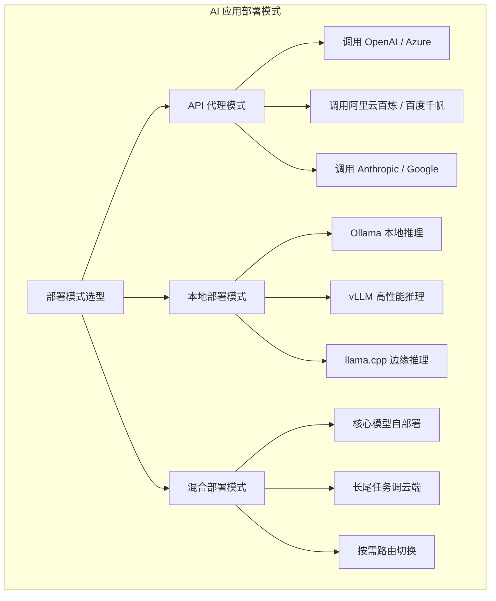
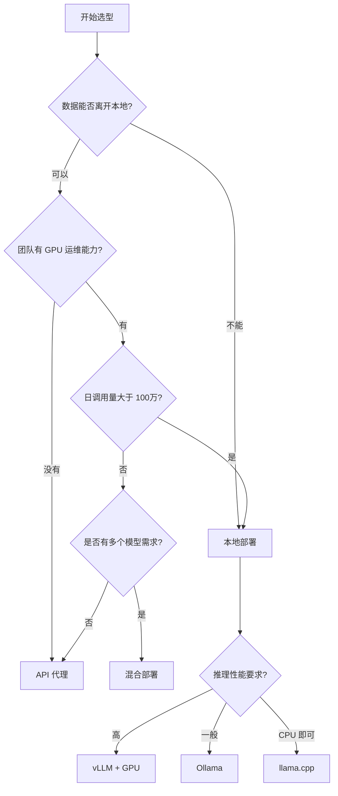
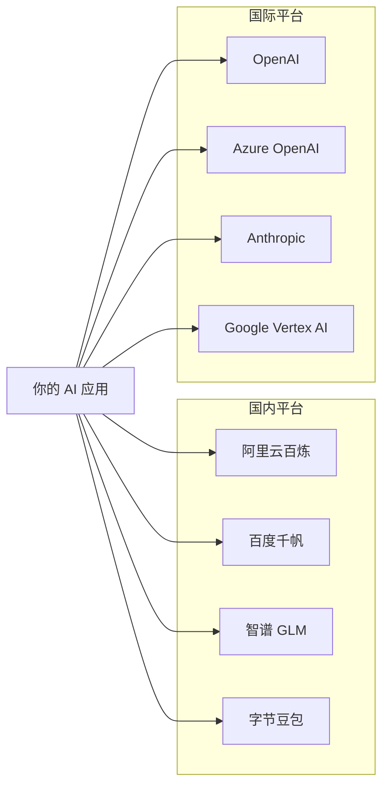
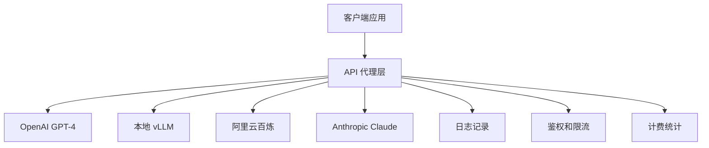
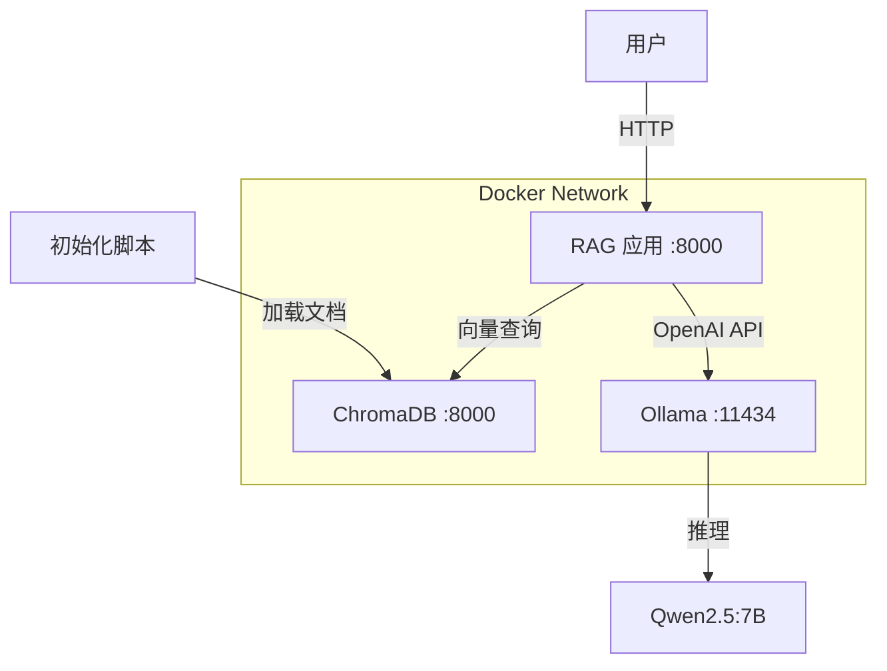
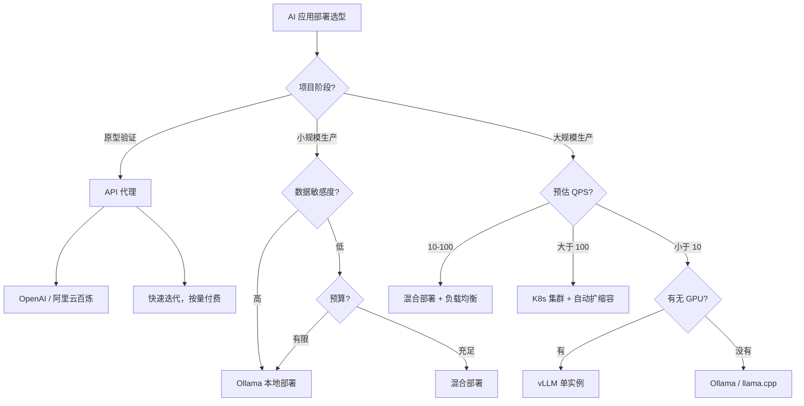

# 部署方案

AI 应用从原型到生产，部署是必须跨过的最后一道坎。本章将系统讲解 AI 应用的各种部署模式、工具链和最佳实践。

## 部署模式全景



### 三种部署模式对比

| 维度 | API 代理 | 本地部署 | 混合部署 |
|------|---------|---------|---------|
| **初始成本** | 低（按量付费） | 高（需 GPU 服务器） | 中等 |
| **运维复杂度** | 低 | 高 | 中等 |
| **数据隐私** | 数据离开本地 | 数据完全本地 | 核心数据本地 |
| **延迟** | 网络依赖 50-300ms | 本地推理 10-100ms | 按路由决定 |
| **可扩展性** | 弹性扩展 | 受限于硬件 | 灵活扩展 |
| **适用场景** | 快速验证、低流量 | 敏感数据、高并发 | 生产环境 |

### 什么时候选什么？



:::tip 选型原则
- **个人项目 / 验证阶段**：API 代理，快速迭代
- **企业内部 / 数据敏感**：本地部署，数据不出域
- **生产环境 / 大规模**：混合部署，核心自建 + 长尾调云端
- **边缘设备 / IoT**：llama.cpp，CPU 推理
:::

---

## 本地部署大模型

### Ollama —— 最简单的本地部署方案

#### 安装

```bash
# macOS（Homebrew）
brew install ollama

# Linux（一键脚本）
curl -fsSL https://ollama.ai/install.sh | sh

# Windows：下载安装包 https://ollama.ai/download
```

启动服务：

```bash
ollama serve
# time=2025-01-15T10:30:00.000+08:00 level=INFO msg="Ollama server is running"
# time=2025-01-15T10:30:00.001+08:00 level=INFO msg="Listening on 127.0.0.1:11434"
```

#### 模型管理

```bash
# 拉取模型
ollama pull qwen2.5:7b
# pulling manifest...
# success

# 查看已安装的模型
ollama list
# NAME            ID              SIZE      MODIFIED
# qwen2.5:7b      a6b2...c8d1     4.7 GB    2 hours ago

# 运行模型（交互式聊天）
ollama run qwen2.5:7b
# >>> 你好，请介绍一下你自己
# 你好！我是一个大语言模型，基于 Qwen2.5 架构训练...

# 删除模型
ollama rm llama3.1:8b
```

:::tip 模型选择建议
- **7B-8B 级别**：适合日常对话、代码辅助，MacBook Pro M 系列芯片即可流畅运行
- **13B-14B 级别**：质量明显提升，需要 16GB+ 内存
- **32B+ 级别**：接近 GPT-3.5 水平，需要 32GB+ 内存或 GPU
:::

#### OpenAI 兼容 API

Ollama 原生兼容 OpenAI API 格式，代码几乎不需要改动就能切换。

```python
# ollama_openai_compat.py
from openai import OpenAI

# 只需要改 base_url，代码完全不变
client = OpenAI(
    base_url="http://localhost:11434/v1",
    api_key="ollama"  # Ollama 不需要真实 key，随便填
)

response = client.chat.completions.create(
    model="qwen2.5:7b",
    messages=[
        {"role": "system", "content": "你是一个有帮助的助手。"},
        {"role": "user", "content": "用一句话解释什么是 Docker。"}
    ],
    temperature=0.7,
    max_tokens=200
)

print(response.choices[0].message.content)
```

运行结果：

```
$ python ollama_openai_compat.py
Docker 是一个容器化平台，它把应用和它的依赖打包到一个轻量级、
可移植的容器中，让你可以在任何环境中一致地运行应用。
```

#### 流式输出

```python
# ollama_streaming.py
from openai import OpenAI

client = OpenAI(
    base_url="http://localhost:11434/v1",
    api_key="ollama"
)

stream = client.chat.completions.create(
    model="qwen2.5:7b",
    messages=[{"role": "user", "content": "写一首关于编程的短诗"}],
    stream=True
)

for chunk in stream:
    if chunk.choices[0].delta.content:
        print(chunk.choices[0].delta.content, end="", flush=True)
print()
```

运行结果：

```
$ python ollama_streaming.py
代码如诗行行写，
逻辑如歌段段连。
Bug 是那不和谐的音符，
Debug 是那美妙的和弦。
```

#### 模型自定义（Modelfile）

```dockerfile
# Modelfile
FROM qwen2.5:7b

# 设置系统提示词
SYSTEM """你是一个 Java 技术专家，专门回答 Spring Boot 相关问题。
回答要简洁、准确，附带代码示例。"""

# 调整参数
PARAMETER temperature 0.3
PARAMETER top_p 0.9
PARAMETER num_ctx 8192
```

```bash
ollama create java-expert -f Modelfile
# transferring model data...
# success

ollama run java-expert "Spring Boot 怎么配置数据源？"
```

---

### vLLM —— 高性能推理服务器

vLLM 是伯克利大学开发的 LLM 推理引擎，核心创新是 PagedAttention 技术，大幅提升 GPU 利用率和推理吞吐量。

#### 安装与启动

```bash
# 需要 NVIDIA GPU + CUDA
pip install vllm
python -c "import vllm; print(vllm.__version__)"
# 输出：0.6.0
```

:::warning 硬件要求
vLLM 需要 NVIDIA GPU（支持 CUDA）。没有 NVIDIA GPU 请用 Ollama 或 llama.cpp。
- 最低要求：1 张 GPU，16GB+ 显存
- 推荐：A100 40GB/80GB 或 A10G 24GB
:::

```bash
# 启动 OpenAI 兼容的 API 服务
python -m vllm.entrypoints.openai.api_server \
    --model Qwen/Qwen2.5-7B-Instruct \
    --tensor-parallel-size 1 \
    --gpu-memory-utilization 0.9 \
    --max-model-len 8192 \
    --port 8000
```

输出：

```
INFO:     Started server process [12345]
INFO:     Application startup complete.
INFO:     Uvicorn running on http://0.0.0.0:8000
INFO:     Loading model 'Qwen/Qwen2.5-7B-Instruct'...
INFO:     Model loaded successfully in 32.5s
```

#### 关键参数调优

| 参数 | 说明 | 推荐值 |
|------|------|--------|
| `--tensor-parallel-size` | GPU 张量并行数 | 单卡=1，多卡=卡数 |
| `--gpu-memory-utilization` | GPU 显存使用率 | 0.85-0.95 |
| `--max-model-len` | 最大上下文长度 | 根据模型和显存决定 |
| `--enable-prefix-caching` | 启用前缀缓存 | RAG 场景强烈推荐 |
| `--trust-remote-code` | 信任远程代码 | HuggingFace 模型需要 |

#### 性能测试

```python
# benchmark_vllm.py
import time
from openai import OpenAI

client = OpenAI(base_url="http://localhost:8000/v1", api_key="token-not-needed")

# 预热
client.chat.completions.create(
    model="Qwen/Qwen2.5-7B-Instruct",
    messages=[{"role": "user", "content": "hello"}],
    max_tokens=10
)

# 性能测试
prompt = "请详细解释微服务架构的核心概念，包括服务发现、负载均衡等组件。"
start = time.time()
response = client.chat.completions.create(
    model="Qwen/Qwen2.5-7B-Instruct",
    messages=[{"role": "user", "content": prompt}],
    max_tokens=500,
    temperature=0.7
)
elapsed = time.time() - start

print(f"输入 Token 数: {response.usage.prompt_tokens}")
print(f"生成 Token 数: {response.usage.completion_tokens}")
print(f"总耗时: {elapsed:.2f}s")
print(f"吞吐量: {response.usage.completion_tokens / elapsed:.1f} tokens/s")
```

运行结果：

```
$ python benchmark_vllm.py
输入 Token 数: 35
生成 Token 数: 487
总耗时: 5.23s
吞吐量: 93.1 tokens/s
```

:::tip vLLM vs Ollama 性能
- vLLM 吞吐量通常是 Ollama 的 **2-5 倍**（得益于 PagedAttention 和连续批处理）
- Ollama 更适合单用户交互场景，vLLM 适合多用户并发
- 两者都兼容 OpenAI API 格式，代码层面可以无缝切换
:::

---

### llama.cpp —— CPU 推理的轻量方案

llama.cpp 用 C/C++ 实现了大模型推理，支持 CPU、GPU 混合推理，特别适合没有独立 GPU 的边缘设备。

#### 安装与运行

```bash
# 克隆并编译
git clone https://github.com/ggerganov/llama.cpp.git
cd llama.cpp && make

# 下载 GGUF 格式的模型（Q4 量化，约 4GB）
wget https://huggingface.co/Qwen/Qwen2.5-7B-Instruct-GGUF/\
resolve/main/qwen2.5-7b-instruct-q4_k_m.gguf

# 命令行交互（纯 CPU，-ngl 0 表示不使用 GPU）
./llama-cli -m qwen2.5-7b-instruct-q4_k_m.gguf \
    -c 2048 -n 512 -ngl 0 \
    --prompt "你好，请介绍一下你自己"
```

输出：

```
llm_load_tensors: ggml ctx size =    0.17 MiB
llm_load_tensors: CPU buffer size = 4058.80 MiB
...
你好！我是一个基于 Qwen2.5 架构训练的大语言模型，
擅长中英文对话、知识问答和文本生成。
```

#### Python 调用

```python
# llama_cpp_demo.py
from llama_cpp import Llama

llm = Llama(
    model_path="qwen2.5-7b-instruct-q4_k_m.gguf",
    n_ctx=2048,
    n_gpu_layers=0,   # 0 = 纯 CPU 推理
    verbose=False
)

response = llm.create_chat_completion(
    messages=[
        {"role": "system", "content": "你是一个有帮助的助手。"},
        {"role": "user", "content": "解释一下什么是向量数据库？"}
    ],
    max_tokens=300,
    temperature=0.7
)

print(response["choices"][0]["message"]["content"])
```

运行结果：

```
$ python llama_cpp_demo.py
向量数据库是一种专门用于存储和查询高维向量数据的数据库系统。

与传统关系型数据库的区别：
1. 数据结构：传统数据库存储结构化数据（行和列），向量数据库存储高维向量
2. 查询方式：传统数据库用 SQL 精确查询，向量数据库用相似度搜索
3. 应用场景：向量数据库主要用于 AI/ML 场景，如语义搜索、RAG 等
4. 索引方式：传统数据库用 B+Tree 索引，向量数据库用 HNSW、IVF 等索引
```

#### 量化级别对比

| 量化级别 | 模型大小（7B） | 质量损失 | 适用场景 |
|---------|---------------|---------|---------|
| Q8_0 | ~7.7 GB | 几乎无损 | 质量优先 |
| Q5_K_M | ~5.1 GB | 轻微 | 平衡 |
| Q4_K_M | ~4.1 GB | 轻微 | **推荐** |
| Q3_K_M | ~3.3 GB | 明显 | 资源受限 |

:::tip 三工具对比总结
- **Ollama**：日常开发首选，一条命令搞定，生态丰富
- **vLLM**：生产环境首选，吞吐量最高，适合高并发
- **llama.cpp**：边缘设备首选，纯 CPU 也能跑，部署灵活
:::

---

## 云端部署

### 模型即服务（MaaS）



#### 阿里云百炼示例

```python
# aliyu_bailian.py
from openai import OpenAI

client = OpenAI(
    base_url="https://dashscope.aliyuncs.com/compatible-mode/v1",
    api_key="sk-your-dashscope-api-key"
)

response = client.chat.completions.create(
    model="qwen-plus",
    messages=[
        {"role": "system", "content": "你是一个 Java 技术专家。"},
        {"role": "user", "content": "Spring Boot 3 有哪些新特性？"}
    ]
)

print(response.choices[0].message.content)
```

运行结果：

```
$ python aliyu_bailian.py
Spring Boot 3 的主要新特性：
1. 最低要求 Java 17
2. 迁移到 Jakarta EE 9+（javax.* -> jakarta.*）
3. 原生支持 GraalVM Native Image
4. 新的 AOT 编译支持
5. 可观测性增强（Micrometer Observation API）
6. 虚拟线程（Virtual Threads）支持
```

### 自建推理服务（Kubernetes）

```yaml
# k8s-vllm-deployment.yaml
apiVersion: apps/v1
kind: Deployment
metadata:
  name: vllm-inference
  namespace: ai-platform
spec:
  replicas: 2
  selector:
    matchLabels:
      app: vllm-inference
  template:
    metadata:
      labels:
        app: vllm-inference
    spec:
      containers:
        - name: vllm
          image: vllm/vllm-openai:v0.6.0
          ports:
            - containerPort: 8000
          resources:
            limits:
              nvidia.com/gpu: 1
              memory: "32Gi"
          args:
            - "--model"
            - "Qwen/Qwen2.5-7B-Instruct"
            - "--gpu-memory-utilization"
            - "0.9"
---
apiVersion: v1
kind: Service
metadata:
  name: vllm-service
  namespace: ai-platform
spec:
  selector:
    app: vllm-inference
  ports:
    - port: 8000
      targetPort: 8000
  type: ClusterIP
```

---

## API 代理层

在生产环境中，需要一个统一的 API 代理层来管理多个模型提供商、统一鉴权、记录日志和控制成本。



### LiteLLM —— 轻量级代理

```bash
pip install litellm[proxy]
```

```yaml
# litellm_config.yaml
model_list:
  - model_name: gpt-4
    litellm_params:
      model: openai/gpt-4
      api_key: os.environ/OPENAI_API_KEY
  - model_name: qwen
    litellm_params:
      model: openai/qwen-plus
      api_base: https://dashscope.aliyuncs.com/compatible-mode/v1
      api_key: os.environ/DASHSCOPE_API_KEY
  - model_name: local
    litellm_params:
      model: openai/qwen2.5:7b
      api_base: http://localhost:11434/v1

general_settings:
  master_key: sk-litellm-master-key-12345
```

```bash
litellm --config litellm_config.yaml --port 4000
```

```python
# 通过 LiteLLM 代理调用
from openai import OpenAI

client = OpenAI(
    base_url="http://localhost:4000",
    api_key="sk-litellm-master-key-12345"
)

# 所有模型用同一个接口调用
response = client.chat.completions.create(
    model="qwen",  # 自动路由到阿里云
    messages=[{"role": "user", "content": "你好"}]
)
print(response.choices[0].message.content)
# 输出：你好！我是通义千问，有什么可以帮你的吗？
```

---

## Docker 部署

### Ollama Docker 化

```yaml
# docker-compose.ollama.yml
version: '3.8'

services:
  ollama:
    image: ollama/ollama:latest
    container_name: ollama
    ports:
      - "11434:11434"
    volumes:
      - ollama_data:/root/.ollama
    deploy:
      resources:
        reservations:
          devices:
            - driver: nvidia
              count: 1
              capabilities: [gpu]
    restart: unless-stopped

volumes:
  ollama_data:
```

```bash
docker compose -f docker-compose.ollama.yml up -d
docker exec -it ollama ollama pull qwen2.5:7b
curl http://localhost:11434/api/tags
# {"models":[{"name":"qwen2.5:7b",...}]}
```

---

## 实战：Docker Compose 一键部署完整 RAG 应用

### 项目结构

```
rag-deploy/
├── docker-compose.yml
├── app/
│   ├── Dockerfile
│   ├── requirements.txt
│   └── main.py
├── init-data/
│   └── load_documents.py
└── .env
```

### 应用代码

```python
# app/main.py
import os
import time
import logging
from fastapi import FastAPI, HTTPException
from fastapi.middleware.cors import CORSMiddleware
from openai import OpenAI
from pydantic import BaseModel
import chromadb

logging.basicConfig(level=logging.INFO)
logger = logging.getLogger(__name__)

app = FastAPI(title="RAG API", version="1.0.0")
app.add_middleware(
    CORSMiddleware,
    allow_origins=["*"],
    allow_methods=["*"],
    allow_headers=["*"],
)

ollama_url = os.getenv("OLLAMA_URL", "http://ollama:11434/v1")
client = OpenAI(base_url=ollama_url, api_key="ollama")

# 初始化 ChromaDB（带重试）
chroma_host = os.getenv("CHROMA_HOST", "chromadb")
chroma_port = int(os.getenv("CHROMA_PORT", "8000"))

def get_chroma():
    for attempt in range(10):
        try:
            c = chromadb.HttpClient(host=chroma_host, port=chroma_port)
            c.heartbeat()
            return c
        except Exception as e:
            logger.warning(f"ChromaDB 重连 {attempt+1}/10: {e}")
            time.sleep(3)
    raise HTTPException(503, "ChromaDB 不可用")

chroma = get_chroma()
collection = chroma.get_or_create_collection("rag_docs")


class QueryRequest(BaseModel):
    question: str
    top_k: int = 3

class QueryResponse(BaseModel):
    answer: str
    sources: list[str]
    tokens_used: dict


@app.get("/health")
async def health():
    return {"status": "healthy", "ollama": ollama_url}


@app.post("/query", response_model=QueryResponse)
async def query(req: QueryRequest):
    logger.info(f"收到查询: {req.question}")

    # 1. 向量检索
    results = collection.query(
        query_texts=[req.question],
        n_results=req.top_k
    )
    sources = results["documents"][0] if results["documents"] else []
    logger.info(f"检索到 {len(sources)} 条相关文档")

    # 2. 构建 Prompt
    context = "\n\n".join(
        [f"[文档{i+1}] {s}" for i, s in enumerate(sources)]
    )
    system_prompt = f"""根据以下参考文档回答问题。
如果文档中没有相关信息，请如实告知。

参考文档：
{context}

要求：基于文档回答，不要编造，引用来源。"""

    # 3. 调用 LLM
    start = time.time()
    resp = client.chat.completions.create(
        model="qwen2.5:7b",
        messages=[
            {"role": "system", "content": system_prompt},
            {"role": "user", "content": req.question}
        ],
        temperature=0.3,
        max_tokens=1000
    )
    elapsed = time.time() - start

    answer = resp.choices[0].message.content
    tokens = {
        "prompt": resp.usage.prompt_tokens,
        "completion": resp.usage.completion_tokens,
        "total": resp.usage.total_tokens
    }
    logger.info(f"完成，耗时 {elapsed:.2f}s，Token: {tokens}")

    return QueryResponse(answer=answer, sources=sources, tokens_used=tokens)
```

```
# app/requirements.txt
fastapi==0.115.0
uvicorn==0.30.0
openai==1.50.0
chromadb==0.5.0
pydantic==2.9.0
```

```dockerfile
# app/Dockerfile
FROM python:3.11-slim
WORKDIR /app
RUN apt-get update && apt-get install -y --no-install-recommends \
    build-essential curl && rm -rf /var/lib/apt/lists/*
COPY requirements.txt .
RUN pip install --no-cache-dir -r requirements.txt
COPY main.py .
EXPOSE 8000
HEALTHCHECK --interval=30s --timeout=10s --retries=3 \
    CMD curl -f http://localhost:8000/health || exit 1
CMD ["uvicorn", "main:app", "--host", "0.0.0.0", "--port", "8000"]
```

### 数据初始化

```python
# init-data/load_documents.py
"""初始化 RAG 知识库"""
import chromadb, time

for i in range(10):
    try:
        client = chromadb.HttpClient(host="localhost", port=8000)
        client.heartbeat()
        print("ChromaDB 连接成功")
        break
    except Exception:
        print(f"等待 ChromaDB... ({i+1}/10)")
        time.sleep(3)

col = client.get_or_create_collection("rag_docs")

docs = [
    "Spring Boot Actuator 提供了生产级监控端点。"
    "通过 /actuator/health 查看健康状态，/actuator/metrics 查看指标。"
    "默认只暴露 health，通过 management.endpoints.web.exposure.include 配置。"
    "支持集成 Prometheus、Grafana 进行可视化监控。",

    "Docker Compose 是定义和运行多容器应用的工具。"
    "通过 docker-compose.yml 定义服务、网络和卷。"
    "常用命令：docker compose up -d（后台启动）、docker compose down（停止删除）。"
    "支持 depends_on 定义依赖顺序，healthcheck 定义健康检查。",

    "向量数据库是 AI 应用的核心组件，用于存储和检索文本向量。"
    "Chroma 轻量适合开发测试，Milvus 生产级支持分布式。"
    "常用索引 HNSW 算法，提供高召回率。",

    "RAG（Retrieval-Augmented Generation）结合检索和生成。"
    "流程：用户提问 -> 文档检索 -> 上下文传给 LLM -> 生成回答。"
    "优势：减少幻觉、知识实时更新、可溯源。"
    "优化手段：分块策略、混合检索、Reranker 重排序。",

    "vLLM 是伯克利大学开发的 LLM 推理引擎，核心 PagedAttention。"
    "类似操作系统虚拟内存管理 GPU 显存，减少碎片。"
    "支持连续批处理，多个请求共享 KV Cache。"
    "OpenAI 兼容 API，适合生产环境高并发部署。",
]

ids = [f"doc-{str(i).zfill(3)}" for i in range(len(docs))]
metadatas = [{"source": "knowledge-base"} for _ in docs]

col.add(documents=docs, ids=ids, metadatas=metadatas)
print(f"已加载 {len(docs)} 条文档到知识库")
```

### Docker Compose 编排

```yaml
# docker-compose.yml
version: '3.8'

services:
  # 向量数据库
  chromadb:
    image: chromadb/chroma:latest
    container_name: rag-chromadb
    ports:
      - "8001:8000"
    volumes:
      - chroma_data:/chroma/chroma
    environment:
      - IS_PERSISTENT=TRUE
      - ANONYMIZED_TELEMETRY=FALSE
    restart: unless-stopped

  # 模型服务
  ollama:
    image: ollama/ollama:latest
    container_name: rag-ollama
    ports:
      - "11434:11434"
    volumes:
      - ollama_data:/root/.ollama
    restart: unless-stopped

  # 数据初始化
  init-data:
    build: ./init-data
    container_name: rag-init
    depends_on:
      chromadb:
        condition: service_started
    volumes:
      - ./init-data:/app
    entrypoint: ["python", "load_documents.py"]

  # RAG 应用
  rag-app:
    build: ./app
    container_name: rag-app
    ports:
      - "8000:8000"
    environment:
      - OLLAMA_URL=http://ollama:11434/v1
      - CHROMA_HOST=chromadb
      - CHROMA_PORT=8000
    depends_on:
      chromadb:
        condition: service_started
      ollama:
        condition: service_started
    restart: unless-stopped

volumes:
  chroma_data:
  ollama_data:
```

```dockerfile
# init-data/Dockerfile
FROM python:3.11-slim
WORKDIR /app
RUN pip install --no-cache-dir chromadb
COPY load_documents.py .
```

### 启动与测试

```bash
# 1. 启动所有服务
docker compose up -d

# 2. 拉取模型（首次运行需要）
docker exec rag-ollama ollama pull qwen2.5:7b

# 3. 等待服务就绪
docker compose ps
# NAME            STATUS          PORTS
# rag-chromadb    Up              0.0.0.0:8001->8000/tcp
# rag-ollama      Up              0.0.0.0:11434->11434/tcp
# rag-app         Up              0.0.0.0:8000->8000/tcp

# 4. 健康检查
curl http://localhost:8000/health
# {"status":"healthy","ollama":"http://ollama:11434/v1"}

# 5. 测试 RAG 查询
curl -X POST http://localhost:8000/query \
  -H "Content-Type: application/json" \
  -d '{"question": "什么是 RAG？它有什么优势？"}'
```

测试结果：

```json
{
  "answer": "RAG（Retrieval-Augmented Generation）是一种结合检索和生成的技术架构。\n\n它的基本流程是：用户提问 -> 文档检索 -> 将检索结果作为上下文传给 LLM -> 生成回答。\n\nRAG 的优势包括：\n1. 减少幻觉：基于真实文档回答，减少模型编造\n2. 知识实时更新：文档库更新即可获取最新知识\n3. 可溯源：回答基于具体文档，可以追溯来源\n\n常见优化手段包括文档分块策略优化、混合检索（向量+关键词）、Reranker 重排序等。",
  "sources": [
    "RAG（Retrieval-Augmented Generation）结合检索和生成。流程：用户提问 -> 文档检索 -> 上下文传给 LLM -> 生成回答。优势：减少幻觉、知识实时更新、可溯源。优化手段：分块策略、混合检索、Reranker 重排序。"
  ],
  "tokens_used": {
    "prompt": 85,
    "completion": 156,
    "total": 241
  }
}
```

### 架构图



:::tip 生产环境增强
- 在 RAG 应用前加 Nginx 反向代理，配置 HTTPS 和限流
- 使用 Docker volumes 做持久化，避免容器重启数据丢失
- 配置 log 日志驱动收集日志到 ELK 或 Loki
- 使用 GPU 监控（nvidia-smi + Prometheus exporter）
- 配置自动扩缩容（K8s HPA）
:::

---

## 部署选型决策树

把前面所有内容汇总成一个完整的决策指南：



### 部署成本参考

| 方案 | 月成本估算 | 适用规模 |
|------|----------|---------|
| API 代理（OpenAI） | ¥500-5000 | 0-10 QPS |
| API 代理（阿里云百炼） | ¥200-2000 | 0-10 QPS |
| Ollama 单机 | ¥3000-8000（GPU 服务器） | 1-5 QPS |
| vLLM 单机（A100） | ¥8000-15000 | 10-50 QPS |
| K8s 集群（3节点） | ¥30000-60000 | 50-200 QPS |

:::warning 成本提示
以上成本仅供参考，实际成本取决于模型大小、上下文长度、并发量等因素。建议先用 API 代理验证需求，再根据实际 QPS 评估自建方案。
:::

---

## 总结

本章覆盖了 AI 应用部署的核心知识：

1. **部署模式**：API 代理、本地部署、混合部署各有优劣，按需选择
2. **本地部署**：Ollama 最简单、vLLM 最快、llama.cpp 最轻量
3. **云端部署**：MaaS 省心、自建可控，K8s 是大规模标配
4. **API 代理层**：LiteLLM 统一接口、负载均衡、日志计费
5. **Docker 部署**：容器化是标准方案，docker-compose 一键编排

:::tip 核心原则
- **先跑通再优化**：先用最简单的方案（API 代理）验证业务逻辑
- **数据驱动决策**：根据实际 QPS 和延迟需求选择部署方案
- **兼容性优先**：所有代码基于 OpenAI API 格式，方便切换后端
- **容器化一切**：Docker + Compose 是部署的基础设施
:::

---

## 练习题

### 题目 1：部署模式选择

你正在为一家医院开发 AI 辅助诊断系统，需要处理患者病历数据。请分析应该选择哪种部署模式，说明理由，并列出至少 3 个需要考虑的因素。

### 题目 2：Ollama 实践

使用 Ollama 安装 Qwen2.5:7b 模型，通过 OpenAI 兼容 API 实现一个简单的翻译服务（中文翻译成英文）。要求支持流式输出，并统计每次翻译的 Token 消耗。

### 题目 3：性能对比

查阅文档，对比 Ollama 和 vLLM 在以下场景下的表现：
- 单用户对话（低并发）
- 多用户并发（高并发）
- RAG 场景（长上下文）

分别给出推荐方案和理由。

### 题目 4：Docker Compose 设计

设计一个包含以下组件的 docker-compose.yml：
- FastAPI 应用（RAG 服务）
- ChromaDB（向量数据库）
- Redis（缓存层）
- Nginx（反向代理）
- Ollama（模型服务）

要求包含健康检查、服务依赖、数据持久化配置。

### 题目 5：API 代理层设计

假设你的 AI 应用需要同时使用以下模型：
- OpenAI GPT-4o（复杂推理任务）
- 阿里云 qwen-plus（一般对话）
- 本地 Ollama Qwen2.5:7b（简单任务 + 降级备用）

使用 LiteLLM 配置一个代理层，实现：负载均衡、降级策略、成本优化（简单任务优先走本地）。

### 题目 6：成本分析

某 AI 应用的使用情况如下：
- 日均请求量：5000 次
- 平均输入 Token：500
- 平均输出 Token：300
- 使用 OpenAI GPT-4o（输入 $2.5/1M tokens，输出 $10/1M tokens）

请计算：
1. 每日 Token 消耗量
2. 每日 API 调用成本
3. 如果切换到自建 vLLM（GPU 服务器 ¥8000/月），需要达到多少 QPS 才能回本？
