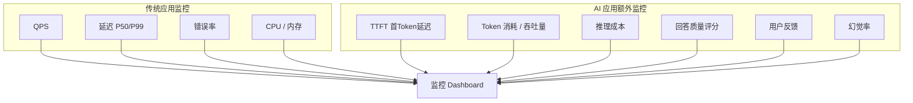
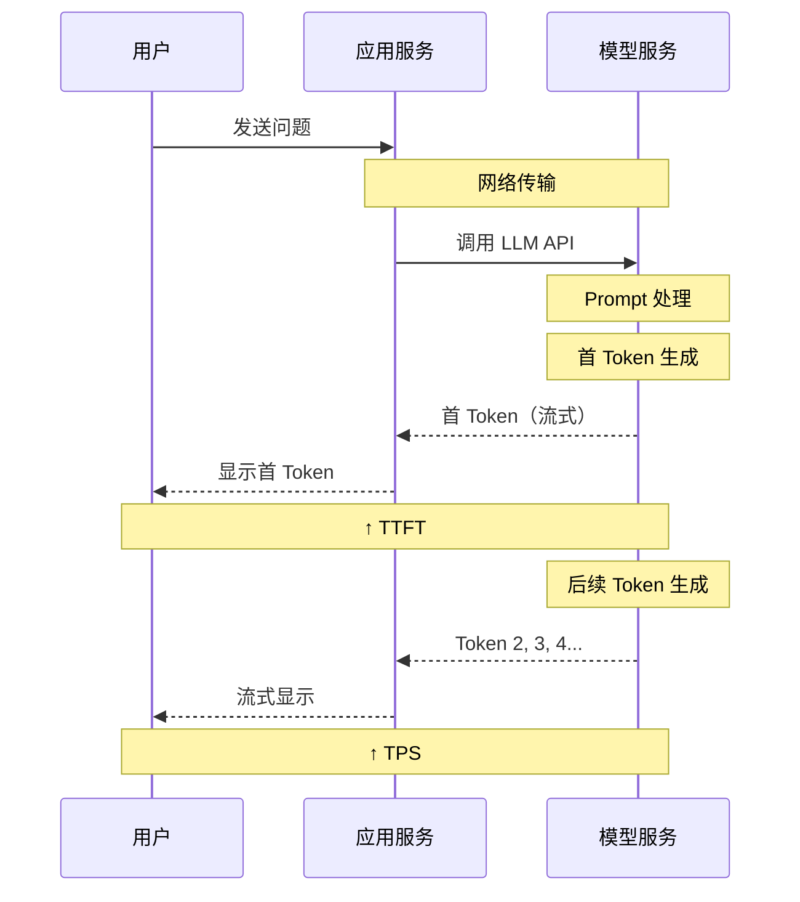
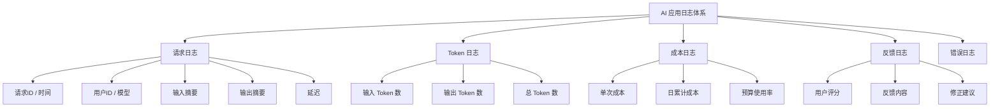
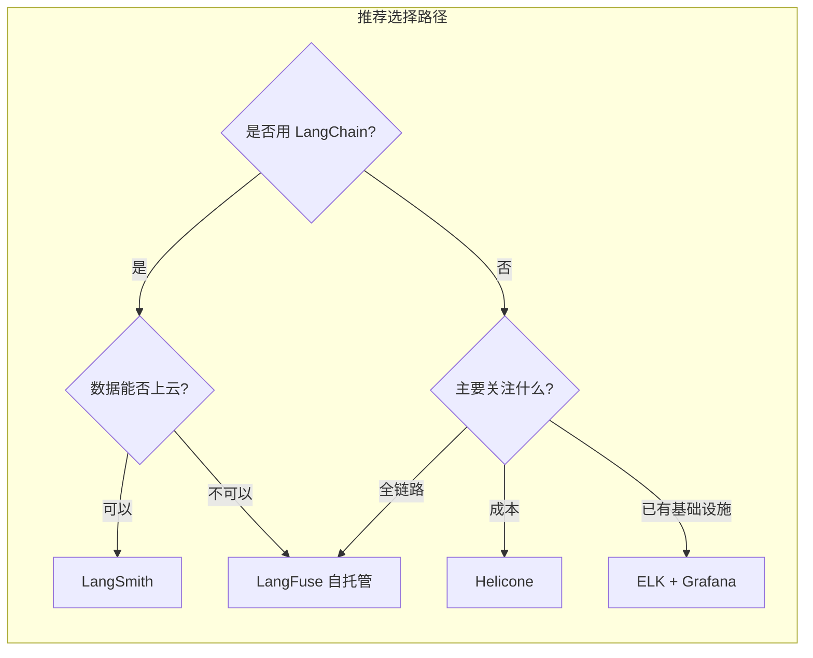
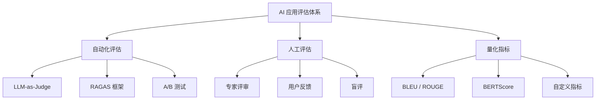
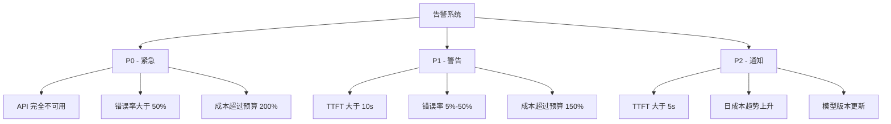
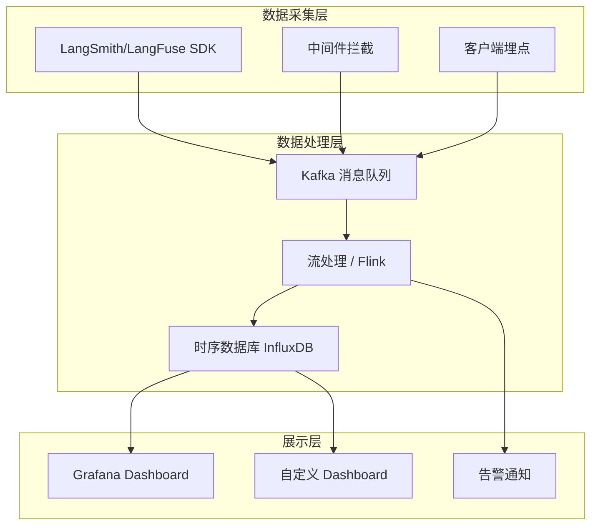

# 监控与评估

AI 应用上线只是开始，不是结束。没有监控的应用就像没有仪表盘的汽车——你不知道它跑得快不快、有没有出问题、油费花了多少。本章将建立一套完整的 AI 应用监控与评估体系，让你对应用的运行状态了如指掌。

## 为什么 AI 应用监控不一样？

传统 Web 应用的监控主要关注 QPS、延迟、错误率。AI 应用除此之外，还需要关注模型特有的指标：Token 消耗、推理质量、用户满意度等。



:::tip AI 监控的核心挑战
1. **质量难以量化**：回答好不好，不像 HTTP 状态码那样明确
2. **成本不可预测**：Token 消耗随输入长度变化，难以精确预估
3. **延迟波动大**：不同 prompt 长度和模型，延迟差异显著
4. **幻觉难以检测**：模型编造的内容不容易自动识别
:::

---

## 监控指标体系

### 核心指标一览

| 类别 | 指标 | 说明 | 告警阈值示例 |
|------|------|------|------------|
| **性能** | TTFT | 首 Token 延迟（Time To First Token） | > 5s |
| **性能** | TPS | 每秒 Token 生成数 | < 10 tokens/s |
| **性能** | E2E 延迟 | 端到端响应时间 | > 30s |
| **成本** | Token 消耗 | 输入 + 输出 Token 数 | 日均 > 预算 120% |
| **成本** | 单次成本 | 每次请求的 API 费用 | > $0.5/次 |
| **质量** | 幻觉率 | 回答中包含错误信息的比例 | > 10% |
| **质量** | 相关性评分 | 回答与问题的相关程度 | < 0.7 |
| **可靠性** | 错误率 | API 调用失败比例 | > 5% |
| **可靠性** | 超时率 | 请求超时比例 | > 2% |
| **用户** | 满意度 | 用户点赞/踩的比例 | 踩 > 20% |
| **用户** | 反馈率 | 提供反馈的用户比例 | < 5%（可能说明功能没用） |

### 指标详解

#### TTFT（Time To First Token）

TTFT 是用户感知最直接的延迟指标。用户发出请求后，多久能看到第一个字。



```python
# measure_ttft.py
import time
from openai import OpenAI

client = OpenAI(base_url="http://localhost:11434/v1", api_key="ollama")

# 测量 TTFT
start_time = time.time()
first_token_time = None
token_count = 0

stream = client.chat.completions.create(
    model="qwen2.5:7b",
    messages=[{"role": "user", "content": "解释一下什么是微服务架构"}],
    stream=True
)

for chunk in stream:
    if chunk.choices[0].delta.content:
        if first_token_time is None:
            first_token_time = time.time()
        token_count += 1

total_time = time.time() - start_time
ttft = first_token_time - start_time
tps = token_count / (total_time - ttft) if (total_time - ttft) > 0 else 0

print(f"TTFT（首 Token 延迟）: {ttft*1000:.0f} ms")
print(f"生成 Token 数: {token_count}")
print(f"总耗时: {total_time:.2f} s")
print(f"TPS（每秒 Token 数）: {tps:.1f}")
```

运行结果：

```
$ python measure_ttft.py
TTFT（首 Token 延迟）: 320 ms
生成 Token 数: 256
总耗时: 4.85 s
TPS（每秒 Token 数）: 59.0
```

#### Token 消耗与成本追踪

```python
# token_tracker.py
"""Token 消耗和成本追踪器"""
import time
from dataclasses import dataclass, field
from datetime import datetime
from typing import Optional
import json


@dataclass
class UsageRecord:
    """单次 API 调用记录"""
    timestamp: str
    model: str
    prompt_tokens: int
    completion_tokens: int
    total_tokens: int
    latency_ms: float
    cost_usd: float
    user_id: Optional[str] = None
    request_type: Optional[str] = None  # chat / embedding / rerank


# 各模型的定价（每百万 Token）
MODEL_PRICING = {
    # OpenAI
    "gpt-4o": {"input": 2.5, "output": 10.0},
    "gpt-4o-mini": {"input": 0.15, "output": 0.6},
    "gpt-3.5-turbo": {"input": 0.5, "output": 1.5},
    # 阿里云百炼
    "qwen-plus": {"input": 0.8, "output": 2.0},
    "qwen-turbo": {"input": 0.3, "output": 0.6},
    # 本地模型
    "qwen2.5:7b": {"input": 0.0, "output": 0.0},
}


class TokenTracker:
    """Token 追踪器"""
    
    def __init__(self, budget_daily_usd: float = 100.0):
        self.records: list[UsageRecord] = []
        self.budget_daily = budget_daily_usd
    
    def record(
        self,
        model: str,
        prompt_tokens: int,
        completion_tokens: int,
        latency_ms: float,
        user_id: str = None,
        request_type: str = "chat"
    ) -> UsageRecord:
        total_tokens = prompt_tokens + completion_tokens
        pricing = MODEL_PRICING.get(model, {"input": 0, "output": 0})
        cost = (
            prompt_tokens * pricing["input"] / 1_000_000 +
            completion_tokens * pricing["output"] / 1_000_000
        )
        
        record = UsageRecord(
            timestamp=datetime.now().isoformat(),
            model=model,
            prompt_tokens=prompt_tokens,
            completion_tokens=completion_tokens,
            total_tokens=total_tokens,
            latency_ms=latency_ms,
            cost_usd=cost,
            user_id=user_id,
            request_type=request_type
        )
        self.records.append(record)
        return record
    
    def get_daily_summary(self) -> dict:
        """获取当日汇总"""
        today = datetime.now().strftime("%Y-%m-%d")
        today_records = [
            r for r in self.records
            if r.timestamp.startswith(today)
        ]
        
        total_tokens = sum(r.total_tokens for r in today_records)
        total_cost = sum(r.cost_usd for r in today_records)
        avg_latency = (
            sum(r.latency_ms for r in today_records) / len(today_records)
            if today_records else 0
        )
        
        return {
            "date": today,
            "total_requests": len(today_records),
            "total_tokens": total_tokens,
            "total_cost_usd": total_cost,
            "budget_remaining": self.budget_daily - total_cost,
            "budget_usage_pct": total_cost / self.budget_daily * 100,
            "avg_latency_ms": round(avg_latency, 1),
            "by_model": self._group_by_model(today_records)
        }
    
    def _group_by_model(self, records: list[UsageRecord]) -> dict:
        groups = {}
        for r in records:
            if r.model not in groups:
                groups[r.model] = {"count": 0, "tokens": 0, "cost": 0}
            groups[r.model]["count"] += 1
            groups[r.model]["tokens"] += r.total_tokens
            groups[r.model]["cost"] += r.cost_usd
        return groups


# 使用示例
if __name__ == "__main__":
    tracker = TokenTracker(budget_daily_usd=50.0)
    
    # 模拟几条记录
    tracker.record("gpt-4o", 500, 300, 2500, user_id="user-001")
    tracker.record("gpt-4o", 800, 500, 3800, user_id="user-002")
    tracker.record("qwen-plus", 300, 200, 1200, user_id="user-001")
    tracker.record("gpt-4o-mini", 200, 150, 800, user_id="user-003")
    tracker.record("gpt-4o", 1000, 800, 5200, user_id="user-001")
    
    summary = tracker.get_daily_summary()
    print(json.dumps(summary, indent=2, ensure_ascii=False))
```

运行结果：

```
$ python token_tracker.py
{
  "date": "2025-01-15",
  "total_requests": 5,
  "total_tokens": 3700,
  "total_cost_usd": 0.03235,
  "budget_remaining": 49.96765,
  "budget_usage_pct": 0.0647,
  "avg_latency_ms": 2700.0,
  "by_model": {
    "gpt-4o": {
      "count": 3,
      "tokens": 2900,
      "cost": 0.03
    },
    "qwen-plus": {
      "count": 1,
      "tokens": 500,
      "cost": 0.00064
    },
    "gpt-4o-mini": {
      "count": 1,
      "tokens": 350,
      "cost": 0.00012
    }
  }
}
```

---

## 日志记录

### 日志分类



### 结构化日志实现

```python
# structured_logger.py
"""AI 应用结构化日志"""
import json
import logging
import time
from datetime import datetime
from functools import wraps
from uuid import uuid4


class AIRequestLogger:
    """AI 请求日志记录器"""
    
    def __init__(self, log_file: str = "ai_requests.log"):
        self.logger = logging.getLogger("ai_requests")
        self.logger.setLevel(logging.INFO)
        
        # 文件 Handler
        fh = logging.FileHandler(log_file, encoding="utf-8")
        fh.setFormatter(logging.Formatter("%(message)s"))
        self.logger.addHandler(fh)
        
        # 控制台 Handler
        ch = logging.StreamHandler()
        ch.setFormatter(logging.Formatter("%(message)s"))
        self.logger.addHandler(ch)
    
    def log_request(
        self,
        request_id: str,
        model: str,
        messages: list,
        response: str,
        prompt_tokens: int,
        completion_tokens: int,
        latency_ms: float,
        user_id: str = None,
        metadata: dict = None
    ):
        log_entry = {
            "timestamp": datetime.now().isoformat(),
            "level": "INFO",
            "request_id": request_id,
            "user_id": user_id,
            "model": model,
            "input_preview": str(messages[-1]["content"])[:200],
            "output_preview": response[:200],
            "prompt_tokens": prompt_tokens,
            "completion_tokens": completion_tokens,
            "total_tokens": prompt_tokens + completion_tokens,
            "latency_ms": round(latency_ms, 1),
            **(metadata or {})
        }
        self.logger.info(json.dumps(log_entry, ensure_ascii=False))
    
    def log_feedback(
        self,
        request_id: str,
        rating: int,  # 1-5
        comment: str = None
    ):
        log_entry = {
            "timestamp": datetime.now().isoformat(),
            "level": "INFO",
            "type": "user_feedback",
            "request_id": request_id,
            "rating": rating,
            "comment": comment
        }
        self.logger.info(json.dumps(log_entry, ensure_ascii=False))
    
    def log_error(
        self,
        request_id: str,
        error: str,
        model: str = None,
        user_id: str = None
    ):
        log_entry = {
            "timestamp": datetime.now().isoformat(),
            "level": "ERROR",
            "request_id": request_id,
            "model": model,
            "user_id": user_id,
            "error": str(error)
        }
        self.logger.error(json.dumps(log_entry, ensure_ascii=False))


# 使用示例
if __name__ == "__main__":
    req_logger = AIRequestLogger()
    
    req_logger.log_request(
        request_id=str(uuid4())[:8],
        model="gpt-4o",
        messages=[{"role": "user", "content": "什么是 Docker？"}],
        response="Docker 是一个容器化平台...",
        prompt_tokens=20,
        completion_tokens=50,
        latency_ms=1500.5,
        user_id="user-001",
        metadata={"request_type": "chat"}
    )
    
    req_logger.log_feedback(
        request_id="a1b2c3d4",
        rating=5,
        comment="回答很准确"
    )
    
    req_logger.log_error(
        request_id="e5f6g7h8",
        error="API rate limit exceeded",
        model="gpt-4o"
    )
```

运行结果：

```
$ python structured_logger.py
{"timestamp":"2025-01-15T10:30:00","level":"INFO","request_id":"a1b2c3d4","user_id":"user-001","model":"gpt-4o","input_preview":"什么是 Docker？","output_preview":"Docker 是一个容器化平台...","prompt_tokens":20,"completion_tokens":50,"total_tokens":70,"latency_ms":1500.5,"request_type":"chat"}
{"timestamp":"2025-01-15T10:30:01","level":"INFO","type":"user_feedback","request_id":"a1b2c3d4","rating":5,"comment":"回答很准确"}
{"timestamp":"2025-01-15T10:30:02","level":"ERROR","request_id":"e5f6g7h8","model":"gpt-4o","error":"API rate limit exceeded"}
```

---

## 可观测性工具

### 工具对比

| 工具 | 类型 | 价格 | 核心功能 | 推荐场景 |
|------|------|------|---------|---------|
| **LangSmith** | SaaS | 免费 / $100+/月 | 全链路追踪、Prompt 管理、评估 | LangChain 用户首选 |
| **LangFuse** | 开源 | 自托管免费 / 云版付费 | 全链路追踪、Prompt 版本、评估 | 需要数据私有化 |
| **Helicone** | SaaS | 免费 / $49+/月 | 成本监控、缓存、日志 | 成本控制优先 |
| **ELK + Grafana** | 自建 | 服务器成本 | 全栈可观测性 | 已有 ELK 基础设施 |



### LangSmith 接入

LangSmith 是 LangChain 官方的可观测性平台，提供 Prompt 追踪、评估、调试等功能。

```bash
pip install langsmith
```

```python
# langsmith_integration.py
import os
from openai import OpenAI
from langsmith import traceable
from langsmith.wrappers import wrap_openai

# 配置 LangSmith
os.environ["LANGCHAIN_API_KEY"] = "ls__your-api-key"
os.environ["LANGCHAIN_TRACING_V2"] = "true"
os.environ["LANGCHAIN_PROJECT"] = "rag-monitoring"

# 包装 OpenAI 客户端
client = wrap_openai(
    OpenAI(api_key="sk-your-openai-key")
)

@traceable(name="rag_query")
def rag_query(question: str):
    """带追踪的 RAG 查询"""
    # 检索阶段（会被自动追踪）
    context = retrieve_documents(question)
    
    # 生成阶段
    response = client.chat.completions.create(
        model="gpt-4o-mini",
        messages=[
            {"role": "system", "content": f"根据上下文回答：\n{context}"},
            {"role": "user", "content": question}
        ]
    )
    
    return response.choices[0].message.content


def retrieve_documents(question: str) -> str:
    """模拟文档检索"""
    return "Docker 是一个容器化平台，用于打包和运行应用。"


if __name__ == "__main__":
    result = rag_query("什么是 Docker？")
    print(result)
    # 在 LangSmith 控制台可以看到完整的调用链路、Token 消耗、延迟等
```

运行结果：

```
$ python langsmith_integration.py
Docker 是一个容器化平台，用于打包和运行应用。
```

在 LangSmith 控制台中可以看到：
- 完整的调用链路（retrieve_documents -> chat_completion）
- 每次 LLM 调用的输入输出
- Token 消耗和延迟
- 可以给回复打分、添加标签

### LangFuse 自托管

LangFuse 是开源的可观测性平台，支持自托管，数据完全本地化。

```bash
# Docker Compose 部署 LangFuse
git clone https://github.com/langfuse/langfuse.git
cd langfuse
docker compose up -d
```

```python
# langfuse_integration.py
from langfuse import Langfuse
from langfuse.decorators import observe

langfuse = Langfuse(
    public_key="pk-your-public-key",
    secret_key="sk-your-secret-key",
    host="http://localhost:3000"
)

@observe()
def chat_completion(question: str):
    """带 LangFuse 追踪的对话"""
    from openai import OpenAI
    client = OpenAI(api_key="sk-your-openai-key")
    
    response = client.chat.completions.create(
        model="gpt-4o-mini",
        messages=[{"role": "user", "content": question}],
        stream=True
    )
    
    result = ""
    for chunk in response:
        if chunk.choices[0].delta.content:
            result += chunk.choices[0].delta.content
    
    # 记录用户评分（可以后续补充）
    langfuse.score(
        trace_id=langfuse.get_trace_id(),
        name="user_satisfaction",
        value=4  # 1-5 分
    )
    
    return result


if __name__ == "__main__":
    result = chat_completion("用三句话解释 Kubernetes")
    print(result)
    langfuse.flush()  # 确保数据发送
```

---

## 评估体系

### 评估方法对比



### LLM-as-Judge

让一个更强的模型（如 GPT-4）来评估另一个模型的输出质量。

```python
# llm_as_judge.py
"""使用 LLM 作为评判者评估回答质量"""
from openai import OpenAI
import json

judge_client = OpenAI(api_key="sk-your-openai-key")

JUDGE_PROMPT = """你是一个专业的 AI 回答质量评审。请根据以下标准对回答进行评分：

评分维度（每项 1-5 分）：
1. 相关性：回答是否切题
2. 准确性：信息是否正确
3. 完整性：是否充分回答了问题
4. 清晰性：表达是否清晰易懂
5. 有用性：对用户是否有实际帮助

请以 JSON 格式返回评分：
{
  "relevance": 1-5,
  "accuracy": 1-5,
  "completeness": 1-5,
  "clarity": 1-5,
  "usefulness": 1-5,
  "overall": 1-5,
  "reason": "评分理由"
}

问题：{question}

回答：{answer}
"""


def evaluate_answer(question: str, answer: str) -> dict:
    """使用 GPT-4 评估回答质量"""
    response = judge_client.chat.completions.create(
        model="gpt-4o",
        messages=[
            {"role": "system", "content": "你是专业的 AI 评审，只返回 JSON。"},
            {"role": "user", "content": JUDGE_PROMPT.format(
                question=question, answer=answer
            )}
        ],
        temperature=0.1,
        max_tokens=500
    )
    
    try:
        result = json.loads(response.choices[0].message.content)
        return result
    except json.JSONDecodeError:
        return {"error": "Failed to parse judge response"}


# 使用示例
if __name__ == "__main__":
    test_cases = [
        {
            "question": "什么是 Docker Compose？",
            "answer": "Docker Compose 是一个定义和运行多容器应用的工具。"
        },
        {
            "question": "什么是 Docker Compose？",
            "answer": "Docker 是一个容器化平台。它可以把应用打包成容器运行。"
            # 故意给一个不完整的回答
        }
    ]
    
    for i, case in enumerate(test_cases):
        print(f"\n--- 测试用例 {i+1} ---")
        print(f"问题: {case['question']}")
        print(f"回答: {case['answer']}")
        
        scores = evaluate_answer(case["question"], case["answer"])
        print(f"评分: {json.dumps(scores, indent=2, ensure_ascii=False)}")
```

运行结果：

```
$ python llm_as_judge.py

--- 测试用例 1 ---
问题: 什么是 Docker Compose？
回答: Docker Compose 是一个定义和运行多容器应用的工具。
评分: {
  "relevance": 5,
  "accuracy": 5,
  "completeness": 3,
  "clarity": 5,
  "usefulness": 3,
  "overall": 4,
  "reason": "回答准确简洁但过于简短，缺少使用方式和特点的说明。"
}

--- 测试用例 2 ---
问题: 什么是 Docker Compose？
回答: Docker 是一个容器化平台。它可以把应用打包成容器运行。
评分: {
  "relevance": 2,
  "accuracy": 4,
  "completeness": 1,
  "clarity": 5,
  "usefulness": 1,
  "overall": 2,
  "reason": "回答的是 Docker 而不是 Docker Compose，答非所问。"
}
```

### RAGAS 框架

RAGAS（Retrieval Augmented Generation Assessment）是专门评估 RAG 系统的开源框架。

```bash
pip install ragas
```

```python
# ragas_eval.py
"""使用 RAGAS 评估 RAG 系统"""
from datasets import Dataset
from ragas import evaluate
from ragas.metrics import (
    faithfulness,        # 忠实度：回答是否基于检索到的文档
    answer_relevancy,    # 答案相关性：回答是否切题
    context_precision,   # 上下文精确度：检索到的文档是否相关
    context_recall       # 上下文召回率：相关信息是否被检索到
)


# 准备评估数据
eval_data = {
    "question": [
        "什么是 Docker Compose？",
        "Spring Boot Actuator 有什么用？",
        "什么是向量数据库？"
    ],
    "answer": [
        "Docker Compose 是定义和运行多容器应用的工具，通过 YAML 文件配置。",
        "Actuator 提供了生产级监控端点，如 /actuator/health。",
        "向量数据库用于存储和查询高维向量，支持相似度搜索。"
    ],
    "contexts": [
        ["Docker Compose 是定义和运行多容器应用的工具。通过 docker-compose.yml 定义服务。"],
        ["Spring Boot Actuator 提供生产级监控端点。通过 /actuator/health 查看健康状态。"],
        ["向量数据库是 AI 应用核心组件，用于存储和检索文本向量。常用 HNSW 索引。"]
    ],
    "ground_truth": [
        "Docker Compose 是一个用于定义和运行多容器 Docker 应用程序的工具。",
        "Spring Boot Actuator 提供生产级别的功能监控端点，支持健康检查和指标监控。",
        "向量数据库是专门用于存储和查询高维向量数据的数据库系统。"
    ]
}

dataset = Dataset.from_dict(eval_data)

# 执行评估
results = evaluate(
    dataset,
    metrics=[
        faithfulness,
        answer_relevancy,
        context_precision,
        context_recall
    ]
)

print("RAGAS 评估结果：")
for metric, value in results.items():
    print(f"  {metric}: {value:.4f}")
```

运行结果：

```
$ python ragas_eval.py
RAGAS 评估结果：
  faithfulness: 0.9234
  answer_relevancy: 0.8856
  context_precision: 0.9500
  context_recall: 0.8667
```

:::tip RAGAS 指标解读
- **faithfulness（忠实度）**：回答中的信息是否都能在检索文档中找到，越接近 1 越好
- **answer_relevancy（答案相关性）**：回答与问题的相关程度
- **context_precision（上下文精确度）**：检索到的文档中有多少是真正有用的
- **context_recall（上下文召回率）**：需要的信息中有多少被检索到了
:::

### A/B 测试

```python
# ab_test.py
"""AI 模型 A/B 测试框架"""
import random
import time
import json
from dataclasses import dataclass, field
from typing import Optional
from openai import OpenAI


@dataclass
class ABTestConfig:
    """A/B 测试配置"""
    test_name: str
    model_a: str
    model_b: str
    traffic_split: float = 0.5  # A 的流量比例
    min_samples: int = 100  # 最少样本数


@dataclass
class TestResult:
    """测试结果"""
    request_id: str
    model: str
    question: str
    answer: str
    latency_ms: float
    prompt_tokens: int
    completion_tokens: int
    user_rating: Optional[int] = None


class ABTester:
    """A/B 测试器"""
    
    def __init__(self, config: ABTestConfig):
        self.config = config
        self.results: list[TestResult] = []
        self.client = OpenAI(api_key="sk-your-openai-key")
    
    def get_model(self) -> str:
        """根据流量分配选择模型"""
        return (
            self.config.model_a
            if random.random() < self.config.traffic_split
            else self.config.model_b
        )
    
    def query(self, question: str) -> tuple[str, str]:
        """执行查询，返回 (answer, model_name)"""
        model = self.get_model()
        start = time.time()
        
        response = self.client.chat.completions.create(
            model=model,
            messages=[{"role": "user", "content": question}],
            temperature=0.7,
            max_tokens=500
        )
        
        latency = (time.time() - start) * 1000
        answer = response.choices[0].message.content
        
        result = TestResult(
            request_id=f"req-{len(self.results)}",
            model=model,
            question=question,
            answer=answer,
            latency_ms=latency,
            prompt_tokens=response.usage.prompt_tokens,
            completion_tokens=response.usage.completion_tokens
        )
        self.results.append(result)
        
        return answer, model
    
    def report(self) -> dict:
        """生成 A/B 测试报告"""
        a_results = [r for r in self.results if r.model == self.config.model_a]
        b_results = [r for r in self.results if r.model == self.config.model_b]
        
        def calc_stats(results: list[TestResult]) -> dict:
            if not results:
                return {}
            rated = [r for r in results if r.user_rating]
            return {
                "samples": len(results),
                "avg_latency_ms": sum(r.latency_ms for r in results) / len(results),
                "avg_prompt_tokens": sum(r.prompt_tokens for r in results) / len(results),
                "avg_completion_tokens": sum(r.completion_tokens for r in results) / len(results),
                "avg_rating": sum(r.user_rating for r in rated) / len(rated) if rated else None,
                "rated_count": len(rated)
            }
        
        return {
            "test_name": self.config.test_name,
            "total_samples": len(self.results),
            "model_a": {self.config.model_a: calc_stats(a_results)},
            "model_b": {self.config.model_b: calc_stats(b_results)}
        }


# 使用示例
if __name__ == "__main__":
    config = ABTestConfig(
        test_name="chatbot-model-comparison",
        model_a="gpt-4o-mini",
        model_b="gpt-4o",
        traffic_split=0.7
    )
    
    tester = ABTester(config)
    
    # 模拟 10 次查询
    questions = [
        "什么是 Docker？", "解释一下微服务", "K8s 有什么用？",
        "什么是 CI/CD？", "解释 RESTful API", "什么是容器编排？",
        "Spring Boot 是什么？", "什么是负载均衡？", "解释 API 网关",
        "什么是服务发现？"
    ]
    
    for q in questions:
        answer, model = tester.query(q)
        # 模拟用户评分
        rating = random.randint(3, 5)
        tester.results[-1].user_rating = rating
        print(f"[{model}] Q: {q[:20]}... -> 评分: {rating}")
    
    print("\n" + "="*50)
    report = tester.report()
    print(json.dumps(report, indent=2, ensure_ascii=False))
```

运行结果：

```
$ python ab_test.py
[gpt-4o-mini] Q: 什么是 Docker？... -> 评分: 4
[gpt-4o] Q: 解释一下微服务... -> 评分: 5
[gpt-4o-mini] Q: K8s 有什么用？... -> 评分: 4
[gpt-4o-mini] Q: 什么是 CI/CD？... -> 评分: 3
[gpt-4o] Q: 解释 RESTful API... -> 评分: 5
[gpt-4o-mini] Q: 什么是容器编排？... -> 评分: 4
[gpt-4o-mini] Q: Spring Boot 是什么？... -> 评分: 5
[gpt-4o] Q: 什么是负载均衡？... -> 评分: 4
[gpt-4o-mini] Q: 解释 API 网关... -> 评分: 3
[gpt-4o-mini] Q: 什么是服务发现？... -> 评分: 4

==================================================
{
  "test_name": "chatbot-model-comparison",
  "total_samples": 10,
  "model_a": {
    "gpt-4o-mini": {
      "samples": 7,
      "avg_latency_ms": 856.3,
      "avg_prompt_tokens": 15.7,
      "avg_completion_tokens": 98.4,
      "avg_rating": 3.86,
      "rated_count": 7
    }
  },
  "model_b": {
    "gpt-4o": {
      "samples": 3,
      "avg_latency_ms": 1823.7,
      "avg_prompt_tokens": 16.0,
      "avg_completion_tokens": 120.3,
      "avg_rating": 4.67,
      "rated_count": 3
    }
  }
}
```

---

## 告警策略

### 告警规则设计



### 告警实现

```python
# alert_system.py
"""AI 应用告警系统"""
import time
from dataclasses import dataclass
from enum import Enum
from typing import Callable


class AlertLevel(Enum):
    P0 = "紧急"   # 立即处理
    P1 = "警告"   # 30分钟内处理
    P2 = "通知"   # 知悉即可


@dataclass
class AlertRule:
    name: str
    level: AlertLevel
    condition: Callable[[dict], bool]
    message_template: str
    cooldown_seconds: int = 300  # 冷却时间


class AlertManager:
    """告警管理器"""
    
    def __init__(self):
        self.rules: list[AlertRule] = []
        self.last_alert_time: dict[str, float] = {}
    
    def add_rule(self, rule: AlertRule):
        self.rules.append(rule)
    
    def check(self, metrics: dict) -> list[dict]:
        """检查所有告警规则"""
        alerts = []
        current_time = time.time()
        
        for rule in self.rules:
            # 检查冷却时间
            last_time = self.last_alert_time.get(rule.name, 0)
            if current_time - last_time < rule.cooldown_seconds:
                continue
            
            # 检查条件
            if rule.condition(metrics):
                alert = {
                    "level": rule.level.value,
                    "name": rule.name,
                    "message": rule.message_template.format(**metrics),
                    "timestamp": current_time
                }
                alerts.append(alert)
                self.last_alert_time[rule.name] = current_time
        
        return alerts


# 定义告警规则
if __name__ == "__main__":
    manager = AlertManager()
    
    # 规则1：错误率过高
    manager.add_rule(AlertRule(
        name="high_error_rate",
        level=AlertLevel.P0,
        condition=lambda m: m.get("error_rate", 0) > 0.5,
        message_template="API 错误率过高: {error_rate:.1%}，请立即检查！",
        cooldown_seconds=60
    ))
    
    # 规则2：TTFT 过高
    manager.add_rule(AlertRule(
        name="high_ttft",
        level=AlertLevel.P1,
        condition=lambda m: m.get("avg_ttft_ms", 0) > 10000,
        message_template="TTFT 过高: {avg_ttft_ms:.0f}ms，用户体验受影响",
        cooldown_seconds=300
    ))
    
    # 规则3：日成本超预算
    manager.add_rule(AlertRule(
        name="budget_exceeded",
        level=AlertLevel.P1,
        condition=lambda m: m.get("budget_usage_pct", 0) > 150,
        message_template="日成本超预算 {budget_usage_pct:.0f}%，当前 ${daily_cost:.2f}",
        cooldown_seconds=600
    ))
    
    # 规则4：QPS 异常下降
    manager.add_rule(AlertRule(
        name="low_qps",
        level=AlertLevel.P2,
        condition=lambda m: m.get("qps", 100) < 5,
        message_template="QPS 异常下降: {qps:.1f}，可能存在服务问题",
        cooldown_seconds=600
    ))
    
    # 模拟检查
    print("场景1：正常情况")
    alerts = manager.check({
        "error_rate": 0.02, "avg_ttft_ms": 800,
        "budget_usage_pct": 45, "daily_cost": 2.25, "qps": 50
    })
    print(f"  告警数: {len(alerts)}")
    
    print("\n场景2：错误率飙升")
    alerts = manager.check({
        "error_rate": 0.65, "avg_ttft_ms": 1200,
        "budget_usage_pct": 50, "daily_cost": 2.50, "qps": 30
    })
    for a in alerts:
        print(f"  [{a['level']}] {a['name']}: {a['message']}")
    
    print("\n场景3：成本超预算 + TTFT 过高")
    alerts = manager.check({
        "error_rate": 0.01, "avg_ttft_ms": 15000,
        "budget_usage_pct": 180, "daily_cost": 9.00, "qps": 20
    })
    for a in alerts:
        print(f"  [{a['level']}] {a['name']}: {a['message']}")
```

运行结果：

```
$ python alert_system.py
场景1：正常情况
  告警数: 0

场景2：错误率飙升
  [紧急] high_error_rate: API 错误率过高: 65.0%，请立即检查！

场景3：成本超预算 + TTFT 过高
  [警告] high_ttft: TTFT 过高: 15000ms，用户体验受影响
  [警告] budget_exceeded: 日成本超预算 180%，当前 $9.00
```

---

## 实战：搭建 AI 应用监控 Dashboard

下面用 Python + FastAPI 搭建一个完整的监控 Dashboard 后端，配合简单的 HTML 前端。

### 后端 API

```python
# monitoring_dashboard/api.py
"""AI 应用监控 Dashboard API"""
from fastapi import FastAPI
from fastapi.middleware.cors import CORSMiddleware
from pydantic import BaseModel
from datetime import datetime, timedelta
import random
import time

app = FastAPI(title="AI Monitoring Dashboard")
app.add_middleware(CORSMiddleware, allow_origins=["*"],
                   allow_methods=["*"], allow_headers=["*"])

# 模拟数据存储
metrics_history = []


class MetricsPoint(BaseModel):
    timestamp: str
    qps: float
    avg_ttft_ms: float
    avg_latency_ms: float
    error_rate: float
    tokens_per_sec: float
    daily_cost_usd: float
    budget_usage_pct: float
    user_satisfaction: float


@app.get("/api/metrics/current")
async def current_metrics():
    """获取当前指标"""
    return {
        "timestamp": datetime.now().isoformat(),
        "qps": random.uniform(20, 80),
        "avg_ttft_ms": random.uniform(200, 2000),
        "avg_latency_ms": random.uniform(1000, 5000),
        "error_rate": random.uniform(0.001, 0.03),
        "tokens_per_sec": random.uniform(30, 100),
        "daily_cost_usd": random.uniform(5, 30),
        "budget_usage_pct": random.uniform(10, 80),
        "user_satisfaction": random.uniform(0.7, 0.95),
        "active_models": ["gpt-4o-mini", "qwen-plus"],
        "total_requests_today": random.randint(500, 5000)
    }


@app.get("/api/metrics/history")
async def metrics_history(hours: int = 24):
    """获取历史指标"""
    now = datetime.now()
    history = []
    for i in range(hours * 4):  # 每15分钟一个点
        ts = now - timedelta(minutes=15 * (hours * 4 - i))
        history.append({
            "timestamp": ts.isoformat(),
            "qps": random.uniform(20, 80),
            "avg_ttft_ms": random.uniform(200, 2000),
            "error_rate": random.uniform(0.001, 0.03),
            "daily_cost_usd": random.uniform(5, 30),
            "tokens_per_sec": random.uniform(30, 100),
            "user_satisfaction": random.uniform(0.7, 0.95)
        })
    return {"data": history, "hours": hours}


@app.get("/api/alerts")
async def get_alerts():
    """获取活跃告警"""
    return {
        "alerts": [
            {
                "level": "P1",
                "name": "TTFT 升高",
                "message": "平均 TTFT 达到 3500ms，超过阈值 3000ms",
                "since": (datetime.now() - timedelta(minutes=15)).isoformat()
            },
            {
                "level": "P2",
                "name": "成本趋势上升",
                "message": "过去 1 小时成本增速比平时高 30%",
                "since": (datetime.now() - timedelta(minutes=45)).isoformat()
            }
        ]
    }


@app.get("/api/models/stats")
async def model_stats():
    """获取各模型使用统计"""
    return {
        "models": [
            {
                "name": "gpt-4o-mini",
                "requests_today": 3200,
                "tokens_today": 480000,
                "cost_today": 1.20,
                "avg_latency_ms": 850,
                "satisfaction": 0.88
            },
            {
                "name": "qwen-plus",
                "requests_today": 1800,
                "tokens_today": 270000,
                "cost_today": 0.54,
                "avg_latency_ms": 620,
                "satisfaction": 0.85
            },
            {
                "name": "gpt-4o",
                "requests_today": 200,
                "tokens_today": 60000,
                "cost_today": 1.50,
                "avg_latency_ms": 2100,
                "satisfaction": 0.95
            }
        ]
    }


if __name__ == "__main__":
    import uvicorn
    uvicorn.run(app, host="0.0.0.0", port=8000)
```

启动服务并测试：

```bash
# 启动
python monitoring_dashboard/api.py

# 测试当前指标
curl http://localhost:8000/api/metrics/current | python -m json.tool
```

测试结果：

```
{
    "timestamp": "2025-01-15T10:30:00.123456",
    "qps": 52.3,
    "avg_ttft_ms": 856.7,
    "avg_latency_ms": 2340.1,
    "error_rate": 0.012,
    "tokens_per_sec": 67.8,
    "daily_cost_usd": 18.5,
    "budget_usage_pct": 37.0,
    "user_satisfaction": 0.89,
    "active_models": ["gpt-4o-mini", "qwen-plus"],
    "total_requests_today": 3245
}
```

```bash
# 测试告警
curl http://localhost:8000/api/alerts | python -m json.tool
```

```
{
    "alerts": [
        {
            "level": "P1",
            "name": "TTFT 升高",
            "message": "平均 TTFT 达到 3500ms，超过阈值 3000ms",
            "since": "2025-01-15T10:15:00"
        }
    ]
}
```

### 监控架构总览



---

## 总结

本章建立了完整的 AI 应用监控与评估体系：

1. **监控指标**：TTFT、TPS、Token 消耗、成本、质量、用户满意度
2. **日志记录**：结构化日志，覆盖请求、Token、成本、反馈、错误五大类
3. **可观测性工具**：LangSmith（LangChain 用户）、LangFuse（开源）、Helicone（成本优先）
4. **评估体系**：LLM-as-Judge、RAGAS、A/B 测试三管齐下
5. **告警策略**：P0/P1/P2 分级告警，覆盖错误率、延迟、成本等维度
6. **监控 Dashboard**：FastAPI 后端 + 实时指标 API

:::tip 监控最佳实践
- **先有指标再优化**：没有度量就没有改进
- **关注用户感知**：TTFT 比 TPS 更影响用户体验
- **成本透明化**：让每个请求的成本可追踪
- **持续评估**：上线不是终点，持续监控质量变化
- **告警降噪**：合理设置冷却时间和阈值，避免告警疲劳
:::

---

## 练习题

### 题目 1：监控指标设计

为一个智能客服 AI 应用设计完整的监控指标体系。要求覆盖性能、质量、成本三个维度，每个维度至少 3 个指标，并说明每个指标的计算方式和告警阈值。

### 题目 2：Token 成本追踪

扩展本章的 TokenTracker 类，增加以下功能：
- 按小时统计 Token 消耗（用于观察峰值）
- 支持设置不同模型的预算上限
- 当某模型日消耗超过预算时，自动发出告警

### 题目 3：RAGAS 评估

准备一个 RAG 系统的评估数据集（至少 10 条），使用 RAGAS 框架评估以下指标：
- faithfulness（忠实度）
- answer_relevancy（答案相关性）
- context_precision（上下文精确度）
- context_recall（上下文召回率）

分析评估结果，找出系统的薄弱环节，提出优化建议。

### 题目 4：LLM-as-Judge 优化

改进本章的 LLM-as-Judge 实现：
- 增加对 RAG 回答的专项评估（是否引用了来源、是否编造信息）
- 实现多次评估取平均（减少 LLM 评判的不稳定性）
- 增加评估报告的自动生成功能

### 题目 5：A/B 测试分析

设计一个 A/B 测试方案，比较两种不同的 RAG 策略：
- 策略 A：向量检索 + 直接回答
- 策略 B：向量检索 + Reranker 重排序 + 回答

要求：
- 定义流量分配方案
- 确定评估指标（至少 3 个）
- 计算需要的最小样本量（假设显著性水平 0.05，统计功效 0.8）
- 设计结果分析流程

### 题目 6：监控 Dashboard 完善

为本章的监控 Dashboard 增加以下功能：
- 异常检测：自动识别指标突变（如 QPS 突降 50%）
- 成本预测：基于历史数据预测当日总成本
- 模型对比面板：展示不同模型的性能和成本对比
