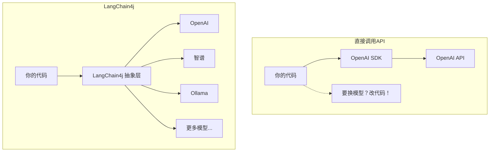
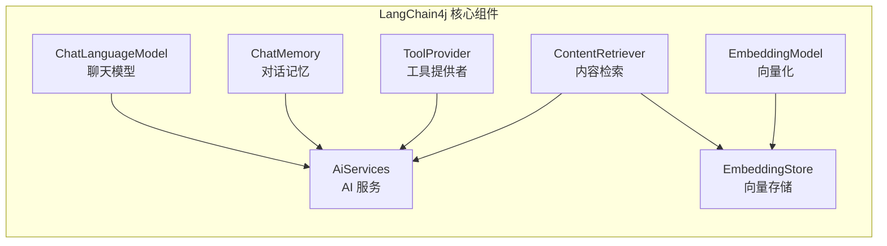
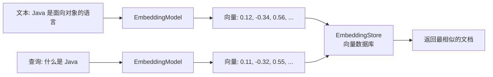
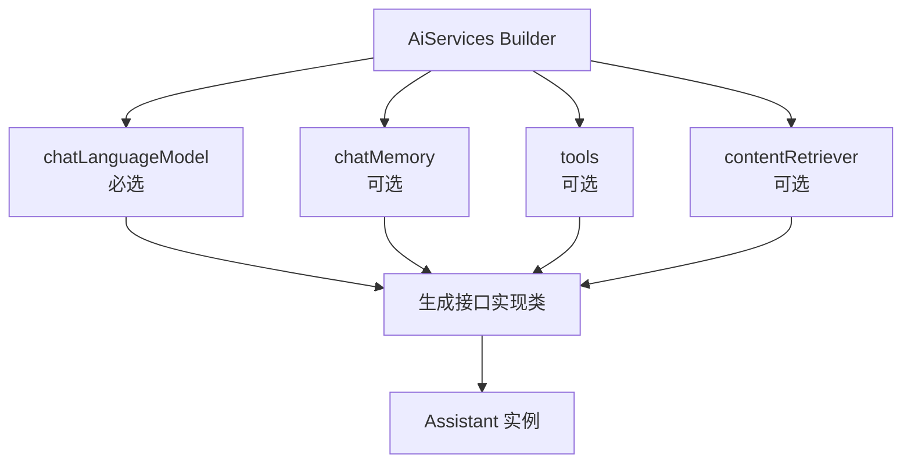
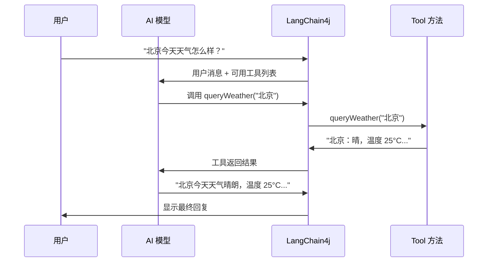
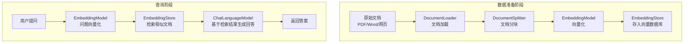
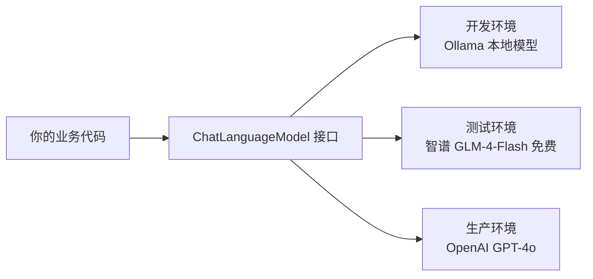

# LangChain4j：Java 开发者的 AI 应用开发利器

## 一、LangChain4j 简介

如果你是一个 Java 开发者，想进入 AI 应用开发领域，大概率听过 Python 生态的 LangChain。它几乎是 AI 应用开发的"标配框架"——但它是 Python 的。好消息是，Java 世界也有了自己的 LangChain：**LangChain4j**。

LangChain4j 是 LangChain 的 Java 实现，由 LangChain4j 团队开发维护。它不是简单的"翻译版"，而是从 Java 开发者的视角重新设计的 AI 应用开发框架。它充分利用了 Java 的类型安全、接口抽象、注解驱动等特性，让 Java 开发者可以用最熟悉的编程范式来构建 AI 应用。

:::tip LangChain4j 的核心定位
LangChain4j 是一个 **AI 应用开发框架**，它屏蔽了不同 AI 模型提供商之间的差异，提供了统一的抽象接口，让你可以专注于业务逻辑而不是底层 API 的差异。
:::

### 1.1 LangChain4j 能做什么？

- **AI 对话**：对接各种大语言模型（OpenAI、智谱、Ollama 等）
- **RAG（检索增强生成）**：让 AI 基于你的私有数据回答问题
- **工具调用（Function Calling）**：让 AI 调用你定义的 Java 方法
- **结构化输出**：让 AI 返回 Java 对象而不是纯文本
- **对话记忆**：自动管理多轮对话的上下文
- **AI Agent**：构建能自主决策和执行任务的 AI 代理

### 1.2 版本说明

截至 2024 年底，LangChain4j 最新稳定版为 **0.36.x**，建议使用最新版本。本文基于 0.36.x 编写，API 可能随版本更新有所变化。

## 二、为什么 Java 开发者需要 LangChain4j？

### 2.1 不用 Python 也能做 AI 应用

很多 Java 开发者面对 AI 应用开发时的第一个障碍是"Python"。你的技术栈是 Spring Boot + Maven/Gradle + JVM，但现在所有 AI 教程都是 Python 的。学一门新语言来写 AI 应用？成本太高了。

LangChain4j 让你 **用 Java 做所有 AI 能做的事**：

| 场景 | Python 方案 | Java 方案 |
|------|------------|-----------|
| AI 对话 | OpenAI Python SDK | LangChain4j + OpenAI |
| RAG | LangChain + ChromaDB | LangChain4j + EmbeddingStore |
| Function Calling | LangChain Tools | LangChain4j @Tool |
| AI Agent | LangChain Agent | LangChain4j AiServices |
| 部署 | FastAPI / Flask | Spring Boot |

### 2.2 企业级优势

Java 在企业级应用中有天然优势：

- **类型安全**：编译期就能发现很多问题，不像 Python 那样运行时才报错
- **成熟的生态**：Spring Boot、Maven/Gradle、日志框架、监控体系都是现成的
- **团队协作**：你的团队都会 Java，不需要额外培训
- **运维友好**：JVM 的监控、调优、故障排查工具链非常成熟
- **性能**：JVM 的并发处理能力远超 Python 的 GIL 限制

### 2.3 LangChain4j vs 直接调用 API

你可能会问：为什么不直接用 OpenAI 的 Java SDK？区别在于 **抽象层次**：



直接调用 API 就像直接用 JDBC 写 SQL，而 LangChain4j 就像用 MyBatis/JPA——它提供了更高层次的抽象，让代码更简洁、更易维护。

## 三、快速开始

### 3.1 创建项目

用你喜欢的工具创建一个 Maven 项目，或者直接用 Spring Initializr。这里先不用 Spring Boot，先用最简单的方式体验 LangChain4j。

**pom.xml 核心依赖：**

```xml
<properties>
    <langchain4j.version>0.36.2</langchain4j.version>
</properties>

<dependencies>
    <!-- LangChain4j 核心 -->
    <dependency>
        <groupId>dev.langchain4j</groupId>
        <artifactId>langchain4j</artifactId>
        <version>${langchain4j.version}</version>
    </dependency>
    
    <!-- OpenAI 集成 -->
    <dependency>
        <groupId>dev.langchain4j</groupId>
        <artifactId>langchain4j-open-ai</artifactId>
        <version>${langchain4j.version}</version>
    </dependency>
</dependencies>
```

:::tip API Key 获取
- OpenAI：去 platform.openai.com 申请
- 智谱：去 open.bigmodel.cn 申请
- Ollama：本地运行，不需要 API Key，但需要先安装 Ollama 并下载模型
:::

### 3.2 第一个 AI 聊天

来，写第一个 LangChain4j 程序——跟 AI 聊天：

```java
import dev.langchain4j.model.chat.ChatLanguageModel;
import dev.langchain4j.model.openai.OpenAiChatModel;

public class HelloLangChain4j {
    public static void main(String[] args) {
        // 1. 创建模型实例
        ChatLanguageModel model = OpenAiChatModel.builder()
                .apiKey("sk-your-api-key")   // 替换为你的 API Key
                .modelName("gpt-4o-mini")     // 使用 GPT-4o-mini
                .temperature(0.7)
                .build();

        // 2. 发送消息，获取回复
        String answer = model.generate("用一句话介绍 Java 语言");

        // 3. 输出结果
        System.out.println("AI 回复: " + answer);
    }
}
```

**运行结果：**

```
AI 回复: Java 是一种面向对象的编程语言，以其跨平台性、安全性和丰富的生态系统著称。
```

就这么简单！三行代码就完成了一次 AI 对话。`ChatLanguageModel.generate()` 方法接收一个字符串，返回 AI 的回复字符串。

:::warning API Key 安全
上面的代码把 API Key 硬编码在代码里，仅供演示。生产环境中应该通过环境变量或配置文件来管理，后面会讲。
:::

### 3.3 使用 Ollama 本地模型

如果你不想用付费 API，或者数据不能离开本地，可以用 Ollama：

```java
import dev.langchain4j.model.chat.ChatLanguageModel;
import dev.langchain4j.model.ollama.OllamaChatModel;

public class HelloOllama {
    public static void main(String[] args) {
        ChatLanguageModel model = OllamaChatModel.builder()
                .baseUrl("http://localhost:11434")  // Ollama 默认端口
                .modelName("qwen2.5:7b")            // 使用 Qwen 2.5 7B 模型
                .temperature(0.7)
                .build();

        String answer = model.generate("用一句话介绍 Java 语言");
        System.out.println("AI 回复: " + answer);
    }
}
```

:::tip Ollama 安装
```bash
# macOS
brew install ollama
ollama serve

# 下载模型
ollama pull qwen2.5:7b
ollama pull llama3.1:8b
```
:::

### 3.4 流式输出

AI 生成文本通常需要几秒钟，如果等全部生成完再显示，用户体验很差。LangChain4j 支持流式输出，可以一个字一个字地返回：

```java
import dev.langchain4j.model.chat.StreamingChatLanguageModel;
import dev.langchain4j.model.openai.OpenAiStreamingChatModel;
import dev.langchain4j.data.message.AiMessage;
import dev.langchain4j.model.output.Response;
import dev.langchain4j.streaming.StreamingResponseHandler;

public class StreamingExample {
    public static void main(String[] args) {
        StreamingChatLanguageModel model = OpenAiStreamingChatModel.builder()
                .apiKey("sk-your-api-key")
                .modelName("gpt-4o-mini")
                .temperature(0.7)
                .build();

        System.out.print("AI 回复: ");
        
        model.generate("给我讲一个关于程序员的笑话", 
            new StreamingResponseHandler<AiMessage>() {
            @Override
            public void onNext(String token) {
                System.out.print(token);
            }

            @Override
            public void onComplete(Response<AiMessage> response) {
                System.out.println("\n--- 生成完毕 ---");
                System.out.println("Token 使用量: " + response.tokenUsage());
            }

            @Override
            public void onError(Throwable error) {
                System.err.println("出错了: " + error.getMessage());
            }
        });
    }
}
```

**运行结果：**

```
AI 回复: 一个程序员去面试，面试官问："你有什么特长？"
程序员说："我能把别人的代码改到我自己都不认识。"
面试官："这就是你的特长？"
程序员："不，这是我的日常工作。"
--- 生成完毕 ---
Token 使用量: TokenUsage{inputTokenCount=18, outputTokenCount=58, totalTokenCount=76}
```

流式输出的好处是用户不需要等待全部内容生成完毕，可以实时看到 AI 正在"打字"，体验上像在跟真人聊天。

## 四、核心概念

在深入使用之前，先理解 LangChain4j 的核心概念。这些概念贯穿整个框架：



### 4.1 ChatLanguageModel（聊天模型接口）

这是最基础的接口，所有对话能力都从这里开始。它是一个统一的抽象，背后可以是 OpenAI、智谱、Ollama 或任何其他模型提供商。

```java
public interface ChatLanguageModel {
    Response<AiMessage> generate(String userMessage);
    Response<AiMessage> generate(List<ChatMessage> messages);
}
```

**关键点：**
- 你面向接口编程，不关心底层实现
- 换模型只需要换实现类，业务代码不动
- `generate()` 方法返回的 `Response` 包含回复内容和 Token 使用量

**支持的模型提供商：**

| 提供商 | Maven 依赖 | 模型示例 |
|--------|-----------|---------|
| OpenAI | langchain4j-open-ai | gpt-4o, gpt-4o-mini |
| 智谱 AI | langchain4j-zhipu-ai | glm-4, glm-4-flash |
| Ollama | langchain4j-ollama | qwen2.5, llama3.1 |
| Azure OpenAI | langchain4j-azure-open-ai | gpt-4o (Azure) |
| Anthropic | langchain4j-anthropic | claude-3.5-sonnet |
| Google Vertex AI | langchain4j-vertex-ai-gemini | gemini-pro |
| Amazon Bedrock | langchain4j-bedrock | claude, titan |

### 4.2 AiServices（声明式 AI 服务）

这是 LangChain4j **最核心、最特色** 的功能。你只需要定义一个 Java 接口，LangChain4j 会自动为你生成实现类。这跟 Spring 的 `@Repository` 接口代理、MyBatis 的 Mapper 接口是同一个思路。

```java
// 你只需要定义接口
public interface Assistant {
    String chat(String message);
}

// LangChain4j 自动生成实现
Assistant assistant = AiServices.create(Assistant.class, model);
String reply = assistant.chat("你好");
```

先有个概念，后面会详细展开。

### 4.3 ChatMemory（对话记忆）

大模型本身是"无状态"的——每次调用都是独立的，它不记得之前聊了什么。`ChatMemory` 就是用来解决这个问题：

```java
import dev.langchain4j.memory.chat.MessageWindowChatMemory;

// 保留最近 10 条消息作为上下文
ChatMemory memory = MessageWindowChatMemory.withMaxMessages(10);
```

当配合 AiServices 使用时，记忆会自动管理：

```java
Assistant assistant = AiServices.builder(Assistant.class)
        .chatLanguageModel(model)
        .chatMemory(memory)
        .build();

assistant.chat("我叫张三");
assistant.chat("我叫什么名字？");  // AI 能回答"你叫张三"
```

### 4.4 ToolProvider（工具提供者）

工具（Tool）让 AI 能够调用你定义的 Java 方法。比如，你可以定义一个"查天气"的工具，AI 在对话中就能自动调用它。

### 4.5 EmbeddingModel 和 EmbeddingStore

这对组合是 RAG 的基础设施：

- **EmbeddingModel**：把文本转换成向量（一组浮点数），语义相近的文本，向量也相近
- **EmbeddingStore**：存储和检索向量的数据库



## 五、AiServices 详解

AiServices 是 LangChain4j 最具特色的功能，值得单独用一整节来讲。它的核心思想是：**你只管定义接口，框架帮你实现**。

### 5.1 用接口定义 AI 服务

```java
import dev.langchain4j.service.AiServices;
import dev.langchain4j.service.SystemMessage;
import dev.langchain4j.service.UserMessage;

public interface CodeAssistant {
    
    @SystemMessage("你是一个资深的 Java 开发专家，回答要专业且简洁。")
    String answerQuestion(@UserMessage String question);
}
```

创建并使用：

```java
public class AiServicesDemo {
    public static void main(String[] args) {
        ChatLanguageModel model = OpenAiChatModel.builder()
                .apiKey("sk-your-api-key")
                .modelName("gpt-4o-mini")
                .build();

        CodeAssistant assistant = AiServices.create(CodeAssistant.class, model);
        String answer = assistant.answerQuestion(
            "Spring Boot 中 @Transactional 注解的原理是什么？"
        );
        System.out.println(answer);
    }
}
```

**运行结果：**

```
@Transactional 基于 Spring AOP 实现，通过动态代理拦截方法调用。核心机制：
1. 事务管理器（PlatformTransactionManager）负责开启、提交、回滚事务
2. 默认在 RuntimeException 和 Error 时回滚，checked 异常不回滚
3. 通过事务传播行为（Propagation）控制多个事务方法之间的协作关系
4. 注意：同一个类中方法互相调用不会触发事务代理，这是常见坑点。
```

### 5.2 注解详解

#### @SystemMessage —— 系统提示词

定义 AI 的角色和行为准则：

```java
public interface Translator {
    @SystemMessage("你是一个专业的翻译官，负责中英文互译。只输出翻译结果，不要任何解释。")
    String translate(@UserMessage String text);
}
```

#### @UserMessage —— 用户消息模板

支持模板变量，用 `{{变量名}}` 语法：

```java
public interface CodeReviewer {
    @UserMessage("请 review 以下 {{language}} 代码，指出潜在问题：\n```{{language}}\n{{code}}\n```")
    String reviewCode(String language, String code);
}
```

使用：

```java
String result = reviewer.reviewCode("Java", """
    public class User {
        private String name;
        // 缺少 getter/setter
    }
    """);
```

#### @MemoryId —— 多用户记忆隔离

当你的 AI 服务需要服务多个用户时，用 `@MemoryId` 隔离不同用户的对话记忆：

```java
public interface ChatBot {
    @MemoryId
    String memoryId();
    
    String chat(@UserMessage String message);
}
```

使用：

```java
ChatMemory memory = MessageWindowChatMemory.withMaxMessages(10);

ChatBot bot = AiServices.builder(ChatBot.class)
        .chatLanguageModel(model)
        .chatMemory(memory)
        .build();

// 用户 A 的对话
bot.withMemoryId("user-A").chat("我叫张三");
bot.withMemoryId("user-A").chat("我叫什么？");  // 回答"张三"

// 用户 B 的对话，记忆独立
bot.withMemoryId("user-B").chat("我叫什么？");  // 不知道
```

### 5.3 返回值处理

AiServices 支持多种返回值类型，不仅仅是可以返回 String。

#### 返回结构化对象

让 AI 返回一个 Java 对象，LangChain4j 会自动把 AI 的文本输出解析成对象：

```java
public record BookRecommendation(
    String title,
    String author,
    String reason,
    int rating
) {}

public interface BookAdvisor {
    @SystemMessage("你是一个书籍推荐专家。")
    BookRecommendation recommend(@UserMessage("推荐一本关于 {{topic}} 的书") String topic);
}
```

**运行结果：**

```java
BookRecommendation rec = advisor.recommend("分布式系统");
// rec.title()   = "Designing Data-Intensive Applications"
// rec.author()  = "Martin Kleppmann"
// rec.reason()  = "这本书被公认为分布式系统领域最全面的著作"
// rec.rating()  = 10
```

AI 的输出会被自动解析成 Java 对象。如果格式不对，LangChain4j 会自动重试（最多 3 次），让 AI 修正格式。

:::tip 结构化输出的原理
LangChain4j 会在 System Prompt 中自动添加 JSON Schema 描述，告诉 AI 必须按照指定格式返回。然后它解析 AI 的 JSON 输出，映射到 Java 对象。
:::

#### 返回 List

```java
public interface QuizGenerator {
    @SystemMessage("你是一个出题专家，生成选择题。")
    List<Question> generateQuestions(@UserMessage("出 3 道 {{topic}} 的选择题") String topic);
}

public record Question(
    String question,
    List<String> options,
    int correctIndex
) {}
```

#### 返回 boolean 和枚举

```java
public interface SpamDetector {
    @SystemMessage("判断以下消息是否为垃圾信息。")
    boolean isSpam(@UserMessage String message);
}

public enum Sentiment { POSITIVE, NEUTRAL, NEGATIVE }

public interface SentimentAnalyzer {
    Sentiment analyze(@UserMessage String text);
}
```

### 5.4 完整的 AiServices 构建

```java
Assistant assistant = AiServices.builder(Assistant.class)
        .chatLanguageModel(model)                    // 必需：聊天模型
        .chatMemory(memory)                          // 可选：对话记忆
        .tools(new WeatherTools())                   // 可选：工具
        .contentRetriever(retriever)                 // 可选：RAG 检索器
        .build();
```



## 六、Tool 使用

Tool（工具）是 AI 应用最强大的能力之一。它让 AI 不仅能"说"，还能"做"。

### 6.1 @Tool 注解定义工具

```java
import dev.langchain4j.agent.tool.Tool;
import dev.langchain4j.agent.tool.P;
import java.time.LocalDateTime;
import java.time.format.DateTimeFormatter;

public class AssistantTools {
    
    @Tool("根据城市名称查询当前天气信息")
    public String queryWeather(String city) {
        return switch (city.toLowerCase()) {
            case "北京" -> "北京：晴，温度 25°C，湿度 40%，北风 3 级";
            case "上海" -> "上海：多云，温度 28°C，湿度 65%，东风 2 级";
            case "深圳" -> "深圳：阵雨，温度 30°C，湿度 80%，南风 2 级";
            default -> city + "：暂无天气数据";
        };
    }
    
    @Tool("获取当前日期和时间")
    public String getCurrentTime() {
        return LocalDateTime.now()
            .format(DateTimeFormatter.ofPattern("yyyy-MM-dd HH:mm:ss"));
    }
    
    @Tool("计算两个数的运算结果")
    public String calculate(
            @P("第一个数") double num1,
            @P("运算符，支持 +, -, *, /") String operator,
            @P("第二个数") double num2
    ) {
        return switch (operator) {
            case "+" -> String.valueOf(num1 + num2);
            case "-" -> String.valueOf(num1 - num2);
            case "*" -> String.valueOf(num1 * num2);
            case "/" -> num2 != 0 ? String.valueOf(num1 / num2) : "错误：除数不能为 0";
            default -> "不支持的运算符: " + operator;
        };
    }
}
```

:::tip @P 注解
`@P` 注解为工具参数添加描述，帮助 AI 理解每个参数的含义。这在参数名不够直观时特别有用。
:::

### 6.2 工具执行流程

AI 调用工具的完整流程：



关键点：
1. LangChain4j 自动把工具的方法签名描述发给 AI
2. AI 决定是否需要调用工具、调用哪个工具、传什么参数
3. LangChain4j 调用对应的 Java 方法
4. 工具结果返回给 AI，AI 基于结果生成最终回复
5. 这个过程可能循环多次（AI 可能需要调用多个工具）

### 6.3 将工具注册到 AiServices

```java
public interface SmartAssistant {
    String chat(@UserMessage String message);
}

public class ToolDemo {
    public static void main(String[] args) {
        ChatLanguageModel model = OpenAiChatModel.builder()
                .apiKey("sk-your-api-key")
                .modelName("gpt-4o-mini")
                .build();

        SmartAssistant assistant = AiServices.builder(SmartAssistant.class)
                .chatLanguageModel(model)
                .tools(new AssistantTools())
                .build();

        System.out.println(assistant.chat("北京和上海今天天气怎么样？"));
        System.out.println("---");
        System.out.println(assistant.chat("帮我算一下 123 * 456 等于多少"));
        System.out.println("---");
        System.out.println(assistant.chat("现在几点了？"));
    }
}
```

**运行结果：**

```
北京今天晴，温度 25°C，湿度 40%，北风 3 级；上海多云，温度 28°C，湿度 65%，东风 2 级。
---
123 × 456 = 56088
---
现在是 2024-12-15 14:30:25。
```

:::warning 工具中的安全性
工具方法可能会被 AI 调用，所以一定要做好参数验证：
- 验证参数类型和范围
- 防止 SQL 注入
- 限制返回的数据量
- 不要在工具中暴露敏感操作（如删除数据）
:::

## 七、RAG 实现

RAG（Retrieval-Augmented Generation，检索增强生成）是让 AI 基于你的私有数据回答问题的技术。这是企业级 AI 应用最核心的场景。

### 7.1 RAG 流程概览



### 7.2 文档加载和分块

```java
import dev.langchain4j.data.document.Document;
import dev.langchain4j.data.document.FileSystemDocumentLoader;
import dev.langchain4j.data.document.splitter.DocumentSplitters;
import dev.langchain4j.data.segment.TextSegment;
import java.nio.file.Paths;

// 1. 加载文档
Document document = FileSystemDocumentLoader.loadDocument(
    Paths.get("knowledge-base/java-guide.txt")
);

// 2. 分块：每块 500 个字符，重叠 100 个字符
var splitter = DocumentSplitters.recursive(500, 100);
List<TextSegment> segments = splitter.split(document);
```

:::tip 为什么要分块？
大模型有 Token 限制，而且整篇文档塞进去既浪费 Token 效果也不一定好。分块后检索更精准，只把相关的片段发给 AI。重叠部分是为了避免语义在分块边界被截断。
:::

### 7.3 向量化和存储

```java
import dev.langchain4j.model.embedding.EmbeddingModel;
import dev.langchain4j.model.openai.OpenAiEmbeddingModel;
import dev.langchain4j.store.embedding.EmbeddingStore;
import dev.langchain4j.store.embedding.inmemory.InMemoryEmbeddingStore;
import dev.langchain4j.store.embedding.EmbeddingStoreIngestor;

EmbeddingModel embeddingModel = OpenAiEmbeddingModel.builder()
        .apiKey("sk-your-api-key")
        .modelName("text-embedding-3-small")
        .build();

EmbeddingStore<TextSegment> embeddingStore = new InMemoryEmbeddingStore<>();

// 一键完成：分块 + 向量化 + 存储
EmbeddingStoreIngestor ingestor = EmbeddingStoreIngestor.builder()
        .documentSplitter(DocumentSplitters.recursive(500, 100))
        .embeddingModel(embeddingModel)
        .embeddingStore(embeddingStore)
        .build();

ingestor.ingest(document);
System.out.println("文档已向量化并存储");
```

### 7.4 查询检索

```java
import dev.langchain4j.store.embedding.EmbeddingMatch;
import dev.langchain4j.data.embedding.Embedding;

Embedding queryEmbedding = embeddingModel.embed("什么是 Spring Boot").content();

List<EmbeddingMatch<TextSegment>> matches = embeddingStore.findRelevant(
        queryEmbedding, 5
);

for (EmbeddingMatch<TextSegment> match : matches) {
    System.out.printf("相似度: %.4f | %s%n",
            match.score(),
            match.embedded().text().substring(0, 80) + "...");
}
```

**运行结果：**

```
相似度: 0.8734 | Spring Boot 是一个基于 Spring 框架的快速开发工具...
相似度: 0.8121 | Spring Boot 的核心特性包括：自动配置、起步依赖...
相似度: 0.7652 | 使用 Spring Initializr 可以快速创建 Spring Boot 项目...
```

### 7.5 完整的 RAG 示例

把所有步骤整合在一起：

```java
import dev.langchain4j.*;
import dev.langchain4j.data.document.*;
import dev.langchain4j.data.document.splitter.*;
import dev.langchain4j.data.segment.*;
import dev.langchain4j.model.chat.*;
import dev.langchain4j.model.embedding.*;
import dev.langchain4j.model.openai.*;
import dev.langchain4j.rag.content.retriever.*;
import dev.langchain4j.service.*;
import dev.langchain4j.store.embedding.*;
import dev.langchain4j.store.embedding.inmemory.*;

import java.nio.file.*;
import java.util.*;

public class RagExample {

    interface KnowledgeAssistant {
        @SystemMessage("你是一个技术助手，基于提供的知识库内容回答问题。")
        String answer(@UserMessage String question);
    }

    public static void main(String[] args) throws Exception {
        // 准备模型
        ChatLanguageModel chatModel = OpenAiChatModel.builder()
                .apiKey("sk-your-api-key")
                .modelName("gpt-4o-mini")
                .build();

        EmbeddingModel embeddingModel = OpenAiEmbeddingModel.builder()
                .apiKey("sk-your-api-key")
                .modelName("text-embedding-3-small")
                .build();

        // 加载文档并向量化
        Document document = FileSystemDocumentLoader.loadDocument(
                Paths.get("knowledge-base/spring-boot-guide.txt"));

        EmbeddingStore<TextSegment> embeddingStore = new InMemoryEmbeddingStore<>();

        EmbeddingStoreIngestor.ingest(
                DocumentSplitters.recursive(500, 100),
                embeddingModel,
                embeddingStore,
                document
        );
        System.out.println("知识库加载完成");

        // 创建 RAG 检索器
        ContentRetriever retriever = EmbeddingStoreContentRetriever.builder()
                .embeddingStore(embeddingStore)
                .embeddingModel(embeddingModel)
                .maxResults(5)
                .minScore(0.7)
                .build();

        // 创建 AI 服务
        KnowledgeAssistant assistant = AiServices.builder(KnowledgeAssistant.class)
                .chatLanguageModel(chatModel)
                .contentRetriever(retriever)
                .build();

        // 交互式提问
        Scanner scanner = new Scanner(System.in);
        System.out.println("知识库助手已就绪（输入 quit 退出）");
        
        while (true) {
            System.out.print("\n请提问: ");
            String question = scanner.nextLine();
            if ("quit".equalsIgnoreCase(question)) break;
            System.out.println("回答: " + assistant.answer(question));
        }
    }
}
```

**运行效果：**

```
知识库加载完成
知识库助手已就绪（输入 quit 退出）

请提问: Spring Boot 有哪些核心特性？
回答: 根据知识库内容，Spring Boot 的核心特性包括：
1. 自动配置（Auto-Configuration）：根据类路径自动配置 Spring 应用
2. 起步依赖（Starter Dependencies）：简化依赖管理
3. 内嵌服务器（Embedded Server）：直接运行，无需部署到外部服务器
4. Actuator 监控：提供生产级别的监控端点
5. 配置外部化：支持 properties、yml、环境变量等多种配置方式

请提问: 如何配置数据源？
回答: Spring Boot 支持在 application.yml 中配置数据源...
```

## 八、支持的模型提供商

LangChain4j 支持的模型提供商非常丰富，基本覆盖了主流的国内外 AI 服务：

### 8.1 国内模型提供商

```xml
<!-- 智谱 AI (GLM) -->
<dependency>
    <groupId>dev.langchain4j</groupId>
    <artifactId>langchain4j-zhipu-ai</artifactId>
    <version>${langchain4j.version}</version>
</dependency>

<!-- 通义千问 (DashScope) -->
<dependency>
    <groupId>dev.langchain4j</groupId>
    <artifactId>langchain4j-dashscope</artifactId>
    <version>${langchain4j.version}</version>
</dependency>
```

使用智谱 AI 的示例：

```java
import dev.langchain4j.model.zhipu.ZhipuAiChatModel;

ChatLanguageModel model = ZhipuAiChatModel.builder()
        .apiKey("your-zhipu-api-key")
        .modelName("glm-4-flash")   // GLM-4-Flash 免费使用
        .build();
```

:::tip 国内模型推荐
- 智谱 GLM-4-Flash：免费、速度快，适合开发和测试
- 通义千问：阿里出品，中文能力强
- 百度文心：中文理解能力好
- Moonshot：长上下文能力强（支持 200K）
:::

### 8.2 模型切换策略

利用 LangChain4j 的统一抽象，可以轻松实现模型切换：



```java
// 通过配置文件控制使用哪个模型
public class ModelFactory {
    public static ChatLanguageModel createModel(ModelConfig config) {
        return switch (config.getProvider()) {
            case "openai" -> OpenAiChatModel.builder()
                    .apiKey(config.getApiKey())
                    .modelName(config.getModelName())
                    .build();
            case "zhipu" -> ZhipuAiChatModel.builder()
                    .apiKey(config.getApiKey())
                    .modelName(config.getModelName())
                    .build();
            case "ollama" -> OllamaChatModel.builder()
                    .baseUrl(config.getBaseUrl())
                    .modelName(config.getModelName())
                    .build();
            default -> throw new IllegalArgumentException("不支持的模型: " + config.getProvider());
        };
    }
}
```

## 九、与 Python LangChain 对比

| 特性 | LangChain4j (Java) | LangChain (Python) |
|------|-------------------|-------------------|
| 语言 | Java 17+ | Python 3.8+ |
| 类型安全 | 编译期检查，类型安全 | 动态类型，运行时错误 |
| 接口定义 | AiServices 声明式接口 | LCEL 链式调用 |
| 工具定义 | @Tool 注解 | @tool 装饰器 |
| 依赖管理 | Maven/Gradle | pip |
| Web 框架 | Spring Boot 原生集成 | FastAPI/Flask |
| 部署 | JAR 包，传统部署 | Docker/云函数 |
| 学习曲线 | Java 开发者零门槛 | 需要熟悉 Python |
| 生态成熟度 | 快速发展中 | 更成熟，社区更大 |
| 性能 | JVM 高并发优势 | 单线程为主 |

:::tip 选择建议
- 你的团队是 Java 技术栈 → 选 LangChain4j
- 需要跟 Spring Boot 深度集成 → 选 LangChain4j
- 需要快速原型验证、用最新模型 → Python LangChain 更灵活
- 已有成熟的 Python ML 管线 → 用 Python
:::

## 十、实战：Spring Boot + LangChain4j 实现智能客服

### 10.1 项目结构

```
customer-service/
├── pom.xml
├── src/main/java/com/example/cs/
│   ├── CustomerServiceApplication.java
│   ├── config/
│   │   └── AiConfig.java
│   ├── service/
│   │   ├── CustomerAssistant.java      // AI 服务接口
│   │   ├── OrderTools.java              // 订单查询工具
│   │   └── KnowledgeBaseService.java    // 知识库服务
│   └── controller/
│       └── ChatController.java
└── src/main/resources/
    └── application.yml
```

### 10.2 Maven 依赖

```xml
<dependencies>
    <!-- Spring Boot -->
    <dependency>
        <groupId>org.springframework.boot</groupId>
        <artifactId>spring-boot-starter-web</artifactId>
    </dependency>
    
    <!-- LangChain4j 核心 -->
    <dependency>
        <groupId>dev.langchain4j</groupId>
        <artifactId>langchain4j</artifactId>
        <version>0.36.2</version>
    </dependency>
    <dependency>
        <groupId>dev.langchain4j</groupId>
        <artifactId>langchain4j-open-ai</artifactId>
        <version>0.36.2</version>
    </dependency>
    <dependency>
        <groupId>dev.langchain4j</groupId>
        <artifactId>langchain4j-easy-rag</artifactId>
        <version>0.36.2</version>
    </dependency>
</dependencies>
```

### 10.3 配置文件

```yaml
# application.yml
langchain4j:
  open-ai:
    chat-model:
      api-key: ${OPENAI_API_KEY}
      model-name: gpt-4o-mini
      temperature: 0.7
      timeout: 30s
    embedding-model:
      api-key: ${OPENAI_API_KEY}
      model-name: text-embedding-3-small
```

### 10.4 AI 配置类

```java
package com.example.cs.config;

import dev.langchain4j.model.chat.ChatLanguageModel;
import dev.langchain4j.model.openai.OpenAiChatModel;
import dev.langchain4j.model.embedding.EmbeddingModel;
import dev.langchain4j.model.openai.OpenAiEmbeddingModel;
import dev.langchain4j.memory.chat.MessageWindowChatMemory;
import dev.langchain4j.store.embedding.EmbeddingStore;
import dev.langchain4j.store.embedding.inmemory.InMemoryEmbeddingStore;
import org.springframework.context.annotation.Bean;
import org.springframework.context.annotation.Configuration;

@Configuration
public class AiConfig {

    @Bean
    public ChatLanguageModel chatLanguageModel() {
        return OpenAiChatModel.builder()
                .apiKey(System.getenv("OPENAI_API_KEY"))
                .modelName("gpt-4o-mini")
                .temperature(0.7)
                .timeout(java.time.Duration.ofSeconds(30))
                .build();
    }

    @Bean
    public EmbeddingModel embeddingModel() {
        return OpenAiEmbeddingModel.builder()
                .apiKey(System.getenv("OPENAI_API_KEY"))
                .modelName("text-embedding-3-small")
                .build();
    }

    @Bean
    public EmbeddingStore embeddingStore() {
        return new InMemoryEmbeddingStore();
    }

    @Bean
    public MessageWindowChatMemory chatMemory() {
        return MessageWindowChatMemory.withMaxMessages(20);
    }
}
```

### 10.5 AI 服务接口

```java
package com.example.cs.service;

import dev.langchain4j.service.*;
import dev.langchain4j.data.message.AiMessage;

public interface CustomerAssistant {
    
    @SystemMessage("""
        你是一个专业的电商客服助手。你的职责：
        1. 回答客户关于商品、订单、物流的问题
        2. 如果客户询问订单状态，使用订单查询工具
        3. 对于退换货政策、常见问题，参考知识库
        4. 态度友好专业，遇到无法解决的问题建议客户拨打人工客服电话
        
        回答要求：
        - 使用简洁明了的中文
        - 不要编造不存在的信息
        - 如果知识库中没有相关信息，诚实告知
        """)
    String chat(@MemoryId String sessionId, @UserMessage String message);
    
    @SystemMessage("你是一个情感分析专家，分析客户消息的情感倾向。")
    Sentiment analyzeSentiment(@UserMessage String message);
    
    enum Sentiment {
        POSITIVE, NEUTRAL, NEGATIVE, ANGRY
    }
}
```

### 10.6 工具类

```java
package com.example.cs.service;

import dev.langchain4j.agent.tool.Tool;
import dev.langchain4j.agent.tool.P;
import org.springframework.stereotype.Component;
import java.util.Map;
import java.util.concurrent.ConcurrentHashMap;

@Component
public class OrderTools {
    
    // 模拟订单数据库
    private static final Map<String, Order> ORDER_DB = new ConcurrentHashMap<>();
    
    static {
        ORDER_DB.put("ORD-2024-001", new Order("ORD-2024-001", "张三", 
            "iPhone 15 Pro", 8999.0, "已发货", "顺丰快递 SF1234567890"));
        ORDER_DB.put("ORD-2024-002", new Order("ORD-2024-002", "李四",
            "MacBook Pro 14", 14999.0, "待发货", "预计明天发货"));
        ORDER_DB.put("ORD-2024-003", new Order("ORD-2024-003", "王五",
            "AirPods Pro 2", 1899.0, "已签收", "本人签收"));
    }
    
    @Tool("根据订单号查询订单状态和物流信息")
    public String queryOrder(@P("订单号，格式如 ORD-2024-001") String orderId) {
        Order order = ORDER_DB.get(orderId);
        if (order == null) {
            return "未找到订单号 " + orderId + "，请确认订单号是否正确。";
        }
        return String.format(
            "订单信息：\n订单号：%s\n客户：%s\n商品：%s\n金额：%.2f 元\n状态：%s\n物流：%s",
            order.id, order.customer, order.product, 
            order.amount, order.status, order.logistics
        );
    }
    
    record Order(String id, String customer, String product, 
                 double amount, String status, String logistics) {}
}
```

### 10.7 Controller

```java
package com.example.cs.controller;

import com.example.cs.service.CustomerAssistant;
import dev.langchain4j.memory.chat.MessageWindowChatMemory;
import dev.langchain4j.model.chat.ChatLanguageModel;
import dev.langchain4j.service.AiServices;
import org.springframework.web.bind.annotation.*;
import java.util.Map;
import java.util.concurrent.ConcurrentHashMap;

@RestController
@RequestMapping("/api/chat")
public class ChatController {
    
    private final CustomerAssistant assistant;
    private final OrderTools orderTools;
    
    public ChatController(ChatLanguageModel chatModel, 
                          MessageWindowChatMemory memory,
                          OrderTools orderTools) {
        this.orderTools = orderTools;
        this.assistant = AiServices.builder(CustomerAssistant.class)
                .chatLanguageModel(chatModel)
                .chatMemory(memory)
                .tools(orderTools)
                .build();
    }
    
    @PostMapping
    public Map<String, String> chat(@RequestBody ChatRequest request) {
        String reply = assistant.chat(request.sessionId(), request.message());
        return Map.of("reply", reply);
    }
    
    record ChatRequest(String sessionId, String message) {}
}
```

### 10.8 测试

启动应用后，用 curl 测试：

```bash
# 普通对话
curl -X POST http://localhost:8080/api/chat \
  -H "Content-Type: application/json" \
  -d '{"sessionId":"user-1","message":"你们有什么优惠活动？"}'

# 查询订单（触发工具调用）
curl -X POST http://localhost:8080/api/chat \
  -H "Content-Type: application/json" \
  -d '{"sessionId":"user-1","message":"帮我查一下订单 ORD-2024-001 的状态"}'
```

**返回结果：**

```json
{
  "reply": "您的订单 ORD-2024-001 信息如下：\n商品：iPhone 15 Pro\n金额：8999.00 元\n状态：已发货\n物流：顺丰快递 SF1234567890\n请问还有其他问题吗？"
}
```

:::tip 生产级改进方向
- 把 `InMemoryEmbeddingStore` 换成 Redis 或 PGVector
- 添加请求日志和 Token 消耗监控
- 实现流式输出（SSE）
- 添加限流和降级
- 接入真实的订单数据库
:::

## 练习题

### 题目 1：基础入门
创建一个 LangChain4j 项目，实现一个"翻译助手"接口，支持中英文互译。要求使用 AiServices 定义接口，用 `@SystemMessage` 设定角色，用 `@UserMessage` 模板传递待翻译文本。

### 题目 2：流式输出
改造上面的翻译助手，使用 `StreamingChatLanguageModel` 实现流式输出。要求每个 token 生成时立即打印，并统计总 Token 消耗量。

### 题目 3：Tool 开发
实现一个"股票查询工具"类 `StockTools`，包含以下方法：
- `getStockPrice(String stockCode)` — 查询股票实时价格
- `getStockHistory(String stockCode, int days)` — 查询历史价格
- `analyzeStock(String stockCode)` — 基本面分析

将工具注册到 AiServices 中，测试 AI 是否能正确调用。

### 题目 4：RAG 实现
选择一个你熟悉的技术领域（如 Spring Boot、MySQL、Redis），准备一份知识库文档（至少 2000 字），使用 LangChain4j 实现完整的 RAG 流程：
1. 加载文档并分块
2. 向量化并存储
3. 基于知识库回答问题
4. 测试至少 5 个不同的问题，验证回答准确性

### 题目 5：结构化输出
定义一个 `MovieRecommendation` 记录类，包含电影名称、导演、年份、类型、评分和推荐理由。使用 AiServices 实现一个电影推荐服务，AI 返回的类型必须是 `MovieRecommendation` 对象。测试不同类型的推荐请求。

### 题目 6：多用户场景
实现一个支持多用户的聊天服务：
- 使用 `@MemoryId` 实现用户隔离
- 每个用户最多保留 10 条对话记忆
- 模拟 3 个用户同时使用，验证他们的对话记录互不干扰
- 用户 A 告诉 AI 自己的名字，用户 B 问"我叫什么名字"，验证 B 无法获取 A 的信息