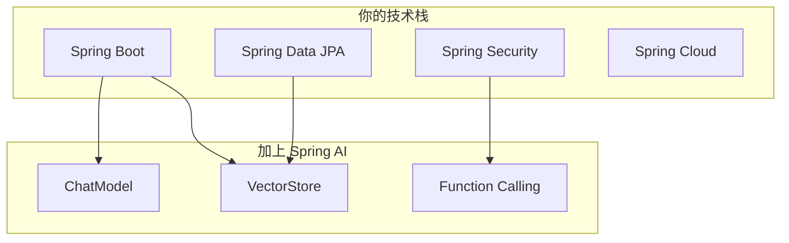
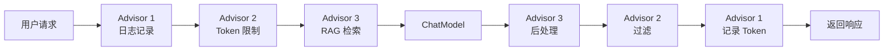
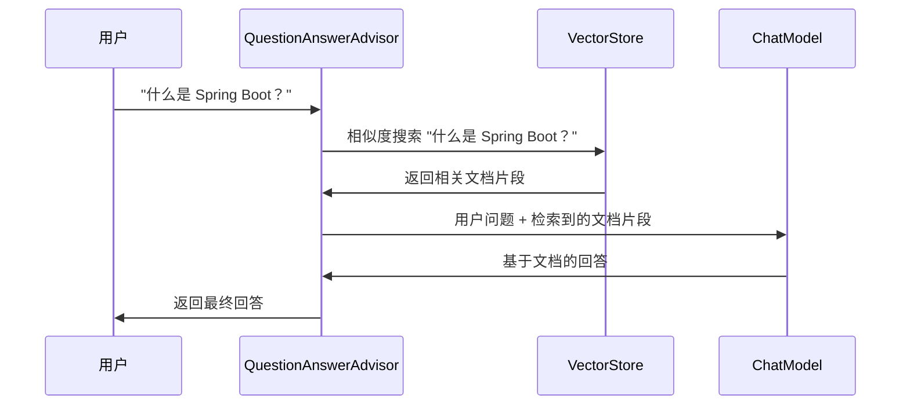
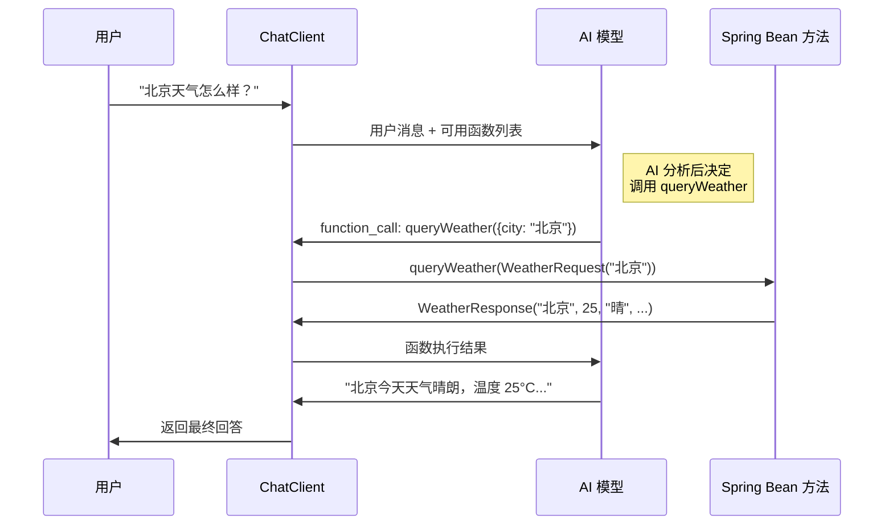
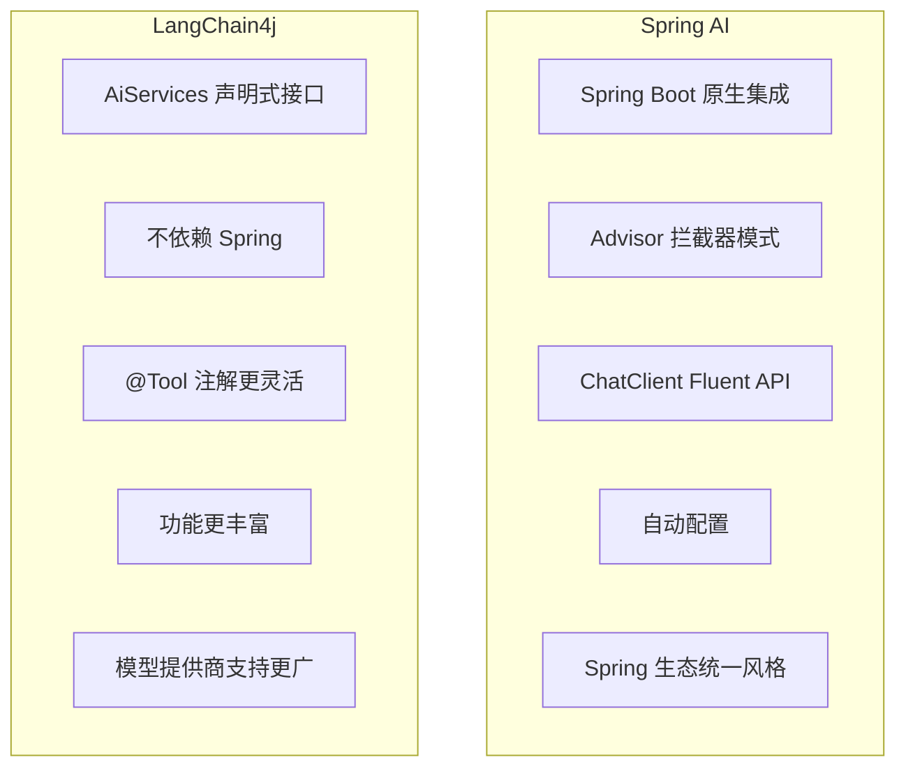

# Spring AI：Spring 官方的 AI 集成框架

## 一、Spring AI 简介

如果说 LangChain4j 是"Java 版的 LangChain"，那 Spring AI 就是 **"Spring 生态的 AI 原生扩展"**。它是 Spring 官方推出的 AI 集成框架，目标是让 Spring 开发者能像使用 Spring Data、Spring Security 一样自然地集成 AI 能力。

Spring AI 的设计哲学跟整个 Spring 体系一脉相承：

- **约定优于配置**：提供合理的默认值，减少样板代码
- **统一的抽象**：一个 API 对接多家模型提供商
- **与 Spring 生态深度集成**：自动配置、依赖注入、配置管理开箱即用
- **可移植性**：换模型提供商不需要改业务代码

:::tip Spring AI vs LangChain4j 的定位差异
- **Spring AI**：如果你已经在用 Spring Boot，它是"自然选择"——无缝集成，风格一致
- **LangChain4j**：更灵活，不绑定 Spring，功能更丰富，AiServices 的声明式接口设计更优雅
:::

### 1.1 版本说明

Spring AI 从 1.0.0 GA（2024 年 5 月）开始正式发布。本文基于 **Spring AI 1.0.x** 编写。

要求环境：
- Java 17+
- Spring Boot 3.2+

## 二、为什么选择 Spring AI？

### 2.1 如果你已经在用 Spring 生态



Spring AI 带来的好处：

1. **自动配置**：加个 starter 依赖，自动注入 ChatModel、EmbeddingModel 等 Bean
2. **配置管理**：模型参数、API Key 统一在 `application.yml` 管理
3. **依赖注入**：AI 组件作为 Spring Bean，可以方便地在 Service 层使用
4. **统一的异常处理**：跟 Spring MVC 的异常体系一致
5. **测试支持**：可以轻松 Mock AI 组件进行单元测试

### 2.2 Spring AI 核心特性

| 特性 | 说明 |
|------|------|
| Chat Model | 统一的聊天模型抽象，支持 OpenAI、Ollama 等 |
| Prompt | Prompt 模板和参数化 |
| Embedding Model | 文本向量化 |
| Vector Store | 向量数据库抽象（PGVector、Redis、Elasticsearch 等）|
| RAG | 检索增强生成的完整支持 |
| Function Calling | 让 AI 调用 Spring Bean 方法 |
| Structured Output | AI 返回结构化的 Java 对象 |
| Advisors | 请求/响应拦截器链 |
| Observability | 与 Micrometer 集成的可观测性 |

## 三、快速开始

### 3.1 创建项目

使用 Spring Initializr 创建项目，添加 Spring AI 依赖。或者手动创建 Maven 项目。

**pom.xml：**

```xml
<parent>
    <groupId>org.springframework.boot</groupId>
    <artifactId>spring-boot-starter-parent</artifactId>
    <version>3.3.0</version>
</parent>

<properties>
    <java.version>17</java.version>
    <spring-ai.version>1.0.0</spring-ai.version>
</properties>

<dependencies>
    <dependency>
        <groupId>org.springframework.boot</groupId>
        <artifactId>spring-boot-starter-web</artifactId>
    </dependency>
    
    <!-- Spring AI OpenAI -->
    <dependency>
        <groupId>org.springframework.ai</groupId>
        <artifactId>spring-ai-openai-spring-boot-starter</artifactId>
    </dependency>
</dependencies>

<dependencyManagement>
    <dependencies>
        <dependency>
            <groupId>org.springframework.ai</groupId>
            <artifactId>spring-ai-bom</artifactId>
            <version>${spring-ai.version}</version>
            <type>pom</type>
            <scope>import</scope>
        </dependency>
    </dependencies>
</dependencyManagement>
```

:::tip Spring Milestone 仓库
如果使用 M1/SNAPSHOT 版本，需要添加 Spring Milestone 仓库：

```xml
<repositories>
    <repository>
        <id>spring-milestones</id>
        <url>https://repo.spring.io/milestone</url>
    </repository>
</repositories>
```
:::

### 3.2 配置文件

```yaml
# application.yml
spring:
  ai:
    openai:
      api-key: ${OPENAI_API_KEY}
      chat:
        options:
          model: gpt-4o-mini
          temperature: 0.7
      embedding:
        options:
          model: text-embedding-3-small
```

### 3.3 第一个 AI 聊天接口

```java
package com.example.demo;

import org.springframework.ai.chat.model.ChatModel;
import org.springframework.ai.chat.model.ChatResponse;
import org.springframework.ai.chat.prompt.Prompt;
import org.springframework.ai.openai.OpenAiChatOptions;
import org.springframework.web.bind.annotation.GetMapping;
import org.springframework.web.bind.annotation.RequestParam;
import org.springframework.web.bind.annotation.RestController;

@RestController
public class ChatController {

    private final ChatModel chatModel;

    public ChatController(ChatModel chatModel) {
        this.chatModel = chatModel;
    }

    @GetMapping("/chat")
    public String chat(@RequestParam String message) {
        return chatModel.call(message);
    }
}
```

启动应用，测试：

```bash
curl "http://localhost:8080/chat?message=用一句话介绍Spring框架"
```

**运行结果：**

```
Spring 框架是一个开源的 Java 企业级应用开发框架，通过 IoC 和 AOP 简化了 Java 开发。
```

就这么简单！`ChatModel` 是 Spring AI 自动配置的 Bean，直接注入就能用。

:::tip 自动配置原理
Spring AI 的 `spring-ai-openai-spring-boot-starter` 会自动读取 `spring.ai.openai.*` 配置，创建 `OpenAiChatModel` Bean 并注册到 Spring 容器中。整个过程跟 Spring Data 的自动配置机制一样。
:::

### 3.4 使用 Ollama 本地模型

切换到 Ollama 只需要换依赖和配置：

```xml
<!-- 替换 OpenAI starter -->
<dependency>
    <groupId>org.springframework.ai</groupId>
    <artifactId>spring-ai-ollama-spring-boot-starter</artifactId>
</dependency>
```

```yaml
spring:
  ai:
    ollama:
      base-url: http://localhost:11434
      chat:
        options:
          model: qwen2.5:7b
```

**代码完全不用改！** 这就是 Spring AI 统一抽象的价值。

## 四、核心概念

### 4.1 ChatModel（聊天模型抽象）

`ChatModel` 是 Spring AI 最核心的接口，它是对所有大语言模型的统一抽象：

```java
public interface ChatModel {
    ChatResponse call(Prompt prompt);
    ChatResponse call(String message);
    Flux<ChatResponse> stream(Prompt prompt);  // 流式
}
```

Spring AI 提供了多种实现：

| 实现类 | 提供商 | Starter |
|--------|--------|---------|
| OpenAiChatModel | OpenAI | spring-ai-openai-spring-boot-starter |
| OllamaChatModel | Ollama | spring-ai-ollama-spring-boot-starter |
| AzureOpenAiChatModel | Azure OpenAI | spring-ai-azure-openai-spring-boot-starter |
| BedrockChatModel | Amazon Bedrock | spring-ai-bedrock-ai-spring-boot-starter |
| VertexAiGeminiChatModel | Google Vertex AI | spring-ai-vertex-ai-gemini-spring-boot-starter |

### 4.2 Prompt（Prompt 模板）

Spring AI 提供了强大的 Prompt 模板系统：

```java
import org.springframework.ai.chat.prompt.Prompt;
import org.springframework.ai.chat.prompt.PromptTemplate;

// 方式一：直接创建
Prompt prompt = new Prompt("用一句话介绍 Java");

// 方式二：使用模板
PromptTemplate template = new PromptTemplate(
    "请用{language}写一个{pattern}设计模式的示例代码");
Prompt prompt = template.create(
    Map.of("language", "Java", "pattern", "策略模式")
);

// 方式三：使用 Message 结构
Prompt prompt = new Prompt(List.of(
    new SystemMessage("你是一个 Java 技术专家"),
    new UserMessage("解释一下 Spring 的 IoC 容器原理")
));
```

**外部化 Prompt 模板：**

可以把 Prompt 模板放在资源文件中：

```
# src/main/resources/prompts/code-review.st
请 review 以下 {language} 代码，从以下维度给出建议：
1. 代码质量
2. 性能优化
3. 安全问题
4. 可维护性

代码如下：
```{language}
{code}
```

```

加载并使用：

```java
@Value("classpath:/prompts/code-review.st")
private Resource codeReviewPrompt;

public String reviewCode(String language, String code) {
    PromptTemplate template = new PromptTemplate(codeReviewPrompt);
    template.add("language", language);
    template.add("code", code);
    return chatModel.call(template.create()).getResult().getOutput().getText();
}
```

### 4.3 EmbeddingModel（向量化）

```java
import org.springframework.ai.embedding.EmbeddingModel;
import org.springframework.ai.embedding.EmbeddingResponse;

@RestController
public class EmbeddingController {

    private final EmbeddingModel embeddingModel;

    public EmbeddingController(EmbeddingModel embeddingModel) {
        this.embeddingModel = embeddingModel;
    }

    @GetMapping("/embed")
    public float[] embed(@RequestParam String text) {
        EmbeddingResponse response = embeddingModel.call(
            new EmbeddingRequest(List.of(text), EmbeddingOptions.EMPTY)
        );
        return response.getResult().getOutput();
    }
}
```

### 4.4 VectorStore（向量数据库）

Spring AI 抽象了向量数据库的接口，支持多种实现：

| 实现 | 数据库 | 依赖 |
|------|--------|------|
| SimpleVectorStore | 内存 | spring-ai-vector-store-simple |
| PgVectorStore | PostgreSQL + pgvector | spring-ai-pgvector-store |
| RedisVectorStore | Redis | spring-ai-redis-store |
| ElasticsearchVectorStore | Elasticsearch | spring-ai-elasticsearch-store |
| ChromaVectorStore | ChromaDB | spring-ai-chroma-store |
| MilvusVectorStore | Milvus | spring-ai-milvus-store |

基本使用：

```java
import org.springframework.ai.vectorstore.VectorStore;
import org.springframework.ai.document.Document;

@Service
public class KnowledgeService {

    private final VectorStore vectorStore;

    public KnowledgeService(VectorStore vectorStore) {
        this.vectorStore = vectorStore;
    }

    // 存储文档
    public void addDocument(String text, Map<String, Object> metadata) {
        Document doc = new Document(text, metadata);
        vectorStore.add(List.of(doc));
    }

    // 相似度搜索
    public List<Document> search(String query, int topK) {
        return vectorStore.similaritySearch(
            SearchRequest.builder()
                .query(query)
                .topK(topK)
                .build()
        );
    }
}
```

### 4.5 Advisor（请求/响应拦截器）

Advisor 是 Spring AI 的一个亮点设计，类似 Servlet Filter 或 Spring MVC Interceptor，但针对 AI 请求/响应：



Spring AI 内置了几个有用的 Advisor：

- `MessageChatMemoryAdvisor`：对话记忆
- `QuestionAnswerAdvisor`：RAG 检索
- `SafeGuardAdvisor`：安全过滤
- `SimpleLoggerAdvisor`：请求/响应日志

## 五、ChatClient 详解

`ChatClient` 是 Spring AI 推荐的高级 API，提供流畅的链式调用风格：

### 5.1 基本使用

```java
import org.springframework.ai.chat.client.ChatClient;

@Service
public class MyAiService {

    private final ChatClient chatClient;

    public MyAiService(ChatClient.Builder chatClientBuilder) {
        this.chatClient = chatClientBuilder
                .defaultSystem("你是一个专业的 Java 技术顾问")
                .build();
    }

    public String ask(String question) {
        return chatClient.prompt()
                .user(question)
                .call()
                .content();
    }
}
```

### 5.2 Fluent API 风格

ChatClient 的 fluent API 非常优雅：

```java
String answer = chatClient.prompt()
        .system("你是一个代码审查专家，只输出中文")          // 系统提示词
        .user("请解释以下代码的作用：\n" + code)             // 用户消息
        .advisors(memoryAdvisor)                           // 添加 Advisor
        .options(OpenAiChatOptions.builder()               // 模型参数
                .temperature(0.3)
                .maxTokens(2000)
                .build())
        .call()                                            // 同步调用
        .content();                                        // 获取文本内容
```

### 5.3 流式输出

```java
import reactor.core.publisher.Flux;

@GetMapping(value = "/chat/stream", produces = MediaType.TEXT_EVENT_STREAM_VALUE)
public Flux<String> streamChat(@RequestParam String message) {
    return chatClient.prompt()
            .user(message)
            .stream()
            .content();   // Flux<String>，每个 token 一个元素
}
```

前端用 EventSource 或 fetch API 接收 SSE 流：

```javascript
const eventSource = new EventSource('/chat/stream?message=你好');
eventSource.onmessage = (event) => {
    document.getElementById('output').textContent += event.data;
};
```

### 5.4 Advisors 链式调用

```java
ChatClient chatClient = ChatClient.builder(chatModel)
        .defaultSystem("你是一个技术助手")
        .defaultAdvisors(
            new MessageChatMemoryAdvisor(chatMemory),    // 对话记忆
            new QuestionAnswerAdvisor(vectorStore),       // RAG
            new SimpleLoggerAdvisor()                     // 日志
        )
        .build();
```

自定义 Advisor：

```java
import org.springframework.ai.chat.client.advisor.api.*;

public class TokenCountingAdvisor implements CallAroundAdvisor, StreamAroundAdvisor {

    @Override
    public AdvisedResponse aroundCall(AdvisedRequest request, CallAroundAdvisorChain chain) {
        long start = System.currentTimeMillis();
        AdvisedResponse response = chain.nextAroundCall(request);
        long cost = System.currentTimeMillis() - start;
        
        // 记录 Token 消耗
        long totalTokens = response.metadata().getUsage().getTotalTokens();
        log.info("Prompt tokens: {}, completion tokens: {}, cost: {}ms",
                response.metadata().getUsage().getPromptTokens(),
                response.metadata().getUsage().getCompletionTokens(),
                cost);
        
        return response;
    }

    @Override
    public String getName() {
        return "TokenCountingAdvisor";
    }

    @Override
    public int getOrder() {
        return 0;
    }
}
```

### 5.5 结构化输出（BeanOutputConverter）

让 AI 返回 Java 对象：

```java
public record MovieInfo(
    String title,
    String director,
    int year,
    String genre,
    double rating,
    String summary
) {}

// 方式一：使用 BeanOutputConverter
public MovieInfo recommendMovie(String genre) {
    BeanOutputConverter<MovieInfo> converter = 
        new BeanOutputConverter<>(MovieInfo.class);
    
    String format = converter.getFormat();
    
    return chatClient.prompt()
            .user(u -> u.text("推荐一部{genre}类型的电影。{format}")
                        .param("genre", genre)
                        .param("format", format))
            .call()
            .entity(MovieInfo.class);  // 自动解析为对象
}
```

**运行结果：**

```java
MovieInfo rec = recommendMovie("科幻");
// rec.title()    = "星际穿越"
// rec.director() = "克里斯托弗·诺兰"
// rec.year()     = 2014
// rec.genre()    = "科幻"
// rec.rating()   = 9.4
// rec.summary()  = "一组探险者利用他们针对虫洞的新发现，超越人类太空旅行的极限..."
```

:::tip entity() 方法
`ChatClient.call().entity(Class)` 是 Spring AI 1.0 推荐的结构化输出方式。它会自动在 Prompt 中附加格式说明，并将 AI 的 JSON 输出反序列化为 Java 对象。
:::

返回列表：

```java
List<MovieInfo> movies = chatClient.prompt()
        .user("推荐 3 部评分最高的科幻电影")
        .call()
        .entity(new ParameterizedTypeReference<List<MovieInfo>>() {});
```

## 六、RAG 实现

### 6.1 文档加载

Spring AI 提供了多种 `DocumentReader`：

```java
import org.springframework.ai.document.Document;
import org.springframework.ai.reader.tika.TikaDocumentReader;
import org.springframework.ai.transformer.splitter.TextSplitter;

// 从文件加载
TikaDocumentReader reader = new TikaDocumentReader("classpath:/knowledge/java-guide.pdf");
List<Document> documents = reader.get();

// 从文本加载
Document textDoc = new Document("Spring Boot 是一个基于 Spring 的快速开发框架...");
List<Document> documents = List.of(textDoc);
```

支持的文档格式：
- PDF、Word（.docx）、Excel（.xlsx）
- HTML、Markdown、纯文本
- JSON、XML

### 6.2 文档分块

```java
import org.springframework.ai.transformer.splitter.TokenTextSplitter;

TokenTextSplitter splitter = new TokenTextSplitter(
    800,    // defaultChunkSize: 每块的目标 Token 数
    350,    // minChunkSizeChars: 最小字符数
    5,      // minChunkLengthToEmbed: 最小嵌入长度
    10000,  // maxNumChunks: 最大分块数
    true    // keepSeparator: 保留分隔符
);

List<Document> chunks = splitter.apply(documents);
System.out.println("原始文档: " + documents.size() + " 个");
System.out.println("分块后: " + chunks.size() + " 个");
```

### 6.3 存入向量数据库

```java
@Service
public class DocumentIngestService {

    private final VectorStore vectorStore;
    private final TokenTextSplitter splitter;

    public DocumentIngestService(VectorStore vectorStore) {
        this.vectorStore = vectorStore;
        this.splitter = new TokenTextSplitter();
    }

    public void ingest(String filePath) {
        // 1. 加载文档
        TikaDocumentReader reader = new TikaDocumentReader(filePath);
        List<Document> documents = reader.get();
        
        // 2. 分块
        List<Document> chunks = splitter.apply(documents);
        
        // 3. 存入向量数据库（自动调用 EmbeddingModel 向量化）
        vectorStore.add(chunks);
        
        log.info("已加载 {} 个文档，分为 {} 个分块", 
                 documents.size(), chunks.size());
    }
}
```

### 6.4 QuestionAnswerAdvisor（RAG Advisor）

Spring AI 提供了 `QuestionAnswerAdvisor`，用 Advisor 机制实现 RAG：

```java
import org.springframework.ai.chat.client.advisor.QuestionAnswerAdvisor;

@Service
public class RagService {

    private final ChatClient chatClient;

    public RagService(ChatClient.Builder builder, VectorStore vectorStore) {
        this.chatClient = builder
                .defaultSystem("你是一个技术助手，基于提供的上下文回答问题。" +
                              "如果上下文中没有相关信息，请诚实说明。")
                .defaultAdvisors(
                    new QuestionAnswerAdvisor(vectorStore)  // RAG Advisor
                )
                .build();
    }

    public String ask(String question) {
        return chatClient.prompt()
                .user(question)
                .call()
                .content();
    }
}
```

`QuestionAnswerAdvisor` 的工作流程：



### 6.5 完整 RAG 代码示例

```java
package com.example.rag;

import org.springframework.ai.chat.client.ChatClient;
import org.springframework.ai.chat.client.advisor.QuestionAnswerAdvisor;
import org.springframework.ai.document.Document;
import org.springframework.ai.reader.tika.TikaDocumentReader;
import org.springframework.ai.transformer.splitter.TokenTextSplitter;
import org.springframework.ai.vectorstore.SearchRequest;
import org.springframework.ai.vectorstore.VectorStore;
import org.springframework.boot.CommandLineRunner;
import org.springframework.stereotype.Service;

import java.util.List;
import java.util.Map;

@Service
public class RagDemoService implements CommandLineRunner {

    private final VectorStore vectorStore;
    private final ChatClient chatClient;

    public RagDemoService(ChatClient.Builder builder, VectorStore vectorStore) {
        this.vectorStore = vectorStore;
        this.chatClient = builder
                .defaultSystem("""
                    你是一个技术知识库助手。请基于提供的参考信息回答用户问题。
                    规则：
                    1. 只使用参考信息中的内容，不要编造
                    2. 如果参考信息中没有相关内容，明确告知用户
                    3. 回答时引用来源
                    """)
                .defaultAdvisors(new QuestionAnswerAdvisor(vectorStore))
                .build();
    }

    @Override
    public void run(String... args) {
        // 加载知识库
        ingestKnowledge();
        
        // 测试问答
        testQuestions();
    }

    private void ingestKnowledge() {
        TikaDocumentReader reader = new TikaDocumentReader(
            "classpath:/knowledge/spring-boot-faq.md"
        );
        List<Document> docs = reader.get();
        TokenTextSplitter splitter = new TokenTextSplitter();
        List<Document> chunks = splitter.apply(docs);
        vectorStore.add(chunks);
        System.out.println("知识库加载完成，共 " + chunks.size() + " 个分块");
    }

    private void testQuestions() {
        String[] questions = {
            "Spring Boot 如何配置数据源？",
            "什么是自动配置？",
            "Spring Boot 支持哪些内嵌服务器？"
        };
        
        for (String q : questions) {
            System.out.println("\nQ: " + q);
            System.out.println("A: " + chatClient.prompt().user(q).call().content());
        }
    }
}
```

**运行结果：**

```
知识库加载完成，共 12 个分块

Q: Spring Boot 如何配置数据源？
A: Spring Boot 支持在 application.yml 中通过 spring.datasource 前缀配置数据源，
   常用属性包括 url、username、password、driver-class-name 等。
   也可以使用 DataSourceBuilder 自定义数据源配置。
   参考：spring-boot-faq.md 第 3 节

Q: 什么是自动配置？
A: 自动配置是 Spring Boot 的核心特性之一。它根据类路径中的依赖自动配置 Spring 应用，
   减少了大量的手动配置工作。通过 @Conditional 注解实现条件化配置。
   参考：spring-boot-faq.md 第 1 节

Q: Spring Boot 支持哪些内嵌服务器？
A: Spring Boot 默认内嵌 Tomcat，同时也支持 Jetty 和 Undertow。
   切换服务器只需要排除默认的 Tomcat 依赖，添加对应的 starter 即可。
   参考：spring-boot-faq.md 第 5 节
```

## 七、Function Calling

Spring AI 的 Function Calling 通过 Spring Bean 方法实现：

### 7.1 定义工具函数

```java
import org.springframework.context.annotation.Bean;
import org.springframework.context.annotation.Description;
import org.springframework.stereotype.Component;
import java.util.function.Function;

@Component
public class WeatherFunctions {

    @Bean
    @Description("根据城市名称查询天气信息")
    public Function<WeatherRequest, WeatherResponse> queryWeather() {
        return request -> {
            // 模拟天气查询
            return new WeatherResponse(
                request.city(),
                25, "晴", 40, "北风 3 级"
            );
        };
    }
    
    @Bean
    @Description("获取当前系统时间")
    public Function<TimeRequest, TimeResponse> getCurrentTime() {
        return request -> new TimeResponse(
            java.time.LocalDateTime.now().toString()
        );
    }

    record WeatherRequest(String city) {}
    record WeatherResponse(String city, int temperature, 
                           String condition, int humidity, String wind) {}
    record TimeRequest() {}
    record TimeResponse(String time) {}
}
```

:::tip @Description 注解
`@Description` 注解的文本会被发送给 AI 模型，帮助它理解这个函数的用途。描述越准确，AI 越能正确地调用。
:::

### 7.2 在 ChatClient 中注册函数

```java
@Service
public class FunctionCallingService {

    private final ChatClient chatClient;

    public FunctionCallingService(ChatClient.Builder builder) {
        this.chatClient = builder
                .defaultFunctions("queryWeather", "getCurrentTime")
                .build();
    }

    public String chat(String message) {
        return chatClient.prompt()
                .user(message)
                .call()
                .content();
    }
}
```

### 7.3 测试

```java
@SpringBootTest
class FunctionCallingTest {

    @Autowired
    private FunctionCallingService service;

    @Test
    void testWeatherQuery() {
        String result = service.chat("北京今天天气怎么样？");
        System.out.println(result);
        // AI 会自动调用 queryWeather 函数，基于结果回答
    }

    @Test
    void testMultipleFunctions() {
        String result = service.chat("现在几点了？北京天气如何？");
        System.out.println(result);
        // AI 会分别调用 getCurrentTime 和 queryWeather
    }
}
```

**运行结果：**

```
北京今天天气晴朗，温度 25°C，湿度 40%，北风 3 级。适合户外活动！
---
现在是 2024-12-15T14:30:25.123。北京天气晴，温度 25°C，北风 3 级。
```

### 7.4 Function Calling 执行流程



## 八、支持的模型提供商

Spring AI 支持的模型提供商覆盖了国内外主流服务：

### 8.1 国际提供商

| 提供商 | Starter | 特点 |
|--------|---------|------|
| OpenAI | spring-ai-openai-spring-boot-starter | GPT-4o、GPT-4o-mini |
| Azure OpenAI | spring-ai-azure-openai-spring-boot-starter | 企业级，合规 |
| Amazon Bedrock | spring-ai-bedrock-ai-spring-boot-starter | AWS 生态 |
| Google Vertex AI | spring-ai-vertex-ai-gemini-spring-boot-starter | Gemini 模型 |
| Ollama | spring-ai-ollama-spring-boot-starter | 本地运行，免费 |
| Anthropic | spring-ai-anthropic-spring-boot-starter | Claude 系列 |

### 8.2 本地模型（Ollama）配置

Ollama 是本地运行大模型最简单的方案：

```yaml
spring:
  ai:
    ollama:
      base-url: http://localhost:11434
      chat:
        options:
          model: qwen2.5:7b
          temperature: 0.7
          num-ctx: 4096    # 上下文窗口大小
```

```bash
# 安装 Ollama
brew install ollama
ollama serve

# 下载模型
ollama pull qwen2.5:7b
ollama pull llama3.1:8b
ollama pull nomic-embed-text  # 用于向量化
```

## 九、Spring AI vs LangChain4j 对比

### 9.1 核心差异



### 9.2 详细对比

| 维度 | Spring AI | LangChain4j |
|------|-----------|-------------|
| **Spring 集成** | 原生集成，自动配置 | 需要手动配置，但也有 Spring Boot starter |
| **API 风格** | Fluent API（ChatClient） | 声明式接口（AiServices） |
| **工具定义** | @Bean + Function | @Tool 注解 |
| **RAG** | Advisor 模式 | ContentRetriever |
| **学习曲线** | 熟悉 Spring 的话很低 | 稍高，但概念清晰 |
| **功能丰富度** | 够用，持续发展中 | 更丰富（Agent、更多 VectorStore） |
| **文档质量** | Spring 官方文档 | 文档和示例更丰富 |
| **社区活跃度** | Spring 官方维护，快速增长 | 社区驱动，非常活跃 |
| **模型支持** | 主流提供商 | 更多提供商，更新更快 |

### 9.3 选型建议

:::tip 选型建议
**选 Spring AI 如果你：**
- 已经在用 Spring Boot 3，想要无缝集成
- 团队熟悉 Spring 风格的开发
- 需要跟 Spring Security、Spring Cloud 等深度集成
- 偏好自动配置和约定优于配置

**选 LangChain4j 如果你：**
- 需要更丰富的功能（Agent、更多 VectorStore）
- 不想绑定 Spring（比如用 Quarkus、Micronaut）
- 喜欢 AiServices 的声明式接口风格
- 需要支持更多模型提供商
:::

**实际项目中，两者也可以共存**——比如用 Spring AI 做对话和 RAG，用 LangChain4j 的某些特定功能。

## 十、实战：Spring Boot 3 + Spring AI 实现企业知识库

### 10.1 项目结构

```
enterprise-kb/
├── pom.xml
├── src/main/java/com/example/kb/
│   ├── KbApplication.java
│   ├── config/
│   │   └── AiConfig.java
│   ├── service/
│   │   ├── KnowledgeIngestService.java     // 文档导入
│   │   └── QuestionAnswerService.java      // 问答服务
│   ├── controller/
│   │   ├── ChatController.java             // 聊天接口
│   │   └── AdminController.java            // 管理接口
│   └── model/
│       └── ChatRequest.java
└── src/main/resources/
    ├── application.yml
    └── knowledge/                           // 知识库文件
        └── company-faq.md
```

### 10.2 Maven 依赖

```xml
<dependencies>
    <dependency>
        <groupId>org.springframework.boot</groupId>
        <artifactId>spring-boot-starter-web</artifactId>
    </dependency>
    
    <!-- Spring AI OpenAI -->
    <dependency>
        <groupId>org.springframework.ai</groupId>
        <artifactId>spring-ai-openai-spring-boot-starter</artifactId>
    </dependency>
    
    <!-- PGVector 向量数据库 -->
    <dependency>
        <groupId>org.springframework.ai</groupId>
        <artifactId>spring-ai-pgvector-store-spring-boot-starter</artifactId>
    </dependency>
    
    <!-- Tika 文档解析 -->
    <dependency>
        <groupId>org.springframework.ai</groupId>
        <artifactId>spring-ai-tika-document-reader</artifactId>
    </dependency>
</dependencies>
```

### 10.3 配置文件

```yaml
spring:
  ai:
    openai:
      api-key: ${OPENAI_API_KEY}
      chat:
        options:
          model: gpt-4o-mini
          temperature: 0.7
      embedding:
        options:
          model: text-embedding-3-small
  datasource:
    url: jdbc:postgresql://localhost:5432/knowledge_db
    username: postgres
    password: ${DB_PASSWORD}
  ai:
    vectorstore:
      pgvector:
        initialize-schema: true  # 自动创建向量表
```

### 10.4 文档导入服务

```java
package com.example.kb.service;

import org.springframework.ai.document.Document;
import org.springframework.ai.reader.tika.TikaDocumentReader;
import org.springframework.ai.transformer.splitter.TokenTextSplitter;
import org.springframework.ai.vectorstore.VectorStore;
import org.springframework.scheduling.annotation.Async;
import org.springframework.stereotype.Service;
import org.springframework.web.multipart.MultipartFile;

import java.io.IOException;
import java.nio.file.*;
import java.util.List;
import java.util.Map;

@Service
public class KnowledgeIngestService {

    private final VectorStore vectorStore;
    private final TokenTextSplitter splitter;

    public KnowledgeIngestService(VectorStore vectorStore) {
        this.vectorStore = vectorStore;
        this.splitter = new TokenTextSplitter(800, 350, 5, 10000, true);
    }

    @Async
    public int ingestFile(MultipartFile file, String category) throws IOException {
        // 保存临时文件
        Path tempFile = Files.createTempFile("kb-", ".tmp");
        file.transferTo(tempFile);

        try {
            // 加载文档
            TikaDocumentReader reader = new TikaDocumentReader(tempFile.toString());
            List<Document> documents = reader.get();

            // 添加元数据
            documents.forEach(doc -> {
                doc.getMetadata().put("category", category);
                doc.getMetadata().put("filename", file.getOriginalFilename());
                doc.getMetadata().put("uploadTime", 
                    java.time.Instant.now().toString());
            });

            // 分块
            List<Document> chunks = splitter.apply(documents);

            // 存入向量数据库
            vectorStore.add(chunks);

            return chunks.size();
        } finally {
            Files.deleteIfExists(tempFile);
        }
    }

    public int ingestText(String text, Map<String, Object> metadata) {
        Document doc = new Document(text, metadata);
        List<Document> chunks = splitter.apply(List.of(doc));
        vectorStore.add(chunks);
        return chunks.size();
    }
}
```

### 10.5 问答服务

```java
package com.example.kb.service;

import org.springframework.ai.chat.client.ChatClient;
import org.springframework.ai.chat.client.advisor.QuestionAnswerAdvisor;
import org.springframework.ai.vectorstore.VectorStore;
import org.springframework.ai.vectorstore.SearchRequest;
import org.springframework.stereotype.Service;

@Service
public class QuestionAnswerService {

    private final ChatClient chatClient;

    public QuestionAnswerService(ChatClient.Builder builder, VectorStore vectorStore) {
        this.chatClient = builder
                .defaultSystem("""
                    你是企业知识库助手。请基于提供的参考资料回答问题。
                    规则：
                    1. 优先使用参考资料中的信息
                    2. 如果参考资料中没有相关信息，明确告知
                    3. 回答要简洁专业
                    4. 可以引用具体的参考来源
                    """)
                .defaultAdvisors(
                    new QuestionAnswerAdvisor(vectorStore,
                        SearchRequest.builder()
                            .topK(5)
                            .similarityThreshold(0.7)
                            .build()
                    )
                )
                .build();
    }

    public String ask(String question) {
        return chatClient.prompt()
                .user(question)
                .call()
                .content();
    }
}
```

### 10.6 Controller

```java
package com.example.kb.controller;

import com.example.kb.service.KnowledgeIngestService;
import com.example.kb.service.QuestionAnswerService;
import org.springframework.http.MediaType;
import org.springframework.web.bind.annotation.*;
import org.springframework.web.multipart.MultipartFile;
import reactor.core.publisher.Flux;

import java.util.Map;

@RestController
@RequestMapping("/api")
public class ChatController {

    private final QuestionAnswerService qaService;
    private final KnowledgeIngestService ingestService;

    public ChatController(QuestionAnswerService qaService,
                          KnowledgeIngestService ingestService) {
        this.qaService = qaService;
        this.ingestService = ingestService;
    }

    @PostMapping("/chat")
    public Map<String, String> chat(@RequestBody Map<String, String> request) {
        String answer = qaService.ask(request.get("question"));
        return Map.of("answer", answer);
    }

    @GetMapping(value = "/chat/stream", produces = MediaType.TEXT_EVENT_STREAM_VALUE)
    public Flux<String> streamChat(@RequestParam String question) {
        // 流式输出
        return Flux.just(qaService.ask(question));
    }

    @PostMapping("/admin/upload")
    public Map<String, Object> upload(
            @RequestParam("file") MultipartFile file,
            @RequestParam("category") String category) throws Exception {
        int chunkCount = ingestService.ingestFile(file, category);
        return Map.of(
            "status", "success",
            "filename", file.getOriginalFilename(),
            "chunks", chunkCount
        );
    }
}
```

### 10.7 测试

```bash
# 上传知识文档
curl -X POST http://localhost:8080/api/admin/upload \
  -F "file=@company-faq.md" \
  -F "category=HR"

# 提问
curl -X POST http://localhost:8080/api/chat \
  -H "Content-Type: application/json" \
  -d '{"question": "公司的年假政策是什么？"}'
```

**返回结果：**

```json
{
  "answer": "根据公司人事政策文档，正式员工入职满一年后享有 10 天带薪年假，入职满三年后增加至 15 天。年假可以分次使用，但不能跨年度累计。详情请参考《员工手册》第 3.2 节。"
}
```

:::tip 生产级改进方向
- 使用 Redis 做语义缓存，相同或相似问题直接返回缓存结果
- 添加用户认证（Spring Security）
- 实现文档管理（CRUD、版本控制）
- 添加评估系统（自动评估回答质量）
- Token 消耗监控和成本控制
:::

## 练习题

### 题目 1：基础对话
创建一个 Spring Boot 3 + Spring AI 项目，实现一个"技术问答助手" REST API。要求：
- 使用 ChatClient fluent API
- 支持自定义系统提示词
- 支持流式输出（SSE）
- 使用 curl 测试两种调用方式

### 题目 2：结构化输出
定义一个 `CodeReview` 记录类，包含：文件名、问题列表（每个问题有严重等级、描述、修复建议）、总体评分（1-10）。使用 Spring AI 的结构化输出功能，让 AI 对一段代码进行 review 并返回 `CodeReview` 对象。

### 题目 3：Function Calling
实现一个"智能家居控制"系统：
- 定义控制灯光、空调、窗帘的 Function
- AI 能理解"把客厅灯打开"、"空调调到 26 度"等自然语言指令
- 记录所有操作日志
- 处理不合法的指令（如"把温度调到 100 度"）

### 题目 4：RAG 知识库
使用 Spring AI + PGVector 实现一个知识库问答系统：
- 支持上传 PDF/Word 文档
- 自动分块和向量化
- 基于知识库回答问题
- 实现一个简单的管理界面（上传文档、查看已上传的文档列表）

### 题目 5：自定义 Advisor
实现一个 `SensitiveDataFilterAdvisor`：
- 拦截用户消息，检测是否包含敏感信息（手机号、身份证号、邮箱等）
- 如果包含敏感信息，用脱敏后的内容替换
- 在响应中记录日志（原始请求和脱敏后的请求）
- 测试各种场景（包含和不包含敏感信息的情况）

### 题目 6：模型切换
实现一个支持多模型的聊天服务：
- 通过配置文件选择模型提供商（OpenAI、Ollama）
- 实现模型切换 API（运行时切换）
- 对比不同模型在相同问题上的回答质量和响应时间
- 记录每个模型的 Token 消耗