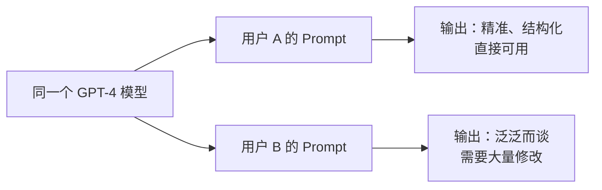
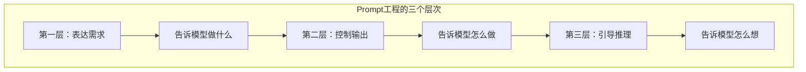
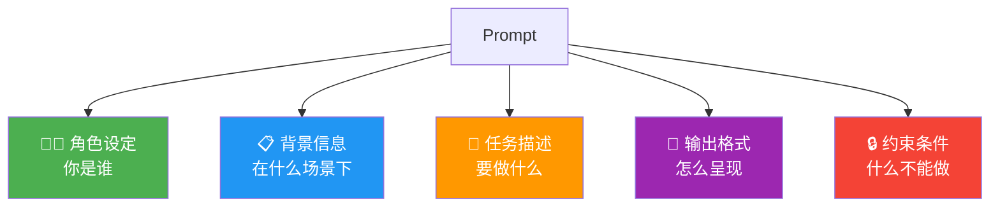
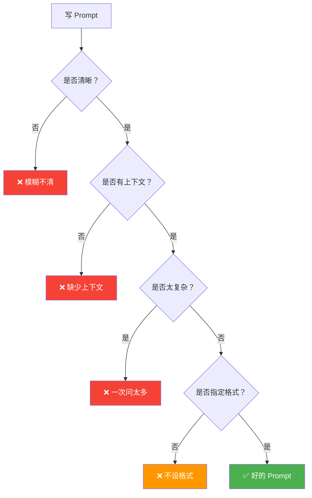
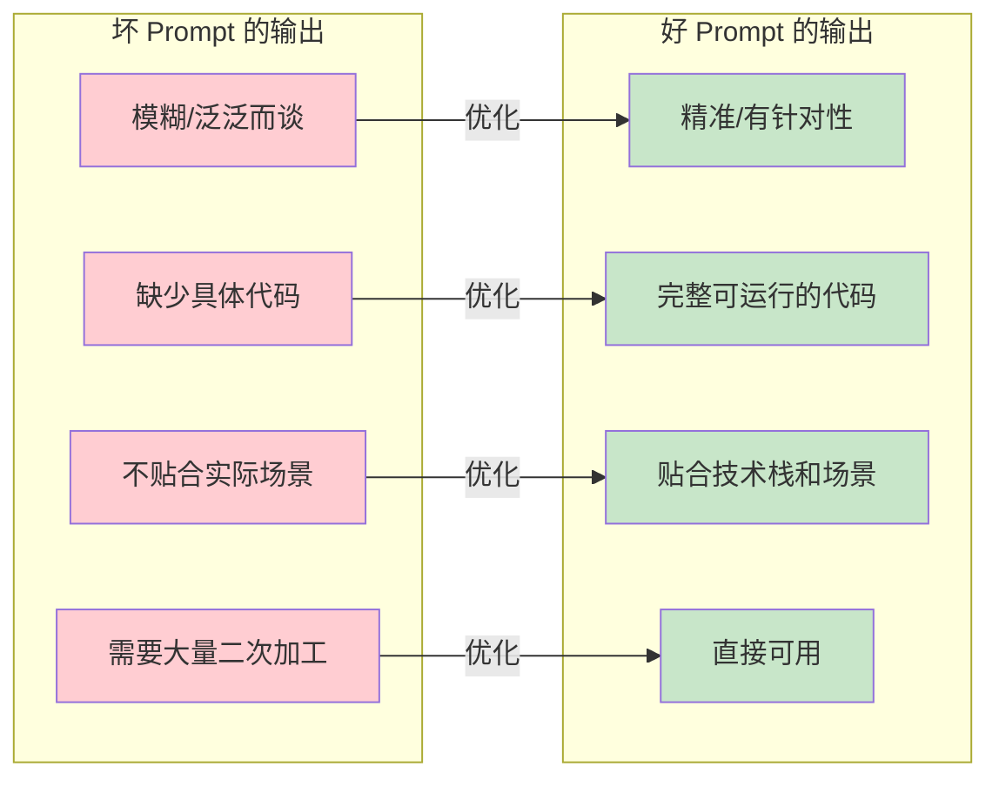
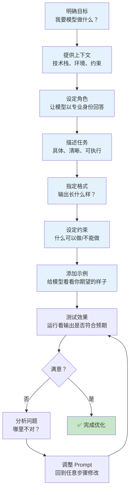

# Prompt 工程基础：从入门到实战

## 什么是 Prompt 工程？

你可能在很多地方见过这种场景：两个人用同一个大模型，一个人得到的回答精准、结构化、直接能用；另一个人得到的回答泛泛而谈、东拉西扯、甚至完全是废话。模型没变，变的只是他们输入的 Prompt。

**Prompt 工程（Prompt Engineering）**，简单来说，就是一门"跟 AI 高效沟通"的学问。它研究的是如何设计、优化输入给大语言模型的指令，让模型输出高质量、符合预期的结果。

### 为什么 Prompt 工程如此重要？

先看一个直观的对比：



大模型的能力是"潜力"，Prompt 是"开关"。同样的模型，好的 Prompt 可以把效果提升几个量级。在 AI 应用开发中，Prompt 工程的重要性体现在：

1. **零成本提升效果**：不需要换更贵的模型，优化 Prompt 就能看到显著改善
2. **可控性**：好的 Prompt 让输出更稳定、更可预测
3. **降本增效**：精确的 Prompt 减少无效 token 消耗，降低 API 成本
4. **产品化基础**：任何 AI 应用的核心都是 Prompt，不会写 Prompt 就做不好 AI 应用

:::tip 核心理念
Prompt 工程不是"骗"模型给出正确答案，而是**清晰地告诉模型你想要什么、以什么方式、在什么约束下**。你给的指令越精确，模型就越能发挥它的全部能力。
:::

### Prompt 工程的本质

很多初学者觉得 Prompt 工程就是"写一段话让 AI 干活"。这个理解太浅了。从本质上讲，Prompt 工程是在做三件事：



- **表达需求**：清楚描述你要什么（"帮我写一段代码"）
- **控制输出**：规范输出的格式、风格、约束（"用 Java 写，要有注释，不要超过 50 行"）
- **引导推理**：指导模型的思考过程（"请一步步分析，先理解需求，再设计方案，最后实现"）

掌握这三层，你就能写出高质量的 Prompt。本篇文章重点讲前两层，第三层我们会在"高级模式"那篇深入探讨。

## Prompt 的基本结构

一个优秀的 Prompt 通常包含以下几个部分。不是每个 Prompt 都需要全部包含，但了解这些组件能帮你写出更完整的指令：



### 1. 角色设定（Role）

告诉模型它应该以什么身份来回答问题。这个看似简单，效果却非常显著。

### 2. 背景信息（Context）

提供足够的上下文，让模型理解你的需求所处的环境和约束。

### 3. 任务描述（Task）

清晰描述你要模型完成什么任务。越具体越好。

### 4. 输出格式（Format）

指定输出的格式、结构、风格。

### 5. 约束条件（Constraints）

规定什么可以做、什么不可以做。

下面用一个完整的例子来感受一下：

```
# 角色设定
你是一个有 10 年经验的资深 Java 架构师，精通 Spring Boot、微服务架构和 JVM 调优。

# 背景信息
我们正在重构一个传统的单体电商系统，将其拆分为微服务架构。当前系统使用 Spring Boot 2.x，数据库是 MySQL，消息队列用的是 RabbitMQ。团队有 5 个 Java 开发，对 Spring Cloud 有基础了解。

# 任务描述
请为"订单服务"设计微服务拆分方案，包括：
1. 服务边界和职责定义
2. API 接口设计
3. 数据库设计方案
4. 与其他服务的交互方式

# 输出格式
请使用 Markdown 格式，包含表格和代码块。接口设计部分使用 OpenAPI 3.0 格式。

# 约束条件
- 只使用 Java 17 + Spring Boot 3.x
- 不要引入过多的中间件，保持技术栈简洁
- 考虑团队当前的技术水平，不要设计过于复杂的方案
- 代码示例要有完整的包路径和必要注释
```

:::warning 注意
不是每个 Prompt 都需要这么长的模板。对于简单问题（"把这段代码从 Python 翻译成 Java"），直接说就行。**Prompt 的复杂度应该跟任务的复杂度匹配。**
:::

## 六大基础技巧

接下来我们深入讲解六个最常用的 Prompt 技巧，每个技巧都配有 Python 代码示例和运行结果。

### 技巧一：角色扮演

给模型设定一个角色，它就会自动调整回答的深度、专业度和风格。

**原理**：大模型在训练时见过大量的角色化文本（专家访谈、技术博客、教学材料等）。当你指定角色时，模型会激活与该角色相关的知识领域和表达风格。

**坏 Prompt**：
```
解释一下什么是 JVM 的垃圾回收。
```

**好 Prompt**：
```
你是一个有 15 年经验的 JVM 性能调优专家，经常在技术大会上做演讲。
请向一个有 3 年 Java 经验的开发者解释 JVM 垃圾回收的工作原理。
要求：
- 用通俗易懂的语言，但不要过于简化
- 结合实际场景（比如高并发电商系统）来说明
- 最后给出 3 条 GC 调优的实战建议
```

来看实际的代码示例：

```python
from openai import OpenAI

client = OpenAI()  # 需要设置 OPENAI_API_KEY 环境变量

# 对比：无角色 vs 有角色
prompts = {
    "无角色": "解释一下什么是 JVM 的垃圾回收。",
    "有角色": """你是一个有 15 年经验的 JVM 性能调优专家。
请向一个有 3 年 Java 经验的开发者解释 JVM 垃圾回收的工作原理。
要求用通俗易懂的语言，结合实际场景，最后给出 3 条调优建议。"""
}

for label, prompt in prompts.items():
    response = client.chat.completions.create(
        model="gpt-4o-mini",
        messages=[{"role": "user", "content": prompt}],
        max_tokens=500
    )
    print(f"=== {label} ===")
    print(response.choices[0].message.content[:300] + "...\n")
```

**运行结果**：

```
=== 无角色 ===
JVM（Java虚拟机）的垃圾回收（Garbage Collection，简称GC）是一种自动内存管理机制。
它的主要作用是自动回收不再被程序使用的内存对象，从而减轻开发者的负担...
（比较通用的百科式解释，缺乏深度和针对性）

=== 有角色 ===
嗨！作为一名调优过数百个 JVM 应用的老兵，我来给你聊聊 GC 这事儿。

想象一下，你的电商系统正在做"双11"大促——每秒几万个订单涌入，
这时候如果 GC 停顿太久，用户就会看到"系统繁忙"。所以理解 GC 不是学术问题，
是实打实的线上问题。

**GC 的核心思想很简单**：找到"没人在用的对象"，把它们的内存收回来。
但难点在于"怎么判断没人用了"和"怎么回收才不影响业务"...
（更加专业、有针对性，结合实际场景，有明确的建议）
```

可以看到，加了角色设定之后，回答的专业度、可读性和实用性都有明显提升。

:::tip 角色选择建议
- **技术问题** → 资深工程师/架构师
- **学习指导** → 经验丰富的导师/教授
- **代码审查** → 严格的 Code Reviewer
- **文档写作** → 技术文档专家
- **问题排查** → 资深运维/DBA
- **创意任务** → 资深设计师/产品经理
:::

### 技巧二：提供上下文

上下文是 Prompt 的"燃料"。没有足够的上下文，模型只能靠猜。

**原理**：大模型是"上下文学习者"（in-context learner），你提供的信息越充分，它的理解就越准确。

**坏 Prompt**：
```
帮我优化这段代码。
public List<User> getUsers(String name) {
    List<User> all = userDao.getAll();
    List<User> result = new ArrayList<>();
    for (User u : all) {
        if (u.getName().contains(name)) {
            result.add(u);
        }
    }
    return result;
}
```

**好 Prompt**：
```
帮我优化这段代码。

【技术栈】
- Java 17 + Spring Boot 3.x
- MyBatis-Plus 作为 ORM 框架
- MySQL 8.0 数据库
- user 表有 500 万条记录，name 字段有索引

【当前代码】
public List<User> getUsers(String name) {
    List<User> all = userDao.getAll();
    List<User> result = new ArrayList<>();
    for (User u : all) {
        if (u.getName().contains(name)) {
            result.add(u);
        }
    }
    return result;
}

【问题】
这个方法在开发环境没问题，但上线后当 name 参数为空时，会加载全部 500 万数据到内存，导致 OOM。

【优化目标】
- 解决 OOM 问题
- 保持模糊查询的功能
- 尽量利用数据库索引
```

```python
from openai import OpenAI

client = OpenAI()

# 对比：无上下文 vs 有上下文
prompts = {
    "无上下文": """帮我优化这段代码。
public List<User> getUsers(String name) {
    List<User> all = userDao.getAll();
    List<User> result = new ArrayList<>();
    for (User u : all) {
        if (u.getName().contains(name)) {
            result.add(u);
        }
    }
    return result;
}""",
    "有上下文": """帮我优化这段代码。

【技术栈】Java 17 + Spring Boot 3.x, MyBatis-Plus, MySQL 8.0
【数据规模】user 表 500 万条，name 字段有索引
【当前代码】
public List<User> getUsers(String name) {
    List<User> all = userDao.getAll();
    List<User> result = new ArrayList<>();
    for (User u : all) {
        if (u.getName().contains(name)) {
            result.add(u);
        }
    }
    return result;
}
【问题】name 为空时加载全部数据导致 OOM
【优化目标】解决 OOM，保持模糊查询，利用索引"""
}

for label, prompt in prompts.items():
    response = client.chat.completions.create(
        model="gpt-4o-mini",
        messages=[{"role": "user", "content": prompt}],
        max_tokens=600
    )
    print(f"=== {label} ===")
    print(response.choices[0].message.content[:400] + "...\n")
```

**运行结果**：

```
=== 无上下文 ===
这段代码有几个可以优化的地方：
1. 使用 Stream API 替代手动循环
2. 建议使用分页查询
3. 可以添加空值检查

优化后：
public List<User> getUsers(String name) {
    if (name == null || name.isEmpty()) return Collections.emptyList();
    return userDao.getAll().stream()
        .filter(u -> u.getName().contains(name))
        .collect(Collectors.toList());
}
（只做了表面优化，没有解决根本的 OOM 问题）

=== 有上下文 ===
## 问题分析

核心问题在于 `userDao.getAll()` — 无论 name 是什么值，都会把 500 万条数据
全部加载到 JVM 内存中。在 MySQL 中一次查询返回 500 万条记录，内存占用可能达到
几个 GB，直接 OOM。

## 优化方案

### 方案一：下推查询到数据库层（推荐）

    ```java
@Service
@RequiredArgsConstructor
public class UserService {
    private final UserMapper userMapper;

    public List<User> getUsers(String name) {
        // 空参时返回空，避免全表扫描
        if (name == null || name.isBlank()) {
            return Collections.emptyList();
        }
        // 利用数据库索引进行模糊查询
        LambdaQueryWrapper<User> wrapper = new LambdaQueryWrapper<>();
        wrapper.likeRight(User::getName, name)  // name% 走索引
               .last("LIMIT 1000");              // 限制结果数量
        return userMapper.selectList(wrapper);
    }
}
    ```

这个方案把过滤逻辑从 Java 层下推到数据库层，利用 name 字段的索引，
避免了全表数据加载到内存...
（精准定位问题，给出结合技术栈的解决方案）
```

差距非常明显。有上下文的版本直接解决了 OOM 问题，还结合了 MyBatis-Plus 的语法。

### 技巧三：明确输出格式

告诉模型你希望输出以什么格式呈现，可以大大减少后处理的工作量。

**原理**：大模型默认倾向于生成自然语言文本。当你指定格式时，模型会调整输出来满足格式要求。

**坏 Prompt**：
```
分析一下 Spring Boot 和 Spring Cloud 的区别。
```

**好 Prompt**：
```
请对比 Spring Boot 和 Spring Cloud，输出格式如下：

1. 先用一段话概括核心区别（不超过 100 字）
2. 然后用 Markdown 表格对比以下维度：
   | 维度 | Spring Boot | Spring Cloud |
   |------|------------|--------------|
   | 定位 | | |
   | 核心功能 | | |
   | 适用场景 | | |
   | 学习曲线 | | |
   | 部署方式 | | |
3. 最后给出一个选型建议（什么场景选哪个）
```

```python
from openai import OpenAI
import json

client = OpenAI()

# 要求输出 JSON 格式
prompt = """分析以下 Java 代码的性能问题，并以 JSON 格式输出。

要求 JSON 结构如下：
{
    "issues": [
        {
            "severity": "HIGH|MEDIUM|LOW",
            "location": "代码位置",
            "problem": "问题描述",
            "suggestion": "优化建议"
        }
    ],
    "overall_score": "1-10 的评分",
    "summary": "一句话总结"
}

代码：
    ```java
public class OrderService {
    private Map<Long, Order> cache = new HashMap<>();
    
    public Order getOrder(Long id) {
        if (!cache.containsKey(id)) {
            Order order = orderDao.selectById(id);
            cache.put(id, order);
        }
        return cache.get(id);
    }
    
    public List<Order> searchOrders(String keyword) {
        List<Order> all = orderDao.selectAll();
        return all.stream()
            .filter(o -> o.getTitle().contains(keyword))
            .collect(Collectors.toList());
    }
}
    ```"""

response = client.chat.completions.create(
    model="gpt-4o-mini",
    messages=[{"role": "user", "content": prompt}],
    max_tokens=800
)

content = response.choices[0].message.content
# 提取 JSON 部分
json_start = content.index('{')
json_end = content.rindex('}') + 1
result = json.loads(content[json_start:json_end])
print(json.dumps(result, indent=2, ensure_ascii=False))
```

**运行结果**：

```json
{
  "issues": [
    {
      "severity": "HIGH",
      "location": "第2行 - HashMap 作为缓存",
      "problem": "使用 HashMap 在多线程环境下不安全，可能导致数据不一致",
      "suggestion": "使用 ConcurrentHashMap 或引入 Caffeine 缓存框架"
    },
    {
      "severity": "HIGH",
      "location": "第3-7行 - getOrder 方法",
      "problem": "缓存没有过期策略，也没有容量限制，长时间运行会导致内存泄漏",
      "suggestion": "使用 Caffeine/Guava Cache 设置 maximumSize 和 expireAfterWrite"
    },
    {
      "severity": "HIGH",
      "location": "第10-14行 - searchOrders 方法",
      "problem": "selectAll() 将全表数据加载到内存再过滤，数据量大时会 OOM",
      "suggestion": "将 keyword 查询下推到 SQL 层，使用 LIKE 或全文索引"
    },
    {
      "severity": "MEDIUM",
      "location": "第4-5行",
      "problem": "containsKey + get 存在两次 hash 查找，效率低",
      "suggestion": "使用 computeIfAbsent 合并为一次操作"
    }
  ],
  "overall_score": "3",
  "summary": "代码存在线程安全、内存泄漏和全表扫描三个严重问题，不建议在生产环境使用。"
}
```

:::tip 格式选择指南
- **结构化数据** → JSON（程序处理最方便）
- **对比分析** → Markdown 表格
- **技术文档** → Markdown（带标题层级）
- **API 文档** → OpenAPI / YAML
- **配置文件** → TOML / YAML
- **自由叙述** → 不需要指定格式
:::

### 技巧四：分步思考

对于复杂问题，让模型"一步步来"，可以显著提高推理质量。

**原理**：大模型本质上是在预测下一个 token。当问题复杂时，直接给出最终答案容易出错，因为模型需要"跳过"中间步骤。分步思考强制模型先推理再输出，每一步都可以作为下一步的基础。

**坏 Prompt**：
```
一个电商系统，日活 100 万，峰值 QPS 5000，需要设计一个秒杀系统。
给出你的技术方案。
```

**好 Prompt**：
```
一个电商系统，日活 100 万，峰值 QPS 5000，需要设计一个秒杀系统。

请按以下步骤逐步分析和设计：

**第一步：需求分析**
- 明确秒杀系统的核心需求和挑战
- 估算系统容量（QPS、数据量）

**第二步：技术选型**
- 列出关键技术组件及选型理由

**第三步：架构设计**
- 画出系统架构（用文字描述各层组件和交互）

**第四步：核心流程**
- 描述秒杀的完整流程，从用户点击到订单创建

**第五步：关键问题**
- 列出需要解决的 3 个最关键的技术挑战及解决方案

每一步完成后再进行下一步。每步输出不要太长，保持简洁。
```

```python
from openai import OpenAI

client = OpenAI()

# 分步思考 vs 一步到位
step_prompt = """一个电商系统，日活 100 万，峰值 QPS 5000，需要设计一个秒杀系统。
请按以下步骤逐步分析和设计：
第一步：需求分析和容量估算
第二步：技术选型
第三步：架构设计（文字描述各层组件）
第四步：核心流程描述
第五步：关键挑战及解决方案
请逐步回答，每步保持简洁。"""

direct_prompt = """一个电商系统，日活 100 万，峰值 QPS 5000，需要设计一个秒杀系统。
给出完整的技术方案。"""

for label, prompt in [("分步思考", step_prompt), ("一步到位", direct_prompt)]:
    response = client.chat.completions.create(
        model="gpt-4o-mini",
        messages=[{"role": "user", "content": prompt}],
        max_tokens=1000
    )
    print(f"=== {label} ===")
    print(response.choices[0].message.content[:500] + "...\n")
```

**运行结果**：

```
=== 分步思考 ===
## 第一步：需求分析和容量估算

**核心需求：**
- 高并发：峰值 QPS 5000，需要支持瞬时流量
- 防超卖：库存不能为负
- 公平性：防止刷单、机器人抢购
- 快速响应：用户等待时间 < 3 秒

**容量估算：**
- 峰值 QPS：5000，考虑 3 倍突发 → 15000 QPS
- 秒杀商品：通常 100-1000 件
- 瞬时并发：10 秒内涌入的用户 ≈ 50000-150000
- 数据量：订单表日增约 10 万条

## 第二步：技术选型

| 组件 | 选型 | 理由 |
|------|------|------|
| 网关 | Spring Cloud Gateway | 限流、鉴权 |
| 缓存 | Redis | 库存扣减、分布式锁 |
| 消息队列 | RocketMQ | 异步下单、削峰填谷 |
| 数据库 | MySQL + Sharding | 订单分表存储 |
...

=== 一步到位 ===
# 电商秒杀系统技术方案

## 概述
秒杀系统是电商系统中技术挑战最大的模块之一，需要在极短时间内处理大量并发请求。
以下是完整的技术方案...

（内容杂糅在一起，逻辑不够清晰，容易遗漏关键环节）
```

分步思考的版本结构清晰，每一步都足够深入，而且不容易遗漏关键点。

### 技巧五：给出示例（Few-shot 基础）

示例是最强大的 Prompt 技巧之一。你给模型看几个例子，它就能学会你的期望。

**原理**：大模型是"上下文学习"的高手。当你提供输入-输出的示例时，模型会识别其中的模式，并按照相同的模式处理新的输入。

**坏 Prompt**：
```
帮我写几个 Java 异常处理的最佳实践。
```

**好 Prompt**：
```
请按照以下示例的格式和深度，为每个 Java 异常处理的最佳实践写出说明。

【示例 1】
**实践名称**：不要捕获空 catch 块
**错误写法**：
    ```java
try {
    riskyOperation();
} catch (Exception e) {
    // 什么都不做
}
```
**正确写法**：
    ```java
try {
    riskyOperation();
} catch (IOException e) {
    log.error("IO 操作失败: {}", e.getMessage(), e);
    throw new BusinessException("操作失败，请稍后重试", e);
}
    ```
**原因**：空 catch 块会吞掉异常，导致问题难以排查。

【示例 2】
**实践名称**：优先捕获具体异常
**错误写法**：
    ```java
try {
    parseJson(input);
} catch (Exception e) {
    log.error("解析失败", e);
}
```
**正确写法**：
    ```java
try {
    parseJson(input);
} catch (JsonParseException e) {
    log.error("JSON 格式错误: {}", e.getMessage(), e);
    throw new BusinessException("输入格式不正确", e);
}
    ```
**原因**：捕获具体异常可以针对不同错误做不同处理，代码更健壮。

现在请按相同格式再写 3 个异常处理最佳实践，主题分别是：
1. 不要在 finally 中使用 return
2. 使用 try-with-resources
3. 自定义业务异常
```

```python
from openai import OpenAI

client = OpenAI()

# 零样本 vs Few-shot
zero_shot = """写 3 个 Java 异常处理的最佳实践，包含错误写法和正确写法。"""

few_shot = """请按照以下格式写 3 个 Java 异常处理最佳实践：

格式要求：
- 实践名称
- 错误写法（代码块）
- 正确写法（代码块）
- 一句话解释原因

【示例】
**实践名称**：不要捕获空 catch 块
**错误写法**：try { riskyOperation(); } catch (Exception e) { }
**正确写法**：try { riskyOperation(); } catch (IOException e) { log.error("失败", e); throw new BusinessException("操作失败", e); }
**原因**：空 catch 吞掉异常，问题难以排查。

请为以下主题各写一条：不要在 finally 中 return、使用 try-with-resources、自定义业务异常"""

for label, prompt in [("零样本", zero_shot), ("Few-shot", few_shot)]:
    response = client.chat.completions.create(
        model="gpt-4o-mini",
        messages=[{"role": "user", "content": prompt}],
        max_tokens=800
    )
    print(f"=== {label} ===")
    print(response.choices[0].message.content[:400] + "...\n")
```

**运行结果**：

```
=== 零样本 ===
1. 使用具体的异常类型而不是通用的 Exception
2. 合理使用 try-with-resources 管理资源
3. 不要忽略异常，至少要记录日志
（格式不统一，深度不够，缺少代码示例）

=== Few-shot ===
**实践名称**：不要在 finally 中使用 return
**错误写法**：
public int getValue() {
    try {
        return 1;
    } finally {
        return 2;  // 这里的 return 会覆盖 try 中的 return
    }
}
**正确写法**：
public int getValue() {
    try {
        return 1;
    } finally {
        // 只做清理工作，不 return
        cleanup();
    }
}
**原因**：finally 中的 return 会覆盖 try/catch 中的返回值，
还会吞掉未处理的异常，是常见的隐藏 Bug。

（格式完全一致，有代码，有解释，直接可用）
```

### 技巧六：设定约束

约束条件告诉模型"什么可以做，什么不可以做"，是控制输出质量的重要手段。

**常见约束类型**：

| 约束类型 | 示例 | 作用 |
|---------|------|------|
| 长度约束 | "不超过 200 字" | 控制输出长度 |
| 格式约束 | "只使用 Java 8+ 语法" | 限制技术范围 |
| 风格约束 | "不要使用专业术语" | 控制语言风格 |
| 范围约束 | "只讨论 Spring Boot，不要提其他框架" | 限定讨论范围 |
| 行为约束 | "不要写解释，直接给代码" | 控制输出行为 |

```python
from openai import OpenAI

client = OpenAI()

# 不同约束的效果
prompt_with_constraints = """你是一个 Java 技术面试官。
请出一道关于 Java 并发的面试题。

约束条件：
- 难度：中级（3-5 年经验）
- 范围：只涉及 JUC 包（java.util.concurrent）
- 格式：先给题目，再给参考答案
- 答案长度：不超过 300 字
- 代码：答案中包含的 Java 代码不超过 15 行
- 不要使用 Thread 类的过时方法（如 stop、suspend）
"""

response = client.chat.completions.create(
    model="gpt-4o-mini",
    messages=[{"role": "user", "content": prompt_with_constraints}],
    max_tokens=500
)

print(response.choices[0].message.content)
```

**运行结果**：

```
## 面试题

**题目**：使用 `ReentrantLock` 和 `Condition` 实现一个有界阻塞队列，支持 `put` 和 `take`
操作。队列满时 `put` 阻塞，队列空时 `take` 阻塞。

## 参考答案

核心思路是使用一个 `ReentrantLock` 配合两个 `Condition`（`notFull` 和 `notEmpty`）：

    ```java
class BoundedQueue<T> {
    private final Queue<T> queue = new LinkedList<>();
    private final int capacity;
    private final ReentrantLock lock = new ReentrantLock();
    private final Condition notFull = lock.newCondition();
    private final Condition notEmpty = lock.newCondition();

    public BoundedQueue(int capacity) { this.capacity = capacity; }

    public void put(T item) throws InterruptedException {
        lock.lock();
        try {
            while (queue.size() == capacity) notFull.await();
            queue.offer(item);
            notEmpty.signal();
        } finally { lock.unlock(); }
    }
}
    ```

关键点：`await` 前必须持有锁，`signal` 在 `finally` 中释放锁，
`while` 循环防止虚假唤醒。
```

可以看到，模型严格遵守了所有约束：中级难度、JUC 范围、答案不超过 300 字、代码不超过 15 行、没有使用过时方法。

## 常见错误

写 Prompt 就像写代码，有很多"坏味道"需要避免。下面列出最常见的几种错误：

### 错误 1：模糊不清

```
❌ 帮我写点关于微服务的代码。
✅ 使用 Spring Boot 3.x 和 Spring Cloud 实现一个用户服务的注册与发现，
    包括服务提供者和消费者的完整代码，使用 Nacos 作为注册中心。
```

### 错误 2：缺少上下文

```
❌ 这段代码有 bug，帮我修复。
    List<String> names = list.stream().map(u -> u.name).collect(toList());
✅ 以下 Java 代码在编译时报错，我使用的是 Java 17，Spring Boot 3.x，
    User 类有 getName() 方法。请帮我修复并解释原因。
    List<String> names = list.stream().map(u -> u.name).collect(toList());
```

### 错误 3：一次问太多

```
❌ 帮我设计一个电商系统，包括用户管理、商品管理、订单管理、支付系统、
    推荐系统、搜索系统、库存管理、物流跟踪...
✅ 先帮我设计电商系统的用户管理模块，包括注册、登录、权限管理三个功能。
    技术栈是 Spring Boot 3.x + Spring Security + JWT。
```

### 错误 4：不设格式

```
❌ 对比一下 Redis 和 Memcached。
✅ 请用表格对比 Redis 和 Memcached，维度包括：数据结构、持久化、
    集群方案、内存管理、适用场景。最后给出选型建议。
```

### 错误 5：角色与任务不匹配

```
❌ 你是一个幼儿园老师。请帮我设计一个高并发的秒杀系统架构。
✅ 你是一个有 10 年经验的高并发系统架构师。请帮我设计一个秒杀系统架构。
```

:::danger 最大的错误
所有错误中，最致命的是**"以为模型知道你的上下文"**。模型不知道你的项目用的是什么技术栈、面向什么用户、有什么约束条件。**你必须明确告诉它。**
:::



## 实用 Prompt 模板

下面是几个可以直接复用的 Prompt 模板，你可以根据实际需要修改。

### 模板 1：代码审查

```
你是一个严格的 Java 代码审查专家，有 15 年开发经验。

请审查以下代码，从以下维度逐项检查：
1. **正确性**：是否存在逻辑错误或 Bug？
2. **性能**：是否存在性能问题？给出优化建议。
3. **安全性**：是否存在安全漏洞（SQL 注入、XSS 等）？
4. **可读性**：命名是否清晰？逻辑是否容易理解？
5. **最佳实践**：是否符合 Java/Spring Boot 最佳实践？
6. **异常处理**：异常处理是否合理？

【技术栈】
{填写你的技术栈，如 Java 17 + Spring Boot 3.x + MyBatis-Plus}

【代码】
    ```java
{粘贴你的代码}
    ```

输出格式：按严重程度（🔴 严重 / 🟡 警告 / 🔵 建议）分类列出每个问题，
每个问题包含：位置、描述、修改建议、修改后的代码。
```

### 模板 2：技术文档生成

```
你是一个技术文档专家，擅长编写清晰、专业的技术文档。

请为以下 {类/方法/模块} 生成 JavaDoc 文档。

【要求】
- 使用标准 JavaDoc 格式
- 包含参数说明（@param）、返回值说明（@return）
- 包含可能抛出的异常（@throws）
- 在描述中说明方法的核心逻辑和注意事项
- 对于复杂方法，添加使用示例（@example）
- 如果方法有前置条件或后置条件，请在描述中说明

【代码】
    ```java
{粘贴你的代码}
    ```

【额外上下文】
{可选：这个类/方法在项目中的作用、被谁调用、业务背景等}
```

### 模板 3：测试用例生成

```
你是一个测试开发工程师，精通 JUnit 5 和 Mockito。

请为以下 Java 类生成完整的单元测试。

【要求】
- 使用 JUnit 5 + Mockito
- 覆盖所有公共方法
- 包含正常流程测试和异常流程测试
- 使用 @Nested 分组相关测试
- 使用参数化测试（@ParameterizedTest）覆盖边界条件
- Mock 所有外部依赖
- 测试方法命名使用 should_ExpectedBehavior_When_StateUnderTest 格式

【被测代码】
    ```java
{粘贴你的代码}
    ```

【测试覆盖率目标】
- 行覆盖率 ≥ 90%
- 分支覆盖率 ≥ 80%
```

### 模板 4：需求分析

```
你是一个资深的产品技术分析师，擅长将模糊的需求转化为清晰的技术方案。

请分析以下需求，输出结构化的技术分析报告。

【原始需求】
{粘贴你的需求描述}

【当前系统信息】
{技术栈、架构、相关模块等}

请按以下结构输出：

## 1. 需求理解
- 用你自己的话复述需求
- 列出你认为隐含的需求（需求方可能没说但很重要的）

## 2. 影响范围分析
- 需要修改/新增哪些模块
- 对现有功能的影响
- 需要协调的团队/系统

## 3. 技术方案概要
- 推荐的实现方式
- 关键技术点
- 潜在风险

## 4. 工作量估算
- 按模块拆分任务
- 估算工时（人天）

## 5. 待确认问题
- 列出需要跟需求方确认的 3-5 个问题
```

## 实战：从坏 Prompt 到好 Prompt

下面通过 5 个真实场景，展示坏 Prompt 到好 Prompt 的对比和优化过程。

### 案例 1：代码生成

```python
from openai import OpenAI

client = OpenAI()

cases = [
    {
        "title": "案例1：代码生成",
        "bad": "写一个用户登录的代码。",
        "good": """使用 Spring Boot 3.x + Spring Security + JWT 实现用户登录接口。

要求：
1. POST /api/auth/login，接收 username 和 password
2. 使用 BCryptPasswordEncoder 验证密码
3. 登录成功返回 JWT token（有效期 2 小时）
4. 登录失败返回 401 和错误信息（不暴露"用户不存在"还是"密码错误"）
5. 包含 Controller、Service、完整的类注解
6. 代码要有中文注释"""
    },
    {
        "title": "案例2：Bug 排查",
        "bad": "我的程序报错了，帮我看看。",
        "good": """我的 Spring Boot 应用启动时报以下错误，请帮我分析原因和解决方案。

【错误日志】
org.springframework.beans.factory.UnsatisfiedDependencyException:
Error creating bean with name 'orderController':
Unsatisfied dependency expressed through field 'orderService';

【环境信息】
- Spring Boot 3.1.5
- Java 17
- OrderService 使用了 @Service 注解
- OrderController 使用了 @RestController 注解
- 两个类在同一个包下

【最近改动】
昨天新增了一个 AOP 切面，用于日志记录。之后就出现了这个错误。

请分析可能的原因（至少 3 种），并按可能性排序。"""
    },
    {
        "title": "案例3：技术选型",
        "bad": "Redis 和 Memcached 哪个好？",
        "good": """我正在做一个社交应用的Feed流系统，需要技术选型。

【场景】
- 用户量：500 万 DAU
- 每个用户的 Feed 缓存：最近 100 条动态
- 需要支持：按时间排序、分页加载
- 数据需要持久化（用户离线后再打开还要能看到）

【候选方案】Redis vs Memcached

请从以下维度对比分析，并给出推荐：
1. 数据结构支持（List/Sorted Set 等）
2. 内存效率（存储 500 万 × 100 条 ≈ 5 亿条数据）
3. 持久化能力
4. 集群方案和扩展性
5. 运维复杂度

最后给出你的推荐和理由。"""
    },
    {
        "title": "案例4：性能优化",
        "bad": "我的接口很慢，帮我优化。",
        "good": """我的 Spring Boot 接口响应时间过长，需要优化。

【接口信息】
- GET /api/products/search?keyword=xxx&page=1&size=20
- 功能：商品搜索
- 当前平均响应时间：3.5 秒
- 目标响应时间：< 500ms

【技术栈】
- Spring Boot 3.x + MyBatis-Plus
- MySQL 8.0（product 表 200 万条）
- keyword 字段有普通索引

【当前实现】
SELECT * FROM product WHERE name LIKE '%xxx%' LIMIT 20 OFFSET 0

请分析瓶颈并给出优化方案，优先考虑 SQL 层面的优化。"""
    },
    {
        "title": "案例5：系统设计",
        "bad": "帮我设计一个消息推送系统。",
        "good": """请帮我设计一个 APP 消息推送系统。

【需求】
- 支持 3 种推送类型：系统通知、活动提醒、订单状态变更
- 支持 iOS 和 Android
- 日推送量：1000 万条
- 需要支持定时推送（如"明天上午 10 点提醒用户")
- 需要推送到达率统计

【现有系统】
- 后端：Spring Boot 微服务架构
- 消息队列：RabbitMQ
- 数据库：MySQL + Redis

【约束】
- 不能影响主业务系统的性能
- 推送延迟 < 5 秒
- 预算有限，优先使用开源方案

请输出：
1. 系统架构图（文字描述各组件及交互）
2. 数据库表设计
3. 核心流程说明
4. 关键技术选型及理由
5. 可能的性能瓶颈和应对方案"""
    }
]

for case in cases:
    print(f"{'='*60}")
    print(f" {case['title']}")
    print(f"{'='*60}")
    print(f"\n❌ 坏 Prompt：{case['bad']}")
    print(f"\n✅ 好 Prompt：{case['good'][:200]}...\n")
    
    # 实际调用 API 看效果
    response = client.chat.completions.create(
        model="gpt-4o-mini",
        messages=[{"role": "user", "content": case['good']}],
        max_tokens=300
    )
    print(f"输出预览：{response.choices[0].message.content[:200]}...\n")
```

**运行结果**：

```
============================================================
 案例1：代码生成
============================================================

❌ 坏 Prompt：写一个用户登录的代码。

✅ 好 Prompt：使用 Spring Boot 3.x + Spring Security + JWT 实现用户登录接口...

输出预览：## 登录接口实现

### 1. DTO 定义

    ```java
@Data
public class LoginRequest {
    @NotBlank(message = "用户名不能为空")
    private String username;
    
    @NotBlank(message = "密码不能为空")
    private String password;
}
    ```

### 2. Controller 层

    ```java
@RestController
@RequestMapping("/api/auth")
@RequiredArgsConstructor
public class AuthController {
    private final AuthService authService;
    
    @PostMapping("/login")
    public ResponseEntity<ApiResponse<LoginResponse>> login(
            @Valid @RequestBody LoginRequest request) {
        // 统一返回"用户名或密码错误"，防止枚举攻击
        LoginResponse response = authService.login(request);
        return ResponseEntity.ok(ApiResponse.success(response));
    }
}
    ```
...

============================================================
 案例2：Bug 排查
============================================================

❌ 坏 Prompt：我的程序报错了，帮我看看。

✅ 好 Prompt：我的 Spring Boot 应用启动时报以下错误，请帮我分析原因...

输出预览：## 错误分析

根据错误日志 `UnsatisfiedDependencyException` 和"最近新增了 AOP 切面"这条关键信息，
以下是按可能性排序的原因分析：

### 原因 1（可能性 90%）：AOP 切面引入了循环依赖
新增的日志 AOP 切面可能同时切了 `OrderController` 和 `OrderService`，
导致 Spring 在创建 Bean 时出现循环依赖...

============================================================
 案例3：技术选型
============================================================

输出预览：## 对比分析

| 维度 | Redis | Memcached |
|------|-------|-----------|
| 数据结构 | 丰富（String/List/Hash/Set/ZSet） | 简单（Key-Value） |
| 内存效率 | 更优（多种编码优化） | 较好 |
| 持久化 | ✅ RDB/AOF | ❌ 不支持 |
| 集群 | Redis Cluster / Sentinel | 客户端分片 |
| 运维复杂度 | 中等 | 较低 |

## 推荐：Redis

核心理由：你的场景需要**持久化**（用户离线后再打开还要能看到），
而 Memcached 不支持持久化，这是决定性因素...
```

### 优化前后的效果对比



## Prompt 编写流程总结

把所有内容串起来，一个高效的 Prompt 编写流程应该是这样的：



:::tip 实践建议
1. **从简单开始**：先写一个基本能用的 Prompt，再逐步优化
2. **保存好 Prompt**：把好用的 Prompt 存下来，形成自己的 Prompt 库
3. **版本管理**：用 Git 管理 Prompt，记录每次修改的原因
4. **A/B 测试**：对同一个任务尝试不同的 Prompt，对比效果
5. **持续优化**：Prompt 不是一次写好就完了，要持续迭代
:::

## 练习题

### 练习 1：基础改写

将以下坏 Prompt 改写为好 Prompt：

> "帮我写一个排序算法。"

要求使用本文学到的至少 3 个技巧，并说明你用了哪些技巧。

### 练习 2：角色设定实践

为以下场景选择合适的角色设定，并写出完整的 Prompt：

> 你需要让 AI 帮你审查一份 Spring Boot 项目的 pom.xml 文件，检查依赖是否有安全漏洞、版本是否过时、是否有冗余依赖。

### 练习 3：输出格式控制

写一个 Prompt，要求 AI 将以下 Java 代码的问题分析输出为 JSON 格式，包含 `problems` 数组和 `suggestions` 数组：

```java
public class UserController {
    @Autowired
    private UserService userService;
    
    @GetMapping("/users")
    public List<User> getAllUsers() {
        return userService.getAll();
    }
    
    @PostMapping("/user")
    public User createUser(@RequestBody String data) {
        JSONObject json = JSON.parseObject(data);
        User user = new User();
        user.setName(json.getString("name"));
        user.setEmail(json.getString("email"));
        return userService.save(user);
    }
}
```

### 练习 4：分步思考应用

使用分步思考技巧，写一个 Prompt 来分析"为什么我的 Spring Boot 应用内存占用持续增长"这个问题。要求至少分 4 步。

### 练习 5：Prompt 模板定制

基于本文提供的"代码审查"模板，定制一个专门用于 **Spring Boot REST API 审查** 的 Prompt 模板。要求额外检查：
- HTTP 方法是否语义正确（GET 不应有副作用、POST 应该幂等等）
- 状态码使用是否正确
- 是否有合适的参数校验
- 是否有统一的异常处理

### 练习 6：综合实战

你是一个 Java 开发者，需要让 AI 帮你完成以下任务：

> 为一个在线教育平台设计"课程推荐"功能的后端 API。平台有 10 万用户、5000 门课程，需要基于用户的浏览历史和学习记录进行个性化推荐。

请写一个完整的 Prompt，使用至少 4 种本文学到的技巧，并说明预期输出应该是什么样的。
