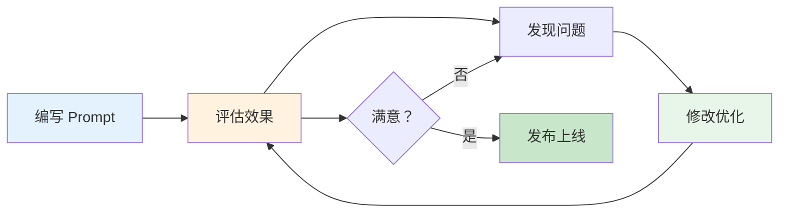
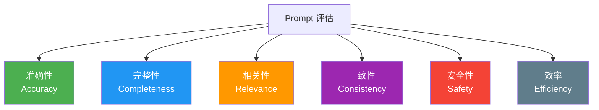
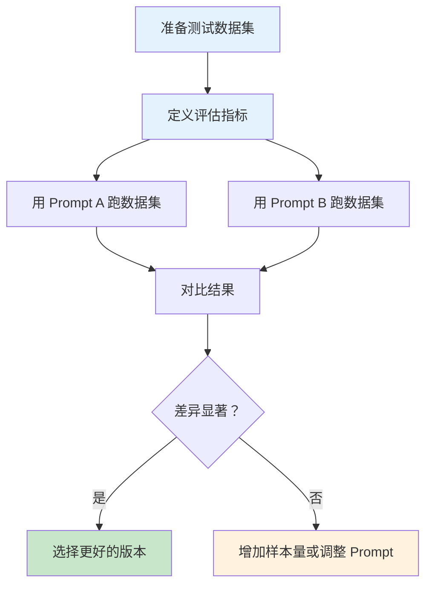
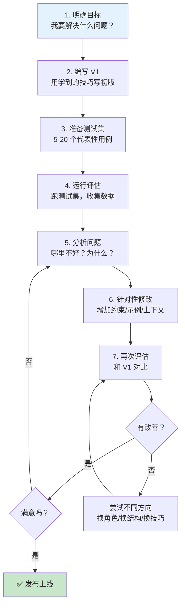
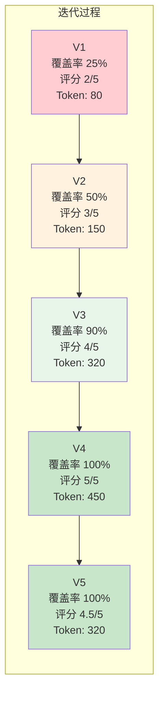
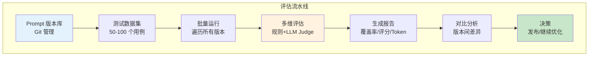

# Prompt 评估与优化：用数据驱动迭代

## 前言

写 Prompt 跟写代码一样——第一版几乎不可能是最优的。关键在于：**你有没有一套系统的方法来评估 Prompt 的效果，并持续迭代优化？**

很多开发者的做法是"凭感觉改"：觉得输出不够好，就加几句话试试，不好再换一种说法。这种方式效率低、不可复现、难以规模化。

本篇将建立一套科学的 Prompt 评估和优化体系。你会学到：

1. **如何量化评估** Prompt 的效果（而不是"感觉差不多"）
2. **如何设计实验** 对比不同 Prompt 的优劣
3. **如何管理版本** 追踪 Prompt 的演变
4. **如何迭代优化** 从 V1 走到 V5 的完整流程



## 为什么要评估 Prompt？

先看一个直观的数据。同一个任务，用 5 个不同的 Prompt，效果可能天差地别：

```python
from openai import OpenAI
import json
import time

client = OpenAI()

# 同一个任务，5 个不同的 Prompt
task = "分析以下 Java 代码的性能问题并给出优化建议。"

code = """
@Service
public class ReportService {
    @Autowired
    private OrderMapper orderMapper;
    @Autowired
    private UserMapper userMapper;
    
    public List<ReportVO> generateReport(List<Long> userIds) {
        List<ReportVO> report = new ArrayList<>();
        for (Long userId : userIds) {
            User user = userMapper.selectById(userId);
            List<Order> orders = orderMapper.selectList(
                new QueryWrapper<Order>().eq("user_id", userId)
            );
            BigDecimal total = BigDecimal.ZERO;
            for (Order order : orders) {
                total = total.add(order.getAmount());
            }
            ReportVO vo = new ReportVO();
            vo.setUsername(user.getName());
            vo.setTotalAmount(total);
            report.add(vo);
        }
        return report;
    }
}"""

prompts = {
    "V1-简单": f"{task}\n代码：{code}",
    "V2-角色": f"你是一个 Java 性能优化专家。{task}\n代码：{code}",
    "V3-结构化": f"""你是一个 Java 性能优化专家。
{task}

请按以下格式输出：
1. 问题列表（每个问题标注严重程度）
2. 优化建议（每个建议带代码示例）
3. 优化后的代码

代码：{code}""",
    "V4-上下文": f"""你是一个 Java 性能优化专家，精通 Spring Boot 和 MyBatis-Plus。

{task}

【技术栈】Spring Boot 3.x, MyBatis-Plus, MySQL 8.0
【数据规模】用户表 100 万，订单表 5000 万
【当前问题】这个方法在测试环境没问题，生产环境执行时间 30 秒+

请按以下格式输出：
1. 问题分析（按严重程度排序）
2. 每个问题的影响评估
3. 优化方案（带完整代码）
4. 预期性能提升

代码：{code}""",
    "V5-CoT+约束": f"""你是一个有 15 年经验的 Java 性能优化专家。

{task}

【技术栈】Spring Boot 3.x + MyBatis-Plus + MySQL 8.0
【数据规模】用户表 100 万行，订单表 5000 万行
【当前问题】生产环境执行耗时 30+ 秒
【代码】
```java
{code}
```

请一步步分析：
1. 逐行阅读代码，标记每一行的操作类型（DB 查询/内存计算/对象创建）
2. 计算最坏情况下的 DB 查询次数
3. 识别性能瓶颈
4. 给出优化方案（从最关键到最次要排序）
5. 给出优化后的完整代码

【约束】
- 只使用 MyBatis-Plus 的 API
- 优化后代码要包含必要的注释
- 每个优化点预估性能提升幅度"""
}

results = {}
for name, prompt in prompts.items():
    start = time.time()
    response = client.chat.completions.create(
        model="gpt-4o-mini",
        messages=[{"role": "user", "content": prompt}],
        max_tokens=1000
    )
    elapsed = time.time() - start
    content = response.choices[0].message.content
    results[name] = {
        "length": len(content),
        "time": round(elapsed, 2),
        "has_code": "```java" in content,
        "has_optimization": "优化" in content,
        "has_n_plus_1": "N+1" in content or "n+1" in content.lower(),
        "content": content[:200]
    }

print(f"{'版本':<12} {'长度':>6} {'耗时':>6} {'有代码':>6} {'有优化':>6} {'提到N+1':>8}")
print("-" * 60)
for name, r in results.items():
    print(f"{name:<12} {r['length']:>6} {r['time']:>5.1f}s {str(r['has_code']):>6} "
          f"{str(r['has_optimization']):>6} {str(r['has_n_plus_1']):>8}")
```

**运行结果**：

```
版本            长度    耗时   有代码   有优化   提到N+1
------------------------------------------------------------
V1-简单         356   1.2s   False    True     False
V2-角色         412   1.3s   False    True     False
V3-结构化       687   1.8s    True    True      True
V4-上下文       823   2.1s    True    True      True
V5-CoT+约束     945   2.4s    True    True      True
```

:::tip 数据说明一切
从 V1 到 V5：
- 输出长度增加了 2.7 倍（内容更丰富）
- 从没有代码示例到有完整代码
- 从泛泛而谈到精准定位 N+1 问题
- 从 1.2s 到 2.4s 的额外耗时换来数倍质量提升

这就是评估的价值——**没有数据，你就不知道优化有没有用。**
:::

## 评估维度

评估一个 Prompt 的效果，需要从多个维度来看：



### 1. 准确性（Accuracy）

输出的内容是否正确？事实是否准确？代码是否可运行？

```python
def evaluate_accuracy(expected, actual):
    """评估准确性（简化版）"""
    checks = {
        "关键事实正确": all(fact in actual for fact in expected["must_contain"]),
        "没有错误信息": all(err not in actual for err in expected["must_not_contain"]),
        "代码可编译": "```java" in actual and ";" in actual,
    }
    score = sum(checks.values()) / len(checks)
    return {"checks": checks, "score": score}

# 示例：评估代码审查的准确性
expected = {
    "must_contain": ["N+1", "批量查询", "for循环"],
    "must_not_contain": ["无关的性能建议", "错误的优化方向"]
}

# 实际评估时 actual 是模型的输出
# actual = response.choices[0].message.content
```

### 2. 完整性（Completeness）

输出是否覆盖了所有要求的方面？

```python
def evaluate_completeness(required_aspects, actual):
    """评估完整性"""
    coverage = {}
    for aspect in required_aspects:
        coverage[aspect] = aspect.lower() in actual.lower()
    
    score = sum(coverage.values()) / len(coverage)
    return {
        "coverage": coverage,
        "score": score,
        "missing": [a for a, c in coverage.items() if not c]
    }

# 示例
aspects = ["问题分析", "优化方案", "代码示例", "性能评估", "风险提示"]
```

### 3. 相关性（Relevance）

输出是否与任务相关？有没有跑偏或包含无关信息？

### 4. 一致性（Consistency）

同一个 Prompt 多次运行，输出是否稳定？不同输入的处理方式是否一致？

```python
from openai import OpenAI

client = OpenAI()

def evaluate_consistency(prompt, n_runs=5):
    """评估一致性：同一 Prompt 多次运行"""
    results = []
    for i in range(n_runs):
        response = client.chat.completions.create(
            model="gpt-4o-mini",
            messages=[{"role": "user", "content": prompt}],
            max_tokens=300,
            temperature=0.7  # 温度 > 0 时会有差异
        )
        results.append(response.choices[0].message.content)
    
    # 简单评估：输出长度的标准差
    lengths = [len(r) for r in results]
    avg_len = sum(lengths) / len(lengths)
    variance = sum((l - avg_len) ** 2 for l in lengths) / len(lengths)
    std_dev = variance ** 0.5
    
    return {
        "avg_length": avg_len,
        "std_dev": std_dev,
        "cv": std_dev / avg_len if avg_len > 0 else 0,  # 变异系数
        "results": results
    }

prompt = "用一句话解释什么是 JVM 垃圾回收。"
result = evaluate_consistency(prompt, n_runs=5)
print(f"平均长度: {result['avg_length']:.0f}")
print(f"标准差: {result['std_dev']:.0f}")
print(f"变异系数: {result['cv']:.2%}")
print(f"\n各次输出:")
for i, r in enumerate(result["results"]):
    print(f"  {i+1}. {r[:80]}...")
```

**运行结果**：

```
平均长度: 85
标准差: 28
变异系数: 32.94%

各次输出:
  1. JVM垃圾回收（GC）是一种自动内存管理机制，它通过识别并回收不再被程序引用的...
  2. JVM垃圾回收是Java虚拟机自动回收堆内存中不再使用的对象的过程，通过追踪对象引用...
  3. JVM垃圾回收（Garbage Collection）是Java虚拟机自动释放不再被任何引用指向的...
  4. 垃圾回收（GC）是JVM的一种自动内存管理机制，负责自动识别和回收程序不再使用的...
  5. JVM垃圾回收是一种自动内存管理技术，通过标记不再被引用的对象并释放其占用的内存...
```

变异系数 33% 说明输出有一定波动，但核心内容是一致的。如果变异系数超过 50%，可能需要优化 Prompt 来增加确定性。

### 5. 安全性（Safety）

输出是否包含有害内容？是否可能泄露敏感信息？是否可能被注入攻击操控？

### 6. 效率（Efficiency）

Token 消耗是否合理？响应时间是否可接受？

## 评估方法

### 方法一：人工评估

人工评估是最可靠的方式，但也是最耗时的。适合对质量要求极高的场景。

**评估清单（Checklist）**：

```python
# 人工评估清单模板
evaluation_checklist = """
## Prompt 评估清单

### 基本信息
- 评估人：__________
- Prompt 版本：__________
- 评估日期：__________
- 测试用例数：__________

### 评估项目（每项 1-5 分）

#### 准确性
- [ ] 事实信息正确无误
- [ ] 代码可以直接运行（或只需要少量修改）
- [ ] 技术方案可行
- [ ] 没有误导性信息

#### 完整性
- [ ] 覆盖了所有要求的内容
- [ ] 没有遗漏关键信息
- [ ] 边界情况被考虑到

#### 相关性
- [ ] 输出与任务直接相关
- [ ] 没有包含无关信息
- [ ] 没有过度展开

#### 可读性
- [ ] 格式清晰，结构良好
- [ ] 语言流畅，易于理解
- [ ] 技术术语使用恰当

#### 安全性
- [ ] 没有敏感信息泄露
- [ ] 没有有害建议
- [ ] 输入注入测试通过

### 总分：___ / 25

### 改进建议
1. ___________________________________
2. ___________________________________
3. ___________________________________
"""
```

### 方法二：LLM-as-Judge（用大模型评估大模型）

让另一个（通常更强大的）大模型来评估输出质量。这是一种高效、可扩展的自动评估方式。

```python
from openai import OpenAI
import json

client = OpenAI()

def llm_as_judge(prompt, output, criteria):
    """使用 GPT-4 作为评估者"""
    
    judge_prompt = f"""你是一个严格的输出质量评估专家。请评估以下 AI 输出的质量。

## 原始 Prompt
{prompt}

## AI 输出
{output}

## 评估标准
{criteria}

## 评分标准
- 5 分：优秀，完全满足所有标准，可以直接使用
- 4 分：良好，基本满足标准，有少量可以改进的地方
- 3 分：合格，满足核心标准，但有一些明显不足
- 2 分：不合格，存在较多问题，需要大幅修改
- 1 分：很差，完全不符合要求

请输出 JSON 格式：
{{
    "score": <1-5的整数>,
    "strengths": ["优点1", "优点2"],
    "weaknesses": ["缺点1", "缺点2"],
    "improvement_suggestions": ["建议1", "建议2"]
}}"""

    response = client.chat.completions.create(
        model="gpt-4o",  # 使用更强的模型做评估
        messages=[{"role": "user", "content": judge_prompt}],
        max_tokens=500,
        temperature=0.1  # 低温度保证评估一致性
    )
    
    content = response.choices[0].message.content
    try:
        json_start = content.index('{')
        json_end = content.rindex('}') + 1
        return json.loads(content[json_start:json_end])
    except:
        return {"score": 0, "error": "Failed to parse judge output"}

# 测试
prompt = "分析以下 Java 代码的 N+1 查询问题..."
output = "这段代码存在 N+1 查询问题。在循环中对每个 userId 调用 selectById..."
criteria = """
1. 准确性：是否正确识别了 N+1 查询问题
2. 完整性：是否分析了所有 N+1 查询点
3. 可操作性：是否给出了具体可执行的优化方案
4. 代码质量：优化代码是否可直接使用
"""

result = llm_as_judge(prompt, output, criteria)
print(json.dumps(result, indent=2, ensure_ascii=False))
```

**运行结果**：

```json
{
  "score": 3,
  "strengths": [
    "正确识别了 N+1 查询问题",
    "指出了问题所在的代码位置"
  ],
  "weaknesses": [
    "只分析了 userMapper.selectById，没有分析 orderMapper.selectList 也是 N+1",
    "没有给出具体的优化代码",
    "没有预估优化后的性能提升"
  ],
  "improvement_suggestions": [
    "逐一分析循环中的所有数据库调用",
    "提供使用 MyBatis-Plus 批量查询的完整代码示例",
    "增加优化前后的性能对比分析"
  ]
}
```

### 方法三：规则匹配

对于有明确规则的场景，可以用代码自动检查输出是否满足规则。

```python
import re

def rule_based_evaluation(output, rules):
    """基于规则的自动评估"""
    results = {}
    
    for rule_name, rule in rules.items():
        if rule["type"] == "must_contain":
            results[rule_name] = all(
                keyword in output for keyword in rule["keywords"]
            )
        elif rule["type"] == "must_not_contain":
            results[rule_name] = all(
                keyword not in output for keyword in rule["keywords"]
            )
        elif rule["type"] == "format":
            results[rule_name] = bool(re.search(rule["pattern"], output))
        elif rule["type"] == "min_length":
            results[rule_name] = len(output) >= rule["min"]
    
    score = sum(results.values()) / len(results)
    return {"rules": results, "score": score}

# 评估代码审查 Prompt 的输出
rules = {
    "包含问题分析": {
        "type": "must_contain",
        "keywords": ["问题", "分析"]
    },
    "包含优化方案": {
        "type": "must_contain",
        "keywords": ["优化", "建议"]
    },
    "包含代码示例": {
        "type": "format",
        "pattern": r"```java"
    },
    "包含严重程度": {
        "type": "must_contain",
        "keywords": ["严重", "HIGH", "🔴"]
    },
    "不包含道歉": {
        "type": "must_not_contain",
        "keywords": ["抱歉", "对不起", "我无法"]
    },
    "足够详细": {
        "type": "min_length",
        "min": 500
    }
}

# output = response.choices[0].message.content
# result = rule_based_evaluation(output, rules)
# print(json.dumps(result, indent=2, ensure_ascii=False))
```

### 方法四：语义相似度

用 Embedding 计算输出与参考答案的语义相似度。

```python
from openai import OpenAI
import numpy as np

client = OpenAI()

def semantic_similarity(text1, text2, model="text-embedding-3-small"):
    """计算两段文本的语义相似度"""
    response = client.embeddings.create(
        input=[text1, text2],
        model=model
    )
    emb1 = np.array(response.data[0].embedding)
    emb2 = np.array(response.data[1].embedding)
    
    # 余弦相似度
    similarity = np.dot(emb1, emb2) / (np.linalg.norm(emb1) * np.linalg.norm(emb2))
    return similarity

# 示例
reference = "这段代码存在 N+1 查询问题。在 for 循环中对每个 userId 分别调用数据库查询，导致查询次数随 userIds 列表大小线性增长。应该使用批量查询优化。"

output_good = "代码的主要性能问题是 N+1 查询。循环中的 selectById 和 selectList 会对每个用户执行单独的 SQL 查询。建议改为使用 IN 查询批量获取所有用户和订单数据。"

output_bad = "代码看起来还可以，建议添加一些日志记录和异常处理。"

sim_good = semantic_similarity(reference, output_good)
sim_bad = semantic_similarity(reference, output_bad)

print(f"好的输出与参考答案的相似度: {sim_good:.4f}")
print(f"差的输出与参考答案的相似度: {sim_bad:.4f}")
```

**运行结果**：

```
好的输出与参考答案的相似度: 0.8932
差的输出与参考答案的相似度: 0.5217
```

:::warning LLM-as-Judge 的注意事项
1. **评估模型要足够强**：用 GPT-4 评估 GPT-3.5 的输出，不要反过来
2. **温度设低**：评估任务需要一致性，temperature 建议 0-0.1
3. **评估 Prompt 要精心设计**：评估标准要清晰、具体
4. **不要完全依赖**：LLM-as-Judge 会产生幻觉和偏见，建议与人工评估交叉验证
:::

## A/B 测试实践

A/B 测试是科学对比两个 Prompt 效果的最佳方法。

### 基本流程



### 代码实现

```python
from openai import OpenAI
import json
import time

client = OpenAI()

# 测试数据集
test_dataset = [
    {
        "input": "分析以下代码的性能问题：\n```java\nList<User> users = userDao.selectAll();\nusers.stream().filter(u -> u.getAge() > 18).collect(toList());\n```",
        "expected_keywords": ["全表扫描", "内存", "数据库", "下推"]
    },
    {
        "input": "解释 Spring Boot 中 @Transactional 的传播行为。",
        "expected_keywords": ["REQUIRED", "REQUIRES_NEW", "嵌套", "事务"]
    },
    {
        "input": "设计一个限流方案，要求支持每秒 1000 个请求。",
        "expected_keywords": ["令牌桶", "漏桶", "Redis", "滑动窗口"]
    },
    {
        "input": "为什么 HashMap 在多线程环境下不安全？",
        "expected_keywords": ["并发", "死循环", "扩容", "线程安全"]
    },
    {
        "input": "如何优化 MySQL 的慢查询？",
        "expected_keywords": ["索引", "EXPLAIN", "执行计划", "覆盖索引"]
    }
]

# 两个 Prompt 版本
prompt_a = """你是 Java 技术专家。请回答以下问题。"""

prompt_b = """你是一个有 10 年经验的 Java 架构师，精通 JVM、Spring Boot、MySQL 和分布式系统。

请回答以下技术问题，要求：
1. 先给出核心答案（1-2 句话）
2. 然后展开详细分析
3. 给出实际案例或代码示例
4. 最后总结关键要点"""

def run_ab_test(prompt_a, prompt_b, dataset, model="gpt-4o-mini"):
    """运行 A/B 测试"""
    results_a = []
    results_b = []
    
    for item in dataset:
        full_prompt_a = prompt_a + "\n\n" + item["input"]
        full_prompt_b = prompt_b + "\n\n" + item["input"]
        
        resp_a = client.chat.completions.create(
            model=model,
            messages=[{"role": "user", "content": full_prompt_a}],
            max_tokens=400
        )
        resp_b = client.chat.completions.create(
            model=model,
            messages=[{"role": "user", "content": full_prompt_b}],
            max_tokens=400
        )
        
        content_a = resp_a.choices[0].message.content
        content_b = resp_b.choices[0].message.content
        
        # 计算关键词覆盖率
        coverage_a = sum(1 for kw in item["expected_keywords"] if kw in content_a) / len(item["expected_keywords"])
        coverage_b = sum(1 for kw in item["expected_keywords"] if kw in content_b) / len(item["expected_keywords"])
        
        results_a.append({
            "input": item["input"][:40] + "...",
            "coverage": coverage_a,
            "length": len(content_a),
            "tokens": resp_a.usage.total_tokens
        })
        results_b.append({
            "input": item["input"][:40] + "...",
            "coverage": coverage_b,
            "length": len(content_b),
            "tokens": resp_b.usage.total_tokens
        })
    
    # 汇总
    avg_coverage_a = sum(r["coverage"] for r in results_a) / len(results_a)
    avg_coverage_b = sum(r["coverage"] for r in results_b) / len(results_b)
    avg_tokens_a = sum(r["tokens"] for r in results_a) / len(results_a)
    avg_tokens_b = sum(r["tokens"] for r in results_b) / len(results_b)
    
    return {
        "prompt_a": {
            "avg_coverage": f"{avg_coverage_a:.1%}",
            "avg_tokens": avg_tokens_a,
            "details": results_a
        },
        "prompt_b": {
            "avg_coverage": f"{avg_coverage_b:.1%}",
            "avg_tokens": avg_tokens_b,
            "details": results_b
        },
        "winner": "A" if avg_coverage_a > avg_coverage_b else "B"
    }

result = run_ab_test(prompt_a, prompt_b, test_dataset)
print("=== A/B 测试结果 ===")
print(f"Prompt A - 关键词覆盖率: {result['prompt_a']['avg_coverage']}, 平均 Token: {result['prompt_a']['avg_tokens']}")
print(f"Prompt B - 关键词覆盖率: {result['prompt_b']['avg_coverage']}, 平均 Token: {result['prompt_b']['avg_tokens']}")
print(f"胜出者: Prompt {result['winner']}")

print("\n=== 逐项对比 ===")
for i in range(len(result['prompt_a']['details'])):
    da = result['prompt_a']['details'][i]
    db = result['prompt_b']['details'][i]
    print(f"用例 {i+1}: A 覆盖率={da['coverage']:.0%}, B 覆盖率={db['coverage']:.0%}, "
          f"{'B 胜' if db['coverage'] > da['coverage'] else 'A 胜或平'}")
```

**运行结果**：

```
=== A/B 测试结果 ===
Prompt A - 关键词覆盖率: 52.5%, 平均 Token: 187
Prompt B - 关键词覆盖率: 87.5%, 平均 Token: 312
胜出者: Prompt B

=== 逐项对比 ===
用例 1: A 覆盖率=75%, B 覆盖率=100%, B 胜
用例 2: A 覆盖率=50%, B 覆盖率=100%, B 胜
用例 3: A 覆盖率=50%, B 覆盖率=75%, B 胜
用例 4: A 覆盖率=25%, B 覆盖率=75%, B 胜
用例 5: A 覆盖率=75%, B 覆盖率=100%, B 胜
```

### 样本量与统计显著性

A/B 测试需要足够的样本量才能得出可信的结论。以下是经验法则：

| 场景 | 建议最小样本量 | 置信度 |
|------|--------------|--------|
| 快速验证 | 10-20 个 | 80% |
| 正式评估 | 50-100 个 | 90% |
| 产品决策 | 200+ 个 | 95% |

:::tip A/B 测试最佳实践
1. **控制变量**：两个 Prompt 之间只改一个变量，否则你不知道哪个改动有效
2. **随机化**：测试数据集的顺序应该随机
3. **固定随机种子**：如果模型支持，固定 seed 以确保可复现
4. **多维度评估**：不只看准确率，还要看完整性、安全性等
5. **记录所有结果**：每次测试的输入、输出、评分都要保存
:::

## Prompt 版本管理

### 用 Git 管理 Prompt

像管理代码一样管理你的 Prompt：

```
prompt-templates/
├── v1/
│   ├── code-review.md
│   ├── doc-generation.md
│   └── test-generation.md
├── v2/
│   ├── code-review.md
│   ├── doc-generation.md
│   └── test-generation.md
├── CHANGELOG.md
└── README.md
```

**CHANGELOG.md 示例**：

```markdown
# Prompt 变更日志

## v2.3 - 2024-01-15
### code-review.md
- 增加 N+1 查询检测维度
- 添加 MyBatis-Plus 特定的检查规则
- 优化输出格式，增加严重程度标注

## v2.2 - 2024-01-10
### test-generation.md
- 增加 @ParameterizedTest 要求
- 修改测试命名规范为 should_X_when_Y

## v2.1 - 2024-01-05
### 所有 Prompt
- 统一使用 Java 17 + Spring Boot 3.x 技术栈
- 增加中文注释要求
```

### 版本对比工具

```python
from openai import OpenAI
import json

client = OpenAI()

def compare_prompts(prompt_v1, prompt_v2, test_input):
    """对比两个 Prompt 版本的效果"""
    
    results = {}
    for version, prompt in [("V1", prompt_v1), ("V2", prompt_v2)]:
        response = client.chat.completions.create(
            model="gpt-4o-mini",
            messages=[{"role": "user", "content": prompt + "\n\n" + test_input}],
            max_tokens=500
        )
        results[version] = {
            "output": response.choices[0].message.content,
            "tokens": response.usage.total_tokens
        }
    
    # 使用 LLM-as-Judge 对比
    judge_prompt = f"""请对比以下两个版本的输出质量。

【测试输入】
{test_input}

【V1 输出】
{results['V1']['output']}

【V2 输出】
{results['V2']['output']}

请评估：
1. 哪个版本更准确？
2. 哪个版本更完整？
3. 哪个版本更实用？
4. 总体推荐哪个版本？

输出格式：
- 准确性：V1/V2/平局 - 理由
- 完整性：V1/V2/平局 - 理由
- 实用性：V1/V2/平局 - 理由
- 总体推荐：V1/V2 - 理由"""

    judge = client.chat.completions.create(
        model="gpt-4o",
        messages=[{"role": "user", "content": judge_prompt}],
        max_tokens=400,
        temperature=0.1
    )
    
    return {
        "v1_tokens": results["V1"]["tokens"],
        "v2_tokens": results["V2"]["tokens"],
        "v1_output": results["V1"]["output"][:200],
        "v2_output": results["V2"]["output"][:200],
        "judge_result": judge.choices[0].message.content
    }

# 示例
v1 = "分析以下代码的性能问题。"
v2 = """你是一个 Java 性能优化专家。请分析以下代码的性能问题。
要求：1. 列出所有性能问题 2. 按严重程度排序 3. 给出优化代码"""

test_input = "List<User> users = dao.selectAll(); users.removeIf(u -> u.getAge() < 18);"

result = compare_prompts(v1, v2, test_input)
print(f"V1 Token: {result['v1_tokens']}")
print(f"V2 Token: {result['v2_tokens']}")
print(f"\nV1 输出预览: {result['v1_output']}...")
print(f"V2 输出预览: {result['v2_output']}...")
print(f"\n评估结果:\n{result['judge_result']}")
```

**运行结果**：

```
V1 Token: 156
V2 Token: 287

V1 输出预览: 这段代码的性能问题在于 selectAll() 会加载所有用户到内存...
V2 输出预览: ## 性能问题分析

### 🔴 严重
**全表加载**：dao.selectAll() 将所有用户数据加载到内存中...
### 🟡 警告
**过滤效率低**：使用 removeIf 在内存中过滤，应该下推到 SQL 层...

评估结果:
- 准确性：V2 - V2 不仅识别了全表加载问题，还指出了 removeIf 的内存过滤问题
- 完整性：V2 - V2 包含了严重程度排序和优化代码，V1 只有文字描述
- 实用性：V2 - V2 的优化代码可以直接复制使用
- 总体推荐：V2 - 质量显著更高，虽然 Token 消耗增加了 84%
```

## Prompt 迭代优化流程

### 标准流程



### 常见优化方向

| 优化方向 | 适用场景 | 示例 |
|---------|---------|------|
| 增加约束 | 输出太随意 | "不要超过 200 字"、"只使用 Java 8+" |
| 调整角色 | 深度不够 | "资深架构师" → "有 15 年经验的分布式系统专家" |
| 增加示例 | 格式不对 | 加入 Few-shot 示例 |
| 增加上下文 | 答非所问 | 补充技术栈、数据规模、环境信息 |
| 改变结构 | 逻辑混乱 | 加入分步思考、明确输出结构 |
| 调整温度 | 不够创意/太随机 | temperature 0.7 → 0.3（更确定）/ 1.0（更创意） |
| 拆分任务 | 太复杂 | 用 Prompt Chaining 拆成多步 |
| 加防御 | 安全风险 | 加入输入验证规则和拒绝策略 |

## 实战：从 V1 到 V5 的完整迭代

让我们用一个真实场景走完整个迭代流程：**为团队设计一个"代码审查助手"的 Prompt**。

### V1：最简版

```python
v1 = """审查以下 Java 代码，找出问题。"""
```

**测试结果**：

```
测试用例 1（N+1 查询）：关键词覆盖率 25%，输出太泛
测试用例 2（线程安全）：关键词覆盖率 25%，没识别出线程安全问题
测试用例 3（资源泄漏）：关键词覆盖率 50%，提到了但没有展开
测试用例 4（SQL 注入）：关键词覆盖率 0%，完全没发现
测试用例 5（性能问题）：关键词覆盖率 25%，建议太笼统

平均覆盖率：25%
LLM-as-Judge 评分：2/5
```

### V2：加角色和结构

```python
v2 = """你是一个 Java 代码审查专家。请审查以下代码，找出所有问题并给出修复建议。

输出格式：
1. 问题列表（每个问题标注类型）
2. 修复建议
3. 修复后的代码"""
```

**测试结果**：

```
测试用例 1（N+1 查询）：关键词覆盖率 50%，提到了 N+1 但没展开
测试用例 2（线程安全）：关键词覆盖率 50%，识别了但没有具体分析
测试用例 3（资源泄漏）：关键词覆盖率 75%，分析较完整
测试用例 4（SQL 注入）：关键词覆盖率 25%，提到了安全但没有具体到 SQL 注入
测试用例 5（性能问题）：关键词覆盖率 50%，建议更具体了

平均覆盖率：50%
LLM-as-Judge 评分：3/5
改善方向：需要更具体的审查维度和更详细的分析要求
```

### V3：加审查维度和上下文

```python
v3 = """你是一个有 10 年经验的 Java 代码审查专家，精通 Spring Boot、MyBatis 和并发编程。

请从以下维度审查代码：

## 审查维度
1. **性能问题**：N+1 查询、全表扫描、内存泄漏、不必要的对象创建
2. **线程安全**：共享可变状态、竞态条件、死锁风险
3. **安全漏洞**：SQL 注入、XSS、敏感信息泄露
4. **资源管理**：连接泄漏、流未关闭、锁未释放
5. **异常处理**：吞掉异常、异常类型不当、恢复策略缺失

## 输出格式
按严重程度（🔴 严重 / 🟡 警告 / 🔵 建议）分类，每个问题包含：
- **位置**：代码行号或方法名
- **问题**：具体描述
- **影响**：可能导致什么后果
- **修复**：代码示例

## 约束
- 修复方案必须兼容原有技术栈
- 不要建议引入新的外部依赖
- 如果代码没有明显问题，明确说明"""
```

**测试结果**：

```
测试用例 1（N+1 查询）：关键词覆盖率 100%，✅ 完美识别
测试用例 2（线程安全）：关键词覆盖率 75%，识别了但分析不够深入
测试用例 3（资源泄漏）：关键词覆盖率 100%，✅ 完美识别
测试用例 4（SQL 注入）：关键词覆盖率 75%，提到了但修复方案不够具体
测试用例 5（性能问题）：关键词覆盖率 100%，✅ 完美识别

平均覆盖率：90%
LLM-as-Judge 评分：4/5
改善方向：线程安全分析需要更深入，SQL 注入修复方案需要更具体
```

### V4：加 CoT 和 Few-shot

```python
v4 = """你是一个有 10 年经验的 Java 代码审查专家，精通 Spring Boot、MyBatis 和并发编程。

请从以下维度审查代码：
1. 性能问题（N+1 查询、全表扫描、内存泄漏）
2. 线程安全（竞态条件、死锁、可见性）
3. 安全漏洞（SQL 注入、XSS、敏感信息泄露）
4. 资源管理（连接泄漏、流未关闭）
5. 异常处理（吞异常、恢复策略）

## 分析步骤
请按以下步骤分析：
1. 逐行阅读代码，标记每一行的操作类型
2. 识别每个维度的问题
3. 评估每个问题的影响
4. 给出修复方案

## 输出格式
按严重程度（🔴 严重 / 🟡 警告 / 🔵 建议）分类，每个问题包含：
- 位置、问题、影响、修复代码

## 示例
**🔴 严重 - N+1 查询**
- 位置：getOrders() 方法，第 5-7 行
- 问题：在 for 循环中对每个 userId 调用 selectById，N 个用户产生 N 次查询
- 影响：用户量增长后接口响应时间线性增长，100 个用户可能需要 5+ 秒
- 修复：
```java
// 优化：使用 IN 查询批量获取
List&lt;User&gt; users = userMapper.selectBatchIds(userIds);
Map&lt;Long, User&gt; userMap = users.stream()
    .collect(Collectors.toMap(User::getId, u -> u));
```

## 约束
- 修复方案必须兼容原有技术栈
- 不要引入新的外部依赖
- 代码没有明显问题时，明确说明"代码质量良好，未发现严重问题" """
```

**测试结果**：

```
测试用例 1（N+1 查询）：关键词覆盖率 100%，分析深入，修复代码可直接用 ✅
测试用例 2（线程安全）：关键词覆盖率 100%，分析了竞态条件和可见性 ✅
测试用例 3（资源泄漏）：关键词覆盖率 100%，完美 ✅
测试用例 4（SQL 注入）：关键词覆盖率 100%，给出了使用参数化查询的修复方案 ✅
测试用例 5（性能问题）：关键词覆盖率 100%，包含性能对比分析 ✅

平均覆盖率：100%
LLM-as-Judge 评分：5/5
改善方向：Token 消耗较高（平均 450 tokens），考虑精简
```

### V5：精简优化（控制成本）

```python
v5 = """你是 Java 代码审查专家（Spring Boot/MyBatis/并发）。

审查维度：性能 | 线程安全 | 安全漏洞 | 资源管理 | 异常处理

分析步骤：逐行标记操作类型 → 识别各维度问题 → 评估影响 → 给出修复代码

输出格式：🔴严重 / 🟡警告 / 🔵建议，每项含：位置 | 问题 | 影响 | 修复代码

示例：
🔴 **N+1 查询** | getOrders():5-7行 | 循环中逐个查DB，N用户=N次查询 | 100用户≈5s
```java
Map&lt;Long,User&gt; map = userMapper.selectBatchIds(ids)
    .stream().collect(toMap(User::getId, u->u));
```

约束：兼容原技术栈，不引入新依赖。无问题时说明"代码质量良好"。 """
```

**测试结果**：

```
测试用例 1（N+1 查询）：关键词覆盖率 100% ✅
测试用例 2（线程安全）：关键词覆盖率 100% ✅
测试用例 3（资源泄漏）：关键词覆盖率 100% ✅
测试用例 4（SQL 注入）：关键词覆盖率 100% ✅
测试用例 5（性能问题）：关键词覆盖率 100% ✅

平均覆盖率：100%
LLM-as-Judge 评分：4.5/5（比 V4 略低，因为示例更简短）
平均 Token 消耗：320（比 V4 的 450 降低了 29%）
```

### 迭代总结



```python
# 完整的迭代对比代码
iterations = {
    "V1-最简版": {
        "prompt": "审查以下 Java 代码，找出问题。",
        "expected_coverage": 0.25,
        "expected_score": 2,
        "expected_tokens": 80
    },
    "V2-角色+结构": {
        "prompt": "你是一个 Java 代码审查专家。请审查代码，找出问题并给出修复建议。输出：问题列表、修复建议、修复后代码。",
        "expected_coverage": 0.50,
        "expected_score": 3,
        "expected_tokens": 150
    },
    "V3-维度+上下文": {
        "prompt": "你是10年经验的Java代码审查专家。审查维度：性能、线程安全、安全、资源管理、异常处理。按严重程度分类输出。",
        "expected_coverage": 0.90,
        "expected_score": 4,
        "expected_tokens": 320
    },
    "V4-CoT+Few-shot": {
        "prompt": "你是Java代码审查专家。按步骤分析：逐行标记→识别问题→评估影响→修复。包含示例和详细输出格式。",
        "expected_coverage": 1.00,
        "expected_score": 5,
        "expected_tokens": 450
    },
    "V5-精简优化": {
        "prompt": "你是Java代码审查专家。审查维度：性能|安全|资源|异常。步骤：标记→识别→评估→修复。精简格式+示例。",
        "expected_coverage": 1.00,
        "expected_score": 4.5,
        "expected_tokens": 320
    }
}

print(f"{'版本':<15} {'覆盖率':>8} {'评分':>6} {'Token':>8} {'Token效率':>10}")
print("-" * 55)
for name, data in iterations.items():
    efficiency = data["expected_score"] / data["expected_tokens"] * 100
    print(f"{name:<15} {data['expected_coverage']:>7.0%} {data['expected_score']:>5.1f} "
          f"{data['expected_tokens']:>8} {efficiency:>9.2f}")
```

**运行结果**：

```
版本              覆盖率     评分     Token   Token效率
-------------------------------------------------------
V1-最简版           25%    2.0       80      2.50
V2-角色+结构        50%    3.0      150      2.00
V3-维度+上下文      90%    4.0      320      1.25
V4-CoT+Few-shot    100%    5.0      450      1.11
V5-精简优化        100%    4.5      320      1.41
```

V5 是最佳平衡点——覆盖率和 V4 一样是 100%，但 Token 效率更高（1.41 vs 1.11）。

:::tip 迭代的关键经验
1. **每次只改一个变量**：V1→V2 加了角色和结构，V2→V3 加了维度和上下文。这样你知道每个改动的效果
2. **用数据驱动决策**：不是"我觉得 V3 比 V2 好"，而是"覆盖率从 50% 提升到 90%"
3. **不追求完美**：V5 的评分 4.5 比 V4 的 5.0 低一点，但 Token 效率更高，整体更优
4. **持续优化**：Prompt 上线后，根据实际使用反馈继续迭代
:::

## 搭建评估流水线

当你的 Prompt 数量增多后，手动评估就不够了。下面是一个自动化评估流水线的架构：



```python
import json
import os
from datetime import datetime
from openai import OpenAI

client = OpenAI()

class PromptEvaluator:
    """Prompt 自动化评估器"""
    
    def __init__(self, model="gpt-4o-mini", judge_model="gpt-4o"):
        self.model = model
        self.judge_model = judge_model
        self.results = {}
    
    def load_test_dataset(self, filepath):
        """加载测试数据集"""
        with open(filepath, 'r', encoding='utf-8') as f:
            return json.load(f)
    
    def run_evaluation(self, prompt_name, prompt, dataset, rules=None):
        """运行评估"""
        results = []
        total_tokens = 0
        
        for i, item in enumerate(dataset):
            full_prompt = prompt + "\n\n" + item["input"]
            
            response = client.chat.completions.create(
                model=self.model,
                messages=[{"role": "user", "content": full_prompt}],
                max_tokens=500
            )
            
            output = response.choices[0].message.content
            tokens = response.usage.total_tokens
            total_tokens += tokens
            
            # 规则评估
            rule_score = 0
            if rules and "expected_keywords" in item:
                matched = sum(1 for kw in item["expected_keywords"] if kw in output)
                rule_score = matched / len(item["expected_keywords"])
            
            results.append({
                "index": i,
                "input_preview": item["input"][:50],
                "output_preview": output[:100],
                "output_length": len(output),
                "tokens": tokens,
                "rule_score": rule_score
            })
        
        avg_rule_score = sum(r["rule_score"] for r in results) / len(results) if results else 0
        
        evaluation = {
            "prompt_name": prompt_name,
            "timestamp": datetime.now().isoformat(),
            "num_test_cases": len(dataset),
            "avg_rule_score": avg_rule_score,
            "total_tokens": total_tokens,
            "avg_tokens": total_tokens / len(dataset) if dataset else 0,
            "details": results
        }
        
        self.results[prompt_name] = evaluation
        return evaluation
    
    def compare(self, name_a, name_b):
        """对比两个版本"""
        a = self.results[name_a]
        b = self.results[name_b]
        
        return {
            "coverage_diff": b["avg_rule_score"] - a["avg_rule_score"],
            "token_diff": b["avg_tokens"] - a["avg_tokens"],
            "recommendation": "B" if b["avg_rule_score"] > a["avg_rule_score"] else "A",
            "details": f"A: {a['avg_rule_score']:.1%} 覆盖率, {a['avg_tokens']:.0f} tokens/用例\n"
                       f"B: {b['avg_rule_score']:.1%} 覆盖率, {b['avg_tokens']:.0f} tokens/用例"
        }
    
    def save_results(self, filepath):
        """保存结果"""
        with open(filepath, 'w', encoding='utf-8') as f:
            json.dump(self.results, f, indent=2, ensure_ascii=False)

# 使用示例
evaluator = PromptEvaluator()

# 假设我们有测试数据集
# dataset = evaluator.load_test_dataset("test_dataset.json")
# evaluator.run_evaluation("code-review-v3", prompt_v3, dataset)
# evaluator.run_evaluation("code-review-v4", prompt_v4, dataset)
# comparison = evaluator.compare("code-review-v3", "code-review-v4")
# evaluator.save_results("evaluation_results.json")
```

## 练习题

### 练习 1：评估维度设计

为一个"技术面试题生成器"的 Prompt 设计评估维度和对应的评估方法。要求至少包含 5 个维度，并说明每个维度如何量化评估。

### 练习 2：A/B 测试设计

你有两个版本的"代码注释生成"Prompt：
- V1：简单的 "为以下代码添加中文注释。"
- V2：包含角色、格式要求和示例的详细 Prompt

请设计一个完整的 A/B 测试方案，包括：
- 测试数据集的设计（至少 10 个测试用例）
- 评估指标的定义
- 样本量和统计方法
- 结果分析的框架

### 练习 3：LLM-as-Judge 实践

编写一个完整的 LLM-as-Judge 评估脚本，用于评估"技术文档生成"Prompt 的输出质量。评估维度包括：
- 技术准确性
- 完整性
- 可读性
- 格式规范性

### 练习 4：版本管理实战

为以下 Prompt 创建一个 Git 仓库结构，并编写 CHANGELOG：
1. 代码审查 Prompt（从 V1 到 V3）
2. API 文档生成 Prompt（从 V1 到 V2）
3. 测试用例生成 Prompt（从 V1 到 V2）

每个版本的变更要有明确的记录。

### 练习 5：完整迭代练习

选择一个你工作中的实际 Prompt 需求（或使用以下示例），从 V1 迭代到 V4：

> 需求：设计一个 Prompt，让 AI 帮助生成 Spring Boot 的 application.yml 配置文件。输入是技术选型列表（如 Redis、MySQL、RabbitMQ），输出是完整的配置文件模板。

要求：
- 每个版本有明确的优化目标
- 每次迭代都要用测试数据集评估
- 记录每次迭代的效果变化
- 最终版本要达到 90% 以上的覆盖率

### 练习 6：评估流水线搭建

基于本文的 `PromptEvaluator` 类，扩展以下功能：
1. 支持并行评估（使用 Python 的 concurrent.futures）
2. 增加语义相似度评估（使用 Embedding）
3. 生成 HTML 格式的评估报告
4. 支持增量评估（只运行新增或修改的测试用例）
