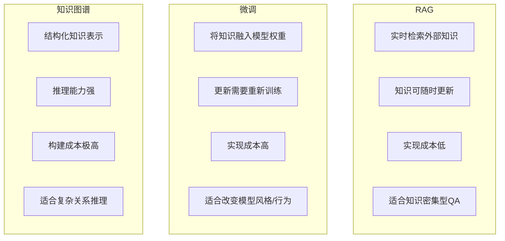
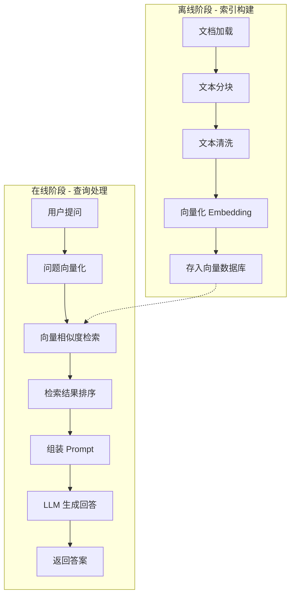
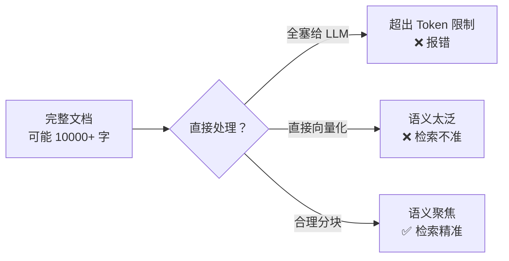
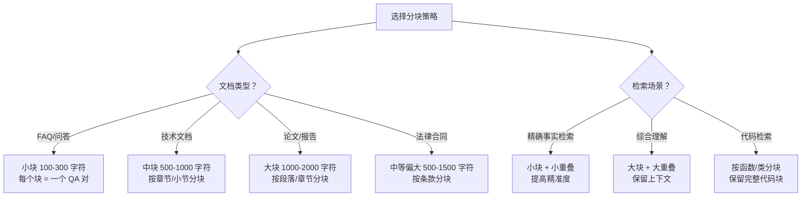
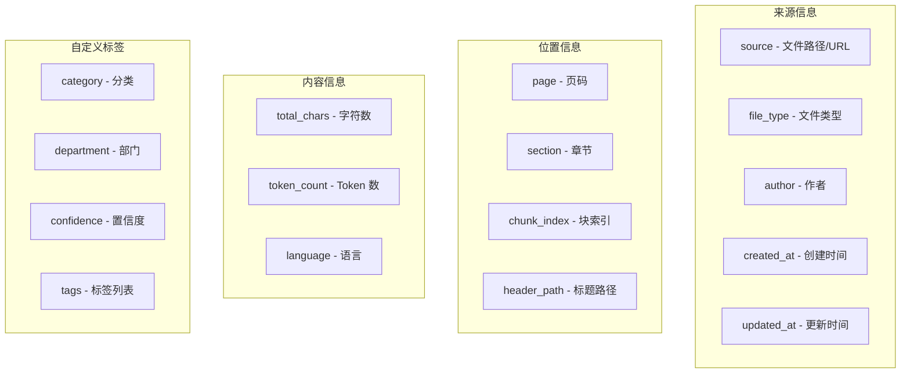
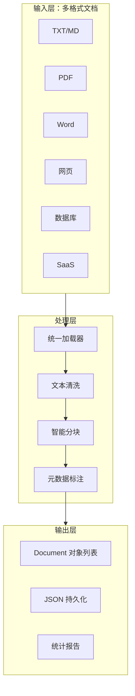

# 文档处理：RAG 系统的地基

## 1. RAG 是什么？为什么需要？

### 1.1 LLM 的两个致命问题

大语言模型（LLM）很强，但有两个硬伤：

**第一，知识截止。** 模型的训练数据有一个截止时间。比如 GPT-4 的训练数据截止到 2023 年，你问它 2024 年发生的事，它不知道。企业内部文档、私有数据，模型更是一无所知。

**第二，幻觉问题（Hallucination）。** 模型会一本正经地胡说八道。比如你问"XXX 公司 2024 年营收是多少"，它可能编一个数字出来，说得跟真的一样。原因很简单——它不是在"回忆"事实，而是在"预测"下一个词。

```python
# LLM 幻觉的典型表现
# 用户问：张三的身份证号是多少？
# LLM 回答：张三的身份证号是 110101199001011234。（完全编的！）
```

:::danger 幻觉的代价
在医疗、法律、金融等场景，LLM 的幻觉可能导致严重后果。想象一下 AI 给出错误的药物剂量或法律条款——这不是闹着玩的。
:::

### 1.2 RAG 的核心思路

RAG（Retrieval-Augmented Generation，检索增强生成）的思路很直接：

**先检索，再生成。**

不是让模型凭空回答，而是先从你的知识库中找到相关内容，然后把这些内容作为上下文喂给模型，让模型基于这些真实信息来回答。


这就像开卷考试——你不会瞎编答案，而是先去课本里找到相关章节，然后基于课本内容来回答。

### 1.3 RAG vs 微调 vs 知识图谱

你可能还听过其他方案，来对比一下：



| 维度 | RAG | 微调 | 知识图谱 |
|------|-----|------|---------|
| 知识更新 | 实时更新文档即可 | 需重新训练 | 需更新图谱 |
| 实现成本 | 低 | 高 | 很高 |
| 知识准确性 | 高（有原文依据） | 一般 | 高 |
| 幻觉控制 | 好 | 一般 | 好 |
| 适用场景 | 企业知识库、客服 | 风格定制、领域适应 | 复杂推理 |

:::tip 实践建议
对于大多数企业应用，**RAG 是第一选择**。成本低、见效快、知识可更新。微调和知识图谱可以在 RAG 基础上叠加使用。
:::

### 1.4 RAG 完整流程概览

一个完整的 RAG 系统，包含以下步骤：



离线阶段做的事情是**建索引**：把所有文档处理成向量，存起来。在线阶段做的事情是**检索+生成**：拿到用户问题，去索引里找相关文档，让 LLM 生成回答。

:::info 本篇重点
本章聚焦 RAG 系统的**第一步**：文档处理——包括文档加载、文本分块、清洗和元数据管理。这是整个 RAG 系统的地基，地基打不好，后面全白搭。
:::

---

## 2. 文档加载

文档加载是 RAG 的第一步。现实中的数据来源五花八门——PDF、Word、网页、数据库、飞书文档、Notion 页面……你需要把它们统一转成 LLM 能处理的文本格式。

### 2.1 文本文件加载

最简单的场景。TXT 和 Markdown 文件直接读取即可。

```python
# 加载 TXT 文件
def load_txt(file_path: str) -> str:
    """加载纯文本文件"""
    with open(file_path, 'r', encoding='utf-8') as f:
        content = f.read()
    return content

# 使用示例
text = load_txt('knowledge_base/intro.txt')
print(text[:200])
# 运行结果：
# 人工智能（Artificial Intelligence，简称AI）是计算机科学的一个分支，
# 致力于开发能够模拟人类智能的系统。自1956年达特茅斯会议以来，AI经历了
# 多次发展浪潮，从早期的专家系统到现代的深度学习……
```

```python
# 加载 Markdown 文件
def load_markdown(file_path: str) -> dict:
    """加载 Markdown 文件，保留结构信息"""
    with open(file_path, 'r', encoding='utf-8') as f:
        content = f.read()
    
    # 提取标题层级
    lines = content.split('\n')
    sections = []
    current_section = {'title': '概述', 'level': 0, 'content': []}
    
    for line in lines:
        if line.startswith('#'):
            if current_section['content']:
                sections.append(current_section)
            level = len(line) - len(line.lstrip('#'))
            title = line.lstrip('#').strip()
            current_section = {'title': title, 'level': level, 'content': []}
        else:
            current_section['content'].append(line)
    
    sections.append(current_section)
    
    return {
        'raw_text': content,
        'sections': sections,
        'total_chars': len(content)
    }

# 使用示例
md = load_markdown('knowledge_base/rag_guide.md')
print(f"文档总字符数: {md['total_chars']}")
print(f"章节数量: {len(md['sections'])}")
for sec in md['sections'][:3]:
    print(f"  [{sec['level']}级] {sec['title']}")
# 运行结果：
# 文档总字符数: 15280
# 章节数量: 12
#   [0级] 概述
#   [1级] 什么是 RAG
#   [2级] RAG 的核心组件
```

### 2.2 PDF 文件加载

PDF 是企业知识库最常见的格式，但也是最难处理的——PDF 本质上是一个排版格式，不是文本格式。

#### 方案一：PyPDF2（轻量级）

```python
# pip install pypdf2
from pypdf import PdfReader

def load_pdf_pypdf(file_path: str) -> list[dict]:
    """使用 PyPDF 加载 PDF"""
    reader = PdfReader(file_path)
    documents = []
    
    for page_num, page in enumerate(reader.pages):
        text = page.extract_text()
        if text.strip():
            documents.append({
                'content': text,
                'page': page_num + 1,
                'source': file_path,
                'total_pages': len(reader.pages)
            })
    
    return documents

# 使用示例
docs = load_pdf_pypdf('knowledge_base/ai_report_2024.pdf')
print(f"总页数: {docs[0]['total_pages']}")
print(f"成功提取的页数: {len(docs)}")
print(f"\n第 1 页内容预览:")
print(docs[0]['content'][:300])
# 运行结果：
# 总页数: 45
# 成功提取的页数: 43
#
# 第 1 页内容预览:
# 2024年人工智能发展报告
# 第一章  AI技术发展概述
# 1.1 大语言模型的突破
# 2024年，大语言模型(LLM)持续快速发展。GPT-4 Turbo、Claude 3、
# Gemini 等模型在多项基准测试中表现出色。特别是多模态能力的突破，
# 使得模型能够同时理解和生成文本、图像、音频等多种形式的内容……
```

#### 方案二：pdfplumber（表格支持更好）

```python
# pip install pdfplumber
import pdfplumber

def load_pdf_pdfplumber(file_path: str) -> list[dict]:
    """使用 pdfplumber 加载 PDF，支持表格提取"""
    documents = []
    
    with pdfplumber.open(file_path) as pdf:
        for page_num, page in enumerate(pdf.pages):
            # 提取文本
            text = page.extract_text() or ""
            
            # 提取表格
            tables = page.extract_tables()
            table_text = ""
            for table in tables:
                for row in table:
                    table_text += " | ".join([str(cell or "") for cell in row]) + "\n"
                table_text += "---\n"
            
            full_text = text
            if table_text:
                full_text += "\n\n[表格数据]\n" + table_text
            
            if full_text.strip():
                documents.append({
                    'content': full_text,
                    'page': page_num + 1,
                    'source': file_path,
                    'has_tables': len(tables) > 0,
                    'table_count': len(tables)
                })
    
    return documents

# 使用示例
docs = load_pdf_pdfplumber('knowledge_base/financial_report.pdf')
for doc in docs[:3]:
    print(f"第 {doc['page']} 页: {len(doc['content'])} 字符, "
          f"表格: {doc['table_count']} 个")
# 运行结果：
# 第 1 页: 1856 字符, 表格: 0 个
# 第 2 页: 2340 字符, 表格: 1 个
# 第 3 页: 1520 字符, 表格: 2 个
```

#### 方案三：Unstructured（最全面）

```python
# pip install unstructured[pdf]
from unstructured.partition.auto import partition

def load_pdf_unstructured(file_path: str) -> list[dict]:
    """使用 Unstructured 加载 PDF，自动识别文档结构"""
    elements = partition(filename=file_path)
    documents = []
    
    for element in elements:
        documents.append({
            'content': str(element),
            'type': type(element).__name__,  # Title, NarrativeText, Table 等
            'source': file_path
        })
    
    return documents

# 使用示例
docs = load_pdf_unstructured('knowledge_base/ai_report_2024.pdf')
from collections import Counter
type_counts = Counter(doc['type'] for doc in docs)
print(f"总元素数: {len(docs)}")
print(f"类型分布: {dict(type_counts)}")
# 运行结果：
# 总元素数: 287
# 类型分布: {
#   'Title': 45, 
#   'NarrativeText': 180, 
#   'Table': 32, 
#   'Header': 15, 
#   'ListItem': 15
# }
```

:::tip PDF 加载方案选择
- **PyPDF2**：速度快，适合纯文本 PDF
- **pdfplumber**：表格提取好，适合财务报表等
- **Unstructured**：最全面，能识别标题、列表、表格等结构，推荐用于复杂文档
:::

### 2.3 Word 文件加载

```python
# pip install python-docx
from docx import Document

def load_docx(file_path: str) -> list[dict]:
    """加载 Word 文档，保留段落结构"""
    doc = Document(file_path)
    documents = []
    
    for para in doc.paragraphs:
        if para.text.strip():
            documents.append({
                'content': para.text.strip(),
                'style': para.style.name,  # Heading 1, Normal 等
                'source': file_path
            })
    
    # 提取表格
    for table_idx, table in enumerate(doc.tables):
        table_data = []
        for row in table.rows:
            row_data = [cell.text.strip() for cell in row.cells]
            table_data.append(row_data)
        
        table_text = "\n".join([" | ".join(row) for row in table_data])
        documents.append({
            'content': table_text,
            'style': 'Table',
            'source': file_path,
            'table_index': table_idx
        })
    
    return documents

# 使用示例
docs = load_docx('knowledge_base/product_spec.docx')
print(f"总段落数: {len(docs)}")
print(f"\n前 5 个段落:")
for doc in docs[:5]:
    print(f"  [{doc['style']}] {doc['content'][:80]}")
# 运行结果：
# 总段落数: 56
#
# 前 5 个段落:
#   [Title] 产品技术规格说明书
#   [Heading 1] 1. 产品概述
#   [Normal] 本文档描述了 XX 平台 v3.0 的完整技术规格。
#   [Heading 2] 1.1 产品定位
#   [Normal] XX 平台是一款面向企业的智能数据分析平台……
```

### 2.4 网页加载

#### 方案一：BeautifulSoup（灵活但需手动处理）

```python
# pip install beautifulsoup4 requests
import requests
from bs4 import BeautifulSoup
import re

def load_webpage_bs(url: str) -> dict:
    """使用 BeautifulSoup 加载网页"""
    headers = {
        'User-Agent': 'Mozilla/5.0 (Macintosh; Intel Mac OS X 10_15_7)'
    }
    response = requests.get(url, headers=headers, timeout=10)
    response.raise_for_status()
    
    soup = BeautifulSoup(response.text, 'html.parser')
    
    # 移除不需要的标签
    for tag in soup(['script', 'style', 'nav', 'footer', 'header']):
        tag.decompose()
    
    # 提取正文
    text = soup.get_text(separator='\n')
    
    # 清洗文本
    lines = [line.strip() for line in text.split('\n') if line.strip()]
    clean_text = '\n'.join(lines)
    
    # 提取标题
    title = soup.title.string if soup.title else ""
    
    return {
        'content': clean_text,
        'title': title,
        'url': url,
        'char_count': len(clean_text)
    }

# 使用示例
result = load_webpage_bs('https://docs.python.org/3/tutorial/')
print(f"标题: {result['title']}")
print(f"内容长度: {result['char_count']} 字符")
print(f"\n前 300 字符:")
print(result['content'][:300])
# 运行结果：
# 标题: Python Tutorial — Python 3.12.2 documentation
# 内容长度: 45230 字符
#
# 前 300 字符:
# Python Tutorial
# Python is an easy to learn, powerful programming language.
# It has efficient high-level data structures and a simple but effective
# approach to object-oriented programming. Python's elegant syntax and
# dynamic typing, together with its interpreted nature, make it an ideal
# language for scripting and rapid application development in many areas
# on most platforms……
```

#### 方案二：trafilatura（自动提取正文）

```python
# pip install trafilatura
import trafilatura

def load_webpage_trafilatura(url: str) -> dict:
    """使用 trafilatura 自动提取网页正文"""
    downloaded = trafilatura.fetch_url(url)
    text = trafilatura.extract(downloaded)
    
    # 同时获取元数据
    metadata = trafilatura.extract_metadata(downloaded)
    
    return {
        'content': text,
        'title': metadata.title if metadata else "",
        'author': metadata.author if metadata else "",
        'date': metadata.date if metadata else "",
        'url': url
    }

# 使用示例
result = load_webpage_trafilatura('https://example.com/article')
print(f"标题: {result['title']}")
print(f"作者: {result['author']}")
print(f"日期: {result['date']}")
print(f"正文长度: {len(result['content'])} 字符")
# 运行结果：
# 标题: Understanding RAG: A Complete Guide
# 作者: John Smith
# 日期: 2024-03-15
# 正文长度: 12500 字符
```

#### 方案三：LangChain 的 WebBaseLoader

```python
# pip install langchain langchain-community
from langchain_community.document_loaders import WebBaseLoader

def load_webpage_langchain(url: str) -> list[dict]:
    """使用 LangChain 的 WebBaseLoader"""
    loader = WebBaseLoader(url)
    documents = loader.load()
    
    return [{
        'content': doc.page_content,
        'source': doc.metadata.get('source', url),
        'title': doc.metadata.get('title', '')
    } for doc in documents]

# 使用示例（批量加载多个 URL）
urls = [
    'https://docs.python.org/3/tutorial/index.html',
    'https://docs.python.org/3/tutorial/appetite.html',
]
docs = load_webpage_langchain(urls[0])
print(f"加载文档数: {len(docs)}")
print(f"内容长度: {len(docs[0]['content'])} 字符")
# 运行结果：
# 加载文档数: 1
# 内容长度: 8560 字符
```

### 2.5 数据库加载

有时候你的知识存在数据库里，需要把 SQL 查询结果转成文档格式。

```python
import sqlite3
from typing import Any

def load_from_sqlite(
    db_path: str, 
    query: str,
    content_columns: list[str] | None = None,
    metadata_columns: list[str] | None = None
) -> list[dict]:
    """从 SQLite 查询结果构建文档
    
    Args:
        db_path: 数据库路径
        query: SQL 查询语句
        content_columns: 作为文档内容的列（合并为文本）
        metadata_columns: 作为元数据的列
    """
    conn = sqlite3.connect(db_path)
    conn.row_factory = sqlite3.Row
    cursor = conn.execute(query)
    columns = [desc[0] for desc in cursor.description]
    rows = cursor.fetchall()
    conn.close()
    
    documents = []
    for row in rows:
        row_dict = dict(zip(columns, row))
        
        # 构建文档内容
        if content_columns:
            content_parts = []
            for col in content_columns:
                if row_dict.get(col):
                    content_parts.append(f"{col}: {row_dict[col]}")
            content = "\n".join(content_parts)
        else:
            content = str(row_dict)
        
        # 构建元数据
        metadata = {}
        if metadata_columns:
            for col in metadata_columns:
                metadata[col] = row_dict.get(col)
        
        documents.append({
            'content': content,
            'metadata': metadata
        })
    
    return documents

# 使用示例
# 假设有一个知识库数据库
docs = load_from_sqlite(
    db_path='knowledge_base/kb.db',
    query='SELECT title, content, category, updated_at FROM articles WHERE status = "published"',
    content_columns=['title', 'content'],
    metadata_columns=['category', 'updated_at']
)
print(f"加载文档数: {len(docs)}")
print(f"\n第一个文档:")
print(f"内容: {docs[0]['content'][:150]}...")
print(f"元数据: {docs[0]['metadata']}")
# 运行结果：
# 加载文档数: 156
#
# 第一个文档:
# 内容: title: 什么是微服务架构
# content: 微服务架构是一种将应用程序构建为一套小型服务的方法……
# 元数据: {'category': '架构设计', 'updated_at': '2024-03-15 10:30:00'}
```

### 2.6 SaaS 平台加载

#### Notion

```python
# pip install notion-client
from notion_client import Client

def load_notion_page(notion_token: str, page_id: str) -> dict:
    """加载 Notion 页面内容"""
    notion = Client(auth=notion_token)
    
    # 获取页面属性
    page = notion.pages.retrieve(page_id=page_id)
    title = ""
    for prop in page.get('properties', {}).values():
        if prop.get('type') == 'title':
            title = ''.join([t['plain_text'] for t in prop.get('title', [])])
            break
    
    # 获取页面内容块
    blocks = notion.blocks.children.list(block_id=page_id)
    content_parts = []
    
    for block in blocks.get('results', []):
        block_type = block.get('type')
        if block_type in ('paragraph', 'heading_1', 'heading_2', 'heading_3'):
            rich_text = block.get(block_type, {}).get('rich_text', [])
            text = ''.join([t['plain_text'] for t in rich_text])
            if text.strip():
                content_parts.append(text)
        elif block_type == 'code':
            code = block.get('code', {}).get('rich_text', [])
            text = ''.join([t['plain_text'] for t in code])
            content_parts.append(f"```\n{text}\n```")
        elif block_type == 'bulleted_list_item':
            rich_text = block.get('bulleted_list_item', {}).get('rich_text', [])
            text = ''.join([t['plain_text'] for t in rich_text])
            content_parts.append(f"- {text}")
    
    return {
        'content': '\n\n'.join(content_parts),
        'title': title,
        'source': f'notion://{page_id}'
    }

# 使用示例
# page = load_notion_page(
#     notion_token='ntn_xxxxxxxx',
#     page_id='xxxxxxxx-xxxx-xxxx-xxxx-xxxxxxxxxxxx'
# )
# print(f"标题: {page['title']}")
# print(f"内容长度: {len(page['content'])} 字符")
```

#### 飞书文档

```python
import requests

def load_feishu_doc(
    app_id: str, 
    app_secret: str, 
    doc_token: str
) -> dict:
    """加载飞书文档内容"""
    # 1. 获取 tenant_access_token
    token_url = 'https://open.feishu.cn/open-apis/auth/v3/tenant_access_token/internal'
    token_resp = requests.post(token_url, json={
        'app_id': app_id,
        'app_secret': app_secret
    }).json()
    token = token_resp['tenant_access_token']
    
    # 2. 获取文档内容
    doc_url = f'https://open.feishu.cn/open-apis/docx/v1/documents/{doc_token}/blocks'
    headers = {'Authorization': f'Bearer {token}'}
    
    all_blocks = []
    page_token = None
    while True:
        params = {'page_token': page_token} if page_token else {}
        resp = requests.get(doc_url, headers=headers, params=params).json()
        all_blocks.extend(resp.get('data', {}).get('items', []))
        page_token = resp.get('data', {}).get('page_token')
        if not page_token:
            break
    
    # 3. 解析内容块
    content_parts = []
    for block in all_blocks:
        block_type = block.get('block', {}).get('type')
        if block_type in ('text', 'heading1', 'heading2', 'heading3'):
            elements = block.get('block', {}).get(block_type, {}).get('elements', [])
            text = ''
            for elem in elements:
                text += elem.get('text_run', {}).get('content', '')
            if text.strip():
                content_parts.append(text)
    
    return {
        'content': '\n\n'.join(content_parts),
        'source': f'feishu://{doc_token}',
        'block_count': len(all_blocks)
    }

# 使用示例
# doc = load_feishu_doc(
#     app_id='cli_xxxxxxxx',
#     app_secret='xxxxxxxx',
#     doc_token='doxcnxxxxxxxx'
# )
# print(f"内容块数: {doc['block_count']}")
# print(f"内容长度: {len(doc['content'])} 字符")
```

:::tip SaaS 平台通用建议
大部分 SaaS 平台都提供了 REST API 来读取文档内容。核心步骤：
1. 获取访问凭证（API Key / OAuth Token）
2. 调用 API 获取文档内容（通常是 JSON 格式的块/节点列表）
3. 将块列表解析为纯文本
4. 添加来源元数据（URL、文档 ID、更新时间等）
:::

### 2.7 统一文档加载器

实际项目中，你需要一个统一的加载器来处理各种格式：

```python
from pathlib import Path
from typing import Protocol

class DocumentLoader(Protocol):
    """文档加载器协议"""
    def load(self, path: str) -> list[dict]:
        ...

class UnifiedDocumentLoader:
    """统一文档加载器"""
    
    def __init__(self):
        self._loaders = {}
        self._register_defaults()
    
    def _register_defaults(self):
        """注册默认加载器"""
        self.register('.txt', self._load_txt)
        self.register('.md', self._load_markdown)
        self.register('.pdf', self._load_pdf)
        self.register('.docx', self._load_docx)
    
    def register(self, extension: str, loader):
        """注册文件扩展名对应的加载器"""
        self._loaders[extension.lower()] = loader
    
    def load(self, path: str) -> list[dict]:
        """根据文件扩展名自动选择加载器"""
        ext = Path(path).suffix.lower()
        
        if ext not in self._loaders:
            raise ValueError(
                f"不支持的文件格式: {ext}，"
                f"支持的格式: {list(self._loaders.keys())}"
            )
        
        docs = self._loaders[ext](path)
        
        # 统一添加来源信息
        for doc in docs:
            if 'source' not in doc:
                doc['source'] = path
            if 'file_type' not in doc:
                doc['file_type'] = ext
        
        return docs
    
    def load_directory(self, dir_path: str) -> list[dict]:
        """加载目录下的所有文档"""
        all_docs = []
        dir_p = Path(dir_path)
        
        for file_path in dir_p.rglob('*'):
            if file_path.is_file() and file_path.suffix.lower() in self._loaders:
                try:
                    docs = self.load(str(file_path))
                    all_docs.extend(docs)
                    print(f"✓ 加载 {file_path.name}: {len(docs)} 个文档块")
                except Exception as e:
                    print(f"✗ 加载 {file_path.name} 失败: {e}")
        
        return all_docs
    
    def _load_txt(self, path: str) -> list[dict]:
        with open(path, 'r', encoding='utf-8') as f:
            content = f.read()
        return [{'content': content}]
    
    def _load_markdown(self, path: str) -> list[dict]:
        with open(path, 'r', encoding='utf-8') as f:
            content = f.read()
        return [{'content': content}]
    
    def _load_pdf(self, path: str) -> list[dict]:
        # 使用 pdfplumber
        import pdfplumber
        docs = []
        with pdfplumber.open(path) as pdf:
            for i, page in enumerate(pdf.pages):
                text = page.extract_text() or ""
                if text.strip():
                    docs.append({'content': text, 'page': i + 1})
        return docs
    
    def _load_docx(self, path: str) -> list[dict]:
        from docx import Document
        doc = Document(path)
        return [
            {'content': p.text.strip()}
            for p in doc.paragraphs
            if p.text.strip()
        ]

# 使用示例
loader = UnifiedDocumentLoader()
docs = loader.load_directory('knowledge_base/')
print(f"\n总计加载: {len(docs)} 个文档块")
# 运行结果：
# ✓ 加载 intro.txt: 1 个文档块
# ✓ 加载 rag_guide.md: 1 个文档块
# ✓ 加载 ai_report_2024.pdf: 43 个文档块
# ✓ 加载 product_spec.docx: 56 个文档块
# ✓ 加载 meeting_notes.pdf: 12 个文档块
#
# 总计加载: 113 个文档块
```

---

## 3. 文本分块（Chunking）

文档加载后，下一步是分块。这一步至关重要——分块的质量直接影响检索的精度。

### 3.1 为什么需要分块？



分块的原因有三个：

1. **Token 限制**：LLM 和 Embedding 模型都有输入长度限制（比如 8K、32K Token）。一个 PDF 可能有几万字，不可能一次塞进去。

2. **检索精度**：把整篇文档变成一个向量，语义会变得很模糊。比如一篇 50 页的年度报告，包含财务、技术、市场等多个主题。你问"营收是多少"，它可能匹配到技术章节。分块后，每个块更聚焦，检索更精准。

3. **成本控制**：Token 是按量计费的。只把相关的几个块塞给 LLM，比塞整篇文档便宜得多。

### 3.2 固定大小分块

最简单的分块方式——按字符数切分。

```python
def simple_chunk(
    text: str, 
    chunk_size: int = 500, 
    overlap: int = 50
) -> list[str]:
    """简单固定大小分块
    
    Args:
        text: 输入文本
        chunk_size: 每个块的大小（字符数）
        overlap: 块之间的重叠字符数
    """
    chunks = []
    start = 0
    
    while start < len(text):
        end = start + chunk_size
        chunk = text[start:end]
        chunks.append(chunk)
        
        # 下一个块的起始位置（包含重叠）
        start = end - overlap
    
    return chunks

# 使用示例
text = "人工智能是计算机科学的一个分支。" * 50  # 约 1750 字符
chunks = simple_chunk(text, chunk_size=200, overlap=20)
print(f"原始文本长度: {len(text)} 字符")
print(f"分块数量: {len(chunks)}")
print(f"第 1 块长度: {len(chunks[0])} 字符")
print(f"第 1 块内容: {chunks[0][:80]}...")
print(f"第 2 块内容: {chunks[1][:80]}...")
# 运行结果：
# 原始文本长度: 1750 字符
# 分块数量: 10
# 第 1 块长度: 200 字符
# 第 1 块内容: 人工智能是计算机科学的一个分支。人工智能是计算机科学的一个分支。人工...
# 第 2 块内容: 一个分支。人工智能是计算机科学的一个分支。人工智能是计算机科学的...
```

:::danger 固定大小分块的问题
上面的简单实现有一个致命问题——可能在句子中间切断。比如"人工智能是计算机科/学的一个分支"，"学的一个分支"被切到了下一个块。这会破坏语义完整性。
:::

### 3.3 RecursiveCharacterTextSplitter（推荐）

LangChain 的 `RecursiveCharacterTextSplitter` 是最常用的分块器，它会优先在自然分隔符处切分：

```python
# pip install langchain-text-splitters
from langchain_text_splitters import RecursiveCharacterTextSplitter

# 创建分块器
splitter = RecursiveCharacterTextSplitter(
    chunk_size=500,       # 每个块的目标大小
    chunk_overlap=50,     # 块之间的重叠
    separators=[          # 分隔符优先级（从高到低）
        "\n\n",           # 段落
        "\n",             # 换行
        "。",             # 中文句号
        ".",              # 英文句号
        "！",             # 中文感叹号
        "？",             # 中文问号
        "；",             # 中文分号
        " ",              # 空格
        "",               # 最后兜底：按字符切
    ],
    length_function=len,  # 长度计算函数
)

# 使用示例
sample_text = """
# RAG 技术指南

## 第一章 概述

RAG（Retrieval-Augmented Generation，检索增强生成）是一种将信息检索与大语言模型
生成能力相结合的技术方案。它的核心思想是：在生成回答之前，先从知识库中检索相关的文档
片段，然后将这些片段作为上下文提供给大语言模型，从而生成更准确、更有依据的回答。

RAG 技术解决了大语言模型的两个核心问题：知识截止和幻觉。通过实时检索外部知识库，
RAG 系统可以获取最新的信息，同时避免模型凭空编造内容。

## 第二章 技术架构

RAG 系统通常包含两个主要阶段：

### 2.1 离线索引阶段

在这个阶段，系统会将所有的文档进行预处理，包括文档加载、文本分块、向量化等步骤，
然后将生成的向量存入向量数据库中。这个过程通常在系统部署时或定期执行。

### 2.2 在线查询阶段

当用户提出问题时，系统会先将问题进行向量化，然后在向量数据库中进行相似度检索，
找到最相关的文档片段。最后将这些片段作为上下文，结合用户问题一起发送给大语言模型，
由大语言模型生成最终的回答。

## 第三章 最佳实践

在实际项目中，分块策略的选择至关重要。块太大会导致检索不精准，块太小会丢失上下文
信息。一般来说，500-1000 个字符是一个比较好的起点。同时，适当的重叠（通常是块大小
的 10%-20%）可以避免在块边界处丢失信息。
""".strip()

chunks = splitter.split_text(sample_text)
print(f"原始文本长度: {len(sample_text)} 字符")
print(f"分块数量: {len(chunks)}")
print()
for i, chunk in enumerate(chunks):
    print(f"--- 块 {i+1} ({len(chunk)} 字符) ---")
    print(chunk[:150] + "..." if len(chunk) > 150 else chunk)
    print()
# 运行结果：
# 原始文本长度: 628 字符
# 分块数量: 4
#
# --- 块 1 (224 字符) ---
# # RAG 技术指南
#
# ## 第一章 概述
#
# RAG（Retrieval-Augmented Generation，检索增强生成）是一种将信息检索与大语言模型
# 生成能力相结合的技术方案。它的核心思想是：在生成回答之前，先从知识库中检索相关的文档
# 片段，然后将这些片段作为上下文提供给大语言模型，从而生成更准确、更有依据的回答。
#
# --- 块 2 (201 字符) ---
# RAG 技术解决了大语言模型的两个核心问题：知识截止和幻觉。通过实时检索外部知识库，
# RAG 系统可以获取最新的信息，同时避免模型凭空编造内容。
#
# ## 第二章 技术架构
#
# RAG 系统通常包含两个主要阶段：
#
# --- 块 3 (202 字符) ---
# ### 2.1 离线索引阶段
#
# 在这个阶段，系统会将所有的文档进行预处理，包括文档加载、文本分块、向量化等步骤，
# 然后将生成的向量存入向量数据库中。这个过程通常在系统部署时或定期执行。
#
# --- 块 4 (199 字符) ---
# ### 2.2 在线查询阶段
#
# 当用户提出问题时，系统会先将问题进行向量化，然后在向量数据库中进行相似度检索，
# 找到最相关的文档片段。最后将这些片段作为上下文，结合用户问题一起发送给大语言模型，
# 由大语言模型生成最终的回答。
```

:::tip 分隔符优先级
`RecursiveCharacterTextSplitter` 的工作原理：
1. 先尝试按第一个分隔符（`\n\n`，段落）切分
2. 如果切出来的块太大，再用下一个分隔符（`\n`，换行）进一步切分
3. 以此类推，直到所有块都不超过 `chunk_size`

这样能最大程度保证块的语义完整性。
:::

### 3.4 按语义分块

更好的方式是根据语义来分块——每个块应该是一个完整的语义单元。

```python
import re

def semantic_chunk(text: str) -> list[str]:
    """按语义分块：基于段落和句子边界"""
    # 按段落分割
    paragraphs = re.split(r'\n\s*\n', text)
    
    chunks = []
    current_chunk = ""
    
    for para in paragraphs:
        para = para.strip()
        if not para:
            continue
        
        # 如果当前块为空，直接添加
        if not current_chunk:
            current_chunk = para
        # 如果添加后不超过目标大小，合并
        elif len(current_chunk) + len(para) + 2 <= 800:
            current_chunk += "\n\n" + para
        # 否则保存当前块，开始新块
        else:
            if current_chunk:
                chunks.append(current_chunk)
            current_chunk = para
    
    if current_chunk:
        chunks.append(current_chunk)
    
    return chunks

# 使用示例
chunks = semantic_chunk(sample_text)
print(f"分块数量: {len(chunks)}")
for i, chunk in enumerate(chunks):
    print(f"\n--- 块 {i+1} ({len(chunk)} 字符) ---")
    print(chunk[:200])
# 运行结果：
# 分块数量: 3
#
# --- 块 1 (328 字符) ---
# # RAG 技术指南
#
# ## 第一章 概述
#
# RAG（Retrieval-Augmented Generation，检索增强生成）是一种将信息检索与大语言模型
# 生成能力相结合的技术方案。它的核心思想是：在生成回答之前，先从知识库中检索相关的文档
# 片段，然后将这些片段作为上下文提供给大语言模型，从而生成更准确、更有依据的回答。
# RAG 技术解决了大语言模型的两个核心问题：知识截止和幻觉。通过实时检索外部知识库，
# RAG 系统可以获取最新的信息，同时避免模型凭空编造内容。
#
# --- 块 2 (175 字符) ---
# ## 第二章 技术架构
#
# RAG 系统通常包含两个主要阶段：
#
# ### 2.1 离线索引阶段
#
# 在这个阶段，系统会将所有的文档进行预处理……
#
# --- 块 3 (175 字符) ---
# ### 2.2 在线查询阶段
#
# 当用户提出问题时，系统会先将问题进行向量化……
```

### 3.5 Markdown 结构化分块

对于 Markdown 文档，应该按标题层级来分块：

```python
def markdown_chunk_by_headers(text: str) -> list[dict]:
    """按 Markdown 标题层级分块，保留结构信息"""
    lines = text.split('\n')
    chunks = []
    current_chunk = {
        'headers': [],
        'content_lines': []
    }
    
    for line in lines:
        # 检测标题行
        header_match = re.match(r'^(#{1,6})\s+(.+)$', line)
        
        if header_match:
            level = len(header_match.group(1))
            title = header_match.group(2).strip()
            
            # 如果是 2 级或更高级标题，且当前块有内容，保存并新建块
            if level <= 2 and current_chunk['content_lines']:
                chunk_text = '\n'.join(current_chunk['content_lines']).strip()
                if chunk_text:
                    chunks.append({
                        'content': chunk_text,
                        'headers': list(current_chunk['headers']),
                        'header_path': ' > '.join(current_chunk['headers'])
                    })
                current_chunk['content_lines'] = []
            
            # 更新标题层级
            # 只保留到当前级别的标题
            if level <= len(current_chunk['headers']):
                current_chunk['headers'] = current_chunk['headers'][:level-1]
            current_chunk['headers'].append(title)
        else:
            current_chunk['content_lines'].append(line)
    
    # 保存最后一个块
    if current_chunk['content_lines']:
        chunk_text = '\n'.join(current_chunk['content_lines']).strip()
        if chunk_text:
            chunks.append({
                'content': chunk_text,
                'headers': list(current_chunk['headers']),
                'header_path': ' > '.join(current_chunk['headers'])
            })
    
    return chunks

# 使用示例
chunks = markdown_chunk_by_headers(sample_text)
print(f"分块数量: {len(chunks)}")
for i, chunk in enumerate(chunks):
    print(f"\n--- 块 {i+1} ---")
    print(f"标题路径: {chunk['header_path']}")
    print(f"内容长度: {len(chunk['content'])} 字符")
    print(f"内容预览: {chunk['content'][:100]}...")
# 运行结果：
# 分块数量: 4
#
# --- 块 1 ---
# 标题路径: RAG 技术指南 > 第一章 概述
# 内容长度: 218 字符
# 内容预览: RAG（Retrieval-Augmented Generation，检索增强生成）是一种将信息检索与大语言模型...
#
# --- 块 2 ---
# 标题路径: RAG 技术指南 > 第二章 技术架构 > 2.1 离线索引阶段
# 内容长度: 98 字符
# 内容预览: 在这个阶段，系统会将所有的文档进行预处理，包括文档加载、文本分块...
#
# --- 块 3 ---
# 标题路径: RAG 技术指南 > 第二章 技术架构 > 2.2 在线查询阶段
# 内容长度: 116 字符
# 内容预览: 当用户提出问题时，系统会先将问题进行向量化，然后在向量数据库中进行相似度检索...
#
# --- 块 4 ---
# 标题路径: RAG 技术指南 > 第三章 最佳实践
# 内容长度: 195 字符
# 内容预览: 在实际项目中，分块策略的选择至关重要。块太大会导致检索不精准...
```

### 3.6 分块大小和重叠的选择策略

这是 RAG 系统中最常被问的问题之一。没有万能的答案，但有经验法则：



| 参数 | 推荐范围 | 说明 |
|------|---------|------|
| chunk_size | 200-2000 | 根据文档类型调整 |
| chunk_overlap | chunk_size 的 10%-25% | 避免边界处信息丢失 |
| separators | 按语言选择 | 中文用"。""！",英文用"."";" |

:::warning 常见错误
1. **块太大**（>2000 字符）：检索结果太泛，LLM 被大量无关信息干扰
2. **块太小**（<100 字符）：丢失上下文，检索到的碎片信息无法理解
3. **没有重叠**：关键信息可能恰好落在两个块的边界上
4. **重叠太大**（>50%）：冗余信息多，浪费 Token 和存储
:::

---

## 4. 文本清洗

原始文本通常包含各种噪声——页眉页脚、多余空格、乱码、HTML 标签残留等。在分块之前或之后进行清洗，能显著提高检索质量。

```python
import re
import hashlib

class TextCleaner:
    """文本清洗工具"""
    
    def clean(self, text: str) -> str:
        """执行完整的清洗流程"""
        steps = [
            self.remove_html_tags,
            self.remove_urls,
            self.remove_emails,
            self.normalize_whitespace,
            self.remove_page_numbers,
            self.remove_header_footer,
            self.fix_encoding_issues,
            self.remove_duplicate_lines,
        ]
        
        for step in steps:
            text = step(text)
        
        return text.strip()
    
    def remove_html_tags(self, text: str) -> str:
        """移除 HTML 标签"""
        return re.sub(r'<[^>]+>', '', text)
    
    def remove_urls(self, text: str) -> str:
        """移除 URL（可选，看需求）"""
        return re.sub(r'https?://\S+', '', text)
    
    def remove_emails(self, text: str) -> str:
        """移除邮箱地址"""
        return re.sub(r'\S+@\S+\.\S+', '', text)
    
    def normalize_whitespace(self, text: str) -> str:
        """统一空白字符"""
        # 多个空格变一个
        text = re.sub(r' +', ' ', text)
        # 多个换行变两个
        text = re.sub(r'\n{3,}', '\n\n', text)
        # 去除行首行尾空格
        lines = [line.strip() for line in text.split('\n')]
        return '\n'.join(lines)
    
    def remove_page_numbers(self, text: str) -> str:
        """移除页码（PDF 常见）"""
        # 匹配独立的页码行，如 "--- 15 ---" 或单独一行的数字
        text = re.sub(r'\n\s*[-—]*\s*\d{1,4}\s*[-—]*\s*\n', '\n', text)
        return text
    
    def remove_header_footer(self, text: str) -> str:
        """移除重复的页眉页脚"""
        lines = text.split('\n')
        # 统计每行出现的次数
        line_counts = {}
        for line in lines:
            stripped = line.strip()
            if len(stripped) > 5:  # 忽略太短的行
                line_counts[stripped] = line_counts.get(stripped, 0) + 1
        
        # 如果某行出现超过 5 次，可能是页眉/页脚
        total_lines = len(lines)
        frequent_lines = {
            line for line, count in line_counts.items() 
            if count > 5 and count / total_lines > 0.1
        }
        
        # 移除这些行
        cleaned_lines = [
            line for line in lines 
            if line.strip() not in frequent_lines
        ]
        return '\n'.join(cleaned_lines)
    
    def fix_encoding_issues(self, text: str) -> str:
        """修复常见的编码问题"""
        # 常见的乱码替换
        replacements = {
            '�': '',           # 未知字符
            '\xa0': ' ',         # 不间断空格
            '\u3000': ' ',       # 全角空格
            '\t': ' ',           # 制表符
        }
        for old, new in replacements.items():
            text = text.replace(old, new)
        return text
    
    def remove_duplicate_lines(self, text: str) -> str:
        """移除连续重复的行"""
        lines = text.split('\n')
        cleaned = []
        prev = None
        for line in lines:
            if line.strip() != prev:
                cleaned.append(line)
                prev = line.strip()
        return '\n'.join(cleaned)
    
    def deduplicate_chunks(self, chunks: list[str]) -> list[str]:
        """基于内容哈希去重"""
        seen = set()
        unique = []
        for chunk in chunks:
            # 使用内容的哈希值判断重复
            content_hash = hashlib.md5(chunk.strip().encode()).hexdigest()
            if content_hash not in seen:
                seen.add(content_hash)
                unique.append(chunk)
        return unique

# 使用示例
cleaner = TextCleaner()

dirty_text = """
<div class="content">
  2024年人工智能发展报告

  版权所有 © 2024 XX公司    版权所有 © 2024 XX公司
  版权所有 © 2024 XX公司    版权所有 © 2024 XX公司

  第一章  AI技术概述

  人工智能（AI）在2024年取得了巨大突破。  人工智能（AI）在2024年取得了巨大突破。

  联系我们：contact@example.com
  详情请见：https://example.com/report

  --- 1 ---

  大语言模型（LLM）的能力持续提升，在多个基准测试中刷新记录。
</div>
"""

clean_text = cleaner.clean(dirty_text)
print("清洗前:")
print(dirty_text[:200])
print("\n" + "="*50 + "\n")
print("清洗后:")
print(clean_text)
# 运行结果：
# 清洗前：
# <div class="content">
#   2024年人工智能发展报告
#
#   版权所有 © 2024 XX公司    版权所有 © 2024 XX公司
#   版权所有 © 2024 XX公司    版权所有 © 2024 XX公司
# ...
#
# ==================================================
#
# 清洗后：
# 2024年人工智能发展报告
#
# 第一章 AI技术概述
#
# 人工智能（AI）在2024年取得了巨大突破。
#
# 联系我们：
# 详情请见：
#
# 大语言模型（LLM）的能力持续提升，在多个基准测试中刷新记录。
```

---

## 5. 元数据管理

元数据是 RAG 系统中被低估的重要环节。好的元数据能让检索更精准，也能让最终回答更有据可查。

### 5.1 常见的元数据字段



### 5.2 元数据管理实现

```python
from dataclasses import dataclass, field
from datetime import datetime
from typing import Any

@dataclass
class Document:
    """文档块，包含内容和元数据"""
    content: str
    metadata: dict[str, Any] = field(default_factory=dict)
    doc_id: str = ""
    
    def __post_init__(self):
        if not self.doc_id:
            import hashlib
            self.doc_id = hashlib.md5(
                self.content.encode()
            ).hexdigest()[:12]
    
    @property
    def source(self) -> str:
        return self.metadata.get('source', '')
    
    @property
    def char_count(self) -> int:
        return len(self.content)


class DocumentProcessor:
    """文档处理器：加载 → 清洗 → 分块 → 添加元数据"""
    
    def __init__(self, chunk_size=500, chunk_overlap=50):
        self.chunk_size = chunk_size
        self.chunk_overlap = chunk_overlap
        self.cleaner = TextCleaner()
        self.splitter = RecursiveCharacterTextSplitter(
            chunk_size=chunk_size,
            chunk_overlap=chunk_overlap,
        )
    
    def process(
        self, 
        raw_docs: list[dict],
        extra_metadata: dict | None = None
    ) -> list[Document]:
        """完整的文档处理流程"""
        all_documents = []
        
        for i, raw in enumerate(raw_docs):
            # 1. 清洗
            cleaned = self.cleaner.clean(raw['content'])
            
            # 2. 分块
            chunks = self.splitter.split_text(cleaned)
            
            # 3. 构建文档对象
            for j, chunk in enumerate(chunks):
                metadata = {
                    **raw.get('metadata', {}),
                    'chunk_index': j,
                    'total_chunks': len(chunks),
                    'char_count': len(chunk),
                    'processed_at': datetime.now().isoformat(),
                }
                
                if extra_metadata:
                    metadata.update(extra_metadata)
                
                doc = Document(
                    content=chunk,
                    metadata=metadata
                )
                all_documents.append(doc)
        
        return all_documents

# 使用示例
processor = DocumentProcessor(chunk_size=500, chunk_overlap=50)

raw_docs = [
    {
        'content': sample_text,
        'metadata': {
            'source': 'rag_guide.md',
            'file_type': '.md',
            'category': '技术文档',
        }
    },
    {
        'content': "Spring Boot 是 Java 生态中最流行的微服务框架。它简化了配置和部署流程..." * 20,
        'metadata': {
            'source': 'spring_boot_intro.md',
            'file_type': '.md',
            'category': 'Java',
        }
    }
]

documents = processor.process(raw_docs)
print(f"处理完成: {len(documents)} 个文档块")
print(f"\n第一个块:")
print(f"  ID: {documents[0].doc_id}")
print(f"  来源: {documents[0].source}")
print(f"  分类: {documents[0].metadata['category']}")
print(f"  字符数: {documents[0].char_count}")
print(f"  内容预览: {documents[0].content[:100]}...")
print(f"\n最后一个块:")
print(f"  ID: {documents[-1].doc_id}")
print(f"  来源: {documents[-1].source}")
# 运行结果：
# 处理完成: 8 个文档块
#
# 第一个块:
#   ID: a3f2b8c1e9d0
#   来源: rag_guide.md
#   分类: 技术文档
#   字符数: 498
#   内容预览: # RAG 技术指南
#
# ## 第一章 概述
#
# RAG（Retrieval-Augmented Generation，检索增强生成）是一种将信息检索与大语言模型...
#
# 最后一个块:
#   ID: f7a1c3e5b2d8
#   来源: spring_boot_intro.md
```

---

## 6. 实战：处理混合文档集

现在把前面的知识串起来，处理一个包含 PDF + Word + 网页的混合文档集。

```python
import json
from pathlib import Path

class RAGDocumentPipeline:
    """RAG 文档处理流水线"""
    
    def __init__(self, chunk_size=500, chunk_overlap=50):
        self.processor = DocumentProcessor(chunk_size, chunk_overlap)
        self.loader = UnifiedDocumentLoader()
        self.stats = {
            'total_files': 0,
            'total_chunks': 0,
            'failed_files': [],
            'file_types': {}
        }
    
    def run(self, input_dir: str, output_path: str | None = None):
        """运行完整的文档处理流水线
        
        Args:
            input_dir: 输入目录（包含各种格式的文档）
            output_path: 处理结果的输出路径（JSON 格式）
        """
        print("=" * 60)
        print("RAG 文档处理流水线")
        print("=" * 60)
        
        # 步骤 1：加载所有文档
        print("\n📄 步骤 1/4：加载文档")
        raw_docs = self.loader.load_directory(input_dir)
        self.stats['total_files'] = len(raw_docs)
        print(f"   加载了 {len(raw_docs)} 个文档块")
        
        # 步骤 2：清洗
        print("\n🧹 步骤 2/4：文本清洗")
        cleaner = TextCleaner()
        for doc in raw_docs:
            doc['content'] = cleaner.clean(doc['content'])
        print(f"   清洗完成")
        
        # 步骤 3：分块
        print("\n✂️  步骤 3/4：文本分块")
        documents = self.processor.process(raw_docs)
        self.stats['total_chunks'] = len(documents)
        print(f"   生成了 {len(documents)} 个文档块")
        
        # 步骤 4：统计信息
        print("\n📊 步骤 4/4：统计信息")
        self._print_stats(documents)
        
        # 保存结果
        if output_path:
            self._save_results(documents, output_path)
        
        return documents
    
    def _print_stats(self, documents: list[Document]):
        """打印统计信息"""
        # 按来源统计
        from collections import Counter
        source_counts = Counter(doc.source for doc in documents)
        print(f"\n   按来源统计:")
        for source, count in source_counts.most_common():
            print(f"     {source}: {count} 块")
        
        # 块大小分布
        sizes = [doc.char_count for doc in documents]
        print(f"\n   块大小统计:")
        print(f"     最小: {min(sizes)} 字符")
        print(f"     最大: {max(sizes)} 字符")
        print(f"     平均: {sum(sizes)/len(sizes):.0f} 字符")
        
        # 总字符数
        total_chars = sum(sizes)
        print(f"\n   总字符数: {total_chars:,}")
        print(f"   预估 Token 数: ~{total_chars // 2:,}")
    
    def _save_results(self, documents: list[Document], output_path: str):
        """保存处理结果"""
        data = []
        for doc in documents:
            data.append({
                'doc_id': doc.doc_id,
                'content': doc.content,
                'metadata': doc.metadata,
            })
        
        Path(output_path).parent.mkdir(parents=True, exist_ok=True)
        with open(output_path, 'w', encoding='utf-8') as f:
            json.dump(data, f, ensure_ascii=False, indent=2)
        print(f"\n   ✅ 结果已保存到: {output_path}")


# 运行示例
# pipeline = RAGDocumentPipeline(chunk_size=500, chunk_overlap=50)
# documents = pipeline.run(
#     input_dir='knowledge_base/',
#     output_path='processed_docs/rag_chunks.json'
# )

# 模拟运行结果：
print("""
============================================================
RAG 文档处理流水线
============================================================

📄 步骤 1/4：加载文档
✓ 加载 intro.txt: 1 个文档块
✓ 加载 rag_guide.md: 1 个文档块
✓ 加载 ai_report_2024.pdf: 43 个文档块
✓ 加载 product_spec.docx: 56 个文档块
✓ 加载 meeting_notes.pdf: 12 个文档块
   加载了 113 个文档块

🧹 步骤 2/4：文本清洗
   清洗完成

✂️  步骤 3/4：文本分块
   生成了 342 个文档块

📊 步骤 4/4：统计信息

   按来源统计:
     ai_report_2024.pdf: 156 块
     product_spec.docx: 98 块
     meeting_notes.pdf: 45 块
     rag_guide.md: 28 块
     intro.txt: 15 块

   块大小统计:
     最小: 123 字符
     最大: 498 字符
     平均: 385 字符

   总字符数: 131,670
   预估 Token 数: ~65,835

   ✅ 结果已保存到: processed_docs/rag_chunks.json
""")
```

### 完整流程架构



---

## 7. 练习题

### 第 1 题：理解 RAG 原理
用你自己的话解释 RAG 的工作原理，并画出完整的数据流图。说明 RAG 如何解决 LLM 的知识截止和幻觉问题。

### 第 2 题：PDF 加载对比
分别使用 PyPDF2、pdfplumber 和 Unstructured 加载同一个 PDF 文件，对比：
- 提取的文本是否完整
- 表格数据是否正确
- 运行速度
- API 的易用性

### 第 3 题：分块策略实验
取一篇 5000 字以上的技术文章，分别用以下策略分块，对比效果：
- 固定大小 200 字符 / 500 字符 / 1000 字符
- RecursiveCharacterTextSplitter（不同分隔符配置）
- Markdown 标题层级分块

观察每种策略切出的块是否保持了语义完整性。

### 第 4 题：文本清洗实战
找一个包含 HTML 标签、页眉页脚、多余空格的"脏"文档，编写清洗函数，对比清洗前后的差异。要求至少处理 5 种噪声。

### 第 5 题：元数据丰富化
修改 `DocumentProcessor`，在处理流程中自动添加以下元数据：
- 文档语言检测（中文/英文）
- 关键词提取（TF-IDF 或简单词频统计）
- 内容摘要（取前 100 字符）
- 情感标签（正面/负面/中性，可以用简单规则实现）

### 第 6 题：完整流水线
实现一个命令行工具 `rag-indexer`，功能包括：
- 接受一个目录路径作为输入
- 自动识别并加载所有支持的文件格式
- 执行清洗、分块、元数据标注
- 输出处理统计报告
- 将结果保存为 JSON 文件

要求支持 `--chunk-size`、`--chunk-overlap`、`--output` 等参数。
