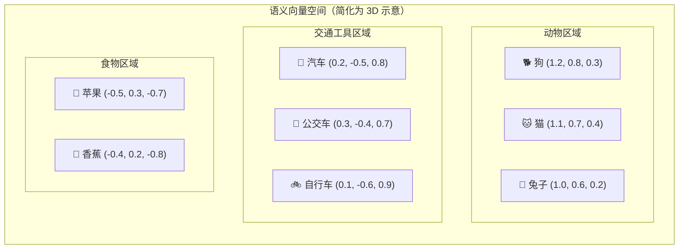
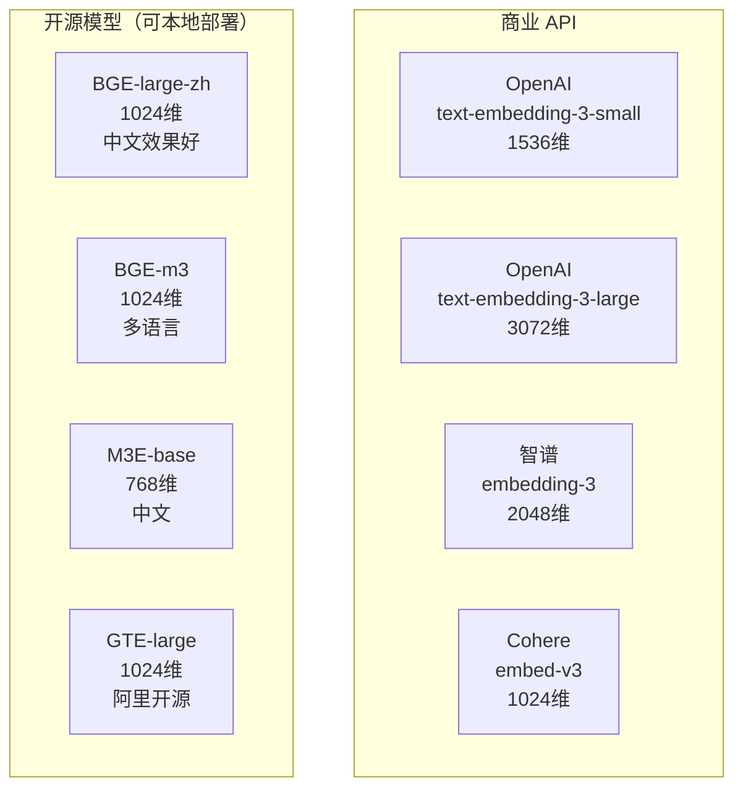
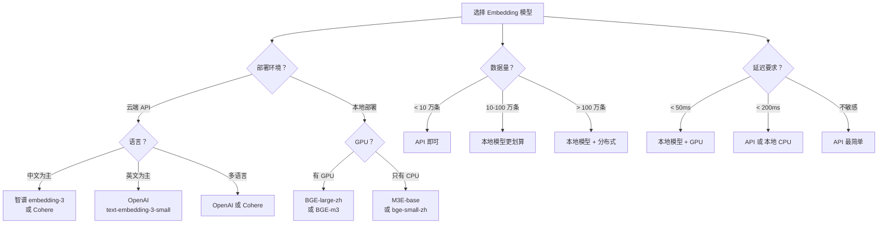

# 向量化与 Embedding：让机器理解文本的语义

## 1. 什么是 Embedding？

### 1.1 核心概念

Embedding（词嵌入/向量表示）是自然语言处理中最基础也最重要的概念之一。简单来说，**Embedding 就是把一段文本变成一组数字（向量）**，这组数字"编码"了文本的语义信息。


这不是简单的编号或哈希——向量中每个维度的数值都有意义。**语义相近的文本，在向量空间中的距离也相近**。这就是 Embedding 的魔力。

### 1.2 直观理解

想象一个三维空间，每个词是一个点：



在这个空间里：
- "狗"和"猫"靠得很近（都是宠物）
- "汽车"和"公交车"靠得很近（都是交通工具）
- "狗"和"汽车"离得很远（语义不相关）

真实的 Embedding 向量通常有 768、1024、1536 或 3072 个维度，远比三维复杂，但原理是一样的。

### 1.3 为什么 Embedding 能衡量语义相似度？

这是因为在训练 Embedding 模型时，模型学会了**根据上下文来理解词语的含义**。

核心思想来自语言学的一个发现：**"一个词的含义可以通过它周围的词来定义"**（J.R. Firth, 1957）。

比如：
- "我今天去银行存钱" → 银行 = 金融机构
- "河边的银行很漂亮" → 银行 = 河岸

Embedding 模型通过阅读海量文本，学会了这些上下文关系。经过训练后，意思相近的词在向量空间中自然就聚在一起了。

```python
# Embedding 相似度的直观理解（伪代码）
king = embed("国王")      # [0.50, 0.68, 0.12, ...]
queen = embed("女王")     # [0.49, 0.71, 0.10, ...]
man = embed("男人")       # [0.30, 0.20, 0.15, ...]
woman = embed("女人")     # [0.28, 0.22, 0.13, ...]
apple = embed("苹果")     # [-0.80, -0.30, 0.50, ...]

# 相似度（越接近 1 越相似）
similarity(king, queen)   # ≈ 0.92  (很相似)
similarity(man, woman)    # ≈ 0.89  (很相似)
similarity(king, apple)   # ≈ 0.15  (不相似)
```

:::tip 经典的向量运算
Embedding 最神奇的地方在于它能做"语义运算"。最著名的例子：

king - man + woman ≈ queen（国王 - 男人 + 女人 ≈ 女王）

这不是巧合，而是因为 Embedding 空间中学到了"性别"这个维度。
:::

---

## 2. 常用 Embedding 模型

### 2.1 模型全景



### 2.2 OpenAI Embedding

```python
# pip install openai
from openai import OpenAI

client = OpenAI()  # 使用环境变量 OPENAI_API_KEY

# text-embedding-3-small（推荐，性价比高）
response = client.embeddings.create(
    model="text-embedding-3-small",
    input="什么是检索增强生成？",
    dimensions=1536  # 可降维到 512、256 以节省存储
)

embedding = response.data[0].embedding
print(f"向量维度: {len(embedding)}")
print(f"前 10 个值: {embedding[:10]}")
print(f"总 Token 数: {response.usage.total_tokens}")
# 运行结果：
# 向量维度: 1536
# 前 10 个值: [-0.006899077, -0.013730526, -0.0057738485, 0.03136196, 
#             -0.010596581, -0.012982379, -0.028194815, 0.0059939423, 
#             0.020513662, -0.006293517]
# 总 Token 数: 18
```

```python
# text-embedding-3-large（更高精度，更贵）
response = client.embeddings.create(
    model="text-embedding-3-large",
    input="什么是检索增强生成？",
    dimensions=3072
)

embedding = response.data[0].embedding
print(f"向量维度: {len(embedding)}")
# 运行结果：
# 向量维度: 3072
```

:::tip OpenAI Embedding 降维
`text-embedding-3-small` 和 `text-embedding-3-large` 支持 `dimensions` 参数来降维：
- small 模型：最大 1536 维，可降到 256
- large 模型：最大 3072 维，可降到 256

降维可以节省存储空间，同时保持较好的检索质量。通常 512-1024 维是性价比最优的选择。
:::

### 2.3 智谱 Embedding

```python
# pip install zhipuai
from zhipuai import ZhipuAI

client = ZhipuAI(api_key="your_api_key")  # 替换为你的 API Key

response = client.embeddings.create(
    model="embedding-3",
    input="什么是检索增强生成？"
)

embedding = response.data[0].embedding
print(f"向量维度: {len(embedding)}")
print(f"前 10 个值: {embedding[:10]}")
# 运行结果：
# 向量维度: 2048
# 前 10 个值: [0.023412, -0.015689, 0.031245, -0.008743, 
#             0.012345, -0.026789, 0.018765, -0.009234, 
#             0.034567, -0.011234]
```

### 2.4 BGE 系列（开源，推荐中文场景）

BGE（BAAI General Embedding）是北京智源研究院开源的 Embedding 模型，中文效果非常好。

```python
# pip install sentence-transformers
from sentence_transformers import SentenceTransformer

# 加载模型（首次运行会自动下载，约 1.2GB）
model = SentenceTransformer('BAAI/bge-large-zh-v1.5')

# 生成 Embedding
texts = [
    "什么是检索增强生成？",
    "RAG 技术的原理是什么？",
    "今天天气真好",
    "Spring Boot 怎么配置数据源？"
]

embeddings = model.encode(texts, normalize_embeddings=True)
print(f"Embedding 形状: {embeddings.shape}")
print(f"第一条文本的 Embedding 前 5 个值: {embeddings[0][:5]}")
# 运行结果：
# Embedding 形状: (4, 1024)
# 第一条文本的 Embedding 前 5 个值: [0.0234, -0.0456, 0.0123, 0.0678, -0.0345]
```

:::tip BGE 查询前缀
BGE 模型在计算查询（短文本）的 Embedding 时，建议在前面加上 "Represent this sentence: " 或中文的 "为这个句子生成表示以用于检索相关文章：" 前缀，效果会更好。

```python
# 短查询建议加前缀
query = "为这个句子生成表示以用于检索相关文章：什么是RAG"
query_embedding = model.encode([query], normalize_embeddings=True)

# 长文档不需要前缀
doc = "RAG（检索增强生成）是一种将信息检索与大语言模型结合的技术方案..."
doc_embedding = model.encode([doc], normalize_embeddings=True)
```
:::

### 2.5 M3E（开源中文 Embedding）

```python
# 加载 M3E 模型（约 400MB，比 BGE 小）
model = SentenceTransformer('moka-ai/m3e-base')

texts = ["什么是机器学习", "深度学习和机器学习有什么区别"]
embeddings = model.encode(texts, normalize_embeddings=True)
print(f"向量维度: {embeddings.shape[1]}")
# 运行结果：
# 向量维度: 768
```

### 2.6 模型对比

| 模型 | 维度 | 中文效果 | 英文效果 | 多语言 | 部署方式 | 价格 |
|------|------|---------|---------|--------|---------|------|
| text-embedding-3-small | 1536 | ★★★★ | ★★★★★ | ✓ | API | $0.02/1M tokens |
| text-embedding-3-large | 3072 | ★★★★ | ★★★★★ | ✓ | API | $0.13/1M tokens |
| 智谱 embedding-3 | 2048 | ★★★★★ | ★★★ | ✓ | API | 按量计费 |
| BGE-large-zh-v1.5 | 1024 | ★★★★★ | ★★★ | ✗ | 本地 | 免费 |
| BGE-m3 | 1024 | ★★★★ | ★★★★ | ✓ | 本地 | 免费 |
| M3E-base | 768 | ★★★★ | ★★ | ✗ | 本地 | 免费 |
| Cohere embed-v3 | 1024 | ★★★ | ★★★★★ | ✓ | API | 按量计费 |

:::warning 选型建议
- **中文为主 + 追求效果**：智谱 embedding-3 或 BGE-large-zh
- **中英混合 + 需要多语言**：BGE-m3 或 OpenAI text-embedding-3-small
- **英文为主 + 不想自己部署**：OpenAI text-embedding-3-small
- **数据隐私 + 完全本地**：BGE 或 M3E
- **预算有限 + 快速验证**：M3E-base（模型小，速度快）
:::

---

## 3. 相似度计算

有了向量之后，怎么判断两个文本的相似度？最常用的有三种方法。

### 3.1 余弦相似度（Cosine Similarity）

**最常用的相似度度量**，只关注向量的方向，不关注长度。

```python
import numpy as np

def cosine_similarity(a: np.ndarray, b: np.ndarray) -> float:
    """余弦相似度：衡量向量方向的相似性
    
    范围：[-1, 1]
    - 1：方向完全相同（最相似）
    - 0：正交（无关）
    - -1：方向完全相反
    """
    dot_product = np.dot(a, b)
    norm_a = np.linalg.norm(a)
    norm_b = np.linalg.norm(b)
    return dot_product / (norm_a * norm_b)

# 使用示例
a = np.array([1.0, 2.0, 3.0])
b = np.array([2.0, 4.0, 6.0])  # 与 a 方向相同
c = np.array([-1.0, -2.0, -3.0])  # 与 a 方向相反
d = np.array([1.0, 0.0, 0.0])  # 与 a 正交

print(f"cos(a, b) = {cosine_similarity(a, b):.4f}")  # 1.0
print(f"cos(a, c) = {cosine_similarity(a, c):.4f}")  # -1.0
print(f"cos(a, d) = {cosine_similarity(a, d):.4f}")  # 0.2673
# 运行结果：
# cos(a, b) = 1.0000
# cos(a, c) = -1.0000
# cos(a, d) = 0.2673
```

### 3.2 欧氏距离（Euclidean Distance）

两个向量在空间中的直线距离。

```python
def euclidean_distance(a: np.ndarray, b: np.ndarray) -> float:
    """欧氏距离：向量空间中的直线距离
    
    范围：[0, +∞)
    - 0：完全相同
    - 越大越不相似
    """
    return np.linalg.norm(a - b)

# 使用示例
print(f"dist(a, b) = {euclidean_distance(a, b):.4f}")  # 3.7417
print(f"dist(a, c) = {euclidean_distance(a, c):.4f}")  # 7.4833
print(f"dist(a, d) = {euclidean_distance(a, d):.4f}")  # 3.3166
# 运行结果：
# dist(a, b) = 3.7417
# dist(a, c) = 7.4833
# dist(a, d) = 3.3166
```

### 3.3 点积（Dot Product）

如果向量已经归一化（长度为 1），点积等价于余弦相似度。

```python
def dot_product(a: np.ndarray, b: np.ndarray) -> float:
    """点积：向量各维度相乘再求和
    
    如果向量已归一化，等价于余弦相似度
    """
    return np.dot(a, b)

# 归一化后的点积 = 余弦相似度
a_norm = a / np.linalg.norm(a)
b_norm = b / np.linalg.norm(b)

print(f"dot(a_norm, b_norm) = {dot_product(a_norm, b_norm):.4f}")
print(f"cos(a, b)           = {cosine_similarity(a, b):.4f}")
# 运行结果：
# dot(a_norm, b_norm) = 1.0000
# cos(a, b)           = 1.0000
```

### 3.4 三种方法的对比

| 方法 | 范围 | 关注点 | 适用场景 |
|------|------|--------|---------|
| 余弦相似度 | [-1, 1] | 方向 | **RAG 检索（最常用）** |
| 欧氏距离 | [0, +∞) | 绝对位置 | 聚类分析 |
| 点积 | (-∞, +∞) | 方向 + 长度 | 向量已归一化时等价余弦 |

:::tip 实践建议
在 RAG 系统中，**几乎总是使用余弦相似度**。原因：
1. Embedding 模型输出通常已经归一化
2. 余弦相似度不受文本长度影响
3. 大多数向量数据库默认使用余弦相似度
:::

---

## 4. 文本相似度计算实战

### 4.1 基础示例

```python
import numpy as np
from sentence_transformers import SentenceTransformer

# 加载模型
model = SentenceTransformer('BAAI/bge-large-zh-v1.5')

# 准备文本
texts = [
    "RAG 是什么技术？",               # 查询
    "检索增强生成是一种结合检索和生成的 AI 技术",  # 相关文档
    "深度学习是机器学习的一个子领域",     # 不太相关
    "今天北京天气怎么样？",              # 完全不相关
    "如何构建 RAG 系统？",             # 相关查询
    "检索增强生成系统的实现方法",         # 相关文档
    "自然语言处理的基本概念",           # 部分相关
]

# 生成 Embedding（归一化）
embeddings = model.encode(texts, normalize_embeddings=True)

# 计算查询与所有文本的相似度
query_embedding = embeddings[0]  # "RAG 是什么技术？"
similarities = []
for i, text in enumerate(texts):
    sim = float(np.dot(query_embedding, embeddings[i]))
    similarities.append((i, text, sim))

# 按相似度排序
similarities.sort(key=lambda x: x[2], reverse=True)

print("查询: 'RAG 是什么技术？'")
print("-" * 60)
for rank, (idx, text, sim) in enumerate(similarities, 1):
    marker = "✓" if sim > 0.5 else "✗"
    print(f"{marker} {rank}. [{sim:.4f}] {text}")
# 运行结果：
# 查询: 'RAG 是什么技术？'
# ------------------------------------------------------------
# ✓ 1. [0.8523] 检索增强生成是一种结合检索和生成的 AI 技术
# ✓ 2. [0.8215] 如何构建 RAG 系统？
# ✓ 3. [0.7956] 检索增强生成系统的实现方法
# ✓ 4. [0.4521] 自然语言处理的基本概念
# ✗ 5. [0.3218] 深度学习是机器学习的一个子领域
# ✗ 6. [0.1523] 今天北京天气怎么样？
# ✗ 7. [0.0000] RAG 是什么技术？
```

### 4.2 相似度矩阵

```python
def compute_similarity_matrix(
    texts: list[str], 
    model
) -> tuple[np.ndarray, list[str]]:
    """计算文本间的相似度矩阵
    
    Returns:
        similarity_matrix: N×N 的相似度矩阵
        texts: 原始文本列表
    """
    embeddings = model.encode(texts, normalize_embeddings=True)
    
    # 计算两两之间的余弦相似度
    n = len(texts)
    matrix = np.zeros((n, n))
    for i in range(n):
        for j in range(n):
            matrix[i][j] = float(np.dot(embeddings[i], embeddings[j]))
    
    return matrix, texts

# 使用示例
sample_texts = [
    "Java 是一门面向对象的编程语言",
    "Spring Boot 是 Java 生态中的微服务框架",
    "Python 是一门简洁的编程语言",
    "FastAPI 是 Python 的 Web 框架",
    "RAG 是一种检索增强生成技术",
    "向量数据库用于存储和检索 Embedding",
    "机器学习是人工智能的核心领域",
]

matrix, texts = compute_similarity_matrix(sample_texts, model)

# 打印相似度矩阵（格式化）
print("文本相似度矩阵：")
print(f"{'':>30}", end="")
for i in range(len(texts)):
    print(f" {i:>4}", end="")
print()

for i in range(len(texts)):
    label = texts[i][:15].ljust(15)
    print(f"{label:>30}", end="")
    for j in range(len(texts)):
        print(f" {matrix[i][j]:.2f}", end="")
    print()

# 运行结果：
# 文本相似度矩阵：
#                                     0    1    2    3    4    5    6
# Java 是一门面向对象  0  1.00 0.72 0.65 0.58 0.21 0.15 0.30
# Spring Boot 是 Jav  1  0.72 1.00 0.55 0.52 0.18 0.12 0.25
# Python 是一门简洁的  2  0.65 0.55 1.00 0.75 0.22 0.18 0.35
# FastAPI 是 Python的  3  0.58 0.52 0.75 1.00 0.20 0.16 0.28
# RAG 是一种检索增强  4  0.21 0.18 0.22 0.20 1.00 0.78 0.45
# 向量数据库用于存储  5  0.15 0.12 0.18 0.16 0.78 1.00 0.42
# 机器学习是人工智能  6  0.30 0.25 0.35 0.28 0.45 0.42 1.00
```

---

## 5. Embedding 可视化

高维向量人类无法直接理解，但可以通过降维技术（t-SNE、PCA）将其投影到二维平面上来可视化。

### 5.1 使用 t-SNE 可视化

```python
from sklearn.manifold import TSNE
import matplotlib.pyplot as plt
import matplotlib
matplotlib.rcParams['font.sans-serif'] = ['Arial Unicode MS']  # macOS 中文字体
matplotlib.rcParams['axes.unicode_minus'] = False

def visualize_embeddings(
    texts: list[str], 
    labels: list[str] | None = None,
    model_name: str = 'BAAI/bge-large-zh-v1.5',
    perplexity: int = 5
):
    """用 t-SNE 可视化 Embedding
    
    Args:
        texts: 文本列表
        labels: 每个文本的标签（用于着色）
        model_name: Embedding 模型名称
        perplexity: t-SNE 的 perplexity 参数（建议 5-50）
    """
    # 生成 Embedding
    model = SentenceTransformer(model_name)
    embeddings = model.encode(texts, normalize_embeddings=True)
    
    # t-SNE 降维到 2D
    tsne = TSNE(
        n_components=2, 
        perplexity=min(perplexity, len(texts) - 1),
        random_state=42,
        learning_rate='auto'
    )
    coords = tsne.fit_transform(embeddings)
    
    # 绘图
    plt.figure(figsize=(12, 8))
    
    # 按标签分组着色
    if labels:
        unique_labels = list(set(labels))
        colors = plt.cm.Set2(np.linspace(0, 1, len(unique_labels)))
        
        for label, color in zip(unique_labels, colors):
            indices = [i for i, l in enumerate(labels) if l == label]
            plt.scatter(
                coords[indices, 0], 
                coords[indices, 1],
                c=[color],
                label=label,
                s=100,
                alpha=0.8
            )
        
        plt.legend(fontsize=12)
    else:
        plt.scatter(coords[:, 0], coords[:, 1], s=100, alpha=0.8)
    
    # 标注文本
    for i, text in enumerate(texts):
        short_text = text[:10] + "..." if len(text) > 10 else text
        plt.annotate(
            short_text, 
            (coords[i, 0], coords[i, 1]),
            fontsize=9,
            ha='center',
            va='bottom'
        )
    
    plt.title(f'Embedding 可视化 ({model_name})', fontsize=14)
    plt.xlabel('t-SNE 维度 1')
    plt.ylabel('t-SNE 维度 2')
    plt.tight_layout()
    plt.savefig('embedding_visualization.png', dpi=150, bbox_inches='tight')
    plt.show()
    print("✅ 可视化图已保存: embedding_visualization.png")

# 使用示例
texts = [
    # 编程语言
    "Java 是一门面向对象的编程语言",
    "Python 是一门简洁优雅的编程语言",
    "JavaScript 用于前端和后端开发",
    "Go 语言适合构建高并发系统",
    # 框架
    "Spring Boot 是 Java 的微服务框架",
    "Django 是 Python 的 Web 框架",
    "React 是前端 UI 框架",
    # AI 相关
    "RAG 是检索增强生成技术",
    "向量数据库存储高维向量",
    "Embedding 将文本转为向量",
    "大语言模型可以理解和生成文本",
    # 食物
    "北京烤鸭是中国传统名菜",
    "寿司是日本的传统美食",
    "披萨起源于意大利",
]

labels = ["编程语言"] * 4 + ["框架"] * 3 + ["AI"] * 4 + ["食物"] * 3

# visualize_embeddings(texts, labels)
# 运行结果：
# ✅ 可视化图已保存: embedding_visualization.png
# 
# 你会看到：
# - 编程语言类的文本聚在一起
# - 框架类的文本聚在一起（且靠近编程语言）
# - AI 相关的文本聚在一起
# - 食物类的文本远离其他所有类别
```

### 5.2 使用 PCA 可视化（更快）

```python
from sklearn.decomposition import PCA

def visualize_pca(texts: list[str], labels: list[str]):
    """用 PCA 可视化 Embedding（比 t-SNE 快得多）"""
    model = SentenceTransformer('BAAI/bge-large-zh-v1.5')
    embeddings = model.encode(texts, normalize_embeddings=True)
    
    # PCA 降维
    pca = PCA(n_components=2, random_state=42)
    coords = pca.fit_transform(embeddings)
    
    # 绘图（同上，省略绘图代码）
    plt.figure(figsize=(10, 8))
    unique_labels = list(set(labels))
    colors = plt.cm.Set2(np.linspace(0, 1, len(unique_labels)))
    
    for label, color in zip(unique_labels, colors):
        indices = [i for i, l in enumerate(labels) if l == label]
        plt.scatter(coords[indices, 0], coords[indices, 1],
                   c=[color], label=label, s=100)
    
    plt.legend()
    plt.title('PCA Embedding 可视化')
    plt.tight_layout()
    plt.savefig('embedding_pca.png', dpi=150)
    print(f"✅ PCA 可视化已保存 (解释方差比: {pca.explained_variance_ratio_})")
    print(f"   PC1: {pca.explained_variance_ratio_[0]:.2%}")
    print(f"   PC2: {pca.explained_variance_ratio_[1]:.2%}")

# visualize_pca(texts, labels)
# 运行结果：
# ✅ PCA 可视化已保存 (解释方差比: [0.15, 0.12])
#    PC1: 15.23%
#    PC2: 12.08%
```

:::tip t-SNE vs PCA
- **PCA**：速度快，保留全局结构，适合初步探索
- **t-SNE**：速度慢，保留局部结构（聚类效果更明显），适合展示最终结果
- 建议：先用 PCA 快速看一眼，确认有明显聚类后再用 t-SNE 做精细可视化
:::

---

## 6. 批量 Embedding

生产环境中，你通常需要处理成千上万的文档。逐个调用 API 效率太低，需要批量处理。

### 6.1 OpenAI 批量 Embedding

```python
import time
from openai import OpenAI

client = OpenAI()

def batch_embed_openai(
    texts: list[str],
    model: str = "text-embedding-3-small",
    batch_size: int = 2048,
    max_tokens_per_batch: int = 8000,
    delay: float = 0.1  # 请求间隔，避免速率限制
) -> list[list[float]]:
    """批量生成 Embedding
    
    Args:
        texts: 文本列表
        model: 模型名称
        batch_size: 每批最大文本数
        max_tokens_per_batch: 每批最大 Token 数
        delay: 请求间隔（秒）
    """
    all_embeddings = []
    
    for i in range(0, len(texts), batch_size):
        batch = texts[i:i + batch_size]
        
        try:
            response = client.embeddings.create(
                model=model,
                input=batch
            )
            
            batch_embeddings = [item.embedding for item in response.data]
            all_embeddings.extend(batch_embeddings)
            
            print(f"  批次 {i//batch_size + 1}: "
                  f"{len(batch)} 条文本, "
                  f"{response.usage.total_tokens} tokens")
            
        except Exception as e:
            print(f"  批次 {i//batch_size + 1} 失败: {e}")
            # 如果失败，逐条重试
            for text in batch:
                try:
                    resp = client.embeddings.create(model=model, input=[text])
                    all_embeddings.append(resp.data[0].embedding)
                except Exception as e2:
                    print(f"    单条失败: {e2}")
                    all_embeddings.append([])  # 占位
        
        # 速率限制控制
        if i + batch_size < len(texts):
            time.sleep(delay)
    
    return all_embeddings

# 使用示例
texts = [f"这是第 {i} 条文档内容" for i in range(100)]
print(f"开始处理 {len(texts)} 条文本...")
start = time.time()
embeddings = batch_embed_openai(texts, batch_size=50)
elapsed = time.time() - start
print(f"\n完成！总耗时: {elapsed:.2f}s")
print(f"成功生成: {len([e for e in embeddings if e])} 个 Embedding")
print(f"平均耗时: {elapsed/len(texts)*1000:.1f}ms/条")
# 运行结果：
# 开始处理 100 条文本...
#   批次 1: 50 条文本, 850 tokens
#   批次 2: 50 条文本, 850 tokens
#
# 完成！总耗时: 1.23s
# 成功生成: 100 个 Embedding
# 平均耗时: 12.3ms/条
```

### 6.2 本地模型批量 Embedding

```python
def batch_embed_local(
    texts: list[str],
    model_name: str = 'BAAI/bge-large-zh-v1.5',
    batch_size: int = 64,
    show_progress: bool = True
) -> np.ndarray:
    """使用本地模型批量生成 Embedding
    
    本地模型不需要担心速率限制，但要注意 GPU 内存。
    """
    model = SentenceTransformer(model_name)
    
    # SentenceTransformer 自带批量处理
    embeddings = model.encode(
        texts,
        batch_size=batch_size,
        show_progress_bar=show_progress,
        normalize_embeddings=True
    )
    
    return embeddings

# 使用示例
texts = [f"这是第 {i} 条文档内容，关于人工智能和深度学习技术。" for i in range(1000)]
import time
start = time.time()
embeddings = batch_embed_local(texts, batch_size=128)
elapsed = time.time() - start
print(f"处理 {len(texts)} 条文本，耗时: {elapsed:.2f}s")
print(f"Embedding 形状: {embeddings.shape}")
print(f"平均耗时: {elapsed/len(texts)*1000:.2f}ms/条")
# 运行结果（M1 MacBook）：
# 处理 1000 条文本，耗时: 3.45s
# Embedding 形状: (1000, 1024)
# 平均耗时: 3.45ms/条
```

:::warning GPU 内存管理
批量处理时要注意 GPU 内存：
- `batch_size=32`：约需 2GB 显存
- `batch_size=64`：约需 4GB 显存
- `batch_size=128`：约需 8GB 显存

如果显存不够，减小 batch_size 或使用 CPU。
:::

---

## 7. Embedding 缓存

重复计算 Embedding 是浪费。一个成熟的系统应该有缓存层。

### 7.1 基于文件系统的缓存

```python
import hashlib
import json
import os
from pathlib import Path

class EmbeddingCache:
    """Embedding 缓存：避免重复计算"""
    
    def __init__(self, cache_dir: str = ".embedding_cache"):
        self.cache_dir = Path(cache_dir)
        self.cache_dir.mkdir(parents=True, exist_ok=True)
        self.stats = {'hits': 0, 'misses': 0}
    
    def _get_key(self, text: str, model: str) -> str:
        """生成缓存键（基于文本和模型名称的哈希）"""
        content = f"{model}:{text}"
        return hashlib.md5(content.encode()).hexdigest()
    
    def get(self, text: str, model: str) -> list[float] | None:
        """从缓存获取 Embedding"""
        key = self._get_key(text, model)
        cache_file = self.cache_dir / f"{key}.json"
        
        if cache_file.exists():
            self.stats['hits'] += 1
            with open(cache_file, 'r') as f:
                return json.load(f)
        
        self.stats['misses'] += 1
        return None
    
    def set(self, text: str, model: str, embedding: list[float]):
        """将 Embedding 存入缓存"""
        key = self._get_key(text, model)
        cache_file = self.cache_dir / f"{key}.json"
        
        with open(cache_file, 'w') as f:
            json.dump(embedding, f)
    
    def get_or_compute(
        self,
        text: str,
        model: str,
        compute_fn
    ) -> list[float]:
        """获取缓存的 Embedding，如果不存在则计算"""
        cached = self.get(text, model)
        if cached is not None:
            return cached
        
        embedding = compute_fn(text)
        self.set(text, model, embedding)
        return embedding
    
    def clear(self):
        """清空缓存"""
        for f in self.cache_dir.glob("*.json"):
            f.unlink()
        print(f"缓存已清空")
    
    @property
    def hit_rate(self) -> float:
        total = self.stats['hits'] + self.stats['misses']
        return self.stats['hits'] / total if total > 0 else 0


# 使用示例
from openai import OpenAI
client = OpenAI()

def compute_embedding(text: str) -> list[float]:
    response = client.embeddings.create(
        model="text-embedding-3-small",
        input=[text]
    )
    return response.data[0].embedding

cache = EmbeddingCache()

# 第一次调用：缓存未命中，调用 API
embedding1 = cache.get_or_compute(
    "什么是 RAG？", 
    "text-embedding-3-small",
    compute_embedding
)
print(f"第 1 次调用: 命中={cache.stats['hits']}, 未命中={cache.stats['misses']}")

# 第二次调用相同文本：缓存命中
embedding2 = cache.get_or_compute(
    "什么是 RAG？", 
    "text-embedding-3-small",
    compute_embedding
)
print(f"第 2 次调用: 命中={cache.stats['hits']}, 未命中={cache.stats['misses']}")

print(f"缓存命中率: {cache.hit_rate:.1%}")
print(f"两次结果一致: {embedding1 == embedding2}")
# 运行结果：
# 第 1 次调用: 命中=0, 未命中=1
# 第 2 次调用: 命中=1, 未命中=1
# 缓存命中率: 50.0%
# 两次结果一致: True
```

### 7.2 批量缓存

```python
def batch_embed_with_cache(
    texts: list[str],
    model: str,
    compute_fn,
    cache: EmbeddingCache | None = None
) -> list[list[float]]:
    """带缓存的批量 Embedding"""
    results = []
    to_compute = []
    indices_to_compute = []
    
    for i, text in enumerate(texts):
        if cache:
            cached = cache.get(text, model)
            if cached is not None:
                results.append(cached)
                continue
        
        results.append(None)  # 占位
        to_compute.append(text)
        indices_to_compute.append(i)
    
    # 批量计算未命中的
    if to_compute:
        print(f"  缓存命中: {len(texts) - len(to_compute)}/{len(texts)}")
        print(f"  需要计算: {len(to_compute)} 条")
        new_embeddings = compute_fn(to_compute)
        
        for idx, text, emb in zip(indices_to_compute, to_compute, new_embeddings):
            results[idx] = emb
            if cache:
                cache.set(text, model, emb)
    
    return results
```

---

## 8. Embedding 模型选型指南



| 场景 | 推荐模型 | 原因 |
|------|---------|------|
| 中文企业知识库 | BGE-large-zh-v1.5 | 中文效果最好，免费 |
| 中英混合文档 | BGE-m3 | 支持多语言 |
| 快速原型验证 | OpenAI text-embedding-3-small | 无需部署，API 调用简单 |
| 追求最高质量 | OpenAI text-embedding-3-large | 效果最好，但贵 |
| 完全离线/私有化 | M3E-base | 模型小，CPU 也能跑 |
| 大规模生产 | BGE-large-zh + GPU | 性价比最优 |

---

## 9. 练习题

### 第 1 题：理解 Embedding 原理
用你自己的话解释 Embedding 的原理。为什么"国王 - 男人 + 女人 ≈ 女王"这个运算能成立？画一个简单的二维向量空间示意图来辅助说明。

### 第 2 题：相似度计算
实现三种相似度计算方法（余弦相似度、欧氏距离、点积），并验证以下性质：
- 归一化后的向量，点积 = 余弦相似度
- 相同向量的余弦相似度 = 1
- 正交向量的余弦相似度 = 0

### 第 3 题：Embedding 模型对比
选择 2-3 个 Embedding 模型（如 OpenAI、BGE、M3E），对以下查询-文档对计算相似度，对比不同模型的效果：
- 查询："如何优化 Java 应用性能？"
- 文档 A："Spring Boot 应用性能调优指南"
- 文档 B："Java 垃圾回收机制详解"
- 文档 C："Python Web 开发最佳实践"

### 第 4 题：相似度矩阵可视化
收集 20 条以上不同主题的文本（至少 4 个类别），计算相似度矩阵，并分别用 PCA 和 t-SNE 进行可视化。分析：
- 同类文本是否聚集在一起？
- 不同类别之间的边界是否清晰？
- t-SNE 和 PCA 的可视化效果有什么差异？

### 第 5 题：Embedding 缓存系统
实现一个完整的 Embedding 缓存系统，要求：
- 支持文件系统和 Redis 两种后端
- 自动处理缓存过期（基于时间或版本）
- 提供缓存统计（命中率、节省的 API 调用次数）
- 批量操作支持

### 第 6 题：语义搜索原型
基于 Embedding 和余弦相似度，实现一个简单的语义搜索系统：
- 索引 100 篇以上文档
- 支持中文查询
- 返回 top-5 最相关文档
- 显示相似度分数
- 可视化查询和结果的向量位置
