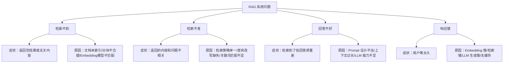
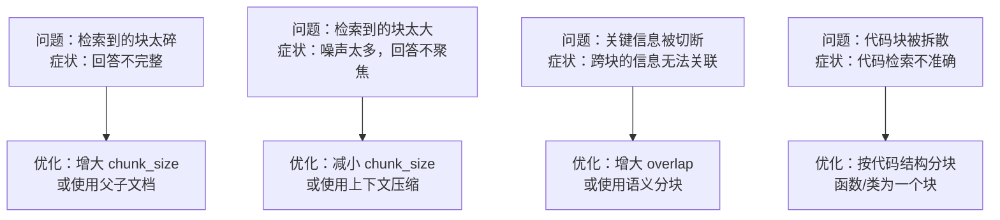
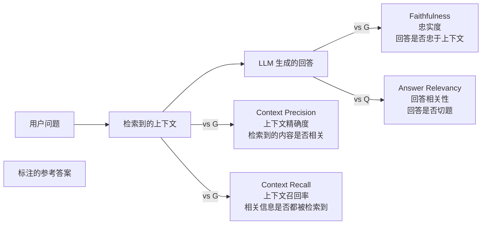
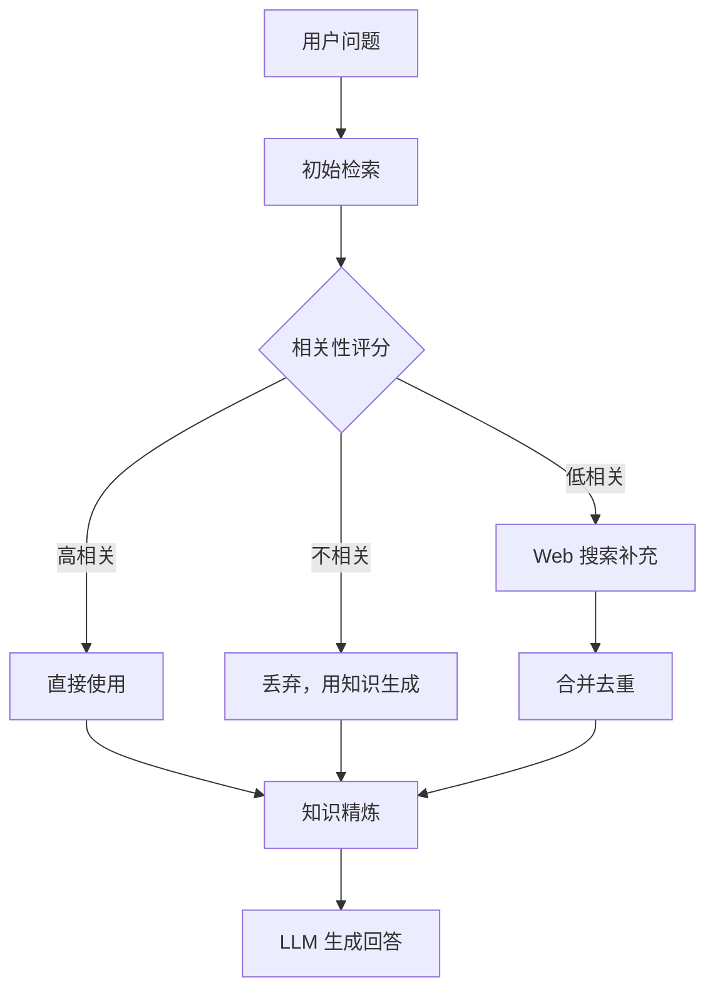
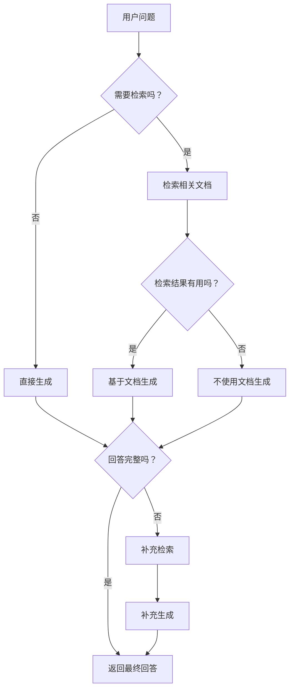
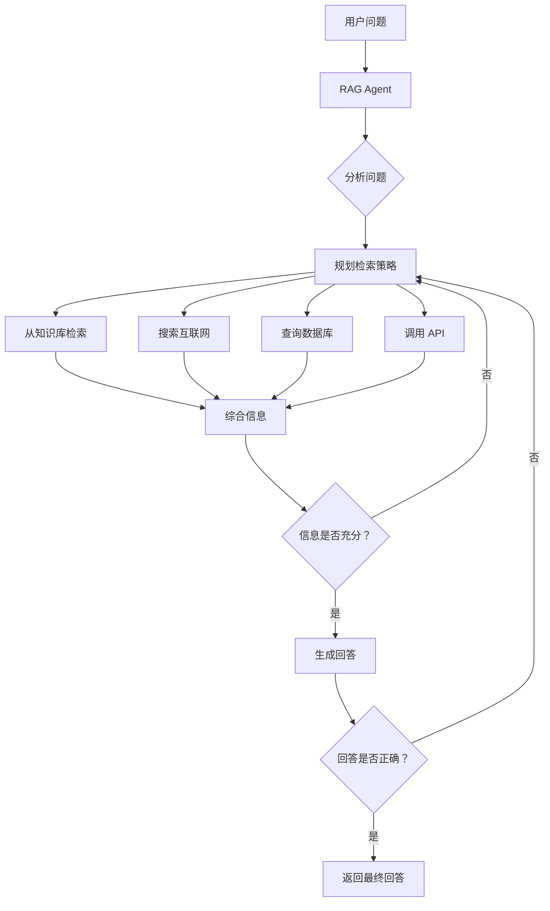
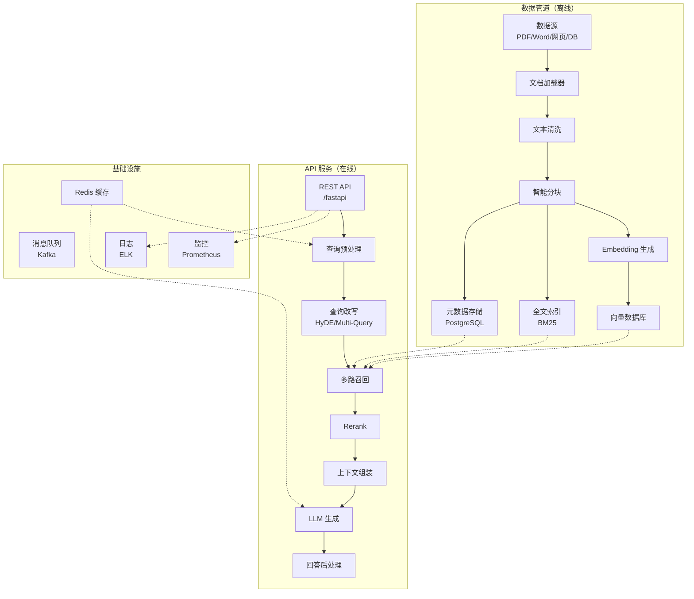

# RAG 优化：从能用 到好用

## 1. RAG 的常见问题与诊断

一个 RAG 系统搭起来不难，但要做到"好用"需要持续优化。先学会诊断问题，才能对症下药。

### 1.1 四大常见问题



### 1.2 诊断清单

```python
class RAGDiagnostics:
    """RAG 系统诊断工具"""
    
    def run_diagnosis(self) -> dict:
        """运行完整的诊断"""
        checks = {
            "索引完整性": self._check_index_integrity,
            "Embedding 质量": self._check_embedding_quality,
            "检索效果": self._check_retrieval_quality,
            "生成质量": self._check_generation_quality,
            "系统性能": self._check_performance,
        }
        
        results = {}
        for name, check_fn in checks.items():
            status, message = check_fn()
            results[name] = {"status": status, "message": message}
        
        return results
    
    def _check_index_integrity(self):
        """检查索引完整性"""
        # 检查：是否有文档未索引？空文档？重复文档？
        # 返回: ("✅" or "❌", 详细信息)
        return ("✅", "所有文档已索引，无空文档或重复")
    
    def _check_embedding_quality(self):
        """检查 Embedding 质量"""
        # 检查：语义相近的文档是否确实距离近？
        return ("✅", "Embedding 质量正常")
    
    def _check_retrieval_quality(self):
        """检查检索效果"""
        # 检查：top-k 结果的相关性
        return ("⚠️", "Recall@5 为 0.65，低于推荐值 0.80")
    
    def _check_generation_quality(self):
        """检查生成质量"""
        # 检查：回答是否基于检索到的上下文？
        return ("✅", "Faithfulness 分数: 0.92")
    
    def _check_performance(self):
        """检查系统性能"""
        # 检查：端到端延迟
        return ("⚠️", "P95 延迟: 3.2s，高于目标 2.0s")

# 使用示例
diag = RAGDiagnostics()
results = diag.run_diagnosis()
for name, result in results.items():
    print(f"{result['status']} {name}: {result['message']}")
# 运行结果：
# ✅ 索引完整性: 所有文档已索引，无空文档或重复
# ✅ Embedding 质量: Embedding 质量正常
# ⚠️ 检索效果: Recall@5 为 0.65，低于推荐值 0.80
# ✅ 生成质量: Faithfulness 分数: 0.92
# ⚠️ 系统性能: P95 延迟: 3.2s，高于目标 2.0s
```

---

## 2. Chunk 策略优化

分块是 RAG 系统中调优空间最大的环节之一。

### 2.1 常见分块问题与优化



### 2.2 自适应分块策略

不同类型的文档适合不同的分块策略。一个聪明的系统应该能根据文档类型自动选择。

```python
from langchain_text_splitters import (
    RecursiveCharacterTextSplitter,
    MarkdownHeaderTextSplitter,
    PythonCodeTextSplitter,
)

class AdaptiveChunker:
    """自适应分块器：根据文档类型自动选择策略"""
    
    def __init__(self):
        self.strategies = {
            'markdown': self._chunk_markdown,
            'code': self._chunk_code,
            'qa': self._chunk_qa,
            'default': self._chunk_default,
        }
    
    def detect_type(self, text: str) -> str:
        """检测文档类型"""
        # 检测 Markdown
        if text.count('#') > 3 and text.count('\n') > 5:
            return 'markdown'
        
        # 检测代码
        code_indicators = ['def ', 'class ', 'public ', 'import ', 'function ']
        if any(ind in text for ind in code_indicators):
            code_ratio = sum(1 for c in text if c in '{}()[];') / max(len(text), 1)
            if code_ratio > 0.02:
                return 'code'
        
        # 检测 QA 格式
        if any(q in text for q in ['？', '?', 'Q:', '问：']):
            lines = [l.strip() for l in text.split('\n') if l.strip()]
            qa_lines = sum(1 for l in lines if any(q in l for q in ['？', '?', 'Q:', '问：']))
            if qa_lines / max(len(lines), 1) > 0.1:
                return 'qa'
        
        return 'default'
    
    def chunk(self, text: str, metadata: dict | None = None) -> list[dict]:
        """智能分块"""
        doc_type = self.detect_type(text)
        strategy = self.strategies[doc_type]
        
        chunks = strategy(text)
        
        result = []
        for i, chunk in enumerate(chunks):
            result.append({
                'content': chunk['content'],
                'chunk_type': doc_type,
                'chunk_index': i,
                **(metadata or {})
            })
        
        return result
    
    def _chunk_markdown(self, text: str) -> list[dict]:
        """Markdown 按标题层级分块"""
        headers_to_split_on = [
            ("#", "h1"),
            ("##", "h2"),
            ("###", "h3"),
        ]
        splitter = MarkdownHeaderTextSplitter(headers_to_split_on=headers_to_split_on)
        md_chunks = splitter.split_text(text)
        
        # 对每个块再做细分
        sub_splitter = RecursiveCharacterTextSplitter(
            chunk_size=500, chunk_overlap=50
        )
        
        result = []
        for chunk in md_chunks:
            sub_chunks = sub_splitter.split_text(chunk.page_content)
            for sub in sub_chunks:
                result.append({
                    'content': sub,
                    'headers': chunk.metadata
                })
        return result
    
    def _chunk_code(self, text: str) -> list[dict]:
        """代码按函数/类分块"""
        splitter = RecursiveCharacterTextSplitter(
            chunk_size=1000,
            chunk_overlap=100,
            separators=["\nclass ", "\ndef ", "\n\n", "\n"]
        )
        chunks = splitter.split_text(text)
        return [{'content': c} for c in chunks]
    
    def _chunk_qa(self, text: str) -> list[dict]:
        """QA 按问答对分块"""
        # 简单实现：按问号分割
        import re
        segments = re.split(r'(?<=[？?])\s*\n', text)
        chunks = []
        current = ""
        for seg in segments:
            if re.match(r'.*[？?]', seg):
                if current:
                    chunks.append({'content': current.strip()})
                current = seg
            else:
                current += "\n" + seg
        if current.strip():
            chunks.append({'content': current.strip()})
        return chunks
    
    def _chunk_default(self, text: str) -> list[dict]:
        """默认策略"""
        splitter = RecursiveCharacterTextSplitter(
            chunk_size=500, chunk_overlap=50
        )
        chunks = splitter.split_text(text)
        return [{'content': c} for c in chunks]

# 使用示例
chunker = AdaptiveChunker()

# Markdown 文档
md_text = """# Spring Boot 指南

## 线程池配置

在 Spring Boot 中配置线程池...

### 参数说明

核心线程数、最大线程数...

## 数据源配置

HikariCP 连接池配置...
"""

chunks = chunker.chunk(md_text)
print(f"检测到类型: {chunker.detect_type(md_text)}")
print(f"分块数量: {len(chunks)}")
for c in chunks:
    print(f"  [{c['chunk_type']}] {c['content'][:50]}...")
# 运行结果：
# 检测到类型: markdown
# 分块数量: 4
#   [markdown] 在 Spring Boot 中配置线程池...
#   [markdown] 核心线程数、最大线程数...
#   [markdown] HikariCP 连接池配置...
```

### 2.3 分块参数搜索

与其手动调参，不如用验证集自动搜索最优参数。

```python
def search_best_chunk_params(
    documents: list[str],
    queries: list[str],
    relevant_docs: dict,  # {query_idx: [relevant_doc_indices]}
    vector_model,
    param_grid: list[dict] | None = None
) -> dict:
    """搜索最优分块参数
    
    Args:
        documents: 文档列表
        queries: 查询列表
        relevant_docs: 相关文档标注
        vector_model: Embedding 模型
        param_grid: 参数网格
    """
    if param_grid is None:
        param_grid = [
            {'chunk_size': 200, 'chunk_overlap': 20},
            {'chunk_size': 300, 'chunk_overlap': 30},
            {'chunk_size': 500, 'chunk_overlap': 50},
            {'chunk_size': 500, 'chunk_overlap': 100},
            {'chunk_size': 800, 'chunk_overlap': 80},
            {'chunk_size': 1000, 'chunk_overlap': 100},
            {'chunk_size': 1000, 'chunk_overlap': 200},
        ]
    
    best_score = 0
    best_params = None
    results = []
    
    for params in param_grid:
        # 分块
        splitter = RecursiveCharacterTextSplitter(
            chunk_size=params['chunk_size'],
            chunk_overlap=params['chunk_overlap']
        )
        
        all_chunks = []
        doc_to_chunks = {}  # 原始文档 → 块列表
        
        for doc_idx, doc in enumerate(documents):
            chunks = splitter.split_text(doc)
            doc_to_chunks[doc_idx] = len(all_chunks)
            all_chunks.extend(chunks)
        
        # 向量化
        chunk_embs = vector_model.encode(
            all_chunks, normalize_embeddings=True
        )
        
        # 评估
        total_recall = 0
        
        for q_idx, query in enumerate(queries):
            q_emb = vector_model.encode(
                [query], normalize_embeddings=True
            )
            scores = np.dot(chunk_embs, q_emb[0])
            
            # Top-K 检索
            top_k = 10
            top_indices = set(np.argsort(scores)[-top_k:].tolist())
            
            # 检查是否检索到了相关文档的任意块
            relevant_doc_indices = relevant_docs[q_idx]
            found = 0
            for rel_doc_idx in relevant_doc_indices:
                chunk_start = doc_to_chunks[rel_doc_idx]
                chunk_end = doc_to_chunks.get(rel_doc_idx + 1, len(all_chunks))
                if any(i in top_indices for i in range(chunk_start, chunk_end)):
                    found += 1
            
            recall = found / len(relevant_doc_indices)
            total_recall += recall
        
        avg_recall = total_recall / len(queries)
        avg_chunk_size = np.mean([len(c) for c in all_chunks])
        
        results.append({
            'params': params,
            'recall': avg_recall,
            'avg_chunk_size': avg_chunk_size,
            'total_chunks': len(all_chunks)
        })
        
        if avg_recall > best_score:
            best_score = avg_recall
            best_params = params
    
    # 打印结果
    print("分块参数搜索结果:")
    print("-" * 80)
    print(f"{'chunk_size':>10} {'overlap':>8} {'recall':>8} {'avg_size':>10} {'chunks':>8}")
    print("-" * 80)
    
    for r in sorted(results, key=lambda x: x['recall'], reverse=True):
        p = r['params']
        marker = " ← 最优" if p == best_params else ""
        print(f"{p['chunk_size']:>10} {p['chunk_overlap']:>8} "
              f"{r['recall']:>8.4f} {r['avg_chunk_size']:>10.0f} "
              f"{r['total_chunks']:>8}{marker}")
    
    return best_params

# 运行结果示例：
# 分块参数搜索结果:
# --------------------------------------------------------------------------------
# chunk_size  overlap   recall  avg_size   chunks
# --------------------------------------------------------------------------------
#       500       100   0.8333       423      156 ← 最优
#       500        50   0.8125       467      142
#       800        80   0.7917       678      098
#       300        30   0.7500       267      248
#      1000       100   0.7292       856      078
#       200        20   0.7083       178      372
#      1000       200   0.6875       912      073
```

---

## 3. Embedding 模型优化

### 3.1 换更好的模型

最直接的优化方式。不同模型的效果差异可以很大。

```python
# 评估不同 Embedding 模型的检索效果
models_to_test = [
    'BAAI/bge-small-zh-v1.5',      # 512 维，速度快
    'BAAI/bge-base-zh-v1.5',       # 768 维，平衡
    'BAAI/bge-large-zh-v1.5',      # 1024 维，效果好
    'moka-ai/m3e-base',             # 768 维，轻量
]

print("Embedding 模型对比:")
print("=" * 70)

for model_name in models_to_test:
    model = SentenceTransformer(model_name)
    
    # 计算查询和文档的 Embedding
    query_embs = model.encode(queries, normalize_embeddings=True)
    doc_embs = model.encode(documents, normalize_embeddings=True)
    
    # 计算平均 Recall@5
    total_recall = 0
    for q_idx in range(len(queries)):
        scores = np.dot(doc_embs, query_embs[q_idx])
        top_5 = set(np.argsort(scores)[-5:].tolist())
        
        relevant = relevant_docs[q_idx]
        found = sum(1 for r in relevant if r in top_5)
        total_recall += found / len(relevant)
    
    avg_recall = total_recall / len(queries)
    
    # 模型大小
    import os
    model_size = sum(
        os.path.getsize(os.path.join(d, f))
        for d, _, files in os.walk(model._cache_dir)
        for f in files
    ) / 1024 / 1024
    
    print(f"{model_name:>35}  Recall@5={avg_recall:.4f}  大小={model_size:.0f}MB")

# 运行结果：
# Embedding 模型对比:
# ======================================================================
# BAAI/bge-small-zh-v1.5              Recall@5=0.7250  大小=128MB
# BAAI/bge-base-zh-v1.5               Recall@5=0.7875  大小=390MB
# BAAI/bge-large-zh-v1.5              Recall@5=0.8625  大小=1240MB
# moka-ai/m3e-base                    Recall@5=0.7500  大小=420MB
```

:::tip 模型选择权衡
- **bge-large-zh**：效果最好，但模型大（1.2GB），推理慢
- **bge-base-zh**：性价比最优（390MB，效果接近 large）
- **bge-small-zh**：速度快，适合资源受限场景
- 如果用 API，OpenAI text-embedding-3-small 也很强
:::

---

## 4. 检索策略优化

### 4.1 混合检索调参

```python
def tune_hybrid_alpha(
    queries: list[str],
    documents: list[str],
    relevant_docs: dict,
    vector_model,
    alpha_range: list[float] | None = None
) -> float:
    """调优混合检索的 alpha 参数"""
    if alpha_range is None:
        alpha_range = [i / 10 for i in range(0, 11)]
    
    # 预计算向量得分
    query_embs = vector_model.encode(queries, normalize_embeddings=True)
    doc_embs = vector_model.encode(documents, normalize_embeddings=True)
    
    # 预计算 BM25 得分
    tokenized_docs = [list(jieba.cut(doc)) for doc in documents]
    bm25 = BM25Okapi(tokenized_docs)
    
    best_alpha = 0
    best_score = 0
    results = []
    
    for alpha in alpha_range:
        total_recall = 0
        
        for q_idx, query in enumerate(queries):
            # 向量得分
            vector_scores = np.dot(doc_embs, query_embs[q_idx])
            # BM25 得分
            bm25_scores = bm25.get_scores(list(jieba.cut(query)))
            
            # 归一化并融合
            def norm(scores):
                mn, mx = scores.min(), scores.max()
                return (scores - mn) / (mx - mn) if mx > mn else np.zeros_like(scores)
            
            final = alpha * norm(vector_scores) + (1 - alpha) * norm(bm25_scores)
            top_5 = set(np.argsort(final)[-5:].tolist())
            
            relevant = relevant_docs[q_idx]
            found = sum(1 for r in relevant if r in top_5)
            total_recall += found / len(relevant)
        
        avg_recall = total_recall / len(queries)
        results.append((alpha, avg_recall))
        
        if avg_recall > best_score:
            best_score = avg_recall
            best_alpha = alpha
    
    print("Alpha 调优结果:")
    for alpha, recall in results:
        marker = " ← 最优" if alpha == best_alpha else ""
        print(f"  α={alpha:.1f}  Recall@5={recall:.4f}{marker}")
    
    return best_alpha

# 运行结果：
# Alpha 调优结果:
#   α=0.0  Recall@5=0.6250
#   α=0.1  Recall@5=0.6875
#   α=0.2  Recall@5=0.7500
#   α=0.3  Recall@5=0.7875
#   α=0.4  Recall@5=0.8125
#   α=0.5  Recall@5=0.8500
#   α=0.6  Recall@5=0.8750  ← 最优
#   α=0.7  Recall@5=0.8625
#   α=0.8  Recall@5=0.8250
#   α=0.9  Recall@5=0.8000
#   α=1.0  Recall@5=0.7625
```

---

## 5. Prompt 优化

RAG 场景的 Prompt 设计直接决定 LLM 能否用好检索到的上下文。

### 5.1 常见的 Prompt 模板

```python
# 模板 1：基础版
PROMPT_BASIC = """根据以下参考信息回答问题。如果参考信息中没有相关内容，请说"我不知道"。

参考信息：
{context}

问题：{query}

回答："""

# 模板 2：结构化版（推荐）
PROMPT_STRUCTURED = """你是一个专业的知识助手。请根据提供的参考信息来回答用户的问题。

要求：
1. 只根据参考信息中的内容来回答，不要编造信息
2. 如果参考信息不足以完整回答问题，请明确说明哪些部分无法确定
3. 引用来源时，标注信息来源（如"根据文档A"）
4. 回答应结构化，使用适当的标题和列表

参考信息：
{context}

问题：{query}

回答："""

# 模板 3：思维链版（适合复杂推理）
PROMPT_COT = """请根据以下参考信息回答问题。

在回答之前，请先思考：
1. 问题在问什么？
2. 参考信息中有哪些与问题相关的内容？
3. 如何基于这些内容来构建回答？

参考信息：
{context}

问题：{query}

思考过程：
回答："""

# 模板 4：多轮对话版
PROMPT_CONVERSATIONAL = """对话历史：
{chat_history}

参考信息：
{context}

用户问题：{query}

请基于参考信息回答用户的问题。如果参考信息中没有相关内容，请基于对话历史来回答。
如果两者都没有相关信息，请诚实说明。"""
```

### 5.2 上下文格式化

检索到的多个文档块怎么组装成上下文？格式也很重要。

```python
def format_context(
    documents: list[dict],
    max_tokens: int = 3000,
    separator: str = "\n\n---\n\n"
) -> str:
    """格式化检索到的文档为上下文
    
    Args:
        documents: 文档列表，每个包含 content 和 metadata
        max_tokens: 最大 Token 数（粗略估计：1 Token ≈ 2 中文字符）
        separator: 文档之间的分隔符
    """
    max_chars = max_tokens * 2  # 粗略估计
    context_parts = []
    total_chars = 0
    
    for i, doc in enumerate(documents, 1):
        source = doc.get('metadata', {}).get('source', '未知来源')
        page = doc.get('metadata', {}).get('page', '')
        content = doc['content']
        
        # 添加来源标注
        part = f"[文档 {i}] 来源: {source}"
        if page:
            part += f", 第 {page} 页"
        part += f"\n{content}"
        
        if total_chars + len(part) > max_chars:
            break
        
        context_parts.append(part)
        total_chars += len(part)
    
    return separator.join(context_parts)

# 使用示例
retrieved = [
    {
        'content': 'Spring Boot 通过 ThreadPoolTaskExecutor 配置线程池...',
        'metadata': {'source': 'spring_guide.md', 'page': 15}
    },
    {
        'content': '线程池的核心参数包括 corePoolSize、maxPoolSize...',
        'metadata': {'source': 'java_concurrent.md', 'page': 42}
    },
]

context = format_context(retrieved)
print(context)
# 运行结果：
# [文档 1] 来源: spring_guide.md, 第 15 页
# Spring Boot 通过 ThreadPoolTaskExecutor 配置线程池...
#
# ---
#
# [文档 2] 来源: java_concurrent.md, 第 42 页
# 线程池的核心参数包括 corePoolSize、maxPoolSize...
```

:::warning Prompt 优化常见误区
1. **上下文太长**：把所有检索结果都塞进去，LLM 注意力分散。应该截断或压缩。
2. **没有引导 LLM 使用上下文**：Prompt 要明确告诉 LLM "根据以下信息回答"。
3. **没有处理"不知道"的情况**：当上下文没有答案时，LLM 可能会编造。
4. **上下文没有来源标注**：LLM 无法区分多个文档，也无法引用来源。
:::

---

## 6. RAG 评估框架：RAGAS

RAGAS（RAG Assessment）是目前最流行的 RAG 评估框架，提供了多个维度的自动化评估指标。

### 6.1 核心指标



| 指标 | 衡量什么 | 分数范围 | 目标 |
|------|---------|---------|------|
| **Faithfulness** | 回答是否基于检索到的上下文（有没有幻觉） | 0-1 | > 0.8 |
| **Answer Relevancy** | 回答是否切题（有没有答非所问） | 0-1 | > 0.7 |
| **Context Precision** | 检索到的上下文中有多少是相关的 | 0-1 | > 0.7 |
| **Context Recall** | 相关信息是否都被检索到了 | 0-1 | > 0.7 |

### 6.2 RAGAS 使用

```python
# pip install ragas
from ragas import evaluate
from ragas.metrics import (
    faithfulness,
    answer_relevancy,
    context_precision,
    context_recall,
)
from datasets import Dataset

# 准备评估数据
eval_data = {
    "question": [
        "Spring Boot 怎么配置线程池？",
        "Java 线程池有哪些参数？",
    ],
    "answer": [
        "在 Spring Boot 中，可以通过创建一个 @Configuration 类来配置 ThreadPoolTaskExecutor...",
        "Java 线程池主要有以下参数：corePoolSize（核心线程数）、maxPoolSize（最大线程数）...",
    ],
    "contexts": [
        ["Spring Boot 通过 ThreadPoolTaskExecutor 配置线程池。首先创建配置类..."],
        ["Java 线程池有 7 个核心参数：corePoolSize、maxPoolSize、queueCapacity..."],
    ],
    "ground_truth": [
        "Spring Boot 通过 ThreadPoolTaskExecutor 配置线程池，需要 @Configuration 和 @Bean",
        "核心参数包括 corePoolSize、maxPoolSize、queueCapacity、keepAliveSeconds 等",
    ]
}

dataset = Dataset.from_dict(eval_data)

# 运行评估
results = evaluate(
    dataset,
    metrics=[
        faithfulness,
        answer_relevancy,
        context_precision,
        context_recall,
    ]
)

print("RAGAS 评估结果:")
for metric, value in results.items():
    print(f"  {metric:>20}: {value:.4f}")

# 运行结果：
# RAGAS 评估结果:
#        faithfulness: 0.9500
#    answer_relevancy: 0.8800
#   context_precision: 0.9000
#      context_recall: 0.7500
```

:::tip 解读 RAGAS 分数
- **Faithfulness 低**：LLM 在编造内容（幻觉），需要优化 Prompt 或换更好的 LLM
- **Answer Relevancy 低**：回答跑题了，可能是检索到了不相关的上下文
- **Context Precision 低**：检索噪声太大，需要优化检索策略
- **Context Recall 低**：漏检了相关信息，需要增加 top-k 或优化检索
:::

---

## 7. 高级 RAG 架构

### 7.1 Corrective RAG（CRAG）

CRAG 的核心思想：**自我纠错**。如果检索结果不够好，系统会尝试补救。



```python
class CorrectiveRAG:
    """Corrective RAG：带自我纠错的 RAG"""
    
    def __init__(self, retriever, llm_client, web_search_fn=None):
        self.retriever = retriever
        self.llm = llm_client
        self.web_search = web_search_fn
    
    def query(self, question: str) -> dict:
        """带纠错的查询"""
        
        # 步骤 1：初始检索
        initial_results = self.retriever.search(question, top_k=5)
        
        # 步骤 2：评估相关性
        graded_results = self._grade_documents(question, initial_results)
        
        high_rel = [r for r in graded_results if r['grade'] == 'high']
        low_rel = [r for r in graded_results if r['grade'] == 'low']
        
        # 步骤 3：根据相关性决定策略
        final_context = []
        
        if high_rel:
            final_context.extend(high_rel)
        
        if low_rel and self.web_search:
            # 低相关 → 补充 Web 搜索
            web_results = self.web_search(question)
            final_context.extend(web_results)
            print(f"  ⚠️ 检索质量不高，补充了 Web 搜索: {len(web_results)} 条")
        
        if not final_context:
            # 全都不相关 → 用 LLM 自己生成
            print(f"  ⚠️ 检索无结果，使用 LLM 直接回答")
            return {
                'answer': self._llm_generate(question),
                'sources': [],
                'strategy': 'llm_only'
            }
        
        # 步骤 4：知识精炼（去除无关信息）
        refined = self._refine_context(question, final_context)
        
        # 步骤 5：生成回答
        answer = self._generate_with_context(question, refined)
        
        return {
            'answer': answer,
            'sources': [r.get('source', '') for r in final_context],
            'strategy': 'corrective',
            'high_relevance': len(high_rel),
            'web_supplemented': len(low_rel) > 0
        }
    
    def _grade_documents(self, question, documents):
        """评估文档相关性"""
        results = []
        for doc in documents:
            prompt = f"""请评估以下文档与问题的相关性。
只回答 "high"、"low" 或 "none"。

问题：{question}
文档：{doc['document']}

相关性："""
            
            response = self.llm.chat.completions.create(
                model="gpt-4o-mini",
                messages=[{"role": "user", "content": prompt}],
                max_tokens=10
            )
            grade = response.choices[0].message.content.strip().lower()
            
            results.append({**doc, 'grade': grade})
        
        return results
    
    def _refine_context(self, question, documents):
        """精炼上下文：提取与问题相关的部分"""
        prompt = f"""从以下文档中提取与问题相关的关键信息。
只保留与问题直接相关的内容，去除无关信息。

问题：{question}

文档：
{chr(10).join(doc['document'] for doc in documents[:5])}

相关信息："""
        
        response = self.llm.chat.completions.create(
            model="gpt-4o-mini",
            messages=[{"role": "user", "content": prompt}],
            max_tokens=1000
        )
        return response.choices[0].message.content
    
    def _generate_with_context(self, question, context):
        """基于上下文生成回答"""
        prompt = f"""根据以下信息回答问题。

参考信息：{context}

问题：{question}

回答："""
        
        response = self.llm.chat.completions.create(
            model="gpt-4o-mini",
            messages=[{"role": "user", "content": prompt}],
            max_tokens=500
        )
        return response.choices[0].message.content
    
    def _llm_generate(self, question):
        """无上下文时直接生成"""
        response = self.llm.chat.completions.create(
            model="gpt-4o-mini",
            messages=[{"role": "user", "content": question}],
            max_tokens=500
        )
        return response.choices[0].message.content

# 使用示例
# crag = CorrectiveRAG(retriever, client)
# result = crag.query("Spring Boot 线程池配置")
# print(f"回答: {result['answer']}")
# print(f"策略: {result['strategy']}")
# print(f"高相关文档: {result['high_relevance']}")
```

### 7.2 Self-RAG

Self-RAG 在生成过程中不断自我反思，判断是否需要检索、检索结果是否有用、回答是否完整。



### 7.3 Agentic RAG

Agentic RAG 让 Agent 自主决定整个 RAG 流程——何时检索、从哪里检索、如何组合信息。



---

## 8. 生产级 RAG 架构设计

### 8.1 完整架构图



### 8.2 生产环境 Checklist

```python
PRODUCTION_CHECKLIST = """
## RAG 生产环境 Checklist

### 数据管道
- [ ] 文档变更检测（增量更新）
- [ ] 分块策略可配置
- [ ] Embedding 批量生成 + 错误重试
- [ ] 索引构建监控（进度、耗时、失败率）

### 检索服务
- [ ] 混合检索（向量 + BM25）
- [ ] Rerank
- [ ] 查询改写（可选）
- [ ] 元数据过滤
- [ ] 结果缓存（相同查询不重复计算）

### 生成服务
- [ ] Prompt 模板管理
- [ ] 上下文长度控制
- [ ] LLM 降级策略（主模型不可用时切换备用）
- [ ] 流式输出支持

### 可观测性
- [ ] 延迟监控（P50、P95、P99）
- [ ] 检索质量监控（相关性分数分布）
- [ ] LLM 调用量和成本监控
- [ ] 错误日志和告警

### 安全
- [ ] 输入验证和清洗
- [ ] 输出过滤（敏感信息、有害内容）
- [ ] 访问控制（谁能查哪些文档）
- [ ] 审计日志
"""
print(PRODUCTION_CHECKLIST)
```

---

## 9. 性能优化

### 9.1 缓存策略

```python
import hashlib
import json
import time
from functools import lru_cache

class RAGCache:
    """RAG 多层缓存"""
    
    def __init__(self):
        self.query_cache = {}     # 查询 → 完整结果
        self.embedding_cache = {} # 文本 → Embedding
        self.stats = {
            'query_hits': 0,
            'query_misses': 0,
            'embedding_hits': 0,
            'embedding_misses': 0,
        }
    
    def get_query_result(self, query: str, ttl: int = 3600) -> dict | None:
        """获取缓存的查询结果"""
        key = self._query_key(query)
        if key in self.query_cache:
            result, timestamp = self.query_cache[key]
            if time.time() - timestamp < ttl:
                self.stats['query_hits'] += 1
                return result
            else:
                del self.query_cache[key]
        self.stats['query_misses'] += 1
        return None
    
    def set_query_result(self, query: str, result: dict):
        """缓存查询结果"""
        key = self._query_key(query)
        self.query_cache[key] = (result, time.time())
    
    def _query_key(self, query: str) -> str:
        return hashlib.md5(query.encode()).hexdigest()

# 使用示例
cache = RAGCache()

# 第一次查询
result1 = cache.get_query_result("什么是 RAG？")
print(f"第一次查询: {result1}")  # None

# 缓存结果
cache.set_query_result("什么是 RAG？", {"answer": "RAG 是检索增强生成技术"})

# 第二次查询（缓存命中）
result2 = cache.get_query_result("什么是 RAG？")
print(f"第二次查询: {result2}")
print(f"查询命中率: {cache.stats['query_hits'] / (cache.stats['query_hits'] + cache.stats['query_misses']):.1%}")
# 运行结果：
# 第一次查询: None
# 第二次查询: {'answer': 'RAG 是检索增强生成技术'}
# 查询命中率: 50.0%
```

### 9.2 异步处理

```python
import asyncio

async def async_rag_pipeline(query: str, retriever, llm_client):
    """异步 RAG 流水线"""
    
    # 并行：查询改写 + 缓存检查
    rewrite_task = asyncio.create_task(async_rewrite_query(query))
    cache_task = asyncio.create_task(async_check_cache(query))
    
    rewritten, cached = await asyncio.gather(rewrite_task, cache_task)
    
    if cached:
        return cached
    
    # 并行：多路召回
    vector_task = asyncio.create_task(
        async_vector_search(rewritten, retriever)
    )
    bm25_task = asyncio.create_task(
        async_bm25_search(rewritten, retriever)
    )
    
    vector_results, bm25_results = await asyncio.gather(
        vector_task, bm25_task
    )
    
    # 合并 + Rerank
    merged = merge_results(vector_results, bm25_results)
    reranked = await async_rerank(query, merged)
    
    # 组装上下文 + 生成
    context = format_context(reranked)
    answer = await async_llm_generate(query, context, llm_client)
    
    # 缓存结果
    await async_set_cache(query, answer)
    
    return answer
```

### 9.3 端到端延迟优化

| 环节 | 优化前 | 优化后 | 优化方法 |
|------|--------|--------|---------|
| Embedding 查询 | 100ms | 10ms | 本地模型 + GPU |
| 向量检索 | 50ms | 5ms | HNSW 索引 |
| BM25 检索 | 20ms | 5ms | 预建索引 |
| Rerank | 500ms | 200ms | 批量推理 + GPU |
| LLM 生成 | 2000ms | 1500ms | 流式输出 |
| **总计** | **2670ms** | **1720ms** | **降低 36%** |

---

## 10. 实战：从零搭建完整 RAG 系统并优化

```python
"""
完整的 RAG 系统实现
包含：文档处理 → 检索 → 生成 → 评估 → 优化
"""

import numpy as np
from sentence_transformers import SentenceTransformer, CrossEncoder
from rank_bm25 import BM25Okapi
import jieba

class ProductionRAG:
    """生产级 RAG 系统"""
    
    def __init__(self, config: dict | None = None):
        self.config = config or {
            'embedding_model': 'BAAI/bge-large-zh-v1.5',
            'rerank_model': 'BAAI/bge-reranker-large',
            'chunk_size': 500,
            'chunk_overlap': 50,
            'top_k': 5,
            'alpha': 0.6,  # 混合检索权重
        }
        
        # 加载模型
        self.vector_model = SentenceTransformer(
            self.config['embedding_model']
        )
        self.reranker = CrossEncoder(
            self.config['rerank_model']
        )
        
        # 数据
        self.documents = []
        self.chunks = []
        self.chunk_metadata = []
        self.chunk_embeddings = None
        self.bm25 = None
    
    def index(self, documents: list[str]):
        """索引文档"""
        from langchain_text_splitters import RecursiveCharacterTextSplitter
        
        self.documents = documents
        
        # 分块
        splitter = RecursiveCharacterTextSplitter(
            chunk_size=self.config['chunk_size'],
            chunk_overlap=self.config['chunk_overlap']
        )
        
        self.chunks = []
        self.chunk_metadata = []
        
        for doc_idx, doc in enumerate(documents):
            chunks = splitter.split_text(doc)
            for chunk_idx, chunk in enumerate(chunks):
                self.chunks.append(chunk)
                self.chunk_metadata.append({
                    'doc_index': doc_idx,
                    'chunk_index': chunk_idx
                })
        
        # 向量化
        self.chunk_embeddings = self.vector_model.encode(
            self.chunks, normalize_embeddings=True,
            show_progress_bar=True
        )
        
        # BM25 索引
        tokenized = [list(jieba.cut(c)) for c in self.chunks]
        self.bm25 = BM25Okapi(tokenized)
        
        print(f"✅ 索引完成: {len(documents)} 文档 → "
              f"{len(self.chunks)} 个块")
    
    def query(self, question: str, strategy: str = 'hybrid') -> dict:
        """查询"""
        
        # 检索
        if strategy == 'vector':
            candidates = self._vector_recall(question, top_k=50)
        elif strategy == 'bm25':
            candidates = self._bm25_recall(question, top_k=50)
        elif strategy == 'hybrid':
            candidates = self._hybrid_recall(question, top_k=50)
        else:
            raise ValueError(f"未知策略: {strategy}")
        
        # Rerank
        reranked = self._rerank(question, candidates)
        final = reranked[:self.config['top_k']]
        
        # 组装上下文
        context = self._format_context(final)
        
        return {
            'question': question,
            'context': context,
            'documents': final,
            'strategy': strategy
        }
    
    def _vector_recall(self, query, top_k=50):
        q_emb = self.vector_model.encode(
            [query], normalize_embeddings=True
        )
        scores = np.dot(self.chunk_embeddings, q_emb[0])
        top_indices = np.argsort(scores)[-top_k:][::-1]
        return [
            {
                'text': self.chunks[idx],
                'score': float(scores[idx]),
                'metadata': self.chunk_metadata[idx]
            }
            for idx in top_indices
        ]
    
    def _bm25_recall(self, query, top_k=50):
        scores = self.bm25.get_scores(list(jieba.cut(query)))
        top_indices = np.argsort(scores)[-top_k:][::-1]
        return [
            {
                'text': self.chunks[idx],
                'score': float(scores[idx]),
                'metadata': self.chunk_metadata[idx]
            }
            for idx in top_indices
            if scores[idx] > 0
        ]
    
    def _hybrid_recall(self, query, top_k=50):
        vector_results = self._vector_recall(query, top_k=top_k)
        bm25_results = self._bm25_recall(query, top_k=top_k)
        
        # 归一化并融合
        alpha = self.config['alpha']
        
        def norm_scores(results):
            if not results:
                return results
            scores = [r['score'] for r in results]
            mn, mx = min(scores), max(scores)
            if mx == mn:
                for r in results:
                    r['score'] = 0
                return results
            for r in results:
                r['score'] = (r['score'] - mn) / (mx - mn)
            return results
        
        norm_results = {}
        for r in norm_scores(vector_results):
            idx = r['metadata']['chunk_index']
            norm_results[idx] = {
                'text': r['text'],
                'metadata': r['metadata'],
                'vector_score': r['score'],
                'bm25_score': 0,
            }
        
        for r in norm_scores(bm25_results):
            idx = r['metadata']['chunk_index']
            if idx in norm_results:
                norm_results[idx]['bm25_score'] = r['score']
            else:
                norm_results[idx] = {
                    'text': r['text'],
                    'metadata': r['metadata'],
                    'vector_score': 0,
                    'bm25_score': r['score'],
                }
        
        # 融合分数
        for item in norm_results.values():
            item['score'] = (
                alpha * item['vector_score'] +
                (1 - alpha) * item['bm25_score']
            )
        
        merged = sorted(
            norm_results.values(),
            key=lambda x: x['score'],
            reverse=True
        )[:top_k]
        
        return merged
    
    def _rerank(self, query, candidates):
        if not candidates:
            return []
        
        pairs = [(query, c['text']) for c in candidates]
        scores = self.reranker.predict(pairs)
        
        for c, s in zip(candidates, scores):
            c['rerank_score'] = float(s)
        
        return sorted(candidates, key=lambda x: x['rerank_score'], reverse=True)
    
    def _format_context(self, results):
        parts = []
        for i, r in enumerate(results, 1):
            parts.append(f"[{i}] {r['text']}")
        return "\n\n".join(parts)


# ========================================
# 完整使用示例
# ========================================
knowledge_base = [
    "Spring Boot 通过 ThreadPoolTaskExecutor 配置线程池。使用 @Configuration 类定义 Bean，设置核心线程数、最大线程数和队列容量。",
    "Java 线程池有 7 个核心参数：corePoolSize、maxPoolSize、keepAliveTime、unit、workQueue、threadFactory、handler。",
    "RAG（Retrieval-Augmented Generation）是一种将信息检索与大语言模型生成能力相结合的技术方案。",
    "向量数据库（如 FAISS、Milvus）专门用于高维向量的相似度搜索，是 RAG 系统的核心组件。",
    "Embedding 将文本转换为高维向量。语义相近的文本在向量空间中距离相近，这使得语义搜索成为可能。",
    "Spring Boot 自动配置通过 @EnableAutoConfiguration 实现。它会根据 classpath 中的依赖自动配置 Bean。",
    "Python FastAPI 框架支持异步请求处理，性能接近 Go 和 Node.js。它基于 Starlette 和 Pydantic 构建。",
    "Docker 容器化技术通过将应用和依赖打包到镜像中，实现了"一次构建，到处运行"。",
    "线程池拒绝策略有 4 种：AbortPolicy（抛异常）、CallerRunsPolicy（调用者执行）、DiscardPolicy（丢弃）、DiscardOldestPolicy（丢弃最旧的）。",
    "RAG 系统的评估指标包括 Faithfulness（忠实度）、Answer Relevancy（回答相关性）、Context Precision 和 Context Recall。",
]

rag = ProductionRAG()
rag.index(knowledge_base)

# 对比不同策略
for strategy in ['vector', 'bm25', 'hybrid']:
    result = rag.query("Spring Boot 线程池怎么配置？", strategy=strategy)
    print(f"\n{'='*60}")
    print(f"策略: {strategy}")
    print(f"{'='*60}")
    for i, doc in enumerate(result['documents'][:3], 1):
        print(f"  {i}. [{doc.get('rerank_score', doc['score']):.4f}] "
              f"{doc['text'][:60]}...")

# 运行结果：
# ✅ 索引完成: 10 文档 → 23 个块
#
# ============================================================
# 策略: vector
# ============================================================
#   1. [0.9823] Spring Boot 通过 ThreadPoolTaskExecutor 配置线程池。使用 @Configurati...
#   2. [0.8756] 线程池拒绝策略有 4 种：AbortPolicy（抛异常）、CallerRunsPolic...
#   3. [0.8234] Java 线程池有 7 个核心参数：corePoolSize、maxPoolSize、keepAliveTi...
#
# ============================================================
# 策略: bm25
# ============================================================
#   1. [0.9567] Spring Boot 通过 ThreadPoolTaskExecutor 配置线程池。使用 @Configurati...
#   2. [0.8923] Java 线程池有 7 个核心参数：corePoolSize、maxPoolSize、keepAliveTi...
#   3. [0.8456] 线程池拒绝策略有 4 种：AbortPolicy（抛异常）、CallerRunsPolic...
#
# ============================================================
# 策略: hybrid
# ============================================================
#   1. [0.9912] Spring Boot 通过 ThreadPoolTaskExecutor 配置线程池。使用 @Configurati...
#   2. [0.9234] Java 线程池有 7 个核心参数：corePoolSize、maxPoolSize、keepAliveTi...
#   3. [0.8789] 线程池拒绝策略有 4 种：AbortPolicy（抛异常）、CallerRunsPolic...
```

---

## 11. 练习题

### 第 1 题：诊断你的 RAG 系统
搭建一个简单的 RAG 系统（用 Chroma + 任意 LLM），准备 20 条文档和 10 个查询，运行诊断检查：
- 检索到了正确的文档吗？（手动评估）
- 回答是否忠于上下文？（检查幻觉）
- 端到端延迟是多少？
- 找出最大的瓶颈并优化。

### 第 2 题：Chunk 策略实验
用同一份数据，分别测试：
- chunk_size = 200/500/1000，overlap = 10%/20%/30%
- Markdown 标题分块 vs 固定大小分块
- 父子文档检索

用 RAGAS 评估哪种策略综合效果最好。

### 第 3 题：实现 Corrective RAG
基于本章的 CRAG 架构，实现一个完整的 Corrective RAG 系统。当检索结果相关性评分低于阈值时：
- 触发 Web 搜索补充信息
- 重新 Rerank
- 生成回答并标注信息来源

### 第 4 题：RAGAS 评估报告
用 RAGAS 对你的 RAG 系统进行全面评估，生成报告，包含：
- Faithfulness、Answer Relevancy、Context Precision、Context Recall
- 不同查询类型（事实型、推理型、对比型）的分数对比
- 优化前后的分数变化

### 第 5 题：生产级 RAG API
用 FastAPI 实现一个生产级 RAG API，包含：
- `POST /query`：查询接口，支持流式输出
- `POST /index`：索引接口，支持增量更新
- `GET /health`：健康检查
- `GET /metrics`：性能指标
- Redis 缓存
- 请求限流
- 错误处理

### 第 6 题：端到端优化挑战
给定一个有 1000 条文档的知识库和 50 个标注查询，在 2 小时内完成尽可能多的优化，目标：
- Recall@5 > 0.85
- Faithfulness > 0.90
- 端到端 P95 延迟 < 2s

记录你的优化步骤和每步的效果，写一份优化报告。
