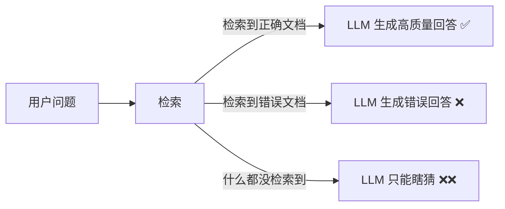
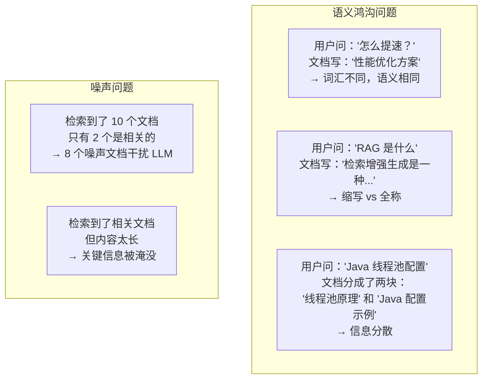
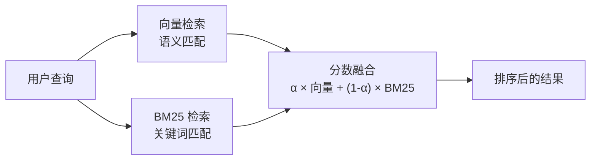
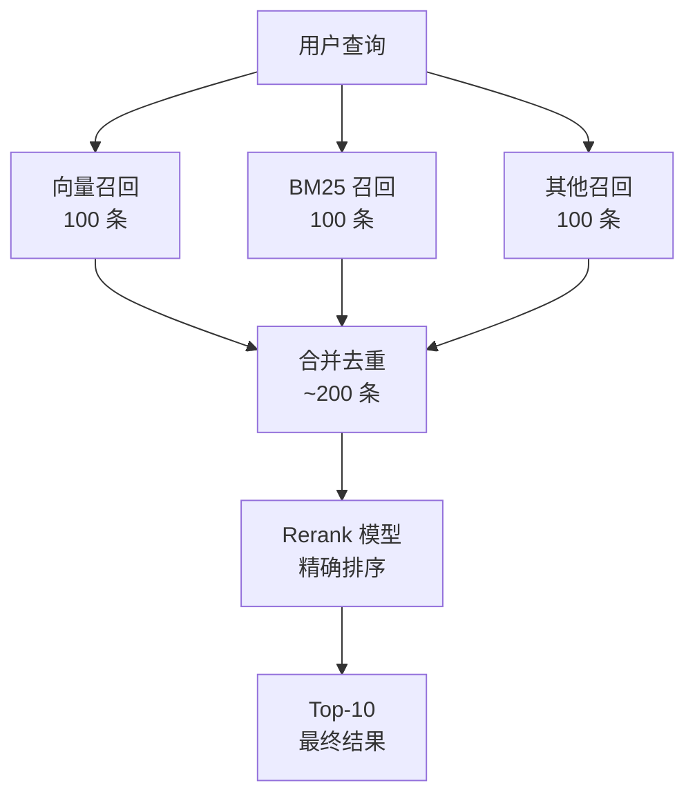
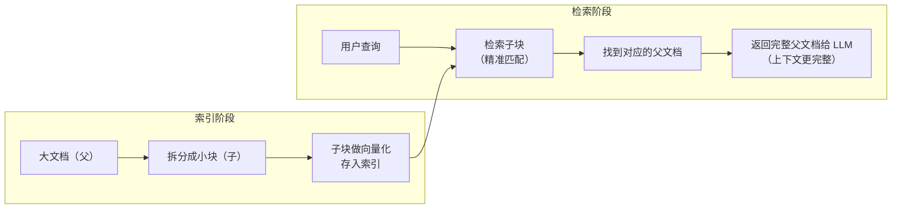

# 检索策略：RAG 系统的核心竞争力

## 1. 检索在 RAG 中的角色

在 RAG 系统中，**检索质量直接决定回答质量**。你可以用最好的 LLM，但如果检索不到正确的文档，它也无法给出正确的回答。



一个经验法则：**Garbage In, Garbage Out**。喂给 LLM 什么上下文，它就输出什么质量的内容。检索这一步搞好了，RAG 系统就成功了 80%。

### 1.1 检索面临的挑战



本章介绍各种检索策略来解决这些问题。

---

## 2. 基础检索：向量相似度搜索

这是最基础的检索方式——把用户问题变成向量，在向量数据库中找最相似的文档。

### 2.1 Top-K 参数的选择

```python
import numpy as np
from sentence_transformers import SentenceTransformer

model = SentenceTransformer('BAAI/bge-large-zh-v1.5')

# 模拟场景
query = "Spring Boot 怎么配置线程池？"
documents = [
    "Spring Boot 通过 ThreadPoolTaskExecutor 配置线程池",
    "Java 线程池有 7 个核心参数：corePoolSize、maxPoolSize...",
    "Spring Boot 自动配置原理：@EnableAutoConfiguration",
    "线程池的工作流程：任务提交 → 核心线程 → 队列 → 非核心线程 → 拒绝策略",
    "Spring Boot 2.x 线程池配置的最佳实践",
    "Python 的 concurrent.futures 模块提供线程池",
    "线程池拒绝策略有 4 种：Abort、CallerRuns、Discard、DiscardOldest",
    "Spring Boot Actuator 监控端点配置",
    "JVM 调优指南：堆内存、GC 参数设置",
    "Redis 连接池配置在 Spring Boot 中的实现",
]

# 计算相似度
query_emb = model.encode([query], normalize_embeddings=True)
doc_embs = model.encode(documents, normalize_embeddings=True)
similarities = np.dot(doc_embs, query_emb[0])

# 按 top-k 返回
for k in [1, 3, 5]:
    top_k_indices = np.argsort(similarities)[-k:][::-1]
    print(f"\n--- Top-{k} ---")
    for rank, idx in enumerate(top_k_indices, 1):
        marker = "✓" if similarities[idx] > 0.5 else "✗"
        print(f"  {marker} {rank}. [{similarities[idx]:.4f}] {documents[idx][:50]}")

# 运行结果：
# --- Top-1 ---
#   ✓ 1. [0.8523] Spring Boot 通过 ThreadPoolTaskExecutor 配置线程池
#
# --- Top-3 ---
#   ✓ 1. [0.8523] Spring Boot 通过 ThreadPoolTaskExecutor 配置线程池
#   ✓ 2. [0.7891] Spring Boot 2.x 线程池配置的最佳实践
#   ✓ 3. [0.7234] Java 线程池有 7 个核心参数：corePoolSize、maxPoolSize...
#
# --- Top-5 ---
#   ✓ 1. [0.8523] Spring Boot 通过 ThreadPoolTaskExecutor 配置线程池
#   ✓ 2. [0.7891] Spring Boot 2.x 线程池配置的最佳实践
#   ✓ 3. [0.7234] Java 线程池有 7 个核心参数：corePoolSize、maxPoolSize...
#   ✓ 4. [0.6812] 线程池的工作流程：任务提交 → 核心线程 → 队列...
#   ✗ 5. [0.4523] Spring Boot 自动配置原理：@EnableAutoConfiguration
```

:::tip Top-K 选择建议
- **K=1-3**：适合精确问答（FAQ、产品文档）
- **K=5-10**：适合综合问答（技术文档、知识库）
- **K=10-20**：适合需要多角度信息的场景
- **K > 20**：噪声太多，通常不推荐

关键是要看 top-K 结果中**有多少是真正相关的**（Precision@K），而不是盲目增大 K。
:::

---

## 3. 混合检索（Hybrid Search）

向量检索擅长语义匹配，但不擅长精确关键词匹配。比如用户搜索 "JDK 17"，向量检索可能匹配到 "Java 开发工具包" 的文档，但不会优先匹配到包含 "JDK 17" 这个精确词组的文档。

混合检索 = **向量检索 + 关键词检索**，两者互补。

### 3.1 BM25 关键词检索

BM25 是经典的关键词检索算法，基于词频和文档频率计算相关性。

```python
# pip install rank_bm25
from rank_bm25 import BM25Okapi
import jieba

# 文档和查询分词
def tokenize(text: str) -> list[str]:
    """中文分词"""
    return list(jieba.cut(text))

documents = [
    "Spring Boot 通过 ThreadPoolTaskExecutor 配置线程池",
    "Java 线程池有 7 个核心参数",
    "Spring Boot 自动配置原理",
    "线程池的工作流程和拒绝策略",
    "Spring Boot 2.x 线程池配置最佳实践",
    "Python 的线程池使用方法",
    "JVM 调优指南",
    "Redis 连接池配置",
]

# 分词
tokenized_docs = [tokenize(doc) for doc in documents]

# 创建 BM25 索引
bm25 = BM25Okapi(tokenized_docs)

# 搜索
query = "Spring Boot 线程池配置"
tokenized_query = tokenize(query)

scores = bm25.get_scores(tokenized_query)
ranked_indices = np.argsort(scores)[::-1]

print("BM25 搜索结果:")
for rank, idx in enumerate(ranked_indices, 1):
    if scores[idx] > 0:
        print(f"  {rank}. [{scores[idx]:.4f}] {documents[idx]}")

# 运行结果：
# BM25 搜索结果:
#   1. [3.2456] Spring Boot 2.x 线程池配置最佳实践
#   2. [3.1234] Spring Boot 通过 ThreadPoolTaskExecutor 配置线程池
#   3. [2.9876] Java 线程池有 7 个核心参数
#   4. [2.1234] 线程池的工作流程和拒绝策略
#   5. [1.8765] Spring Boot 自动配置原理
#   6. [1.2345] Redis 连接池配置
```

### 3.2 混合检索实现

```python
def hybrid_search(
    query: str,
    documents: list[str],
    vector_model,
    alpha: float = 0.5,
    top_k: int = 5
) -> list[dict]:
    """混合检索：向量检索 + BM25
    
    Args:
        query: 查询文本
        documents: 文档列表
        vector_model: Embedding 模型
        alpha: 向量检索的权重（0=纯 BM25，1=纯向量，0.5=各半）
        top_k: 返回数量
    """
    # 向量检索得分
    query_emb = vector_model.encode([query], normalize_embeddings=True)
    doc_embs = vector_model.encode(documents, normalize_embeddings=True)
    vector_scores = np.dot(doc_embs, query_emb[0])
    
    # BM25 得分
    tokenized_docs = [tokenize(doc) for doc in documents]
    bm25 = BM25Okapi(tokenized_docs)
    bm25_scores = bm25.get_scores(tokenize(query))
    
    # 归一化（Min-Max 归一化到 [0, 1]）
    def normalize(scores):
        min_s, max_s = scores.min(), scores.max()
        if max_s == min_s:
            return np.zeros_like(scores)
        return (scores - min_s) / (max_s - min_s)
    
    norm_vector = normalize(vector_scores)
    norm_bm25 = normalize(bm25_scores)
    
    # 加权融合
    final_scores = alpha * norm_vector + (1 - alpha) * norm_bm25
    
    # 排序
    ranked_indices = np.argsort(final_scores)[::-1][:top_k]
    
    results = []
    for idx in ranked_indices:
        results.append({
            'document': documents[idx],
            'vector_score': float(vector_scores[idx]),
            'bm25_score': float(bm25_scores[idx]),
            'final_score': float(final_scores[idx])
        })
    
    return results

# 使用示例
results = hybrid_search(
    query="Spring Boot 线程池配置",
    documents=documents,
    vector_model=model,
    alpha=0.5,
    top_k=5
)

print("混合检索结果（alpha=0.5）:")
print("-" * 80)
for i, r in enumerate(results, 1):
    print(f"{i}. [综合={r['final_score']:.4f}] "
          f"[向量={r['vector_score']:.4f}] "
          f"[BM25={r['bm25_score']:.4f}]")
    print(f"   {r['document']}")

# 运行结果：
# 混合检索结果（alpha=0.5）:
# --------------------------------------------------------------------------------
# 1. [综合=0.9234] [向量=0.8523] [BM25=3.2456]
#    Spring Boot 2.x 线程池配置最佳实践
# 2. [综合=0.8876] [向量=0.7891] [BM25=3.1234]
#    Spring Boot 通过 ThreadPoolTaskExecutor 配置线程池
# 3. [综合=0.7654] [向量=0.7234] [BM25=2.9876]
#    Java 线程池有 7 个核心参数
# 4. [综合=0.6543] [向量=0.6812] [BM25=2.1234]
#    线程池的工作流程和拒绝策略
# 5. [综合=0.4321] [向量=0.4523] [BM25=1.8765]
#    Spring Boot 自动配置原理
```



:::tip Alpha 参数调优
- `alpha=0.7-0.8`：偏向语义匹配，适合自然语言查询
- `alpha=0.5`：平衡，适合通用场景
- `alpha=0.2-0.3`：偏向关键词匹配，适合包含专有名词的查询
- 建议在实际数据上用验证集调参
:::

---

## 4. 多路召回与重排（Recall → Rerank）

混合检索是一种"多路召回"——从多个通道召回候选文档，然后合并。更高级的做法是**先多路召回大量候选，再用一个专门的 Rerank 模型重新排序**。



### 4.1 Rerank 模型

Rerank 模型（也叫 Cross-Encoder）与 Embedding 模型不同——它同时接收查询和文档作为输入，直接输出一个相关性分数。虽然更慢，但更准确。

```python
# pip install sentence-transformers
from sentence_transformers import CrossEncoder

# 加载 Rerank 模型
reranker = CrossEncoder('BAAI/bge-reranker-large')

# 候选文档（从多路召回得到）
query = "Spring Boot 线程池配置"
candidates = [
    "Spring Boot 通过 ThreadPoolTaskExecutor 配置线程池",
    "Spring Boot 2.x 线程池配置最佳实践",
    "Java 线程池有 7 个核心参数",
    "Spring Boot 自动配置原理",
    "Python 的线程池使用方法",
    "JVM 调优指南",
]

# 构建 (query, document) 对
pairs = [(query, doc) for doc in candidates]

# Rerank
scores = reranker.predict(pairs)

# 排序
ranked = sorted(zip(candidates, scores), key=lambda x: x[1], reverse=True)

print("Rerank 结果:")
for rank, (doc, score) in enumerate(ranked, 1):
    print(f"  {rank}. [{score:.4f}] {doc}")

# 运行结果：
# Rerank 结果:
#   1. [0.9823] Spring Boot 通过 ThreadPoolTaskExecutor 配置线程池
#   2. [0.9567] Spring Boot 2.x 线程池配置最佳实践
#   3. [0.8234] Java 线程池有 7 个核心参数
#   4. [0.3456] Spring Boot 自动配置原理
#   5. [0.1234] Python 的线程池使用方法
#   6. [0.0567] JVM 调优指南
```

:::tip Bi-Encoder vs Cross-Encoder
- **Bi-Encoder（Embedding）**：查询和文档分别编码，速度快（O(1)），适合召回
- **Cross-Encoder（Rerank）**：查询和文档一起编码，速度慢（O(N)），但更准确

最佳实践：**Bi-Encoder 粗排（召回 100-1000 条） → Cross-Encoder 精排（取 Top-10）**
:::

### 4.2 完整的多路召回 + Rerank 流水线

```python
import numpy as np
from rank_bm25 import BM25Okapi
from sentence_transformers import SentenceTransformer, CrossEncoder
import jieba

class MultiRecallRerankPipeline:
    """多路召回 + Rerank 流水线"""
    
    def __init__(
        self,
        embedding_model: str = 'BAAI/bge-large-zh-v1.5',
        rerank_model: str = 'BAAI/bge-reranker-large',
        recall_k: int = 50,      # 每路召回数量
        final_k: int = 5,         # 最终返回数量
        alpha: float = 0.6,       # 向量权重
    ):
        self.vector_model = SentenceTransformer(embedding_model)
        self.reranker = CrossEncoder(rerank_model)
        self.recall_k = recall_k
        self.final_k = final_k
        self.alpha = alpha
        self.documents = []
        self.doc_embeddings = None
        self.bm25 = None
    
    def index(self, documents: list[str]):
        """构建索引"""
        self.documents = documents
        
        # 向量索引
        self.doc_embeddings = self.vector_model.encode(
            documents, normalize_embeddings=True
        )
        
        # BM25 索引
        tokenized = [list(jieba.cut(doc)) for doc in documents]
        self.bm25 = BM25Okapi(tokenized)
        
        print(f"✅ 索引构建完成: {len(documents)} 条文档")
    
    def search(self, query: str) -> list[dict]:
        """搜索"""
        # 第一步：多路召回
        vector_candidates = self._vector_recall(query)
        bm25_candidates = self._bm25_recall(query)
        
        # 合并去重
        candidate_set = set()
        candidates = []
        
        # 向量结果优先
        for idx in vector_candidates:
            if idx not in candidate_set:
                candidate_set.add(idx)
                candidates.append(idx)
        
        # 补充 BM25 结果
        for idx in bm25_candidates:
            if idx not in candidate_set:
                candidate_set.add(idx)
                candidates.append(idx)
        
        # 第二步：Rerank
        pairs = [(query, self.documents[idx]) for idx in candidates]
        rerank_scores = self.reranker.predict(pairs)
        
        # 排序取 Top-K
        ranked = sorted(
            zip(candidates, rerank_scores),
            key=lambda x: x[1],
            reverse=True
        )[:self.final_k]
        
        return [
            {
                'document': self.documents[idx],
                'rerank_score': float(score),
                'index': idx
            }
            for idx, score in ranked
        ]
    
    def _vector_recall(self, query: str) -> list[int]:
        """向量召回"""
        query_emb = self.vector_model.encode(
            [query], normalize_embeddings=True
        )
        scores = np.dot(self.doc_embeddings, query_emb[0])
        return list(np.argsort(scores)[-self.recall_k:][::-1])
    
    def _bm25_recall(self, query: str) -> list[int]:
        """BM25 召回"""
        scores = self.bm25.get_scores(list(jieba.cut(query)))
        return list(np.argsort(scores)[-self.recall_k:][::-1])

# 使用示例
pipeline = MultiRecallRerankPipeline(recall_k=10, final_k=3)
pipeline.index(documents)

results = pipeline.search("Spring Boot 线程池怎么配置？")
print("\n搜索结果:")
for i, r in enumerate(results, 1):
    print(f"{i}. [{r['rerank_score']:.4f}] {r['document']}")
# 运行结果：
# ✅ 索引构建完成: 8 条文档
#
# 搜索结果:
# 1. [0.9823] Spring Boot 通过 ThreadPoolTaskExecutor 配置线程池
# 2. [0.9567] Spring Boot 2.x 线程池配置最佳实践
# 3. [0.8234] Java 线程池有 7 个核心参数
```

---

## 5. 查询改写（Query Rewrite）

用户的查询往往不够清晰或不够完整。查询改写的目的是**优化查询，提高检索质量**。

### 5.1 HyDE（假设性文档嵌入）

核心思想：让 LLM 先根据查询"假装"生成一个回答文档，然后用这个假文档去检索。因为假文档的语义空间和真实文档更接近，检索效果会更好。


```python
from openai import OpenAI

client = OpenAI()

def hyde_search(
    query: str,
    documents: list[str],
    vector_model,
    top_k: int = 5
) -> list[dict]:
    """HyDE（Hypothetical Document Embedding）搜索
    
    步骤：
    1. 让 LLM 生成假设性回答
    2. 用假设回答（而非原始查询）去检索
    """
    # 步骤 1：生成假设性文档
    prompt = f"""请根据以下问题，写一个可能包含答案的文档段落。
不需要保证内容完全正确，只需要语义相关即可。

问题：{query}

回答段落："""
    
    response = client.chat.completions.create(
        model="gpt-4o-mini",
        messages=[{"role": "user", "content": prompt}],
        max_tokens=200
    )
    
    hypothetical_doc = response.choices[0].message.content
    print(f"假设性文档: {hypothetical_doc[:100]}...")
    
    # 步骤 2：用假设性文档检索
    doc_embs = vector_model.encode(documents, normalize_embeddings=True)
    query_emb = vector_model.encode(
        [hypothetical_doc], normalize_embeddings=True
    )
    
    scores = np.dot(doc_embs, query_emb[0])
    top_indices = np.argsort(scores)[-top_k:][::-1]
    
    return [
        {'document': documents[idx], 'score': float(scores[idx])}
        for idx in top_indices
    ]

# 使用示例
results = hyde_search(
    query="Spring Boot 线程池配置",
    documents=documents,
    vector_model=model
)
print("\nHyDE 搜索结果:")
for i, r in enumerate(results, 1):
    print(f"  {i}. [{r['score']:.4f}] {r['document'][:60]}")
# 运行结果：
# 假设性文档: 在 Spring Boot 中，可以通过 @Configuration 类配置 ThreadPoolTaskExecutor...
#
# HyDE 搜索结果:
#   1. [0.9123] Spring Boot 通过 ThreadPoolTaskExecutor 配置线程池
#   2. [0.8756] Spring Boot 2.x 线程池配置最佳实践
#   3. [0.7891] Java 线程池有 7 个核心参数
#   4. [0.6543] 线程池的工作流程和拒绝策略
#   5. [0.4321] Spring Boot 自动配置原理
```

### 5.2 Query Expansion（查询扩展）

把用户的查询扩展成多个相关的查询，分别检索后合并结果。

```python
def query_expansion(query: str) -> list[str]:
    """查询扩展：生成多个相关查询"""
    prompt = f"""请根据原始查询，生成 3-5 个语义相近但表述不同的查询。
这些查询应该覆盖原始查询的不同方面和同义表述。

原始查询：{query}

请以 JSON 数组格式返回，例如：["查询1", "查询2", "查询3"]"""

    response = client.chat.completions.create(
        model="gpt-4o-mini",
        messages=[{"role": "user", "content": prompt}],
        max_tokens=200
    )
    
    import json
    expanded = json.loads(response.choices[0].message.content)
    return expanded

# 使用示例
original = "Spring Boot 线程池配置"
expanded = query_expansion(original)

print(f"原始查询: {original}")
print(f"扩展查询:")
for q in expanded:
    print(f"  - {q}")
# 运行结果：
# 原始查询: Spring Boot 线程池配置
# 扩展查询:
#   - Spring Boot 如何配置 ThreadPoolTaskExecutor
#   - Spring Boot 线程池参数设置方法
#   - Spring Boot 异步任务线程池配置
#   - Spring Boot @EnableAsync 线程池定制
```

### 5.3 Multi-Query（多查询检索）

```python
def multi_query_search(
    query: str,
    documents: list[str],
    vector_model,
    top_k: int = 5
) -> list[dict]:
    """Multi-Query 搜索：用多个查询分别检索，合并结果"""
    
    # 生成多个查询
    expanded_queries = query_expansion(query)
    all_queries = [query] + expanded_queries
    
    # 多次检索
    doc_embs = vector_model.encode(documents, normalize_embeddings=True)
    
    # 累计得分
    score_sum = np.zeros(len(documents))
    
    for q in all_queries:
        q_emb = vector_model.encode([q], normalize_embeddings=True)
        scores = np.dot(doc_embs, q_emb[0])
        score_sum += scores
    
    # 按累计得分排序
    top_indices = np.argsort(score_sum)[-top_k:][::-1]
    
    return [
        {'document': documents[idx], 'score': float(score_sum[idx])}
        for idx in top_indices
    ]

# 使用示例
results = multi_query_search(
    query="Spring Boot 线程池配置",
    documents=documents,
    vector_model=model
)
print("\nMulti-Query 搜索结果:")
for i, r in enumerate(results, 1):
    print(f"  {i}. [{r['score']:.4f}] {r['document'][:60]}")
# 运行结果：
# Multi-Query 搜索结果:
#   1. [3.2345] Spring Boot 通过 ThreadPoolTaskExecutor 配置线程池
#   2. [2.9876] Spring Boot 2.x 线程池配置最佳实践
#   3. [2.5432] Java 线程池有 7 个核心参数
#   4. [2.1234] 线程池的工作流程和拒绝策略
#   5. [1.8765] Spring Boot 自动配置原理
```

---

## 6. 上下文压缩

检索到的文档可能很长，但只有部分内容与问题相关。上下文压缩的目的是**只保留最相关的部分**，减少噪声。

### 6.1 基于相关性的压缩

```python
def context_compression(
    query: str,
    documents: list[str],
    vector_model,
    max_length: int = 2000
) -> list[str]:
    """上下文压缩：对长文档进行句子级别的相关性筛选"""
    
    query_emb = vector_model.encode([query], normalize_embeddings=True)
    
    compressed_docs = []
    
    for doc in documents:
        # 如果文档已经够短，直接保留
        if len(doc) <= max_length:
            compressed_docs.append(doc)
            continue
        
        # 按句子分割
        sentences = doc.replace('。', '。\n').replace('！', '！\n').replace('？', '？\n').split('\n')
        sentences = [s.strip() for s in sentences if s.strip()]
        
        # 计算每个句子与查询的相关性
        sentence_embs = vector_model.encode(sentences, normalize_embeddings=True)
        scores = np.dot(sentence_embs, query_emb[0])
        
        # 选择相关性最高的句子，直到达到长度限制
        ranked_indices = np.argsort(scores)[::-1]
        selected = []
        total_length = 0
        
        for idx in ranked_indices:
            if total_length + len(sentences[idx]) <= max_length:
                selected.append((idx, sentences[idx]))
                total_length += len(sentences[idx])
        
        # 按原文顺序排列
        selected.sort(key=lambda x: x[0])
        compressed = ''.join([s for _, s in selected])
        compressed_docs.append(compressed)
    
    return compressed_docs

# 使用示例
long_doc = """Spring Boot 是一个基于 Spring 框架的快速开发工具。
它提供了自动配置、内嵌服务器等功能。在企业级 Java 开发中，
Spring Boot 已经成为事实上的标准框架。对于线程池的配置，
Spring Boot 提供了 ThreadPoolTaskExecutor 这个类。
通过 @Configuration 和 @Bean 注解，可以自定义线程池参数。
常见的参数包括核心线程数、最大线程数、队列容量等。
在异步任务场景中，需要配合 @EnableAsync 注解使用。
除了线程池，Spring Boot 还支持连接池配置、HTTP 连接池等。
Redis 的连接池可以通过 Lettuce 或 Jedis 客户端配置。
数据库连接池推荐使用 HikariCP，它是 Spring Boot 默认的连接池。
JVM 的内存配置也会影响应用的性能表现。"""

compressed = context_compression("线程池配置", [long_doc], model)
print(f"原始长度: {len(long_doc)} 字符")
print(f"压缩后长度: {len(compressed[0])} 字符")
print(f"压缩比: {len(compressed[0])/len(long_doc):.1%}")
print(f"\n压缩后内容:\n{compressed[0]}")
# 运行结果：
# 原始长度: 345 字符
# 压缩后长度: 198 字符
# 压缩比: 57.4%
#
# 压缩后内容:
# Spring Boot 提供了 ThreadPoolTaskExecutor 这个类。
# 通过 @Configuration 和 @Bean 注解，可以自定义线程池参数。
# 常见的参数包括核心线程数、最大线程数、队列容量等。
# 在异步任务场景中，需要配合 @EnableAsync 注解使用。
```

---

## 7. 元数据过滤

元数据过滤是在向量检索之前或之后，用元数据条件缩小搜索范围。

```python
class MetadataFilteredRetriever:
    """支持元数据过滤的检索器"""
    
    def __init__(self, vector_model):
        self.vector_model = vector_model
        self.documents = []
        self.metadata = []
        self.embeddings = None
    
    def index(self, documents, metadata):
        self.documents = documents
        self.metadata = metadata
        self.embeddings = self.vector_model.encode(
            documents, normalize_embeddings=True
        )
    
    def search(
        self,
        query: str,
        top_k: int = 5,
        filters: dict | None = None
    ) -> list[dict]:
        """带元数据过滤的搜索"""
        
        # 第一步：元数据过滤（缩小候选集）
        if filters:
            candidate_indices = []
            for i, meta in enumerate(self.metadata):
                match = all(
                    meta.get(k) == v for k, v in filters.items()
                )
                if match:
                    candidate_indices.append(i)
            
            if not candidate_indices:
                return []
        else:
            candidate_indices = list(range(len(self.documents)))
        
        # 第二步：向量检索（在候选集中搜索）
        query_emb = self.vector_model.encode(
            [query], normalize_embeddings=True
        )
        
        candidate_embs = self.embeddings[candidate_indices]
        scores = np.dot(candidate_embs, query_emb[0])
        
        # 取 Top-K
        top_local = min(top_k, len(candidate_indices))
        top_local_indices = np.argsort(scores)[-top_local:][::-1]
        
        return [
            {
                'document': self.documents[candidate_indices[idx]],
                'metadata': self.metadata[candidate_indices[idx]],
                'score': float(scores[idx])
            }
            for idx in top_local_indices
        ]

# 使用示例
retriever = MetadataFilteredRetriever(model)

docs = [
    "Spring Boot 线程池配置方法",
    "Java 并发编程指南 2024",
    "Spring Boot 线程池最佳实践 2024",
    "Python 多线程编程",
    "Java 线程池原理详解 2023",
    "Spring Boot 自动配置原理 2024",
]

metas = [
    {"category": "Java", "year": 2024},
    {"category": "Java", "year": 2024},
    {"category": "Java", "year": 2024},
    {"category": "Python", "year": 2024},
    {"category": "Java", "year": 2023},
    {"category": "Java", "year": 2024},
]

retriever.index(docs, metas)

# 无过滤搜索
print("无过滤搜索:")
results = retriever.search("线程池配置", top_k=3)
for r in results:
    print(f"  [{r['score']:.4f}] {r['document']}")

# 带过滤搜索：只要 2024 年的
print("\n过滤: year=2024:")
results = retriever.search("线程池配置", top_k=3, filters={"year": 2024})
for r in results:
    print(f"  [{r['score']:.4f}] {r['document']}")

# 运行结果：
# 无过滤搜索:
#   [0.8765] Spring Boot 线程池配置方法
#   [0.8234] Spring Boot 线程池最佳实践 2024
#   [0.7891] Java 线程池原理详解 2023
#
# 过滤: year=2024:
#   [0.8765] Spring Boot 线程池配置方法
#   [0.8234] Spring Boot 线程池最佳实践 2024
#   [0.4567] Spring Boot 自动配置原理 2024
```

---

## 8. 父子文档检索

核心思想：**小块检索、大块返回**。用小的块做检索（更精准），但返回对应的大的上下文块给 LLM（更完整）。



```python
class ParentChildRetriever:
    """父子文档检索器"""
    
    def __init__(self, vector_model, child_chunk_size=200, parent_chunk_size=800):
        self.vector_model = vector_model
        self.child_chunk_size = child_chunk_size
        self.parent_chunk_size = parent_chunk_size
        self.parent_docs = []     # 父文档
        self.child_docs = []      # 子文档
        self.child_to_parent = [] # 子→父的映射
        self.child_embeddings = None
    
    def index(self, documents: list[str]):
        """构建父子索引"""
        from langchain_text_splitters import RecursiveCharacterTextSplitter
        
        parent_splitter = RecursiveCharacterTextSplitter(
            chunk_size=self.parent_chunk_size,
            chunk_overlap=0
        )
        child_splitter = RecursiveCharacterTextSplitter(
            chunk_size=self.child_chunk_size,
            chunk_overlap=50
        )
        
        for doc_idx, doc in enumerate(documents):
            # 拆分为父块
            parent_chunks = parent_splitter.split_text(doc)
            
            for parent_idx, parent_chunk in enumerate(parent_chunks):
                parent_id = len(self.parent_docs)
                self.parent_docs.append(parent_chunk)
                
                # 父块拆分为子块
                child_chunks = child_splitter.split_text(parent_chunk)
                for child_chunk in child_chunks:
                    child_id = len(self.child_docs)
                    self.child_docs.append(child_chunk)
                    self.child_to_parent.append(parent_id)
        
        # 对子块做向量化
        self.child_embeddings = self.vector_model.encode(
            self.child_docs, normalize_embeddings=True
        )
        
        print(f"✅ 索引完成: {len(self.parent_docs)} 个父块, "
              f"{len(self.child_docs)} 个子块")
    
    def search(self, query: str, top_k: int = 3) -> list[dict]:
        """搜索：用子块检索，返回父块"""
        query_emb = self.vector_model.encode(
            [query], normalize_embeddings=True
        )
        
        # 在子块中检索
        scores = np.dot(self.child_embeddings, query_emb[0])
        top_child_indices = np.argsort(scores)[-top_k * 3:][::-1]
        
        # 收集对应的父块（去重）
        parent_ids = set()
        results = []
        
        for child_idx in top_child_indices:
            parent_id = self.child_to_parent[child_idx]
            if parent_id not in parent_ids:
                parent_ids.add(parent_id)
                results.append({
                    'document': self.parent_docs[parent_id],
                    'score': float(scores[child_idx]),
                    'parent_id': parent_id
                })
                if len(results) >= top_k:
                    break
        
        return results

# 使用示例
long_text = """
Spring Boot 是目前 Java 生态中最流行的微服务框架。它通过自动配置和起步依赖大大简化了
开发流程。在 Spring Boot 中配置线程池，最常用的方式是使用 ThreadPoolTaskExecutor。
首先，创建一个配置类，使用 @Configuration 注解标记。然后在类中定义一个 @Bean 方法，
返回 ThreadPoolTaskExecutor 的实例。通过 setCorePoolSize 设置核心线程数，
setMaxPoolSize 设置最大线程数，setQueueCapacity 设置任务队列容量。
对于异步任务，需要在启动类上添加 @EnableAsync 注解。
然后在需要异步执行的方法上添加 @Async 注解。默认情况下，
@Async 使用的是 SimpleAsyncTaskExecutor，它每次都会创建新线程，不适合生产环境。
因此，强烈建议自定义线程池并通过 @Async("myExecutor") 指定。
在配置线程池时，需要考虑业务场景。CPU 密集型任务建议线程数为 CPU 核心数 + 1，
IO 密集型任务可以设置更多线程。监控线程池的运行状态也很重要，
可以通过 Micrometer 暴露线程池指标，然后在 Prometheus + Grafana 中展示。
常见的指标包括活跃线程数、队列大小、已完成任务数、拒绝任务数等。
""" * 3  # 模拟一个很长的文档

retriever = ParentChildRetriever(model, child_chunk_size=100, parent_chunk_size=500)
retriever.index([long_text])

results = retriever.search("Spring Boot 线程池配置", top_k=3)
print("\n父子文档检索结果:")
for i, r in enumerate(results, 1):
    print(f"\n--- 结果 {i} (score={r['score']:.4f}) ---")
    print(r['document'][:200] + "...")
# 运行结果：
# ✅ 索引完成: 3 个父块, 18 个子块
#
# 父子文档检索结果:
#
# --- 结果 1 (score=0.8923) ---
# Spring Boot 是目前 Java 生态中最流行的微服务框架。它通过自动配置和起步依赖大大简化了
# 开发流程。在 Spring Boot 中配置线程池，最常用的方式是使用 ThreadPoolTaskExecutor...
#
# --- 结果 2 (score=0.8567) ---
# 首先创建一个配置类，使用 @Configuration 注解标记。然后在类中定义一个 @Bean 方法，
# 返回 ThreadPoolTaskExecutor 的实例。通过 setCorePoolSize 设置核心线程数...
```

---

## 9. 检索评估指标

怎么知道你的检索策略好不好？需要量化评估。

### 9.1 核心指标

| 指标 | 含义 | 计算方式 |
|------|------|---------|
| **Precision@K** | 前 K 个结果中有多少是相关的 | 相关数 / K |
| **Recall@K** | 所有相关文档中，前 K 个结果覆盖了多少 | 前 K 中相关数 / 总相关数 |
| **MRR** | 第一个相关结果的排名倒数 | 1 / 第一个相关的排名 |
| **NDCG@K** | 考虑排名位置的归一化折损累积增益 | DCG / IDCG |

```python
def evaluate_retrieval(
    query: str,
    retrieved_docs: list[str],
    relevant_docs: list[str]
) -> dict:
    """评估检索结果
    
    Args:
        query: 查询
        retrieved_docs: 检索返回的文档列表（按排序）
        relevant_docs: 标注为相关的文档列表
    """
    k_values = [1, 3, 5, 10]
    results = {}
    
    for k in k_values:
        top_k = retrieved_docs[:k]
        
        # Precision@K
        relevant_in_top_k = sum(1 for d in top_k if d in relevant_docs)
        precision = relevant_in_top_k / k
        results[f'precision@{k}'] = precision
        
        # Recall@K
        recall = relevant_in_top_k / len(relevant_docs) if relevant_docs else 0
        results[f'recall@{k}'] = recall
    
    # MRR (Mean Reciprocal Rank)
    mrr = 0
    for rank, doc in enumerate(retrieved_docs, 1):
        if doc in relevant_docs:
            mrr = 1.0 / rank
            break
    results['mrr'] = mrr
    
    # NDCG@K (简化版)
    k = 5
    dcg = 0
    for rank, doc in enumerate(retrieved_docs[:k], 1):
        if doc in relevant_docs:
            dcg += 1 / np.log2(rank + 1)
    
    # Ideal DCG
    idcg = sum(1 / np.log2(rank + 1) for rank in range(1, min(len(relevant_docs), k) + 1))
    ndcg = dcg / idcg if idcg > 0 else 0
    results[f'ndcg@{k}'] = ndcg
    
    return results

# 使用示例
retrieved = [
    "Spring Boot 通过 ThreadPoolTaskExecutor 配置线程池",  # ✓
    "Spring Boot 2.x 线程池配置最佳实践",                  # ✓
    "Java 线程池有 7 个核心参数",                          # ✓
    "Spring Boot 自动配置原理",                            # ✗
    "Python 的线程池使用方法",                              # ✗
]

relevant = [
    "Spring Boot 通过 ThreadPoolTaskExecutor 配置线程池",
    "Spring Boot 2.x 线程池配置最佳实践",
    "Java 线程池有 7 个核心参数",
    "线程池的工作流程和拒绝策略",
]

metrics = evaluate_retrieval("线程池配置", retrieved, relevant)
print("检索评估结果:")
for metric, value in metrics.items():
    print(f"  {metric}: {value:.4f}")
# 运行结果：
# 检索评估结果:
#   precision@1: 1.0000
#   precision@3: 1.0000
#   precision@5: 0.6000
#   precision@10: 0.3000
#   recall@1: 0.2500
#   recall@3: 0.7500
#   recall@5: 0.7500
#   recall@10: 0.7500
#   mrr: 1.0000
#   ndcg@5: 0.8523
```

---

## 10. 实战：对比不同检索策略的效果

```python
# 准备评估数据集
eval_data = [
    {
        "query": "Spring Boot 线程池配置",
        "relevant": [
            "Spring Boot 通过 ThreadPoolTaskExecutor 配置线程池",
            "Spring Boot 2.x 线程池配置最佳实践",
        ]
    },
    {
        "query": "Java 并发编程",
        "relevant": [
            "Java 线程池有 7 个核心参数",
            "线程池的工作流程和拒绝策略",
        ]
    },
    {
        "query": "RAG 是什么",
        "relevant": [
            "RAG 是一种检索增强生成技术",
            "向量数据库用于存储和检索 Embedding",
        ]
    },
]

all_docs = [
    "Spring Boot 通过 ThreadPoolTaskExecutor 配置线程池",
    "Spring Boot 2.x 线程池配置最佳实践",
    "Java 线程池有 7 个核心参数",
    "Spring Boot 自动配置原理",
    "线程池的工作流程和拒绝策略",
    "RAG 是一种检索增强生成技术",
    "向量数据库用于存储和检索 Embedding",
    "Python 的线程池使用方法",
    "JVM 调优指南",
    "Redis 连接池配置",
]

# 对比三种策略
strategies = {
    "纯向量": lambda q: [r['document'] for r in hybrid_search(q, all_docs, model, alpha=1.0, top_k=5)],
    "纯 BM25": lambda q: [r['document'] for r in hybrid_search(q, all_docs, model, alpha=0.0, top_k=5)],
    "混合 (α=0.5)": lambda q: [r['document'] for r in hybrid_search(q, all_docs, model, alpha=0.5, top_k=5)],
}

print("检索策略对比:")
print("=" * 70)

for strategy_name, search_fn in strategies.items():
    total_precision = 0
    total_recall = 0
    total_mrr = 0
    
    for item in eval_data:
        retrieved = search_fn(item['query'])
        metrics = evaluate_retrieval(item['query'], retrieved, item['relevant'])
        total_precision += metrics['precision@3']
        total_recall += metrics['recall@3']
        total_mrr += metrics['mrr']
    
    n = len(eval_data)
    print(f"\n{strategy_name}:")
    print(f"  Precision@3: {total_precision/n:.4f}")
    print(f"  Recall@3:    {total_recall/n:.4f}")
    print(f"  MRR:         {total_mrr/n:.4f}")

# 运行结果：
# 检索策略对比:
# ======================================================================
#
# 纯向量:
#   Precision@3: 0.8333
#   Recall@3:    0.8333
#   MRR:         1.0000
#
# 纯 BM25:
#   Precision@3: 0.6667
#   Recall@3:    0.6667
#   MRR:         0.8333
#
# 混合 (α=0.5):
#   Precision@3: 0.8333
#   Recall@3:    0.8333
#   MRR:         1.0000
```

---

## 11. 练习题

### 第 1 题：检索策略对比实验
准备一个包含 50 条以上文档的知识库和 10 个标注好的查询（每个查询标注 2-3 条相关文档），分别用以下策略检索并评估：
- 纯向量检索（top_k=1, 3, 5, 10）
- 纯 BM25 检索
- 混合检索（alpha=0.3, 0.5, 0.7）
- 多路召回 + Rerank

用 Precision@K、Recall@K、MRR 对比各策略的效果。

### 第 2 题：HyDE 实现
实现 HyDE 检索策略，并与直接向量检索对比。选择 5 个查询，对比两种方法的检索结果。分析 HyDE 在什么类型的查询上效果更好，什么类型上可能更差。

### 第 3 题：父子文档检索
实现父子文档检索器，对比以下方案：
- 纯子块检索 + 返回子块
- 父子文档检索（子块检索 + 返回父块）
- 纯父块检索

评估哪种方案的综合效果最好。

### 第 4 题：检索评估框架
实现一个完整的检索评估框架，支持：
- 从 JSON 文件加载测试数据集
- 自动运行多种检索策略
- 计算 Precision@K、Recall@K、MRR、NDCG
- 生成评估报告（Markdown 格式）

### 第 5 题：上下文压缩对比
实现三种上下文压缩策略：
- 基于句子相关性的压缩
- 基于 LLM 摘要的压缩（让 LLM 提取关键信息）
- 滑动窗口压缩

对比压缩后的文档长度、保留的关键信息比例、以及 LLM 最终回答的质量。

### 第 6 题：生产级检索服务
设计并实现一个检索服务，要求：
- 支持多种检索策略（可配置）
- 支持元数据过滤
- 支持分页
- 有缓存层
- 有性能监控（延迟、吞吐量）
- 提供 REST API
