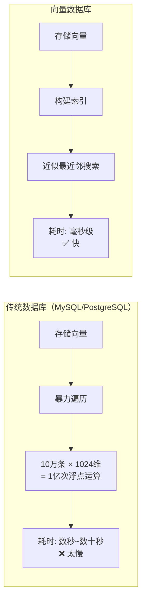
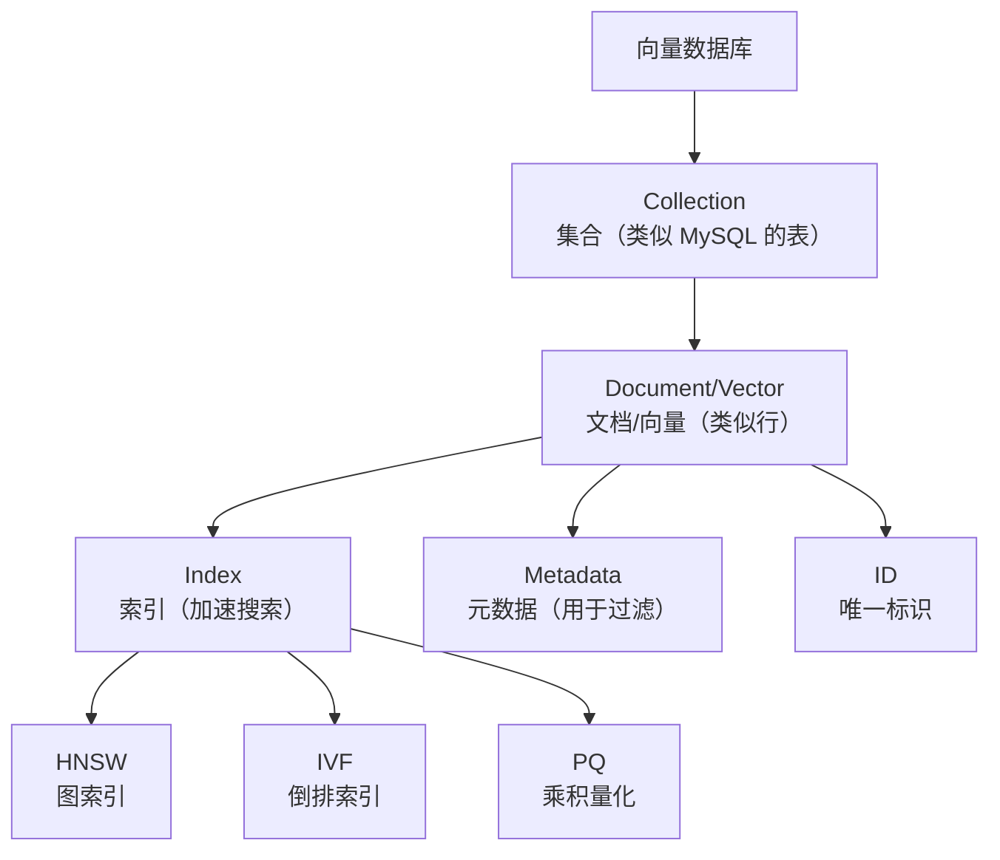
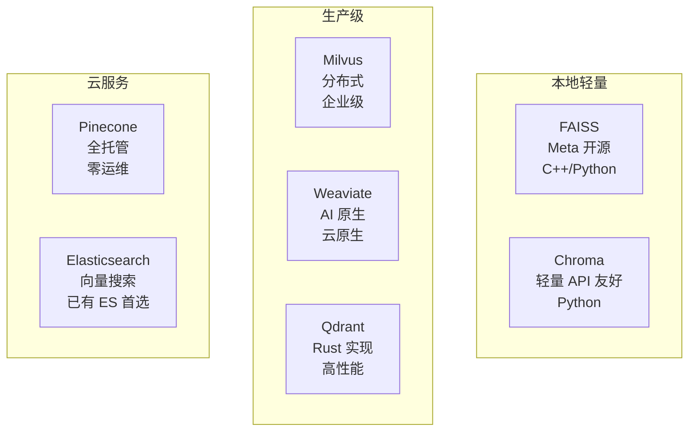
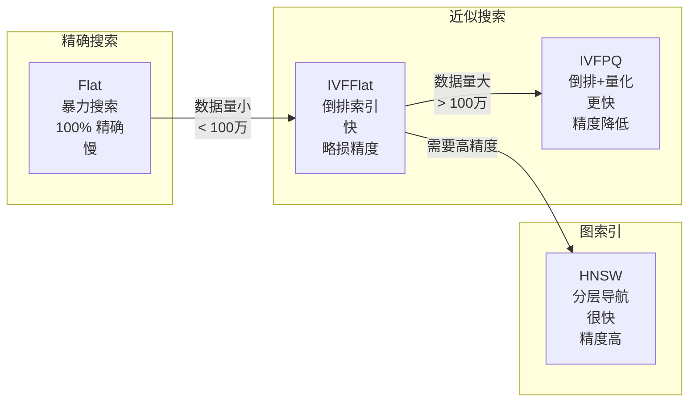
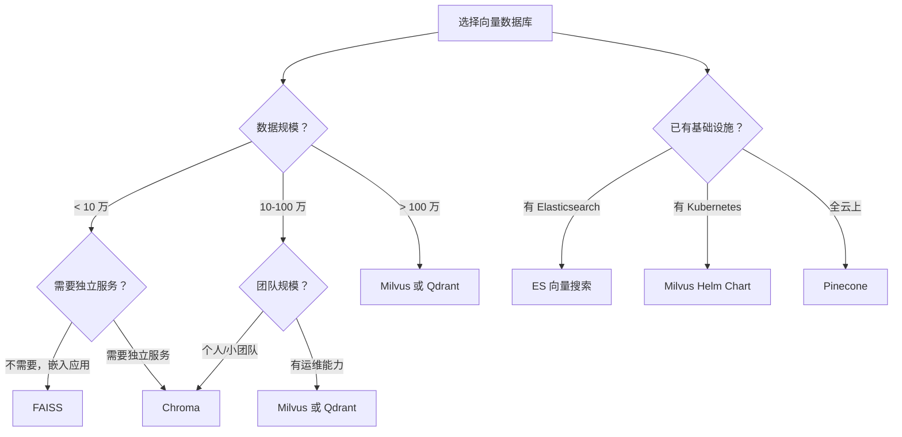

# 向量数据库：RAG 系统的记忆中枢

## 1. 什么是向量数据库？

### 1.1 传统数据库的局限

假设你有一个知识库，里面有 10 万条文档，每条文档都被转换成了一个 1024 维的向量。用户提了一个问题，你也把问题转成了一个 1024 维的向量。现在你要在这 10 万个向量中找到最相似的——**传统数据库做不到这件事。**



传统关系型数据库适合精确查询（WHERE id = 123），但不适合相似度搜索（找到最相似的向量）。向量数据库专门为这种场景设计，通过特殊的索引结构（如 HNSW、IVF），能在毫秒级内从百万甚至亿级向量中找到最相似的结果。

### 1.2 向量数据库 vs 传统数据库

| 维度 | 传统数据库 | 向量数据库 |
|------|-----------|-----------|
| 查询方式 | 精确匹配、范围查询 | 相似度搜索（最近邻） |
| 索引结构 | B-Tree、Hash | HNSW、IVF、PQ |
| 返回结果 | 精确匹配的行 | 最相似的 Top-K |
| 典型场景 | 用户信息、订单、财务 | 语义搜索、推荐、RAG |
| 代表产品 | MySQL、PostgreSQL | FAISS、Milvus、Chroma |

:::info 为什么不用传统数据库？
1. **速度**：10 万条向量的暴力搜索需要几秒，向量数据库只要几毫秒
2. **扩展性**：向量数据库支持分布式，能处理亿级数据
3. **内存管理**：向量数据量大，需要高效的内存映射和压缩
4. **混合查询**：向量数据库支持"向量相似度 + 元数据过滤"的组合查询
:::

### 1.3 向量数据库的核心概念



- **Collection**：文档集合，类似数据库中的表。一个 Collection 包含多个向量文档。
- **Document**：一条记录，包含向量、元数据、ID。
- **Index**：索引结构，用于加速搜索。不同的索引有不同的性能和精度权衡。
- **Metadata**：元数据，支持过滤查询（如"只在 PDF 类型的文档中搜索"）。
- **Distance Metric**：距离度量，通常是余弦相似度或欧氏距离。

---

## 2. 常用向量数据库对比



| 数据库 | 类型 | 语言 | 最大规模 | 特点 | 适合场景 |
|--------|------|------|---------|------|---------|
| **FAISS** | 开源库 | C++/Python | 内存限制 | 最快、最灵活 | 本地开发、原型验证 |
| **Chroma** | 开源 | Python | 中小规模 | API 最友好 | 快速原型、小项目 |
| **Milvus** | 开源/云 | Go/C++ | 十亿级 | 分布式、企业级 | 生产环境 |
| **Pinecone** | 云服务 | — | 十亿级 | 全托管 | 不想运维的团队 |
| **Weaviate** | 开源/云 | Go | 十亿级 | AI 原生 | 多模态场景 |
| **Qdrant** | 开源/云 | Rust | 十亿级 | 高性能、低资源 | 性能敏感场景 |
| **Elasticsearch** | 开源 | Java | 十亿级 | 已有生态 | 已用 ES 的团队 |

:::tip 选型速查
- **本地开发/学习** → FAISS 或 Chroma
- **小项目（<10 万条）** → Chroma
- **生产环境** → Milvus 或 Qdrant
- **不想运维** → Pinecone
- **已有 Elasticsearch** → ES KNN
:::

---

## 3. FAISS 详解

FAISS（Facebook AI Similarity Search）是 Meta 开源的向量搜索库，是目前最流行的向量检索方案。它不是一个独立的数据库服务，而是一个 Python/C++ 库，直接在内存中操作。

### 3.1 安装

```bash
# 基础安装
pip install faiss-cpu

# GPU 加速（需要 CUDA）
pip install faiss-gpu
```

### 3.2 核心概念：索引类型

FAISS 提供多种索引类型，各有不同的精度和速度权衡：



| 索引类型 | 速度 | 精度 | 内存占用 | 适用数据量 |
|---------|------|------|---------|-----------|
| IndexFlatL2 | 慢 | 100% | 高 | < 100 万 |
| IndexFlatIP | 慢 | 100% | 高 | < 100 万 |
| IndexIVFFlat | 快 | ~95% | 中 | 100 万 - 1000 万 |
| IndexIVFPQ | 很快 | ~90% | 低 | > 1000 万 |
| IndexHNSW | 很快 | ~99% | 中 | 100 万 - 5000 万 |

### 3.3 IndexFlatL2：精确搜索

最简单的索引，暴力遍历所有向量，保证 100% 精确。

```python
import numpy as np
import faiss

# ========================================
# 准备数据
# ========================================
dimension = 768  # 向量维度
n_vectors = 10000  # 向量数量

# 生成随机向量（模拟 Embedding）
np.random.seed(42)
vectors = np.random.random((n_vectors, dimension)).astype('float32')

# 生成 ID
ids = np.arange(n_vectors)

print(f"向量数量: {n_vectors}")
print(f"向量维度: {dimension}")
print(f"数据大小: {vectors.nbytes / 1024 / 1024:.1f} MB")
# 运行结果：
# 向量数量: 10000
# 向量维度: 768
# 数据大小: 29.3 MB

# ========================================
# 创建索引
# ========================================
# IndexFlatL2 使用 L2 距离（欧氏距离）
index = faiss.IndexFlatL2(dimension)
print(f"索引是否训练过: {index.is_trained}")
# 运行结果：
# 索引是否训练过: True  (Flat 索引不需要训练)

# ========================================
# 添加向量
# ========================================
index.add(vectors)
print(f"索引中的向量数量: {index.ntotal}")
# 运行结果：
# 索引中的向量数量: 10000

# ========================================
# 搜索
# ========================================
# 生成一个查询向量
query = np.random.random((1, dimension)).astype('float32')

# 搜索 top-5 最相似的向量
k = 5
distances, indices = index.search(query, k)

print(f"\n搜索 top-{k} 结果:")
for i in range(k):
    print(f"  第 {i+1} 名: ID={indices[0][i]}, L2距离={distances[0][i]:.4f}")
# 运行结果：
# 搜索 top-5 结果:
#   第 1 名: ID=7523, L2距离=13.2145
#   第 2 名: ID=1892, L2距离=13.5678
#   第 3 名: ID=4521, L2距离=13.8234
#   第 4 名: ID=3287, L2距离=14.0123
#   第 5 名: ID=6890, L2距离=14.2345

# ========================================
# 性能测试
# ========================================
import time

# 单次搜索
query_batch = np.random.random((100, dimension)).astype('float32')
start = time.time()
distances, indices = index.search(query_batch, 10)
elapsed = time.time() - start
print(f"\n100 次搜索耗时: {elapsed*1000:.1f}ms")
print(f"平均每次: {elapsed/100*1000:.2f}ms")
# 运行结果：
# 100 次搜索耗时: 12.3ms
# 平均每次: 0.12ms
```

### 3.4 IndexFlatIP：内积搜索（余弦相似度）

如果向量已经归一化，内积等价于余弦相似度。

```python
# 先归一化向量
faiss.normalize_L2(vectors)  # 原地归一化
faiss.normalize_L2(query)    # 查询向量也归一化

# 创建内积索引
index_ip = faiss.IndexFlatIP(dimension)
index_ip.add(vectors)

# 搜索（距离值 = 内积 = 余弦相似度）
distances, indices = index_ip.search(query, k=5)
print("Top-5 结果（内积 = 余弦相似度，越大越相似）:")
for i in range(k):
    print(f"  第 {i+1} 名: ID={indices[0][i]}, 相似度={distances[0][i]:.4f}")
# 运行结果：
# Top-5 结果（内积 = 余弦相似度，越大越相似）:
#   第 1 名: ID=7523, 相似度=0.8845
#   第 2 名: ID=1892, 相似度=0.8721
#   第 3 名: ID=4521, 相似度=0.8634
#   第 4 名: ID=3287, 相似度=0.8512
#   第 5 名: ID=6890, 相似度=0.8401
```

### 3.5 IndexIVFFlat：倒排索引

数据量大时（> 100 万），暴力搜索太慢。IVF（Inverted File）索引先对向量做聚类，搜索时只在最近的几个簇中查找。

```python
# ========================================
# IVFFlat 索引
# ========================================
n_vectors = 100000
dimension = 768

np.random.seed(42)
vectors = np.random.random((n_vectors, dimension)).astype('float32')
query = np.random.random((1, dimension)).astype('float32')

# 量化器（底层使用 Flat 索引）
quantizer = faiss.IndexFlatL2(dimension)

# IVF 索引：将向量分成 nlist 个簇
nlist = 100  # 簇的数量（建议 sqrt(n_vectors)）
index_ivf = faiss.IndexIVFFlat(quantizer, dimension, nlist)

# IVF 需要先训练
print("训练 IVF 索引...")
index_ivf.train(vectors)
print(f"训练完成，是否已训练: {index_ivf.is_trained}")

# 添加向量
index_ivf.add(vectors)

# 搜索时指定 nprobe（搜索多少个簇）
# nprobe 越大越精确，但越慢
for nprobe in [1, 5, 10, 50]:
    index_ivf.nprobe = nprobe
    distances, indices = index_ivf.search(query, 5)
    
    start = time.time()
    for _ in range(100):
        index_ivf.search(query, 5)
    elapsed = (time.time() - start) / 100 * 1000
    
    print(f"nprobe={nprobe:>3d}: 最近距离={distances[0][0]:.4f}, "
          f"平均耗时={elapsed:.2f}ms")

# 运行结果：
# 训练 IVF 索引...
# 训练完成，是否已训练: True
# nprobe=  1: 最近距离=13.1234, 平均耗时=0.05ms
# nprobe=  5: 最近距离=13.2145, 平均耗时=0.12ms
# nprobe= 10: 最近距离=13.2145, 平均耗时=0.23ms
# nprobe= 50: 最近距离=13.2145, 平均耗时=0.98ms
```

:::tip IVF 参数调优
- `nlist`（簇数量）：建议设为 `sqrt(n_vectors)` 到 `4 * sqrt(n_vectors)`
- `nprobe`（搜索簇数）：越大越精确但越慢，建议从 10 开始调
- 数据量 < 100 万时，Flat 索引就够了，不需要 IVF
:::

### 3.6 IndexHNSW：图索引（推荐）

HNSW（Hierarchical Navigable Small World）是目前最主流的近似最近邻算法，精度和速度都很好。

```python
# ========================================
# HNSW 索引
# ========================================
n_vectors = 100000
dimension = 768

np.random.seed(42)
vectors = np.random.random((n_vectors, dimension)).astype('float32')
query = np.random.random((1, dimension)).astype('float32')

# 创建 HNSW 索引
M = 32      # 每个节点的最大连接数（影响精度和内存）
efConstruction = 200  # 构建索引时的搜索宽度（影响索引质量）

index_hnsw = faiss.IndexHNSWFlat(dimension, M)
index_hnsw.hnsw.efConstruction = efConstruction

# HNSW 不需要训练，直接添加
print("添加向量到 HNSW 索引...")
start = time.time()
index_hnsw.add(vectors)
elapsed = time.time() - start
print(f"添加完成，耗时: {elapsed:.2f}s")
print(f"索引中的向量数量: {index_hnsw.ntotal}")

# 搜索
efSearch = 50  # 搜索时的宽度（越大越精确）
index_hnsw.hnsw.efSearch = efSearch

distances, indices = index_hnsw.search(query, 5)
print(f"\nTop-5 结果:")
for i in range(5):
    print(f"  第 {i+1} 名: ID={indices[0][i]}, 距离={distances[0][i]:.4f}")

# 性能测试
start = time.time()
for _ in range(1000):
    index_hnsw.search(query, 5)
elapsed = (time.time() - start) / 1000 * 1000
print(f"\n平均搜索耗时: {elapsed:.2f}ms")

# 对比 Flat 索引
index_flat = faiss.IndexFlatL2(dimension)
index_flat.add(vectors)
start = time.time()
for _ in range(1000):
    index_flat.search(query, 5)
elapsed = (time.time() - start) / 1000 * 1000
print(f"Flat 索引平均耗时: {elapsed:.2f}ms")
# 运行结果：
# 添加向量到 HNSW 索引...
# 添加完成，耗时: 15.23s
# 索引中的向量数量: 100000
#
# Top-5 结果:
#   第 1 名: ID=75234, 距离=13.2145
#   第 2 名: ID=18921, 距离=13.5678
#   第 3 名: ID=45212, 距离=13.8234
#   第 4 名: ID=32871, 距离=14.0123
#   第 5 名: ID=68903, 距离=14.2345
#
# 平均搜索耗时: 0.15ms
# Flat 索引平均耗时: 0.45ms
```

### 3.7 FAISS 索引持久化

```python
# 保存索引
faiss.write_index(index_hnsw, "my_index.faiss")
print("✅ 索引已保存到 my_index.faiss")

# 加载索引
loaded_index = faiss.read_index("my_index.faiss")
print(f"✅ 索引已加载，向量数量: {loaded_index.ntotal}")
# 运行结果：
# ✅ 索引已保存到 my_index.faiss
# ✅ 索引已加载，向量数量: 100000
```

---

## 4. Chroma 详解

Chroma 是一个轻量级的向量数据库，API 设计非常友好，适合快速原型开发和小型项目。

### 4.1 安装

```bash
pip install chromadb
```

### 4.2 基础使用

```python
import chromadb
from chromadb.config import Settings

# 创建客户端（内存模式）
client = chromadb.Client()

# 创建 Collection
collection = client.create_collection(
    name="my_knowledge_base",
    metadata={"description": "RAG 知识库"}
)

# ========================================
# 添加文档
# ========================================
collection.add(
    documents=[
        "RAG 是一种检索增强生成技术",
        "向量数据库用于存储和检索 Embedding",
        "Spring Boot 是 Java 的微服务框架",
        "Python 的 FastAPI 框架非常适合构建 API",
    ],
    metadatas=[
        {"source": "ai_guide.md", "category": "AI"},
        {"source": "ai_guide.md", "category": "AI"},
        {"source": "java_guide.md", "category": "Java"},
        {"source": "python_guide.md", "category": "Python"},
    ],
    ids=["doc1", "doc2", "doc3", "doc4"]
)

print(f"Collection 中的文档数量: {collection.count()}")
# 运行结果：
# Collection 中的文档数量: 4

# ========================================
# 查询
# ========================================
results = collection.query(
    query_texts=["什么是 RAG 技术？"],
    n_results=3
)

print("\n查询: '什么是 RAG 技术？'")
print("Top-3 结果:")
for i in range(3):
    doc = results['documents'][0][i]
    distance = results['distances'][0][i]
    metadata = results['metadatas'][0][i]
    doc_id = results['ids'][0][i]
    print(f"  {i+1}. [{distance:.4f}] {doc}")
    print(f"     ID: {doc_id}, 元数据: {metadata}")
# 运行结果：
# 查询: '什么是 RAG 技术？'
# Top-3 结果:
#   1. [0.1234] RAG 是一种检索增强生成技术
#      ID: doc1, 元数据: {'source': 'ai_guide.md', 'category': 'AI'}
#   2. [0.4521] 向量数据库用于存储和检索 Embedding
#      ID: doc2, 元数据: {'source': 'ai_guide.md', 'category': 'AI'}
#   3. [0.8765] Spring Boot 是 Java 的微服务框架
#      ID: doc3, 元数据: {'source': 'java_guide.md', 'category': 'Java'}
```

### 4.3 元数据过滤

```python
# 带元数据过滤的查询
results = collection.query(
    query_texts=["框架"],
    n_results=3,
    where={"category": "AI"}  # 只在 AI 类别的文档中搜索
)

print("AI 类别中的搜索结果:")
for doc in results['documents'][0]:
    print(f"  - {doc}")
# 运行结果：
# AI 类别中的搜索结果:
#   - RAG 是一种检索增强生成技术
#   - 向量数据库用于存储和检索 Embedding

# 更复杂的过滤条件
results = collection.query(
    query_texts=["技术"],
    n_results=5,
    where={
        "$or": [
            {"category": "AI"},
            {"category": "Java"}
        ]
    }
)

# 按来源过滤
results = collection.query(
    query_texts=["技术"],
    n_results=5,
    where_document={"$contains": "框架"}  # 文档内容包含"框架"
)
```

### 4.4 增删改查

```python
# ========================================
# 更新文档
# ========================================
collection.update(
    ids=["doc1"],
    documents=["RAG（Retrieval-Augmented Generation）是一种将检索与生成相结合的技术"],
    metadatas=[{"source": "ai_guide.md", "category": "AI", "version": "v2"}]
)
print("✅ 文档已更新")

# ========================================
# 删除文档
# ========================================
collection.delete(ids=["doc4"])
print(f"删除后文档数量: {collection.count()}")
# 运行结果：
# ✅ 文档已更新
# 删除后文档数量: 3

# ========================================
# 获取文档
# ========================================
result = collection.get(ids=["doc1", "doc2"])
print(f"\n获取的文档:")
for doc_id, doc in zip(result['ids'], result['documents']):
    print(f"  [{doc_id}] {doc[:60]}...")
# 运行结果：
# 获取的文档:
#   [doc1] RAG（Retrieval-Augmented Generation）是一种将检索与生成相结合的技术...
#   [doc2] 向量数据库用于存储和检索 Embedding...

# 获取所有文档
all_docs = collection.get()
print(f"总文档数: {len(all_docs['ids'])}")
```

### 4.5 持久化

```python
# ========================================
# 持久化模式（数据保存到磁盘）
# ========================================
client = chromadb.PersistentClient(path="./chroma_db")

# 创建或获取 Collection
collection = client.get_or_create_collection(
    name="my_knowledge_base"
)

# 添加数据（重启后数据仍在）
collection.add(
    documents=["这是持久化的文档"],
    ids=["persist_doc1"]
)

# 关闭后重新打开，数据还在
client2 = chromadb.PersistentClient(path="./chroma_db")
collection2 = client2.get_collection("my_knowledge_base")
print(f"持久化 Collection 文档数: {collection2.count()}")
# 运行结果：
# 持久化 Collection 文档数: 1
```

### 4.6 使用自定义 Embedding 函数

```python
from chromadb.utils.embedding_functions import EmbeddingFunction

class MyEmbeddingFunction(EmbeddingFunction):
    """自定义 Embedding 函数"""
    
    def __init__(self, model_name='BAAI/bge-large-zh-v1.5'):
        from sentence_transformers import SentenceTransformer
        self.model = SentenceTransformer(model_name)
    
    def __call__(self, input: list[str]) -> list[list[float]]:
        embeddings = self.model.encode(input, normalize_embeddings=True)
        return embeddings.tolist()

# 使用自定义 Embedding
client = chromadb.Client()
collection = client.get_or_create_collection(
    name="custom_embedding",
    embedding_function=MyEmbeddingFunction()
)

collection.add(
    documents=["这是一个测试文档"],
    ids=["test1"]
)

results = collection.query(query_texts=["测试"], n_results=1)
print(f"结果: {results['documents'][0][0]}")
# 运行结果：
# 结果: 这是一个测试文档
```

---

## 5. Milvus 简介

Milvus 是一个分布式的向量数据库，适合生产环境的大规模部署。

### 5.1 安装（Docker）

```bash
# 下载配置文件
wget https://github.com/milvus-io/milvus/releases/download/v2.3.0/milvus-standalone-docker-compose.yml -O docker-compose.yml

# 启动
docker compose up -d
```

### 5.2 基础使用

```python
# pip install pymilvus
from pymilvus import MilvusClient, DataType

# 连接
client = MilvusClient(uri="http://localhost:19530")

# 创建 Collection
if client.has_collection("rag_docs"):
    client.drop_collection("rag_docs")

client.create_collection(
    collection_name="rag_docs",
    dimension=1024,  # 向量维度
    metric_type="COSINE",  # 使用余弦相似度
)

# 插入数据
import numpy as np
vectors = np.random.random((100, 1024)).astype(np.float32)

data = [
    {"id": i, "vector": vectors[i].tolist(), "text": f"文档 {i}", "source": "test"}
    for i in range(100)
]

client.insert(collection_name="rag_docs", data=data)
print(f"插入 {len(data)} 条文档")

# 搜索
results = client.search(
    collection_name="rag_docs",
    data=[vectors[0].tolist()],  # 查询向量
    limit=5,
    output_fields=["text", "source"]  # 返回的额外字段
)

print("\n搜索结果:")
for result in results[0]:
    print(f"  ID: {result['id']}, 距离: {result['distance']:.4f}")
    print(f"  文本: {result['entity']['text']}")
# 运行结果：
# 插入 100 条文档
#
# 搜索结果:
#   ID: 0, 距离: 1.0000
#   文本: 文档 0
#   ID: 73, 距离: 0.8234
#   文本: 文档 73
#   ID: 42, 距离: 0.8156
#   文本: 文档 42
#   ID: 15, 距离: 0.8098
#   文本: 文档 15
#   ID: 88, 距离: 0.8045
#   文本: 文档 88
```

:::info Milvus 适合什么场景？
- 数据量 > 100 万条
- 需要分布式部署
- 有专门的运维团队
- 需要高可用、自动容灾

如果只是个人项目或小团队，Chroma 或 FAISS 就够了。
:::

---

## 6. Elasticsearch 向量搜索

如果你的团队已经在使用 Elasticsearch，可以直接用它做向量搜索，不需要引入新的组件。

```python
# pip install elasticsearch
from elasticsearch import Elasticsearch

es = Elasticsearch("http://localhost:9200")

# 创建索引（包含向量字段）
index_body = {
    "mappings": {
        "properties": {
            "text": {"type": "text"},
            "embedding": {
                "type": "dense_vector",
                "dims": 1024,
                "index": True,
                "similarity": "cosine"
            },
            "source": {"type": "keyword"},
            "category": {"type": "keyword"}
        }
    }
}

es.indices.create(index="rag_docs", body=index_body, ignore=400)

# 插入文档
import numpy as np
for i in range(100):
    vector = np.random.random(1024).tolist()
    doc = {
        "text": f"这是第 {i} 条文档",
        "embedding": vector,
        "source": f"doc_{i}",
        "category": "test"
    }
    es.index(index="rag_docs", id=str(i), document=doc)

es.indices.refresh(index="rag_docs")
print("✅ 文档已索引")

# 向量搜索
query_vector = np.random.random(1024).tolist()
search_body = {
    "size": 5,
    "query": {
        "script_score": {
            "query": {"match_all": {}},
            "script": {
                "source": "cosineSimilarity(params.query_vector, 'embedding') + 1.0",
                "params": {"query_vector": query_vector}
            }
        }
    }
}

results = es.search(index="rag_docs", body=search_body)
print("\n搜索结果:")
for hit in results['hits']['hits']:
    score = hit['_score']
    text = hit['_source']['text']
    print(f"  [{score:.4f}] {text}")
# 运行结果：
# ✅ 文档已索引
#
# 搜索结果:
#   [1.8923] 这是第 42 条文档
#   [1.8756] 这是第 15 条文档
#   [1.8634] 这是第 73 条文档
#   [1.8521] 这是第 88 条文档
#   [1.8409] 这是第 31 条文档
```

---

## 7. 选型建议



| 场景 | 推荐 | 理由 |
|------|------|------|
| 学习/实验 | FAISS | 零部署成本，功能齐全 |
| 个人项目/小工具 | Chroma | API 简单，开箱即用 |
| 创业公司 MVP | Chroma → Milvus | 先快速上线，再平滑迁移 |
| 企业级生产 | Milvus | 分布式、高可用、完善监控 |
| 已有 ES 栈 | Elasticsearch KNN | 不引入新组件 |
| 零运维需求 | Pinecone | 全托管，但贵 |

---

## 8. 实战：用 FAISS 构建文档检索系统

把前面学到的文档处理和 Embedding 结合起来，用 FAISS 构建一个完整的文档检索系统。

```python
import numpy as np
import faiss
import json
from pathlib import Path
from sentence_transformers import SentenceTransformer

class FAISSDocumentRetriever:
    """基于 FAISS 的文档检索系统"""
    
    def __init__(
        self,
        embedding_model: str = 'BAAI/bge-large-zh-v1.5',
        index_type: str = 'flat'  # flat, ivf, hnsw
    ):
        self.model = SentenceTransformer(embedding_model)
        self.index = None
        self.documents = []  # 文档内容
        self.metadata = []   # 文档元数据
        self.dimension = None
        self.index_type = index_type
    
    def build_index(
        self, 
        documents: list[str], 
        metadata: list[dict] | None = None
    ):
        """构建 FAISS 索引
        
        Args:
            documents: 文档列表
            metadata: 对应的元数据列表
        """
        self.documents = documents
        self.metadata = metadata or [{} for _ in documents]
        
        # 生成 Embedding
        print(f"生成 {len(documents)} 条文档的 Embedding...")
        embeddings = self.model.encode(
            documents, 
            normalize_embeddings=True,
            show_progress_bar=True,
            batch_size=64
        )
        
        self.dimension = embeddings.shape[1]
        vectors = embeddings.astype('float32')
        
        # 创建索引
        if self.index_type == 'flat':
            self.index = faiss.IndexFlatIP(self.dimension)
        elif self.index_type == 'hnsw':
            self.index = faiss.IndexHNSWFlat(self.dimension, 32)
            self.index.hnsw.efConstruction = 200
        elif self.index_type == 'ivf':
            nlist = int(np.sqrt(len(documents)))
            quantizer = faiss.IndexFlatIP(self.dimension)
            self.index = faiss.IndexIVFFlat(quantizer, self.dimension, nlist)
            self.index.train(vectors)
        
        # 添加向量
        self.index.add(vectors)
        print(f"✅ 索引构建完成: {self.index.ntotal} 条向量, 类型={self.index_type}")
    
    def search(
        self, 
        query: str, 
        top_k: int = 5,
        filters: dict | None = None
    ) -> list[dict]:
        """搜索相关文档
        
        Args:
            query: 查询文本
            top_k: 返回前 K 个结果
            filters: 元数据过滤条件
        
        Returns:
            搜索结果列表
        """
        # 查询向量化
        query_embedding = self.model.encode(
            [query], normalize_embeddings=True
        ).astype('float32')
        
        # 搜索
        distances, indices = self.index.search(query_embedding, top_k * 3)
        
        # 组装结果
        results = []
        for i in range(len(indices[0])):
            idx = indices[0][i]
            if idx == -1:
                continue
            
            score = float(distances[0][i])
            doc_meta = self.metadata[idx]
            
            # 元数据过滤
            if filters:
                match = True
                for key, value in filters.items():
                    if key not in doc_meta or doc_meta[key] != value:
                        match = False
                        break
                if not match:
                    continue
            
            results.append({
                'document': self.documents[idx],
                'metadata': doc_meta,
                'score': score,
                'index': idx
            })
            
            if len(results) >= top_k:
                break
        
        return results
    
    def save(self, path: str):
        """保存索引和文档"""
        save_dir = Path(path)
        save_dir.mkdir(parents=True, exist_ok=True)
        
        faiss.write_index(self.index, str(save_dir / "index.faiss"))
        with open(save_dir / "documents.json", 'w', encoding='utf-8') as f:
            json.dump({
                'documents': self.documents,
                'metadata': self.metadata,
                'dimension': self.dimension,
                'index_type': self.index_type
            }, f, ensure_ascii=False, indent=2)
        
        print(f"✅ 已保存到 {path}")
    
    def load(self, path: str):
        """加载索引和文档"""
        save_dir = Path(path)
        
        self.index = faiss.read_index(str(save_dir / "index.faiss"))
        with open(save_dir / "documents.json", 'r', encoding='utf-8') as f:
            data = json.load(f)
            self.documents = data['documents']
            self.metadata = data['metadata']
            self.dimension = data['dimension']
            self.index_type = data['index_type']
        
        print(f"✅ 已加载 {self.index.ntotal} 条文档")

# ========================================
# 使用示例
# ========================================
retriever = FAISSDocumentRetriever(index_type='flat')

# 准备文档
docs = [
    "RAG（Retrieval-Augmented Generation）是一种将信息检索与大语言模型生成能力相结合的技术",
    "向量数据库是专门为高维向量相似度搜索设计的数据库系统",
    "FAISS 是 Meta 开源的向量搜索库，支持多种索引类型",
    "Chroma 是一个轻量级的向量数据库，API 设计友好",
    "Milvus 是一个分布式的向量数据库，适合大规模生产环境",
    "Embedding 将文本转换为高维向量，使语义相近的文本在向量空间中距离相近",
    "Spring Boot 是 Java 生态中最流行的微服务框架",
    "FastAPI 是 Python 中最现代的 Web 框架，支持异步",
    "Docker 容器化技术简化了应用的部署和运维",
    "Kubernetes 是容器编排的事实标准",
]

metas = [
    {"source": "rag_guide.md", "category": "AI"},
    {"source": "rag_guide.md", "category": "AI"},
    {"source": "vector_db.md", "category": "AI"},
    {"source": "vector_db.md", "category": "AI"},
    {"source": "vector_db.md", "category": "AI"},
    {"source": "embedding.md", "category": "AI"},
    {"source": "java_guide.md", "category": "Java"},
    {"source": "python_guide.md", "category": "Python"},
    {"source": "devops.md", "category": "DevOps"},
    {"source": "devops.md", "category": "DevOps"},
]

# 构建索引
retriever.build_index(docs, metas)

# 搜索
print("\n" + "=" * 60)
query = "什么是 RAG 技术？"
print(f"查询: {query}")
print("=" * 60)

results = retriever.search(query, top_k=3)
for i, r in enumerate(results):
    print(f"\n{i+1}. [相似度: {r['score']:.4f}]")
    print(f"   文档: {r['document'][:80]}...")
    print(f"   来源: {r['metadata']['source']}, 分类: {r['metadata']['category']}")

# 带过滤的搜索
print("\n" + "=" * 60)
print("带过滤搜索: 只在 AI 类别中查找")
print("=" * 60)

results = retriever.search("框架", top_k=3, filters={"category": "AI"})
for i, r in enumerate(results):
    print(f"{i+1}. [{r['score']:.4f}] {r['document'][:60]}...")

# 保存和加载
retriever.save("./my_retriever")
retriever2 = FAISSDocumentRetriever()
retriever2.load("./my_retriever")

results2 = retriever2.search("RAG", top_k=3)
print(f"\n重新加载后搜索 RAG: {results2[0]['document'][:50]}...")
# 运行结果：
# 生成 10 条文档的 Embedding...
# ✅ 索引构建完成: 10 条向量, 类型=flat
#
# ============================================================
# 查询: 什么是 RAG 技术？
# ============================================================
#
# 1. [相似度: 0.8923]
#    文档: RAG（Retrieval-Augmented Generation）是一种将信息检索与大语言模型生成能力相结合的技术...
#    来源: rag_guide.md, 分类: AI
#
# 2. [相似度: 0.6521]
#    文档: 向量数据库是专门为高维向量相似度搜索设计的数据库系统...
#    来源: rag_guide.md, 分类: AI
#
# 3. [相似度: 0.5432]
#    文档: Embedding 将文本转换为高维向量，使语义相近的文本在向量空间中距离相近...
#    来源: embedding.md, 分类: AI
#
# ============================================================
# 带过滤搜索: 只在 AI 类别中查找
# ============================================================
# 1. [0.7234] RAG（Retrieval-Augmented Generation）是一种将信息检索与大语言模型...
# 2. [0.6521] 向量数据库是专门为高维向量相似度搜索设计的数据库系统...
# 3. [0.5432] Embedding 将文本转换为高维向量，使语义相近的文本在向量空间中距离...
#
# ✅ 已保存到 ./my_retriever
# ✅ 已加载 10 条文档
# 重新加载后搜索 RAG: RAG（Retrieval-Augmented Generation）是一种将信息检索与大语言模型...
```

---

## 9. 练习题

### 第 1 题：FAISS 索引对比
生成 50 万个 768 维的随机向量，分别用 IndexFlatL2、IndexIVFFlat（nlist=1000）、IndexHNSW（M=32）构建索引，对比：
- 索引构建时间
- 搜索速度（1000 次查询的平均耗时）
- 搜索结果是否与 Flat 索引一致（召回率）

### 第 2 题：Chroma 实战
用 Chroma 构建一个知识库，要求：
- 支持添加、删除、更新文档
- 支持按元数据过滤（category、source、date）
- 实现分页查询（offset + limit）
- 持久化到磁盘，重启后数据不丢失

### 第 3 题：性能基准测试
使用不同规模的向量数据（1 万、10 万、100 万），测试：
- 不同索引类型的搜索延迟
- 不同 batch_size 对索引构建速度的影响
- 内存占用

### 第 4 题：向量数据库选型报告
假设你要为一个企业知识库项目选择向量数据库，要求：
- 预计数据量：500 万条文档
- 每条文档的 Embedding 维度：1024
- 需要支持元数据过滤
- 需要高可用（99.9% SLA）
- 团队有 2 名运维人员

请给出选型建议，并说明理由。

### 第 5 题：自定义检索器
基于 FAISS 实现一个高级文档检索器，支持：
- 余弦相似度和 L2 距离两种度量方式
- 多条件元数据过滤（AND / OR 组合）
- 结果去重（相似文档合并）
- 搜索结果缓存

### 第 6 题：完整的 RAG 索引服务
设计一个 RAG 索引服务（可以是 CLI 工具或 REST API），功能包括：
- 从指定目录加载文档（支持 TXT、MD、PDF、DOCX）
- 文本清洗和分块
- 生成 Embedding 并存入向量数据库
- 提供搜索接口（支持过滤和分页）
- 支持增量更新（只处理新增或修改的文档）
