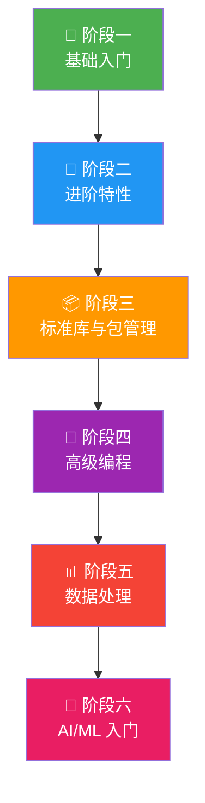

# Python 学习路线

> Python 是 AI 时代的编程语言。本模块从零基础出发，一步步带你从"完全不会"到"能做 AI 项目"。
> 每个章节既有保姆级的教程讲解，也有硬核的底层原理分析——不只是"怎么用"，更要"为什么这样用"。

## 学习阶段

| 阶段 | 内容 | 适合谁 | 预计用时 |
|------|------|--------|---------|
| [阶段一：基础入门](./stage1-basics/) | 安装环境、变量、数据类型、控制流、函数、文件操作、异常处理 | 零基础 / 有其他语言基础 | 1-2 周 |
| [阶段二：进阶特性](./stage2-intermediate/) | 面向对象、继承与多态、装饰器、生成器、上下文管理器、模块与包 | 学完阶段一 | 2 周 |
| [阶段三：标准库与包管理](./stage3-stdlib/) | pathlib、datetime、re、json、csv、logging、collections、typing、包管理 | 学完阶段二 | 1-2 周 |
| [阶段四：高级编程](./stage4-advanced/) | 多线程/多进程/asyncio、元类、描述符、类型系统、设计模式 | 学完阶段三 | 2-3 周 |
| [阶段五：数据处理](./stage5-datascience/) | NumPy、Pandas、Matplotlib、数据清洗与分析实战 | 学完阶段三 | 2-3 周 |
| [阶段六：AI/ML 入门](./stage6-ai-ml/) | Scikit-learn、PyTorch、HuggingFace、LangChain、RAG 实战 | 学完阶段五 | 2-4 周 |

## 给不同背景的读者

### 如果你完全不会编程

按顺序从阶段一开始，每个知识点都有详细的解释和代码示例。不要跳过任何章节，遇到不懂的代码就敲一遍。

### 如果你是 Java 开发者

你有编程基础，很多概念（变量、循环、OOP、异常）你已经会了。你的重点是：
1. **Python 的语法差异**（缩进、动态类型、列表推导式等）
2. **Pythonic 写法**（别用 Java 思维写 Python）
3. **Python 特有的高级特性**（装饰器、生成器、元类）
4. **数据科学工具链**（NumPy、Pandas — Java 生态里没有对等的东西）

每篇文章都附有 Java 对比，帮你快速迁移。

## 如何使用本教程

::: tip 学习建议
1. **一定要动手敲** — 看懂了 ≠ 会写了，每个代码示例都自己敲一遍
2. **不要跳过"底层原理"** — 这些是区分"会用 Python"和"精通 Python"的关键
3. **做练习题** — 每章末尾有练习，独立完成后再看参考答案
4. **遇到问题先查文档** — Python 文档质量极高，`python -m pydoc <module>` 或 <https://docs.python.org/3/>
:::
