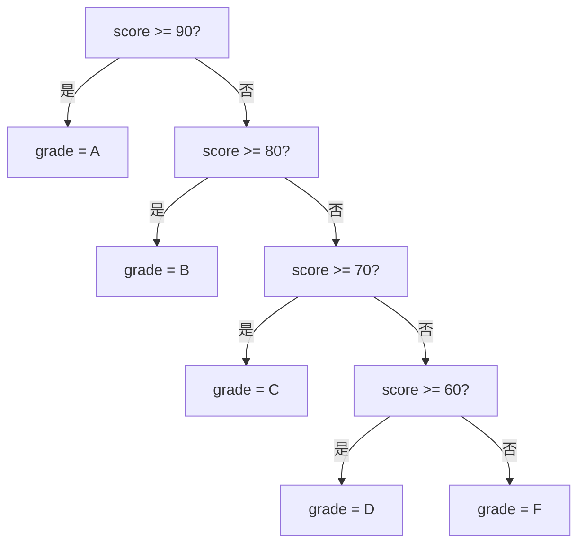

## 6.1 if/elif/else

```python
score = 85

 基本语法 —— 注意缩进！（Python 用缩进表示代码块，不用大括号）
if score >= 90:
    grade = "A"
    print("优秀！")
elif score >= 80:
    grade = "B"
    print("良好！")
elif score >= 70:
    grade = "C"
    print("中等。")
elif score >= 60:
    grade = "D"
    print("及格。")
else:
    grade = "F"
    print("不及格！")

print(f"成绩等级：{grade}")  # 成绩等级：B
```



:::warning 缩进规则
Python 用**缩进**来定义代码块，而不是 `{}`。规则：
1. 使用 **4 个空格**缩进（不要用 Tab）
2. 同一代码块的缩进必须一致
3. VS Code 可以自动设置：`"editor.insertSpaces": true, "editor.tabSize": 4`

```python
 ✅ 正确
if True:
    print("hello")
    print("world")

 ❌ 错误（缩进不一致）
if True:
    print("hello")
     print("world")  # IndentationError

 Java 对比：
// Java 用大括号
if (true) {
    System.out.println("hello");
    System.out.println("world");
}
```
:::

## 6.2 三元表达式

```python
 Python 三元表达式：值1 if 条件 else 值2
age = 20
status = "成年" if age >= 18 else "未成年"
print(status)  # 成年

 嵌套三元（不推荐，可读性差）
score = 75
grade = "A" if score >= 90 else "B" if score >= 80 else "C" if score >= 70 else "D" if score >= 60 else "F"
print(grade)  # C

 Java 对比：
// Java 三元：条件 ? 值1 : 值2
String status = age >= 18 ? "成年" : "未成年";
```

## 6.3 match-case（Python 3.10+）

Python 3.10 引入了结构化模式匹配，类似 Java 的 `switch-case`，但更强大。

```python
 基本用法
def http_status(code):
    match code:
        case 200:
            return "OK"
        case 404:
            return "Not Found"
        case 500:
            return "Internal Server Error"
        case _:      # _ 是通配符，相当于 default
            return "Unknown"

print(http_status(200))   # OK
print(http_status(404))   # Not Found

 模式匹配 —— 比 Java switch 强大得多
def process_command(cmd):
    match cmd.split():
        case ["quit"]:
            return "退出"
        case ["hello", name]:
            return f"你好，{name}！"
        case ["move", x, y]:
            return f"移动到 ({x}, {y})"
        case ["move", *rest]:
            return f"移动参数过多：{rest}"
        case _:
            return "未知命令"

print(process_command("quit"))          # 退出
print(process_command("hello Alice"))   # 你好，Alice！
print(process_command("move 10 20"))    # 移动到 (10, 20)

 匹配字典
def handle_event(event):
    match event:
        case {"type": "click", "x": x, "y": y}:
            return f"点击坐标 ({x}, {y})"
        case {"type": "keypress", "key": key}:
            return f"按键：{key}"
        case _:
            return "未知事件"
```

## 6.4 for 循环

```python
 range(start, stop, step)
for i in range(5):          # 0, 1, 2, 3, 4
    print(i, end=" ")
 输出：0 1 2 3 4

for i in range(2, 10, 3):   # 2, 5, 8
    print(i, end=" ")

 遍历列表
fruits = ["apple", "banana", "cherry"]
for fruit in fruits:
    print(fruit)

 enumerate —— 获取索引和值
for i, fruit in enumerate(fruits):
    print(f"{i}: {fruit}")

 zip —— 并行遍历
names = ["Alice", "Bob", "Charlie"]
ages = [30, 25, 35]
for name, age in zip(names, ages):
    print(f"{name} is {age}")

 遍历字典
person = {"name": "Alice", "age": 30, "city": "Beijing"}
for key, value in person.items():
    print(f"{key}: {value}")

 遍历字符串
for ch in "hello":
    print(ch, end=" ")
 输出：h e l l o

 for...else（Python 特有）
 else 在循环正常结束时执行，break 跳出时不执行
for n in range(2, 10):
    for x in range(2, n):
        if n % x == 0:
            break
    else:
        print(f"{n} 是质数")
 2 是质数
 3 是质数
 5 是质数
 7 是质数
```

## 6.5 while 循环

```python
 基本语法
count = 0
while count < 5:
    print(count, end=" ")
    count += 1
 输出：0 1 2 3 4

 while...else
n = 10
while n > 0:
    n -= 3
else:
    print(f"循环结束，n = {n}")
 输出：循环结束，n = -2

 无限循环 + break
while True:
    cmd = input("输入命令（quit 退出）：")
    if cmd == "quit":
        break
    print(f"执行：{cmd}")
```

## 6.6 break/continue

```python
 break —— 跳出整个循环
for i in range(10):
    if i == 5:
        break
    print(i, end=" ")
 输出：0 1 2 3 4

 continue —— 跳过本次迭代
for i in range(10):
    if i % 2 == 0:
        continue
    print(i, end=" ")
 输出：1 3 5 7 9
```

## 6.7 列表推导式 vs for 循环

```python
 列表推导式 —— 简洁、Pythonic
squares = [x ** 2 for x in range(10)]

 等价的 for 循环 —— 更灵活
squares = []
for x in range(10):
    squares.append(x ** 2)

 什么时候用推导式？什么时候用 for 循环？
 ✅ 用推导式：简单转换、过滤
evens = [x for x in range(100) if x % 2 == 0]

 ✅ 用 for 循环：逻辑复杂、有副作用、需要异常处理
results = []
for url in urls:
    try:
        resp = fetch(url)
        results.append(resp)
    except Exception as e:
        log.error(f"Failed: {e}")
```

## 6.8 循环性能

```python
import timeit

 ❌ 慢 —— 在循环中重复计算
def slow():
    result = []
    for i in range(10000):
        result.append(len(str(i)))  # str(i) 和 len() 每次都调用
    return result

 ✅ 快 —— 使用列表推导式
def fast():
    return [len(str(i)) for i in range(10000)]

 ✅ 更快 —— 使用 map
def faster():
    return list(map(lambda i: len(str(i)), range(10000)))

 ❌ 慢 —— 在循环中拼接字符串
def slow_concat():
    result = ""
    for i in range(10000):
        result += str(i)
    return result

 ✅ 快 —— 使用 join
def fast_concat():
    return "".join(str(i) for i in range(10000))

 ❌ 慢 —— 在循环中反复调用 .append()
 （实际上 Python 的 list.append 已经很优化了，这里主要是对比思路）
 ✅ 如果知道最终大小，预分配
 （Python 没有直接预分配语法，但可以用列表推导式代替）
```

:::info Java 对比
Java 有增强 for 循环（for-each）和传统 for 循环，没有列表推导式（但有 Stream API）。

```java
// Java for-each
for (String fruit : fruits) {
    System.out.println(fruit);
}

// Java Stream（类似列表推导式）
List<Integer> squares = IntStream.range(0, 10)
    .map(x -> x * x)
    .boxed()
    .collect(Collectors.toList());
```

Python 没有 `for (int i = 0; i < n; i++)` 这种 C 风格的 for 循环，用 `range()` 替代。
:::

## 📝 练习题

**1. 打印九九乘法表。**


**参考答案**

```python
for i in range(1, 10):
    for j in range(1, i + 1):
        print(f"{j}×{i}={i*j}", end="\t")
    print()
```


**2. 用 for...else 判断一个数是否是质数。**


**参考答案**

```python
def is_prime(n):
    if n < 2:
        return False
    for i in range(2, int(n ** 0.5) + 1):
        if n % i == 0:
            return False
    else:
        return True

print(is_prime(7))    # True
print(is_prime(10))   # False
```


**3. 用 match-case 实现一个简单的计算器。**


**参考答案**

```python
def calculate(op, a, b):
    match op:
        case "+":
            return a + b
        case "-":
            return a - b
        case "*":
            return a * b
        case "/":
            return a / b if b != 0 else "除数不能为零"
        case _:
            return "不支持的操作"

print(calculate("+", 10, 3))   # 13
print(calculate("/", 10, 0))   # 除数不能为零
```


**4. 使用列表推导式生成斐波那契数列的前 20 项（提示：可以用 reduce 或其他方式）。**


**参考答案**

```python
 方法一：用循环（更直观）
fib = [0, 1]
for i in range(2, 20):
    fib.append(fib[-1] + fib[-2])
print(fib)

 方法二：用列表推导式 + 赋值表达式
fib = [0, 1]
[fib.append(fib[-1] + fib[-2]) for _ in range(18)]
print(fib[:20])
```


**5. 扁平化嵌套列表 `[[1, 2], [3, 4], [5, 6]]` 为 `[1, 2, 3, 4, 5, 6]`，至少两种方法。**


**参考答案**

```python
nested = [[1, 2], [3, 4], [5, 6]]

 方法一：列表推导式
flat = [x for row in nested for x in row]

 方法二：sum（利用列表相加）
flat = sum(nested, [])

 方法三：itertools.chain
from itertools import chain
flat = list(chain.from_iterable(nested))

print(flat)  # [1, 2, 3, 4, 5, 6]
```


**6. 用字典统计一段文本中每个单词出现的频率，然后按频率从高到低排序。**


**参考答案**

```python
text = "the quick brown fox jumps over the lazy dog the fox"
words = text.split()
freq = {}
for word in words:
    freq[word] = freq.get(word, 0) + 1

 按频率排序
sorted_freq = sorted(freq.items(), key=lambda x: x[1], reverse=True)
for word, count in sorted_freq:
    print(f"{word}: {count}")
 the: 3
 fox: 2
 quick: 1
 brown: 1
 ...
```


---