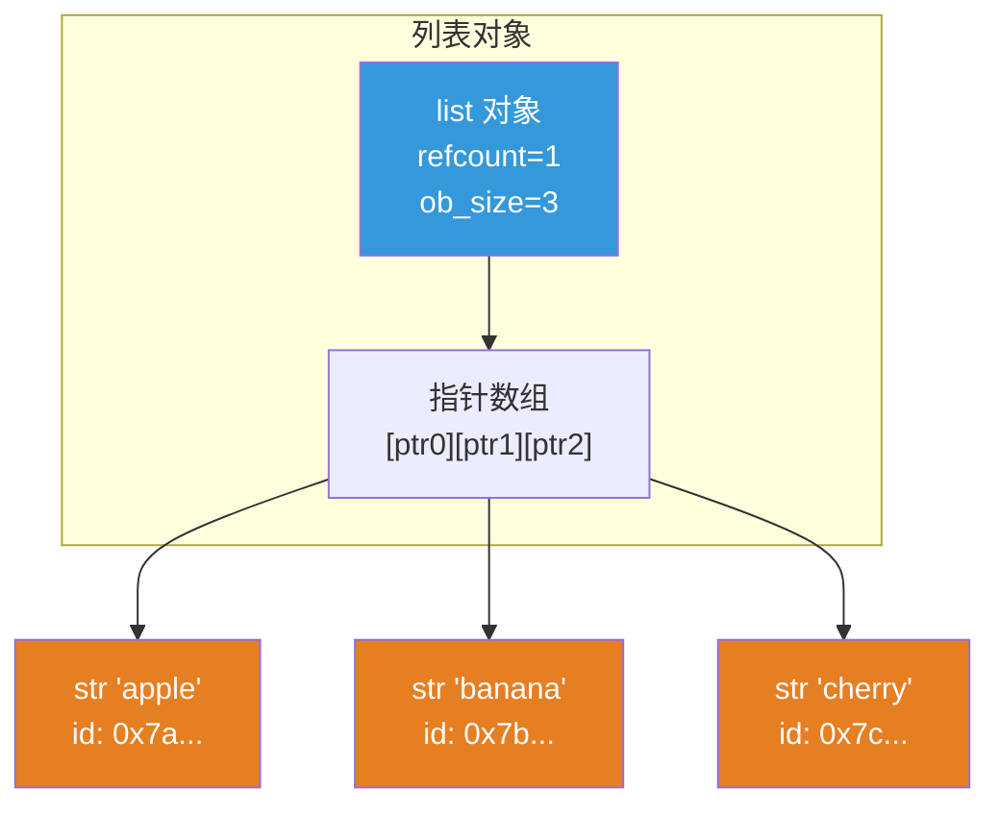
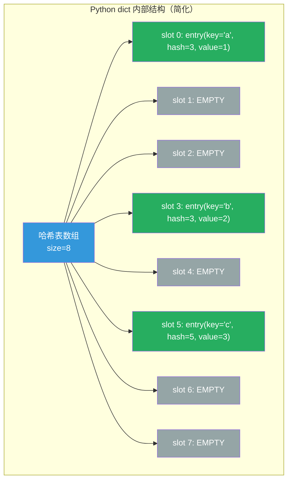
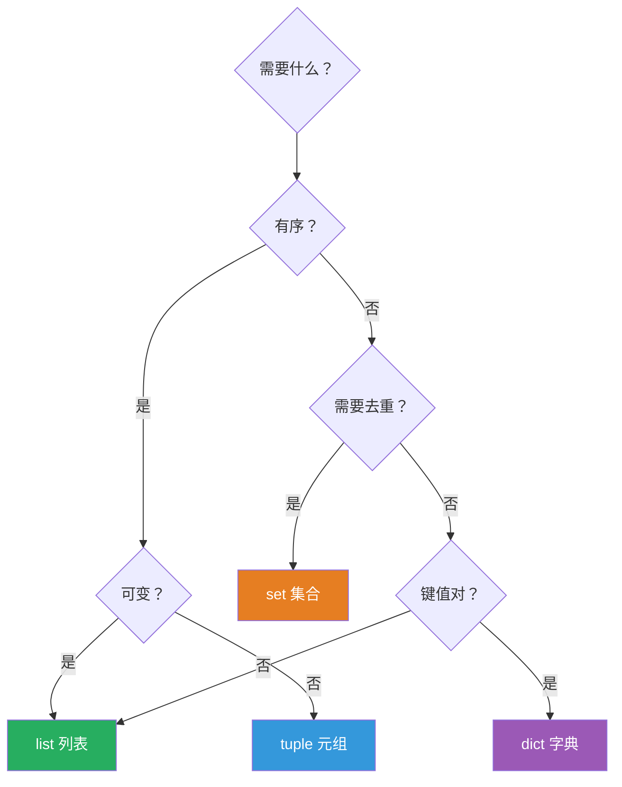

## 5.1 列表 list

列表是 Python 中最常用的数据结构，相当于 Java 的 `ArrayList`。

### 创建、索引、切片

```python
 创建列表
fruits = ["apple", "banana", "cherry"]
numbers = [1, 2, 3, 4, 5]
mixed = [1, "hello", 3.14, True, None]  # 可以包含不同类型
empty = []
nested = [[1, 2], [3, 4], [5, 6]]       # 嵌套列表

 索引（和字符串一样）
print(fruits[0])      # 'apple'
print(fruits[-1])     # 'cherry'
print(nested[0][1])   # 2

 切片
print(numbers[1:4])   # [2, 3, 4]
print(numbers[::2])   # [1, 3, 5]
print(numbers[::-1])  # [5, 4, 3, 2, 1]
```

### 增删改查

```python
fruits = ["apple", "banana", "cherry"]

 ─── 增 ───
fruits.append("date")           # 末尾添加 → ['apple', 'banana', 'cherry', 'date']
fruits.insert(1, "avocado")     # 在索引 1 处插入 → ['apple', 'avocado', 'banana', 'cherry', 'date']
fruits.extend(["elderberry", "fig"])  # 末尾添加多个 → ['apple', 'avocado', 'banana', 'cherry', 'date', 'elderberry', 'fig']

 ─── 删 ───
fruits.remove("banana")         # 按值删除第一个匹配项
last = fruits.pop()             # 弹出最后一个元素并返回
second = fruits.pop(1)          # 弹出索引 1 的元素
del fruits[0]                   # 删除索引 0 的元素
fruits.clear()                  # 清空列表

 ─── 改 ───
fruits = ["apple", "banana", "cherry"]
fruits[0] = "apricot"          # 修改单个元素
fruits[1:3] = ["blueberry", "coconut"]  # 用切片替换

 ─── 查 ───
fruits = ["apple", "banana", "cherry", "banana"]
print("banana" in fruits)      # True
print(fruits.index("banana"))  # 1（第一次出现的索引）
print(fruits.count("banana"))  # 2（出现次数）
```

### 列表推导式

```python
 基本推导式：[表达式 for 变量 in 可迭代对象]
squares = [x ** 2 for x in range(10)]
print(squares)  # [0, 1, 4, 9, 16, 25, 36, 49, 64, 81]

 带条件
evens = [x for x in range(20) if x % 2 == 0]
print(evens)  # [0, 2, 4, 6, 8, 10, 12, 14, 16, 18]

 带转换
words = ["hello", "world", "python"]
upper_words = [word.upper() for word in words]
print(upper_words)  # ['HELLO', 'WORLD', 'PYTHON']

 嵌套推导式（笛卡尔积）
colors = ["red", "blue"]
sizes = ["S", "M", "L"]
combinations = [(c, s) for c in colors for s in sizes]
print(combinations)
 [('red', 'S'), ('red', 'M'), ('red', 'L'), ('blue', 'S'), ('blue', 'M'), ('blue', 'L')]

 嵌套列表扁平化
matrix = [[1, 2, 3], [4, 5, 6], [7, 8, 9]]
flat = [x for row in matrix for x in row]
print(flat)  # [1, 2, 3, 4, 5, 6, 7, 8, 9]

 Java 中等价写法：
 List<Integer> squares = IntStream.range(0, 10).map(x -> x * x).boxed().collect(Collectors.toList());
```

### 列表的内存模型



列表在内存中是一个**指针数组**，每个元素是一个指向实际对象的指针。这意味着：
- 列表可以存储不同类型的对象（因为指针可以指向任何东西）
- 列表本身是可变的（可以增删改指针）
- 但列表中存储的对象本身可能不可变（如字符串）

### 列表操作的时间复杂度

| 操作 | 时间复杂度 | 说明 |
|------|-----------|------|
| `lst[i]` | O(1) | 索引访问 |
| `lst.append(x)` | O(1) 均摊 | 末尾追加 |
| `lst.insert(i, x)` | O(n) | 中间插入需要移动元素 |
| `lst.pop()` | O(1) | 弹出末尾 |
| `lst.pop(i)` | O(n) | 中间弹出需要移动元素 |
| `lst.remove(x)` | O(n) | 查找 + 移动 |
| `x in lst` | O(n) | 线性查找 |
| `lst.sort()` | O(n log n) | Timsort |
| `lst[i:j]` | O(k) | k 是切片长度 |

### 常用技巧

```python
 enumerate —— 同时获取索引和值
fruits = ["apple", "banana", "cherry"]
for i, fruit in enumerate(fruits):
    print(f"{i}: {fruit}")
 0: apple
 1: banana
 2: cherry

 enumerate 指定起始索引
for i, fruit in enumerate(fruits, 1):
    print(f"{i}. {fruit}")

 zip —— 并行遍历多个序列
names = ["Alice", "Bob", "Charlie"]
scores = [95, 87, 92]
for name, score in zip(names, scores):
    print(f"{name}: {score}")

 zip 创建字典
d = dict(zip(names, scores))
print(d)  # {'Alice': 95, 'Bob': 87, 'Charlie': 92}

 sorted —— 排序（返回新列表，不修改原列表）
numbers = [3, 1, 4, 1, 5, 9, 2, 6]
print(sorted(numbers))                    # [1, 1, 2, 3, 4, 5, 6, 9]
print(sorted(numbers, reverse=True))      # [9, 6, 5, 4, 3, 2, 1, 1]
print(sorted(numbers, key=abs))           # 按绝对值排序

 排序复杂对象
students = [("Alice", 92), ("Bob", 85), ("Charlie", 98)]
print(sorted(students, key=lambda x: x[1], reverse=True))
 [('Charlie', 98), ('Alice', 92), ('Bob', 85)]

 reversed —— 反转迭代器
print(list(reversed(numbers)))  # [6, 2, 9, 5, 1, 4, 1, 3]
```

## 5.2 元组 tuple

元组是不可变的列表。一旦创建，不能修改。

```python
 创建元组
point = (3, 4)          # 最常见
point = 3, 4            # 省略括号也行
single = (42,)          # ⚠️ 单元素元组必须有逗号！
not_tuple = (42)        # 这只是整数 42，不是元组！
empty = ()              # 空元组

 解包
x, y = (3, 4)           # x=3, y=4
r, g, b = (255, 128, 0)
first, *rest = (1, 2, 3, 4, 5)  # first=1, rest=[2, 3, 4, 5]
a, *mid, z = (1, 2, 3, 4, 5)    # a=1, mid=[2, 3, 4], z=5

 元组是不可变的
 point[0] = 5  # TypeError: 'tuple' object does not support item assignment

 元组作为字典的 key（列表不行，因为列表不可哈希）
location = {(40.7, -74.0): "New York", (34.0, -118.2): "Los Angeles"}
print(location[(40.7, -74.0)])  # New York

 命名元组 namedtuple —— 带字段名的元组
from collections import namedtuple
Point = namedtuple('Point', ['x', 'y'])
p = Point(3, 4)
print(p.x, p.y)          # 3 4
print(p[0], p[1])        # 3 4（也可以用索引）
print(p)                 # Point(x=3, y=4)
```

:::tip 为什么需要不可变序列？
1. **作为字典 key** —— 只有可哈希（不可变）的对象才能做 dict 的 key
2. **线程安全** —— 不可变对象天然线程安全
3. **性能** —— CPython 对小元组有优化，创建和访问比列表快
4. **语义** —— 元组表示"固定结构"，列表表示"可变集合"
5. **函数返回多个值** —— 实际上返回的是元组
:::

## 5.3 字典 dict

字典是键值对的无序集合（Python 3.7+ 保持插入顺序），相当于 Java 的 `HashMap`。

### 创建

```python
 创建字典
d1 = {"name": "Alice", "age": 30, "city": "Beijing"}
d2 = dict(name="Bob", age=25, city="Shanghai")
d3 = dict([("name", "Charlie"), ("age", 35)])
d4 = dict.fromkeys(["name", "age", "city"], "unknown")  # {'name': 'unknown', 'age': 'unknown', 'city': 'unknown'}
d5 = {}  # 空字典

 字典推导式
squares = {x: x ** 2 for x in range(6)}
print(squares)  # {0: 0, 1: 1, 2: 4, 3: 9, 4: 16, 5: 25}

 翻转字典
original = {"a": 1, "b": 2, "c": 3}
flipped = {v: k for k, v in original.items()}
print(flipped)  # {1: 'a', 2: 'b', 3: 'c'}
```

### 访问

```python
d = {"name": "Alice", "age": 30}

 [] 访问 —— key 不存在会抛 KeyError
print(d["name"])   # 'Alice'
 print(d["email"])  # KeyError: 'email'

 get() —— key 不存在返回默认值（推荐）
print(d.get("name"))       # 'Alice'
print(d.get("email"))      # None（默认）
print(d.get("email", "N/A"))  # 'N/A'

 setdefault —— key 不存在时设置默认值并返回
d.setdefault("email", "alice@example.com")
print(d)  # {'name': 'Alice', 'age': 30, 'email': 'alice@example.com'}
d.setdefault("name", "Bob")  # name 已存在，不修改
print(d["name"])  # 'Alice'
```

### 增删改查

```python
d = {"name": "Alice", "age": 30}

 增/改
d["email"] = "alice@example.com"  # 新增
d["age"] = 31                      # 修改

 删
del d["email"]          # 删除指定 key
age = d.pop("age")      # 弹出并返回
d.popitem()             # 弹出最后一个 key-value（Python 3.7+）
d.clear()               # 清空

 查
d = {"a": 1, "b": 2, "c": 3}
print("a" in d)         # True
print("a" not in d)     # False
print(d.keys())         # dict_keys(['a', 'b', 'c'])
print(d.values())       # dict_values([1, 2, 3])
print(d.items())        # dict_items([('a', 1), ('b', 2), ('c', 3)])

 遍历
for key in d:
    print(key, d[key])

for key, value in d.items():
    print(f"{key}: {value}")

 合并字典
d1 = {"a": 1, "b": 2}
d2 = {"c": 3, "d": 4}
merged = {**d1, **d2}      # {'a': 1, 'b': 2, 'c': 3, 'd': 4}
d1.update(d2)               # d1 原地更新
```

### 哈希表原理



Python 3.6+ 的字典使用**紧凑哈希表**（compact hash table），所有键和值分别存储在两个连续数组中。查找过程：

1. 计算 key 的哈希值：`hash(key)`
2. 哈希值对数组大小取模得到初始索引
3. 如果该位置为空 → key 不存在
4. 如果该位置有值 → 比较哈希值和 key
5. 如果匹配 → 返回 value
6. 如果不匹配 → 探测下一个位置（开放寻址法）

**平均时间复杂度：O(1)**

:::tip dict vs Java HashMap
| 特性 | Python dict | Java HashMap |
|------|-------------|--------------|
| 有序性 | Python 3.7+ 保证插入顺序 | Java 8+ 的 LinkedHashMap 保证，HashMap 不保证 |
| 哈希冲突 | 开放寻址法 | 链地址法（链表 → 红黑树） |
| null key | ❌ 不允许 | ✅ 允许一个 null key |
| null value | ✅ 允许 | ✅ 允许 |
| 线程安全 | ❌ | ❌（ConcurrentHashMap 线程安全） |
| 扩容 | 负载因子 2/3 | 负载因子 0.75 |
:::

## 5.4 集合 set

集合是无序、不重复元素的集合，相当于 Java 的 `HashSet`。

```python
 创建
s1 = {1, 2, 3, 4, 5}
s2 = set([1, 2, 2, 3, 3])  # {1, 2, 3}（自动去重）
s3 = set("hello")           # {'h', 'e', 'l', 'o'}（去重）
empty = set()               # 空集合，注意 {} 是空字典！

 集合运算
a = {1, 2, 3, 4}
b = {3, 4, 5, 6}

print(a | b)    # {1, 2, 3, 4, 5, 6}  并集
print(a & b)    # {3, 4}              交集
print(a - b)    # {1, 2}              差集（a 中有但 b 中没有）
print(a ^ b)    # {1, 2, 5, 6}        对称差集（不同时存在于两个集合）
print(a <= b)   # False               子集判断
print(a < b)    # False               真子集判断
print(a >= a)   # True                超集判断

 增删
s = {1, 2, 3}
s.add(4)            # {1, 2, 3, 4}
s.update([5, 6])    # {1, 2, 3, 4, 5, 6}
s.remove(1)         # {2, 3, 4, 5, 6}（不存在会 KeyError）
s.discard(99)       # 不存在也不会报错（推荐）
s.pop()             # 弹出并返回一个元素（集合是无序的）

 去重
data = [1, 2, 2, 3, 3, 3, 4]
unique = list(set(data))
print(unique)  # [1, 2, 3, 4]（顺序可能不同）

 保持顺序的去重
def unique_keep_order(seq):
    seen = set()
    return [x for x in seq if x not in seen and not seen.add(x)]
print(unique_keep_order(data))  # [1, 2, 3, 4]

 成员检查 —— 集合比列表快得多！O(1) vs O(n)
big_set = set(range(1000000))
print(999999 in big_set)  # 瞬间返回 True
```

## 5.5 数据结构选型指南



| 场景 | 推荐数据结构 | Java 等价物 |
|------|------------|------------|
| 有序、可变序列 | `list` | `ArrayList` |
| 有序、不可变序列 | `tuple` | 无直接等价物（用 `List.of()`） |
| 键值映射 | `dict` | `HashMap` |
| 去重、成员检查 | `set` | `HashSet` |
| 有序键值映射 | `dict`（Python 3.7+） | `LinkedHashMap` |
| 去重且有序 | 用 `dict` from keys | `LinkedHashSet` |

## 📝 练习题

**1. 用列表推导式生成 1-100 中所有偶数的平方。**


**参考答案**

```python
result = [x ** 2 for x in range(2, 101, 2)]
 或
result = [x ** 2 for x in range(1, 101) if x % 2 == 0]
print(result)
```


**2. 给定一个字符串，统计每个字符出现的次数（用字典）。**


**参考答案**

```python
s = "hello world"
counts = {}
for ch in s:
    if ch != " ":
        counts[ch] = counts.get(ch, 0) + 1
print(counts)
 {'h': 1, 'e': 1, 'l': 3, 'o': 2, 'w': 1, 'r': 1, 'd': 1}
```


**3. 合并两个字典，如果有相同的 key，用第二个字典的值。**


**参考答案**

```python
d1 = {"a": 1, "b": 2}
d2 = {"b": 3, "c": 4}
merged = {**d1, **d2}
print(merged)  # {'a': 1, 'b': 3, 'c': 4}
```


**4. 找出列表中出现次数超过一半的元素（摩尔投票法）。**


**参考答案**

```python
def majority_element(nums):
    candidate = None
    count = 0
    for num in nums:
        if count == 0:
            candidate = num
        count += (1 if num == candidate else -1)
    return candidate

print(majority_element([3, 2, 3]))             # 3
print(majority_element([2, 2, 1, 1, 1, 2, 2])) # 2
```


**5. 实现一个简单的学生成绩管理系统：添加学生、查询成绩、计算平均分。**


**参考答案**

```python
students = {}

def add_student(name, score):
    students[name] = score

def get_score(name):
    return students.get(name, "学生不存在")

def average():
    if not students:
        return 0
    return sum(students.values()) / len(students)

add_student("Alice", 92)
add_student("Bob", 85)
add_student("Charlie", 98)
print(get_score("Alice"))    # 92
print(average())             # 91.66666666666667
```


**6. 用集合找出两个列表的交集和差集。**


**参考答案**

```python
a = [1, 2, 3, 4, 5]
b = [4, 5, 6, 7, 8]
print(set(a) & set(b))  # {4, 5}（交集）
print(set(a) - set(b))  # {1, 2, 3}（a 有 b 没有）
print(set(a) ^ set(b))  # {1, 2, 3, 6, 7, 8}（对称差集）
```


**7. （进阶）用列表推导式实现矩阵转置。**


**参考答案**

```python
matrix = [[1, 2, 3], [4, 5, 6], [7, 8, 9]]
transposed = [[row[i] for row in matrix] for i in range(len(matrix[0]))]
print(transposed)  # [[1, 4, 7], [2, 5, 8], [3, 6, 9]]

 更简单的方式：使用 zip
transposed = list(zip(*matrix))
print(transposed)  # [(1, 4, 7), (2, 5, 8), (3, 6, 9)]
```


---