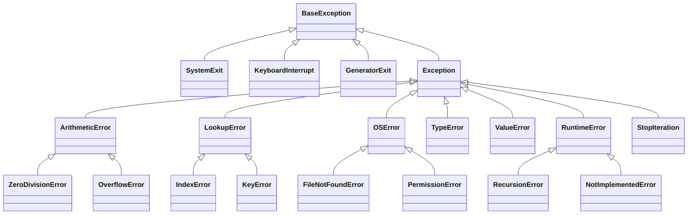
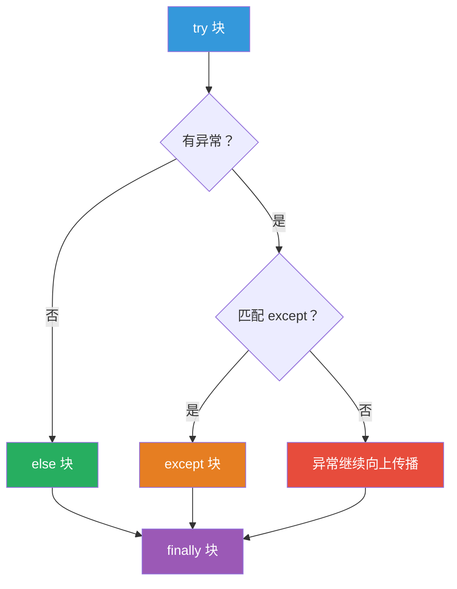

## 9.1 什么是异常？

异常（Exception）是程序运行时发生的错误。Python 中一切皆对象，异常也不例外。

```python
 常见异常
 print(1 / 0)              # ZeroDivisionError
 int("hello")              # ValueError
 [1, 2, 3][10]             # IndexError
 {"a": 1}["b"]             # KeyError
 open("nonexistent.txt")   # FileNotFoundError
 x = undefined_var         # NameError
 import nonexistent_module # ModuleNotFoundError
```

## 9.2 异常的层次结构



:::tip 异常分类
- **BaseException**：所有异常的基类
- **Exception**：普通异常的基类，**应该捕获这个**
- **SystemExit**：`sys.exit()` 触发，通常不需要捕获
- **KeyboardInterrupt**：用户按 Ctrl+C，通常不需要捕获
- **GeneratorExit**：生成器被关闭时触发

**经验法则：永远不要捕获 `BaseException`，通常捕获 `Exception`。**
:::

## 9.3 try/except/else/finally

```python
 完整语法
try:
    # 可能出错的代码
    result = 10 / 2
except ZeroDivisionError as e:
    # 捕获特定异常
    print(f"除零错误：{e}")
except (TypeError, ValueError) as e:
    # 捕获多种异常
    print(f"类型或值错误：{e}")
except Exception as e:
    # 兜底（捕获所有普通异常）
    print(f"未知错误：{e}")
else:
    # 没有异常时执行
    print(f"结果：{result}")
finally:
    # 无论是否异常都执行
    print("清理资源...")

 输出：
 结果：5.0
 清理资源...
```



:::warning 异常处理最佳实践
1. **尽量捕获具体异常**，不要什么都用 `except Exception`
2. **不要空 except**（至少 `logging.exception(e)` 记录日志）
3. **finally 用于清理**（关闭文件、释放锁等）
4. **else 用于正常逻辑**，try 块尽量只放可能出错的代码
:::

## 9.4 捕获特定异常 vs 兜底 Exception

```python
 ✅ 好 —— 捕获具体异常
def read_config(filepath):
    try:
        with open(filepath, "r") as f:
            return json.load(f)
    except FileNotFoundError:
        print(f"配置文件 {filepath} 不存在，使用默认配置")
        return default_config()
    except json.JSONDecodeError:
        print(f"配置文件 {filepath} 格式错误")
        raise  # 重新抛出

 ❌ 坏 —— 捕获所有异常，隐藏了真正的问题
def read_config_bad(filepath):
    try:
        with open(filepath, "r") as f:
            return json.load(f)
    except Exception:  # 捕获了包括 KeyboardInterrupt 在内的所有异常
        return default_config()
```

## 9.5 异常链（raise from）

```python
 raise from —— 链式异常，保留原始异常信息
def parse_int(s):
    try:
        return int(s)
    except ValueError as e:
        raise ValueError(f"'{s}' 不是有效的整数") from e

 调用
try:
    parse_int("hello")
except ValueError as e:
    print(e)           # 'hello' 不是有效的整数
    print(e.__cause__) # invalid literal for int() with base 10: 'hello'

 也可以用 raise ... from None 抑制原始异常
try:
    int("hello")
except ValueError:
    raise ValueError("输入必须是整数") from None
```

## 9.6 自定义异常

```python
 自定义异常类 —— 继承 Exception
class InsufficientBalanceError(Exception):
    """余额不足异常。"""
    def __init__(self, balance, amount):
        self.balance = balance
        self.amount = amount
        super().__init__(
            f"余额不足：当前余额 {balance}，需要 {amount}"
        )

class BankAccount:
    def __init__(self, balance=0):
        self.balance = balance
    
    def withdraw(self, amount):
        if amount > self.balance:
            raise InsufficientBalanceError(self.balance, amount)
        self.balance -= amount
        return self.balance

 使用
account = BankAccount(100)
try:
    account.withdraw(200)
except InsufficientBalanceError as e:
    print(e)             # 余额不足：当前余额 100，需要 200
    print(e.balance)     # 100
    print(e.amount)      # 200
```

## 9.7 异常处理的最佳实践

```python
 ✅ 1. 只捕获你预期的异常
def divide(a, b):
    try:
        return a / b
    except ZeroDivisionError:
        raise ValueError("除数不能为零")

 ✅ 2. 用 finally 确保资源释放
def process_file(filepath):
    f = open(filepath, "r")
    try:
        return f.read()
    finally:
        f.close()  # 始终执行

 更好的做法：用 with
def process_file_better(filepath):
    with open(filepath, "r") as f:
        return f.read()

 ✅ 3. 用 logging 记录异常
import logging

def risky_operation():
    try:
        # 可能出错的代码
        pass
    except Exception as e:
        logging.exception("操作失败")  # 自动记录异常堆栈
        raise  # 重新抛出

 ✅ 4. 自定义异常让 API 更清晰
class ValidationError(Exception):
    pass

class NotFoundError(Exception):
    pass

 ✅ 5. 不要用异常控制正常流程
 ❌ 坏
def get_first(items):
    try:
        return items[0]
    except IndexError:
        return None

 ✅ 好
def get_first(items):
    return items[0] if items else None
```

## 9.8 Java try-catch 对比

```java
// Java 的异常处理
try {
    int result = 10 / 0;
} catch (ArithmeticException e) {
    System.out.println("算术错误: " + e.getMessage());
} catch (Exception e) {
    System.out.println("其他错误: " + e.getMessage());
} finally {
    System.out.println("清理资源");
}
```

| 特性 | Java | Python |
|------|------|--------|
| 语法 | `try-catch-finally` | `try-except-else-finally` |
| 捕获多种异常 | `catch (A \| B e)` | `except (A, B) as e` |
| 异常链 | `throw new E("msg", cause)` | `raise E("msg") from cause` |
| 受检异常 | ✅（必须声明或捕获） | ❌（所有异常都是非受检的） |
| finally | ✅ | ✅ |
| else | ❌ | ✅ |
| 自定义异常 | `class E extends Exception` | `class E(Exception)` |
| 异常类型 | 分受检/非受检 | 全部非受检 |

:::tip Python 没有"受检异常"
Java 区分**受检异常**（checked exception，必须处理）和**非受检异常**（unchecked exception，RuntimeException，可以不处理）。

Python **没有受检异常**的概念，所有异常都是运行时抛出的。这是设计哲学的差异：
- Java 认为显式声明让代码更安全
- Python 认为 try/except 太多会影响可读性，信任开发者
:::

## 📝 练习题

**1. 写一个安全的除法函数，处理除零和类型错误。**


**参考答案**

```python
def safe_divide(a, b):
    try:
        return float(a) / float(b)
    except ZeroDivisionError:
        return "错误：除数不能为零"
    except (TypeError, ValueError):
        return "错误：请输入有效的数字"

print(safe_divide(10, 3))     # 3.3333333333333335
print(safe_divide(10, 0))     # 错误：除数不能为零
print(safe_divide("10", "3")) # 3.3333333333333335
print(safe_divide("abc", 3))  # 错误：请输入有效的数字
```


**2. 写一个函数，读取 JSON 配置文件，处理文件不存在和格式错误。**


**参考答案**

```python
import json

def load_config(filepath):
    try:
        with open(filepath, "r", encoding="utf-8") as f:
            return json.load(f)
    except FileNotFoundError:
        print(f"警告：配置文件 {filepath} 不存在，返回默认配置")
        return {"debug": False, "port": 8080}
    except json.JSONDecodeError as e:
        raise ValueError(f"配置文件格式错误：{e}") from e

config = load_config("config.json")
print(config)
```


**3. 实现一个简单的重试机制：如果操作失败，自动重试最多 3 次。**


**参考答案**

```python
import time

def retry(func, max_retries=3, delay=1):
    for attempt in range(max_retries):
        try:
            return func()
        except Exception as e:
            if attempt == max_retries - 1:
                raise
            print(f"第 {attempt + 1} 次失败：{e}，{delay} 秒后重试...")
            time.sleep(delay)

 使用
def fetch_data():
    # 模拟偶尔失败的操作
    import random
    if random.random() < 0.7:
        raise ConnectionError("连接失败")
    return {"data": "success"}

result = retry(fetch_data, max_retries=5, delay=0.5)
print(result)
```


**4. 创建一个自定义异常类 `InvalidAgeError`，在年龄不在 0-150 范围内时抛出。**


**参考答案**

```python
class InvalidAgeError(ValueError):
    def __init__(self, age):
        self.age = age
        super().__init__(f"无效的年龄：{age}，年龄必须在 0-150 之间")

def set_age(age):
    if not isinstance(age, (int, float)):
        raise TypeError(f"年龄必须是数字，而不是 {type(age).__name__}")
    if not 0 <= age <= 150:
        raise InvalidAgeError(age)
    return age

print(set_age(25))        # 25
 set_age(-1)             # InvalidAgeError: 无效的年龄：-1
 set_age("hello")        # TypeError: 年龄必须是数字
```


**5. 使用 `raise from` 写一个函数，将底层异常包装为业务异常。**


**参考答案**

```python
class DatabaseError(Exception):
    """数据库操作错误。"""
    pass

class ConnectionError(Exception):
    """连接错误。"""
    pass

def fetch_user(user_id):
    """模拟从数据库获取用户。"""
    try:
        # 模拟数据库连接失败
        raise ConnectionError("无法连接到数据库 localhost:5432")
    except ConnectionError as e:
        raise DatabaseError(f"获取用户 {user_id} 失败") from e

try:
    fetch_user(1)
except DatabaseError as e:
    print(e)               # 获取用户 1 失败
    print(f"原因：{e.__cause__}")  # 原因：无法连接到数据库 localhost:5432
```


---

# 总结

恭喜你完成了 Python 基础的全部学习！ 🎉

回顾一下我们学到的内容：

| 章节 | 核心内容 | Java 对比要点 |
|------|---------|--------------|
| 环境搭建 | pyenv、venv、pip | Maven 依赖管理、SDKMAN |
| 变量与类型 | 名字绑定对象、动态类型、falsy 值 | 静态类型、基本类型 vs 引用类型 |
| 运算符 | 短路返回值、海象运算符、链式比较 | 运算符始终返回 boolean |
| 字符串 | f-string、切片、join 性能 | String 不可变、StringBuilder |
| 数据结构 | list/tuple/dict/set | ArrayList/HashMap/HashSet |
| 条件循环 | match-case、列表推导式 | switch（Java 17+ 增强） |
| 函数 | 闭包、*args/**kwargs、一等公民 | Lambda 限制较多 |
| 文件操作 | with 语句、pathlib | try-with-resources、NIO |
| 异常处理 | raise from、自定义异常 | 受检异常 vs 非受检异常 |

**下一步建议：**
1. 多写代码！完成所有练习题
2. 尝试用 Python 写一个小项目（比如命令行工具、Web API）
3. 进入 Stage 2 学习面向对象、模块、包管理等进阶内容

:::info 从 Java 到 Python 的心态转换
1. **简洁至上** —— Python 鼓励写少的代码，可读性 > 简洁性
2. **鸭子类型** —— 不需要接口和继承，关注对象的行为而非类型
3. **EAFP vs LBYL** —— "先做再说"（try/except）vs "先检查再做"（if 判断）。Python 偏好 EAFP
4. ** batteries included** —— 标准库非常强大，先看看有没有内置的
5. **没有 main 方法** —— 直接写代码就能跑，不需要包在 class 里
:::