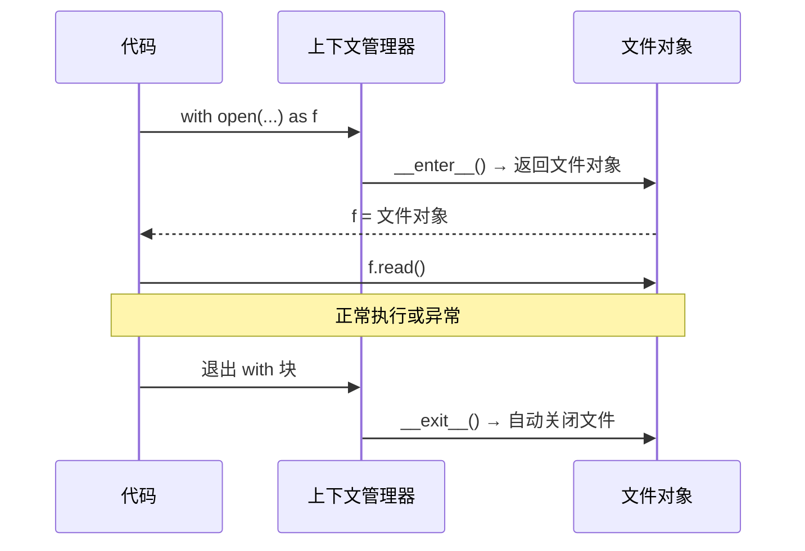

## 8.1 open() 函数详解

```python
 open(file, mode='r', encoding=None, buffering=-1)
 
 mode 参数：
 'r'  —— 只读（默认）
 'w'  —— 只写（覆盖已有文件）
 'x'  —— 独占创建（文件已存在则报错）
 'a'  —— 追加
 'b'  —— 二进制模式
 't'  —— 文本模式（默认）
 '+'  —— 读+写
 
 常用组合：'rb', 'wb', 'r+', 'w+', 'a+'

 读取文本文件
f = open("hello.txt", "r", encoding="utf-8")
content = f.read()
f.close()  # 一定要关闭！

 ⚠️ 上面的写法有风险：如果 read() 报错，f.close() 就不会执行
 ✅ 用 with 语句自动管理
```

## 8.2 with 语句原理

```python
 with 语句自动调用 __enter__ 和 __exit__
with open("hello.txt", "r", encoding="utf-8") as f:
    content = f.read()
 无论是否报错，文件都会被自动关闭

 等价于：
f = open("hello.txt", "r", encoding="utf-8")
try:
    content = f.read()
finally:
    f.close()
```



:::tip Java 对比
Java 7+ 的 try-with-resources：
```java
try (BufferedReader br = new BufferedReader(new FileReader("hello.txt"))) {
    String line;
    while ((line = br.readLine()) != null) {
        System.out.println(line);
    }
}  // br 自动关闭
```
Python 的 `with` 和 Java 的 try-with-resources 思路完全一样。
:::

## 8.3 读文件

```python
 1. read() —— 一次性读取全部内容
with open("hello.txt", "r", encoding="utf-8") as f:
    content = f.read()     # 整个文件内容
    print(content)

 2. read(size) —— 指定字节数读取
with open("hello.txt", "r", encoding="utf-8") as f:
    chunk = f.read(100)    # 读取前 100 个字符
    print(chunk)

 3. readline() —— 读取一行
with open("hello.txt", "r", encoding="utf-8") as f:
    line1 = f.readline()   # 第一行（含换行符）
    line2 = f.readline()   # 第二行

 4. readlines() —— 读取所有行，返回列表
with open("hello.txt", "r", encoding="utf-8") as f:
    lines = f.readlines()  # ['第一行\n', '第二行\n', ...]

 5. 逐行迭代（推荐！内存友好）
with open("hello.txt", "r", encoding="utf-8") as f:
    for line in f:
        print(line.strip())  # strip() 去除换行符
```

:::tip 读取大文件的最佳实践
```python
 ✅ 逐行迭代 —— 一次只读一行到内存
with open("big_file.txt", "r") as f:
    for line in f:
        process(line)

 ❌ read() / readlines() —— 整个文件读入内存
 content = f.read()  # 10GB 文件？内存爆炸！
```
:::

## 8.4 写文件

```python
 写文件（覆盖模式）
with open("output.txt", "w", encoding="utf-8") as f:
    f.write("Hello, World!\n")    # write() 不会自动加换行
    f.write("第二行\n")

 追加模式
with open("output.txt", "a", encoding="utf-8") as f:
    f.write("追加的内容\n")

 writelines() —— 写入列表
lines = ["第一行\n", "第二行\n", "第三行\n"]
with open("output.txt", "w", encoding="utf-8") as f:
    f.writelines(lines)

 print() 到文件
with open("output.txt", "w", encoding="utf-8") as f:
    print("Hello", file=f)         # 自动加换行
    print("World", file=f)
```

## 8.5 文件指针 seek/tell

```python
with open("hello.txt", "r", encoding="utf-8") as f:
    print(f.tell())      # 0（当前位置）
    
    content = f.read(5)  # 读取 5 个字符
    print(f.tell())      # 5
    
    f.seek(0)            # 回到开头
    print(f.tell())      # 0
    
    f.seek(0, 2)         # 跳到末尾（2 = SEEK_END）
    print(f.tell())      # 文件总字符数

 ⚠️ seek 在文本模式下有限制（不能在多字节字符中间 seek）
 二进制模式下更灵活
with open("hello.txt", "rb") as f:
    f.seek(-10, 2)       # 从末尾往前 10 字节
    print(f.read())      # 最后 10 个字节
```

## 8.6 os 和 pathlib 基础

```python
import os
from pathlib import Path

 ─── os 模块（传统方式） ───
print(os.getcwd())                    # 当前工作目录
os.chdir("/tmp")                      # 切换目录
print(os.listdir("."))                # 列出目录内容
os.makedirs("a/b/c", exist_ok=True)   # 创建目录（递归）
os.remove("file.txt")                 # 删除文件
os.rmdir("dir")                       # 删除空目录
print(os.path.exists("file.txt"))     # 是否存在
print(os.path.isfile("file.txt"))     # 是否是文件
print(os.path.isdir("dir"))           # 是否是目录
print(os.path.join("a", "b", "c"))    # 拼接路径：a/b/c
print(os.path.splitext("file.txt"))   # ('file', '.txt')

 ─── pathlib（推荐，面向对象） ───
p = Path("/Users/alice/projects/hello.py")

print(p.name)           # 'hello.py'
print(p.stem)           # 'hello'
print(p.suffix)         # '.py'
print(p.parent)         # PosixPath('/Users/alice/projects')
print(p.exists())       # True
print(p.is_file())      # True

 路径拼接
new_path = Path("/home") / "alice" / "file.txt"

 创建目录
Path("a/b/c").mkdir(parents=True, exist_ok=True)

 遍历目录
for p in Path(".").glob("*.py"):    # 当前目录所有 .py 文件
    print(p)
for p in Path(".").rglob("*.py"):   # 递归搜索
    print(p)

 读写文件
content = Path("hello.txt").read_text(encoding="utf-8")
Path("output.txt").write_text("Hello!", encoding="utf-8")
```

:::tip 推荐用 pathlib
`pathlib` 是 Python 3.4+ 引入的，比 `os.path` 更 Pythonic、更安全、更易读。

```python
 os.path 方式（字符串操作）
os.path.join("/home", "alice", "file.txt")

 pathlib 方式（对象操作）
Path("/home") / "alice" / "file.txt"
```
:::

## 8.7 CSV 和 JSON 读写

```python
import csv
import json

 ─── CSV ───
 写 CSV
data = [
    ["Name", "Age", "City"],
    ["Alice", 30, "Beijing"],
    ["Bob", 25, "Shanghai"],
]
with open("data.csv", "w", newline="", encoding="utf-8") as f:
    writer = csv.writer(f)
    writer.writerows(data)

 读 CSV
with open("data.csv", "r", encoding="utf-8") as f:
    reader = csv.reader(f)
    for row in reader:
        print(row)

 用 DictReader（推荐）
with open("data.csv", "r", encoding="utf-8") as f:
    reader = csv.DictReader(f)
    for row in reader:
        print(row["Name"], row["Age"])

 ─── JSON ───
 写 JSON
person = {
    "name": "Alice",
    "age": 30,
    "hobbies": ["reading", "coding"]
}
with open("data.json", "w", encoding="utf-8") as f:
    json.dump(person, f, ensure_ascii=False, indent=2)

 读 JSON
with open("data.json", "r", encoding="utf-8") as f:
    person = json.load(f)
    print(person)

 JSON 字符串 ↔ Python 对象
json_str = json.dumps(person, ensure_ascii=False, indent=2)
obj = json.loads(json_str)
```

:::info Java 对比
```java
// Java CSV：Apache Commons CSV 或 OpenCSV
// Java JSON：Jackson 或 Gson
ObjectMapper mapper = new ObjectMapper();
mapper.writeValue(new File("data.json"), person);
Person p = mapper.readValue(new File("data.json"), Person.class);
```
Python 内置了 `csv` 和 `json` 模块，不需要第三方库。
:::

## 📝 练习题

**1. 写一个函数，统计一个文本文件中每个单词出现的次数，输出前 10 个最常见的单词。**


**参考答案**

```python
from collections import Counter

def top_words(filepath, n=10):
    with open(filepath, "r", encoding="utf-8") as f:
        text = f.read().lower()
    words = text.split()
    return Counter(words).most_common(n)

print(top_words("hello.txt"))
```


**2. 写一个函数，将一个 CSV 文件转换为 JSON 文件。**


**参考答案**

```python
import csv
import json

def csv_to_json(csv_path, json_path):
    with open(csv_path, "r", encoding="utf-8") as f:
        reader = csv.DictReader(f)
        data = list(reader)
    
    with open(json_path, "w", encoding="utf-8") as f:
        json.dump(data, f, ensure_ascii=False, indent=2)

csv_to_json("data.csv", "data.json")
```


**3. 写一个函数，递归遍历一个目录，找出所有大于 1MB 的文件。**


**参考答案**

```python
from pathlib import Path

def find_large_files(directory, min_size_mb=1):
    result = []
    min_size = min_size_mb * 1024 * 1024
    for p in Path(directory).rglob("*"):
        if p.is_file() and p.stat().st_size > min_size:
            size_mb = p.stat().st_size / (1024 * 1024)
            result.append((str(p), f"{size_mb:.2f} MB"))
    return result

files = find_large_files("/Users")
for path, size in files:
    print(f"{path} ({size})")
```


**4. 写一个日志分析工具：读取日志文件，提取所有 ERROR 级别的日志，统计每种错误出现的次数。**


**参考答案**

```python
import re
from collections import Counter

def analyze_errors(log_path):
    errors = []
    pattern = re.compile(r'ERROR\s+(.+)')
    
    with open(log_path, "r") as f:
        for line in f:
            if "ERROR" in line:
                match = pattern.search(line)
                if match:
                    errors.append(match.group(1).strip())
    
    return Counter(errors)

errors = analyze_errors("app.log")
for error, count in errors.most_common():
    print(f"[{count}次] {error}")
```


**5. 实现一个简单的文件备份工具，将指定目录的文件复制到备份目录（保持目录结构）。**


**参考答案**

```python
import shutil
from pathlib import Path

def backup(src_dir, dst_dir):
    src = Path(src_dir)
    dst = Path(dst_dir)
    
    for file_path in src.rglob("*"):
        if file_path.is_file():
            relative = file_path.relative_to(src)
            target = dst / relative
            target.parent.mkdir(parents=True, exist_ok=True)
            shutil.copy2(file_path, target)
            print(f"备份：{file_path} → {target}")

backup("./projects", "./backup/projects")
```


---