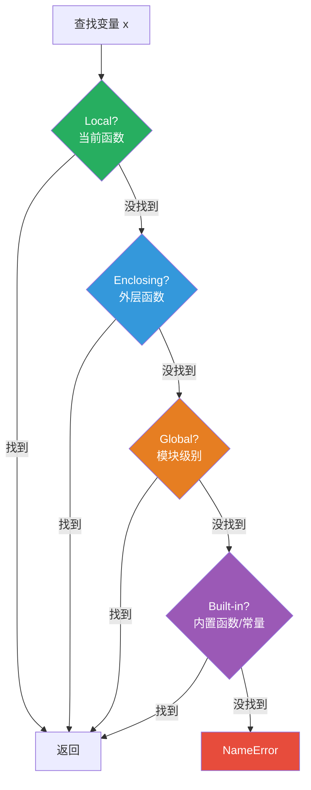

## 7.1 定义和调用

```python
 定义函数 —— def 关键字
def greet(name):
    """向指定的人打招呼。"""
    return f"Hello, {name}!"

 调用
result = greet("Alice")
print(result)  # Hello, Alice!

 没有返回值的函数默认返回 None
def say_hello():
    print("Hello!")

result = say_hello()  # 输出：Hello!
print(result)          # None
```

## 7.2 参数类型

```python
 1. 位置参数 —— 按顺序传递
def power(base, exponent):
    return base ** exponent

print(power(2, 3))  # 8

 2. 默认参数 —— 调用时可以省略
def greet(name, greeting="Hello"):
    return f"{greeting}, {name}!"

print(greet("Alice"))              # Hello, Alice!
print(greet("Alice", "Hi"))        # Hi, Alice!

 ⚠️ 默认参数的陷阱：不要用可变对象作为默认值！
def bad_append(item, lst=[]):  # ❌ 所有调用共享同一个列表
    lst.append(item)
    return lst

print(bad_append(1))  # [1]
print(bad_append(2))  # [1, 2]  ← 不是 [2]！

 ✅ 正确做法
def good_append(item, lst=None):
    if lst is None:
        lst = []
    lst.append(item)
    return lst

print(good_append(1))  # [1]
print(good_append(2))  # [2]

 3. *args —— 可变位置参数（接收任意数量的位置参数，打包成元组）
def sum_all(*args):
    return sum(args)

print(sum_all(1, 2, 3))      # 6
print(sum_all(1, 2, 3, 4, 5))  # 15

 4. **kwargs —— 可变关键字参数（接收任意数量的关键字参数，打包成字典）
def print_info(**kwargs):
    for key, value in kwargs.items():
        print(f"{key}: {value}")

print_info(name="Alice", age=30, city="Beijing")
 name: Alice
 age: 30
 city: Beijing

 5. 仅关键字参数（* 之后的参数必须用关键字传递）
def func(a, b, *, c, d):
    return a + b + c + d

print(func(1, 2, c=3, d=4))  # 10
 func(1, 2, 3, 4)  # TypeError

 6. 仅位置参数（Python 3.8+，/ 之前的参数只能按位置传递）
def func(a, b, /, c, d, *, e, f):
    pass

 func(1, 2, 3, 4, e=5, f=6)  # ✅
 func(a=1, b=2, c=3, d=4, e=5, f=6)  # ❌ a, b 是仅位置参数

 完整参数顺序
def full_func(pos_only, /, standard, *, kw_only, **kwargs):
    pass
```

## 7.3 返回值

```python
 多返回值 —— 实际上返回的是元组
def min_max(numbers):
    return min(numbers), max(numbers)

result = min_max([3, 1, 4, 1, 5, 9])
print(result)       # (1, 9)  ← 这是一个元组
print(type(result))  # <class 'tuple'>

 解包
lo, hi = min_max([3, 1, 4, 1, 5, 9])
print(lo, hi)  # 1 9

 返回字典（返回多个有意义的值时更清晰）
def divide(a, b):
    if b == 0:
        return {"success": False, "error": "除数不能为零"}
    return {"success": True, "result": a / b}
```

## 7.4 文档字符串 docstring

```python
def calculate_area(width, height):
    """
    计算矩形面积。
    
    这是一个多行 docstring，包含详细的函数说明。
    
    Args:
        width (float): 矩形的宽度
        height (float): 矩形的高度
    
    Returns:
        float: 矩形的面积
    
    Raises:
        TypeError: 如果参数不是数字
        ValueError: 如果参数为负数
    
    Examples:
        >>> calculate_area(3, 4)
        12
        >>> calculate_area(5.5, 3.2)
        17.6
    """
    return width * height

 访问 docstring
print(calculate_area.__doc__)

 help() 函数会显示 docstring
 help(calculate_area)
```

:::info Java 对比
Python 的 docstring ≈ Java 的 Javadoc 注释，但 docstring 是运行时可访问的字符串对象。

```java
/**
 * 计算矩形面积。
 * @param width 矩形的宽度
 * @param height 矩形的高度
 * @return 矩形的面积
 */
public double calculateArea(double width, double height) {
    return width * height;
}
```
:::

## 7.5 变量作用域（LEGB 规则）

```python
 LEGB：Local → Enclosing → Global → Built-in

x = "global"           # Global（模块级别）

def outer():
    x = "enclosing"    # Enclosing（外层函数）
    
    def inner():
        x = "local"    # Local（当前函数）
        print(x)       # 输出：local
    
    inner()
    print(x)           # 输出：enclosing

outer()
print(x)               # 输出：global

 ─── global 关键字 ───
count = 0

def increment():
    global count        # 声明使用全局变量
    count += 1

increment()
print(count)            # 1

 ─── nonlocal 关键字 ───
def outer():
    count = 0
    
    def inner():
        nonlocal count  # 声明使用外层函数的变量
        count += 1
    
    inner()
    print(count)        # 1

outer()
```



:::warning 常见坑：在函数内修改全局变量
```python
x = [1, 2, 3]

def append_item():
    x.append(4)    # ✅ 不需要 global，因为没有重新赋值
    # x = [4, 5]   # ❌ 这才是重新赋值，需要 global

append_item()
print(x)  # [1, 2, 3, 4]

 规则：如果只是读取/修改可变对象（如列表的 append），不需要 global
      如果要重新绑定变量名（= 赋值），需要 global
```
:::

## 7.6 闭包

```python
 闭包：内部函数引用外部函数的变量，外部函数返回内部函数
def make_multiplier(factor):
    """创建一个乘法器函数。"""
    def multiplier(number):
        return number * factor  # 引用外部的 factor
    return multiplier           # 返回内部函数

double = make_multiplier(2)
triple = make_multiplier(3)

print(double(5))    # 10
print(triple(5))    # 15

 闭包的实际应用：计数器
def make_counter():
    count = 0
    def counter():
        nonlocal count
        count += 1
        return count
    return counter

c = make_counter()
print(c())  # 1
print(c())  # 2
print(c())  # 3
```

:::tip 闭包的本质
闭包 = 函数 + 该函数定义时的环境（引用的外部变量）。

在 CPython 中，闭包引用的外部变量存储在 `__closure__` 属性中：

```python
def outer():
    x = 42
    def inner():
        return x
    return inner

f = outer()
print(f.__closure__[0].cell_contents)  # 42
```

Java 也有类似概念：匿名内部类和 Lambda 表达式可以捕获外部变量（但 Java 要求捕获的变量是 effectively final）。
:::

## 7.7 Lambda 表达式

```python
 Lambda —— 匿名函数，只能包含一个表达式
square = lambda x: x ** 2
print(square(5))  # 25

 等价于
def square(x):
    return x ** 2

 Lambda 最常用于需要函数作为参数的场景
 sorted
students = [("Alice", 92), ("Bob", 85), ("Charlie", 98)]
print(sorted(students, key=lambda s: s[1]))
 [('Bob', 85), ('Alice', 92), ('Charlie', 98)]

 map
print(list(map(lambda x: x ** 2, [1, 2, 3, 4])))  # [1, 4, 9, 16]

 filter
print(list(filter(lambda x: x > 3, [1, 2, 3, 4, 5])))  # [4, 5]

 Java 对比：
// Java Lambda
List<Integer> squares = numbers.stream()
    .map(x -> x * x)
    .collect(Collectors.toList());
```

:::warning Lambda 的使用原则
- ✅ 简单的一行表达式 → 用 Lambda
- ❌ 复杂逻辑 → 用 def 定义具名函数，更清晰

```python
 ✅ 好
sorted(data, key=lambda x: x.age)

 ❌ 不好（太复杂）
sorted(data, key=lambda x: x.age * 0.5 + x.score * 0.3 if x.grade == 'A' else x.age * 0.3)

 ✅ 好的替代方案
def complex_key(x):
    if x.grade == 'A':
        return x.age * 0.5 + x.score * 0.3
    return x.age * 0.3

sorted(data, key=complex_key)
```
:::

## 7.8 高阶函数

```python
 map —— 对每个元素应用函数
print(list(map(str, [1, 2, 3, 4])))         # ['1', '2', '3', '4']
print(list(map(len, ["hi", "hello", "hey"])))  # [2, 5, 3]

 filter —— 过滤元素
print(list(filter(None, [0, 1, "", "hi", None, []])))
 [1, 'hi']（None 作为过滤函数时，过滤掉 falsy 值）

 reduce —— 累积计算
from functools import reduce
print(reduce(lambda a, b: a + b, [1, 2, 3, 4, 5]))  # 15
print(reduce(lambda a, b: a * b, [1, 2, 3, 4, 5]))  # 120

 sorted —— 自定义排序
words = ["banana", "apple", "cherry", "date"]
print(sorted(words))                                    # 按字母排序
print(sorted(words, key=len))                           # 按长度排序
print(sorted(words, key=lambda w: w[-1]))               # 按最后一个字母排序
print(sorted(words, key=lambda w: (len(w), w)))         # 先按长度，再按字母

 函数作为参数传递
def apply_operation(func, x, y):
    return func(x, y)

print(apply_operation(lambda a, b: a + b, 3, 4))    # 7
print(apply_operation(lambda a, b: a * b, 3, 4))    # 12
```

## 7.9 递归

```python
 阶乘
def factorial(n):
    if n <= 1:
        return 1
    return n * factorial(n - 1)

print(factorial(5))  # 120

 斐波那契（朴素递归 —— 效率低，O(2^n)）
def fib(n):
    if n <= 1:
        return n
    return fib(n - 1) + fib(n - 2)

 斐波那契（带缓存 —— 效率高，O(n)）
from functools import lru_cache

@lru_cache(maxsize=None)
def fib_cached(n):
    if n <= 1:
        return n
    return fib_cached(n - 1) + fib_cached(n - 2)

print(fib_cached(50))  # 12586269025（瞬间）

 递归深度限制
import sys
print(sys.getrecursionlimit())  # 1000（默认）

 如果需要更深，可以调整（但不建议太大，可能导致栈溢出）
 sys.setrecursionlimit(10000)
```

## 7.10 类型注解

```python
 类型注解（Python 3.5+）—— 只是提示，不影响运行时
def greet(name: str) -> str:
    return f"Hello, {name}!"

def add(a: int, b: int) -> int:
    return a + b

 复杂类型注解
from typing import List, Dict, Optional, Tuple, Union

def process(items: List[int]) -> Dict[str, int]:
    return {"count": len(items), "sum": sum(items)}

def find_user(user_id: int) -> Optional[str]:
    """找不到用户时返回 None。"""
    if user_id == 1:
        return "Alice"
    return None

def divide(a: float, b: float) -> Union[float, str]:
    if b == 0:
        return "Error: division by zero"
    return a / b

 Python 3.10+ 可以用 | 代替 Union
def divide_new(a: float, b: float) -> float | str:
    if b == 0:
        return "Error: division by zero"
    return a / b

 用 mypy 检查类型
 pip install mypy
 mypy your_file.py
```

:::info Java 对比
Java 的类型系统是**强制的**（编译时检查），Python 的类型注解是**可选的**（需要 mypy 等工具额外检查）。

```java
// Java —— 类型是强制的
public int add(int a, int b) {
    return a + b;
}
```

```python
 Python —— 类型注解是可选的
def add(a: int, b: int) -> int:
    return a + b
 add("hello", "world")  # 也能运行！返回 "helloworld"
```
:::

## 7.11 函数是一等公民

在 Python 中，函数是一等公民（First-class Citizen），这意味着：

```python
 1. 赋值给变量
def greet(name):
    return f"Hello, {name}!"

say_hi = greet
print(say_hi("Alice"))  # Hello, Alice!

 2. 作为参数传递
def apply(func, value):
    return func(value)

print(apply(len, "hello"))   # 5
print(apply(str.upper, "hello"))  # HELLO

 3. 作为返回值
def make_greeter(greeting):
    def greet(name):
        return f"{greeting}, {name}!"
    return greet

hello = make_greeter("Hello")
hi = make_greeter("Hi")
print(hello("Alice"))  # Hello, Alice!
print(hi("Bob"))       # Hi, Bob!

 4. 存储在数据结构中
operations = {
    "add": lambda a, b: a + b,
    "sub": lambda a, b: a - b,
    "mul": lambda a, b: a * b,
    "div": lambda a, b: a / b,
}
print(operations["add"](3, 4))  # 7
```

## 7.12 Java 方法对比

| 特性 | Java 方法 | Python 函数 |
|------|----------|------------|
| 定义 | `public int add(int a, int b)` | `def add(a, b):` |
| 返回类型 | 必须声明 | 可选注解 |
| 参数类型 | 必须声明 | 可选注解 |
| 重载 | ✅ 同名不同参数 | ❌ 后定义的覆盖先定义的 |
| 可变参数 | `int... args` | `*args`, `**kwargs` |
| 默认参数 | ❌ 需要方法重载 | ✅ `def f(x=10):` |
| 函数作为参数 | 接口/函数式接口 | 直接传递函数对象 |
| 闭包 | Lambda 表达式（限制较多） | ✅ 完整支持 |
| 高阶函数 | Stream API | `map`, `filter`, `reduce` |
| 文档 | Javadoc 注释 | docstring（运行时可访问） |

## 📝 练习题

**1. 写一个函数，接收一个列表，返回其中所有偶数。**


**参考答案**

```python
def get_evens(numbers):
    return [n for n in numbers if n % 2 == 0]

print(get_evens([1, 2, 3, 4, 5, 6, 7, 8]))  # [2, 4, 6, 8]
```


**2. 写一个装饰器（如果学了装饰器的话），或者写一个函数，接收一个函数和参数，测量执行时间。**


**参考答案**

```python
import time

def timer(func):
    def wrapper(*args, **kwargs):
        start = time.time()
        result = func(*args, **kwargs)
        end = time.time()
        print(f"{func.__name__} 执行时间：{end - start:.4f} 秒")
        return result
    return wrapper

 使用
@timer
def slow_sum(n):
    return sum(range(n))

slow_sum(1000000)
 slow_sum 执行时间：0.0321 秒
```


**3. 实现柯里化（Currying）：将 `add(a, b, c)` 转换为 `add(a)(b)(c)`。**


**参考答案**

```python
def curry(func):
    def curried(*args):
        if len(args) >= func.__code__.co_argcount:
            return func(*args)
        return lambda *more: curried(*args, *more)
    return curried

@curry
def add(a, b, c):
    return a + b + c

print(add(1)(2)(3))  # 6
print(add(1, 2)(3))  # 6
print(add(1)(2, 3))  # 6
```


**4. 写一个高阶函数 `pipe`，将多个函数串联执行：`pipe(data, f1, f2, f3)` 等价于 `f3(f2(f1(data)))`。**


**参考答案**

```python
from functools import reduce

def pipe(data, *funcs):
    return reduce(lambda val, func: func(val), funcs, data)

 使用
result = pipe(5,
    lambda x: x + 1,       # 6
    lambda x: x * 2,       # 12
    lambda x: x ** 2,      # 144
    str                    # '144'
)
print(result)  # '144'
```


**5. 用递归实现二分查找。**


**参考答案**

```python
def binary_search(arr, target, low=0, high=None):
    if high is None:
        high = len(arr) - 1
    if low > high:
        return -1
    
    mid = (low + high) // 2
    if arr[mid] == target:
        return mid
    elif arr[mid] > target:
        return binary_search(arr, target, low, mid - 1)
    else:
        return binary_search(arr, target, mid + 1, high)

data = [1, 3, 5, 7, 9, 11, 13, 15]
print(binary_search(data, 7))   # 3
print(binary_search(data, 6))   # -1
```


**6. 解释为什么默认参数不能用可变对象，并写出正确做法。**


**参考答案**

```python
 ❌ 错误：默认参数在函数定义时只创建一次，所有调用共享
def append_to(element, target=[]):
    target.append(element)
    return target

print(append_to(1))  # [1]
print(append_to(2))  # [1, 2]  ← 不是 [2]！

 ✅ 正确：用 None 作为默认值
def append_to(element, target=None):
    if target is None:
        target = []
    target.append(element)
    return target

print(append_to(1))  # [1]
print(append_to(2))  # [2]
```

原因：Python 函数的默认参数值在**函数定义时**计算并存储，而不是每次调用时创建。可变对象（列表、字典等）会在所有调用之间共享。


---