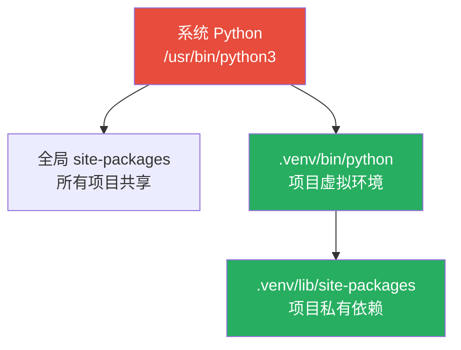

## 1.1 Python 下载安装

### macOS

macOS 自带 Python，但通常是旧版本（Python 2.7 或较老的 3.x），**不要用系统自带的**，自己装一个干净的。

**方法一：官方安装包（推荐新手）**

```bash
 1. 用 Homebrew 安装（推荐）
brew install python@3.12

 2. 验证安装
python3 --version
 输出：Python 3.12.x
pip3 --version
 输出：pip 24.x from ...
```

**方法二：从官网下载**

去 [python.org](https://www.python.org/downloads/) 下载 macOS 安装包，双击安装，一路 Next 即可。

### Windows

```powershell
 1. 去 https://www.python.org/downloads/ 下载安装包
 2. 安装时务必勾选 "Add Python to PATH"（重要！）
 3. 验证
python --version
pip --version
```

:::warning ⚠️ Windows 安装坑
如果不勾选 "Add Python to PATH"，你需要在环境变量中手动添加 Python 路径。安装完打开 cmd 输入 `python` 如果提示"不是内部命令"，就是 PATH 没配好。
:::

### Linux（Ubuntu/Debian）

```bash
 1. 更新包管理器
sudo apt update

 2. 安装依赖
sudo apt install -y build-essential zlib1g-dev libncurses5-dev \
    libgdbm-dev libnss3-dev libssl-dev libreadline-dev libffi-dev wget

 3. 安装 Python 3.12
sudo apt install -y python3.12 python3.12-venv python3-pip

 4. 验证
python3.12 --version
```

## 1.2 pyenv 管理多版本

Java 有 `jenv`，Python 对应的工具是 `pyenv`。当你需要同时维护多个 Python 版本（比如项目 A 用 3.10，项目 B 用 3.12），pyenv 是最佳选择。

```bash
 macOS 安装 pyenv
brew install pyenv

 将 pyenv 添加到 shell 配置（zsh）
echo 'export PYENV_ROOT="$HOME/.pyenv"' >> ~/.zshrc
echo 'command -v pyenv >/dev/null || export PATH="$PYENV_ROOT/bin:$PATH"' >> ~/.zshrc
echo 'eval "$(pyenv init -)"' >> ~/.zshrc
source ~/.zshrc

 安装指定版本的 Python
pyenv install 3.12.4          # 安装 Python 3.12.4
pyenv install 3.11.9          # 安装 Python 3.11.9

 查看已安装的版本
pyenv versions
 输出：
   system
 * 3.11.9 (set by /Users/xxx/.python-version)
   3.12.4

 设置全局默认版本
pyenv global 3.12.4

 为某个项目设置特定版本（在项目根目录执行）
cd ~/my-project
pyenv local 3.11.9
 这会在项目目录生成一个 .python-version 文件
```

:::tip pyenv 的工作原理
pyenv 通过在 PATH 最前面插入一个 `shims` 目录来拦截 `python` 命令。当你运行 `python` 时，shim 脚本会检查当前目录（及父目录）的 `.python-version` 文件或全局设置，然后转发到对应的 Python 版本。这跟 Java 的 `jenv` 思路类似。
:::

## 1.3 虚拟环境 venv

**为什么需要虚拟环境？** 你可能想问：我系统里已经装了 Python，直接用不就行了？

想象这个场景：项目 A 依赖 Django 3.2，项目 B 依赖 Django 4.2。两个版本 API 不兼容，怎么办？

Java 的解决方案是 Maven/Gradle 的依赖隔离（每个项目有自己的 `lib/` 目录）。Python 的方案是**虚拟环境**——每个项目创建一个独立的 Python "副本"，有自己的 `site-packages`。

```bash
 创建虚拟环境（在项目根目录）
python3 -m venv .venv

 激活虚拟环境
 macOS/Linux:
source .venv/bin/activate
 Windows:
 .venv\Scripts\activate

 激活后，命令行提示符前会多一个 (.venv)
 (.venv) user@mac my-project $

 确认虚拟环境已激活
which python
 输出：/Users/xxx/my-project/.venv/bin/python
 而不是系统的 /usr/bin/python3

 退出虚拟环境
deactivate
```



:::tip 虚拟环境底层原理
`python3 -m venv .venv` 做了以下事情：
1. 复制一份 Python 解释器的可执行文件（实际上是符号链接）
2. 创建 `lib/` 目录结构
3. 生成 `pyvenv.cfg` 配置文件（记录原 Python 路径等）
4. 安装 `pip` 到虚拟环境中

虚拟环境里的 Python 和系统的 Python 是**同一个二进制文件**（符号链接），只是 `site-packages` 路径不同。激活虚拟环境时，它修改了 `PATH` 和 `PYTHONPATH` 环境变量。
:::

:::warning 不要把 .venv 提交到 Git
在 `.gitignore` 中添加：
```
.venv/
venv/
```
:::

## 1.4 pip 配置国内镜像

默认 pip 从 PyPI（pypi.org）下载包，国内访问可能很慢。配置国内镜像源：

```bash
 方法一：命令行临时使用
pip install requests -i https://pypi.tuna.tsinghua.edu.cn/simple

 方法二：永久配置（推荐）
pip config set global.index-url https://pypi.tuna.tsinghua.edu.cn/simple

 验证配置
pip config list
 输出：global.index-url='https://pypi.tuna.tsinghua.edu.cn/simple'
```

常用国内镜像：

| 镜像源 | 地址 |
|--------|------|
| 清华大学 | https://pypi.tuna.tsinghua.edu.cn/simple |
| 阿里云 | https://mirrors.aliyun.com/pypi/simple |
| 中国科技大学 | https://pypi.mirrors.ustc.edu.cn/simple |
| 豆瓣 | https://pypi.douban.com/simple |

> **Java 对比：** 相当于 Maven 的 `settings.xml` 中配置阿里云镜像仓库。

## 1.5 VS Code 配置 Python 开发环境

1. **安装扩展：** 搜索并安装 "Python"（Microsoft 官方出品）
2. **选择解释器：** `Cmd+Shift+P` → 输入 "Python: Select Interpreter" → 选择你虚拟环境中的 Python（`.venv/bin/python`）
3. **推荐扩展：**
   - Python (Microsoft) — 核心支持
   - Pylance — 智能补全、类型检查
   - Black Formatter — 代码格式化
   - isort — import 排序
   - Ruff — 超快的 Linter（替代 flake8/pylint）

4. **创建 `.vscode/settings.json`：**

```json
{
  "python.defaultInterpreterPath": "${workspaceFolder}/.venv/bin/python",
  "python.formatting.provider": "black",
  "python.linting.enabled": true,
  "python.linting.pylintEnabled": false,
  "python.linting.flake8Enabled": true,
  "[python]": {
    "editor.formatOnSave": true,
    "editor.codeActionsOnSave": {
      "source.organizeImports": true
    }
  }
}
```

## 1.6 第一个程序

```python
 hello.py —— 你的第一个 Python 程序

 print() 是一个内置函数，用于输出内容到控制台
 Python 中不需要写 class Main、public static void main 等模板代码
 直接写逻辑就行，非常简洁
print("Hello, Python!")
 输出：Hello, Python!

 可以输出多个值，用逗号分隔，默认用空格连接
print("我叫", "张三", "今年", 25, "岁")
 输出：我叫 张三 今年 25 岁

 使用 f-string（Python 3.6+）格式化字符串
name = "张三"   # 变量不需要声明类型
age = 25        # 直接赋值就行
print(f"我叫{name}，今年{age}岁")
 输出：我叫张三，今年25岁

 input() 读取用户输入
 user_input = input("请输入你的名字：")
 print(f"你好，{user_input}！")
```

:::info Java 对比：第一个程序
```java
// Java 版本 —— 同样的功能需要这么多代码
public class Hello {
    public static void main(String[] args) {
        String name = "张三";
        int age = 25;
        System.out.println("我叫" + name + "，今年" + age + "岁");
    }
}
```
Python 不需要 class、不需要 main 方法、不需要分号、不需要声明类型。简洁到极致。
:::

## 1.7 Python 程序的执行过程

理解 Python 代码是怎么跑起来的，对于排查问题和性能优化非常重要。


**详细步骤：**

1. **词法分析（Lexer）：** 把源代码拆成一个个 token（标记），比如 `print`、`(`、`"Hello"`、`)`
2. **语法分析（Parser）：** 把 token 组装成抽象语法树（AST）
3. **编译（Compiler）：** 把 AST 编译成**字节码**（bytecode），存储在 `.pyc` 文件中（在 `__pycache__/` 目录下）
4. **执行（PVM）：** Python 虚拟机（也叫解释器）逐条执行字节码

```python
 查看字节码
import dis

def greet(name):
    print(f"Hello, {name}!")

dis.dis(greet)
 输出（部分）：
   2           0 LOAD_GLOBAL              0 (print)
               2 LOAD_CONST               1 ('Hello, ')
               4 LOAD_FAST                0 (name)
               6 FORMAT_VALUE             0
               8 LOAD_CONST               2 ('!')
              10 BUILD_STRING             3
              12 CALL_FUNCTION            1
              14 POP_TOP
              16 LOAD_CONST               0 (None)
              18 RETURN_VALUE
```

:::tip 与 Java 执行过程的对比
Java：`.java` → `javac` 编译 → `.class`（字节码） → JVM 执行
Python：`.py` → 解释器编译 → `.pyc`（字节码） → PVM 执行

两者都是"先编译成字节码，再由虚拟机执行"，区别在于：
- Java 的编译是**显式的**（需要手动运行 `javac`），Python 是**隐式的**（import 时自动编译）
- Java 字节码是跨平台的，Python 字节码跟版本绑定（3.11 的 pyc 不能在 3.12 上用）
- JVM 有 JIT 编译器（热点代码编译成机器码），CPython 传统上没有（但 3.11+ 的特殊自适应解释器在一定程度上优化了）
:::

## 📝 练习题

**1. 安装 Python 3.12，并创建一个虚拟环境，在虚拟环境中安装 `requests` 库。**


**参考答案**

```bash
pyenv install 3.12.4          # 或用其他方式安装
python3.12 -m venv myenv      # 创建虚拟环境
source myenv/bin/activate     # 激活
pip install requests           # 安装 requests
python -c "import requests; print(requests.__version__)"
```


**2. 配置 pip 使用清华镜像源，然后用 pip 安装 `numpy`。**


**参考答案**

```bash
pip config set global.index-url https://pypi.tuna.tsinghua.edu.cn/simple
pip install numpy
```


**3. 写一个 Python 程序，接收用户输入的名字和年龄，输出 "你好，{name}！你明年就 {age+1} 岁了。"**


**参考答案**

```python
name = input("请输入你的名字：")
age = int(input("请输入你的年龄："))
print(f"你好，{name}！你明年就{age + 1}岁了。")
```


**4. 使用 `dis` 模块查看以下函数的字节码，尝试理解每一步在做什么。**

```python
def add(a, b):
    return a + b
```


**参考答案**

```python
import dis

def add(a, b):
    return a + b

dis.dis(add)
  2           0 LOAD_FAST                0 (a)    # 加载参数 a
              2 LOAD_FAST                1 (b)    # 加载参数 b
              4 BINARY_ADD                        # 执行加法
              6 RETURN_VALUE                      # 返回结果
```


**5. （思考题）为什么 Python 不像 Java 那样需要 `public static void main` 方法？Python 程序的入口点是什么？**


**参考答案**

Python 是**脚本语言**，执行 `python xxx.py` 时，解释器从文件的第一行开始逐行执行。不需要任何入口声明。

如果需要更规范的入口，Python 的惯例是：

```python
def main():
    # 主逻辑
    pass

if __name__ == "__main__":
    main()
```

`__name__` 是一个特殊变量，直接运行脚本时为 `"__main__"`，被 import 时为模块名。这样可以区分"直接运行"和"被导入"两种情况。


---