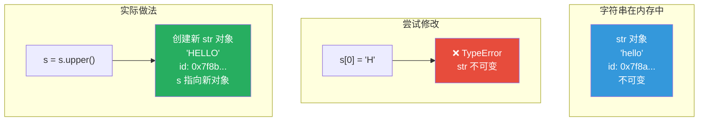
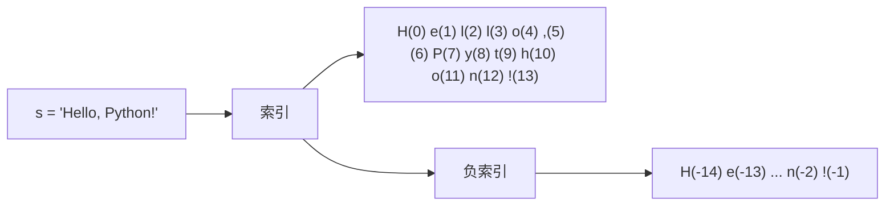

## 4.1 创建方式

```python
 单引号和双引号完全等价（与 Java 不同，Java 只能用双引号）
s1 = 'hello'
s2 = "hello"
print(s1 == s2)  # True

 什么时候用哪个？
 1. 字符串中包含引号时，避免转义
s3 = "it's ok"     # 用双引号包裹含单引号的字符串
s4 = 'he said "hi"'  # 用单引号包裹含双引号的字符串

 三引号 —— 多行字符串和文档字符串
s5 = """这是一段
多行字符串
可以包含换行"""
print(s5)
 输出：
 这是一段
 多行字符串
 可以包含换行

 三引号也常用于函数的文档字符串（docstring）
def add(a, b):
    """计算两个数的和。
    
    Args:
        a: 第一个数
        b: 第二个数
    
    Returns:
        两个数的和
    """
    return a + b
```

## 4.2 字符串本质：不可变序列

```python
s = "hello"
print(s[0])     # 'h'，通过索引访问
print(s[-1])    # 'o'，负索引（从右往左数）

 尝试修改 —— 报错！
 s[0] = 'H'    # TypeError: 'str' object does not support item assignment

 字符串是不可变的，任何"修改"操作都会创建新字符串
s = "Hello" + " World"  # 创建了新字符串 "Hello World"
```



:::info Java 对比
Java 的 `String` 也是不可变的，两者设计理念相同。但 Java 有 `StringBuilder` 用于可变字符串操作，Python 没有等价物（通常用 `list` + `''.join()` 替代）。

```java
// Java
String s = "hello";
s = s.toUpperCase();  // 创建新字符串，和 Python 一样

// Java 的 StringBuilder
StringBuilder sb = new StringBuilder("hello");
sb.append(" world");  // 在原对象上修改
```
:::

## 4.3 索引与切片

```python
s = "Hello, Python!"

 索引
print(s[0])     # 'H'（第一个字符）
print(s[7])     # 'P'
print(s[-1])    # '!'（最后一个字符）
print(s[-2])    # 'n'（倒数第二个）

 切片 [start:stop:step]
print(s[0:5])       # 'Hello'（索引 0 到 4，不包含 5）
print(s[7:13])      # 'Python'
print(s[:5])        # 'Hello'（从头到索引 4）
print(s[7:])        # 'Python!'（从索引 7 到末尾）
print(s[:])         # 'Hello, Python!'（完整复制）
print(s[::2])       # 'Hlo yhn!'（每隔一个字符取）
print(s[::-1])      # '!nohtyP ,olleH'（反转字符串）
print(s[7:13:2])    # 'Pto'（从索引 7 到 12，步长 2）

 负数切片
print(s[-6:])       # 'ython!'（最后 6 个字符）
print(s[-6:-1])     # 'ython'（去掉最后 1 个字符）
```



:::tip 切片的三个参数
`[start:stop:step]`
- **start**：起始索引（默认 0）
- **stop**：结束索引（不包含，默认到末尾）
- **step**：步长（默认 1，负数表示反向）

超出范围的索引不会报错，会被自动截断：
```python
s = "hello"
print(s[0:100])    # 'hello'（不会报错）
print(s[100:])     # ''（空字符串，不会报错）
```
:::

## 4.4 f-string 格式化（Python 3.6+）

```python
name = "Alice"
age = 30
pi = 3.14159265

 基本用法
print(f"我叫{name}，今年{age}岁")
 输出：我叫Alice，今年30岁

 表达式（可以在 {} 中写任意 Python 表达式）
print(f"明年我{age + 1}岁")
print(f"名字长度：{len(name)}")
print(f"{'大写：' + name.upper()}")

 格式说明符 :{format_spec}
print(f"pi = {pi:.2f}")          # pi = 3.14（保留 2 位小数）
print(f"pi = {pi:.6f}")          # pi = 3.141593（保留 6 位小数）
print(f"pi = {pi:.0f}")          # pi = 3（不保留小数）

 宽度和对齐
print(f"{'left':<20}|")          # left                |（左对齐，宽度 20）
print(f"{'right':>20}|")         #                right|（右对齐，宽度 20）
print(f"{'center':^20}|")        #       center        |（居中，宽度 20）

 数字格式化
n = 1234567.89
print(f"{n:,.2f}")               # 1,234,567.89（千分位分隔）
print(f"{n:e}")                  # 1.234568e+06（科学计数法）
print(f"{n:>.2f}")               # 1234567.89（右对齐）

 百分比
ratio = 0.856
print(f"完成率：{ratio:.1%}")    # 完成率：85.6%

 二进制、八进制、十六进制
print(f"{255:b}")                # 11111111（二进制）
print(f"{255:o}")                # 377（八进制）
print(f"{255:x}")                # ff（十六进制）
print(f"{255:X}")                # FF（大写十六进制）

 调试输出（Python 3.8+，= 语法）
x = 42
print(f"{x=}")                   # x=42
print(f"{x * 2 = }")             # x * 2 = 84

 日期格式化
from datetime import datetime
now = datetime.now()
print(f"今天是：{now:%Y-%m-%d %H:%M:%S}")
 输出：今天是：2024-01-15 14:30:00
```

## 4.5 常用方法（分类整理）

```python
s = "  Hello, World! Hello Python!  "

 ─── 大小写转换 ───
print(s.lower())              # '  hello, world! hello python!  '（全小写）
print(s.upper())              # '  HELLO, WORLD! HELLO PYTHON!  '（全大写）
print(s.title())              # '  Hello, World! Hello Python!  '（首字母大写）
print(s.capitalize())         # '  hello, world! hello python!  '（首字母大写，其余小写）
print(s.swapcase())           # '  hELLO, wORLD! hELLO pYTHON!  '（大小写互换）

 ─── 去除空白 ───
print(s.strip())              # 'Hello, World! Hello Python!'（去两端空白）
print(s.lstrip())             # 'Hello, World! Hello Python!  '（去左边空白）
print(s.rstrip())             # '  Hello, World! Hello Python!'（去右边空白）
print("xyxHELLOxyx".strip('x'))  # 'xyxHELLOxyx' → 'yHELLOy'（去指定字符）

 ─── 查找 ───
print(s.find("Hello"))        # 2（返回起始索引，找不到返回 -1）
print(s.rfind("Hello"))       # 16（从右边找）
print(s.index("Hello"))       # 2（找不到抛 ValueError）
print(s.count("Hello"))       # 2（出现次数）
print(s.startswith("  He"))   # True
print(s.endswith("  "))       # True

 ─── 替换 ───
print(s.replace("Hello", "Hi"))     # '  Hi, World! Hi Python!  '
print(s.replace("Hello", "Hi", 1))  # '  Hi, World! Hello Python!  '（只替换 1 次）

 ─── 分割与连接 ───
print("a,b,c".split(","))     # ['a', 'b', 'c']（按逗号分割）
print("a  b  c".split())      # ['a', 'b', 'c']（按空白分割，自动去连续空白）
print("a  b  c".split(" ", 1)) # ['a', ' b  c']（最多分割 1 次）
print("line1\nline2".splitlines())  # ['line1', 'line2']（按换行分割）
print(",".join(["a", "b", "c"]))   # 'a,b,c'（用逗号连接列表）
print("".join(["a", "b", "c"]))    # 'abc'

 ─── 判断字符类型 ───
print("abc".isalpha())        # True（全是字母）
print("123".isdigit())        # True（全是数字）
print("abc123".isalnum())     # True（全是字母或数字）
print("   ".isspace())        # True（全是空白）
print("Hello".isupper())      # False
print("HELLO".isupper())      # True
print("hello".islower())      # True
print("Hello World".istitle())  # True（每个单词首字母大写）

 ─── 填充与对齐 ───
print("hello".center(20, "-"))   # '-------hello--------'（居中，用 - 填充）
print("hello".ljust(20, "-"))    # 'hello---------------'（左对齐）
print("hello".rjust(20, "-"))    # '---------------hello'（右对齐）
print("42".zfill(5))             # '00042'（左侧用 0 填充到指定宽度）

 ─── 其他 ───
print(len(s))                 # 32（字符串长度）
print("Hello".encode('utf-8'))  # b'Hello'（编码为字节）
print(b'Hello'.decode('utf-8'))  # 'Hello'（从字节解码）
```

## 4.6 转义字符

```python
 常用转义字符
print("Hello\nWorld")     # 换行
print("Hello\tWorld")     # 制表符
print("Hello\\World")     # 反斜杠 \
print("He said \"hi\"")   # 双引号
print('He said \'hi\'')   # 单引号

 原始字符串 r"" —— 不处理转义字符
print(r"C:\Users\name")   # C:\Users\name（\ 不会被转义）
print(r"\n\t")            # \n\t（不会换行和制表）

 常用场景：正则表达式
import re
 不用 raw string: pattern = "\\d+\\.\\d+"（需要双重转义）
 用 raw string:    pattern = r"\d+\.\d+"（清晰易读）
```

## 4.7 字符串不可变性的证明和影响

```python
 证明不可变性
s = "hello"
print(id(s))      # 4345...
s = s + " world"
print(id(s))      # 不同的地址！创建了新对象

 不可变性带来的影响
 ❌ 不能原地修改
 s[0] = "H"      # TypeError

 ✅ 创建新字符串
s = "H" + s[1:]   # "Hello world"

 ❌ 在循环中拼接字符串效率低（每次都创建新对象）
result = ""
for i in range(10000):
    result += str(i)    # 慢！创建了 10000 个中间字符串

 ✅ 用列表 + join
parts = []
for i in range(10000):
    parts.append(str(i))
result = "".join(parts)  # 快！只在最后创建一个字符串
```

## 4.8 字符串拼接性能

```python
import timeit

 方法一：+ 拼接（慢）
def concat_plus():
    s = ""
    for i in range(10000):
        s += str(i)
    return s

 方法二：join（快）
def concat_join():
    return "".join(str(i) for i in range(10000))

 方法三：f-string 拼接（中等）
def concat_fstring():
    return "".join(f"{i}" for i in range(10000))

 方法四：StringIO（适合流式拼接）
from io import StringIO
def concat_stringio():
    buf = StringIO()
    for i in range(10000):
        buf.write(str(i))
    return buf.getvalue()

print(timeit.timeit(concat_plus, number=100))
 约 0.4s

print(timeit.timeit(concat_join, number=100))
 约 0.15s（快 2-3 倍）

print(timeit.timeit(concat_fstring, number=100))
 约 0.2s

print(timeit.timeit(concat_stringio, number=100))
 约 0.15s
```

:::tip 为什么 join 最快？
- `+` 拼接：每次都创建新字符串对象 + 复制旧内容，时间复杂度 O(n²)
- `join`：先计算总长度，分配一次内存，然后逐个复制，时间复杂度 O(n)

CPython 对 `+=` 有一个小优化（当引用计数为 1 时会尝试原地扩展），但这不是保证行为，不应该依赖。

**结论：拼接大量字符串时，始终用 `''.join()`。**
:::

## 4.9 Java vs Python 字符串对比

| 特性 | Java | Python |
|------|------|--------|
| 创建 | `"hello"` 或 `new String()` | `'hello'` 或 `"hello"` |
| 不可变 | ✅ String 不可变 | ✅ str 不可变 |
| 可变字符串 | `StringBuilder` | 无直接等价物，用 `list` + `join()` |
| 多行字符串 | `"""..."""` 或 `"...\n..."` | `"""..."""` |
| 格式化 | `String.format()` 或 `MessageFormat` | f-string（更简洁） |
| 比较 | `.equals()`（`==` 比较引用） | `==` 比较值（`is` 比较引用） |
| 字符访问 | `s.charAt(0)` | `s[0]` |
| 子串 | `s.substring(1, 5)` | `s[1:5]` |
| 分割 | `s.split(",")` | `s.split(",")` |
| 大小写 | `s.toUpperCase()` | `s.upper()` |
| 包含 | `s.contains("hi")` | `"hi" in s` |
| 去空白 | `s.trim()` | `s.strip()` |

:::warning 字符串比较的大坑
Java 中 `==` 比较的是引用，`equals()` 比较值。Python 中 `==` 比较值，`is` 比较引用。

```java
// Java
new String("hello") == "hello"     // false（不同对象）
new String("hello").equals("hello") // true
```

```python
 Python
"hello" == "hello"   # True（值相等）
"hello" is "hello"   # True（小字符串被缓存，但不要依赖 is 比较字符串！）
```
:::

## 📝 练习题

**1. 从字符串 `"Hello, World! Welcome to Python."` 中提取 `"World"` 和 `"Python"`。**


**参考答案**

```python
s = "Hello, World! Welcome to Python."
print(s[7:12])       # 'World'
print(s[-7:-1])      # 'Python' 或 s[-7:] 如果要包含点
 更准确的方式：
print(s[-7:-1])      # 'Python'
```


**2. 反转字符串 `"abcdef"`，至少写出三种方法。**


**参考答案**

```python
s = "abcdef"
 方法一：切片
print(s[::-1])           # 'fedcba'

 方法二：reversed
print("".join(reversed(s)))  # 'fedcba'

 方法三：循环
result = ""
for ch in s:
    result = ch + result
print(result)            # 'fedcba'
```


**3. 判断一个字符串是否是回文（正读反读都一样）。**


**参考答案**

```python
def is_palindrome(s):
    s = s.lower().replace(" ", "")  # 去除空格并转小写
    return s == s[::-1]

print(is_palindrome("racecar"))      # True
print(is_palindrome("A man a plan a canal Panama"))  # True
print(is_palindrome("hello"))        # False
```


**4. 将字符串 `"hello_world_python"` 转换为驼峰命名 `"helloWorldPython"`。**


**参考答案**

```python
s = "hello_world_python"
parts = s.split("_")
result = parts[0] + "".join(word.capitalize() for word in parts[1:])
print(result)  # helloWorldPython
```


**5. 使用 f-string 格式化输出一个商品价格表，列对齐。**


**参考答案**

```python
items = [("苹果", 5, 3.5), ("香蕉", 10, 2.8), ("橙子", 8, 4.2)]
print(f"{'商品':<8}{'数量':>6}{'单价':>8}{'总价':>10}")
print("-" * 32)
for name, qty, price in items:
    total = qty * price
    print(f"{name:<8}{qty:>6}{price:>8.2f}{total:>10.2f}")
 商品        数量      单价       总价
 --------------------------------
 苹果          5     3.50     17.50
 香蕉         10     2.80     28.00
 橙子          8     4.20     33.60
```


**6. 统计字符串中每个字符出现的次数，返回出现最多的字符。**


**参考答案**

```python
from collections import Counter

s = "hello world"
counter = Counter(s.replace(" ", ""))
print(counter)                    # Counter({'l': 3, 'o': 2, 'h': 1, 'e': 1, 'w': 1, 'r': 1, 'd': 1})
print(counter.most_common(1))     # [('l', 3)]
print(counter.most_common(1)[0][0])  # 'l'
```


---