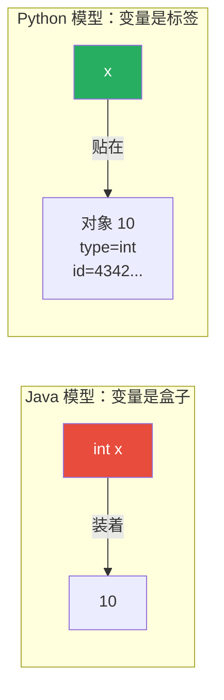
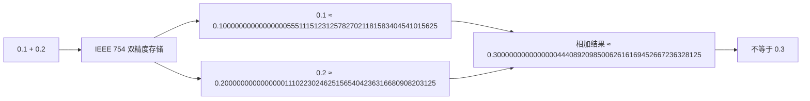

## 2.1 什么是变量？Python 中变量本质是什么？

在 Java 中，你可以把变量想象成一个**盒子**，类型决定了盒子的形状（int 盒子只能装整数，String 盒子只能装字符串）：

```java
int x = 10;      // 创建一个 int 类型的盒子，里面放 10
x = 20;          // 把盒子里面的东西换成 20
x = "hello";     // ❌ 编译错误！int 盒子不能装字符串
```

在 Python 中，变量不是盒子，而是**标签（名字）贴在对象上**：

```python
x = 10           # 创建整数对象 10，把标签 "x" 贴上去
print(id(x))     # 输出对象的内存地址，例如 4342938352
print(type(x))   # 输出：<class 'int'>

x = 20           # 创建整数对象 20，把标签 "x" 转移到 20 上
print(id(x))     # 输出不同的地址，例如 4342938688

x = "hello"      # 创建字符串对象 "hello"，把标签 "x" 转移到字符串上
print(type(x))   # 输出：<class 'str'>
```



:::tip 这个区别非常重要！
在 Python 中，`a = b` 不会复制对象，只是让 `a` 和 `b` 指向同一个对象：

```python
a = [1, 2, 3]
b = a            # b 和 a 指向同一个列表对象
b.append(4)      # 修改 b
print(a)         # 输出：[1, 2, 3, 4]  ← a 也变了！
print(a is b)    # 输出：True  ← 它们是同一个对象
```

这在 Java 中也类似：`int[] a = {1,2,3}; int[] b = a;` 两者指向同一个数组。
但 Java 的基本类型（int, double 等）是值传递，Python 没有"基本类型"这个概念，一切皆对象。
:::

## 2.2 动态类型 vs 静态类型

```python
 Python：动态类型 —— 变量可以在运行时改变类型
x = 42               # x 现在是 int
print(type(x))       # <class 'int'>

x = "hello"          # x 现在是 str，完全合法
print(type(x))       # <class 'str'>

x = [1, 2, 3]        # x 现在是 list
print(type(x))       # <class 'list'>

 type() 函数返回对象的类型
 isinstance() 检查是否是某个类型（推荐，支持继承）
print(isinstance(42, int))        # True
print(isinstance(42, (int, str))) # True，42 是 int 或 str
```

:::info Java 对比
```java
// Java：静态类型 —— 变量类型在编译时确定，运行时不能改变
int x = 42;          // x 是 int
x = "hello";         // ❌ 编译错误：不兼容的类型

// Java 的 instanceof
if (x instanceof Integer) { ... }
```
:::

## 2.3 整数 int：无限精度

Python 的整数没有大小限制（不会像 Java 的 `int` 溢出）：

```python
 Java 中：
// int x = 2147483647;        // int 最大值（约 21 亿）
// int y = x + 1;             // 溢出！变成 -2147483648
// long z = 9999999999999L;   // 需要用 long

 Python 中：想多大就多大
x = 2147483647
print(x + 1)                  # 输出：2147483648，不会溢出

x = 999999999999999999999999999999999999999999999
print(x * x)                  # 照样算，不会溢出
 输出：999999999999999999999999999999999999999999998000000000000000000000000000000000000000000001

print(type(x))                # 还是 <class 'int'>，不会变成 long
```

:::tip 底层原理
CPython 中，小整数（通常 -5 到 256）会被**预分配并缓存**，所有指向这些值的变量实际上指向同一个对象：

```python
a = 100
b = 100
print(a is b)    # True，指向同一个缓存对象

a = 257
b = 257
print(a is b)    # False（CPython 实现细节，不建议依赖）
```

大整数使用变长数组存储，类似 Java 的 `BigInteger`，但 Python **自动处理**，你完全不需要关心。

Java 开发者可以这样理解：Python 的 `int` ≈ Java 的 `BigInteger`，但语法和性能像 `int`。
:::

## 2.4 浮点数 float：IEEE 754 与精度陷阱

```python
 浮点数使用 IEEE 754 双精度（64 位）
 和 Java 的 double 完全一样

print(0.1 + 0.2)
 输出：0.30000000000000004
 不是 0.3！这是 IEEE 754 的固有问题

print(0.1 + 0.2 == 0.3)
 输出：False

 正确的比较方式：使用误差容忍
print(abs((0.1 + 0.2) - 0.3) < 1e-9)
 输出：True

 或者使用 math.isclose（Python 3.5+）
import math
print(math.isclose(0.1 + 0.2, 0.3))
 输出：True
```



:::warning 为什么会这样？
计算机用二进制存储小数。0.1 在二进制中是一个无限循环小数（类似十进制中的 1/3 = 0.333...），所以存储时会被截断。这是所有使用 IEEE 754 的语言都有的问题，包括 Java：

```java
System.out.println(0.1 + 0.2);   // 0.30000000000000004
System.out.println(0.1 + 0.2 == 0.3);  // false
```

如果需要精确计算，使用 `decimal` 模块：

```python
from decimal import Decimal, getcontext
getcontext().prec = 28  # 设置精度

a = Decimal('0.1')
b = Decimal('0.2')
print(a + b)            # 输出：0.3
print(a + b == Decimal('0.3'))  # True

 注意：要用字符串初始化，不能用浮点数
 Decimal(0.1) 已经丢失精度了！
```
:::

## 2.5 布尔 bool：True/False 与 falsy 值

```python
 bool 是 int 的子类
print(isinstance(True, int))   # True
print(True + 1)                # 2
print(False + 1)               # 1
```

**Python 的 falsy 值（在 if 判断中等价于 False 的值）：**

```python
 以下是所有 falsy 值（记住这些！）
falsy_values = [
    False,         # 布尔 False
    None,          # None 空值
    0,             # 整数零
    0.0,           # 浮点零
    0j,            # 复数零
    '',            # 空字符串
    (),            # 空元组
    [],            # 空列表
    {},            # 空字典
    set(),         # 空集合
    range(0),      # 空 range
]

for val in falsy_values:
    if not val:
        print(f"{repr(val):>10} → falsy")

 输出：
      False → falsy
       None → falsy
          0 → falsy
        0.0 → falsy
          0j → falsy
         '' → falsy
        () → falsy
        [] → falsy
        {} → falsy
     set() → falsy
   range(0) → falsy
```

:::warning 注意区分 falsy 和 False
`bool(0)` 是 `False`，但 `0` 本身不是 `False`，它们是不同的对象：
```python
print(0 == False)    # True（值相等）
print(0 is False)    # False（不是同一个对象）
print(type(0))       # <class 'int'>
print(type(False))   # <class 'bool'>
```
:::

## 2.6 None 类型

`None` 是 Python 中的"空值"，相当于 Java 的 `null`。

```python
 None 表示"没有值"
x = None
print(x)             # 输出：None
print(type(x))       # 输出：<class 'NoneType'>

 is vs == 的区别
print(None == None)  # True
print(None is None)  # True（推荐这种写法）

 判断变量是否为 None（用 is，不要用 ==）
def greet(name=None):
    if name is None:  # ✅ 推荐
        print("Hello, World!")
    # if name == None:  # ⚠️ 不推荐，某些场景可能有坑
    #     print("Hello, World!")

greet()              # 输出：Hello, World!
greet("Alice")       # 输出：Hello, Alice!
```

:::tip 为什么判断 None 要用 `is` 而不是 `==`？
- `is` 比较的是**身份**（是否是同一个对象），None 在 Python 中是单例，全局只有一个 None 对象
- `==` 比较的是**值**，可以被 `__eq__` 方法重载

```python
class Tricky:
    def __eq__(self, other):
        return True  # 所有比较都返回 True

t = Tricky()
print(t == None)    # True！（因为 __eq__ 返回 True）
print(t is None)    # False（t 不是 None 对象）
```
:::

## 2.7 类型转换

```python
 int() —— 转整数
print(int("42"))        # 42
print(int(3.14))        # 3（截断，不是四舍五入）
print(int(True))        # 1
print(int(False))       # 0
 print(int("hello"))   # ❌ ValueError: invalid literal for int()

 float() —— 转浮点数
print(float("3.14"))    # 3.14
print(float(42))        # 42.0

 str() —— 转字符串
print(str(42))          # "42"
print(str(3.14))        # "3.14"
print(str(True))        # "True"
print(str(None))        # "None"

 bool() —— 转布尔值
print(bool(""))         # False（空字符串）
print(bool("hello"))    # True
print(bool(0))          # False
print(bool(42))         # True

 进制转换
print(bin(255))         # '0b11111111'（二进制字符串）
print(oct(255))         # '0o377'（八进制字符串）
print(hex(255))         # '0xff'（十六进制字符串）
print(int('ff', 16))    # 255（从十六进制字符串转整数）
```

## 2.8 Java vs Python 类型系统对比

| 特性 | Java | Python |
|------|------|--------|
| 类型系统 | 静态类型 | 动态类型 |
| 变量声明 | `int x = 10;` | `x = 10` |
| 类型检查 | 编译时 | 运行时 |
| 整数大小 | int 32位，long 64位 | 无限精度 |
| 浮点数 | float 32位，double 64位 | float 64位（等同于 double） |
| 空值 | `null` | `None` |
| 布尔 | `boolean`（基本类型） | `bool`（int 子类） |
| 类型转换 | 强制转换 `(int)x` | 函数 `int(x)` |
| 字符 | `char`（基本类型） | 无 char 类型，单字符就是长度为 1 的字符串 |
| 类型注解 | 原生支持 | 可选的类型提示（不影响运行时） |

## 📝 练习题

**1. 解释以下代码的输出：**

```python
a = [1, 2, 3]
b = a
b[0] = 99
print(a)
```


**参考答案**

输出：`[99, 2, 3]`

因为 `b = a` 让 `b` 和 `a` 指向同一个列表对象。修改 `b` 就是修改同一个列表。


**2. 为什么 `0.1 + 0.2 != 0.3`？如何正确比较两个浮点数？**


**参考答案**

原因：IEEE 754 双精度浮点数无法精确表示 0.1 和 0.2，存储时有微小误差，累加后不等于 0.3。

正确比较方式：
```python
import math
math.isclose(0.1 + 0.2, 0.3)  # True
```
或 `abs(a - b) < 1e-9`


**3. 列出 Python 中所有 falsy 值。**


**参考答案**

`False`, `None`, `0`, `0.0`, `0j`, `""`（空字符串）, `()`（空元组）, `[]`（空列表）, `{}`（空字典）, `set()`（空集合）, `range(0)`（空 range）。


**4. 以下代码输出什么？为什么？**

```python
a = 256
b = 256
print(a is b)

a = 257
b = 257
print(a is b)
```


**参考答案**

第一个 `True`，第二个可能是 `False`。

CPython 缓存了 -5 到 256 的小整数，所以 `a is b` 对 256 返回 True。257 不在缓存范围内，但在交互式环境中 Python 可能对同一行代码做优化，所以结果可能因执行环境而异。**不要依赖 `is` 比较数值，始终用 `==`。**


**5. 将字符串 `"3.14"` 转换为整数，写出两种方法。**


**参考答案**

```python
 方法一：先转 float 再转 int
n = int(float("3.14"))    # 3

 方法二：用 split 取整数部分
n = int("3.14".split(".")[0])  # 3
```


**6. （思考题）Python 中 `bool` 是 `int` 的子类，这意味着什么？有什么实际影响？**


**参考答案**

意味着 `True` 和 `False` 可以参与整数运算：`True + True = 2`，`sum([True, False, True]) = 2`。

实际应用：统计列表中满足条件的元素个数可以写 `sum(1 for x in data if condition)`。

潜在坑：`[True, False] + [1, 0]` 结果是 `[True, False, 1, 0]`，而不是 `[2, 0]`。


---