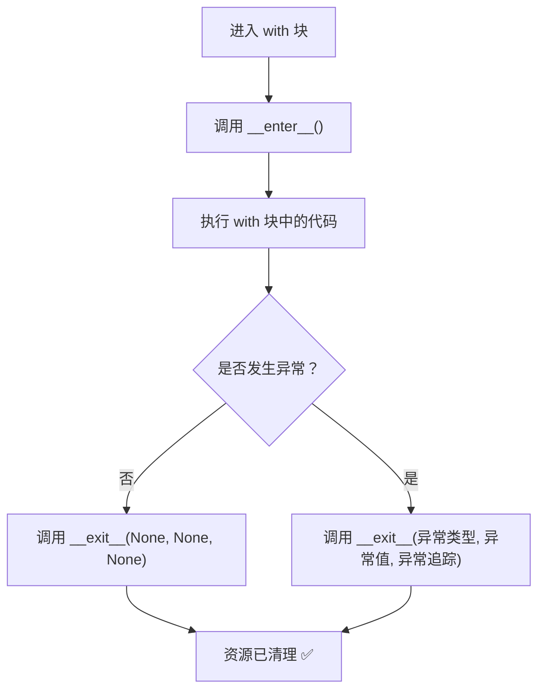

## 4.1 为什么需要上下文管理器？

**场景：** 你打开了一个文件，中间发生了异常，文件没有被关闭——**资源泄漏**！

```python
 ===== 危险写法 =====
f = open("data.txt")
data = f.read()
result = 1 / 0  # 💥 异常！文件没关闭！
f.close()        # 这行永远执行不到

 ===== 传统写法 =====
f = open("data.txt")
try:
    data = f.read()
    result = 1 / 0
finally:
    f.close()    # ✅ finally 确保文件关闭

 ===== Python 推荐写法 =====
with open("data.txt") as f:  # ✅ 自动关闭，代码更简洁
    data = f.read()
    result = 1 / 0          # 即使异常，文件也会被关闭
```



## 4.2 `with` 语句基本用法

```python
 文件操作
with open("input.txt", "r") as f_in, open("output.txt", "w") as f_out:
    content = f_in.read()
    f_out.write(content.upper())

 锁操作
import threading
lock = threading.Lock()
with lock:
    # 这段代码同一时间只有一个线程能执行
    print("安全操作")

 数据库连接（常见 ORM 的用法）
 with database.transaction():
     user.save()
     order.save()
     # 两个操作要么都成功，要么都回滚
```

## 4.3 自定义上下文管理器

```python
class Timer:
    """计时上下文管理器"""

    def __init__(self, name=""):
        self.name = name
        self.elapsed = 0

    def __enter__(self):
        import time
        self.start = time.perf_counter()
        return self  # 返回值赋给 as 后面的变量

    def __exit__(self, exc_type, exc_val, exc_tb):
        import time
        self.elapsed = time.perf_counter() - self.start
        print(f"⏱️ {self.name} 耗时 {self.elapsed:.4f}s")
        return False  # 不抑制异常（让异常继续传播）

with Timer("数据处理") as t:
    import time
    time.sleep(0.5)
 ⏱️ 数据处理 耗时 0.5001s
print(t.elapsed)  # 0.5001...
```

## 4.4 `__exit__` 的参数与异常处理

```python
class SafeDivider:
    """安全的除法上下文管理器"""

    def __enter__(self):
        print("开始计算")
        return self

    def __exit__(self, exc_type, exc_val, exc_tb):
        if exc_type is None:
            print("计算成功完成")
        else:
            print(f"捕获到异常: {exc_type.__name__}: {exc_val}")
            return True  # True = 抑制异常（不再向外抛出）

with SafeDivider():
    result = 10 / 2
    print(f"结果: {result}")
 开始计算
 结果: 5.0
 计算成功完成

print("---")

with SafeDivider():
    result = 10 / 0
    print("这行不会执行")
 开始计算
 捕获到异常: ZeroDivisionError: division by zero
 异常被抑制，程序继续运行
print("程序继续...")
```

:::warning `__exit__` 返回值
- `return True` → 抑制异常，程序继续执行
- `return False`（或不 return）→ 异常继续传播
- **不要滥用 `return True`**——大多数情况应该让异常传播
:::

## 4.5 contextlib 标准库

### `@contextmanager` —— 用生成器写上下文管理器

```python
from contextlib import contextmanager
import time

@contextmanager
def timer(name):
    """用生成器实现计时器（比类写法更简洁）"""
    start = time.perf_counter()
    print(f"[{name}] 开始")
    try:
        yield  # yield 之前 = __enter__，yield 之后 = __exit__
    finally:
        elapsed = time.perf_counter() - start
        print(f"[{name}] 结束，耗时 {elapsed:.4f}s")

with timer("数据处理"):
    time.sleep(0.3)
 [数据处理] 开始
 [数据处理] 结束，耗时 0.3001s
```

```python
@contextmanager
def database_connection(host, port):
    """模拟数据库连接"""
    conn = f"Connection({host}:{port})"
    print(f"连接 {host}:{port}...")
    try:
        yield conn  # 把连接对象传给 as 后面的变量
    finally:
        print(f"关闭连接")
        conn = None

with database_connection("localhost", 5432) as db:
    print(f"使用连接: {db}")
 连接 localhost:5432...
 使用连接: Connection(localhost:5432)
 关闭连接
```

### `suppress` —— 忽略指定异常

```python
from contextlib import suppress
import os

 旧写法
try:
    os.remove("temp.txt")
except FileNotFoundError:
    pass

 新写法
with suppress(FileNotFoundError):
    os.remove("temp.txt")
```

### `redirect_stdout` / `redirect_stderr`

```python
from contextlib import redirect_stdout, redirect_stdout
import io

 捕获 print 输出
output = io.StringIO()
with redirect_stdout(output):
    print("Hello")
    print("World")

print(output.getvalue())
 Hello
 World
```

### `closing` —— 确保调用 `close()` 方法

```python
from contextlib import closing
import urllib.request

 确保 response 被 close()
with closing(urllib.request.urlopen("https://example.com")) as response:
    data = response.read()
```

## 4.6 嵌套 `with` 和 `ExitStack`

```python
 ===== 嵌套 with =====
with open("a.txt") as f1:
    with open("b.txt") as f2:
        content = f1.read() + f2.read()

 Python 支持同时写多个（Python 3.1+）
with open("a.txt") as f1, open("b.txt") as f2:
    content = f1.read() + f2.read()
```

```python
from contextlib import ExitStack

 ExitStack：动态管理多个上下文
def process_files(filepaths):
    """动态打开任意数量的文件"""
    with ExitStack() as stack:
        files = [stack.enter_context(open(fp)) for fp in filepaths]
        # 所有文件在 with 块结束时自动关闭
        return sum(len(f.read()) for f in files)

total = process_files(["a.txt", "b.txt", "c.txt"])
print(f"总字符数: {total}")
```

:::tip ExitStack 的优势
- 文件数量**运行时才能确定**时特别有用
- 可以**条件性**地进入上下文
- 可以**任意顺序**管理资源
:::

## 4.7 实战案例

### 数据库连接池

```python
import queue
import threading
from contextlib import contextmanager

class ConnectionPool:
    """简易数据库连接池"""
    def __init__(self, max_size=5):
        self._pool = queue.Queue(max_size)
        self._lock = threading.Lock()

    @contextmanager
    def get_connection(self):
        """获取连接的上下文管理器"""
        conn = self._pool.get()  # 从池中取出
        try:
            yield conn           # 使用连接
        finally:
            self._pool.put(conn)  # 归还到池中

    def create_pool(self):
        """初始化连接池"""
        for i in range(5):
            self._pool.put(f"Connection-{i}")

pool = ConnectionPool()
pool.create_pool()

with pool.get_connection() as conn:
    print(f"使用: {conn}")
 连接自动归还到池中
```

### 临时文件

```python
import tempfile
import os

 tempfile 自动管理临时文件的生命周期
with tempfile.NamedTemporaryFile(mode='w', delete=True, suffix='.txt') as tmp:
    tmp.write("临时内容")
    print(f"临时文件: {tmp.name}")  # /tmp/tmpXXXXXX.txt
    # with 块结束后，文件自动删除

print(os.path.exists(tmp.name))  # False（已删除）
```

### 计时器

```python
from contextlib import contextmanager
import time

@contextmanager
def benchmark(description=""):
    """性能测试计时器"""
    start = time.perf_counter()
    yield
    elapsed = time.perf_counter() - start
    print(f"📊 {description}: {elapsed:.4f}s")

with benchmark("列表创建"):
    lst = list(range(1_000_000))
 📊 列表创建: 0.0312s

with benchmark("列表排序"):
    lst.sort()
 📊 列表排序: 0.4521s
```

## 4.8 Java try-with-resources 对比

```java
// Java try-with-resources
try (BufferedReader br = new BufferedReader(new FileReader("file.txt"));
     BufferedWriter bw = new BufferedWriter(new FileWriter("out.txt"))) {
    String line;
    while ((line = br.readLine()) != null) {
        bw.write(line);
    }
} // br 和 bw 自动关闭
```

```python
 Python with 语句
with open("file.txt") as f_in, open("out.txt", "w") as f_out:
    for line in f_in:
        f_out.write(line)
 f_in 和 f_out 自动关闭
```

| 特性 | Java try-with-resources | Python with |
|------|------------------------|-------------|
| **资源要求** | 必须实现 `AutoCloseable` | 必须实现 `__enter__/__exit__` |
| **异常抑制** | 自动添加 suppressed 异常 | `__exit__` 返回 `True` |
| **多个资源** | `try (r1; r2)` | `with r1, r2:` |
| **动态数量** | 需要额外处理 | `ExitStack` |
| **简化写法** | 无 | `@contextmanager` |

:::tip Java 对比总结
Python 的 `with` 语句 ≈ Java 的 `try-with-resources`，但 Python 更灵活：
1. `@contextmanager` 让你用生成器快速定义上下文管理器
2. `ExitStack` 支持动态数量的资源
3. `suppress` 等工具函数简化了常见模式
:::

## 4.9 练习题

**第 1 题：** 实现一个 `IndentPrinter` 上下文管理器，在 `with` 块中所有 `print` 输出都自动缩进。

**第 2 题：** 用 `@contextmanager` 实现一个临时修改环境变量的上下文管理器。

**第 3 题：** 实现一个 `suppress_timeout` 上下文管理器，在指定时间内没完成就取消操作。

**第 4 题：** 用 `ExitStack` 实现一个可以同时打开任意数量文件的函数。

**第 5 题：** 实现一个 `@contextmanager` 版本的事务管理器（commit/rollback）。

**参考答案：**


**参考答案**

```python
 第 1 题
import sys
from contextlib import contextmanager

@contextmanager
def indent(prefix="  "):
    """缩进 print 输出"""
    original_write = sys.stdout.write

    def indented_write(text):
        if text.endswith("\n"):
            original_write(prefix + text)
        elif text:
            original_write(prefix + text)

    sys.stdout.write = indented_write
    try:
        yield
    finally:
        sys.stdout.write = original_write

print("无缩进")
with indent(">> "):
    print("有缩进 1")
    print("有缩进 2")
print("无缩进")

 第 2 题
import os
from contextlib import contextmanager

@contextmanager
def temp_env(**kwargs):
    """临时修改环境变量"""
    old_values = {}
    for key, value in kwargs.items():
        old_values[key] = os.environ.get(key)
        os.environ[key] = str(value)
    try:
        yield
    finally:
        for key, old_value in old_values.items():
            if old_value is None:
                os.environ.pop(key, None)
            else:
                os.environ[key] = old_value

print(os.environ.get("MY_VAR"))  # None
with temp_env(MY_VAR="hello"):
    print(os.environ.get("MY_VAR"))  # hello
print(os.environ.get("MY_VAR"))  # None

 第 3 题
import signal
from contextlib import contextmanager

class TimeoutError(Exception):
    pass

@contextmanager
def time_limit(seconds):
    """超时上下文管理器（仅 Unix）"""
    def handler(signum, frame):
        raise TimeoutError(f"操作超时（{seconds}s）")

    old_handler = signal.signal(signal.SIGALRM, handler)
    signal.alarm(seconds)
    try:
        yield
    finally:
        signal.alarm(0)
        signal.signal(signal.SIGALRM, old_handler)

try:
    with time_limit(2):
        import time
        time.sleep(10)
except TimeoutError as e:
    print(e)  # 操作超时（2s）

 第 4 题
from contextlib import ExitStack

def open_many(filepaths, mode='r'):
    with ExitStack() as stack:
        files = [stack.enter_context(open(fp, mode)) for fp in filepaths]
        # 在这里使用 files...
        for f in files:
            print(f"打开了 {f.name}")
        yield files  # 注意：这里用了 yield，实际使用需要配合 @contextmanager

 第 5 题
from contextlib import contextmanager

class TransactionError(Exception):
    pass

@contextmanager
def transaction():
    """简易事务管理器"""
    operations = []
    try:
        yield operations  # 把操作列表传给 with 块
        # 没有异常 → 提交
        print(f"✅ 提交 {len(operations)} 个操作")
    except Exception as e:
        # 有异常 → 回滚
        print(f"❌ 回滚，原因: {e}")
        operations.clear()
        raise

with transaction() as tx:
    tx.append("INSERT INTO users ...")
    tx.append("UPDATE orders ...")
    # 如果这里抛异常，所有操作会被回滚
```


---