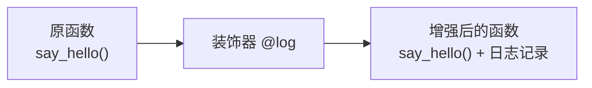
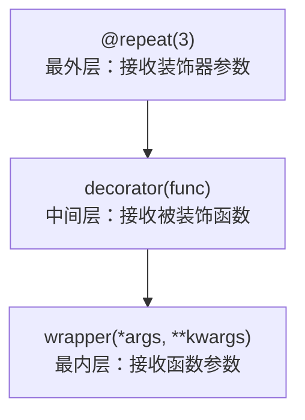

## 2.1 什么是装饰器？

**装饰器**的本质是一个函数，它**接收一个函数，返回一个增强后的新函数**——不修改原函数代码的前提下，给函数增加额外功能。

:::tip 生活类比

想象你买了一台新手机（原函数），然后给它套上手机壳（装饰器）：

- 手机壳**保护**了手机（增加日志、权限检查）
- 手机壳**不影响**手机的正常使用（不改变原函数逻辑）
- 你可以**叠加**多个手机壳（装饰器可以叠加）
- 你可以随时**取下**手机壳（装饰器可以移除）
:::



## 2.2 高阶函数基础

装饰器的基石有两个概念：**函数是一等公民** 和 **闭包**。

```python
 ===== 1. 函数是一等公民 =====
 函数可以赋值给变量
def greet(name):
    return f"Hello, {name}!"

say = greet  # 函数赋值给变量
print(say("Python"))  # Hello, Python!

 函数可以作为参数
def apply(func, value):
    return func(value)

print(apply(greet, "World"))  # Hello, World!

 函数可以作为返回值
def get_greeter(greeting):
    def greeter(name):
        return f"{greeting}, {name}!"
    return greeter  # 返回内部函数

hello = get_greeter("Hello")
hi = get_greeter("Hi")
print(hello("Python"))  # Hello, Python!
print(hi("Java"))       # Hi, Java!
```

## 2.3 闭包回顾

```python
def make_counter():
    """创建一个计数器工厂"""
    count = 0  # 自由变量——被内部函数引用的外部变量

    def counter():
        nonlocal count  # 声明 count 不是局部变量
        count += 1
        return count

    return counter  # 返回闭包

c = make_counter()
print(c())  # 1
print(c())  # 2
print(c())  # 3
 count 变量在 make_counter 返回后仍然存活！
 这就是闭包：内部函数"记住"了外部函数的变量
```

:::tip 闭包三要素
1. **嵌套函数**：函数内部定义函数
2. **引用外部变量**：内部函数引用外部函数的变量
3. **返回内部函数**：外部函数返回内部函数
:::

## 2.4 基本装饰器——从零推导

```python
 ===== 第一步：手动包装 =====
def say_hello():
    print("Hello!")

def log_wrapper(func):
    """手动包装"""
    def wrapper():
        print(f"[LOG] 调用 {func.__name__}")
        func()
        print(f"[LOG] {func.__name__} 完成")
    return wrapper

 手动装饰
say_hello = log_wrapper(say_hello)
say_hello()
 [LOG] 调用 say_hello
 Hello!
 [LOG] say_hello 完成
```

```python
 ===== 第二步：使用 @ 语法糖 =====
def log(func):
    """装饰器函数"""
    def wrapper():
        print(f"[LOG] 调用 {func.__name__}")
        func()
        print(f"[LOG] {func.__name__} 完成")
    return wrapper

@log  # 等价于 say_hello = log(say_hello)
def say_hello():
    print("Hello!")

say_hello()
 [LOG] 调用 say_hello
 Hello!
 [LOG] say_hello 完成
```

```python
 ===== 第三步：支持参数和返回值 =====
import functools

def log(func):
    @functools.wraps(func)  # 保留原函数的元信息
    def wrapper(*args, **kwargs):
        print(f"[LOG] 调用 {func.__name__}，参数: args={args}, kwargs={kwargs}")
        result = func(*args, **kwargs)
        print(f"[LOG] {func.__name__} 返回: {result}")
        return result
    return wrapper

@log
def add(a, b):
    return a + b

print(add(3, 5))
 [LOG] 调用 add，参数: args=(3, 5), kwargs={}
 [LOG] add 返回: 8
 8
```

## 2.5 `@functools.wraps` 为什么必须用

```python
import functools

def without_wraps(func):
    def wrapper(*args, **kwargs):
        return func(*args, **kwargs)
    return wrapper

def with_wraps(func):
    @functools.wraps(func)
    def wrapper(*args, **kwargs):
        return func(*args, **kwargs)
    return wrapper

@without_wraps
def func_a():
    """这是 func_a 的文档"""
    pass

@with_wraps
def func_b():
    """这是 func_b 的文档"""
    pass

print(func_a.__name__)   # wrapper  ← 丢失了原函数名！
print(func_a.__doc__)    # None     ← 丢失了文档！
print(func_b.__name__)   # func_b   ← 保留了！
print(func_b.__doc__)    # 这是 func_b 的文档  ← 保留了！
```

:::warning 不用 `@wraps` 的后果
- `__name__` 变成 `wrapper`，调试时完全不知道调的是哪个函数
- `__doc__` 丢失，`help()` 看不到文档
- 可能影响序列化和依赖函数名的框架
:::

## 2.6 带参数的装饰器

带参数的装饰器需要**三层嵌套**：



```python
import functools

def repeat(n):
    """重复执行 n 次的装饰器"""
    def decorator(func):
        @functools.wraps(func)
        def wrapper(*args, **kwargs):
            results = []
            for _ in range(n):
                result = func(*args, **kwargs)
                results.append(result)
            return results
        return wrapper
    return decorator

@repeat(3)
def greet(name):
    return f"Hello, {name}!"

print(greet("Python"))
 ['Hello, Python!', 'Hello, Python!', 'Hello, Python!']

 等价于：greet = repeat(3)(greet)
```

## 2.7 类装饰器

类装饰器使用 `__call__` 方法让类实例可以像函数一样调用：

```python
import functools

class CountCalls:
    """调用计数装饰器"""
    def __init__(self, func):
        functools.update_wrapper(self, func)
        self.func = func
        self.count = 0

    def __call__(self, *args, **kwargs):
        self.count += 1
        print(f"第 {self.count} 次调用 {self.func.__name__}")
        return self.func(*args, **kwargs)

@CountCalls
def say_hello(name):
    return f"Hello, {name}!"

print(say_hello("Python"))
 第 1 次调用 say_hello
 Hello, Python!

print(say_hello("Java"))
 第 2 次调用 say_hello
 Hello, Java!

print(say_hello.count)  # 2
```

## 2.8 装饰器叠加顺序

装饰器从**下往上**执行（从最靠近函数的装饰器开始）：

```python
@decorator1       # 第三步：用 decorator1 包装第二步的结果
@decorator2       # 第二步：用 decorator2 包装第一步的结果
@decorator3       # 第一步：用 decorator3 包装原函数
def func():
    pass

 等价于：func = decorator1(decorator2(decorator3(func)))
```

```python
import functools

def bold(func):
    @functools.wraps(func)
    def wrapper(*args, **kwargs):
        return f"<b>{func(*args, **kwargs)}</b>"
    return wrapper

def italic(func):
    @functools.wraps(func)
    def wrapper(*args, **kwargs):
        return f"<i>{func(*args, **kwargs)}</i>"
    return wrapper

@bold
@italic
def say_hello(name):
    return f"Hello, {name}!"

print(say_hello("World"))
 <b><i>Hello, World!</i></b>
 先 italic 包裹，再 bold 包裹
```

## 2.9 实用装饰器案例

### @timer 计时

```python
import functools
import time

def timer(func):
    @functools.wraps(func)
    def wrapper(*args, **kwargs):
        start = time.perf_counter()
        result = func(*args, **kwargs)
        elapsed = time.perf_counter() - start
        print(f"⏱️ {func.__name__} 耗时 {elapsed:.4f}s")
        return result
    return wrapper

@timer
def slow_sum(n):
    return sum(range(n))

print(slow_sum(1_000_000))
 ⏱️ slow_sum 耗时 0.0312s
 499999500000
```

### @retry 重试

```python
import functools
import time

def retry(max_attempts=3, delay=1.0, exceptions=(Exception,)):
    def decorator(func):
        @functools.wraps(func)
        def wrapper(*args, **kwargs):
            for attempt in range(1, max_attempts + 1):
                try:
                    return func(*args, **kwargs)
                except exceptions as e:
                    if attempt == max_attempts:
                        raise
                    print(f"⚠️ 第 {attempt} 次失败: {e}，{delay}s 后重试...")
                    time.sleep(delay)
        return wrapper
    return decorator

@retry(max_attempts=3, delay=0.5, exceptions=(ConnectionError, TimeoutError))
def fetch_data(url):
    import random
    if random.random() < 0.7:
        raise ConnectionError("连接超时")
    return {"data": "success"}

print(fetch_data("https://api.example.com"))
 可能输出：
 ⚠️ 第 1 次失败: 连接超时，0.5s 后重试...
 ⚠️ 第 2 次失败: 连接超时，0.5s 后重试...
 {'data': 'success'}
```

### @lru_cache 缓存

```python
from functools import lru_cache

 缓存最近 128 次调用的结果
@lru_cache(maxsize=128)
def fibonacci(n):
    if n < 2:
        return n
    return fibonacci(n - 1) + fibonacci(n - 2)

 没有缓存：指数级时间复杂度 O(2^n)
 有缓存：线性时间复杂度 O(n)
print(fibonacci(100))  # 354224848179261915075
print(fibonacci.cache_info())
 CacheInfo(hits=98, misses=101, maxsize=128, currsize=101)
```

### @singleton 单例

```python
import functools

def singleton(cls):
    """单例装饰器——确保一个类只有一个实例"""
    instances = {}

    @functools.wraps(cls)
    def wrapper(*args, **kwargs):
        if cls not in instances:
            instances[cls] = cls(*args, **kwargs)
        return instances[cls]

    return wrapper

@singleton
class Database:
    def __init__(self):
        print("创建数据库连接...")

db1 = Database()  # 创建数据库连接...
db2 = Database()  # （不再打印）
print(db1 is db2)  # True
```

### @validate 参数校验

```python
import functools

def validate(**rules):
    """参数类型校验装饰器"""
    def decorator(func):
        @functools.wraps(func)
        def wrapper(*args, **kwargs):
            # 合并位置参数和关键字参数
            sig = {}
            params = list(func.__code__.co_varnames[:func.__code__.co_argcount])
            for i, arg in enumerate(args):
                if i < len(params):
                    sig[params[i]] = arg
            sig.update(kwargs)

            # 校验
            for param_name, expected_type in rules.items():
                if param_name in sig and not isinstance(sig[param_name], expected_type):
                    raise TypeError(
                        f"{func.__name__}() 参数 '{param_name}' "
                        f"期望 {expected_type.__name__}，得到 {type(sig[param_name]).__name__}"
                    )
            return func(*args, **kwargs)
        return wrapper
    return decorator

@validate(name=str, age=int)
def create_user(name, age):
    return {"name": name, "age": age}

print(create_user("张三", 25))  # {'name': '张三', 'age': 25}
 create_user(123, "25")  # ❌ TypeError: create_user() 参数 'name' 期望 str，得到 int
```

### @log 日志记录

```python
import functools
import logging

logging.basicConfig(level=logging.INFO, format='%(asctime)s - %(levelname)s - %(message)s')

def log(level=logging.INFO):
    def decorator(func):
        @functools.wraps(func)
        def wrapper(*args, **kwargs):
            logging.log(level, f"调用 {func.__name__}，参数: args={args}, kwargs={kwargs}")
            try:
                result = func(*args, **kwargs)
                logging.log(level, f"{func.__name__} 返回: {result}")
                return result
            except Exception as e:
                logging.error(f"{func.__name__} 异常: {e}")
                raise
        return wrapper
    return decorator

@log()
def divide(a, b):
    return a / b

print(divide(10, 3))
 2024-01-01 12:00:00 - INFO - 调用 divide，参数: args=(10, 3), kwargs={}
 2024-01-01 12:00:00 - INFO - divide 返回: 3.3333333333333335
```

## 2.10 装饰器的底层原理

`@decorator` 语法只是**语法糖**，Python 解释器在编译时直接执行 `func = decorator(func)`：

```python
 这两种写法完全等价：
@decorator
def func():
    pass

 展开后：
def func():
    pass
func = decorator(func)

 带参数的装饰器：
@decorator(arg)
def func():
    pass

 展开后：
def func():
    pass
func = decorator(arg)(func)
```

## 2.11 functools 标准库装饰器

```python
from functools import (
    wraps,           # 保留函数元信息
    lru_cache,       # LRU 缓存
    singledispatch,  # 单分派泛型函数
    total_ordering,  # 自动补全比较方法
)

 ===== singledispatch =====
 根据第一个参数的类型分派到不同的实现
@singledispatch
def process(data):
    raise NotImplementedError(f"不支持类型: {type(data)}")

@process.register(int)
def _(data):
    return f"整数: {data * 2}"

@process.register(str)
def _(data):
    return f"字符串: {data.upper()}"

@process.register(list)
def _(data):
    return f"列表: 共 {len(data)} 个元素"

print(process(42))       # 整数: 84
print(process("hello"))  # 字符串: HELLO
print(process([1, 2]))   # 列表: 共 2 个元素

 ===== total_ordering =====
 只需定义 __eq__ 和 __lt__，自动生成其他比较方法
from functools import total_ordering

@total_ordering
class Student:
    def __init__(self, name, score):
        self.name = name
        self.score = score

    def __eq__(self, other):
        return self.score == other.score

    def __lt__(self, other):
        return self.score < other.score

a, b, c = Student("A", 90), Student("B", 85), Student("C", 95)
print(a > b)   # True
print(c >= a)  # True
print(b <= a)  # True
 __gt__, __ge__, __le__ 都自动生成了
```

## 2.12 Java 对比

| Python 装饰器 | Java 对应 | 说明 |
|--------------|----------|------|
| `@timer` | AOP `@Around` 切面 | Spring AOP 的环绕通知 |
| `@retry` | `@Retryable` (Spring Retry) | 重试框架 |
| `@lru_cache` | `@Cacheable` (Spring Cache) | 缓存注解 |
| `@singleton` | `@Scope("singleton")` | Spring Bean 默认单例 |
| `@log` | `@Aspect` + 自定义注解 | 自定义切面 |
| `@validate` | `@Valid` + JSR-303 | Bean Validation |
| 类装饰器 | 无直接对应 | Python 独有 |
| 带参数装饰器 | 注解属性 | `@Retry(maxAttempts=3)` |

:::tip 核心区别
- Java 的注解是**声明式**的——需要 AOP 框架在运行时处理
- Python 的装饰器是**命令式**的——直接在定义时执行，不依赖框架
- Python 装饰器更灵活，可以任意修改函数行为；Java 注解需要配合框架使用
:::

## 2.13 练习题

**第 1 题：** 写一个 `@double_result` 装饰器，将被装饰函数的返回值乘以 2。

**第 2 题：** 写一个带参数的 `@ensure(type)` 装饰器，确保函数返回值是指定类型。

**第 3 题：** 写一个类装饰器 `@Tracer`，记录函数的所有调用参数和返回值。

**第 4 题：** 用 `@lru_cache` 优化一个递归实现的阶乘函数。

**第 5 题：** 写一个装饰器，限制函数在指定时间内只能调用一次（防抖/debounce）。

**第 6 题：** 解释下面代码的输出顺序：
```python
@A
@B
@C
def func():
    pass
```

**参考答案：**


**参考答案**

```python
 第 1 题
import functools

def double_result(func):
    @functools.wraps(func)
    def wrapper(*args, **kwargs):
        return func(*args, **kwargs) * 2
    return wrapper

@double_result
def add(a, b):
    return a + b

print(add(3, 5))  # 16

 第 2 题
import functools

def ensure(return_type):
    def decorator(func):
        @functools.wraps(func)
        def wrapper(*args, **kwargs):
            result = func(*args, **kwargs)
            if not isinstance(result, return_type):
                raise TypeError(f"期望返回 {return_type.__name__}，得到 {type(result).__name__}")
            return result
        return wrapper
    return decorator

@ensure(str)
def get_name():
    return "张三"

 第 3 题
import functools

class Tracer:
    def __init__(self, func):
        functools.update_wrapper(self, func)
        self.func = func
        self.history = []

    def __call__(self, *args, **kwargs):
        result = self.func(*args, **kwargs)
        self.history.append({"args": args, "kwargs": kwargs, "result": result})
        print(f"[TRACE] {self.func.__name__}({args}, {kwargs}) → {result}")
        return result

@Tracer
def multiply(a, b):
    return a * b

multiply(3, 4)  # [TRACE] multiply((3, 4), {}) → 12
multiply(5, 6)  # [TRACE] multiply((5, 6), {}) → 30

 第 4 题
from functools import lru_cache

@lru_cache(maxsize=None)
def factorial(n):
    if n <= 1:
        return 1
    return n * factorial(n - 1)

print(factorial(100))  # 很快就能算出结果

 第 5 题
import functools
import time

def debounce(wait):
    def decorator(func):
        last_called = [0.0]  # 用列表避免 nonlocal

        @functools.wraps(func)
        def wrapper(*args, **kwargs):
            now = time.time()
            if now - last_called[0] < wait:
                print("调用过于频繁，已忽略")
                return None
            last_called[0] = now
            return func(*args, **kwargs)
        return wrapper
    return decorator

@debounce(2.0)
def send_notification(msg):
    print(f"发送通知: {msg}")

send_notification("测试1")  # 发送通知: 测试1
send_notification("测试2")  # 调用过于频繁，已忽略

 第 6 题
 装饰器从下往上执行：先 C 包裹 func，再 B 包裹，最后 A 包裹
 func = A(B(C(func)))
```


---