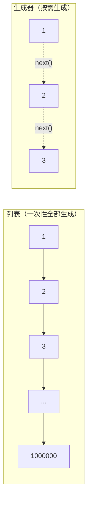
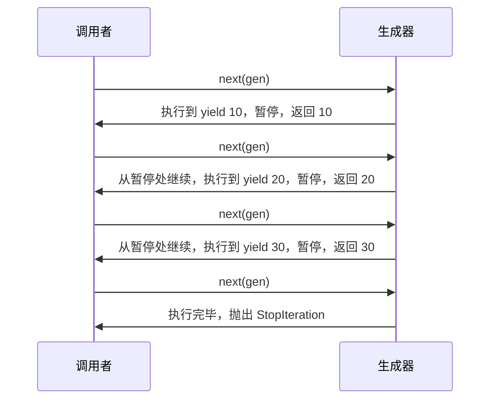

## 3.1 什么是生成器？为什么需要？

**场景：** 你需要读取一个 10GB 的日志文件，统计每行出现的错误数。

```python
 ===== 方式一：全部读入内存（可能 OOM）=====
lines = open("huge.log").readlines()  # 10GB 全部加载！💥
errors = sum(1 for line in lines if "ERROR" in line)

 ===== 方式二：逐行读取（内存友好）=====
count = 0
with open("huge.log") as f:
    for line in f:  # 文件对象本身就是迭代器，逐行读取
        if "ERROR" in line:
            count += 1
```

**生成器**是 Python 实现"惰性求值"的核心工具——**需要时才计算，用完即弃**。



## 3.2 `yield` 关键字详解

`yield` 是生成器的灵魂——它让函数**暂停**并返回一个值，下次调用时从暂停处**继续执行**。

```python
def simple_generator():
    """最简单的生成器"""
    print("Step 1")
    yield 10           # 暂停，返回 10
    print("Step 2")
    yield 20           # 暂停，返回 20
    print("Step 3")
    yield 30           # 暂停，返回 30
    print("Done")

gen = simple_generator()  # 创建生成器对象（函数体内的代码还没执行！）
print(type(gen))          # <class 'generator'>

 手动推进
print(next(gen))  # Step 1\n10
print(next(gen))  # Step 2\n20
print(next(gen))  # Step 3\n30
print(next(gen))  # Done\nStopIteration ← 生成器耗尽
```



## 3.3 生成器 vs 列表：内存对比

```python
import sys

 方式一：列表——一次性生成所有值
nums_list = [x ** 2 for x in range(1000000)]
print(f"列表大小: {sys.getsizeof(nums_list):,} bytes")
 列表大小: 8,444,872 bytes ≈ 8MB

 方式二：生成器——按需生成
nums_gen = (x ** 2 for x in range(1000000))
print(f"生成器大小: {sys.getsizeof(nums_gen):,} bytes")
 生成器大小: 200 bytes ≈ 0.0002MB

 内存差距：约 40000 倍！
```

:::tip 什么时候用列表，什么时候用生成器？
- **用列表**：需要多次遍历、需要随机访问、数据量小
- **用生成器**：数据量大、只需遍历一次、数据实时产生
:::

## 3.4 生成器表达式 vs 列表推导式

```python
 列表推导式 → []
squares_list = [x ** 2 for x in range(10)]
print(squares_list)  # [0, 1, 4, 9, 16, 25, 36, 49, 64, 81]

 生成器表达式 → ()  ← 只是换了括号！
squares_gen = (x ** 2 for x in range(10))
print(squares_gen)  # <generator object <genexpr> at 0x...>
print(list(squares_gen))  # [0, 1, 4, 9, 16, 25, 36, 49, 64, 81]
```

生成器表达式可以直接用在需要迭代器的函数中：

```python
 不需要 list() 转换
total = sum(x ** 2 for x in range(1000000))  # 直接传生成器
max_val = max(x for x in range(100) if x % 7 == 0)
any_val = any(x > 50 for x in range(100))
```

## 3.5 `yield from`（委托生成器）

`yield from` 将一个生成器的所有值"委托"给另一个生成器，简化嵌套生成器的写法：

```python
 ===== 不用 yield from =====
def flatten(nested_list):
    for item in nested_list:
        if isinstance(item, (list, tuple)):
            for sub_item in item:
                yield sub_item
        else:
            yield item

 ===== 用 yield from =====
def flatten(nested_list):
    for item in nested_list:
        if isinstance(item, (list, tuple)):
            yield from flatten(item)  # 委托给递归调用
        else:
            yield item

data = [1, [2, 3], [4, [5, 6]], 7]
print(list(flatten(data)))  # [1, 2, 3, 4, 5, 6, 7]
```

```python
 yield from 的另一个用途：串联多个生成器
def gen1():
    yield 1
    yield 2

def gen2():
    yield 3
    yield 4

def combined():
    yield from gen1()
    yield from gen2()

print(list(combined()))  # [1, 2, 3, 4]
```

## 3.6 `send()` 方法

`send()` 可以**向生成器内部发送值**，这是 Python 协程（coroutine）的基础：

```python
def echo_generator():
    """回声生成器：接收什么就返回什么"""
    while True:
        received = yield        # 暂停，等待接收值
        yield f"收到: {received}"

gen = echo_generator()
next(gen)  # 必须先"启动"生成器（执行到第一个 yield）

result = gen.send("Hello")
print(result)  # 收到: Hello

result = gen.send("World")
print(result)  # 收到: World
```

```python
 更实用的例子：累加器
def accumulator():
    total = 0
    while True:
        value = yield total  # 返回当前总和，接收新值
        total += value

acc = accumulator()
next(acc)           # 启动生成器
print(acc.send(10))  # 10（total = 0 + 10 = 10）
print(acc.send(20))  # 30（total = 10 + 20 = 30）
print(acc.send(5))   # 35（total = 30 + 5 = 35）
```

## 3.7 生成器的方法：`close()` 和 `throw()`

```python
def my_generator():
    try:
        print("开始")
        yield 1
        yield 2
        yield 3
        print("结束")
    except GeneratorExit:
        print("生成器被关闭")

gen = my_generator()
print(next(gen))  # 开始\n1
gen.close()       # 生成器被关闭（在 yield 1 处抛出 GeneratorExit）
 next(gen)       # ❌ StopIteration（已关闭）
```

```python
def my_generator():
    try:
        yield 1
        yield 2
        yield 3
    except ValueError as e:
        yield f"处理异常: {e}"
        yield 4

gen = my_generator()
print(next(gen))         # 1
result = gen.throw(ValueError, "出错了")
print(result)            # 处理异常: 出错了
print(next(gen))         # 4
```

## 3.8 无限生成器

```python
 ===== 无限斐波那契数列 =====
def fibonacci():
    a, b = 0, 1
    while True:     # 注意：无限循环！
        yield a
        a, b = b, a + b

 配合 islice 取前 N 个
from itertools import islice
print(list(islice(fibonacci(), 10)))
 [0, 1, 1, 2, 3, 5, 8, 13, 21, 34]

 ===== 素数生成器 =====
def primes():
    """埃拉托斯特尼筛法"""
    composites = set()  # 已知的合数
    n = 2
    while True:
        if n not in composites:
            yield n
            composites.update(n * i for i in range(n, n + 100))  # 标记合数
        n += 1

print(list(islice(primes(), 20)))
 [2, 3, 5, 7, 11, 13, 17, 19, 23, 29, 31, 37, 41, 43, 47, 53, 59, 61, 67, 71]
```

## 3.9 管道模式

```python
def read_lines(filepath):
    """阶段1：逐行读取"""
    with open(filepath) as f:
        for line in f:
            yield line.strip()

def filter_empty(lines):
    """阶段2：过滤空行和注释"""
    for line in lines:
        if line and not line.startswith("#"):
            yield line

def parse_csv(lines):
    """阶段3：解析 CSV"""
    for line in lines:
        yield line.split(",")

def to_int(rows):
    """阶段4：转换为整数"""
    for row in rows:
        yield [int(x) for x in row]

 组合管道
pipeline = to_int(parse_csv(filter_empty(read_lines("data.csv"))))
for row in pipeline:
    print(row)
```


## 3.10 生成器的底层实现

生成器的核心是 **帧对象（frame）** 和 **挂起/恢复机制**：

```python
def my_gen():
    x = 1
    yield x
    x += 1
    yield x

gen = my_gen()

 查看生成器的帧信息
import inspect
print(inspect.getgeneratorstate(gen))  # GEN_CREATED（已创建，未启动）

next(gen)
print(inspect.getgeneratorstate(gen))  # GEN_SUSPENDED（已暂停）

next(gen)
print(inspect.getgeneratorstate(gen))  # GEN_SUSPENDED

next(gen)
print(inspect.getgeneratorstate(gen))  # GEN_CLOSED（已关闭）
```

:::tip 生成器内部机制（简化版）
1. **创建**：调用生成器函数不会执行函数体，而是返回一个生成器对象
2. **启动/恢复**：`next()` 或 `send()` 恢复帧的执行
3. **挂起**：遇到 `yield` 时，保存帧状态（局部变量、指令指针），返回值
4. **关闭**：函数返回或 `close()` 调用时，帧被销毁

生成器的帧状态保存在堆上（不是栈上），所以可以跨调用保持状态——这就是为什么生成器能"记住"上次执行到哪里。
:::

## 3.11 itertools 标准库

`itertools` 提供了大量高效的迭代器工具，是生成器的好搭档：

```python
from itertools import (
    count,      # 无限计数器
    cycle,      # 无限循环
    repeat,     # 重复
    chain,      # 串联
    islice,     # 切片
    groupby,    # 分组
    accumulate, # 累积
    product,    # 笛卡尔积
    permutations,  # 排列
    combinations,  # 组合
    compress,   # 条件过滤
    dropwhile,  # 丢弃满足条件的元素
    takewhile,  # 取满足条件的元素
)

 1. count(start, step) —— 无限计数器
for i in islice(count(10, 2), 5):
    print(i, end=" ")  # 10 12 14 16 18

 2. cycle(iterable) —— 无限循环
for item in islice(cycle("ABC"), 8):
    print(item, end=" ")  # A B C A B C A B

 3. repeat(elem, n) —— 重复
print(list(repeat("Hi", 3)))  # ['Hi', 'Hi', 'Hi']

 4. chain(*iterables) —— 串联多个可迭代对象
print(list(chain([1, 2], [3, 4], [5, 6])))  # [1, 2, 3, 4, 5, 6]

 5. islice(iterable, start, stop, step) —— 切片
print(list(islice(range(100), 0, 20, 3)))  # [0, 3, 6, 9, 12, 15, 18]

 6. groupby(iterable, key) —— 分组（需要先排序！）
data = [("A", 1), ("B", 2), ("A", 3), ("B", 4), ("A", 5)]
data.sort(key=lambda x: x[0])  # 必须先排序
for key, group in groupby(data, key=lambda x: x[0]):
    print(f"{key}: {list(group)}")
 A: [('A', 1), ('A', 3), ('A', 5)]
 B: [('B', 2), ('B', 4)]

 7. accumulate(iterable, func) —— 累积
print(list(accumulate([1, 2, 3, 4, 5])))              # [1, 3, 6, 10, 15]
print(list(accumulate([1, 2, 3, 4, 5], lambda a, b: a * b)))  # [1, 2, 6, 24, 120]

 8. product(*iterables) —— 笛卡尔积
print(list(product("AB", "12")))  # [('A','1'), ('A','2'), ('B','1'), ('B','2')]

 9. permutations(iterable, r) —— 排列
print(list(permutations("ABC", 2)))
 [('A','B'), ('A','C'), ('B','A'), ('B','C'), ('C','A'), ('C','B')]

 10. combinations(iterable, r) —— 组合
print(list(combinations("ABCD", 2)))
 [('A','B'), ('A','C'), ('A','D'), ('B','C'), ('B','D'), ('C','D')]

 11. compress(data, selectors) —— 条件过滤
print(list(compress("ABCDEF", [1, 0, 1, 0, 1, 1])))  # ['A', 'C', 'E', 'F']

 12. dropwhile/takewhile —— 条件过滤
print(list(dropwhile(lambda x: x < 5, [1, 3, 5, 7, 9])))  # [5, 7, 9]
print(list(takewhile(lambda x: x < 5, [1, 3, 5, 7, 9])))  # [1, 3]
```

## 3.12 Java Stream 对比

| Python 生成器 | Java Stream | 说明 |
|--------------|-------------|------|
| `yield` | 无直接对应 | Python 更底层 |
| `map(func, gen)` | `stream.map(func)` | 映射 |
| `filter(func, gen)` | `stream.filter(func)` | 过滤 |
| 生成器表达式 | `IntStream.range()` | 数值流 |
| `itertools.accumulate` | `IntStream.reduce()` | 累积 |
| `itertools.chain` | `Stream.concat()` | 串联 |
| `itertools.islice` | `Stream.limit().skip()` | 切片 |
| 管道模式 | `stream().map().filter().collect()` | 流式处理 |
| `send()` | 无对应 | 协程基础 |
| 自定义 yield 函数 | 自定义 `Spliterator` | Python 更简洁 |

:::tip 核心区别
- Java Stream 是**一次性消费**的（类似生成器），但 API 更声明式
- Python 生成器是**命令式**的——你用 `yield` 精确控制每个值何时产生
- Java Stream 提供并行流 `parallelStream()`；Python 需要用 `multiprocessing`
- Python 生成器可以双向通信（`send()`），Java Stream 不行
:::

## 3.13 练习题

**第 1 题：** 写一个生成器 `even_numbers(n)`，生成前 n 个偶数。

**第 2 题：** 写一个生成器 `read_file_in_chunks(filepath, chunk_size)`，按指定大小分块读取文件。

**第 3 题：** 用 `yield from` 实现一个树的深度优先遍历生成器。

**第 4 题：** 用 `itertools` 实现一个密码字典生成器，生成所有 4 位数字组合。

**第 5 题：** 实现一个生成器版的 `tail -f`——持续监控文件新增内容。

**第 6 题：** 用生成器表达式计算 1 到 100 万中所有偶数的平方和。

**第 7 题：** 实现一个 `batch(iterable, n)` 生成器，将可迭代对象分成大小为 n 的批次。

**参考答案：**


**参考答案**

```python
 第 1 题
def even_numbers(n):
    for i in range(n):
        yield i * 2

print(list(even_numbers(5)))  # [0, 2, 4, 6, 8]

 第 2 题
def read_file_in_chunks(filepath, chunk_size=4096):
    with open(filepath, 'rb') as f:
        while True:
            chunk = f.read(chunk_size)
            if not chunk:
                break
            yield chunk

 第 3 题
class TreeNode:
    def __init__(self, val, children=None):
        self.val = val
        self.children = children or []

def dfs(tree):
    yield tree.val
    for child in tree.children:
        yield from dfs(child)

 构建树
     A
    / \
   B   C
  / \   \
 D   E   F
root = TreeNode("A", [
    TreeNode("B", [TreeNode("D"), TreeNode("E")]),
    TreeNode("C", [TreeNode("F")])
])
print(list(dfs(root)))  # ['A', 'B', 'D', 'E', 'C', 'F']

 第 4 题
from itertools import product

def password_dict():
    for combo in product("0123456789", repeat=4):
        yield "".join(combo)

print(list(islice(password_dict(), 5)))  # ['0000', '0001', '0002', '0003', '0004']

 第 5 题
import time

def tail_f(filepath):
    with open(filepath) as f:
        f.seek(0, 2)  # 跳到文件末尾
        while True:
            line = f.readline()
            if line:
                yield line.strip()
            else:
                time.sleep(0.1)

 用法：
 for line in tail_f("app.log"):
     print(line)

 第 6 题
total = sum(x * x for x in range(1, 1_000_001) if x % 2 == 0)
print(total)  # 166666666666500000

 第 7 题
def batch(iterable, n):
    """将可迭代对象分成大小为 n 的批次"""
    from itertools import islice
    it = iter(iterable)
    while True:
        chunk = list(islice(it, n))
        if not chunk:
            break
        yield chunk

data = range(10)
for b in batch(data, 3):
    print(b)
 [0, 1, 2]
 [3, 4, 5]
 [6, 7, 8]
 [9]
```


---