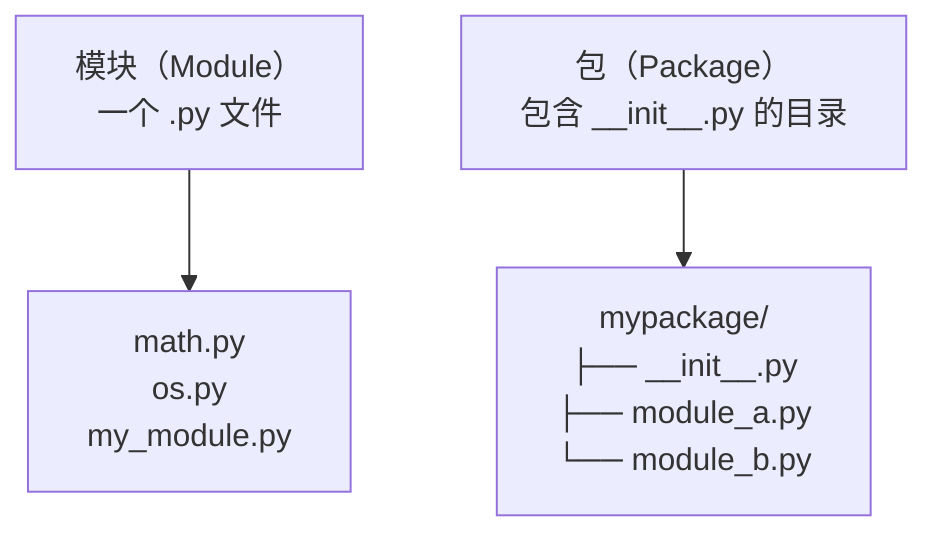
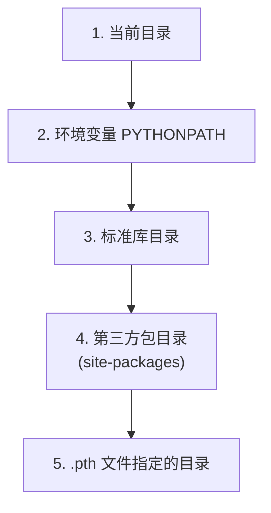
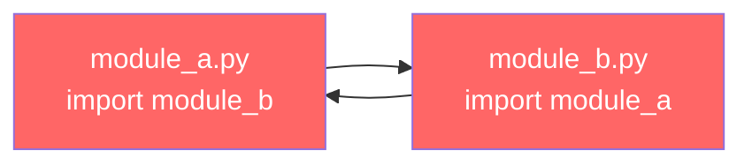
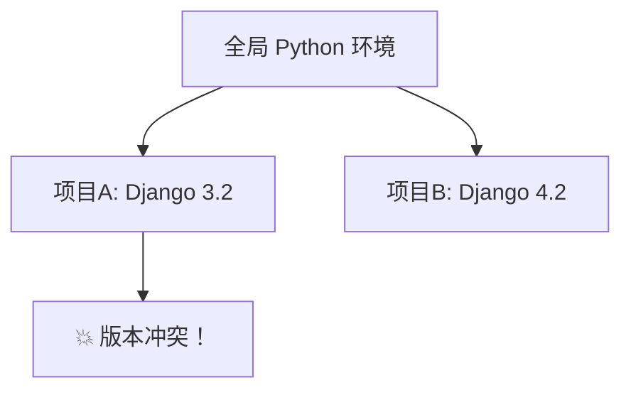
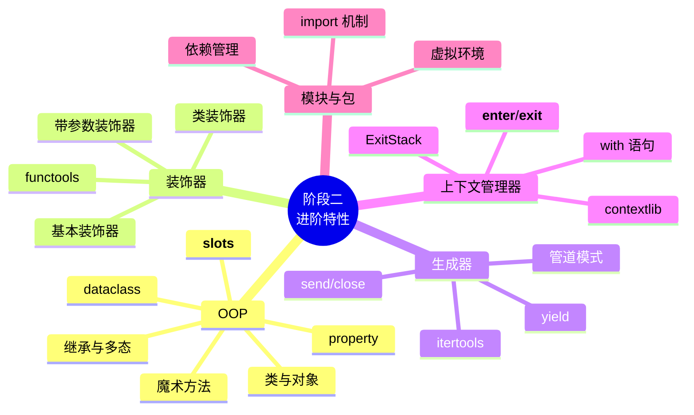

## 5.1 什么是模块？什么是包？



- **模块**：就是一个 `.py` 文件，文件名就是模块名
- **包**：是一个包含 `__init__.py` 文件的目录，用来组织多个模块

```python
 导入模块，模块就是一个 .py 文件
import math
print(math.sqrt(16))  # 4.0

 查看模块的信息
print(math.__file__)   # 模块的文件路径
print(math.__name__)   # 模块名
```

## 5.2 import 语句的各种形式

```python
 ===== 1. 导入整个模块 =====
import os
print(os.path.join("a", "b"))  # a/b

 ===== 2. 导入模块中的特定内容 =====
from datetime import datetime, timedelta
now = datetime.now()
print(now)  # 2024-01-01 12:00:00

 ===== 3. 给模块起别名 =====
import numpy as np
import pandas as pd
from collections import defaultdict as dd

 ===== 4. 导入所有内容（不推荐！）=====
from math import *
print(sqrt(16))  # 4.0
 ⚠️ 容易造成命名冲突，不知道哪些名字是从哪来的
```

:::danger ⚠️ 不要用 `from xxx import *`
- 污染命名空间
- 可能覆盖已有的变量/函数
- 可读性差——看代码时不知道 `sqrt` 是从哪来的
- 如果要用，配合 `__all__` 变量限制导出的内容
:::

## 5.3 模块搜索路径（`sys.path`）

Python 导入模块时，按以下顺序搜索：



```python
import sys
print("\n".join(sys.path))
 /Users/you/project
 /usr/lib/python311.zip
 /usr/lib/python3.11
 /usr/lib/python3.11/lib-dynload
 /usr/local/lib/python3.11/site-packages
 ...

 动态添加搜索路径（不推荐，优先用虚拟环境）
sys.path.append("/my/custom/path")
```

:::warning 命名冲突陷阱
永远不要把你的文件命名为 `random.py`、`math.py`、`os.py` 等标准库名称——Python 会优先在当前目录搜索，导致导入的是你自己的文件而不是标准库。
:::

## 5.4 `__name__ == "__main__"`

每个模块都有一个 `__name__` 属性：

- 直接运行时：`__name__ == "__main__"`
- 被导入时：`__name__ == "模块名"`

```python
 my_module.py
def main():
    print("这是主程序")

def helper():
    print("这是辅助函数")

if __name__ == "__main__":
    # 只有直接运行 my_module.py 时才会执行
    main()
```

```python
 另一个文件中
import my_module
my_module.helper()  # 这是辅助函数
 main() 不会被调用！
```

:::tip Java 对比
`if __name__ == "__main__"` ≈ Java 的 `public static void main(String[] args)`。区别是 Python 的每个 `.py` 文件都可以是入口，而 Java 需要一个专门的类来放 `main` 方法。
:::

## 5.5 `__init__.py` 的作用

```
my_package/
├── __init__.py       # 包标识文件
├── module_a.py
├── module_b.py
└── sub/
    ├── __init__.py
    └── module_c.py
```

`__init__.py` 的作用：

```python
 my_package/__init__.py
 1. 标识目录是一个包（Python 3.3+ 可以没有，但不推荐）
 2. 初始化包级别的代码
print("my_package 被导入了")

 3. 控制导入哪些内容
from .module_a import func_a
from .module_b import func_b

 4. 定义 __all__，控制 from my_package import * 的行为
__all__ = ["func_a", "func_b"]
```

:::tip Python 3.3+ 的 Namespace Package
Python 3.3+ 引入了**命名空间包**（PEP 420），即使没有 `__init__.py`，目录也可以作为包被导入。但**仍然建议保留 `__init__.py`**，因为：
1. 明确表达"这是一个包"的意图
2. 兼容旧版 Python
3. 可以在 `__init__.py` 中做初始化和控制导出
:::

## 5.6 `__all__` 变量

`__all__` 是一个字符串列表，控制 `from module import *` 时导出哪些内容：

```python
 my_module.py
__all__ = ["public_func", "PublicClass"]

def public_func():
    """公开函数"""
    pass

def _private_func():
    """私有函数"""
    pass

class PublicClass:
    pass

class _PrivateClass:
    pass
```

```python
from my_module import *
 只导入了 public_func 和 PublicClass
 _private_func 和 _PrivateClass 不会被导入
```

## 5.7 相对导入 vs 绝对导入

```
my_package/
├── __init__.py
├── module_a.py      # from .module_b import func  （相对导入）
├── module_b.py
└── sub/
    ├── __init__.py
    └── module_c.py  # from ..module_a import func （相对导入）
```

```python
 ===== 绝对导入 =====
from my_package.module_b import func  # 完整路径
from my_package.sub.module_c import Klass

 ===== 相对导入 =====
 . 表示当前包
 .. 表示上一级包
from .module_b import func       # 当前包的 module_b
from ..module_a import func      # 上一级包的 module_a
from .sub.module_c import Klass   # 当前包的子包 sub 的 module_c
```

:::warning 相对导入的限制
- 相对导入**只能在包内部使用**——直接运行包内的文件会报 `ImportError`
- 如果要直接运行某个文件做测试，用绝对导入
- 推荐在包内部统一使用相对导入（更不容易出错，重命名包时不需要改导入路径）
:::

## 5.8 循环导入问题和解决方案



```python
 ===== 问题：循环导入 =====
 module_a.py
from module_b import func_b  # ← 这里导入 module_b
def func_a():
    return "A"

 module_b.py
from module_a import func_a  # ← 这里又导入 module_a
def func_b():
    return "B"
 运行时会报 ImportError 或 AttributeError
```

**解决方案：**

```python
 ===== 方案一：延迟导入（在函数内部导入）=====
 module_a.py
def func_a():
    from module_b import func_b  # 在需要时才导入
    return func_b() + " + A"

 module_b.py
def func_b():
    from module_a import func_a  # 在需要时才导入
    return func_a() + " + B"

 ===== 方案二：重构——提取公共代码到第三个模块 =====
 common.py
def shared_logic():
    return "shared"

 module_a.py
from common import shared_logic
def func_a():
    return shared_logic() + " + A"

 module_b.py
from common import shared_logic
def func_b():
    return shared_logic() + " + B"

 ===== 方案三：使用 TYPE_CHECKING（类型提示时的循环导入）=====
from typing import TYPE_CHECKING

if TYPE_CHECKING:
    from module_b import ModuleB  # 仅类型检查时导入，运行时不执行

class ModuleA:
    def process(self, other: "ModuleB"):  # 用字符串引用
        pass
```

## 5.9 第三方包安装

```bash
 基本安装
pip install requests

 安装指定版本
pip install requests==2.31.0
pip install "requests>=2.28.0,<3.0.0"

 国内镜像（大幅加速）
pip install requests -i https://pypi.tuna.tsinghua.edu.cn/simple

 永久配置镜像
pip config set global.index-url https://pypi.tuna.tsinghua.edu.cn/simple

 升级 pip
pip install --upgrade pip

 查看已安装的包
pip list
pip show requests

 卸载
pip uninstall requests

 导出依赖
pip freeze > requirements.txt
```

:::tip 常用国内镜像
| 镜像 | URL |
|------|-----|
| 清华 | `https://pypi.tuna.tsinghua.edu.cn/simple` |
| 阿里云 | `https://mirrors.aliyun.com/pypi/simple` |
| 中科大 | `https://pypi.mirrors.ustc.edu.cn/simple` |
| 豆瓣 | `https://pypi.doubanio.com/simple` |
:::

## 5.10 虚拟环境（venv）

### 为什么需要虚拟环境？



虚拟环境为每个项目创建**独立的 Python 环境**，互不干扰。

### 创建和激活

```bash
 创建虚拟环境
python -m venv .venv

 激活（macOS/Linux）
source .venv/bin/activate

 激活（Windows）
.venv\Scripts\activate

 激活后，命令行提示符会变化
 (.venv) $

 确认虚拟环境
which python    # /path/to/project/.venv/bin/python
python --version

 安装包（只安装到虚拟环境）
pip install requests

 退出虚拟环境
deactivate
```

:::tip 虚拟环境的原理
`python -m venv .venv` 做了这些事：
1. 创建 `.venv/` 目录
2. 复制一份 Python 解释器（或 symlink）
3. 创建 `pip`、`setuptools` 等工具
4. 激活时修改 `PATH`，让 `.venv/bin/python` 优先于全局 Python
5. 安装的包放在 `.venv/lib/pythonX.Y/site-packages/` 下

**激活的本质就是修改环境变量 `PATH`**——把虚拟环境的 `bin` 目录放到最前面。
:::

### `.gitignore` 别忘了

```
 .gitignore
.venv/
```

## 5.11 依赖管理工具对比

### `requirements.txt`（最传统）

```bash
 导出
pip freeze > requirements.txt

 安装
pip install -r requirements.txt
```

```text
 requirements.txt
requests==2.31.0
numpy>=1.24.0,<2.0.0
pandas>=2.0.0
```

:::warning `requirements.txt` 的问题
- 没有区分直接依赖和间接依赖（`pip freeze` 导出所有）
- 没有锁定精确版本（除非用 `==`）
- 没有开发/生产环境分组
:::

### `pyproject.toml`（现代标准，PEP 518）

```toml
 pyproject.toml
[project]
name = "my-project"
version = "1.0.0"
description = "My awesome project"
requires-python = ">=3.10"
dependencies = [
    "requests>=2.31.0",
    "numpy>=1.24.0",
]

[project.optional-dependencies]
dev = [
    "pytest>=7.0.0",
    "black>=23.0.0",
    "mypy>=1.0.0",
]

[build-system]
requires = ["setuptools>=68.0"]
build-backend = "setuptools.backends._legacy:_Backend"
```

```bash
 安装（开发模式）
pip install -e ".[dev]"
```

### Poetry（最流行的现代工具）

```bash
 安装 Poetry
pip install poetry

 初始化项目
poetry init

 添加依赖
poetry add requests
poetry add pytest --group dev

 安装所有依赖
poetry install

 运行脚本
poetry run python main.py
```

:::tip Java 对比
| Python | Java | 说明 |
|--------|------|------|
| `requirements.txt` | `pom.xml` (Maven) | 依赖列表 |
| `pyproject.toml` | `pom.xml` / `build.gradle` | 项目元信息 + 构建配置 |
| `pip` | `mvn` / `gradle` | 包管理器 |
| `venv` | 无直接对应 | Java 靠 JVM 隔离，不需要虚拟环境 |
| PyPI | Maven Central | 包仓库 |
| `.venv/` | `.m2/repository/` | 本地缓存 |
| Poetry | Gradle | 更现代的工具链 |

**关键区别：** Python 没有 JVM 这样的隔离层，所以需要虚拟环境来隔离不同项目的依赖。Java 的类加载器机制天然支持这一点。
:::

## 5.12 包的发布（简要介绍）

```bash
 1. 安装构建工具
pip install build

 2. 构建包
python -m build
 生成 dist/my_package-1.0.0.tar.gz
 生成 dist/my_package-1.0.0-py3-none-any.whl

 3. 发布到 PyPI（需要账号）
pip install twine
twine upload dist/*
```

:::tip Java 对比
- Python 发布到 **PyPI**（`pip install` 从这里下载）
- Java 发布到 **Maven Central**（`mvn deploy`）
- 两者都是中央仓库 + CDN 分发的模式
:::

## 5.13 练习题

**第 1 题：** 创建一个包 `calculator`，包含 `basic.py`（加减乘除）和 `advanced.py`（幂、开方），通过 `__init__.py` 导出所有函数。

**第 2 题：** 写一个脚本，利用 `__name__ == "__main__"` 既能作为模块导入，也能直接运行。

**第 3 题：** 模拟循环导入的场景，并用延迟导入解决。

**第 4 题：** 用 `pyproject.toml` 创建一个项目，包含开发和运行依赖。

**第 5 题：** 解释为什么 `from my_package import *` 导入的内容可能和预期不同。

**第 6 题：** 实现一个包，使用相对导入，并测试通过 `python -m` 运行。

**第 7 题：** 对比 `requirements.txt` 和 `pyproject.toml`，说明各自的优缺点。

**参考答案：**


**参考答案**

```
 第 1 题
 目录结构：
 calculator/
 ├── __init__.py
 ├── basic.py
 └── advanced.py
```

```python
 calculator/basic.py
def add(a, b): return a + b
def subtract(a, b): return a - b
def multiply(a, b): return a * b
def divide(a, b):
    if b == 0:
        raise ValueError("除数不能为零")
    return a / b

 calculator/advanced.py
def power(base, exp): return base ** exp
def sqrt(n):
    if n < 0:
        raise ValueError("不能对负数开方")
    return n ** 0.5

 calculator/__init__.py
from .basic import add, subtract, multiply, divide
from .advanced import power, sqrt

__all__ = ["add", "subtract", "multiply", "divide", "power", "sqrt"]
```

```python
 使用
from calculator import add, multiply, sqrt
print(add(1, 2))    # 3
print(sqrt(16))     # 4.0

 第 2 题
 my_tool.py
def process_data(data):
    """处理数据的函数——可以被其他模块导入使用"""
    return [x * 2 for x in data]

def main():
    """命令行入口——只在直接运行时执行"""
    import sys
    if len(sys.argv) > 1:
        data = list(map(int, sys.argv[1:]))
    else:
        data = [1, 2, 3, 4, 5]
    print(f"输入: {data}")
    print(f"输出: {process_data(data)}")

if __name__ == "__main__":
    main()

 python my_tool.py 1 2 3
 输入: [1, 2, 3]
 输出: [2, 4, 6]

 第 3 题
 services/user_service.py
class UserService:
    def get_user(self, user_id):
        # 延迟导入避免循环
        from repositories.user_repo import UserRepository
        repo = UserRepository()
        return repo.find_by_id(user_id)

 services/order_service.py
class OrderService:
    def get_orders(self, user_id):
        # 延迟导入避免循环
        from repositories.user_repo import UserRepository
        repo = UserRepository()
        user = repo.find_by_id(user_id)
        return user.orders

 第 4 题
 pyproject.toml
[project]
name = "my-awesome-app"
version = "0.1.0"
requires-python = ">=3.10"
dependencies = [
    "fastapi>=0.100.0",
    "sqlalchemy>=2.0.0",
    "uvicorn>=0.23.0",
]

[project.optional-dependencies]
dev = [
    "pytest>=7.0.0",
    "pytest-cov>=4.0.0",
    "black>=23.0.0",
    "ruff>=0.1.0",
    "mypy>=1.5.0",
]

[project.scripts]
my-app = "my_app.main:main"

 安装：pip install -e ".[dev]"

 第 5 题
 from package import * 的行为：
 1. 如果包定义了 __all__，只导入 __all__ 中列出的名字
 2. 如果没定义 __all__，导入所有不以 _ 开头的名字
 3. __init__.py 中的 import 语句也会影响结果
 所以导入内容可能和预期不同——建议始终定义 __all__

 第 6 题
 包结构：
 myapp/
 ├── __init__.py
 ├── main.py
 └── utils.py

 myapp/utils.py
def greet(name):
    return f"Hello, {name}!"

 myapp/main.py
from .utils import greet

def run():
    print(greet("World"))

if __name__ == "__main__":
    run()

 运行方式：
 python -m myapp.main  （不是 python myapp/main.py）
 输出：Hello, World!
```


---

# 阶段小结



| 知识点 | 掌握标准 |
|--------|---------|
| OOP | 类定义、继承、多态、dataclass、property、魔术方法、`__slots__` |
| 装饰器 | 原理理解、带参数装饰器、类装饰器、functools 工具 |
| 生成器 | yield、send/close、生成器表达式、itertools、管道模式 |
| 上下文管理器 | `with`、自定义管理器、contextlib、ExitStack |
| 模块与包 | 导入方式、包结构、虚拟环境、依赖管理 |

# 延伸阅读

- 上一篇：[阶段一：基础入门](./stage1-basics.md)
- 下一篇：[阶段三：标准库与包管理](./stage3-stdlib.md)