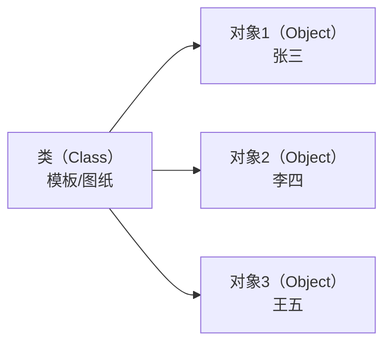
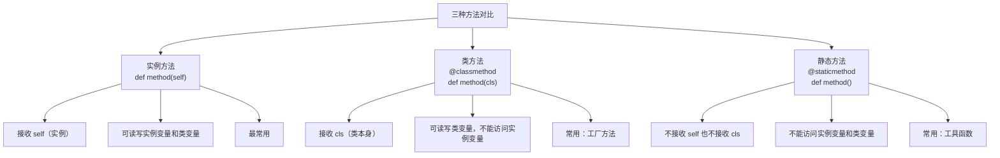
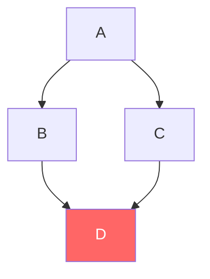

## 1.1 什么是 OOP？

**OOP（Object-Oriented Programming）** 是一种编程范式，核心思想是把数据和处理数据的方法**封装**在一起，形成"对象"。

:::tip 一句话理解
面向过程 = "第一步做什么，第二步做什么"；面向对象 = "谁来做这件事"。
:::

来看一个实际例子——计算员工薪资：

```python
 ====== 面向过程写法 ======
employees = [
    {"name": "张三", "base": 10000, "bonus": 2000},
    {"name": "李四", "base": 15000, "bonus": 3000},
]

def calc_salary(emp):
    """计算薪资——函数和数据分离"""
    return emp["base"] + emp["bonus"]

for emp in employees:
    print(f"{emp['name']}: {calc_salary(emp)}")
 张三: 12000
 李四: 18000
```

```python
 ====== 面向对象写法 ======
class Employee:
    """员工类——数据和行为封装在一起"""
    def __init__(self, name, base, bonus):
        self.name = name
        self.base = base
        self.bonus = bonus

    def calc_salary(self):
        """计算薪资——对象自己知道怎么算"""
        return self.base + self.bonus

for emp_data in employees:
    emp = Employee(**emp_data)
    print(f"{emp.name}: {emp.calc_salary()}")
 张三: 12000
 李四: 18000
```

看起来面向过程更简单？别急，当需求变复杂时，OOP 的优势才会体现：

| 维度 | 面向过程 | 面向对象 |
|------|---------|---------|
| **数据组织** | 散落在各处，用字典/列表传递 | 封装在对象内部 |
| **代码复用** | 拷贝函数 | 继承 + 多态 |
| **扩展性** | 改一堆函数 | 加一个子类就行 |
| **适合场景** | 简单脚本、数据处理 | 大型系统、业务逻辑 |

## 1.2 类和对象



- **类（Class）**：蓝图/模板，定义了对象有哪些属性和方法
- **对象（Object）**：类的具体实例，每个对象有自己独立的数据

```python
 定义类
class Dog:
    """狗类——所有狗的模板"""

    def __init__(self, name, breed):
        self.name = name    # 每只狗有自己的名字
        self.breed = breed  # 每只狗有自己的品种

    def bark(self):
        return f"{self.name}: 汪汪！"

 创建对象（实例化）
dog1 = Dog("旺财", "柴犬")  # 旺财是一只柴犬
dog2 = Dog("小白", "哈士奇")  # 小白是一只哈士奇

print(dog1.bark())  # 旺财: 汪汪！
print(dog2.bark())  # 小白: 汪汪！

 每个对象是独立的
print(dog1.name)  # 旺财
print(dog2.name)  # 小白
```

## 1.3 `__init__` 构造函数与 `self`

`__init__` 是 Python 中的**构造函数**（严格来说是初始化方法），在创建对象时自动调用。

```python
class Person:
    def __init__(self, name, age):
        # self 指向当前正在创建的对象
        # 相当于 Java 中的 this
        self.name = name
        self.age = age

p = Person("张三", 25)
 调用流程：
 1. Python 先创建一个空对象
 2. 把这个空对象作为 self 传给 __init__
 3. __init__ 给对象设置属性
 4. 返回这个对象赋值给 p
```

:::tip self 是什么？
- `self` 就是当前对象本身，类似 Java 的 `this`
- 但和 Java 不同，Python **必须显式声明** self 参数（不叫 `self` 也行，但这是约定俗成的）
- 调用方法时，Python 自动把对象作为第一个参数传入
:::

```python
class Demo:
    def method(self):
        print(f"self 的 id: {id(self)}")

d = Demo()
print(f"对象 d 的 id: {id(d)}")
d.method()
 对象 d 的 id: 140234567890
 self 的 id: 140234567890
 → 两者是同一个对象！
```

## 1.4 实例变量 vs 类变量

```python
class Dog:
    # 类变量：所有实例共享（类似 Java 的 static field）
    species = "犬科"

    def __init__(self, name):
        # 实例变量：每个对象独有（类似 Java 的 instance field）
        self.name = name

dog1 = Dog("旺财")
dog2 = Dog("小白")

 类变量通过类或实例都能访问
print(Dog.species)   # 犬科
print(dog1.species)  # 犬科
print(dog2.species)  # 犬科

 修改类变量 → 所有实例都受影响
Dog.species = "犬科动物"
print(dog1.species)  # 犬科动物
print(dog2.species)  # 犬科动物
```

:::danger ⚠️ 常见陷阱：通过实例修改类变量

```python
class Dog:
    count = 0  # 类变量

    def __init__(self, name):
        self.name = name

dog = Dog("旺财")
dog.count = 10  # ❌ 这不是修改类变量！而是给 dog 创建了一个实例变量 count

print(Dog.count)  # 0  ← 类变量没变
print(dog.count)  # 10  ← 这是实例变量
```

正确做法：始终通过类名修改类变量 `Dog.count = 10`。
:::

## 1.5 三种方法：实例方法、类方法、静态方法

```python
class MyClass:
    count = 0  # 类变量

    # ===== 1. 实例方法 =====
    def instance_method(self):
        """需要访问实例数据时使用"""
        self.count += 1
        return f"实例方法，count={self.count}"

    # ===== 2. 类方法 =====
    @classmethod
    def class_method(cls):
        """需要操作类变量或创建实例时使用，cls 指向类本身"""
        cls.count += 1
        return f"类方法，count={cls.count}"

    # ===== 3. 静态方法 =====
    @staticmethod
    def static_method(x, y):
        """和类/实例都无关的工具函数，相当于放在类命名空间里的普通函数"""
        return x + y

obj = MyClass()

 实例方法：必须通过实例调用
print(obj.instance_method())  # 实例方法，count=1

 类方法：通过类或实例都能调用
print(MyClass.class_method())  # 类方法，count=2
print(obj.class_method())      # 类方法，count=3

 静态方法：通过类或实例都能调用
print(MyClass.static_method(1, 2))  # 3
print(obj.static_method(1, 2))      # 3
```



:::tip Java 对比
| Python | Java | 说明 |
|--------|------|------|
| `def method(self)` | `void method()` | 实例方法 |
| `@classmethod` | `static method` | 但 Python 的类方法还能访问类本身（cls） |
| `@staticmethod` | `static method` | 完全等价 |
:::

## 1.6 访问控制

Python 没有真正的 `private` 关键字，而是通过**命名约定**来实现访问控制：

```python
class BankAccount:
    def __init__(self, owner, balance):
        self.owner = owner       # 公开：任何人都能访问
        self._balance = balance  # 约定私有：单下划线，表示"别从外部访问"
        self.__secret = "密码"   # 名称改写：双下划线，Python 会改名

    def _internal_method(self):
        """约定私有方法：内部使用"""
        return self._balance * 1.05

    def __private_method(self):
        """名称改写方法"""
        return self.__secret

account = BankAccount("张三", 10000)

print(account.owner)      # 张三  ✅ 公开变量
print(account._balance)   # 10000 ⚠️ 约定私有，但技术上能访问
 print(account.__secret) # ❌ AttributeError!
 因为 Python 把 __secret 改名了
print(account._BankAccount__secret)  # 密码  ✅ 改名后能访问，但别这么干
```

:::warning 名称改写（Name Mangling）原理

Python 解释器看到双下划线开头的属性时，会自动加上 `_类名` 前缀：

```python
class Person:
    def __init__(self):
        self.__name = "secret"  # 实际存储为 _Person__name

class Student(Person):
    def get_name(self):
        # 这里访问的是 _Student__name，不是 _Person__name
        # print(self.__name)  # ❌ AttributeError
        print(self._Person__name)  # ✅ 必须显式指定

s = Student()
s.get_name()  # secret
```

这个机制的**目的是防止子类意外覆盖父类的私有属性**，而不是为了安全。
:::

## 1.7 属性装饰器 `@property`

`@property` 让方法调用变成属性访问，是 Python 实现 getter/setter 的推荐方式。

```python
class Circle:
    def __init__(self, radius):
        self._radius = radius  # 约定私有

    # getter：像属性一样访问
    @property
    def radius(self):
        return self._radius

    # setter：像属性一样赋值
    @radius.setter
    def radius(self, value):
        if value < 0:
            raise ValueError("半径不能为负数")
        self._radius = value

    # 只读属性：只定义 getter，不定义 setter
    @property
    def area(self):
        return 3.14159 * self._radius ** 2

c = Circle(5)
print(c.radius)  # 5       ← 调用的是 @property 方法
print(c.area)    # 78.53975 ← 只读属性
c.radius = 10    # ← 调用的是 @radius.setter
print(c.radius)  # 10
 c.area = 100   # ❌ AttributeError: can't set attribute
 c.radius = -1  # ❌ ValueError: 半径不能为负数
```

:::tip 为什么用 @property 而不是直接暴露属性？

```python
 方式一：直接暴露（不推荐）
class Circle:
    def __init__(self, radius):
        self.radius = radius  # 公开

 问题：以后想加校验怎么办？改了就破坏 API 兼容性

 方式二：@property（推荐）
class Circle:
    def __init__(self, radius):
        self._radius = radius  # 私有

    @property
    def radius(self):
        return self._radius

    @radius.setter
    def radius(self, value):
        if value <= 0:
            raise ValueError("半径必须为正数")
        self._radius = value

 优势：以后想加校验，只需在 setter 里加逻辑，外部代码不需要改
```

Java 对比：`@property` ≈ Java 的 getter/setter 方法，但 Python 的语法更优雅——调用者感觉像在访问字段。
:::

## 1.8 继承与 `super()`

### 单继承

```python
class Animal:
    def __init__(self, name):
        self.name = name

    def speak(self):
        return "..."

    def info(self):
        return f"{self.name}: {self.speak()}"

class Dog(Animal):
    """Dog 继承 Animal，自动拥有 name 属性和 info 方法"""
    def speak(self):
        return "汪汪！"

class Cat(Animal):
    def speak(self):
        return "喵~"

dog = Dog("旺财")
print(dog.info())  # 旺财: 汪汪！  ← 调用的是 Dog 的 speak()
print(dog.name)    # 旺财          ← 继承自 Animal
```

### `super()` 详解

`super()` 用于调用父类的方法，最常见的用途是在子类的 `__init__` 中调用父类的初始化逻辑：

```python
class Animal:
    def __init__(self, name, age):
        self.name = name
        self.age = age

class Dog(Animal):
    def __init__(self, name, age, breed):
        super().__init__(name, age)  # 调用父类的 __init__
        self.breed = breed           # 子类自己的属性

dog = Dog("旺财", 3, "柴犬")
print(dog.name)   # 旺财
print(dog.age)    # 3
print(dog.breed)  # 柴犬
```

:::tip super() 的底层原理
`super()` 返回的是一个代理对象，它按照 **MRO（方法解析顺序）** 来查找方法。在单继承中很简单——就是父类。在多继承中，`super()` 的行为可能出乎意料（后面详细讲）。
:::

## 1.9 多继承与 MRO

### 菱形继承问题



```python
class A:
    def method(self):
        print("A")

class B(A):
    def method(self):
        print("B")

class C(A):
    def method(self):
        print("C")

class D(B, C):
    pass

d = D()
d.method()  # B（不是 C，也不是 A）
```

为什么是 B？Python 使用 **C3 线性化算法** 来确定方法查找顺序：

```python
print(D.__mro__)
 (<class 'D'>, <class 'B'>, <class 'C'>, <class 'A'>, <class 'object'>)

 D → B → C → A → object
 查找 method 时：先找 D（没有）→ 找 B（有！）→ 返回
```

:::warning C3 线性化算法简化规则

1. **子类在父类之前**：D 在 B、C 之前
2. **声明顺序保持**：B 在 C 之前（因为 D(B, C)）
3. **父类只出现一次**：A 只出现一次

如果违反规则，Python 会直接报错：

```python
class X(A, B): pass  # OK
class Y(B, A): pass  # ❌ TypeError: Cannot create a consistent method resolution order (MRO)
```
:::

### Mix-in 模式

多继承的最佳实践——**Mix-in** 是一种只提供额外功能的"小类"，不单独使用，只用来混入其他类：

```python
class JsonMixin:
    """提供 to_json 能力的 Mix-in"""
    def to_json(self):
        import json
        return json.dumps(self.__dict__, ensure_ascii=False)

class LogMixin:
    """提供日志能力的 Mix-in"""
    def log(self, msg):
        print(f"[LOG] {self.__class__.__name__}: {msg}")

class User(JsonMixin, LogMixin):
    """User 同时拥有 JSON 序列化和日志能力"""
    def __init__(self, name, age):
        self.name = name
        self.age = age

user = User("张三", 25)
print(user.to_json())  # {"name": "张三", "age": 25}
user.log("用户已创建")  # [LOG] User: 用户已创建
```

## 1.10 多态与鸭子类型

Python 的多态**不依赖继承**——只要对象有对应的方法就行：

```python
class Dog:
    def speak(self):
        return "汪汪！"

class Cat:
    def speak(self):
        return "喵~"

class Robot:
    def speak(self):
        return "哔哔哔"

 三个类没有共同的父类，但都有 speak 方法
 这就是"鸭子类型"：如果它走起来像鸭子、叫起来像鸭子，那它就是鸭子
def make_sound(thing):
    print(thing.speak())

make_sound(Dog())   # 汪汪！
make_sound(Cat())   # 喵~
make_sound(Robot())  # 哔哔哔
```

:::tip Java 对比
Java 需要 `implements` 接口来实现多态；Python 只需要有相同的方法名就行。Python 更灵活但类型安全性更低。用 `Protocol`（PEP 544）可以同时获得两者：
```python
from typing import Protocol

class Speaker(Protocol):
    def speak(self) -> str: ...

 类型检查器会检查参数是否实现了 Speaker 协议
def make_sound(thing: Speaker):
    print(thing.speak())
```
:::

## 1.11 抽象基类 ABC

```python
from abc import ABC, abstractmethod

class Shape(ABC):
    """抽象基类——不能直接实例化"""
    @abstractmethod
    def area(self) -> float:
        """子类必须实现这个方法"""
        ...

    @abstractmethod
    def perimeter(self) -> float:
        ...

    def describe(self):
        """普通方法，子类直接继承"""
        return f"面积={self.area():.2f}, 周长={self.perimeter():.2f}"

class Circle(Shape):
    def __init__(self, radius):
        self.radius = radius

    def area(self):
        return 3.14159 * self.radius ** 2

    def perimeter(self):
        return 2 * 3.14159 * self.radius

 shape = Shape()  # ❌ TypeError: Can't instantiate abstract class
circle = Circle(5)
print(circle.describe())  # 面积=78.54, 周长=31.42
```

:::tip Java 对比
Python 的 `ABC + @abstractmethod` ≈ Java 的 `abstract class + abstract method`。但 Python 的 ABC 更灵活——可以用 `register()` 把现有类"注册"为某个抽象基类的虚拟子类。
:::

## 1.12 dataclass

`dataclass` 是 Python 3.7+ 引入的语法糖，自动生成 `__init__`、`__repr__`、`__eq__` 等方法。类似 Java 的 **Lombok `@Data`**。

```python
from dataclasses import dataclass, field, FrozenInstanceError

@dataclass
class User:
    name: str                    # 必填字段
    age: int = 0                 # 有默认值的字段（必须放在必填字段后面）
    email: str = ""              # 默认值
    tags: list[str] = field(default_factory=list)  # 可变默认值必须用 factory！
```

:::danger ⚠️ 可变默认值陷阱

```python
 ❌ 错误写法
@dataclass
class Bad:
    items: list = []  # 所有实例共享同一个列表！

 ✅ 正确写法
@dataclass
class Good:
    items: list = field(default_factory=list)
```
:::

```python
from dataclasses import dataclass, field

@dataclass
class User:
    name: str
    age: int = 0
    email: str = ""
    tags: list[str] = field(default_factory=list)

user = User("张三", 25)
print(user)  # User(name='张三', age=25, email='', tags=[])
print(user == User("张三", 25))  # True  ← __eq__ 自动生成
```

**dataclass 参数一览：**

```python
@dataclass(
    init=True,       # 自动生成 __init__（默认 True）
    repr=True,       # 自动生成 __repr__（默认 True）
    eq=True,         # 自动生成 __eq__（默认 True）
    order=False,     # 自动生成 <, >, <=, >=（默认 False）
    unsafe_hash=False,  # 自动生成 __hash__（默认 False）
    frozen=False,    # 不可变（默认 False，设为 True 则实例不可修改）
)
class Point:
    x: float
    y: float
```

## 1.13 常用魔术方法

```python
class Vector:
    def __init__(self, x, y):
        self.x = x
        self.y = y

    # ===== 表示方法 =====
    def __str__(self):
        """给用户看的，类似 Java 的 toString()"""
        return f"Vector({self.x}, {self.y})"

    def __repr__(self):
        """给开发者看的，用于调试"""
        return f"Vector({self.x!r}, {self.y!r})"

    # ===== 比较 =====
    def __eq__(self, other):
        """等于，类似 Java 的 equals()"""
        if not isinstance(other, Vector):
            return NotImplemented
        return self.x == other.x and self.y == other.y

    def __hash__(self):
        """哈希，类似 Java 的 hashCode()。定义了 __eq__ 就应该定义 __hash__"""
        return hash((self.x, self.y))

    # ===== 长度 =====
    def __len__(self):
        return 2  # 维度

    # ===== 运算符重载 =====
    def __add__(self, other):
        return Vector(self.x + other.x, self.y + other.y)

    def __sub__(self, other):
        return Vector(self.x - other.x, self.y - other.y)

    def __mul__(self, scalar):
        """向量 × 标量"""
        return Vector(self.x * scalar, self.y * scalar)

    def __repr__(self):
        return f"Vector({self.x}, {self.y})"

    # ===== 迭代器协议 =====
    def __iter__(self):
        return iter((self.x, self.y))

v1 = Vector(1, 2)
v2 = Vector(3, 4)
print(v1 + v2)    # Vector(4, 6)
print(v1 * 3)     # Vector(3, 6)
print(list(v1))   # [1, 2]
print(len(v1))    # 2
```

:::tip `__str__` vs `__repr__`
- `__str__`：面向用户，简洁可读
- `__repr__`：面向开发者，尽量能还原对象（`eval(repr(obj)) == obj`）
- 如果只定义了 `__repr__`，`print()` 也会用 `__repr__`
- `__str__` 优先级高于 `__repr__`
:::

## 1.14 Python OOP 底层：`__dict__` 与 `__slots__`

每个 Python 对象默认都有一个 `__dict__` 字典来存储属性：

```python
class Person:
    def __init__(self, name, age):
        self.name = name
        self.age = age

p = Person("张三", 25)
print(p.__dict__)  # {'name': '张三', 'age': 25}
p.email = "z@test.com"
print(p.__dict__)  # {'name': '张三', 'age': 25, 'email': 'z@test.com'}
```

:::warning `__dict__` 的内存开销

每个 `__dict__` 都是一个字典对象，大约占用 **200+ 字节**。当你创建 100 万个对象时，这可不是小数目。

`__slots__` 可以禁止 `__dict__`，**大幅节省内存**：
:::

```python
class SlotPerson:
    __slots__ = ('name', 'age')  # 声明允许的属性名

    def __init__(self, name, age):
        self.name = name
        self.age = age

s = SlotPerson("张三", 25)
print(s.name)  # 张三
 s.email = "z@test.com"  # ❌ AttributeError: 'SlotPerson' object has no attribute 'email'
 print(s.__dict__)       # ❌ AttributeError: 'SlotPerson' object has no attribute '__dict__'

 内存对比
import sys
p1 = Person("张三", 25)
s1 = SlotPerson("张三", 25)
print(sys.getsizeof(p1))  # 56（不含 __dict__ 本身的大小）
print(sys.getsizeof(s1))  # 48（没有 __dict__）
 创建大量对象时差距更明显
```

## 1.15 实战案例：简易 ORM

```python
class Field:
    """字段定义"""
    def __init__(self, name, field_type):
        self.name = name
        self.field_type = field_type

class ModelMeta(type):
    """元类——自动收集字段定义"""
    def __new__(mcs, name, bases, namespace):
        fields = {}
        for key, value in list(namespace.items()):
            if isinstance(value, Field):
                value.name = key
                fields[key] = value
        namespace['_fields'] = fields
        return super().__new__(mcs, name, bases, namespace)

class Model(metaclass=ModelMeta):
    """所有模型的基类"""
    def __init__(self, **kwargs):
        for name, field in self._fields.items():
            if name in kwargs:
                setattr(self, name, kwargs[name])
            else:
                setattr(self, name, None)

    def save(self):
        """模拟保存到数据库"""
        data = {name: getattr(self, name) for name in self._fields}
        print(f"INSERT INTO {self.__class__.__name__.lower()} ({', '.join(data.keys())}) "
              f"VALUES ({', '.join(repr(v) for v in data.values())})")

    def __repr__(self):
        fields_str = ", ".join(f"{k}={getattr(self, k)!r}" for k in self._fields)
        return f"{self.__class__.__name__}({fields_str})"

 定义模型
class User(Model):
    name = Field(str)
    age = Field(int)
    email = Field(str)

 使用
user = User(name="张三", age=25, email="z@test.com")
print(user)        # User(name='张三', age=25, email='z@test.com')
user.save()        # INSERT INTO user (name, age, email) VALUES ('张三', 25, 'z@test.com')
```

## 1.16 Java OOP 详细对比

| 特性 | Java | Python | 说明 |
|------|------|--------|------|
| **类定义** | `class Foo {}` | `class Foo:` | 基本相同 |
| **构造方法** | `public Foo()` | `def __init__(self):` | Python 不支持方法重载 |
| **this/self** | 隐式 `this` | 显式 `self` | Python 必须写 |
| **访问控制** | `public/protected/private` | 无关键字，约定 `_`/`__` | Python 靠自觉 |
| **静态方法** | `static void foo()` | `@staticmethod` | 基本等价 |
| **常量** | `final` | 无直接对应，用大写约定 | `MAX_SIZE = 100` |
| **继承** | `extends`（单继承） | `class B(A)`（多继承） | Python 支持多继承 |
| **接口** | `interface` + `implements` | `ABC` + `@abstractmethod` 或 Protocol | |
| **方法重写** | `@Override` | 直接重写（无需注解） | |
| **super()** | `super.method()` | `super().__init__()` | Python super 更强大 |
| **toString()** | `@Override toString()` | `def __str__(self)` | |
| **equals()** | `@Override equals()` | `def __eq__(self, other)` | |
| **hashCode()** | `@Override hashCode()` | `def __hash__(self)` | |
| **getter/setter** | 手写或 Lombok | `@property` | Python 更优雅 |
| **枚举** | `enum` | `enum.Enum` | 3.4+ 支持 |
| **泛型** | `List<String>` | `list[str]`（仅类型提示） | Python 泛型不强制 |
| **Lombok @Data** | `@Data` 自动生成 getter/setter/equals/hashCode | `@dataclass` | 功能类似 |
| **抽象类** | `abstract class` | `ABC` + `@abstractmethod` | |
| **多继承** | 不支持（只能 implements 多接口） | 支持 + MRO | Python 更灵活 |
| **方法重载** | 支持（同名不同参） | 不支持（用默认参数替代） | |

## 1.17 练习题

**第 1 题：** 实现一个 `Rectangle` 类，包含 `width` 和 `height` 属性，使用 `@property` 计算面积和周长。

**第 2 题：** 写一个 `Stack` 类，支持 `push`、`pop`、`peek`、`is_empty`、`size` 方法。

**第 3 题：** 使用 `__slots__` 优化一个 `Point` 类，并对比普通类的内存占用。

**第 4 题：** 实现一个 `Vector` 类，支持加减法、标量乘法、`__len__`、`__repr__`。

**第 5 题：** 设计一个简单的员工体系：基类 `Employee`，子类 `FullTimeEmployee`（月薪）和 `PartTimeEmployee`（时薪），实现多态的 `calc_salary` 方法。

**参考答案：**


**参考答案**

```python
 第 1 题
class Rectangle:
    def __init__(self, width, height):
        self._width = width
        self._height = height

    @property
    def width(self):
        return self._width

    @width.setter
    def width(self, value):
        if value <= 0:
            raise ValueError("宽度必须为正数")
        self._width = value

    @property
    def height(self):
        return self._height

    @height.setter
    def height(self, value):
        if value <= 0:
            raise ValueError("高度必须为正数")
        self._height = value

    @property
    def area(self):
        return self._width * self._height

    @property
    def perimeter(self):
        return 2 * (self._width + self._height)

r = Rectangle(3, 4)
print(r.area)       # 12
print(r.perimeter)  # 14

 第 2 题
class Stack:
    def __init__(self):
        self._items = []

    def push(self, item):
        self._items.append(item)

    def pop(self):
        if self.is_empty():
            raise IndexError("pop from empty stack")
        return self._items.pop()

    def peek(self):
        if self.is_empty():
            raise IndexError("peek from empty stack")
        return self._items[-1]

    def is_empty(self):
        return len(self._items) == 0

    def size(self):
        return len(self._items)

s = Stack()
s.push(1)
s.push(2)
s.push(3)
print(s.pop())   # 3
print(s.peek())  # 2
print(s.size())  # 2

 第 3 题
import sys

class PointNormal:
    def __init__(self, x, y):
        self.x = x
        self.y = y

class PointSlot:
    __slots__ = ('x', 'y')
    def __init__(self, x, y):
        self.x = x
        self.y = y

p1 = PointNormal(1, 2)
p2 = PointSlot(1, 2)
print(f"普通类: {sys.getsizeof(p1) + sys.getsizeof(p1.__dict__)} bytes")
print(f"slots类: {sys.getsizeof(p2)} bytes")

 第 4 题
class Vector:
    def __init__(self, *components):
        self.components = list(components)

    def __add__(self, other):
        return Vector(*(a + b for a, b in zip(self.components, other.components)))

    def __sub__(self, other):
        return Vector(*(a - b for a, b in zip(self.components, other.components)))

    def __mul__(self, scalar):
        return Vector(*(c * scalar for c in self.components))

    def __len__(self):
        return len(self.components)

    def __repr__(self):
        return f"Vector({', '.join(map(str, self.components))})"

v1 = Vector(1, 2, 3)
v2 = Vector(4, 5, 6)
print(v1 + v2)  # Vector(5, 7, 9)
print(v1 * 2)   # Vector(2, 4, 6)

 第 5 题
class Employee:
    def __init__(self, name):
        self.name = name

    def calc_salary(self):
        raise NotImplementedError

class FullTimeEmployee(Employee):
    def __init__(self, name, monthly_salary):
        super().__init__(name)
        self.monthly_salary = monthly_salary

    def calc_salary(self):
        return self.monthly_salary

class PartTimeEmployee(Employee):
    def __init__(self, name, hourly_rate, hours):
        super().__init__(name)
        self.hourly_rate = hourly_rate
        self.hours = hours

    def calc_salary(self):
        return self.hourly_rate * self.hours

employees = [
    FullTimeEmployee("张三", 15000),
    PartTimeEmployee("李四", 100, 80),
]
for emp in employees:
    print(f"{emp.name}: ¥{emp.calc_salary():,}")
 张三: ¥15,000
 李四: ¥8,000
```


---