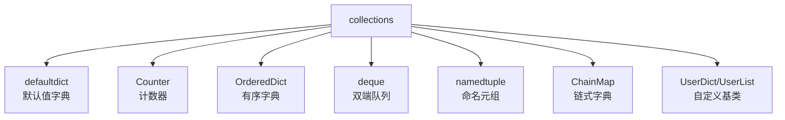

`collections` 模块提供了 Python 内置数据结构（dict、list、set、tuple）的高级变体，解决特定的使用场景。



## 8.1 defaultdict

**是什么：** 普通 `dict` 访问不存在的 key 会抛 `KeyError`，`defaultdict` 会自动创建默认值。

```python
from collections import defaultdict

 普通字典的问题
d = {}
 d['count'] += 1  # KeyError!

 defaultdict 解决方案
d = defaultdict(int)  # 默认值工厂为 int（即 0）
d['count'] += 1
print(d)  # defaultdict(<class 'int'>, {'count': 1})

d['another'] += 5
print(d)  # defaultdict(<class 'int'>, {'count': 1, 'another': 5})

 ========== 常用场景：按类别分组 ==========
students = [
    ('class_a', '张三'), ('class_b', '李四'),
    ('class_a', '王五'), ('class_b', '赵六'),
    ('class_a', '钱七'),
]

groups = defaultdict(list)
for class_name, name in students:
    groups[class_name].append(name)

print(dict(groups))
 {'class_a': ['张三', '王五', '钱七'], 'class_b': ['李四', '赵六']}

 ========== 常用默认值工厂 ==========
d1 = defaultdict(int)      # 数字默认 0
d2 = defaultdict(float)    # 浮点默认 0.0
d3 = defaultdict(str)      # 字符串默认 ''
d4 = defaultdict(list)     # 列表默认 []
d5 = defaultdict(dict)     # 字典默认 {}
d6 = defaultdict(lambda: 'N/A')  # 自定义默认值

print(d6['unknown'])  # 'N/A'
```

:::tip defaultdict 原理
`defaultdict` 的构造函数接受一个"默认值工厂"（callable）。当访问不存在的 key 时，它会调用这个工厂函数创建默认值并存入字典。本质是 `__missing__` 方法的实现。
:::

## 8.2 Counter

```python
from collections import Counter

 ========== 创建 Counter ==========
c = Counter('abracadabra')
print(c)
 Counter({'a': 5, 'b': 2, 'r': 2, 'c': 1, 'd': 1})

c = Counter(['apple', 'banana', 'apple', 'cherry', 'banana', 'apple'])
print(c)
 Counter({'apple': 3, 'banana': 2, 'cherry': 1})

 ========== most_common：最常见的元素 ==========
c = Counter('abracadabra')
print(c.most_common(2))  # [('a', 5), ('b', 2)]
print(c.most_common())   # 所有元素按频率降序

 ========== 计数操作 ==========
c = Counter(a=3, b=1)
c['a'] += 1
print(c)  # Counter({'a': 4, 'b': 1})

 update：批量计数
c.update('aabbc')
print(c)  # Counter({'a': 6, 'b': 3, 'c': 1})

 ========== 算术运算 ==========
c1 = Counter(a=3, b=1, c=2)
c2 = Counter(a=1, b=2, d=3)

print(c1 + c2)   # Counter({'a': 4, 'b': 3, 'd': 3, 'c': 2})
print(c1 - c2)   # Counter({'a': 2, 'c': 2})  负数被忽略
print(c1 & c2)   # Counter({'a': 1, 'b': 1})  取最小值
print(c1 | c2)   # Counter({'a': 3, 'b': 2, 'c': 2, 'd': 3})  取最大值

 ========== elements()：展开为迭代器 ==========
c = Counter(a=3, b=1)
print(list(c.elements()))  # ['a', 'a', 'a', 'b']
```

## 8.3 OrderedDict

```python
from collections import OrderedDict

 Python 3.7+ 的 dict 已经保证插入顺序
 那 OrderedDict 还有什么用？

 1. move_to_end / popitem(last=False) —— 普通字典没有
od = OrderedDict([('a', 1), ('b', 2), ('c', 3)])
od.move_to_end('a')  # 把 'a' 移到末尾
print(list(od.keys()))  # ['b', 'c', 'a']

od.move_to_end('c', last=False)  # 把 'c' 移到开头
print(list(od.keys()))  # ['c', 'b', 'a']

od.popitem(last=False)  # 弹出第一个
print(od)  # OrderedDict([('b', 2), ('a', 1)])

 2. 相等性比较考虑顺序
 普通 dict：{'a': 1, 'b': 2} == {'b': 2, 'a': 1}  → True
 OrderedDict：考虑顺序
od1 = OrderedDict([('a', 1), ('b', 2)])
od2 = OrderedDict([('b', 2), ('a', 1)])
print(od1 == od2)  # False（顺序不同）
```

## 8.4 deque

```python
from collections import deque

 ========== 双端队列：两端都是 O(1) ==========
 list 在头部插入/删除是 O(n)，deque 是 O(1)

d = deque([1, 2, 3])
d.append(4)       # 右端添加 → deque([1, 2, 3, 4])
d.appendleft(0)   # 左端添加 → deque([0, 1, 2, 3, 4])
d.pop()           # 右端弹出 → 返回 4
d.popleft()       # 左端弹出 → 返回 0

 ========== maxlen：固定长度队列 ==========
 超出长度时自动丢弃另一端
d = deque(maxlen=3)
d.extend([1, 2, 3])  # deque([1, 2, 3])
d.append(4)           # deque([2, 3, 4])  ← 1 被丢弃
d.appendleft(0)       # deque([0, 2, 3])  ← 4 被丢弃

 ========== rotate：旋转 ==========
d = deque([1, 2, 3, 4, 5])
d.rotate(2)    # 向右旋转2步 → deque([4, 5, 1, 2, 3])
d.rotate(-1)   # 向左旋转1步 → deque([5, 1, 2, 3, 4])

 ========== 实战：最近 N 条记录 ==========
recent_logs = deque(maxlen=100)
recent_logs.append('log1')
recent_logs.append('log2')
 始终只保留最近 100 条
```

## 8.5 namedtuple

```python
from collections import namedtuple

 ========== 创建命名元组 ==========
Point = namedtuple('Point', ['x', 'y'])
p = Point(3, 4)

 像元组一样访问
print(p[0], p[1])  # 3 4

 像对象一样访问（更可读！）
print(p.x, p.y)    # 3 4

 不可变（安全）
 p.x = 5  # AttributeError

 ========== _make：从可迭代对象创建 ==========
Point = namedtuple('Point', ['x', 'y'])
p = Point._make([3, 4])  # 等同于 Point(3, 4)
print(p)  # Point(x=3, y=4)

 ========== _asdict：转为字典 ==========
print(p._asdict())  # {'x': 3, 'y': 4}

 ========== _fields：字段列表 ==========
print(Point._fields)  # ('x', 'y')

 ========== 默认值 ==========
Point = namedtuple('Point', ['x', 'y'], defaults=[0, 0])
print(Point())  # Point(x=0, y=0)
print(Point(3))  # Point(x=3, y=0)

 ========== 实战：函数返回多个值 ==========
def get_user_stats():
    UserStats = namedtuple('UserStats', ['total', 'active', 'banned'])
    return UserStats._make([1000, 850, 15])

stats = get_user_stats()
print(f'总用户: {stats.total}, 活跃: {stats.active}, 封禁: {stats.banned}')
 总用户: 1000, 活跃: 850, 封禁: 15
```

## 8.6 ChainMap

**是什么：** 把多个字典"链"在一起，按顺序查找 key。修改操作只影响第一个字典。

```python
from collections import ChainMap

defaults = {'color': 'red', 'size': 'M', 'theme': 'dark'}
user_config = {'color': 'blue', 'size': 'L'}
cli_args = {'theme': 'light'}

 查找优先级：cli_args > user_config > defaults
config = ChainMap(cli_args, user_config, defaults)

print(config['color'])  # 'blue'（来自 user_config）
print(config['theme'])  # 'light'（来自 cli_args）
print(config['size'])   # 'L'（来自 user_config）

 修改只影响第一个字典
config['color'] = 'green'
print(cli_args)  # {'theme': 'light', 'color': 'green'}  ← 被修改了
print(user_config)  # {'color': 'blue', 'size': 'L'}  ← 没变

 maps 属性查看所有字典
print(list(config.maps))
 [{'theme': 'light', 'color': 'green'}, {'color': 'blue', 'size': 'L'}, {'color': 'red', 'size': 'M', 'theme': 'dark'}]

 ========== 典型场景：配置优先级 ==========
 命令行参数 > 环境变量 > 配置文件 > 默认值
```

## 8.7 UserDict / UserList / UserString

```python
from collections import UserDict, UserList, UserString

 ========== 什么时候用？==========
 当你想自定义 dict/list/string 的行为时。
 直接继承 dict 可能有问题，因为 dict 的某些方法在 C 层实现，
 子类重写的方法可能不被调用。UserDict 是纯 Python 实现，更安全。

class LowerCaseDict(UserDict):
    """所有 key 自动转小写的字典"""
    def __setitem__(self, key, value):
        super().__setitem__(key.lower(), value)

    def __getitem__(self, key):
        return super().__getitem__(key.lower())

d = LowerCaseDict()
d['Name'] = '张三'
d['AGE'] = 25
print(d['name'])  # '张三'
print(d['age'])   # 25
print(dict(d))    # {'name': '张三', 'age': 25}
```

## 8.8 实战案例

```python
from collections import Counter, defaultdict, deque

 ========== 词频统计 ==========
text = 'the quick brown fox jumps over the lazy dog the fox was quick'
words = text.split()
freq = Counter(words)
print(freq.most_common(5))
 [('the', 4), ('fox', 2), ('quick', 2), ('brown', 1), ('jumps', 1)]

 ========== 图的邻接表 ==========
graph = defaultdict(list)
edges = [('A', 'B'), ('A', 'C'), ('B', 'D'), ('C', 'D'), ('D', 'E')]
for src, dst in edges:
    graph[src].append(dst)

print(dict(graph))
 {'A': ['B', 'C'], 'B': ['D'], 'C': ['D'], 'D': ['E']}

 ========== 滑动窗口最大值（deque 的经典应用）==========
def max_sliding_window(nums: list, k: int) -> list:
    """滑动窗口最大值"""
    from collections import deque
    result = []
    window = deque()  # 存索引，保持递减顺序

    for i, num in enumerate(nums):
        while window and nums[window[-1]] < num:
            window.pop()
        window.append(i)
        if window[0] <= i - k:
            window.popleft()
        if i >= k - 1:
            result.append(nums[window[0]])

    return result

print(max_sliding_window([1, 3, -1, -3, 5, 3, 6, 7], 3))
 [3, 3, 5, 5, 6, 7]
```

## 8.9 练习题

**1.** 用 `Counter` 统计字符串 `"abracadabra"` 中每个字符出现的次数，找出出现最多的 3 个字符。


**参考答案**

```python
from collections import Counter
c = Counter('abracadabra')
print(c.most_common(3))
 [('a', 5), ('b', 2), ('r', 2)]
```


**2.** 用 `defaultdict` 实现单词长度分组：`['hello', 'world', 'hi', 'python', 'go', 'java']`。


**参考答案**

```python
from collections import defaultdict
words = ['hello', 'world', 'hi', 'python', 'go', 'java']
groups = defaultdict(list)
for w in words:
    groups[len(w)].append(w)
print(dict(groups))
 {5: ['hello', 'world', 'python'], 2: ['hi', 'go'], 4: ['java']}
```


**3.** 用 `namedtuple` 表示一个学生（姓名、年龄、成绩），并实现按成绩排序。


**参考答案**

```python
from collections import namedtuple
Student = namedtuple('Student', ['name', 'age', 'score'])
students = [Student('张三', 20, 85), Student('李四', 21, 92), Student('王五', 20, 78)]
sorted_students = sorted(students, key=lambda s: s.score, reverse=True)
for s in sorted_students:
    print(s)
 Student(name='李四', age=21, score=92)
 Student(name='张三', age=20, score=85)
 Student(name='王五', age=20, score=78)
```


**4.** 用 `deque(maxlen=5)` 实现一个简单的最近访问记录。


**参考答案**

```python
from collections import deque
history = deque(maxlen=5)
for page in ['首页', '关于', '产品', '博客', '联系', '首页', '产品']:
    history.append(page)
print(list(history))  # ['博客', '联系', '首页', '产品']  → 只保留最后5个
```


---