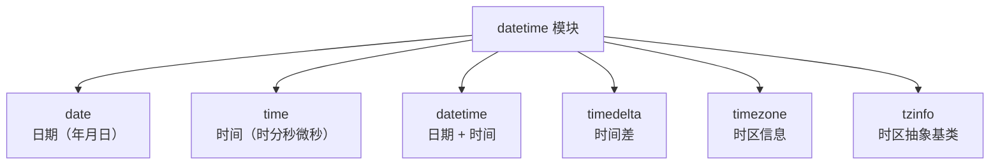

Java 有 `java.time.LocalDate` / `LocalDateTime`（Java 8+），Python 有 `datetime` 模块。两者设计思路类似，但 Python 的时区处理更底层一些。

## 3.1 基础类型



```python
from datetime import date, time, datetime, timedelta

 ========== date：只有日期 ==========
today = date.today()
print(today)
 2026-04-07

d = date(2026, 4, 7)
print(d.year, d.month, d.day)
 2026 4 7

print(d.weekday())    # 0=周一 ... 6=周日 → 1
print(d.isoweekday()) # 1=周一 ... 7=周日 → 2

 ========== time：只有时间 ==========
t = time(14, 30, 0, 123456)  # 时, 分, 秒, 微秒
print(t)
 14:30:00.123456
print(t.hour, t.minute, t.second, t.microsecond)
 14 30 0 123456

 ========== datetime：日期 + 时间 ==========
now = datetime.now()   # 当前时间（本地时区，naive）
print(now)
 2026-04-07 09:45:00.123456

dt = datetime(2026, 4, 7, 14, 30, 0)
print(dt)
 2026-04-07 14:30:00

 ========== timedelta：时间差 ==========
delta = timedelta(days=7, hours=3, minutes=30)
print(delta)
 7 days, 3:30:00
print(delta.total_seconds())  # 总秒数
 617400.0
```

## 3.2 datetime 的多种创建方式

```python
from datetime import datetime, date, time

 1. 直接构造
dt1 = datetime(2026, 4, 7, 14, 30)

 2. 当前时间
dt2 = datetime.now()          # 本地时间（naive，无时区信息）
dt3 = datetime.utcnow()       # UTC 时间（naive，已弃用，用下面替代）
from datetime import timezone
dt4 = datetime.now(timezone.utc)  # UTC 时间（aware，有时区信息）

 3. 从时间戳创建
import time
timestamp = time.time()
dt5 = datetime.fromtimestamp(timestamp)    # 本地时间
dt6 = datetime.utcfromtimestamp(timestamp) # UTC 时间（已弃用）

 4. 从 date 和 time 组合
dt7 = datetime.combine(date(2026, 4, 7), time(14, 30))

 5. 从字符串解析
dt8 = datetime.strptime('2026-04-07 14:30:00', '%Y-%m-%d %H:%M:%S')

 6. 从 date 转换
dt9 = datetime.fromordinal(date(2026, 4, 7).toordinal())

 7. ISO 格式字符串
dt10 = datetime.fromisoformat('2026-04-07T14:30:00')
```

## 3.3 strftime 格式化（完整格式符表）

```python
from datetime import datetime

now = datetime(2026, 4, 7, 14, 30, 45, 123456)

print(now.strftime('%Y-%m-%d %H:%M:%S'))
 2026-04-07 14:30:45

print(now.strftime('%A, %B %d, %Y'))
 Tuesday, April 07, 2026

print(now.isoformat())
 2026-04-07T14:30:45.123456
```

**完整格式符表：**

| 格式符 | 含义 | 示例 |
|--------|------|------|
| `%Y` | 四位年份 | 2026 |
| `%y` | 两位年份 | 26 |
| `%m` | 月份（零填充） | 04 |
| `%B` | 月份全名 | April |
| `%b` | 月份缩写 | Apr |
| `%d` | 日（零填充） | 07 |
| `%a` | 星期缩写 | Tue |
| `%A` | 星期全名 | Tuesday |
| `%w` | 星期（0=周日） | 2 |
| `%j` | 一年中的第几天 | 097 |
| `%U` | 一年中的第几周（周日起始） | 14 |
| `%W` | 一年中的第几周（周一起始） | 14 |
| `%H` | 小时（24h，零填充） | 14 |
| `%I` | 小时（12h，零填充） | 02 |
| `%p` | AM/PM | PM |
| `%M` | 分钟（零填充） | 30 |
| `%S` | 秒（零填充） | 45 |
| `%f` | 微秒（6位） | 123456 |
| `%z` | UTC 偏移 | +0800 |
| `%Z` | 时区名 | CST |
| `%c` | 本地日期时间 | Tue Apr 07 14:30:45 2026 |
| `%x` | 本地日期 | 04/07/26 |
| `%X` | 本地时间 | 14:30:45 |
| `%%` | 百分号本身 | % |

## 3.4 strptime 解析

```python
from datetime import datetime

 将字符串解析为 datetime 对象
dt1 = datetime.strptime('2026-04-07', '%Y-%m-%d')
print(dt1)  # 2026-04-07 00:00:00

dt2 = datetime.strptime('07/Apr/2026:14:30:45', '%d/%b/%Y:%H:%M:%S')
print(dt2)  # 2026-04-07 14:30:45

 解析失败会抛出 ValueError
try:
    dt = datetime.strptime('2026-13-01', '%Y-%m-%d')
except ValueError as e:
    print(f'解析失败: {e}')
 解析失败: month must be in 1..12
```

## 3.5 时区处理

```python
from datetime import datetime, timezone, timedelta
from zoneinfo import ZoneInfo  # Python 3.9+

 ========== naive vs aware datetime ==========
naive = datetime.now()  # naive：无时区信息
print(naive.tzinfo)     # None

aware = datetime.now(timezone.utc)  # aware：有时区信息
print(aware.tzinfo)     # UTC

 ========== 时区转换 ==========
 创建带时区的 datetime
utc_time = datetime(2026, 4, 7, 6, 0, tzinfo=timezone.utc)
print(utc_time)
 2026-04-07 06:00:00+00:00

 转换为北京时间
bj_time = utc_time.astimezone(ZoneInfo('Asia/Shanghai'))
print(bj_time)
 2026-04-07 14:00:00+08:00

 转换为纽约时间
ny_time = utc_time.astimezone(ZoneInfo('America/New_York'))
print(ny_time)
 2026-04-07 02:00:00-04:00

 ========== 固定偏移时区 ==========
bj_tz = timezone(timedelta(hours=8))  # UTC+8
bj = datetime.now(bj_tz)
print(bj)
 2026-04-07 14:30:00+08:00

 ========== ZoneInfo（推荐，支持 DST 夏令时）==========
 pip install tzdata  # Windows 需要
shanghai = ZoneInfo('Asia/Shanghai')
tokyo = ZoneInfo('Asia/Tokyo')

now_bj = datetime.now(shanghai)
now_tokyo = now_bj.astimezone(tokyo)
print(f'北京: {now_bj:%H:%M} | 东京: {now_tokyo:%H:%M}')
 北京: 14:30 | 东京: 15:30
```

:::warning naive vs aware
- **naive datetime**（`tzinfo=None`）：不包含时区信息，不知道它在哪个时区。`datetime.now()` 返回的就是 naive。
- **aware datetime**：包含时区信息，可以进行时区转换。
- **规则：** 永远不要把 naive datetime 当作 UTC 或本地时间来用。要么全部用 aware，要么明确标注含义。
- **Java 对比：** Java 的 `LocalDateTime` 是 naive，`ZonedDateTime` 是 aware。
:::

## 3.6 时间戳互转

```python
from datetime import datetime, timezone
import time

 当前时间戳（秒级浮点数）
ts = time.time()
print(ts)
 1743988800.123

 时间戳 → datetime
dt = datetime.fromtimestamp(ts, tz=timezone.utc)
print(dt)
 2026-04-07 02:00:00.123000+00:00

 datetime → 时间戳
ts_back = dt.timestamp()
print(ts_back)
 1743988800.123

 注意：naive datetime 的 timestamp() 假设是本地时间
naive_dt = datetime(2026, 4, 7, 10, 0)
print(naive_dt.timestamp())  # 基于系统时区计算，可能不是你预期的值
```

## 3.7 时间计算

```python
from datetime import datetime, timedelta

now = datetime(2026, 4, 7, 10, 0, 0)

 timedelta 详解
print(now + timedelta(days=7))           # 2026-04-14 10:00:00
print(now + timedelta(hours=3))          # 2026-04-07 13:00:00
print(now + timedelta(minutes=-30))      # 2026-04-07 09:30:00
print(now + timedelta(weeks=2))          # 2026-04-21 10:00:00
print(now + timedelta(days=1, hours=2))  # 2026-04-08 12:00:00

 两个 datetime 相减得到 timedelta
dt1 = datetime(2026, 4, 10)
dt2 = datetime(2026, 3, 1)
diff = dt1 - dt2
print(diff.days)            # 40
print(diff.total_seconds()) # 3456000.0

 relativedelta（更强大的日期计算）
 pip install python-dateutil
from dateutil.relativedelta import relativedelta

now = datetime(2026, 4, 7)
print(now + relativedelta(months=1))     # 2026-05-07 00:00:00
print(now + relativedelta(months=-1))    # 2026-03-07 00:00:00
print(now + relativedelta(years=1))      # 2027-04-07 00:00:00
print(now + relativedelta(months=3, days=-1))  # 2026-07-06 00:00:00
```

:::tip timedelta vs relativedelta
- `timedelta` 只能处理天、秒、微秒。不能处理月、年（因为它们长度不固定）。
- `relativedelta`（来自 dateutil）可以处理月、年。`months=1` 就是下个月的同一天。
- Java 中 `Period` 对应 relativedelta，`Duration` 对应 timedelta。
:::

## 3.8 日期范围生成

```python
from datetime import date, timedelta

def date_range(start: date, end: date):
    """生成日期范围（包含 end）"""
    current = start
    while current <= end:
        yield current
        current += timedelta(days=1)

 使用
for d in date_range(date(2026, 4, 1), date(2026, 4, 7)):
    print(d.strftime('%Y-%m-%d %a'))
 2026-04-01 Wed
 2026-04-02 Thu
 2026-04-03 Fri
 2026-04-04 Sat
 2026-04-05 Sun
 2026-04-06 Mon
 2026-04-07 Tue
```

## 3.9 业务场景

### 计算年龄

```python
from datetime import date
from dateutil.relativedelta import relativedelta

def calculate_age(birth_date: date) -> int:
    """精确计算年龄"""
    today = date.today()
    age = relativedelta(today, birth_date)
    return age.years

print(calculate_age(date(1995, 6, 15)))
 30
```

### 判断闰年

```python
from datetime import date

def is_leap_year(year: int) -> bool:
    """判断闰年：能被4整除但不能被100整除，或能被400整除"""
    return (year % 4 == 0 and year % 100 != 0) or (year % 400 == 0)

 或者利用 datetime 的 2 月天数
def is_leap_year_v2(year: int) -> bool:
    return date(year, 3, 1) - date(year, 2, 1) == timedelta(days=29)

from datetime import timedelta

print(is_leap_year(2024))  # True
print(is_leap_year(2023))  # False
print(is_leap_year(1900))  # False（能被100整除但不能被400整除）
print(is_leap_year(2000))  # True（能被400整除）
```

### 计算工作日

```python
from datetime import date, timedelta

def count_workdays(start: date, end: date) -> int:
    """计算两个日期之间的工作日数量（不含周末）"""
    count = 0
    current = start
    while current <= end:
        if current.weekday() < 5:  # 0-4 = 周一到周五
            count += 1
        current += timedelta(days=1)
    return count

print(count_workdays(date(2026, 4, 1), date(2026, 4, 30)))
 22
```

## 3.10 Java LocalDate/LocalDateTime 对比

| 操作 | Java | Python |
|------|------|--------|
| 当前日期 | `LocalDate.now()` | `date.today()` |
| 当前日期时间 | `LocalDateTime.now()` | `datetime.now()` |
| 创建 | `LocalDate.of(2026, 4, 7)` | `date(2026, 4, 7)` |
| 格式化 | `dt.format(DateTimeFormatter.ofPattern("yyyy-MM-dd"))` | `dt.strftime('%Y-%m-%d')` |
| 解析 | `LocalDate.parse("2026-04-07")` | `datetime.strptime('2026-04-07', '%Y-%m-%d')` |
| 时间差 | `Period.between(d1, d2)` | `relativedelta(d1, d2)` |
| 时间加减 | `dt.plusDays(7)` | `dt + timedelta(days=7)` |
| 时区转换 | `dt.atZone(ZoneId.of("Asia/Shanghai"))` | `dt.astimezone(ZoneInfo('Asia/Shanghai'))` |
| 时间戳 | `dt.toEpochSecond()` | `dt.timestamp()` |
| 周几 | `dt.getDayOfWeek().getValue()` | `dt.weekday()` (0=Mon) |

## 3.11 练习题

**1.** 获取当前日期，分别用两种格式输出：`2026年04月07日` 和 `Tuesday, April 07, 2026`。


**参考答案**

```python
from datetime import date
today = date.today()
print(today.strftime('%Y年%m月%d日'))
print(today.strftime('%A, %B %d, %Y'))
```


**2.** 计算从你的生日到今天的天数。


**参考答案**

```python
from datetime import date
birthday = date(1995, 6, 15)
print((date.today() - birthday).days)  # 11200 左右
```


**3.** 将 UTC 时间 `2026-04-07T06:00:00Z` 转换为东京时间。


**参考答案**

```python
from datetime import datetime, timezone
from zoneinfo import ZoneInfo

utc = datetime(2026, 4, 7, 6, 0, tzinfo=timezone.utc)
tokyo = utc.astimezone(ZoneInfo('Asia/Tokyo'))
print(tokyo.strftime('%Y-%m-%d %H:%M:%S %Z'))
 2026-04-07 15:00:00 JST
```


**4.** 生成 2026 年所有月份的第一天。


**参考答案**

```python
from datetime import date

for month in range(1, 13):
    d = date(2026, month, 1)
    print(d.strftime('%Y-%m-%d %a'))
```


**5.** 写一个函数，输入日期字符串（格式不确定），自动尝试常见格式解析。


**参考答案**

```python
from datetime import datetime

def parse_date_flexible(s: str) -> datetime:
    formats = [
        '%Y-%m-%d %H:%M:%S',
        '%Y-%m-%d',
        '%Y/%m/%d',
        '%d/%m/%Y',
        '%Y年%m月%d日',
        '%Y%m%d',
    ]
    for fmt in formats:
        try:
            return datetime.strptime(s, fmt)
        except ValueError:
            continue
    raise ValueError(f'无法解析日期: {s}')

print(parse_date_flexible('2026-04-07'))
print(parse_date_flexible('2026/04/07'))
print(parse_date_flexible('2026年04月07日'))
```


---