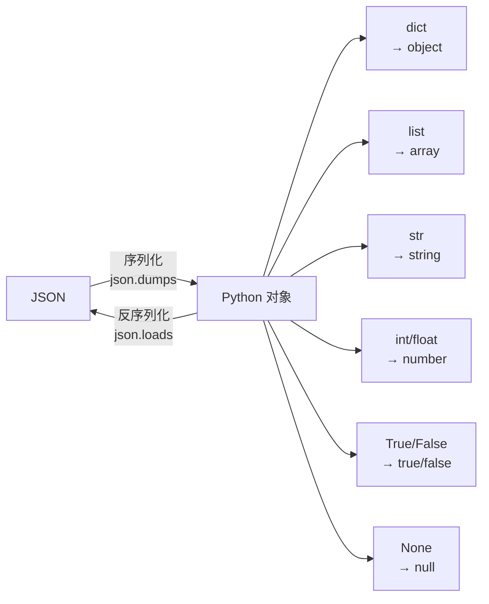

JSON（JavaScript Object Notation）是互联网最常用的数据交换格式。Python 的 `json` 模块是标准库的一部分，不需要额外安装。

## 5.1 JSON 格式基础



**JSON vs Python 类型映射表：**

| JSON | Python |
|------|--------|
| object `{}` | `dict` |
| array `[]` | `list` |
| string `"..."` | `str` |
| number (int) | `int` |
| number (float) | `float` |
| true | `True` |
| false | `False` |
| null | `None` |

## 5.2 json.dumps 详解

```python
import json

 ========== 基本用法 ==========
data = {'name': '张三', 'age': 25, 'active': True, 'score': None}
print(json.dumps(data))
 {"name": "\u5f20\u4e09", "age": 25, "active": true, "score": null}

 ========== ensure_ascii=False（中文友好）==========
print(json.dumps(data, ensure_ascii=False))
 {"name": "张三", "age": 25, "active": true, "score": null}

 ========== indent（美化输出）==========
print(json.dumps(data, ensure_ascii=False, indent=2))
 {
   "name": "张三",
   "age": 25,
   "active": true,
   "score": null
 }

 ========== sort_keys（按键排序）==========
print(json.dumps({'c': 3, 'a': 1, 'b': 2}, sort_keys=True))
 {"a": 1, "b": 2, "c": 3}

 ========== separators（自定义分隔符）==========
 紧凑格式（最小化 JSON 大小）
compact = json.dumps(data, separators=(',', ':'))
print(compact)
 {"name":"\u5f20\u4e09","age":25,"active":true,"score":null}

 默认分隔符：(', ', ': ')
 紧凑分隔符：(',', ':')

 ========== default（处理不可序列化的类型）==========
from datetime import datetime

data = {'time': datetime(2026, 4, 7, 14, 30)}
 json.dumps(data)  # TypeError: Object of type datetime is not JSON serializable

 解决方案 1：default 函数
def default_converter(obj):
    if isinstance(obj, datetime):
        return obj.isoformat()
    raise TypeError(f'Object of type {type(obj)} is not JSON serializable')

print(json.dumps(data, default=default_converter))
 {"time": "2026-04-07T14:30:00"}

 解决方案 2：自定义 JSONEncoder
class CustomEncoder(json.JSONEncoder):
    def default(self, obj):
        if isinstance(obj, datetime):
            return obj.isoformat()
        if isinstance(obj, set):
            return list(obj)
        return super().default(obj)

print(json.dumps(data, cls=CustomEncoder))
 {"time": "2026-04-07T14:30:00"}
```

## 5.3 json.loads 详解

```python
import json

 基本解析
json_str = '{"name": "张三", "age": 25, "active": true}'
data = json.loads(json_str)
print(type(data))  # <class 'dict'>
print(data)
 {'name': '张三', 'age': 25, 'active': True}

 解析数组
json_arr = '[1, 2, 3, "hello", true, null]'
arr = json.loads(json_arr)
print(arr)
 [1, 2, 3, 'hello', True, None]

 解析失败
try:
    json.loads('{"invalid"}')
except json.JSONDecodeError as e:
    print(f'JSON 解析错误: {e}')
 JSON 解析错误: Expecting property name enclosed in double quotes: line 1 column 2 (char 1)
```

## 5.4 json.dump/load 文件操作

```python
import json

data = {'users': [{'name': '张三', 'age': 25}, {'name': '李四', 'age': 30}]}

 ========== 写入 JSON 文件 ==========
with open('data.json', 'w', encoding='utf-8') as f:
    json.dump(data, f, ensure_ascii=False, indent=2)

 data.json 文件内容：
 {
   "users": [
     {
       "name": "张三",
       "age": 25
     },
     {
       "name": "李四",
       "age": 30
     }
   ]
 }

 ========== 读取 JSON 文件 ==========
with open('data.json', 'r', encoding='utf-8') as f:
    loaded = json.load(f)
print(loaded)
 {'users': [{'name': '张三', 'age': 25}, {'name': '李四', 'age': 30}]}
```

## 5.5 自定义反序列化（JSONDecoder）

```python
import json
from datetime import datetime

 方案：在 loads 后手动转换
json_str = '{"name": "张三", "created_at": "2026-04-07T14:30:00"}'
data = json.loads(json_str)
data['created_at'] = datetime.fromisoformat(data['created_at'])
print(type(data['created_at']))  # <class 'datetime.datetime'>

 方案：使用 object_hook
def datetime_hook(d):
    for k, v in d.items():
        if isinstance(v, str) and v.endswith('Z'):
            d[k] = datetime.fromisoformat(v.replace('Z', '+00:00'))
    return d

data = json.loads('{"time": "2026-04-07T14:30:00Z"}', object_hook=datetime_hook)
print(type(data['time']))  # <class 'datetime.datetime'>
```

## 5.6 大文件 JSON 处理

:::warning 不要用 json.load 加载大文件
一个 1GB 的 JSON 文件会吃掉 ~3GB 内存。大文件应该逐行处理。
:::

```python
import json

 ========== JSON Lines 格式（.jsonl）==========
 每行一个 JSON 对象
 {"name": "张三", "age": 25}
 {"name": "李四", "age": 30}

 逐行读取（内存友好）
with open('data.jsonl', 'r', encoding='utf-8') as f:
    for line in f:
        record = json.loads(line)
        print(record['name'])

 ========== ijson 库（流式解析大 JSON）==========
 pip install ijson
import ijson

 流式解析，只提取需要的字段
with open('large.json', 'r') as f:
    users = ijson.items(f, 'users.item')  # 只提取 users 数组的每个元素
    for user in users:
        print(user['name'])  # 不会把整个文件加载到内存
```

## 5.7 实战：API 数据解析

```python
import json

 模拟 API 响应
api_response = '''
{
    "code": 200,
    "message": "success",
    "data": {
        "total": 3,
        "items": [
            {"id": 1, "title": "Python 入门", "price": 99.9},
            {"id": 2, "title": "Java 高级", "price": 129.0},
            {"id": 3, "title": "Go 并发", "price": 89.5}
        ]
    }
}
'''

resp = json.loads(api_response)

if resp['code'] == 200:
    for item in resp['data']['items']:
        print(f"[{item['id']}] {item['title']} - ¥{item['price']}")
 [1] Python 入门 - ¥99.9
 [2] Java 高级 - ¥129.0
 [3] Go 并发 - ¥89.5

 实战：配置文件管理
config = {
    'database': {
        'host': 'localhost',
        'port': 5432,
        'name': 'mydb'
    },
    'server': {
        'host': '0.0.0.0',
        'port': 8080,
        'debug': False
    }
}

 保存配置
with open('config.json', 'w', encoding='utf-8') as f:
    json.dump(config, f, ensure_ascii=False, indent=2)

 读取配置
with open('config.json', 'r', encoding='utf-8') as f:
    config = json.load(f)

print(f"数据库: {config['database']['host']}:{config['database']['port']}")
 数据库: localhost:5432
```

## 5.8 Java Jackson/Gson 对比

| 操作 | Jackson | Gson | Python json |
|------|---------|------|-------------|
| 序列化 | `new ObjectMapper().writeValueAsString(obj)` | `new Gson().toJson(obj)` | `json.dumps(obj)` |
| 反序列化 | `mapper.readValue(json, MyClass.class)` | `new Gson().fromJson(json, MyClass.class)` | `json.loads(json)` → dict |
| 注解 | `@JsonProperty`, `@JsonIgnore` | `@SerializedName` | 无注解（直接操作 dict） |
| 类型映射 | POJO ↔ JSON | POJO ↔ JSON | dict ↔ JSON |
| 日期处理 | `JavaTimeModule` + `@JsonFormat` | 自定义 `JsonSerializer` | `default` 参数 |
| 流式处理 | `JsonParser` / `JsonGenerator` | `JsonReader` / `JsonWriter` | `ijson` 库 |

:::tip Java vs Python 的 JSON 哲学
Java 倾向于把 JSON 映射到 POJO（强类型），Python 倾向于直接用 dict（动态类型）。Python 不需要为每个 JSON 结构定义类，但代价是失去编译时类型检查。可以用 `TypedDict`（见第 9 节）弥补。
:::

---