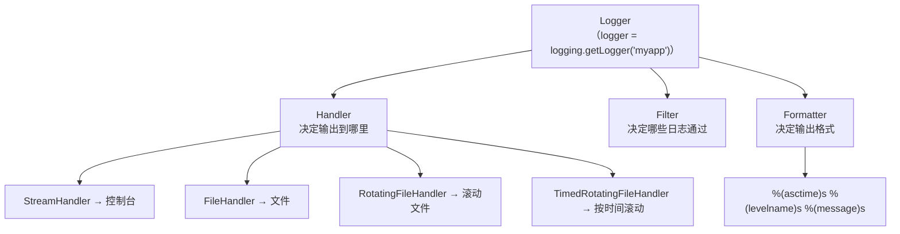

## 7.1 为什么不用 print？

| 维度 | print | logging |
|------|-------|---------|
| 级别控制 | 无 | DEBUG/INFO/WARNING/ERROR/CRITICAL |
| 输出目标 | 只能 stdout | 文件、网络、邮件、自定义 |
| 格式化 | 手动拼接 | 自动格式化（时间、级别、文件名、行号） |
| 过滤 | 无 | 按级别、模块、自定义条件过滤 |
| 线程安全 | 否 | 是 |
| 性能 | 直接输出 | 可缓冲、异步 |
| 生产环境 | 不推荐 | 标准做法 |

## 7.2 日志级别

```python
import logging

 设置日志级别（只输出该级别及以上的日志）
logging.basicConfig(level=logging.DEBUG)

logging.debug('调试信息：变量 x = 42')       # 级别 10
logging.info('普通信息：服务已启动')          # 级别 20
logging.warning('警告：内存使用率超过 80%')   # 级别 30
logging.error('错误：数据库连接失败')         # 级别 40
logging.critical('严重：服务崩溃！')           # 级别 50
```

**什么时候用哪个级别：**

| 级别 | 数值 | 场景 | 示例 |
|------|------|------|------|
| DEBUG | 10 | 开发调试，生产环境关闭 | `变量值: x=42, y=100` |
| INFO | 20 | 正常业务流程 | `用户登录成功`, `订单创建` |
| WARNING | 30 | 不影响运行但需关注 | `配置文件使用默认值`, `磁盘空间不足` |
| ERROR | 40 | 功能异常但服务可继续 | `API 调用失败，重试中` |
| CRITICAL | 50 | 严重故障，服务可能不可用 | `数据库不可用`, `OOM` |

## 7.3 basicConfig 所有参数

```python
import logging

logging.basicConfig(
    level=logging.DEBUG,                  # 日志级别
    format='%(asctime)s - %(name)s - %(levelname)s - %(message)s',  # 格式
    datefmt='%Y-%m-%d %H:%M:%S',         # 时间格式
    filename='app.log',                   # 输出到文件（不设置则输出到 stderr）
    filemode='a',                         # 文件模式：a=追加, w=覆盖
    encoding='utf-8',                     # 文件编码（Python 3.9+）
    force=True,                           # 强制重新配置（清除已有 handlers）
)

logging.info('这是一条日志')
 app.log 文件内容：2026-04-07 10:00:00 - root - INFO - 这是一条日志
```

:::warning basicConfig 只能调用一次
`basicConfig` 只在第一次调用时生效（根 Logger 没有 Handler 时）。如果需要重新配置，设置 `force=True`。复杂项目推荐用 `dictConfig`。
:::

## 7.4 Logger / Handler / Formatter / Filter 架构



```python
import logging

 ========== 获取 Logger ==========
logger = logging.getLogger('myapp')  # 不同于 root logger
logger.setLevel(logging.DEBUG)

 ========== 创建 Handler ==========
 控制台 Handler
console_handler = logging.StreamHandler()
console_handler.setLevel(logging.INFO)

 文件 Handler
file_handler = logging.FileHandler('app.log', encoding='utf-8')
file_handler.setLevel(logging.DEBUG)

 ========== 创建 Formatter ==========
formatter = logging.Formatter(
    '%(asctime)s - %(name)s - %(levelname)s - %(filename)s:%(lineno)d - %(message)s'
)
console_handler.setFormatter(formatter)
file_handler.setFormatter(formatter)

 ========== 添加 Handler 到 Logger ==========
logger.addHandler(console_handler)
logger.addHandler(file_handler)

 ========== 使用 ==========
logger.debug('只在文件里看到')
logger.info('控制台和文件都能看到')
logger.error('出错了！')
```

## 7.5 多种 Handler

```python
import logging
from logging.handlers import RotatingFileHandler, TimedRotatingFileHandler

 ========== RotatingFileHandler：按大小滚动 ==========
 每个文件最大 10MB，保留 5 个备份
handler = RotatingFileHandler(
    'app.log',
    maxBytes=10 * 1024 * 1024,  # 10MB
    backupCount=5,              # 保留 5 个备份文件
    encoding='utf-8'
)
 文件滚动顺序：app.log → app.log.1 → app.log.2 → ... → app.log.5（最旧的被删）

 ========== TimedRotatingFileHandler：按时间滚动 ==========
 每天午夜滚动
handler = TimedRotatingFileHandler(
    'app.log',
    when='midnight',    # midnight / H / D / W0-M6
    interval=1,         # 间隔（配合 when 使用）
    backupCount=30,     # 保留 30 天
    encoding='utf-8'
)
 when 参数：
 'S' - 秒, 'M' - 分钟, 'H' - 小时, 'D' - 天
 'W0'-'W6' - 周几（W0=周一）
 'midnight' - 每天午夜
```

## 7.6 日志格式化字符串

| 格式 | 含义 |
|------|------|
| `%(asctime)s` | 时间 |
| `%(name)s` | Logger 名称 |
| `%(levelname)s` | 级别名（INFO/ERROR 等） |
| `%(levelno)d` | 级别数值（20/40 等） |
| `%(message)s` | 日志消息 |
| `%(filename)s` | 文件名 |
| `%(pathname)s` | 完整路径 |
| `%(lineno)d` | 行号 |
| `%(funcName)s` | 函数名 |
| `%(module)s` | 模块名 |
| `%(thread)d` | 线程 ID |
| `%(threadName)s` | 线程名 |
| `%(process)d` | 进程 ID |

## 7.7 不同模块用不同 Logger

```python
import logging

 每个模块用自己的 Logger
logger_db = logging.getLogger('myapp.database')
logger_api = logging.getLogger('myapp.api')
logger_auth = logging.getLogger('myapp.auth')

 可以为不同模块设置不同级别
logger_db.setLevel(logging.DEBUG)     # 数据库日志：全部记录
logger_api.setLevel(logging.INFO)     # API 日志：只记录 INFO 以上

 Logger 名称的层级关系：子 Logger 会继承父 Logger 的 Handler
 myapp.database 的日志会冒泡到 myapp 的 Handler
```

## 7.8 配置文件（dictConfig）

```python
import logging
import logging.config

LOGGING_CONFIG = {
    'version': 1,
    'disable_existing_loggers': False,  # 不要禁用第三方库的 Logger
    'formatters': {
        'standard': {
            'format': '%(asctime)s [%(levelname)s] %(name)s: %(message)s',
            'datefmt': '%Y-%m-%d %H:%M:%S',
        },
        'detailed': {
            'format': '%(asctime)s [%(levelname)s] %(name)s %(filename)s:%(lineno)d - %(message)s',
        },
    },
    'handlers': {
        'console': {
            'class': 'logging.StreamHandler',
            'level': 'INFO',
            'formatter': 'standard',
            'stream': 'ext://sys.stdout',  # 输出到 stdout
        },
        'file': {
            'class': 'logging.handlers.RotatingFileHandler',
            'level': 'DEBUG',
            'formatter': 'detailed',
            'filename': 'logs/app.log',
            'maxBytes': 10485760,  # 10MB
            'backupCount': 5,
            'encoding': 'utf-8',
        },
        'error_file': {
            'class': 'logging.handlers.RotatingFileHandler',
            'level': 'ERROR',
            'formatter': 'detailed',
            'filename': 'logs/error.log',
            'maxBytes': 10485760,
            'backupCount': 10,
            'encoding': 'utf-8',
        },
    },
    'loggers': {
        'myapp': {
            'level': 'DEBUG',
            'handlers': ['console', 'file'],
            'propagate': False,  # 不冒泡到 root logger
        },
        'myapp.database': {
            'level': 'DEBUG',
            'handlers': ['file', 'error_file'],
            'propagate': False,
        },
    },
}

logging.config.dictConfig(LOGGING_CONFIG)

logger = logging.getLogger('myapp')
logger.info('服务启动')
logger.error('发生错误')
```

## 7.9 Java SLF4J + Logback 对比

| 维度 | Python logging | Java SLF4J + Logback |
|------|---------------|----------------------|
| 接口层 | Logger 直接使用 | SLF4J 接口 + Logback 实现 |
| 配置方式 | dictConfig / fileConfig | logback.xml |
| 日志级别 | DEBUG/INFO/WARNING/ERROR/CRITICAL | TRACE/DEBUG/INFO/WARN/ERROR |
| 占位符 | `%s` (printf-style) 或 f-string | `{}` (SLF4J) |
| MDC | `logging.Formatter` 中自定义 | `MDC.put("key", value)` |
| 滚动策略 | RotatingFileHandler | SizeAndTimeBasedRollingPolicy |
| 过滤器 | Filter 类 | TurboFilter / LevelFilter |

## 7.10 练习题

**1.** 配置 logging，让 DEBUG 级别的日志输出到文件，INFO 及以上输出到控制台。


**参考答案**

```python
import logging

logger = logging.getLogger('myapp')
logger.setLevel(logging.DEBUG)

file_handler = logging.FileHandler('debug.log', encoding='utf-8')
file_handler.setLevel(logging.DEBUG)
file_handler.setFormatter(logging.Formatter('%(asctime)s [%(levelname)s] %(message)s'))

console_handler = logging.StreamHandler()
console_handler.setLevel(logging.INFO)
console_handler.setFormatter(logging.Formatter('[%(levelname)s] %(message)s'))

logger.addHandler(file_handler)
logger.addHandler(console_handler)

logger.debug('只在文件里')    # 只有文件
logger.info('两边都能看到')   # 文件 + 控制台
```


**2.** 用 dictConfig 配置日志，要求：控制台输出 INFO 以上，文件滚动（每天，保留7天），错误单独写到一个文件。


**参考答案**

```python
import logging
import logging.config

config = {
    'version': 1,
    'formatters': {
        'simple': {'format': '[%(levelname)s] %(message)s'},
        'detailed': {'format': '%(asctime)s [%(levelname)s] %(name)s: %(message)s'},
    },
    'handlers': {
        'console': {'class': 'logging.StreamHandler', 'level': 'INFO', 'formatter': 'simple'},
        'file': {
            'class': 'logging.handlers.TimedRotatingFileHandler',
            'level': 'DEBUG',
            'formatter': 'detailed',
            'filename': 'app.log',
            'when': 'midnight',
            'backupCount': 7,
        },
        'error': {
            'class': 'logging.FileHandler',
            'level': 'ERROR',
            'formatter': 'detailed',
            'filename': 'error.log',
        },
    },
    'root': {'level': 'DEBUG', 'handlers': ['console', 'file', 'error']},
}
logging.config.dictConfig(config)
```


**3.** 在日志格式中显示文件名、函数名和行号。


**参考答案**

```python
import logging
logging.basicConfig(
    format='%(asctime)s %(filename)s:%(funcName)s:%(lineno)d [%(levelname)s] %(message)s'
)
```


---