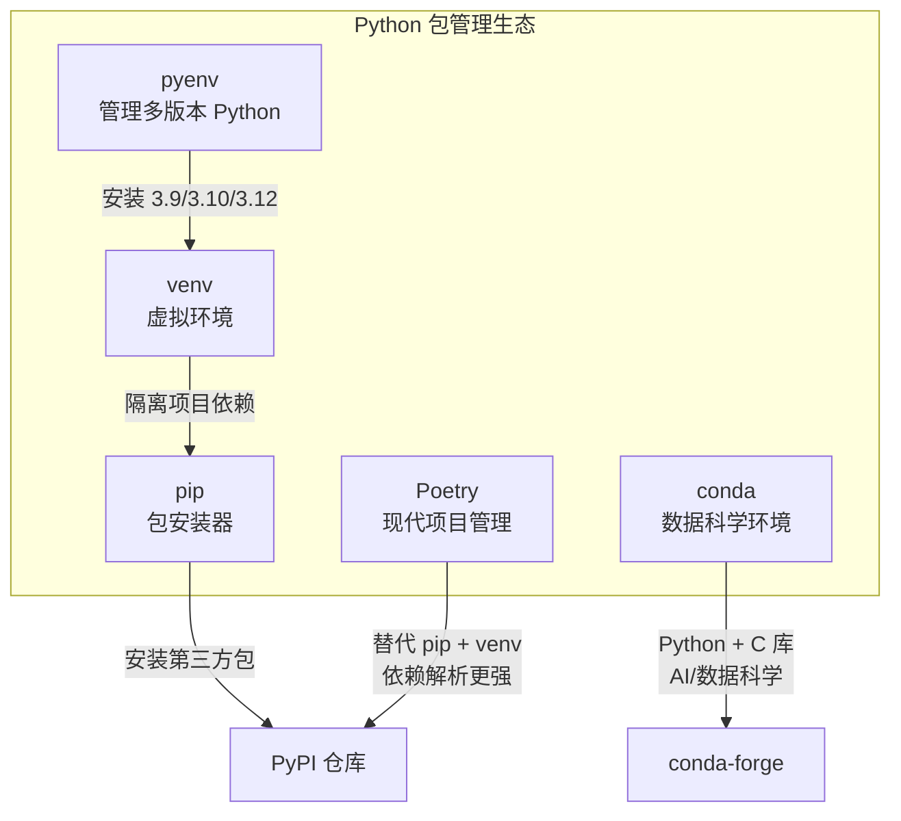
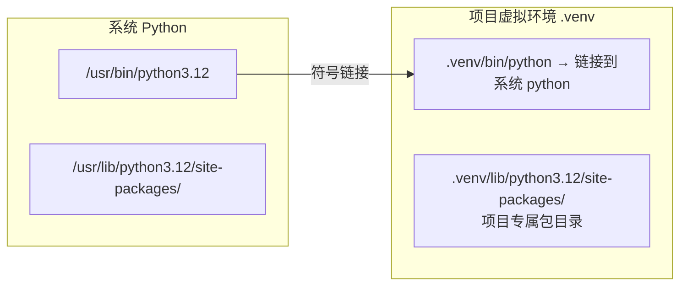

Java 开发者熟悉的 Maven/Gradle 是构建工具 + 依赖管理的合体，Python 生态则把这两件事拆开了：**pip** 管依赖，**venv/Poetry** 管环境。先搞清楚这套体系的全貌：



## 1.1 pip 详解

**是什么：** pip 是 Python 的包安装器（Package Installer for Python），类似于 Maven 的 dependency 下载功能。

**为什么需要：** 你不可能手写所有功能，第三方库（requests、numpy、flask 等）都通过 pip 从 PyPI（Python Package Index）安装。

```bash
 ========== 安装 ==========
pip install requests              # 安装最新版
pip install requests==2.28.0      # 安装指定版本
pip install "requests>=2.25,<3"   # 安装版本范围
pip install requests[security]    # 安装包 + 可选依赖
pip install -e ./my-package       # 以开发模式安装本地包（editable mode）
pip install -r requirements.txt   # 从文件批量安装

 ========== 卸载 ==========
pip uninstall requests            # 卸载包
pip uninstall -y requests         # 卸载不确认

 ========== 升级 ==========
pip install --upgrade requests    # 升级到最新版
pip install -U requests           # 同上，简写

 ========== 查看 ==========
pip list                          # 列出所有已安装包
pip show requests                 # 查看包详情（版本、位置、依赖）
pip freeze                        # 以 requirements 格式输出

 ========== 导出依赖 ==========
pip freeze > requirements.txt     # 导出当前环境所有包

 ========== 检查过期 ==========
pip list --outdated               # 查看哪些包有新版本

 ========== 搜索 ==========
pip search requests               # 搜索包（PyPI 搜索功能有时不可用）
```

:::tip pip vs Maven
| 维度 | pip | Maven |
|------|-----|-------|
| 仓库 | PyPI | Maven Central |
| 配置文件 | requirements.txt / pyproject.toml | pom.xml |
| 依赖范围 | 没有 scope 概念（靠虚拟环境隔离） | compile/test/provided/runtime |
| 传递依赖 | 自动处理 | 自动处理 |
| 锁文件 | 需要 pip-tools / poetry | 无（通过版本范围管理） |
| 离线模式 | `pip install --no-index --find-links=DIR` | `mvn -o` |
:::

## 1.2 pip 配置与国内镜像源

**为什么需要镜像：** PyPI 服务器在国外，国内下载慢。配置镜像源后速度提升 10-50 倍。

pip 的配置文件位置：

| 平台 | 用户级配置 |
|------|-----------|
| macOS / Linux | `~/.pip/pip.conf` |
| Windows | `%APPDATA%\pip\pip.ini` |

```ini
 ~/.pip/pip.conf
[global]
index-url = https://pypi.tuna.tsinghua.edu.cn/simple
trusted-host = pypi.tuna.tsinghua.edu.cn
timeout = 30
```

也可以单次使用镜像：

```bash
pip install requests -i https://pypi.tuna.tsinghua.edu.cn/simple
```

**国内常用镜像源：**

| 镜像 | 地址 | 维护方 |
|------|------|--------|
| 清华 | `https://pypi.tuna.tsinghua.edu.cn/simple` | 清华大学 TUNA |
| 阿里云 | `https://mirrors.aliyun.com/pypi/simple` | 阿里云 |
| 豆瓣 | `https://pypi.doubanio.com/simple` | 豆瓣 |
| 中科大 | `https://pypi.mirrors.ustc.edu.cn/simple` | 中科大 |
| 华为云 | `https://mirrors.huaweicloud.com/repository/pypi/simple` | 华为 |

:::warning 永久配置镜像
推荐用 `pip config set` 命令（自动写入配置文件）：
```bash
pip config set global.index-url https://pypi.tuna.tsinghua.edu.cn/simple
```
:::

## 1.3 venv 虚拟环境

**是什么：** venv 是 Python 3.3+ 内置的虚拟环境工具，为每个项目创建独立的 Python 环境。

**为什么需要：** 类似 Java 项目用不同的 JDK 版本，Python 项目可能依赖不同版本的同一个包。虚拟环境让每个项目有自己的包目录，互不干扰。

**原理：** venv 创建一个目录，包含 Python 解释器的符号链接（或拷贝）和一个空的 site-packages。激活后，`python` 和 `pip` 命令指向虚拟环境内的版本。



```bash
 ========== 创建 ==========
python3 -m venv .venv            # 创建虚拟环境（推荐用 .venv 命名）
python3 -m venv --system-site-packages .venv  # 继承系统包（一般不用）

 ========== 激活 ==========
source .venv/bin/activate         # macOS / Linux
.venv\Scripts\activate           # Windows

 激活后终端提示符变化：
 (.venv) user@mac:~/project$

 ========== 确认 ==========
which python                      # 应该指向 .venv/bin/python
pip list                          # 只看到虚拟环境里装的包（初始几乎为空）

 ========== 退出 ==========
deactivate                        # 退出虚拟环境

 ========== 删除 ==========
rm -rf .venv                      # 直接删目录即可
```

:::tip .venv 目录结构
```
.venv/
├── bin/                    # macOS/Linux
│   ├── python → 系统python   # 符号链接
│   ├── pip                  # pip 脚本
│   └── activate             # 激活脚本
├── Scripts/                # Windows 对应
├── lib/
│   └── python3.12/
│       └── site-packages/  # 虚拟环境的包目录
└── pyvenv.cfg              # 配置文件（记录原 Python 路径等）
```
:::

## 1.4 Poetry 详解

**是什么：** Poetry 是现代 Python 项目管理工具，集成了依赖管理、打包、发布功能。

**为什么比 pip 好：** pip 只管"安装包"，不解决依赖冲突问题。Poetry 有完整的依赖解析器，能像 Maven 一样管理项目的全生命周期。

| 特性 | pip + venv | Poetry |
|------|-----------|--------|
| 依赖解析 | 无（按安装顺序） | 完整的 SAT 求解器 |
| 锁文件 | 无（需 pip-tools） | poetry.lock（自动） |
| 分组依赖 | 无 | dev/test/docs 分组 |
| 构建发布 | 需 setup.py + twine | `poetry build` + `poetry publish` |
| 脚本管理 | 无 | `poetry run` + `[tool.poetry.scripts]` |

```bash
 ========== 安装 Poetry ==========
curl -sSL https://install.python-poetry.org | python3 -

 ========== 项目管理 ==========
poetry new my-project           # 创建新项目（带标准目录结构）
poetry init                     # 在已有项目里初始化（交互式）

 ========== 依赖管理 ==========
poetry add requests             # 添加运行时依赖
poetry add --group dev pytest   # 添加开发依赖
poetry add requests@^2.28       # 指定版本约束
poetry remove requests          # 移除依赖
poetry update                   # 更新所有依赖（更新 lock 文件）
poetry update requests          # 只更新指定包

 ========== 环境 ==========
poetry install                  # 根据 pyproject.toml + lock 安装所有依赖
poetry shell                    # 进入虚拟环境 shell
poetry run python main.py       # 在虚拟环境中运行命令（无需激活）
poetry env list                 # 列出关联的虚拟环境
poetry env remove python3.12    # 移除指定环境

 ========== 构建 ==========
poetry build                    # 构建 sdist + wheel
poetry publish                  # 发布到 PyPI
```

**pyproject.toml 完整配置示例：**

```toml
[tool.poetry]
name = "my-project"
version = "0.1.0"
description = "A sample Python project"
authors = ["Your Name <you@example.com>"]
readme = "README.md"
license = "MIT"
 相当于 Maven 的 <python.version>
requires-python = ">=3.10"

 源码目录
packages = [{include = "my_project", from = "src"}]

 类似 Maven 的 dependencyManagement
[tool.poetry.dependencies]
python = "^3.10"
requests = "^2.31.0"       # ^ 表示 >=2.31.0,<3.0.0
numpy = ">=1.24,<2.0"

 开发依赖（类似 Maven 的 test scope）
[tool.poetry.group.dev.dependencies]
pytest = "^7.4.0"
black = "^23.0.0"
mypy = "^1.5.0"

 脚本入口（类似 Maven exec plugin）
[tool.poetry.scripts]
my-cli = "my_project.cli:main"

 构建系统
[build-system]
requires = ["poetry-core"]
build-backend = "poetry.core.masonry.api"
```

:::warning 依赖冲突解决策略
**pip** 的策略是"谁先装谁赢"——如果 A 需要 requests>=2.25，B 需要 requests<2.28，pip 按安装顺序决定最终版本，可能导致运行时错误。

**Poetry** 使用 SAT 求解器（类似 pip 20.3+ 的 resolver），在安装前就计算出所有包的兼容版本组合。如果无法满足，直接报错而不是装一个半兼容的版本。

```bash
 pip 的隐患示例：
pip install A   # A 需要 requests==2.28.0
pip install B   # B 需要 requests==2.25.0 → 覆盖！A 可能崩溃

 Poetry 的处理：
poetry add A B  # 解析冲突 → 直接报错，告诉你无解
```
:::

## 1.5 pyenv 管理多版本 Python

**为什么需要：** 系统自带的 Python 版本固定（macOS 甚至没有 pip），不同项目可能需要不同 Python 版本。pyenv 让你在同一台机器上安装和切换多个 Python 版本。

```bash
 ========== 安装 pyenv (macOS) ==========
brew install pyenv

 配置 shell（zsh）
echo 'export PYENV_ROOT="$HOME/.pyenv"' >> ~/.zshrc
echo 'command -v pyenv >/dev/null || export PATH="$PYENV_ROOT/bin:$PATH"' >> ~/.zshrc
echo 'eval "$(pyenv init -)"' >> ~/.zshrc
source ~/.zshrc

 ========== 安装 Python 版本 ==========
pyenv install --list             # 列出所有可安装版本
pyenv install 3.12.0             # 安装 Python 3.12.0
pyenv install 3.11.5             # 安装 Python 3.11.5

 ========== 版本管理 ==========
pyenv versions                   # 列出已安装版本
pyenv global 3.12.0              # 设置全局默认版本
pyenv local 3.11.5               # 设置当前目录版本（写入 .python-version）
pyenv shell 3.10.13              # 只在当前 shell 使用指定版本

 版本优先级：local > shell > global
```

:::tip pyenv 的工作原理
pyenv 通过在 PATH 前面插入一个 shim 目录来实现版本切换。当你运行 `python` 时，实际先执行的是 pyenv 的 shim 脚本，它根据当前目录的 `.python-version` 文件（或全局设置）决定调用哪个版本的 Python。类似 Java 的 `jenv` 或 SDKMAN。
:::

## 1.6 conda 简介

**是什么：** conda 是 Anaconda/Miniconda 附带的环境管理器，除了 Python 包，还能管理 C/C++ 库、R 包等。

**适合场景：** AI / 数据科学。因为 TensorFlow、PyTorch 等依赖底层的 CUDA、cuDNN 等 C 库，pip 安装经常出问题，conda 能一站式解决。

```bash
 ========== 安装 Miniconda ==========
 下载安装脚本后执行
bash Miniconda3-latest-MacOSX-arm64.sh

 ========== 环境管理 ==========
conda create -n myenv python=3.11  # 创建环境（自动安装 Python）
conda activate myenv                # 激活
conda deactivate                    # 退出
conda env list                      # 列出所有环境
conda env export > environment.yml  # 导出环境

 ========== 包管理 ==========
conda install numpy pandas         # 安装包（从 conda-forge 仓库）
conda install pytorch torchvision -c pytorch  # 指定 channel
conda list                         # 已安装包
```

:::tip conda vs venv vs Poetry 选择建议
- **纯 Python 项目** → venv + pip 或 Poetry
- **AI/数据科学项目** → conda（解决 C 库依赖）
- **团队协作项目** → Poetry（有 lock 文件保证可复现）
- **Java 开发者入门** → 先用 venv + pip，熟悉后迁移到 Poetry
:::

## 1.7 Java Maven/Gradle 详细对比

| 维度 | Maven | Gradle | pip + venv | Poetry |
|------|-------|--------|-----------|--------|
| 配置文件 | pom.xml (XML) | build.gradle (Groovy/Kotlin) | requirements.txt | pyproject.toml (TOML) |
| 依赖仓库 | Maven Central | Maven Central + 其他 | PyPI | PyPI |
| 依赖解析 | 最近距离优先 | 版本冲突报错 | 先装先赢 | SAT 求解器 |
| 构建生命周期 | clean/compile/test/package | task-based | 无 | build/publish |
| 依赖范围 | compile/test/provided/runtime | implementation/testImplementation | 无（靠 venv 隔离） | group 分组 |
| 锁文件 | 无 | 无 | 无 | poetry.lock |
| 多模块 | parent + module | include/build | 无 | workspace（实验性） |
| 插件生态 | 丰富 | 丰富（更灵活） | 无（非构建工具） | 插件系统 |

## 1.8 练习题

**1.** 使用 pip 安装 `requests` 包的指定版本 2.28.0，然后升级到最新版，最后卸载。


**参考答案**

```bash
pip install requests==2.28.0
pip install --upgrade requests
pip uninstall -y requests
```


**2.** 创建一个虚拟环境，在其中安装 `flask`，验证安装成功后退出虚拟环境。


**参考答案**

```bash
python3 -m venv .venv
source .venv/bin/activate
pip install flask
pip show flask
deactivate
```


**3.** 配置 pip 使用阿里云镜像源。


**参考答案**

```bash
pip config set global.index-url https://mirrors.aliyun.com/pypi/simple
```


**4.** 用 Poetry 初始化一个项目，添加 `requests` 为运行时依赖，`pytest` 为开发依赖。


**参考答案**

```bash
poetry init -n   # -n 跳过交互
poetry add requests
poetry add --group dev pytest
```


**5.** 解释 pip 和 Poetry 在依赖冲突处理上的区别。


**参考答案**

pip 按"先装先赢"策略处理依赖，后安装的包可能覆盖之前的版本，导致运行时错误。Poetry 使用 SAT（布尔可满足性）求解器，在安装前就计算所有包的兼容版本组合，无法满足时直接报错，避免了潜在的运行时冲突。


**6.** 用 pyenv 安装 Python 3.11.5 并在当前目录设为默认版本。


**参考答案**

```bash
pyenv install 3.11.5
pyenv local 3.11.5
python --version  # 验证
```


---