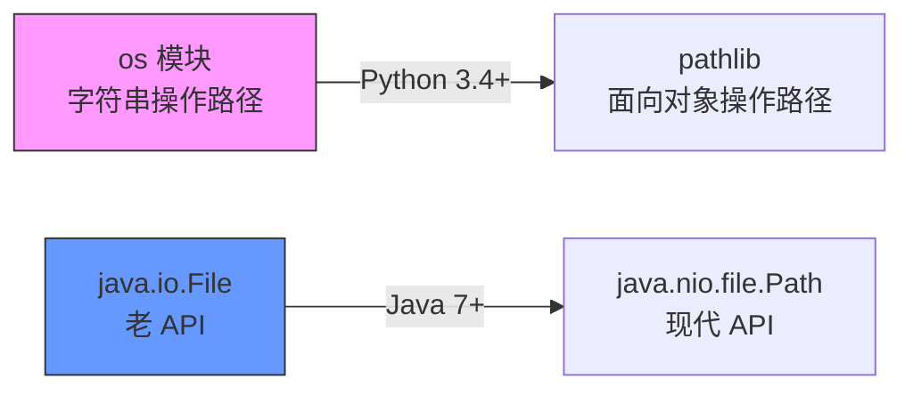

Java 有 `java.io.File` 和 `java.nio.file.Path`，Python 有老牌的 `os` 模块和现代的 `pathlib`。两者功能类似，但 pathlib 更 Pythonic。



## 2.1 os 模块与 os.path

**是什么：** `os` 模块提供操作系统接口，`os.path` 专门处理文件路径（纯字符串操作，不访问文件系统）。

```python
import os

 ========== os.path 常用方法 ==========

 路径拼接
path = os.path.join('project', 'src', 'main.py')
print(path)
 macOS: project/src/main.py
 Windows: project\src\main.py（自动用 \ 拼接）

 获取文件名
print(os.path.basename('/home/user/project/src/main.py'))
 'main.py'

 获取目录名
print(os.path.dirname('/home/user/project/src/main.py'))
 '/home/user/project/src'

 分离扩展名
print(os.path.splitext('report.pdf'))
 ('report', '.pdf')

 分离驱动器和路径（Windows 有用）
print(os.path.splitdrive('C:\\Users\\file.txt'))
 ('C:', '\\Users\\file.txt')

 获取绝对路径
print(os.path.abspath('main.py'))
 '/Users/hezhanwu/project/main.py'

 规范化路径（消除 .. 和 .）
print(os.path.normpath('/home/user/../admin/./file.txt'))
 '/home/admin/file.txt'

 获取文件大小（字节）
print(os.path.getsize('/etc/hosts'))
 289

 获取文件/目录信息
stat = os.stat('/etc/hosts')
print(stat.st_size)       # 289（文件大小）
print(stat.st_mtime)      # 1680000000.0（最后修改时间戳）

 判断路径类型
print(os.path.exists('/etc/hosts'))      # True
print(os.path.isfile('/etc/hosts'))      # True
print(os.path.isdir('/etc'))             # True
print(os.path.isabs('/home/user'))       # True（绝对路径）
print(os.path.isabs('user/file.txt'))    # False

 列出目录内容
print(os.listdir('/etc'))[:5])
 ['hosts', 'passwd', 'group', 'shells', 'resolv.conf']

 获取当前工作目录
print(os.getcwd())
 '/Users/hezhanwu/project'

 改变工作目录
os.chdir('/tmp')
print(os.getcwd())  # '/tmp'

 创建目录
os.mkdir('test_dir')               # 创建单层目录（已存在报错）
os.makedirs('a/b/c', exist_ok=True)  # 创建多层目录（exist_ok 避免报错）

 删除
os.rmdir('test_dir')               # 删除空目录
os.remove('file.txt')              # 删除文件
 os.rmdir 不能删非空目录，需要用 shutil.rmtree()

 环境变量
print(os.environ.get('HOME'))       # '/Users/hezhanwu'
print(os.environ.get('PATH', ''))   # 获取 PATH 环境变量

 路径分隔符（跨平台）
print(os.sep)     # '/' (macOS/Linux), '\\' (Windows)
print(os.pathsep) # ':' (macOS/Linux), ';' (Windows)
```

## 2.2 pathlib 详解

**是什么：** `pathlib` 是 Python 3.4+ 引入的面向对象路径处理模块。把路径字符串变成 `Path` 对象，用属性和方法操作路径。

**为什么用 pathlib：** os.path 的每个操作都是函数调用 + 字符串拼接，pathlib 用 `.` 链式调用，代码更可读、更不容易出错。

### Path 对象的创建

```python
from pathlib import Path

 创建路径对象（不会实际访问文件系统）
p = Path('project/src/main.py')      # 相对路径
p = Path('/home/user/project')       # 绝对路径
p = Path.home()                      # 用户主目录 → PosixPath('/Users/hezhanwu')
p = Path.cwd()                       # 当前工作目录

print(type(p))
 <class 'pathlib.PosixPath'>  (macOS/Linux)
 <class 'pathlib.WindowsPath'> (Windows)
```

### 路径拼接（`/` 运算符重载）

```python
from pathlib import Path

 / 运算符被重载为路径拼接
base = Path('/home/user')
full = base / 'project' / 'src' / 'main.py'
print(full)
 /home/user/project/src/main.py

 也可以用 joinpath
full = base.joinpath('project', 'src', 'main.py')
print(full)
 /home/user/project/src/main.py
```

:::tip 底层原理：运算符重载
pathlib 通过 `__truediv__` 方法重载了 `/` 运算符。当你写 `a / b` 时，Python 实际调用 `a.__truediv__(b)`。Path 类的 `__truediv__` 方法内部调用 `os.path.join` 完成路径拼接，返回新的 Path 对象。这比 `os.path.join(a, b)` 更直观，因为路径拼接用 `/` 在视觉上就表示"目录分隔符"。
:::

### 路径信息

```python
from pathlib import Path

p = Path('/home/user/project/src/main.py')

print(p.name)    # 'main.py'        文件名（含扩展名）
print(p.stem)    # 'main'           文件名（不含扩展名）
print(p.suffix)  # '.py'            扩展名
print(p.suffixes) # ['.py']         所有扩展名（'file.tar.gz' → ['.tar', '.gz']）
print(p.parent)  # PosixPath('/home/user/project/src')  父目录
print(p.parents[0])  # PosixPath('/home/user/project/src')
print(p.parents[1])  # PosixPath('/home/user/project')
print(p.parents[2])  # PosixPath('/home/user')
print(p.parts)   # ('/', 'home', 'user', 'project', 'src', 'main.py')  路径各部分
print(p.anchor)  # '/'              路径锚点（根目录或驱动器）
print(p.drive)   # ''               驱动器（Windows: 'C:'）
```

### 路径检查

```python
from pathlib import Path

p = Path('/etc/hosts')

print(p.exists())      # True    路径是否存在
print(p.is_file())     # True    是否是文件
print(p.is_dir())      # False   是否是目录
print(p.is_symlink())  # False   是否是符号链接
print(p.is_absolute()) # True    是否是绝对路径
print(p.is_reserved()) # False   是否是系统保留名（如 Windows 的 CON, NUL）
```

### glob 和 rglob（模式匹配）

```python
from pathlib import Path

 glob：匹配当前目录
p = Path('.')
print(list(p.glob('*.py')))
 [PosixPath('main.py'), PosixPath('utils.py')]

 ** 匹配所有子目录
print(list(p.glob('**/*.py')))
 [PosixPath('main.py'), PosixPath('src/utils.py'), PosixPath('tests/test_main.py')]

 rglob 等价于 glob('**/pattern')
print(list(p.rglob('*.py')))
 同上

 支持的通配符：
 *     匹配任意字符（不含 /）
 **    匹配任意层级的目录
 ?     匹配单个字符
 [abc] 匹配字符集中的字符
```

### 创建/删除目录和文件

```python
from pathlib import Path

 创建目录
Path('new_dir').mkdir()                    # 创建单层
Path('a/b/c').mkdir(parents=True)          # 创建多层（递归）
Path('a/b/c').mkdir(parents=True, exist_ok=True)  # 存在也不报错

 创建文件（并写入内容）
Path('hello.txt').write_text('Hello, World!', encoding='utf-8')

 删除
Path('hello.txt').unlink()                 # 删除文件
Path('empty_dir').rmdir()                  # 删除空目录
 pathlib 没有直接删除非空目录的方法，需要用 shutil
```

### 读写文件

```python
from pathlib import Path

 写入文件
Path('output.txt').write_text('第一行\n第二行\n', encoding='utf-8')
Path('data.bin').write_bytes(b'\x00\x01\x02')

 读取文件
text = Path('output.txt').read_text(encoding='utf-8')
print(text)
 第一行
 第二行

data = Path('data.bin').read_bytes()
print(data)  # b'\x00\x01\x02'
```

### resolve、absolute、relative_to

```python
from pathlib import Path

 absolute()：获取绝对路径（不解析符号链接）
print(Path('main.py').absolute())
 /Users/hezhanwu/project/main.py

 resolve()：解析为绝对路径 + 解析符号链接 + 消除 ..
print(Path('../other/main.py').resolve())
 /Users/hezhanwu/other/main.py

 relative_to()：计算相对路径
base = Path('/home/user')
target = Path('/home/user/project/src/main.py')
print(target.relative_to(base))
 project/src/main.py
```

## 2.3 os.path vs pathlib 对比表

| 操作 | os.path | pathlib | 推荐 |
|------|---------|---------|------|
| 路径拼接 | `os.path.join('a', 'b')` | `Path('a') / 'b'` | pathlib |
| 获取文件名 | `os.path.basename(p)` | `Path(p).name` | pathlib |
| 获取目录 | `os.path.dirname(p)` | `Path(p).parent` | pathlib |
| 获取扩展名 | `os.path.splitext(p)` | `Path(p).suffix` | pathlib |
| 判断存在 | `os.path.exists(p)` | `Path(p).exists()` | 都行 |
| 判断文件 | `os.path.isfile(p)` | `Path(p).is_file()` | 都行 |
| 获取大小 | `os.path.getsize(p)` | `Path(p).stat().st_size` | os.path（简洁） |
| 列出目录 | `os.listdir(d)` | `Path(d).iterdir()` | pathlib |
| 模式匹配 | `glob.glob(p)` | `Path(p).glob('*')` | pathlib |
| 创建目录 | `os.makedirs(d)` | `Path(d).mkdir(parents=True)` | 都行 |
| 遍历文件树 | `os.walk(d)` | `Path(d).rglob('*')` | pathlib（简单场景） |

:::tip 什么时候用 os.path？
- 需要处理老代码（兼容性）
- 需要 `os.walk`（递归遍历，提供 dirpath/dirnames/filenames 三元组，比 rglob 更灵活）
- 需要 `os.environ`、`os.getcwd()` 等非路径功能
- 性能敏感场景（pathlib 有少量对象创建开销）
:::

## 2.4 文件权限

```python
import os
from pathlib import Path

 查看文件权限（八进制）
print(oct(Path('/etc/hosts').stat().st_mode))
 '0o100644'
 100 = 普通文件
 644  = owner:rw- group:r-- others:r--

 chmod 修改权限
Path('script.sh').chmod(0o755)  # rwxr-xr-x，可执行脚本

 使用 os.chmod（相同效果）
os.chmod('script.sh', 0o755)

 检查权限
print(os.access('script.sh', os.R_OK))  # 可读？
print(os.access('script.sh', os.W_OK))  # 可写？
print(os.access('script.sh', os.X_OK))  # 可执行？
 True / True / True
```

## 2.5 实战案例

### 批量重命名文件

```python
from pathlib import Path

def batch_rename(directory: str, old_pattern: str, new_pattern: str):
    """批量重命名：将匹配 old_pattern 的文件名替换为 new_pattern"""
    dir_path = Path(directory)
    for file in dir_path.glob(old_pattern):
        new_name = file.name.replace(
            old_pattern.replace('*', ''),  # 提取匹配的字符
            new_pattern
        )
        file.rename(dir_path / new_name)
        print(f'{file.name} → {new_name}')

 使用：把所有 .txt 改为 .md
batch_rename('.', '*.txt', '.md')
 output: notes.txt → notes.md, readme.txt → readme.md
```

### 查找重复文件（按 MD5 哈希）

```python
import hashlib
from pathlib import Path
from collections import defaultdict

def find_duplicates(directory: str) -> dict:
    """通过 MD5 哈希查找重复文件"""
    hashes = defaultdict(list)

    for file in Path(directory).rglob('*'):
        if not file.is_file():
            continue
        # 计算文件 MD5
        md5 = hashlib.md5(file.read_bytes()).hexdigest()
        hashes[md5].append(str(file))

    # 只保留有重复的
    return {h: files for h, files in hashes.items() if len(files) > 1}

duplicates = find_duplicates('./downloads')
for md5, files in duplicates.items():
    print(f'重复文件组 (MD5: {md5[:8]}...):')
    for f in files:
        print(f'  {f}')
```

## 2.6 练习题

**1.** 用 pathlib 获取 `/home/user/project/src/main.py` 的文件名（不含扩展名）和父目录。


**参考答案**

```python
from pathlib import Path
p = Path('/home/user/project/src/main.py')
print(p.stem)     # 'main'
print(p.parent)   # PosixPath('/home/user/project/src')
```


**2.** 用 pathlib 列出当前目录下所有 `.py` 文件。


**参考答案**

```python
from pathlib import Path
for f in Path('.').glob('*.py'):
    print(f)
```


**3.** 递归查找 `/tmp` 目录下所有大于 1MB 的文件。


**参考答案**

```python
from pathlib import Path
for f in Path('/tmp').rglob('*'):
    if f.is_file() and f.stat().st_size > 1024 * 1024:
        print(f'{f} ({f.stat().st_size / 1024 / 1024:.1f} MB)')
```


**4.** 用 pathlib 创建目录结构 `output/2024/01/report`，如果已存在则不报错。


**参考答案**

```python
from pathlib import Path
Path('output/2024/01/report').mkdir(parents=True, exist_ok=True)
```


**5.** 写一个函数，接收一个目录路径，返回该目录下所有文件的扩展名统计（按数量降序）。


**参考答案**

```python
from pathlib import Path
from collections import Counter

def count_extensions(directory: str) -> list:
    counter = Counter()
    for f in Path(directory).rglob('*'):
        if f.is_file():
            counter[f.suffix.lower()] += 1
    return counter.most_common()

print(count_extensions('.'))
 [('.py', 15), ('.md', 8), ('.txt', 3)]
```


---