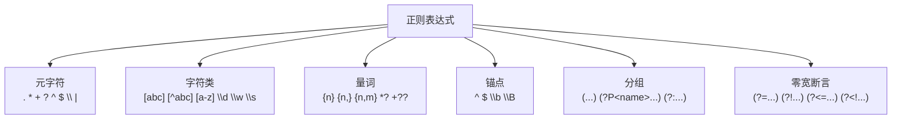

正则表达式（Regular Expression，regex）是文本匹配的瑞士军刀。Python 的 `re` 模块提供了完整的正则引擎。



## 4.1 正则表达式基础

```python
import re

 . 匹配任意字符（除换行符）
print(re.findall(r'h.t', 'hat hot hit hut'))  # ['hat', 'hot', 'hit', 'hut']

 \d 数字，\D 非数字
print(re.findall(r'\d+', 'abc123def456'))  # ['123', '456']

 \w 字母数字下划线，\W 非字母数字下划线
print(re.findall(r'\w+', 'hello_world 123'))  # ['hello_world', '123']

 \s 空白字符，\S 非空白字符
print(re.findall(r'\S+', 'hello world'))  # ['hello', 'world']

 ^ 开头，$ 结尾
print(re.findall(r'^hello', 'hello world'))  # ['hello']
print(re.findall(r'world$', 'hello world'))  # ['world']

 * 0次或多次，+ 1次或多次，? 0次或1次
print(re.findall(r'ab*c', 'ac abc abbc abbbc'))  # ['ac', 'abc', 'abbc', 'abbbc']
print(re.findall(r'ab+c', 'ac abc abbc'))        # ['abc', 'abbc']
print(re.findall(r'ab?c', 'ac abc abbc'))        # ['ac', 'abc']

 {n} 恰好n次，{n,} 至少n次，{n,m} n到m次
print(re.findall(r'\d{3}', '123456789'))      # ['123', '456', '789']
print(re.findall(r'\d{2,4}', '123456789'))     # ['1234', '5678']（贪婪）
print(re.findall(r'\d{2,4}?', '123456789'))    # ['12', '34', '56', '78']（非贪婪）

 [] 字符类
print(re.findall(r'[aeiou]', 'hello world'))     # ['e', 'o', 'o']
print(re.findall(r'[^aeiou]', 'hello world'))    # ['h', 'l', 'l', ' ', 'w', 'r', 'l', 'd']
print(re.findall(r'[a-z]+', 'Hello World 123'))  # ['ello', 'orld']

 | 或
print(re.findall(r'cat|dog', 'I have a cat and a dog'))  # ['cat', 'dog']

 \ 转义
print(re.findall(r'\.', 'hello. world.'))  # ['.', '.']
```

## 4.2 re 模块所有函数

```python
import re

text = 'Call me at 010-12345678 or 021-87654321, thanks!'

 re.match：从字符串开头匹配（只匹配一次）
m = re.match(r'Call', text)
print(m)          # <re.Match object; span=(0, 4), match='Call'>
print(m.group())  # 'Call'
print(m.span())   # (0, 4)

m = re.match(r'\d+', text)
print(m)  # None（开头不是数字）

 re.search：扫描整个字符串，找到第一个匹配
m = re.search(r'\d{3}-\d{8}', text)
print(m.group())  # '010-12345678'

 re.findall：找到所有匹配（返回列表）
print(re.findall(r'\d{3}-\d{8}', text))
 ['010-12345678', '021-87654321']

 re.finditer：找到所有匹配（返回迭代器，每个元素是 Match 对象）
for m in re.finditer(r'\d{3}-\d{8}', text):
    print(f'位置 {m.span()}: {m.group()}')
 位置 (12, 23): 010-12345678
 位置 (27, 38): 021-87654321

 re.sub：替换
print(re.sub(r'\d{3}-\d{8}', '[PHONE]', text))
 'Call me at [PHONE] or [PHONE], thanks!'

 替换时可以使用函数
def mask_phone(m):
    return m.group()[:4] + '****' + m.group()[-4:]
print(re.sub(r'\d{3}-\d{8}', mask_phone, text))
 'Call me at 010-****5678 or 021-****4321, thanks!'

 re.split：按正则分割
print(re.split(r'[,.\s]+', 'hello,world.foo bar'))
 ['hello', 'world', 'foo', 'bar']

 re.compile：预编译正则
pattern = re.compile(r'\d{3}-\d{8}')
print(pattern.findall(text))
 ['010-12345678', '021-87654321']
```

## 4.3 分组和命名分组

```python
import re

 普通分组
text = '张三: 25岁, 李四: 30岁'
for m in re.finditer(r'(\w+): (\d+)岁', text):
    print(f'姓名: {m.group(1)}, 年龄: {m.group(2)}')
    print(f'全部匹配: {m.group(0)}')
    print(f'位置: {m.groups()}')
 姓名: 张三, 年龄: 25
 全部匹配: 张三: 25岁
 位置: ('张三', '25')
 姓名: 李四, 年龄: 30
 ...

 命名分组（推荐，可读性更好）
for m in re.finditer(r'(?P<name>\w+): (?P<age>\d+)岁', text):
    print(f'姓名: {m.group("name")}, 年龄: {m.group("age")}')
 姓名: 张三, 年龄: 25
 姓名: 李四, 年龄: 30

 命名分组 + dict 输出
for m in re.finditer(r'(?P<name>\w+): (?P<age>\d+)岁', text):
    print(m.groupdict())
 {'name': '张三', 'age': '25'}
 {'name': '李四', 'age': '30'}

 非捕获分组 (?:...) —— 参与匹配但不捕获
print(re.findall(r'(?:ab)+', 'ababab'))  # ['ababab']
print(re.findall(r'(ab)+', 'ababab'))    # ['ab']（只捕获最后一组）

 分组引用：\1 引用第一个分组（匹配相同内容）
print(re.findall(r'(\w+)\s+\1', 'the the cat cat dog'))
 ['the', 'cat']
 匹配重复出现的单词
```

## 4.4 贪婪 vs 非贪婪匹配

```python
import re

html = '<div>hello</div><div>world</div>'

 贪婪匹配（默认）：尽可能多地匹配
print(re.findall(r'<div>(.*)</div>', html))
 ['hello</div><div>world']  ← 匹配了中间的 </div>！

 非贪婪匹配（加 ?）：尽可能少地匹配
print(re.findall(r'<div>(.*?)</div>', html))
 ['hello', 'world']  ← 正确！

 量词后的 ? 将贪婪变为非贪婪
 *?  +?  ??  {n,m}?
text = 'a1b2c3d4e5'
print(re.findall(r'a.*d', text))   # ['a1b2c3d']（贪婪）
print(re.findall(r'a.*?d', text))  # ['a1b2c3d']（这个例子结果相同）

print(re.findall(r'a.+d', text))   # ['a1b2c3d']（贪婪）
print(re.findall(r'a.+?d', text))  # ['a1b2c3d']（非贪婪，最短匹配）
```

:::warning 性能陷阱
贪婪匹配可能导致**回溯爆炸**。比如 `a.*b.*c.*d` 匹配一个很长的字符串，引擎会不断回溯尝试不同的分割方式。在处理用户输入时，始终使用非贪婪匹配，或在正则中设置超时（Python 3.11+：`reTimeout`）。
:::

## 4.5 零宽断言（前瞻、后顾）

**零宽**：不消耗字符，只"断言"某个条件是否成立。

```python
import re

 正向先行断言 (?=...) —— 后面跟着...（但不消耗）
 匹配后面跟着 yuan 的数字
print(re.findall(r'\d+(?= yuan)', '100 yuan, 200 yuan, 300 usd'))
 ['100', '200']

 负向先行断言 (?!...) —— 后面不跟着...
 匹配后面不跟着 yuan 的数字
print(re.findall(r'\d+(?! yuan)', '100 yuan, 200 yuan, 300 usd'))
 ['00', '00', '300']  # 注意：00 是因为 \d+ 从不同位置开始

 正向后行断言 (?<=...) —— 前面是...
 匹配 $ 前面的数字
print(re.findall(r'(?<=\$)\d+', 'price: $100, $200, €300'))
 ['100', '200']

 负向后行断言 (?<!...) —— 前面不是...
 匹配不在 $ 前面的数字
print(re.findall(r'(?<!\$)\d+', 'price: $100, $200, €300'))
 ['100', '200', '300']
```

:::tip 实际应用场景
- `(?<=@)\w+` — 提取邮箱的域名部分
- `\b\w+(?=\s+verb\b)` — 在语法分析中找名词
- `(?<=https?://)[^/]+` — 提取域名
:::

## 4.6 常用正则模式

```python
import re

 手机号（中国大陆）
phone_pattern = r'^1[3-9]\d{9}$'
print(re.match(phone_pattern, '13812345678'))  # Match
print(re.match(phone_pattern, '12345678901'))  # None

 邮箱
email_pattern = r'^[a-zA-Z0-9._%+-]+@[a-zA-Z0-9.-]+\.[a-zA-Z]{2,}$'
print(re.match(email_pattern, 'test@example.com'))  # Match

 IP 地址（IPv4）
ip_pattern = r'^((25[0-5]|2[0-4]\d|[01]?\d\d?)\.){3}(25[0-5]|2[0-4]\d|[01]?\d\d?)$'
print(re.match(ip_pattern, '192.168.1.100'))  # Match
print(re.match(ip_pattern, '999.999.999.999'))  # None

 URL
url_pattern = r'^https?://[^\s/$.?#].[^\s]*$'
print(re.match(url_pattern, 'https://www.example.com/path?query=1'))  # Match

 身份证号（18位）
id_pattern = r'^[1-9]\d{5}(19|20)\d{2}(0[1-9]|1[0-2])(0[1-9]|[12]\d|3[01])\d{3}[\dXx]$'
print(re.match(id_pattern, '110101199003077755'))  # Match
```

## 4.7 编译正则与调试

```python
import re

 ========== re.compile 为什么要用？ ==========
 1. 复用正则对象，避免重复编译
 2. 可以附加 flags
 3. 性能更好（循环中使用时明显）

 编译时设置 flags
pattern = re.compile(
    r'(?P<name>\w+):\s+(?P<value>\d+)',
    re.IGNORECASE | re.MULTILINE | re.VERBOSE
)

 re.IGNORECASE / re.I：忽略大小写
 re.MULTILINE / re.M：^ 和 $ 匹配每行
 re.DOTALL / re.S：. 匹配包括换行符的所有字符
 re.VERBOSE / re.X：允许注释和空白

 使用 VERBOSE 模式写可读的正则
pattern = re.compile(r'''
    (?P<protocol>https?)://  # 协议
    (?P<domain>[^/]+)        # 域名
    (?P<path>/[^\s]*)?       # 路径（可选）
    \?                       # 问号
    (?P<query>[^\s]*)        # 查询参数
''', re.VERBOSE)

m = pattern.match('https://example.com/path?key=value')
print(m.groupdict())
 {'protocol': 'https', 'domain': 'example.com', 'path': '/path', 'query': 'key=value'}

 ========== re.DEBUG 调试 ==========
 看看正则引擎是怎么理解你的正则的
re.compile(r'\d{3}-\d{8}', re.DEBUG)
 输出类似：
 MAX_REPEAT 3 3
   IN
     CATEGORY CATEGORY_DIGIT
 LITERAL 45
 MAX_REPEAT 8 8
   IN
     CATEGORY CATEGORY_DIGIT
```

## 4.8 性能考虑

```python
import re

 1. 预编译正则（最重要）
 差：每次循环都重新编译
for text in texts:
    re.findall(r'\d+', text)

 好：预编译一次
pattern = re.compile(r'\d+')
for text in texts:
    pattern.findall(text)

 2. 避免回溯爆炸
 差：嵌套量词容易指数级回溯
 re.match(r'(a+)+$', 'a' * 30 + 'b')  # 极慢！

 好：使用原子分组或占有量词（Python 3.11+ 支持 (?P>name) 递归）
 或者用更简单的正则

 3. 如果只是简单的字符串操作，优先用 str 方法
 差
re.sub(r'\s+', ' ', '  hello   world  ').strip()
 好
' '.join('  hello   world  '.split())
```

## 4.9 Java Pattern/Matcher 对比

| 操作 | Java | Python |
|------|------|--------|
| 编译 | `Pattern p = Pattern.compile("\\d+")` | `p = re.compile(r'\d+')` |
| 匹配 | `p.matcher(text).find()` | `p.search(text)` |
| 全部匹配 | `while (m.find()) { m.group() }` | `p.findall(text)` |
| 替换 | `p.matcher(text).replaceAll("-")` | `p.sub('-', text)` |
| 分组 | `m.group(1)` | `m.group(1)` |
| 命名分组 | `(?P<name>...)` → `m.group("name")` | 相同 |
| 原始字符串 | `"\\d+"` 需要双重转义 | `r'\d+'` 原始字符串，更方便 |
| Flags | `Pattern.CASE_INSENSITIVE` | `re.IGNORECASE` |

## 4.10 练习题

**1.** 从文本 `邮箱：test@example.com，电话：13812345678` 中提取邮箱和电话。


**参考答案**

```python
import re
text = '邮箱：test@example.com，电话：13812345678'
email = re.search(r'[\w.+-]+@[\w-]+\.[\w.]+', text).group()
phone = re.search(r'1[3-9]\d{9}', text).group()
print(f'邮箱: {email}, 电话: {phone}')
 邮箱: test@example.com, 电话: 13812345678
```


**2.** 将字符串 `Hello   World   Python` 中的多个空格替换为单个空格。


**参考答案**

```python
import re
text = 'Hello   World   Python'
print(re.sub(r'\s+', ' ', text))
 Hello World Python
```


**3.** 验证密码强度：至少8位，包含大小写字母和数字。


**参考答案**

```python
import re
def is_strong_password(pwd: str) -> bool:
    return (len(pwd) >= 8
            and re.search(r'[A-Z]', pwd)
            and re.search(r'[a-z]', pwd)
            and re.search(r'\d', pwd))

print(is_strong_password('Abc12345'))   # True
print(is_strong_password('weak'))        # False
```


**4.** 用正则提取 HTML 标签中的属性值：`<a href="https://example.com" class="link">text</a>`。


**参考答案**

```python
import re
html = '<a href="https://example.com" class="link">text</a>'
attrs = dict(re.findall(r'(\w+)="([^"]*)"', html))
print(attrs)
 {'href': 'https://example.com', 'class': 'link'}
```


**5.** 用命名分组解析日志行：`2026-04-07 10:30:00 [INFO] User admin logged in from 192.168.1.100`。


**参考答案**

```python
import re
log = '2026-04-07 10:30:00 [INFO] User admin logged in from 192.168.1.100'
pattern = re.compile(
    r'(?P<time>\d{4}-\d{2}-\d{2} \d{2}:\d{2}:\d{2}) '
    r'\[(?P<level>\w+)\] '
    r'User (?P<user>\w+) logged in from (?P<ip>[\d.]+)'
)
m = pattern.match(log)
print(m.groupdict())
 {'time': '2026-04-07 10:30:00', 'level': 'INFO', 'user': 'admin', 'ip': '192.168.1.100'}
```


---