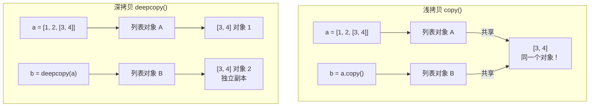

## 10.1 itertools — 迭代器工具

```python
from itertools import count, cycle, chain, combinations, permutations, groupby

 count：无限计数器
for i in count(10, 3):  # 从10开始，步长3
    if i > 20:
        break
    print(i, end=' ')
 10 13 16 19

 cycle：无限循环
 for item in cycle(['A', 'B', 'C']):
     print(item)  # A B C A B C ...

 chain：连接多个可迭代对象
print(list(chain([1, 2], [3, 4], [5, 6])))
 [1, 2, 3, 4, 5, 6]

 combinations：组合（不重复）
print(list(combinations('ABC', 2)))
 [('A', 'B'), ('A', 'C'), ('B', 'C')]

 permutations：排列
print(list(permutations('ABC', 2)))
 [('A', 'B'), ('A', 'C'), ('B', 'A'), ('B', 'C'), ('C', 'A'), ('C', 'B')]

 groupby：分组（需要先排序）
data = [('A', 1), ('B', 2), ('A', 3), ('B', 4)]
for key, group in groupby(sorted(data, key=lambda x: x[0]), key=lambda x: x[0]):
    print(f'{key}: {[item[1] for item in group]}')
 A: [1, 3]
 B: [2, 4]
```

## 10.2 functools — 函数工具

```python
from functools import lru_cache, partial, reduce, wraps

 lru_cache：缓存函数结果（装饰器）
@lru_cache(maxsize=128)
def fibonacci(n: int) -> int:
    if n < 2:
        return n
    return fibonacci(n - 1) + fibonacci(n - 2)

print(fibonacci(100))  # 瞬间出结果（缓存）
print(fibonacci.cache_info())
 CacheInfo(hits=98, misses=101, maxsize=128, currsize=101)

 partial：固定部分参数
def power(base, exp):
    return base ** exp

square = partial(power, exp=2)
cube = partial(power, exp=3)
print(square(5))  # 25
print(cube(3))    # 27

 reduce：累积计算
from operator import add
print(reduce(add, [1, 2, 3, 4, 5]))  # 15（1+2+3+4+5）

 wraps：保留被装饰函数的元信息
def my_decorator(func):
    @wraps(func)  # 保留原函数的 __name__, __doc__ 等
    def wrapper(*args, **kwargs):
        print(f'调用 {func.__name__}')
        return func(*args, **kwargs)
    return wrapper

@my_decorator
def greet(name: str) -> str:
    """打招呼"""
    return f'Hello, {name}'

print(greet.__name__)  # 'greet'（没有 @wraps 的话是 'wrapper'）
print(greet.__doc__)   # '打招呼'
```

## 10.3 hashlib — 哈希摘要

```python
import hashlib

 MD5（不安全，仅用于校验）
md5 = hashlib.md5(b'hello')
print(md5.hexdigest())
 5d41402abc4b2a76b9719d911017c592

 SHA-256（推荐）
sha256 = hashlib.sha256(b'hello')
print(sha256.hexdigest())
 2cf24dba5fb0a30e26e83b2ac5b9e29e1b161e5c1fa7425e73043362938b9824

 SHA-512
sha512 = hashlib.sha512(b'hello')
print(sha512.hexdigest()[:32])
 9b71d224bd62f3785d96d46ad3ea3d733...

 文件哈希（大文件友好，不一次性读入内存）
def file_hash(filepath: str, algorithm: str = 'sha256') -> str:
    h = hashlib.new(algorithm)
    with open(filepath, 'rb') as f:
        while chunk := f.read(8192):  # 8KB 分块
            h.update(chunk)
    return h.hexdigest()

 哈希加盐（密码存储）
import os
salt = os.urandom(16)  # 随机盐
hashed = hashlib.pbkdf2_hmac('sha256', b'password123', salt, 100000)
print(hashed.hex())
```

## 10.4 uuid — 唯一标识符

```python
import uuid

 UUID4：随机 UUID（最常用）
print(uuid.uuid4())
 a8098c1a-f86e-11da-bd1a-00112444be1e

 UUID1：基于时间戳和 MAC 地址
print(uuid.uuid1())

 UUID3：基于命名空间和名称（MD5）
print(uuid.uuid3(uuid.NAMESPACE_DNS, 'example.com'))

 UUID5：基于命名空间和名称（SHA-1）
print(uuid.uuid5(uuid.NAMESPACE_DNS, 'example.com'))

 格式化
u = uuid.uuid4()
print(str(u))          # 'a8098c1a-f86e-11da-bd1a-00112444be1e'
print(u.hex)           # 'a8098c1af86e11dabd1a00112444be1e'
print(u.urn)           # 'urn:uuid:a8098c1a-f86e-11da-bd1a-00112444be1e'
```

## 10.5 secrets — 安全随机数

```python
import secrets

 安全随机 token（用于密码重置、API Key 等）
print(secrets.token_hex(16))    # 32位十六进制字符串
 'a1b2c3d4e5f6a7b8c9d0e1f2a3b4c5d6'

print(secrets.token_urlsafe(16))  # URL 安全的 base64 字符串
 'v1b2c3d4e5f6g7h8i9j0'

 安全随机选择
alphabet = 'abcdefghijklmnopqrstuvwxyz0123456789!@#$%'
password = ''.join(secrets.choice(alphabet) for _ in range(16))
print(password)
 'x7$k2m9!p4z1@n8c'

 比较（防时序攻击）
secrets.compare_digest('password', 'password')  # True
secrets.compare_digest('password', 'wrong')      # False

 为什么不用 random？
 random 模块是伪随机，可预测。secrets 使用操作系统的安全随机源（/dev/urandom）
```

## 10.6 pprint — 美化打印

```python
from pprint import pprint, pformat

data = {
    'users': [
        {'name': '张三', 'age': 25, 'hobbies': ['编程', '阅读']},
        {'name': '李四', 'age': 30, 'hobbies': ['游泳', '旅行']},
    ],
    'meta': {'total': 2, 'page': 1},
}

 pprint：美化输出（自动缩进、换行）
pprint(data, width=40)
 {'meta': {'page': 1, 'total': 2},
  'users': [{'age': 25,
             'hobbies': ['编程', '阅读'],
             'name': '张三'},
            {'age': 30,
             'hobbies': ['游泳', '旅行'],
             'name': '李四'}]}

 pformat：返回美化后的字符串（而不是直接打印）
formatted = pformat(data)
```

## 10.7 time / perf_counter — 计时

```python
import time
import timeit

 time.perf_counter：高精度计时（推荐）
start = time.perf_counter()
time.sleep(0.1)
elapsed = time.perf_counter() - start
print(f'耗时: {elapsed:.4f}秒')
 耗时: 0.1001秒

 time.time：时间戳（受系统时间影响，不适合计时）
 time.process_time：进程 CPU 时间（不包含 sleep）

 timeit：测量小代码片段的执行时间
result = timeit.timeit('sum(range(1000))', number=10000)
print(f'执行 10000 次耗时: {result:.4f}秒')
 执行 10000 次耗时: 0.3821秒

 timeit.repeat：多次重复取最优
results = timeit.repeat('sum(range(1000))', number=10000, repeat=5)
print(f'最快: {min(results):.4f}秒, 最慢: {max(results):.4f}秒')
```

## 10.8 copy — 浅拷贝 vs 深拷贝

```python
import copy

 ========== 浅拷贝 ==========
a = [1, 2, [3, 4]]
b = a.copy()          # 等价于 copy.copy(a)
b[0] = 99             # 不影响 a（顶层元素独立）
b[2].append(5)        # 影响 a（内部引用共享！）
print(a)  # [1, 2, [3, 4, 5]]  ← 内层列表被修改了！

 ========== 深拷贝 ==========
a = [1, 2, [3, 4]]
b = copy.deepcopy(a)
b[2].append(5)        # 不影响 a（完全独立）
print(a)  # [1, 2, [3, 4]]  ← 安全

 ========== 图解 ==========
 浅拷贝：a 和 b 是两个列表对象，但内部的 [3,4] 指向同一个对象
 深拷贝：a 和 b 完全独立，所有嵌套对象都被复制
```



---

# 总结

本章覆盖了 Python 开发中最常用的标准库和包管理工具：

```mermaid
graph LR
    subgraph "工具链"
        pip --> Poetry
        venv --> Poetry
        pyenv --> venv
    end
    subgraph "核心标准库"
        os --> pathlib
        re --> "文本处理"
        json --> "数据交换"
        csv --> "数据交换"
        datetime --> "时间处理"
        logging --> "日志系统"
        collections --> "高级数据结构"
        typing --> "类型安全"
    end
```

| 模块 | 用途 | Java 类比 |
|------|------|-----------|
| pip / Poetry | 包管理 | Maven / Gradle |
| os / pathlib | 文件路径 | java.nio.file.Path |
| datetime | 日期时间 | java.time.* |
| re | 正则表达式 | java.util.regex |
| json | JSON 处理 | Jackson / Gson |
| csv | CSV 处理 | OpenCSV |
| logging | 日志 | SLF4J + Logback |
| collections | 高级数据结构 | Guava / Apache Commons |
| typing | 类型注解 | Java 泛型 + 注解 |

下一阶段我们将进入第三方库的世界：requests、flask、pytest、pandas……Python 真正强大的地方在于**生态**。标准库是地基，第三方库是高楼。