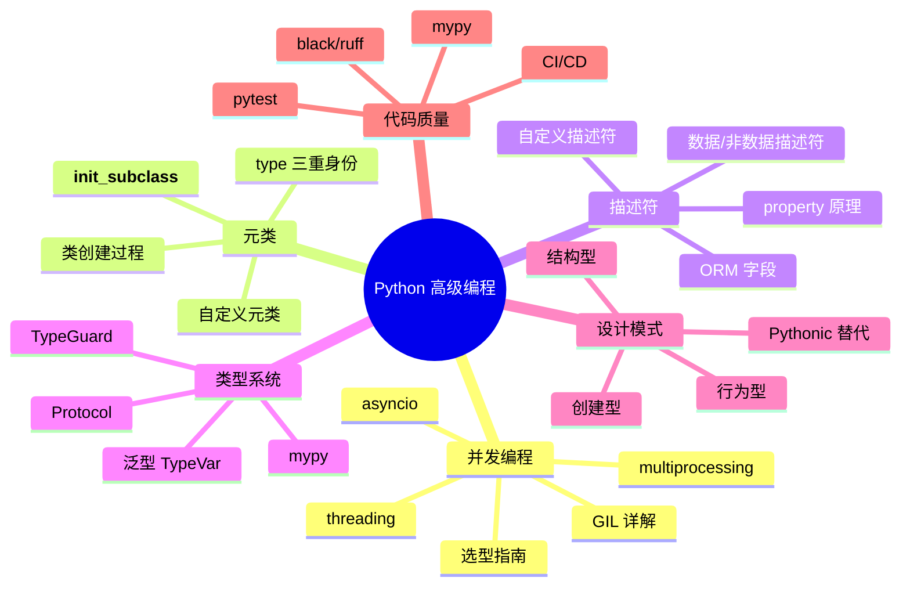

## 6.1 格式化工具

```bash
 安装
pip install black ruff

 black：不妥协的代码格式化器（类似 Java 的 google-java-format）
black src/

 ruff format：更快的格式化器（Rust 实现，比 black 快 10-100 倍）
ruff format src/
```

**black 的核心规则：**
- 行宽 88 字符
- 字符串用双引号
- 函数和类之间空两行
- 逗号后换行

```python
 格式化前
def foo(x,y,z,a=1,b=2,c=3):return x+y+z+a+b+c

 格式化后（black）
def foo(
    x,
    y,
    z,
    a=1,
    b=2,
    c=3,
):
    return x + y + z + a + b + c
```

## 6.2 Linter

```bash
 ruff：新一代 Python Linter（替代 flake8、pylint、isort 等）
pip install ruff

 基本检查
ruff check src/

 自动修复
ruff check --fix src/

 常用规则
ruff check --select E,F,W --ignore E501 src/  # E=pycodestyle, F=pyflakes, W=warning
```

:::tip Ruff vs Flake8 vs Pylint
- **Ruff**：Rust 实现，极快（比 flake8 快 10-100x），兼容 flake8 规则，内置 isort 和 pydocstyle
- **Flake8**：老牌 Linter，生态丰富（大量插件），但速度慢
- **Pylint**：最严格的 Linter，检查最全面，但配置复杂、速度慢、误报多

**推荐：用 Ruff 替代 flake8 + isort + pydocstyle**
:::

## 6.3 类型检查（mypy）

```bash
 安装
pip install mypy

 基本检查
mypy src/

 严格模式
mypy --strict src/
```

```python
 mypy 能发现的错误
def greet(name: str) -> str:
    return f"Hello, {name}"

greet(42)  # mypy 报错: Argument 1 to "greet" has incompatible type "int"; expected "str"

def process(items: list[int]) -> int:
    return sum(items)

process(["a", "b"])  # mypy 报错: List item 0 has incompatible type "str"; expected "int"
```

## 6.4 测试框架（pytest）

```python
 tests/test_calculator.py

import pytest

class Calculator:
    def add(self, a, b):
        return a + b

    def divide(self, a, b):
        if b == 0:
            raise ValueError("除数不能为零")
        return a / b

 ====== 基本测试 ======
def test_add():
    calc = Calculator()
    assert calc.add(1, 2) == 3
    assert calc.add(-1, 1) == 0

def test_divide():
    calc = Calculator()
    assert calc.divide(10, 2) == 5.0

def test_divide_by_zero():
    calc = Calculator()
    with pytest.raises(ValueError, match="除数不能为零"):
        calc.divide(10, 0)

 ====== 参数化测试 ======
@pytest.mark.parametrize("a, b, expected", [
    (1, 1, 2),
    (2, 3, 5),
    (-1, 1, 0),
    (0, 0, 0),
])
def test_add_parametrized(a, b, expected):
    calc = Calculator()
    assert calc.add(a, b) == expected

 ====== fixture ======
@pytest.fixture
def calculator():
    """测试夹具：创建共享的测试对象"""
    return Calculator()

def test_with_fixture(calculator):
    assert calculator.add(10, 20) == 30

@pytest.fixture
def db_connection():
    """带清理的 fixture"""
    conn = {"connected": True}
    yield conn  # yield 之前的代码是 setup
    conn["connected"] = False  # yield 之后的代码是 teardown
    print("数据库连接已关闭")

def test_db(db_connection):
    assert db_connection["connected"] is True

 ====== mock ======
from unittest.mock import MagicMock, patch

def test_external_api():
    with patch("requests.get") as mock_get:
        mock_get.return_value.json.return_value = {"status": "ok"}
        # 在测试中，requests.get 不会真正发起网络请求
        # mock_get.return_value.json() 返回 {"status": "ok"}
        response = mock_get("https://api.example.com")
        assert response.json() == {"status": "ok"}
        mock_get.assert_called_once_with("https://api.example.com")
```

```bash
 运行测试
pytest tests/                    # 运行所有测试
pytest tests/test_calc.py -v     # 详细输出
pytest -k "test_add"             # 只运行匹配的测试
pytest --cov=src --cov-report=html  # 覆盖率报告
```

## 6.5 pre-commit hooks

```yaml
 .pre-commit-config.yaml
repos:
  - repo: https://github.com/astral-sh/ruff-pre-commit
    rev: v0.4.0
    hooks:
      - id: ruff
        args: [--fix]
      - id: ruff-format

  - repo: https://github.com/pre-commit/pre-commit-hooks
    rev: v4.6.0
    hooks:
      - id: trailing-whitespace
      - id: end-of-file-fixer
      - id: check-yaml
      - id: check-added-large-files
```

```bash
 安装
pre-commit install

 运行
pre-commit run --all-files
```

## 6.6 项目结构推荐

```
my-project/
├── pyproject.toml       # 统一配置（格式化、lint、测试、构建）
├── README.md
├── src/                 # src layout（推荐）
│   └── my_package/
│       ├── __init__.py
│       ├── main.py
│       └── utils.py
├── tests/
│   ├── conftest.py      # pytest 全局 fixture
│   └── test_main.py
└── .github/
    └── workflows/
        └── ci.yml       # CI/CD
```

:::tip src layout vs flat layout
- **src layout**（推荐）：包代码放在 `src/` 下，安装时才是真正的包结构，避免导入当前目录的文件而不是安装的包
- **flat layout**：包代码直接在项目根目录，简单但不推荐大型项目使用
:::

## 6.7 pyproject.toml 统一配置

```toml
 pyproject.toml - 一个文件管理所有工具配置

[project]
name = "my-project"
version = "0.1.0"
requires-python = ">=3.12"
dependencies = [
    "requests>=2.31",
    "aiohttp>=3.9",
]

[project.optional-dependencies]
dev = [
    "pytest>=8.0",
    "mypy>=1.10",
    "ruff>=0.4",
    "pre-commit>=3.7",
]

 ====== Ruff 配置 ======
[tool.ruff]
target-version = "py312"
line-length = 88

[tool.ruff.lint]
select = ["E", "F", "W", "I"]  # E=pycodestyle, F=pyflakes, W=warning, I=isort
ignore = ["E501"]  # 忽略行过长（black 会处理）

[tool.ruff.format]
quote-style = "double"

 ====== mypy 配置 ======
[tool.mypy]
python_version = "3.12"
strict = true
warn_return_any = true

[[tool.mypy.overrides]]
module = "tests.*"
disallow_untyped_defs = false

 ====== pytest 配置 ======
[tool.pytest.ini_options]
testpaths = ["tests"]
addopts = "-v --tb=short"

 ====== 覆盖率配置 ======
[tool.coverage.run]
source = ["src"]
branch = true

[tool.coverage.report]
fail_under = 80
```

## 6.8 CI/CD 集成（GitHub Actions）

```yaml
 .github/workflows/ci.yml
name: CI

on:
  push:
    branches: [main]
  pull_request:
    branches: [main]

jobs:
  lint-and-test:
    runs-on: ubuntu-latest
    strategy:
      matrix:
        python-version: ["3.12", "3.13"]

    steps:
      - uses: actions/checkout@v4

      - name: Set up Python ${{ matrix.python-version }}
        uses: actions/setup-python@v5
        with:
          python-version: ${{ matrix.python-version }}

      - name: Install dependencies
        run: |
          python -m pip install --upgrade pip
          pip install -e ".[dev]"

      - name: Ruff lint
        run: ruff check src/ tests/

      - name: Ruff format
        run: ruff format --check src/ tests/

      - name: Type check
        run: mypy src/

      - name: Run tests
        run: pytest --cov=src --cov-report=xml

      - name: Upload coverage
        uses: codecov/codecov-action@v4
        with:
          token: ${{ secrets.CODECOV_TOKEN }}
```

## 6.9 Java 工具链对比

| 功能 | Python | Java |
|------|--------|------|
| 格式化 | black / ruff format | google-java-format / Spotless |
| Linter | ruff / flake8 / pylint | Checkstyle / SpotBugs / Error Prone |
| 类型检查 | mypy / pyright | javac（编译时） |
| 测试 | pytest | JUnit 5 + Mockito |
| 覆盖率 | coverage.py / pytest-cov | JaCoCo |
| 依赖管理 | pip / poetry / uv | Maven / Gradle |
| CI | GitHub Actions + pre-commit | GitHub Actions + Maven/Gradle |
| 统一配置 | pyproject.toml | pom.xml / build.gradle |

:::tip 关键差异
Java 的类型检查在**编译时**就完成了（javac），不需要额外工具。Python 是动态类型语言，类型注解只是提示，需要 mypy/pyright 在**开发时**做静态检查。这是 Java 的一个天然优势——编译器会帮你发现类型错误。
:::

---

## 6.10 练习题

**题目 1**：为以下代码写 pytest 测试，要求覆盖正常路径、边界情况和异常情况：

```python
def parse_int(s: str) -> int:
    return int(s)
```


**参考答案**

```python
import pytest

def test_parse_int_normal():
    assert parse_int("42") == 42
    assert parse_int("0") == 0
    assert parse_int("-7") == -7

def test_parse_int_large():
    assert parse_int("999999999") == 999999999

@pytest.mark.parametrize("s", ["", "abc", "3.14", "hello"])
def test_parse_int_invalid(s):
    with pytest.raises(ValueError):
        parse_int(s)
```


**题目 2**：配置一个 `pyproject.toml`，要求：Ruff 行宽 100、忽略 E501，mypy 非严格模式，pytest 测试目录为 `tests/`。


**参考答案**

```toml
[tool.ruff]
target-version = "py312"
line-length = 100

[tool.ruff.lint]
ignore = ["E501"]

[tool.mypy]
python_version = "3.12"

[tool.pytest.ini_options]
testpaths = ["tests"]
```


**题目 3**：写一个 GitHub Actions workflow，在每次 push 时运行 ruff check + pytest。


**参考答案**

```yaml
name: CI
on: [push]
jobs:
  test:
    runs-on: ubuntu-latest
    steps:
      - uses: actions/checkout@v4
      - uses: actions/setup-python@v5
        with:
          python-version: "3.12"
      - run: pip install ruff pytest
      - run: ruff check .
      - run: pytest
```


**题目 4**：写一个 pytest fixture `tmp_file`，创建一个临时文件并在测试结束后自动删除。


**参考答案**

```python
import pytest
import tempfile
import os

@pytest.fixture
def tmp_file():
    """创建临时文件，测试结束后自动清理"""
    fd, path = tempfile.mkstemp(suffix=".txt")
    try:
        with os.fdopen(fd, 'w') as f:
            f.write("test content")
        yield path
    finally:
        os.unlink(path)

def test_read_file(tmp_file):
    with open(tmp_file) as f:
        content = f.read()
    assert content == "test content"
```


**题目 5**：使用 `unittest.mock.patch` 模拟 `time.time()` 返回固定值。


**参考答案**

```python
from unittest.mock import patch
import time

@patch("time.time", return_value=1700000000.0)
def test_fixed_time(mock_time):
    assert time.time() == 1700000000.0
    assert mock_time.call_count == 1
```


---

# 总结

恭喜你完成了 Python 高级编程的学习！回顾一下我们 covered 的内容：



**从 Java 开发者的视角看：**

- Python 的并发模型比 Java 更多样（协程是 Java 21 Virtual Thread 的灵感来源之一）
- 元类和描述符是 Python 独有的元编程机制，Java 没有直接对等物
- Python 的类型系统在快速追赶 Java，但 Java 的编译时类型检查仍然是天然优势
- Python 的设计模式更轻量——动态类型 + 一等函数让很多 GoF 模式变得不必要
- Python 的工具链生态（ruff、mypy、pytest）已经非常成熟，不亚于 Java

下一步建议：找一个实际项目，把这些知识用起来。比如写一个异步 Web 爬虫、一个 ORM 框架、或者一个带完整测试的 CLI 工具。实践是最好的老师。