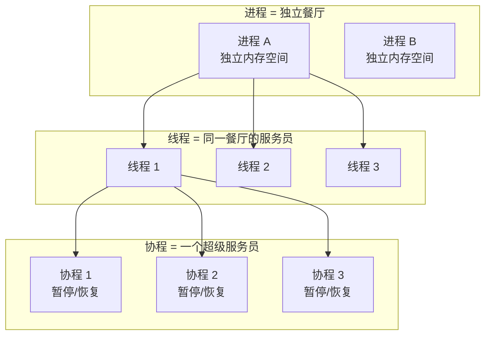
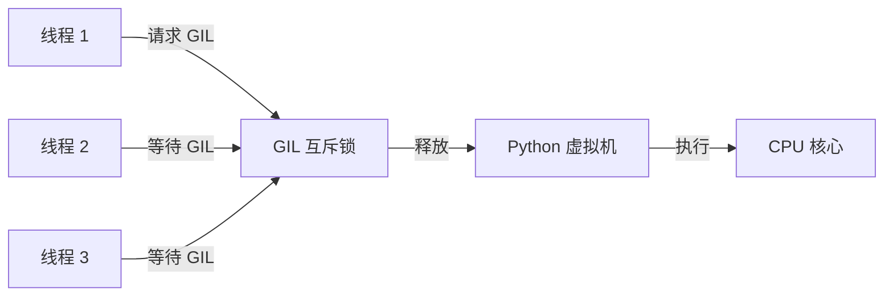
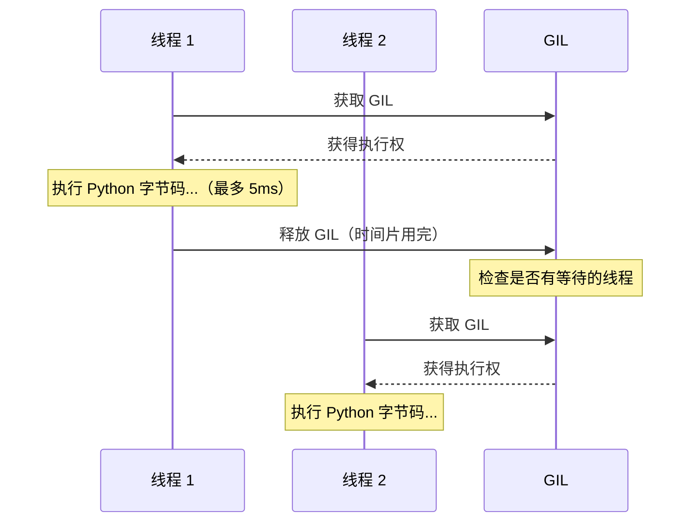
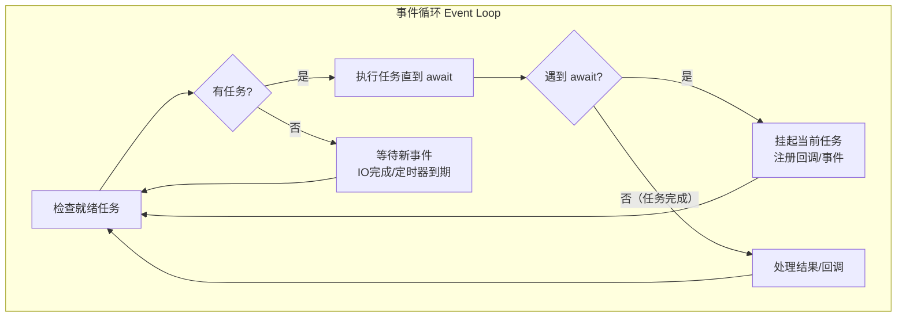
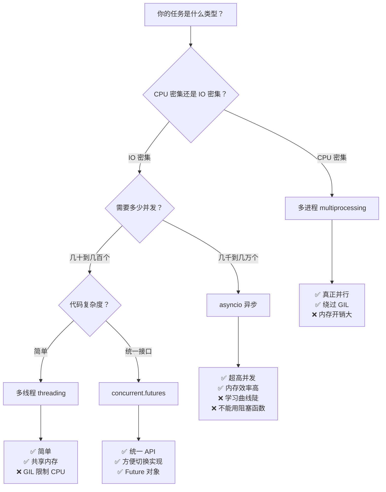

## 1.1 进程 vs 线程 vs 协程

先别急着写代码，我们先用生活中的例子搞清楚这三个概念。

:::tip 生活比喻
想象一家餐厅：

- **进程（Process）** = 一整家餐厅。每家餐厅有自己的厨房、食材、服务员，互不干扰。开新餐厅成本很高，但完全独立。
- **线程（Thread）** = 餐厅里的服务员。多个服务员共享同一个厨房和食材，能同时服务多桌客人。但共享资源时需要协调（比如两个人不能同时用同一个灶台）。
- **协程（Coroutine）** = 一个超级服务员。他可以同时点菜、上菜、收银——但一次只做一件事。在等菜的时候，他不会傻站着，而是去下一桌点菜。**不需要额外的服务员，但要求每个任务都能"暂停和恢复"。**
:::



**核心区别一览：**

| 特性 | 进程 | 线程 | 协程 |
|------|------|------|------|
| 创建开销 | 大 | 中 | 小 |
| 内存 | 独立 | 共享 | 共享 |
| 切换成本 | 高（内核态切换） | 中（内核态切换） | 低（用户态切换） |
| 数量上限 | 几十到几百 | 几千到上万 | 可以几十万 |
| 适用场景 | CPU 密集型 | IO 密集型 | 高并发 IO |
| 数据安全 | 天然安全 | 需要加锁 | 单线程，无竞态 |

如果你是 Java 开发者，可以类比为：进程 ≈ 独立 JVM 实例，线程 ≈ Java Thread，协程 ≈ Project Loom 的 Virtual Thread（但协程是用户态的，更轻量）。

---

## 1.2 GIL（全局解释器锁）详解

### 什么是 GIL？

GIL（Global Interpreter Lock）是 CPython（官方 Python 实现）中的一个**互斥锁**，它保证**同一时刻只有一个线程在执行 Python 字节码**。



### 为什么 Python 要有 GIL？

这要从 CPython 的**内存管理**说起。Python 用**引用计数**（Reference Counting）来管理对象的生命周期：

```python
import sys

a = [1, 2, 3]      # 引用计数 = 1
b = a               # 引用计数 = 2（a 和 b 指向同一个对象）
print(sys.getrefcount(a))  # 输出: 3（a, b, + getrefcount 的临时引用）
```

引用计数的增减（`+1` / `-1`）必须是**原子操作**。如果两个线程同时修改同一个对象的引用计数，就会出问题：

```
线程A: 读取 refcount = 5
线程B: 读取 refcount = 5    ← 两个线程同时读到了 5
线程A: 写入 refcount = 6    ← 应该是 6
线程B: 写入 refcount = 6    ← 应该是 7！结果丢失了一次引用！
```

:::warning 为什么不用更细粒度的锁？
理论上可以给每个对象加锁（Java 的 `synchronized` 就是这个思路），但 CPython 内部有大量对象操作，细粒度锁会导致：
1. **性能下降**——频繁的加锁/解锁操作
2. **死锁风险**——复杂的锁依赖关系
3. **代码复杂度爆炸**——每个对象操作都要处理锁

GIL 是一个简单粗暴但有效的解决方案：一把大锁，同一时刻只有一个线程能执行 Python 代码。
:::

### GIL 的实现原理

GIL 的本质是一个互斥锁 + 计数器：

```c
// CPython 简化版 GIL 实现（伪代码）
typedef struct {
    pthread_mutex_t mutex;     // 底层互斥锁
    pthread_cond_t cond;       // 条件变量（用于等待/通知）
    int locked;                // 锁状态
    int switching_allowed;     // 是否允许切换
    _Py_atomic_int gil_locked; // 原子变量
} _gil_runtime_state;
```

**GIL 什么时候释放？** 在 Python 3.2 之前，GIL 基于指令计数（每执行 N 条字节码释放一次）。从 Python 3.2 开始，采用**基于时间片**的策略（默认 5ms），更公平：



:::tip GIL 释放的时机
GIL 会在以下情况释放：
1. **时间片用完**（默认 5ms）
2. **遇到 IO 操作**（`time.sleep()`、`socket.recv()`、文件读写等）
3. **执行 C 扩展代码时主动释放**（如 NumPy 的矩阵运算）
:::

### GIL 对不同类型任务的影响

```python
import threading
import time

 ---- CPU 密集型任务 ----
def cpu_bound_task(n):
    """纯计算任务，会受 GIL 限制"""
    count = 0
    for i in range(n):
        count += i * i
    return count

 ---- IO 密集型任务 ----
def io_bound_task(seconds):
    """IO 任务，不受 GIL 限制（等待时会释放 GIL）"""
    time.sleep(seconds)  # sleep 时会释放 GIL
    return seconds

 性能对比
def benchmark():
    N = 50_000_000

    # CPU 密集型 - 单线程
    start = time.time()
    cpu_bound_task(N)
    single_cpu = time.time() - start

    # CPU 密集型 - 多线程
    start = time.time()
    threads = [threading.Thread(target=cpu_bound_task, args=(N,)) for _ in range(4)]
    for t in threads:
        t.start()
    for t in threads:
        t.join()
    multi_cpu = time.time() - start

    print(f"CPU 密集型 - 单线程: {single_cpu:.2f}s")
    print(f"CPU 密集型 - 4线程:  {multi_cpu:.2f}s")
    print(f"加速比: {single_cpu/multi_cpu:.2f}x（几乎没加速，甚至更慢！）")
    # 输出示例:
    # CPU 密集型 - 单线程: 1.85s
    # CPU 密集型 - 4线程:  2.10s
    # 加速比: 0.88x（多线程反而更慢，因为 GIL 切换有开销）

benchmark()
```

:::danger 关键结论
- **CPU 密集型**：多线程几乎**没有加速效果**，甚至更慢（GIL 切换开销）。应该用**多进程**。
- **IO 密集型**：多线程可以显著加速（IO 等待时释放 GIL，其他线程可以执行）。
:::

### 如何绕过 GIL？

```python
 方法 1：多进程（最常用，推荐）
from multiprocessing import Pool

def cpu_task(n):
    return sum(i * i for i in range(n))

with Pool(4) as p:
    results = p.map(cpu_task, [50_000_000] * 4)  # 真正的并行！
    # 4 个进程，每个有独立的 GIL，互不影响
```

```python
 方法 2：C 扩展（释放 GIL）
 在 C 扩展中可以手动释放 GIL，实现真正的并行
 伪代码：
 Py_BEGIN_ALLOW_THREADS  // 释放 GIL
 ... 执行 C 代码 ...
// Py_END_ALLOW_THREADS    // 重新获取 GIL
 NumPy、Pandas 的底层 C 代码就是这么做的
```

```python
 方法 3：free-threading Python 3.13+
 Python 3.13 开始实验性支持 free-threading（无 GIL 模式）
 编译时使用 --disable-gil 标志
 这是 Python 未来最激动人心的变化之一
```

:::warning 常见误解澄清
1. ❌ "GIL 导致 Python 不能并发" → ✅ Python 完全可以并发（IO 密集型多线程、多进程都能并发）
2. ❌ "GIL 导致 Python 不能并行" → ✅ 多进程可以实现真正的并行
3. ❌ "所有 Python 实现都有 GIL" → ✅ Jython、IronPython 没有 GIL
4. ❌ "去掉 GIL 就能解决所有问题" → ✅ 去掉 GIL 会导致单线程性能下降 10-30%
:::

---

## 1.3 threading 模块

### 创建线程的三种方式

```python
import threading
import time

 ====== 方式 1：函数方式（最常用）======
def download(url: str) -> None:
    print(f"开始下载 {url}")
    time.sleep(2)  # 模拟下载
    print(f"下载完成 {url}")

t1 = threading.Thread(target=download, args=("https://example.com/file1",))
t1.start()
t1.join()  # 等待线程结束
 输出:
 开始下载 https://example.com/file1
 下载完成 https://example.com/file1
```

```python
 ====== 方式 2：继承 Thread 类 ======
class DownloadThread(threading.Thread):
    """自定义线程类，适合需要封装状态的场景"""
    def __init__(self, url: str):
        super().__init__()
        self.url = url
        self.result = None  # 存储结果

    def run(self):
        """线程执行的入口方法"""
        print(f"开始下载 {self.url}")
        time.sleep(2)
        self.result = f"{self.url} 的内容"
        print(f"下载完成 {self.url}")

t = DownloadThread("https://example.com/file2")
t.start()
t.join()
print(t.result)  # 输出: https://example.com/file2 的内容
```

```python
 ====== 方式 3：daemon 线程 ======
def background_task():
    while True:
        print("后台任务运行中...")
        time.sleep(1)

daemon_t = threading.Thread(target=background_task, daemon=True)
daemon_t.start()
time.sleep(3)
 主线程结束后，daemon 线程会自动被杀掉
print("主线程结束，daemon 线程也随之结束")
 输出:
 后台任务运行中...
 后台任务运行中...
 后台任务运行中...
 主线程结束，daemon 线程也随之结束
```

### 线程同步原语

```python
import threading
import time

 ====== Lock（互斥锁）======
class BankAccount:
    """银行账户 - 必须加锁才能线程安全"""
    def __init__(self, balance: int = 0):
        self.balance = balance
        self.lock = threading.Lock()

    def deposit(self, amount: int):
        with self.lock:  # with 语句自动获取/释放锁
            old = self.balance
            time.sleep(0.001)  # 模拟处理时间（故意制造竞态窗口）
            self.balance = old + amount
            print(f"存入 {amount}，余额 {self.balance}")

account = BankAccount(1000)
threads = [threading.Thread(target=account.deposit, args=(100,)) for _ in range(10)]
for t in threads:
    t.start()
for t in threads:
    t.join()
print(f"最终余额: {account.balance}")  # 输出: 最终余额: 2000（正确！）
 如果不加锁，结果可能 < 2000（竞态条件）
```

```python
 ====== RLock（可重入锁）======
class RecursiveWorker:
    def __init__(self):
        self.rlock = threading.RLock()  # 可重入锁：同一线程可以多次获取

    def outer(self):
        with self.rlock:       # 第 1 次获取
            print("outer 获取锁")
            self.inner()        # 同一线程可以再次获取

    def inner(self):
        with self.rlock:       # 第 2 次获取（RLock 允许，Lock 会死锁！）
            print("inner 获取锁")

w = RecursiveWorker()
w.outer()
 输出:
 outer 获取锁
 inner 获取锁
```

```python
 ====== Semaphore（信号量）======
 限制同时访问某资源的线程数量
semaphore = threading.Semaphore(3)  # 最多 3 个线程同时运行

def limited_task(name):
    with semaphore:
        print(f"{name} 开始（当前最多 3 个并发）")
        time.sleep(2)
        print(f"{name} 完成")

for i in range(8):
    threading.Thread(target=limited_task, args=(f"任务{i}",)).start()
 输出: 最多同时 3 个任务在运行
```

```python
 ====== Event（事件通知）======
event = threading.Event()

def waiter(name):
    print(f"{name}: 等待信号...")
    event.wait()  # 阻塞，直到 event.set() 被调用
    print(f"{name}: 收到信号，继续执行！")

def setter():
    time.sleep(2)
    print("发送信号！")
    event.set()  # 唤醒所有等待的线程

threading.Thread(target=waiter, args=("A",)).start()
threading.Thread(target=waiter, args=("B",)).start()
threading.Thread(target=setter).start()
 输出:
 A: 等待信号...
 B: 等待信号...
 （2秒后）
 发送信号！
 A: 收到信号，继续执行！
 B: 收到信号，继续执行！
```

```python
 ====== Barrier（屏障）======
 让 N 个线程在某个点汇合，然后一起继续
barrier = threading.Barrier(3)

def worker(name):
    print(f"{name}: 到达屏障")
    barrier.wait()  # 等待所有 3 个线程都到达
    print(f"{name}: 一起出发！")

for name in ["A", "B", "C"]:
    threading.Thread(target=worker, args=(name,)).start()
 输出:
 A: 到达屏障
 B: 到达屏障
 C: 到达屏障
 A: 一起出发！  ← 三个线程几乎同时输出
 B: 一起出发！
 C: 一起出发！
```

### 线程安全的队列

```python
import queue
import threading
import time

 queue.Queue 是线程安全的 FIFO 队列
 内部已经用锁实现了，你不需要自己加锁！
q = queue.Queue(maxsize=10)  # 最多放 10 个元素

def producer():
    for i in range(5):
        item = f"商品-{i}"
        q.put(item)  # 如果队列满了会阻塞
        print(f"生产: {item}")
        time.sleep(0.5)

def consumer():
    while True:
        item = q.get()  # 如果队列空了会阻塞
        print(f"消费: {item}")
        q.task_done()   # 标记任务完成

t1 = threading.Thread(target=producer)
t2 = threading.Thread(target=consumer, daemon=True)
t1.start()
t2.start()
t1.join()
q.join()  # 等待所有任务被处理
print("全部处理完毕")
 输出:
 生产: 商品-0
 消费: 商品-0
 生产: 商品-1
 消费: 商品-1
 ... (依次生产消费)
 全部处理完毕
```

### 线程池

```python
from concurrent.futures import ThreadPoolExecutor, as_completed

 ====== 使用 map（最简单）======
def square(n):
    return n * n

with ThreadPoolExecutor(max_workers=4) as executor:
    # map 会自动分配任务到线程池
    results = list(executor.map(square, range(10)))
    print(results)  # 输出: [0, 1, 4, 9, 16, 25, 36, 49, 64, 81]
```

```python
 ====== 使用 submit + as_completed（更灵活）======
import time

def fetch_url(url):
    """模拟网页请求"""
    time.sleep(len(url) % 3)  # 模拟不同耗时
    return f"{url} 的内容"

urls = ["https://a.com", "https://bb.com", "https://ccc.com", "https://dddd.com"]

with ThreadPoolExecutor(max_workers=3) as executor:
    # submit 返回 Future 对象
    future_to_url = {
        executor.submit(fetch_url, url): url for url in urls
    }
    # as_completed 按完成顺序返回（不是提交顺序！）
    for future in as_completed(future_to_url):
        url = future_to_url[future]
        result = future.result()  # 获取结果（如果异常会抛出）
        print(f"完成: {url} -> {result}")
 输出（顺序不固定，谁先完成谁先出）:
 完成: https://bb.com -> https://bb.com 的内容
 完成: https://dddd.com -> https://dddd.com 的内容
 完成: https://a.com -> https://a.com 的内容
 完成: https://ccc.com -> https://ccc.com 的内容
```

### 常见陷阱

```python
 ====== 陷阱 1：死锁 ======
lock_a = threading.Lock()
lock_b = threading.Lock()

def task1():
    with lock_a:
        time.sleep(0.01)  # 给另一个线程抢占的机会
        with lock_b:  # 需要 lock_b，但 task2 持有 lock_b 在等 lock_a
            print("task1 完成")

def task2():
    with lock_b:
        time.sleep(0.01)
        with lock_a:  # 需要 lock_a，但 task1 持有 lock_a 在等 lock_b
            print("task2 完成")

 不要运行这段代码！它会死锁！
 解决方案：统一锁的获取顺序（都先获取 lock_a 再获取 lock_b）
```

```python
 ====== 陷阱 2：竞态条件 ======
counter = 0

def increment():
    global counter
    for _ in range(100000):
        counter += 1  # 这不是原子操作！read → add → write

threads = [threading.Thread(target=increment) for _ in range(10)]
for t in threads:
    t.start()
for t in threads:
    t.join()
print(f"counter = {counter}")  # 预期 1000000，实际可能远小于此！
 输出: counter = 482371（每次运行结果不同）
```

---

## 1.4 multiprocessing 模块

### Process 类

```python
from multiprocessing import Process, current_process
import os

def greet(name):
    print(f"[{current_process().name}] 你好 {name}, PID={os.getpid()}")
    # 输出: [Process-1] 你好 Alice, PID=12345

if __name__ == "__main__":
    # 必须加 if __name__ == "__main__"！
    # Windows 下子进程会重新导入模块，不加会导致无限创建子进程
    processes = [
        Process(target=greet, args=("Alice",)),
        Process(target=greet, args=("Bob",)),
    ]
    for p in processes:
        p.start()
    for p in processes:
        p.join()
    print("主进程结束")
    # 输出:
    # [Process-1] 你好 Alice, PID=12345
    # [Process-2] 你好 Bob, PID=12346
    # 主进程结束
```

:::warning Windows 用户注意
在 Windows 上，`multiprocessing` 使用 `spawn` 方式创建子进程（重新导入模块），所以**必须**把进程代码放在 `if __name__ == "__main__":` 下。macOS/Linux 默认用 `fork`（Linux）或 `spawn`（macOS Python 3.8+），也建议加这个保护。
:::

### 进程间通信（IPC）

```python
from multiprocessing import Process, Queue, Pipe

 ====== Queue（进程安全队列）======
def producer(q):
    for i in range(5):
        q.put(f"消息-{i}")

def consumer(q):
    while True:
        msg = q.get()
        if msg == "DONE":
            break
        print(f"收到: {msg}")

q = Queue()
p1 = Process(target=producer, args=(q,))
p2 = Process(target=consumer, args=(q,))
p1.start()
p2.start()
p1.join()
q.put("DONE")
p2.join()
 输出:
 收到: 消息-0
 收到: 消息-1
 ... 消息-4
```

```python
 ====== Pipe（双工管道）======
def send_data(conn):
    conn.send(["hello", "from", "child"])
    conn.close()

parent_conn, child_conn = Pipe()
p = Process(target=send_data, args=(child_conn,))
p.start()
data = parent_conn.recv()
print(data)  # 输出: ['hello', 'from', 'child']
p.join()
```

```python
 ====== 共享内存（Value、Array）======
from multiprocessing import Process, Value, Array

def modify_shared(counter, arr):
    with counter.get_lock():  # Value 和 Array 自带锁
        counter.value += 1
    for i in range(len(arr)):
        arr[i] = i * 2

counter = Value('i', 0)  # 'i' = int 类型，初始值 0
arr = Array('d', [0.0] * 5)  # 'd' = double 类型

p = Process(target=modify_shared, args=(counter, arr))
p.start()
p.join()
print(counter.value)  # 输出: 1
print(list(arr))       # 输出: [0.0, 2.0, 4.0, 6.0, 8.0]
```

### 进程池

```python
from multiprocessing import Pool

def heavy_compute(n):
    """CPU 密集型计算"""
    return sum(i ** 2 for i in range(n))

if __name__ == "__main__":
    # Pool 会自动创建和管理进程
    with Pool(processes=4) as pool:
        # map: 阻塞式，按顺序返回结果
        results = pool.map(heavy_compute, [10**6, 10**6, 10**6, 10**6])
        print(results)
        # 输出: [333332833333500000, 333332833333500000, ...]

        # imap: 惰性返回，适合大数据集
        for result in pool.imap(heavy_compute, [10**6] * 4):
            print(result)

        # apply_async: 异步提交，返回 AsyncResult
        async_result = pool.apply_async(heavy_compute, (10**7,))
        print(async_result.get(timeout=10))  # 获取结果，可设超时
```

### 多进程 vs 多线程性能对比

```python
import time
import threading
from multiprocessing import Pool

def cpu_task(n):
    return sum(i * i for i in range(n))

def benchmark():
    N = 10_000_000
    tasks = [N] * 8

    # 1. 串行
    start = time.time()
    [cpu_task(n) for n in tasks]
    serial = time.time() - start

    # 2. 多线程
    start = time.time()
    threads = [threading.Thread(target=cpu_task, args=(n,)) for n in tasks]
    for t in threads: t.start()
    for t in threads: t.join()
    threaded = time.time() - start

    # 3. 多进程
    start = time.time()
    with Pool(4) as p:
        p.map(cpu_task, tasks)
    multiprocess = time.time() - start

    print(f"串行:      {serial:.2f}s")
    print(f"多线程:    {threaded:.2f}s（几乎没加速）")
    print(f"多进程(4): {multiprocess:.2f}s（接近 4x 加速！）")
    # 输出示例:
    # 串行:      6.82s
    # 多线程:    6.95s（几乎没加速）
    # 多进程(4): 1.83s（接近 4x 加速！）

if __name__ == "__main__":
    benchmark()
```

---

## 1.5 asyncio 异步编程

### 什么是异步？事件循环是什么？

:::tip 餐厅服务员比喻
想象一个餐厅只有一个服务员（**单线程**），但有一个超能力：**可以暂停和恢复**任何任务。

1. 客人 A 点菜 → 服务员把菜单交给厨房（发起 IO 请求）
2. **服务员不会傻等** → 去服务客人 B 点菜
3. 厨房做好了 A 的菜 → 喊服务员（事件触发）
4. 服务员把菜端给 A（回调/恢复协程）

这就是**事件循环**（Event Loop）：一个不停转的大轮子，负责调度和执行各种任务。
:::



### async/await 语法详解

```python
import asyncio

async def fetch_data(url: str) -> dict:
    """async def 定义一个协程函数"""
    print(f"开始请求 {url}")
    # await 挂起当前协程，让事件循环去执行其他任务
    await asyncio.sleep(1)  # 模拟网络请求
    print(f"收到 {url} 的响应")
    return {"url": url, "data": "some data"}

async def main():
    # 方式 1：顺序执行（总耗时 3s）
    result1 = await fetch_data("url1")  # 等 1s
    result2 = await fetch_data("url2")  # 再等 1s
    result3 = await fetch_data("url3")  # 再等 1s
    print(f"顺序执行耗时约 3s")

    # 方式 2：并发执行（总耗时 1s！）
    # asyncio.gather 同时启动多个协程
    results = await asyncio.gather(
        fetch_data("url1"),
        fetch_data("url2"),
        fetch_data("url3"),
    )
    print(f"并发执行耗时约 1s！结果: {results}")

asyncio.run(main())
 输出:
 开始请求 url1
 收到 url1 的响应
 开始请求 url2
 收到 url2 的响应
 开始请求 url3
 收到 url3 的响应
 顺序执行耗时约 3s
 开始请求 url1
 开始请求 url2
 开始请求 url3
 （1s 后同时完成）
 收到 url1 的响应
 收到 url2 的响应
 收到 url3 的响应
 并发执行耗时约 1s！
```

### 创建异步任务

```python
import asyncio

async def task(name, delay):
    await asyncio.sleep(delay)
    return f"{name} 完成（延迟 {delay}s）"

async def main():
    # ====== asyncio.create_task：立即调度，不等待完成 ======
    t1 = asyncio.create_task(task("A", 1))
    t2 = asyncio.create_task(task("B", 2))
    # 此时两个任务已经在并发执行了
    print(await t1)  # 等 A 完成
    print(await t2)  # 等 B 完成

    # ====== asyncio.gather：收集所有结果 ======
    results = await asyncio.gather(
        task("C", 1),
        task("D", 2),
        task("E", 1),
    )
    print(results)  # ['C 完成（延迟 1s）', 'D 完成（延迟 2s）', 'E 完成（延迟 1s）']

    # ====== asyncio.wait：更精细的控制 ======
    done, pending = await asyncio.wait(
        [asyncio.create_task(task("F", 1)),
         asyncio.create_task(task("G", 3)),
         asyncio.create_task(task("H", 2))],
        timeout=2,  # 最多等 2 秒
        return_when=asyncio.FIRST_COMPLETED,  # 返回策略
    )
    # FIRST_COMPLETED: 第一个完成就返回
    # FIRST_EXCEPTION: 第一个异常就返回
    # ALL_COMPLETED:   全部完成才返回（默认）
    print(f"已完成 {len(done)} 个，未完成 {len(pending)} 个")

asyncio.run(main())
```

### 异步 HTTP 请求（aiohttp）

```python
import asyncio
import aiohttp
import time

async def fetch(session, url):
    """异步获取网页内容"""
    async with session.get(url) as response:
        return await response.text()

async def main():
    urls = [
        "https://httpbin.org/delay/1",
        "https://httpbin.org/delay/1",
        "https://httpbin.org/delay/1",
    ]

    start = time.time()
    async with aiohttp.ClientSession() as session:
        tasks = [fetch(session, url) for url in urls]
        results = await asyncio.gather(*tasks)
    elapsed = time.time() - start
    print(f"并发请求 {len(urls)} 个页面，总耗时 {elapsed:.2f}s")
    # 输出: 并发请求 3 个页面，总耗时 1.05s（而不是 3s！）

asyncio.run(main())
```

### 异步上下文管理器和迭代器

```python
import asyncio

 ====== async with（异步上下文管理器）======
class AsyncResource:
    async def __aenter__(self):
        print("获取资源（异步）")
        await asyncio.sleep(0.1)
        return self

    async def __aexit__(self, exc_type, exc_val, exc_tb):
        print("释放资源（异步）")
        await asyncio.sleep(0.1)
        return False

async def demo_context():
    async with AsyncResource() as r:
        print("使用资源")
    # 输出:
    # 获取资源（异步）
    # 使用资源
    # 释放资源（异步）

 ====== async for（异步迭代器）======
class AsyncCounter:
    def __init__(self, n):
        self.n = n
        self.i = 0

    def __aiter__(self):
        return self

    async def __anext__(self):
        await asyncio.sleep(0.1)
        self.i += 1
        if self.i > self.n:
            raise StopAsyncIteration
        return self.i

async def demo_iter():
    async for num in AsyncCounter(3):
        print(f"数字: {num}")
    # 输出:
    # 数字: 1
    # 数字: 2
    # 数字: 3

asyncio.run(demo_context())
asyncio.run(demo_iter())
```

### 常见陷阱：阻塞函数卡住事件循环

:::danger 这是 asyncio 最常见的坑！
在 `async` 函数里调用**阻塞函数**（如 `time.sleep()`、`requests.get()`、`open().read()`）会**卡住整个事件循环**，因为事件循环是单线程的！
:::

```python
import asyncio
import time

async def bad_example():
    """❌ 错误：time.sleep 会阻塞事件循环！"""
    print("开始")
    time.sleep(3)  # ❌ 整个事件循环被卡住 3 秒！其他协程也无法运行
    print("结束")

async def good_example():
    """✅ 正确：用 asyncio.sleep 替代"""
    print("开始")
    await asyncio.sleep(3)  # ✅ 只挂起当前协程，事件循环继续运行其他任务
    print("结束")

async def workaround():
    """✅ 当没有异步版本时，用 run_in_executor 放到线程池"""
    loop = asyncio.get_running_loop()
    # 把阻塞函数放到线程池中执行，不阻塞事件循环
    result = await loop.run_in_executor(None, time.sleep, 3)
    print("通过线程池执行完成")
```

---

## 1.6 三种并发模型选型指南



**一句话总结：**

| 场景 | 推荐方案 |
|------|---------|
| CPU 密集型（图像处理、科学计算） | `multiprocessing` |
| IO 密集型，中等并发（爬虫、API 调用） | `threading` 或 `ThreadPoolExecutor` |
| IO 密集型，超高并发（WebSocket、长连接） | `asyncio` |
| 想要统一接口，方便切换 | `concurrent.futures` |

---

## 1.7 concurrent.futures 统一接口

```python
from concurrent.futures import ThreadPoolExecutor, ProcessPoolExecutor

 ThreadPoolExecutor 和 ProcessPoolExecutor 有相同的 API！
 切换实现只需改一行代码

def heavy_work(n):
    return sum(i * i for i in range(n))

 线程池
with ThreadPoolExecutor(max_workers=4) as executor:
    future = executor.submit(heavy_work, 10**6)
    result = future.result()  # 阻塞等待结果
    print(result)

 进程池（只改了类名！）
with ProcessPoolExecutor(max_workers=4) as executor:
    future = executor.submit(heavy_work, 10**6)
    result = future.result()
    print(result)
```

---

## 1.8 Java 并发详细对比

```python
 === Python threading ===
import threading

def task():
    print("Hello")

t = threading.Thread(target=task)
t.start()
t.join()
```

```java
// === Java Thread ===
Thread t = new Thread(() -> System.out.println("Hello"));
t.start();
t.join();
```

| Python | Java | 说明 |
|--------|------|------|
| `threading.Thread` | `java.lang.Thread` | 基本线程 |
| `ThreadPoolExecutor` | `ExecutorService` | 线程池 |
| `ProcessPoolExecutor` | ❌ 无（需启动新 JVM） | 进程池 |
| `asyncio` | `CompletableFuture` / Virtual Thread | 异步 |
| `queue.Queue` | `BlockingQueue` | 线程安全队列 |
| `threading.Lock` | `ReentrantLock` | 可重入锁 |
| `threading.Event` | `CountDownLatch` | 事件/倒计时 |

:::tip Java Virtual Thread
Java 21 的 Virtual Thread（虚拟线程）和 Python 的 asyncio 协程很像：
- 都是用户态的轻量级线程
- 都适合 IO 密集型高并发
- 但 Virtual Thread 不需要改写代码（`new VirtualThread(...)` 替代 `new Thread(...)`），而 asyncio 需要用 `async/await`
:::

---

## 1.9 实战：并发爬虫

```python
import asyncio
import aiohttp
import threading
import time
from concurrent.futures import ThreadPoolExecutor
import requests  # 同步 HTTP 库

URLS = [f"https://httpbin.org/get?id={i}" for i in range(10)]

 ====== 同步版本（基准）======
def sync_crawl():
    start = time.time()
    for url in URLS:
        resp = requests.get(url)
    print(f"同步: {time.time() - start:.2f}s")

 ====== threading 版本 ======
def fetch_one(url):
    requests.get(url)

def threading_crawl():
    start = time.time()
    with ThreadPoolExecutor(max_workers=10) as executor:
        executor.map(fetch_one, URLS)
    print(f"线程池: {time.time() - start:.2f}s")

 ====== asyncio 版本 ======
async def async_fetch(session, url):
    async with session.get(url) as resp:
        return await resp.text()

async def asyncio_crawl():
    start = time.time()
    async with aiohttp.ClientSession() as session:
        await asyncio.gather(*[async_fetch(session, url) for url in URLS])
    print(f"asyncio: {time.time() - start:.2f}s")

 运行对比
sync_crawl()          # 同步: ~10s
threading_crawl()     # 线程池: ~1.2s
asyncio.run(asyncio_crawl())  # asyncio: ~0.5s
```

---

## 1.10 练习题

**题目 1**：使用 `threading.Lock` 实现一个线程安全的计数器类 `SafeCounter`，要求提供 `increment()` 和 `get()` 方法。


**参考答案**

```python
import threading

class SafeCounter:
    def __init__(self, initial=0):
        self._value = initial
        self._lock = threading.Lock()

    def increment(self):
        with self._lock:
            self._value += 1

    def get(self):
        with self._lock:
            return self._value
```


**题目 2**：使用 `asyncio` 实现：并发请求 5 个 URL，但只要其中 2 个完成就返回结果（提示：使用 `asyncio.wait` + `return_when`）。


**参考答案**

```python
import asyncio

async def fetch(url):
    await asyncio.sleep(1)
    return f"{url} done"

async def main():
    urls = [f"url-{i}" for i in range(5)]
    tasks = [asyncio.create_task(fetch(url)) for url in urls]
    done, pending = await asyncio.wait(tasks, return_when=asyncio.FIRST_COMPLETED)
    # FIRST_COMPLETED 只等第一个。要等 2 个，可以手动处理：
    # 或者使用 as_completed
    done2, pending2 = await asyncio.wait(pending, return_when=asyncio.FIRST_COMPLETED)
    all_done = done | done2
    for task in all_done:
        print(task.result())
    # 取消未完成的
    for task in pending2:
        task.cancel()

asyncio.run(main())
```


**题目 3**：用 `multiprocessing` 计算 1 到 1000 万的数字中所有质数的个数（提示：将范围分成 N 份，每份用一个进程处理）。


**参考答案**

```python
from multiprocessing import Pool

def is_prime(n):
    if n < 2: return False
    for i in range(2, int(n**0.5) + 1):
        if n % i == 0: return False
    return True

def count_primes(start, end):
    return sum(1 for i in range(start, end) if is_prime(i))

if __name__ == "__main__":
    N = 10_000_000
    chunks = [(i, i + N // 4) for i in range(0, N, N // 4)]
    with Pool(4) as p:
        results = p.starmap(count_primes, chunks)
    print(f"质数个数: {sum(results)}")  # 664579
```


**题目 4**：解释为什么以下代码可能会输出 counter < 1000000，以及如何修复。

```python
counter = 0
def inc():
    global counter
    for _ in range(100000):
        counter += 1
threads = [threading.Thread(target=inc) for _ in range(10)]
 ...
```


**参考答案**

`counter += 1` 不是原子操作，包含读取、加 1、写回三步。多线程同时执行时，可能发生竞态条件（两个线程读到相同的旧值，加 1 后写回，丢失一次递增）。

修复：使用 `threading.Lock` 或 `multiprocessing.Value`。


**题目 5**：在 asyncio 中，如果需要在协程里调用 `requests.get()`（阻塞函数），应该怎么处理？


**参考答案**

```python
import asyncio
import requests

async def fetch():
    loop = asyncio.get_running_loop()
    result = await loop.run_in_executor(None, requests.get, "https://example.com")
    return result
```

使用 `loop.run_in_executor(None, ...)` 将阻塞函数放到默认线程池中执行，不阻塞事件循环。


**题目 6**：用 `threading.Event` 实现一个简单的"启动门"（所有工作线程等待信号，收到信号后同时开始执行）。


**参考答案**

```python
import threading
import time

start_signal = threading.Event()

def worker(name):
    print(f"{name}: 准备就绪，等待信号...")
    start_signal.wait()
    print(f"{name}: 冲！")

threads = [threading.Thread(target=worker, args=(f"W{i}",)) for i in range(5)]
for t in threads: t.start()
time.sleep(1)
start_signal.set()
for t in threads: t.join()
```


---