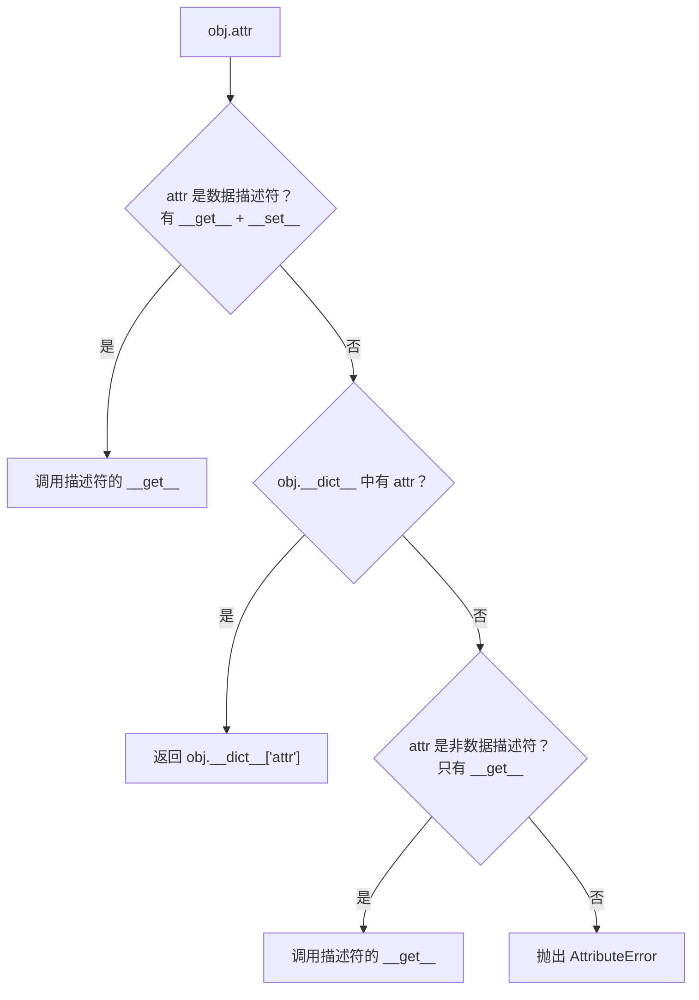

## 3.1 什么是描述符？

描述符是 Python 中**属性访问的底层协议**。当你访问 `obj.attr` 时，Python 实际上在背后调用了一套机制——如果 `attr` 是一个描述符，Python 会调用描述符的方法。

```python
 最简单的描述符
class MyDescriptor:
    def __get__(self, obj, objtype=None):
        print(f"__get__ 被调用: obj={obj}, objtype={objtype}")
        return 42

class MyClass:
    x = MyDescriptor()  # x 是类属性，值是一个描述符实例

obj = MyClass()
print(obj.x)   # 触发 __get__，输出: __get__ 被调用: obj=<MyClass>, objtype=<class 'MyClass'>
               # 然后输出: 42
print(MyClass.x)  # 触发 __get__，输出: __get__ 被调用: obj=None, objtype=<class 'MyClass'>
                   # 然后输出: 42
```

## 3.2 描述符协议

描述符协议定义了三个方法：

```python
class Descriptor:
    def __get__(self, obj, objtype=None):
        """获取属性值。obj 是实例，objtype 是类"""
        pass

    def __set__(self, obj, value):
        """设置属性值"""
        pass

    def __delete__(self, obj):
        """删除属性"""
        pass
```

- **数据描述符（Data Descriptor）**：同时定义了 `__get__` 和 `__set__`（或 `__delete__`）
- **非数据描述符（Non-data Descriptor）**：只定义了 `__get__`

## 3.3 属性查找优先级



**关键区别：数据描述符的优先级高于实例的 `__dict__`！**

```python
class DataDesc:
    """数据描述符：__get__ + __set__"""
    def __get__(self, obj, objtype=None):
        return "来自数据描述符"

    def __set__(self, obj, value):
        pass

class NonDataDesc:
    """非数据描述符：只有 __get__"""
    def __get__(self, obj, objtype=None):
        return "来自非数据描述符"

class MyClass:
    data = DataDesc()
    nondata = NonDataDesc()

obj = MyClass()
obj.__dict__['data'] = "实例的值"
obj.__dict__['nondata'] = "实例的值"

print(obj.data)     # "来自数据描述符"（数据描述符优先级 > 实例 __dict__）
print(obj.nondata)  # "实例的值"（非数据描述符优先级 < 实例 __dict__）
```

## 3.4 property 就是描述符

`property` 本质上是一个数据描述符类：

```python
 property 的等价实现（简化版）
class Property:
    """自己实现一个 property"""
    def __init__(self, fget=None, fset=None, fdel=None):
        self.fget = fget
        self.fset = fset
        self.fdel = fdel

    def __get__(self, obj, objtype=None):
        if obj is None:
            return self
        return self.fget(obj)

    def __set__(self, obj, value):
        self.fset(obj, value)

 使用
class Circle:
    def __init__(self, radius):
        self._radius = radius

    @Property
    def radius(self):
        return self._radius

    @radius.setter
    def radius(self, value):
        if value < 0:
            raise ValueError("半径不能为负数")
        self._radius = value

c = Circle(5)
print(c.radius)    # 5
c.radius = 10      # 正常
 c.radius = -1    # ValueError: 半径不能为负数
```

`classmethod` 和 `staticmethod` 也是描述符：

```python
 classmethod 的等价实现
class ClassMethodDescriptor:
    def __init__(self, func):
        self.func = func

    def __get__(self, obj, objtype=None):
        # 返回一个绑定到类（而不是实例）的函数
        return self.func.__get__(objtype, type(objtype))

 staticmethod 的等价实现
class StaticMethodDescriptor:
    def __init__(self, func):
        self.func = func

    def __get__(self, obj, objtype=None):
        # 直接返回原函数，不做任何绑定
        return self.func
```

## 3.5 自定义描述符实战

### 类型验证描述符

```python
class TypedField:
    """类型验证描述符"""
    def __init__(self, field_type, field_name=None):
        self.field_type = field_type
        self.field_name = field_name

    def __set_name__(self, owner, name):
        """Python 3.6+: 自动获取属性名"""
        self.field_name = name

    def __get__(self, obj, objtype=None):
        if obj is None:
            return self
        return obj.__dict__.get(self.field_name)

    def __set__(self, obj, value):
        if not isinstance(value, self.field_type):
            raise TypeError(
                f"{self.field_name} 必须是 {self.field_type}，"
                f"收到 {type(value).__name__}"
            )
        obj.__dict__[self.field_name] = value

class User:
    name = TypedField(str)
    age = TypedField(int)
    email = TypedField(str)

u = User()
u.name = "Alice"    # ✅
u.age = 30           # ✅
 u.age = "thirty"  # TypeError: age 必须是 <class 'int'>，收到 str
```

### 延迟计算描述符

```python
class LazyProperty:
    """只在第一次访问时计算，之后缓存结果"""
    def __init__(self, func):
        self.func = func
        self.attr_name = f"_lazy_{func.__name__}"

    def __get__(self, obj, objtype=None):
        if obj is None:
            return self
        if not hasattr(obj, self.attr_name):
            value = self.func(obj)
            setattr(obj, self.attr_name, value)
        return getattr(obj, self.attr_name)

class DataProcessor:
    def __init__(self, data):
        self.data = data

    @LazyProperty
    def expensive_result(self):
        """耗时计算，只算一次"""
        print("执行耗时计算...")
        return sum(x ** 2 for x in self.data)

dp = DataProcessor(range(1000000))
print(dp.expensive_result)  # 第一次: "执行耗时计算..." + 结果
print(dp.expensive_result)  # 第二次: 直接返回缓存（不打印）
```

## 3.6 实战：ORM 字段定义

```python
class Field:
    """ORM 字段描述符"""
    def __init__(self, column_type, column_name=None, nullable=True):
        self.column_type = column_type
        self.column_name = column_name
        self.nullable = nullable

    def __set_name__(self, owner, name):
        self.column_name = self.column_name or name
        self.name = name

    def __get__(self, obj, objtype=None):
        if obj is None:
            return self
        return obj.__dict__.get(self.name)

    def __set__(self, obj, value):
        if value is None and not self.nullable:
            raise ValueError(f"{self.name} 不能为 NULL")
        obj.__dict__[self.name] = value

    def to_sql(self):
        null = "" if self.nullable else " NOT NULL"
        return f"{self.column_name} {self.column_type}{null}"

class ModelMeta(type):
    """收集 Field 描述符"""
    def __new__(mcs, name, bases, namespace):
        cls = super().__new__(mcs, name, bases, namespace)
        cls._fields = {
            k: v for k, v in namespace.items()
            if isinstance(v, Field)
        }
        return cls

class BaseModel(metaclass=ModelMeta):
    pass

class User(BaseModel):
    id = Field("INTEGER", nullable=False)
    name = Field("TEXT", nullable=False)
    email = Field("TEXT")
    age = Field("INTEGER")

 生成建表 SQL
def create_table_sql(model_class):
    fields = ", ".join(f.to_sql() for f in model_class._fields.values())
    return f"CREATE TABLE {model_class.__name__} ({fields});"

print(create_table_sql(User))
 CREATE TABLE User (id INTEGER NOT NULL, name TEXT NOT NULL, email TEXT, age INTEGER);
```

:::tip Java 对比
Java 没有描述符的概念。类似功能通过 **getter/setter**、**注解**（`@NotNull`）、**AOP**（AspectJ）实现。Python 的描述符让属性访问的控制更优雅——你只需要定义一个描述符类，然后在目标类中声明即可，不需要手写 getter/setter。
:::

---

## 3.7 练习题

**题目 1**：实现一个 `RangeField` 描述符，确保赋值在指定范围内（如 `age = RangeField(0, 150)`）。


**参考答案**

```python
class RangeField:
    def __init__(self, min_val, max_val):
        self.min_val = min_val
        self.max_val = max_val

    def __set_name__(self, owner, name):
        self.name = name

    def __get__(self, obj, objtype=None):
        if obj is None:
            return self
        return obj.__dict__.get(self.name)

    def __set__(self, obj, value):
        if not (self.min_val <= value <= self.max_val):
            raise ValueError(f"{self.name} 必须在 {self.min_val}-{self.max_val} 之间")
        obj.__dict__[self.name] = value

class Person:
    age = RangeField(0, 150)

p = Person()
p.age = 25     # ✅
 p.age = 200  # ValueError: age 必须在 0-150 之间
```


**题目 2**：解释为什么 `property` 是数据描述符，而 `classmethod` 的返回值不是数据描述符。


**参考答案**

`property` 同时实现了 `__get__` 和 `__set__`，所以是数据描述符。数据描述符的优先级高于实例的 `__dict__`，这就是为什么 `obj.x = 5` 会触发 `property` 的 `__set__` 而不是直接写入 `__dict__`。

`classmethod` 返回的是一个绑定方法（bound method），它没有 `__set__`，所以不是数据描述符。`staticmethod` 返回的是普通函数，也没有 `__set__`。


**题目 3**：实现一个描述符，记录属性被访问和修改的次数。


**参考答案**

```python
class TrackedField:
    def __init__(self):
        self.get_count = 0
        self.set_count = 0

    def __set_name__(self, owner, name):
        self.name = name

    def __get__(self, obj, objtype=None):
        if obj is None:
            return self
        self.get_count += 1
        return obj.__dict__.get(self.name)

    def __set__(self, obj, value):
        self.set_count += 1
        obj.__dict__[self.name] = value

class Config:
    debug = TrackedField()

c = Config()
c.debug = True     # set_count = 1
_ = c.debug        # get_count = 1
_ = c.debug        # get_count = 2
print(Config.debug.get_count)  # 2
print(Config.debug.set_count)  # 1
```


**题目 4**：如果一个类同时定义了 `__getattr__` 和一个数据描述符，访问不存在的属性时会发生什么？


**参考答案**

属性查找顺序：数据描述符 > `obj.__dict__` > 非数据描述符 > `__getattr__`。如果访问的是描述符定义的属性，直接调用描述符的 `__get__`。如果访问不存在的属性，才会触发 `__getattr__`。数据描述符不会影响 `__getattr__` 的行为——它们作用于不同的属性。


**题目 5**：用描述符实现一个 `CachedProperty`，在对象被删除时自动清理缓存。


**参考答案**

```python
class CachedProperty:
    def __init__(self, func):
        self.func = func
        self.cache_key = f"_cached_{func.__name__}"

    def __set_name__(self, owner, name):
        self.name = name

    def __get__(self, obj, objtype=None):
        if obj is None:
            return self
        if self.cache_key not in obj.__dict__:
            obj.__dict__[self.cache_key] = self.func(obj)
        return obj.__dict__[self.cache_key]

class Data:
    @CachedProperty
    def computed(self):
        print("计算中...")
        return 42

d = Data()
print(d.computed)  # "计算中..." 42
print(d.computed)  # 42（缓存）
```


---