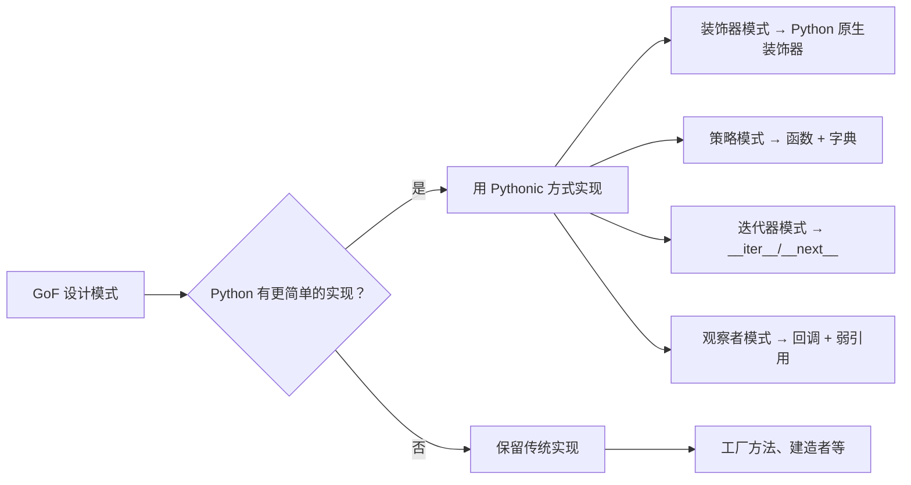

## 5.1 为什么 Python 的设计模式和 GoF 的不一样？

GoF（Gang of Four）的 23 种设计模式是针对 **C++/Java** 这类静态语言设计的。Python 作为动态语言，很多模式可以用更简洁的方式实现：



:::tip 原则
在 Python 中，如果一个问题可以用**一等函数**、**鸭子类型**或**装饰器**解决，就优先用 Pythonic 的方式，而不是照搬 GoF 的类继承方案。
:::

## 5.2 创建型模式

### 单例模式

```python
 ====== 方式 1：装饰器（最 Pythonic）======
def singleton(cls):
    """单例装饰器"""
    instances = {}

    def wrapper(*args, **kwargs):
        if cls not in instances:
            instances[cls] = cls(*args, **kwargs)
        return instances[cls]

    return wrapper

@singleton
class Database:
    def __init__(self, host="localhost"):
        self.host = host

db1 = Database()
db2 = Database("other")
print(db1 is db2)   # True
print(db1.host)     # localhost（第一次创建的值）
```

```python
 ====== 方式 2：元类（最强大）======
class SingletonMeta(type):
    _instances = {}
    def __call__(cls, *args, **kwargs):
        if cls not in cls._instances:
            cls._instances[cls] = super().__call__(*args, **kwargs)
        return cls._instances[cls]

class Config(metaclass=SingletonMeta):
    pass
```

```python
 ====== 方式 3：模块级别（最简单）======
 singleton.py
class _Database:
    pass

database = _Database()  # 模块天然是单例

 其他文件中
 from singleton import database
```

### 工厂方法

```python
from dataclasses import dataclass

@dataclass
class PDFDocument:
    content: str
    def render(self):
        return f"[PDF] {self.content}"

@dataclass
class HTMLDocument:
    content: str
    def render(self):
        return f"<p>{self.content}</p>"

@dataclass
class MarkdownDocument:
    content: str
    def render(self):
        return f"# {self.content}"

 工厂函数 + 字典分发（Pythonic 工厂）
def create_document(doc_type: str, content: str):
    """工厂函数：根据类型创建文档"""
    factories = {
        'pdf': PDFDocument,
        'html': HTMLDocument,
        'md': MarkdownDocument,
    }
    cls = factories.get(doc_type)
    if cls is None:
        raise ValueError(f"不支持的文档类型: {doc_type}")
    return cls(content)

doc = create_document('pdf', "Hello World")
print(doc.render())  # [PDF] Hello World
```

### 建造者模式

```python
from dataclasses import dataclass, field

@dataclass
class HTTPRequest:
    method: str = "GET"
    url: str = ""
    headers: dict = field(default_factory=dict)
    params: dict = field(default_factory=dict)
    body: str | None = None

    class Builder:
        """链式建造者"""
        def __init__(self, url: str):
            self._req = HTTPRequest(url=url)

        def method(self, method: str) -> 'HTTPRequest.Builder':
            self._req.method = method
            return self  # 返回 self 实现链式调用

        def header(self, key: str, value: str) -> 'HTTPRequest.Builder':
            self._req.headers[key] = value
            return self

        def param(self, key: str, value: str) -> 'HTTPRequest.Builder':
            self._req.params[key] = value
            return self

        def body(self, body: str) -> 'HTTPRequest.Builder':
            self._req.body = body
            return self

        def build(self) -> HTTPRequest:
            return self._req

 使用
req = (HTTPRequest.Builder("https://api.example.com/users")
       .method("POST")
       .header("Content-Type", "application/json")
       .param("page", "1")
       .body('{"name": "Alice"}')
       .build())

print(req)
 HTTPRequest(method='POST', url='https://api.example.com/users',
             headers={'Content-Type': 'application/json'}, params={'page': '1'},
             body='{"name": "Alice"}')
```

## 5.3 结构型模式

### 适配器模式

```python
 Python 的鸭子类型天然就是适配器——只要接口兼容就行

class OldLogger:
    """旧日志系统"""
    def log_message(self, level: str, msg: str):
        print(f"[{level}] {msg}")

class NewLogger:
    """新日志系统"""
    def info(self, msg: str):
        print(f"[INFO] {msg}")

    def error(self, msg: str):
        print(f"[ERROR] {msg}")

class LoggerAdapter:
    """适配器：让新 Logger 兼容旧接口"""
    def __init__(self, new_logger: NewLogger):
        self._logger = new_logger

    def log_message(self, level: str, msg: str):
        method = getattr(self._logger, level.lower(), self._logger.info)
        method(msg)

 使用
old_code = LoggerAdapter(NewLogger())
old_code.log_message("INFO", "系统启动")
old_code.log_message("ERROR", "出错了")
 输出:
 [INFO] 系统启动
 [ERROR] 出错了
```

### 装饰器模式

```python
 Python 原生装饰器就是装饰器模式的语法糖！

import functools
import time

def retry(max_attempts=3, delay=1):
    """重试装饰器"""
    def decorator(func):
        @functools.wraps(func)
        def wrapper(*args, **kwargs):
            for attempt in range(max_attempts):
                try:
                    return func(*args, **kwargs)
                except Exception as e:
                    if attempt == max_attempts - 1:
                        raise
                    print(f"第 {attempt + 1} 次失败，{delay}s 后重试... ({e})")
                    time.sleep(delay)
        return wrapper
    return decorator

@retry(max_attempts=3, delay=0.5)
def unstable_api_call():
    """可能失败的 API 调用"""
    import random
    if random.random() < 0.5:
        raise ConnectionError("网络超时")
    return "成功"

result = unstable_api_call()
print(result)  # 可能输出重试日志后 "成功"
```

### 代理模式

```python
class LazyProxy:
    """延迟加载代理"""
    def __init__(self, factory):
        # object.__setattr__ 绕过 __setattr__，避免递归
        object.__setattr__(self, '_factory', factory)
        object.__setattr__(self, '_obj', None)

    def __getattr__(self, name):
        if object.__getattribute__(self, '_obj') is None:
            obj = object.__getattribute__(self, '_factory')()
            object.__setattr__(self, '_obj', obj)
        return getattr(object.__getattribute__(self, '_obj'), name)

 使用
class ExpensiveResource:
    def __init__(self):
        print("创建资源（耗时操作）...")
        self.data = "heavy data"

proxy = LazyProxy(ExpensiveResource)
 此时资源还没有被创建！
print(proxy.data)  # 第一次访问才创建: "创建资源（耗时操作）..." + "heavy data"
print(proxy.data)  # 直接返回: "heavy data"
```

## 5.4 行为型模式

### 策略模式

```python
 Python 一等函数 + 字典 = 策略模式

def bubble_sort(arr): ...
def quick_sort(arr): ...
def merge_sort(arr): ...

def sort_data(data, strategy='quick'):
    """策略模式：用字典分发"""
    strategies = {
        'bubble': bubble_sort,
        'quick': quick_sort,
        'merge': merge_sort,
    }
    sorter = strategies[strategy]
    return sorter(data)
```

### 观察者模式

```python
import weakref
from typing import Callable

class EventBus:
    """基于弱引用的事件总线"""
    def __init__(self):
        self._subscribers: dict[str, list[Callable]] = {}

    def subscribe(self, event: str, callback: Callable) -> None:
        # 用弱引用避免内存泄漏
        ref = weakref.WeakMethod(callback) if hasattr(callback, '__self__') else weakref.ref(callback)
        self._subscribers.setdefault(event, []).append(ref)

    def emit(self, event: str, *args, **kwargs) -> None:
        for ref in self._subscribers.get(event, []):
            callback = ref()
            if callback is not None:  # 对象还活着
                callback(*args, **kwargs)

bus = EventBus()

def on_user_login(user):
    print(f"欢迎 {user}！")

bus.subscribe("login", on_user_login)
bus.emit("login", "Alice")  # 欢迎 Alice！
```

### 迭代器模式

```python
class Fibonacci:
    """斐波那契数列迭代器"""
    def __init__(self, n: int):
        self.n = n
        self.a, self.b = 0, 1
        self.count = 0

    def __iter__(self):
        return self

    def __next__(self):
        if self.count >= self.n:
            raise StopIteration
        value = self.a
        self.a, self.b = self.b, self.a + self.b
        self.count += 1
        return value

for num in Fibonacci(10):
    print(num, end=" ")
 0 1 1 2 3 5 8 13 21 34
```

### 命令模式

```python
class Command:
    """可执行的命令对象"""
    def __init__(self, name, func, *args, **kwargs):
        self.name = name
        self._func = func
        self._args = args
        self._kwargs = kwargs

    def execute(self):
        return self._func(*self._args, **self._kwargs)

    def undo(self):
        print(f"撤销命令: {self.name}")

 使用
def create_file(path, content):
    print(f"创建文件 {path}: {content}")
    return path

def delete_file(path):
    print(f"删除文件 {path}")

 命令队列
commands = [
    Command("创建配置", create_file, "/tmp/config.json", "{}"),
    Command("创建日志", create_file, "/tmp/log.txt", ""),
    Command("删除临时", delete_file, "/tmp/temp"),
]

for cmd in commands:
    cmd.execute()

 撤销最后一个
commands[-1].undo()
 输出:
 创建文件 /tmp/config.json: {}
 创建文件 /tmp/log.txt:
 删除文件 /tmp/temp
 撤销命令: 删除临时
```

## 5.5 Java 设计模式对比

| 模式 | Java 实现 | Python 实现 | 差异 |
|------|----------|-------------|------|
| 单例 | `enum` / 双重检查锁 | 装饰器 / 元类 / 模块 | Python 更简洁 |
| 工厂方法 | `Factory` 接口 + 多个实现类 | 函数 + 字典分发 | Python 不需要那么多类 |
| 策略 | `Strategy` 接口 + 多个类 | 函数 + 字典 | 同上 |
| 装饰器 | `Decorator` 接口 + 包装类 | `@decorator` 语法糖 | Python 原生支持 |
| 适配器 | `Adapter` 类 | 鸭子类型 / 简单包装 | Python 鸭子类型天然适配 |
| 观察者 | `Listener` 接口 + `EventObject` | 回调 + 弱引用 | 更轻量 |

:::tip 核心观点
Python 的**一等函数**、**鸭子类型**和**装饰器语法**让很多 GoF 模式变得不必要或更简单。不要为了用模式而用模式，Pythonic 的方式往往更简洁。
:::

---

## 5.6 练习题

**题目 1**：用装饰器实现一个缓存装饰器 `@cache`，缓存函数的返回值（提示：用 `functools.lru_cache` 的原理自己实现）。


**参考答案**

```python
import functools

def cache(func):
    cache_dict = {}

    @functools.wraps(func)
    def wrapper(*args):
        if args not in cache_dict:
            cache_dict[args] = func(*args)
        return cache_dict[args]

    wrapper.cache_clear = cache_dict.clear
    return wrapper

@cache
def fibonacci(n):
    if n < 2:
        return n
    return fibonacci(n - 1) + fibonacci(n - 2)

print(fibonacci(100))  # 354224848179261915075
```


**题目 2**：用建造者模式实现一个 SQL 查询构建器。


**参考答案**

```python
class QueryBuilder:
    def __init__(self, table: str):
        self._table = table
        self._conditions = []
        self._order_by = None
        self._limit = None

    def where(self, condition: str) -> 'QueryBuilder':
        self._conditions.append(condition)
        return self

    def order_by(self, column: str, direction: str = "ASC") -> 'QueryBuilder':
        self._order_by = f"{column} {direction}"
        return self

    def limit(self, n: int) -> 'QueryBuilder':
        self._limit = n
        return self

    def build(self) -> str:
        sql = f"SELECT * FROM {self._table}"
        if self._conditions:
            sql += " WHERE " + " AND ".join(self._conditions)
        if self._order_by:
            sql += f" ORDER BY {self._order_by}"
        if self._limit:
            sql += f" LIMIT {self._limit}"
        return sql

sql = (QueryBuilder("users")
       .where("age > 18")
       .where("status = 'active'")
       .order_by("created_at", "DESC")
       .limit(10)
       .build())

print(sql)
 SELECT * FROM users WHERE age > 18 AND status = 'active' ORDER BY created_at DESC LIMIT 10
```


**题目 3**：用策略模式实现一个支持多种压缩算法的压缩器（gzip、bz2、lzma）。


**参考答案**

```python
import gzip, bz2, lzma

def compress_gzip(data: bytes) -> bytes:
    return gzip.compress(data)

def compress_bz2(data: bytes) -> bytes:
    return bz2.compress(data)

def compress_lzma(data: bytes) -> bytes:
    return lzma.compress(data)

def compress(data: bytes, algorithm: str = "gzip") -> bytes:
    strategies = {
        'gzip': compress_gzip,
        'bz2': compress_bz2,
        'lzma': compress_lzma,
    }
    return strategies[algorithm](data)

result = compress(b"Hello World!", "gzip")
print(len(result))  # 31
```


**题目 4**：实现一个线程安全的单例模式（结合 threading.Lock）。


**参考答案**

```python
import threading

class SingletonMeta(type):
    _instances = {}
    _lock = threading.Lock()

    def __call__(cls, *args, **kwargs):
        if cls not in cls._instances:
            with cls._lock:
                if cls not in cls._instances:  # 双重检查
                    cls._instances[cls] = super().__call__(*args, **kwargs)
        return cls._instances[cls]

class Database(metaclass=SingletonMeta):
    pass
```


**题目 5**：用观察者模式实现一个简单的 pub-sub 系统。


**参考答案**

```python
from collections import defaultdict

class PubSub:
    def __init__(self):
        self._channels = defaultdict(list)

    def subscribe(self, channel, callback):
        self._channels[channel].append(callback)

    def publish(self, channel, message):
        for cb in self._channels[channel]:
            cb(message)

ps = PubSub()
ps.subscribe("news", lambda msg: print(f"读者A: {msg}"))
ps.subscribe("news", lambda msg: print(f"读者B: {msg}"))
ps.publish("news", "Python 3.13 发布了！")
 读者A: Python 3.13 发布了！
 读者B: Python 3.13 发布了！
```


---