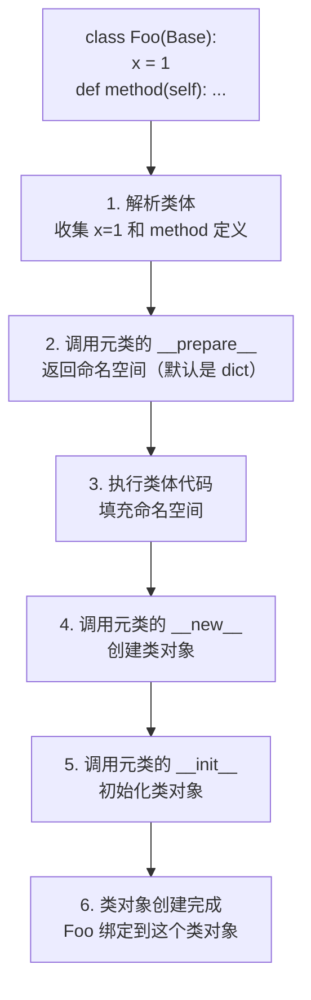
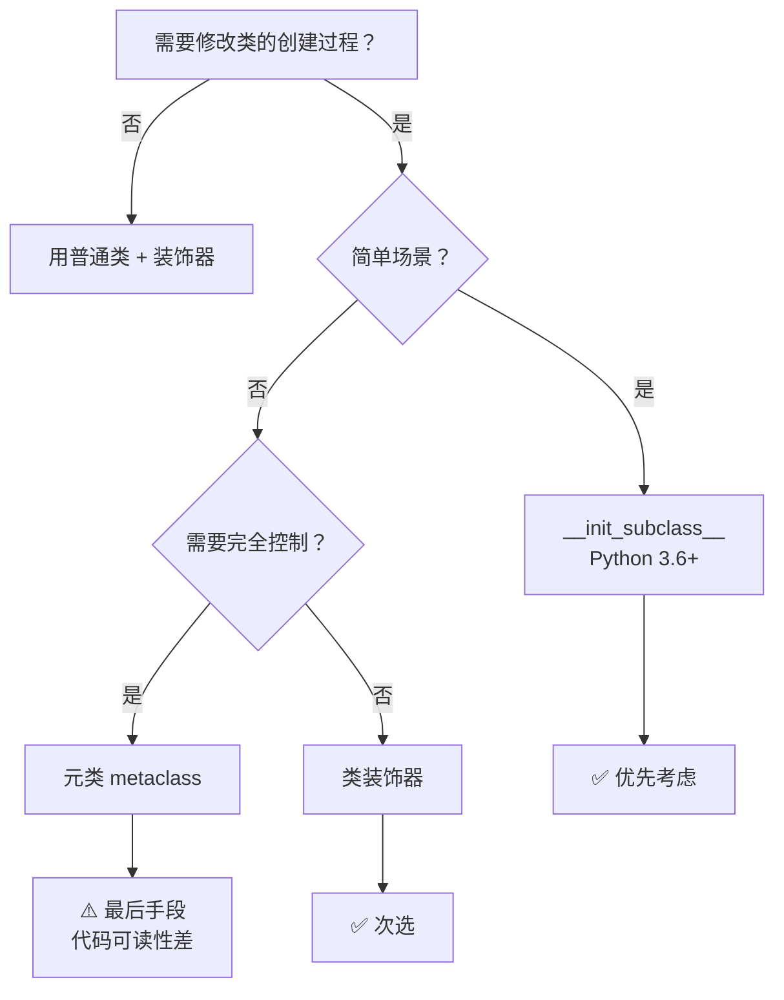

## 2.1 类也是对象

在 Python 中，**一切皆对象**。整数是对象，字符串是对象，函数是对象，**类也是对象**。

```python
class Dog:
    pass

 类是对象？验证一下：
print(type(Dog))          # 输出: <class 'type'>
print(Dog.__class__)      # 输出: <class 'type'>
print(isinstance(Dog, type))  # 输出: True

 类有属性和方法？当然有（因为它是对象）
print(hasattr(Dog, '__name__'))    # True
print(hasattr(Dog, '__dict__'))    # True
print(Dog.__name__)                # 'Dog'

 你甚至可以在运行时修改类（因为类是可变对象）
Dog.species = "犬科"
print(Dog.species)  # 输出: 犬科
```

:::tip 核心理解
在 Python 中，`Dog` 不仅仅是一个"类的定义"，它本身就是一个**对象**，这个对象的类型是 `type`。
- 对象是类的实例 → `d = Dog()`，`type(d)` 是 `Dog`
- 类是元类的实例 → `Dog = type('Dog', (), {})`，`type(Dog)` 是 `type`
- `type` 既是函数，也是类，也是自己的元类（套娃了）
:::

## 2.2 type() 的三重身份

```python
 身份 1：查看类型
print(type(42))        # <class 'int'>
print(type("hello"))   # <class 'str'>
print(type(Dog))       # <class 'type'>

 身份 2：创建类（type(name, bases, dict)）
 这就是 class 语句在底层做的事！
MyClass = type('MyClass', (object,), {
    'x': 10,
    'greet': lambda self: f"Hello, x={self.x}",
})
obj = MyClass()
print(obj.greet())  # 输出: Hello, x=10

 身份 3：作为元类（所有类的默认元类都是 type）
print(type.__class__)  # <class 'type'>（type 的类型是自己）
```

等价写法：

```python
 这两种写法完全等价：
class Dog:
    species = "犬科"
    def bark(self):
        return "汪汪！"

 底层等价于：
Dog = type('Dog', (), {
    'species': "犬科",
    'bark': lambda self: "汪汪！",
})
```

## 2.3 类的创建过程

当你写下 `class Foo:` 时，Python 实际上执行了以下步骤：



### \_\_new\_\_ vs \_\_init\_\_

```python
 __new__：负责创建对象（分配内存），返回对象的实例
 __init__：负责初始化对象（设置属性），不返回任何值

class Meta(type):
    def __new__(mcs, name, bases, namespace):
        """创建类对象时调用（类还没被创建）"""
        print(f"__new__: 正在创建类 {name}")
        # mcs = 元类本身（Meta）
        # name = 类名
        # bases = 父类元组
        # namespace = 类的命名空间 dict
        cls = super().__new__(mcs, name, bases, namespace)
        return cls  # 必须返回创建的类对象

    def __init__(cls, name, bases, namespace):
        """初始化类对象时调用（类已经被创建）"""
        print(f"__init__: 正在初始化类 {name}")
        super().__init__(name, bases, namespace)

class Foo(metaclass=Meta):
    x = 1

 输出:
 __new__: 正在创建类 Foo
 __init__: 正在初始化类 Foo
```

## 2.4 自定义元类

```python
class ValidationMeta(type):
    """自动验证类属性的元类"""

    def __new__(mcs, name, bases, namespace):
        # 确保所有类都以 _Model 结尾
        if not name.endswith('Model'):
            raise ValueError(f"类名必须以 'Model' 结尾， got: {name}")

        # 自动给类添加 created_at 属性
        namespace.setdefault('created_at', None)

        return super().__new__(mcs, name, bases, namespace)

class UserModel(metaclass=ValidationMeta):
    name: str
    email: str

 UserModel(metaclass=ValidationMeta)  # 报错: 类名必须以 'Model' 结尾
print(hasattr(UserModel, 'created_at'))  # True
```

```python
class SingletonMeta(type):
    """单例模式元类"""
    _instances = {}

    def __call__(cls, *args, **kwargs):
        # __call__ 控制类的实例化过程
        if cls not in cls._instances:
            cls._instances[cls] = super().__call__(*args, **kwargs)
        return cls._instances[cls]

class Database(metaclass=SingletonMeta):
    def __init__(self, host="localhost"):
        self.host = host

db1 = Database("localhost")
db2 = Database("127.0.0.1")
print(db1 is db2)       # True（同一个实例）
print(db1.host)         # localhost（第一次创建的值）
print(db2.host)         # localhost（返回的是同一个对象）
```

```python
class RegistryMeta(type):
    """自动注册插件"""
    registry = {}

    def __new__(mcs, name, bases, namespace):
        cls = super().__new__(mcs, name, bases, namespace)
        # 跳过基类本身
        if not namespace.get('__abstract__', False):
            mcs.registry[name] = cls
        return cls

class Plugin(metaclass=RegistryMeta):
    __abstract__ = True  # 基类不注册

class EmailPlugin(Plugin):
    def send(self, msg):
        return f"发送邮件: {msg}"

class SMSPlugin(Plugin):
    def send(self, msg):
        return f"发送短信: {msg}"

print(RegistryMeta.registry)
 {'EmailPlugin': <class '__main__.EmailPlugin'>, 'SMSPlugin': <class '__main__.SMSPlugin'>}
```

```python
class InterfaceMeta(type):
    """类似 Java interface 的接口检查"""
    def __new__(mcs, name, bases, namespace):
        cls = super().__new__(mcs, name, bases, namespace)
        # 检查是否实现了所有要求的方法
        abstract_methods = getattr(cls, '__abstract_methods__', set())
        for method in abstract_methods:
            if not hasattr(cls, method) or getattr(cls, method) is None:
                raise TypeError(f"{name} 必须实现 {method} 方法")
        return cls

class Animal(metaclass=InterfaceMeta):
    __abstract_methods__ = {'speak', 'move'}

class Dog(Animal):
    def speak(self):
        return "汪汪"

 TypeError: Dog 必须实现 move 方法
```

## 2.5 \_\_init_subclass\_\_（元类的轻量替代）

Python 3.6+ 引入了 `__init_subclass__`，让你**不需要元类**就能在子类化时自动执行代码：

```python
class PluginBase:
    # 每当有类继承 PluginBase 时，这个方法会被调用
    def __init_subclass__(cls, /, **kwargs):
        super().__init_subclass__(**kwargs)
        # 自动注册
        if not hasattr(cls, 'name'):
            cls.name = cls.__name__

class EmailPlugin(PluginBase):
    pass

class SMSPlugin(PluginBase):
    name = "sms-sender"

print(EmailPlugin.name)   # 'EmailPlugin'（自动设置）
print(SMSPlugin.name)     # 'sms-sender'（手动设置的）
```

```python
class Validated:
    """用 __init_subclass__ 实现属性验证"""
    def __init_subclass__(cls, required_fields=None, **kwargs):
        super().__init_subclass__(**kwargs)
        cls._required = required_fields or []

    def validate(self):
        for field in self._required:
            if not getattr(self, field, None):
                raise ValueError(f"字段 '{field}' 不能为空")

class User(Validated, required_fields=['name', 'email']):
    def __init__(self, name, email):
        self.name = name
        self.email = email

u = User("Alice", "alice@example.com")
u.validate()  # 通过

u2 = User("", "bob@example.com")
u2.validate()  # ValueError: 字段 'name' 不能为空
```

## 2.6 元类的最佳实践和反模式



:::warning 什么时候不用元类
- 如果装饰器能解决，就不要用元类
- 如果 `__init_subclass__` 能解决，就不要用元类
- 元类会让代码难以理解和调试
- Django 的 Model 用元类是因为确实需要（SQL 表创建、字段元信息收集），不是装酷
:::

**元类 vs 装饰器 vs 混入类：**

| 方案 | 适用场景 | 优点 | 缺点 |
|------|---------|------|------|
| 装饰器 | 修改已有类 | 简单、可读 | 不能阻止类被创建 |
| 混入类 | 添加功能 | 支持继承 | 方法冲突风险 |
| `__init_subclass__` | 子类自动注册/验证 | 不需要元类 | Python 3.6+ |
| 元类 | 完全控制类创建 | 最强大 | 复杂、难调试 |

**Java 对比：** Java 没有元类的概念。类似功能通过**注解处理器**（Annotation Processor）和**反射**实现。Django 的 ORM 用元类自动建表，Java 的 JPA/Hibernate 用注解 `@Entity` + 运行时反射。

---

## 2.7 练习题

**题目 1**：实现一个元类 `CountInstancesMeta`，让所有使用该元类的类自动记录实例化次数。


**参考答案**

```python
class CountInstancesMeta(type):
    def __new__(mcs, name, bases, namespace):
        cls = super().__new__(mcs, name, bases, namespace)
        cls._count = 0
        return cls

    def __call__(cls, *args, **kwargs):
        cls._count += 1
        return super().__call__(*args, **kwargs)

class User(metaclass=CountInstancesMeta):
    pass

u1 = User()
u2 = User()
print(User._count)  # 2
```


**题目 2**：用 `__init_subclass__` 实现一个 `JSONSerializable` 基类，子类自动获得 `to_json()` 方法（提示：用 `__init_subclass__` 给子类注入方法）。


**参考答案**

```python
import json

class JSONSerializable:
    def __init_subclass__(cls, **kwargs):
        super().__init_subclass__(**kwargs)

        def to_json(self):
            return json.dumps(self.__dict__, ensure_ascii=False, default=str)

        cls.to_json = to_json

class Person(JSONSerializable):
    def __init__(self, name, age):
        self.name = name
        self.age = age

p = Person("Alice", 30)
print(p.to_json())  # {"name": "Alice", "age": 30}
```


**题目 3**：解释 `type('Foo', (), {})` 和 `class Foo: pass` 的区别和联系。


**参考答案**

两者完全等价。`class Foo: pass` 是语法糖，Python 在执行时会调用 `type.__new__` 和 `type.__init__` 来创建类对象。底层上，`class` 语句做的事情就是收集类体中的属性和方法，然后调用元类的 `__new__` 和 `__init__`。


**题目 4**：为什么元类的 `__call__` 方法能控制实例化过程？


**参考答案**

当你调用 `Foo()` 时，实际调用的是 `type.__call__(Foo)`。元类的 `__call__` 方法内部会依次调用 `Foo.__new__`（创建实例）和 `Foo.__init__`（初始化实例）。所以重写元类的 `__call__` 就可以控制实例化逻辑（如单例模式）。


**题目 5**：用元类实现一个简单的 ORM：定义 `Field` 类，在模型类中声明字段后，元类自动收集字段信息到 `_fields` 属性中。


**参考答案**

```python
class Field:
    def __init__(self, field_type, primary_key=False):
        self.field_type = field_type
        self.primary_key = primary_key

class ModelMeta(type):
    def __new__(mcs, name, bases, namespace):
        cls = super().__new__(mcs, name, bases, namespace)
        fields = {}
        for key, value in namespace.items():
            if isinstance(value, Field):
                fields[key] = value
        cls._fields = fields
        return cls

class BaseModel(metaclass=ModelMeta):
    pass

class User(BaseModel):
    id = Field(int, primary_key=True)
    name = Field(str)
    age = Field(int)

print(User._fields)
 {'id': Field(int, primary_key=True), 'name': Field(str), 'age': Field(int)}
```


---