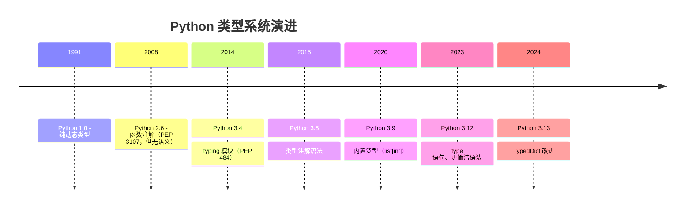

## 4.1 Python 类型系统的演进



```python
 Python 3.5 之前：鸭子类型，无类型信息
def add(a, b):
    return a + b

 Python 3.5+：类型注解（可选，运行时不检查）
def add(a: int, b: int) -> int:
    return a + b

 用 mypy 做静态检查
 mypy file.py → 如果传了 str 给 add，mypy 会报错

 Python 3.9+：更简洁的泛型写法
from typing import Optional, List  # 旧写法
def process(items: list[int]) -> Optional[str]:  # 新写法
    return items[0] if items else None
```

## 4.2 typing 模块进阶

### 泛型（TypeVar、Generic）

```python
from typing import TypeVar, Generic

 TypeVar 定义一个类型变量
T = TypeVar('T')           # 可以是任何类型
N = TypeVar('N', int, float)  # 只能是 int 或 float（约束）
K = TypeVar('K')           # 用于键
V = TypeVar('V')           # 用于值

class Stack(Generic[T]):
    """泛型栈：可以存任何类型"""
    def __init__(self):
        self._items: list[T] = []

    def push(self, item: T) -> None:
        self._items.append(item)

    def pop(self) -> T:
        return self._items.pop()

    def __repr__(self) -> str:
        return f"Stack({self._items})"

int_stack: Stack[int] = Stack()
int_stack.push(1)
int_stack.push(2)
print(int_stack)        # Stack([1, 2])
 int_stack.push("hi")  # mypy 报错: Argument has incompatible type "str"
```

```python
from typing import TypeVar

 bound：限制必须是某个类的子类
class Animal: pass
class Dog(Animal): pass
class Cat(Animal): pass

A = TypeVar('A', bound=Animal)

def make_sound(animal: A) -> A:
    return animal

make_sound(Dog())  # ✅
make_sound(42)     # ❌ mypy 报错: Value of type variable "A" cannot be "int"
```

### Protocol（结构化子类型）

```python
from typing import Protocol, runtime_checkable

 Protocol：类似 Go 的 interface（鸭子类型的静态检查版本）
 不需要显式继承，只要有相同的方法签名就行！

class Drawable(Protocol):
    """只要实现了 draw 方法，就是 Drawable"""
    def draw(self) -> str:
        ...

class Circle:
    def draw(self) -> str:
        return "○"

class Rectangle:
    def draw(self) -> str:
        return "□"

def render(obj: Drawable) -> None:
    print(obj.draw())

render(Circle())     # ✅ Circle 有 draw 方法
render(Rectangle())  # ✅ Rectangle 有 draw 方法
 render(42)         # ❌ int 没有 draw 方法

 @runtime_checkable：允许 isinstance 检查
@runtime_checkable
class Closeable(Protocol):
    def close(self) -> None: ...

class File:
    def close(self):
        print("文件已关闭")

print(isinstance(File(), Closeable))  # True
```

:::tip Protocol vs Java interface
- Java interface 需要 `implements` 显式声明
- Python Protocol 是**隐式的**——只要结构匹配就兼容（结构化子类型 / Structural Subtyping）
- Protocol 更灵活，不需要改已有代码就能让新类兼容
:::

### TypeGuard 和 TypeIs

```python
from typing import TypeGuard, TypeIs

 TypeGuard：自定义类型窄化函数
def is_string_list(val: list) -> TypeGuard[list[str]]:
    """告诉 mypy：如果返回 True，val 就是 list[str]"""
    return all(isinstance(x, str) for x in val)

data: list = ["hello", 42, "world"]

if is_string_list(data):
    # 在这个分支里，mypy 知道 data 是 list[str]
    for item in data:
        print(item.upper())  # ✅ mypy 认为每个 item 都是 str
```

```python
 TypeIs（Python 3.13+）：更精确的类型窄化
 TypeGuard 会拓宽类型，TypeIs 会窄化
from typing import TypeIs

def is_int_str(val: object) -> TypeIs[int | str]:
    """如果返回 True，val 的类型精确为 int | str"""
    return isinstance(val, (int, str))
```

### 其他常用类型工具

```python
from typing import Literal, Final, TypedDict, overload, TypeAlias

 ====== Literal：字面量类型 ======
def set_mode(mode: Literal["debug", "release", "test"]) -> None:
    print(f"模式: {mode}")

set_mode("debug")   # ✅
 set_mode("prod")  # ❌ mypy 报错

 ====== Final：不可变类型 ======
MAX_SIZE: Final = 100
 MAX_SIZE = 200   # ❌ mypy 报错: Cannot assign to final name

class Config:
    VERSION: Final = "1.0"

 ====== TypedDict：带类型提示的字典 ======
class UserInfo(TypedDict):
    name: str
    age: int
    email: str

def process_user(user: UserInfo) -> str:
    return f"{user['name']}, {user['age']}岁"

user: UserInfo = {"name": "Alice", "age": 30, "email": "a@b.com"}
print(process_user(user))  # Alice, 30岁
 bad = {"name": "Bob"}  # ❌ 缺少 age 和 email

 ====== overload：函数重载 ======
@overload
def process(data: str) -> str: ...
@overload
def process(data: int) -> int: ...
@overload
def process(data: list) -> list: ...

def process(data):
    if isinstance(data, str):
        return data.upper()
    elif isinstance(data, int):
        return data * 2
    else:
        return [x * 2 for x in data]

result: str = process("hello")  # mypy 知道返回 str
result2: int = process(5)       # mypy 知道返回 int

 ====== TypeAlias ======
Vector: TypeAlias = list[float]
Matrix: TypeAlias = list[Vector]
```

### ParamSpec 和 Concatenate

```python
from typing import ParamSpec, Concatenate, Callable, TypeVar

P = ParamSpec('P')     # 捕获函数的参数签名
R = TypeVar('R')       # 返回值类型

def log_calls(func: Callable[P, R]) -> Callable[P, R]:
    """装饰器的类型标注：保留原始函数的参数签名和返回类型"""
    def wrapper(*args: P.args, **kwargs: P.kwargs) -> R:
        print(f"调用 {func.__name__}")
        return func(*args, **kwargs)
    return wrapper

@log_calls
def add(a: int, b: int) -> int:
    return a + b

 mypy 知道 add(a: int, b: int) -> int

 Concatenate：在装饰器中添加前置参数
def with_db(func: Callable[Concatenate[str, P], R]) -> Callable[P, R]:
    """自动注入数据库连接作为第一个参数"""
    def wrapper(*args: P.args, **kwargs: P.kwargs) -> R:
        db = "database_connection"  # 模拟
        return func(db, *args, **kwargs)
    return wrapper
```

## 4.3 mypy 进阶

```ini
 mypy.ini 或 pyproject.toml 中配置
[mypy]
python_version = 3.12
strict = True          # 开启所有严格检查
warn_return_any = True
warn_unused_configs = True
disallow_untyped_defs = True  # 所有函数必须有类型注解

[[tool.mypy.overrides]]
module = "third_party.*"
ignore_missing_imports = True  # 第三方库没有类型注解时忽略
```

```bash
 常用 mypy 命令
mypy src/                    # 检查整个目录
mypy --strict src/main.py    # 严格模式
mypy --no-error-summary src/ # 不显示摘要
```

## 4.4 Python 3.12+ 新语法

```python
 Python 3.12+: type 语句（替代 TypeAlias）
type Vector = list[float]
type Matrix = list[Vector]
type Point = tuple[float, float]

 Python 3.12+: 泛型类更简洁
class Stack[T]:
    def __init__(self) -> None:
        self.items: list[T] = []

    def push(self, item: T) -> None:
        self.items.append(item)

    def pop(self) -> T:
        return self.items.pop()

 旧写法（3.9-3.11）：
 from typing import Generic, TypeVar
 T = TypeVar('T')
 class Stack(Generic[T]): ...

 Python 3.12+: 泛型函数
def first[T](items: list[T]) -> T | None:
    return items[0] if items else None
```

## 4.5 Java 泛型系统对比

| Python | Java | 说明 |
|--------|------|------|
| `TypeVar('T')` | `<T>` | 类型变量 |
| `Protocol` | `interface` | Protocol 是隐式的，Java interface 是显式的 |
| `TypeGuard` | `pattern matching (instanceof)` | 类型窄化 |
| `TypedDict` | `record` / `class` | 结构化字典 |
| `overload` | 方法重载（编译时多分派） | Python 需要显式声明，Java 原生支持 |
| `Final` | `final` | 不可变 |
| `Union[A, B]` | `A \| B`（Java 10+） | 联合类型 |

:::warning 关键区别
Java 的泛型有**类型擦除**（Type Erasure），运行时 `List<String>` 和 `List<Integer>` 是同一个类型。Python 的 `list[str]` 在运行时可以通过 `typing.get_type_hints()` 获取到。
:::

---

## 4.6 练习题

**题目 1**：用 `Protocol` 定义一个 `Jsonable` 协议，要求实现 `to_json() -> str` 和 `from_json(cls, s: str)` 方法。


**参考答案**

```python
from typing import Protocol, TypeVar

T = TypeVar('T')

class Jsonable(Protocol):
    def to_json(self) -> str: ...
    @classmethod
    def from_json(cls: type[T], s: str) -> T: ...

class User:
    def __init__(self, name: str):
        self.name = name

    def to_json(self) -> str:
        return f'{{"name": "{self.name}"}}'

    @classmethod
    def from_json(cls, s: str) -> 'User':
        import json
        data = json.loads(s)
        return cls(data['name'])

u = User.from_json('{"name": "Alice"}')
print(u.to_json())  # {"name": "Alice"}
```


**题目 2**：用 `overload` 给 `def parse(value: str | int | float)` 添加类型重载。


**参考答案**

```python
from typing import overload

@overload
def parse(value: str) -> str: ...
@overload
def parse(value: int) -> int: ...
@overload
def parse(value: float) -> float: ...

def parse(value):
    return value

r1: str = parse("hello")
r2: int = parse(42)
r3: float = parse(3.14)
```


**题目 3**：实现一个带 `ParamSpec` 的计时装饰器，保留被装饰函数的类型签名。


**参考答案**

```python
import time
from typing import ParamSpec, TypeVar, Callable

P = ParamSpec('P')
R = TypeVar('R')

def timer(func: Callable[P, R]) -> Callable[P, R]:
    def wrapper(*args: P.args, **kwargs: P.kwargs) -> R:
        start = time.time()
        result = func(*args, **kwargs)
        elapsed = time.time() - start
        print(f"{func.__name__} 耗时 {elapsed:.4f}s")
        return result
    return wrapper

@timer
def add(a: int, b: int) -> int:
    return a + b

add(1, 2)  # add 耗时 0.0000s
```


**题目 4**：解释 `TypeGuard` 和 `TypeIs` 的区别。


**参考答案**

- `TypeGuard[T]`：如果函数返回 `True`，参数类型被窄化为 `T`。但返回 `False` 时，参数类型保持原样。
- `TypeIs[T]`（Python 3.13+）：更精确。返回 `True` 时类型是 `T`，返回 `False` 时类型被排除 `T`。

`TypeGuard` 可能导致类型过于宽泛，`TypeIs` 更准确。


---