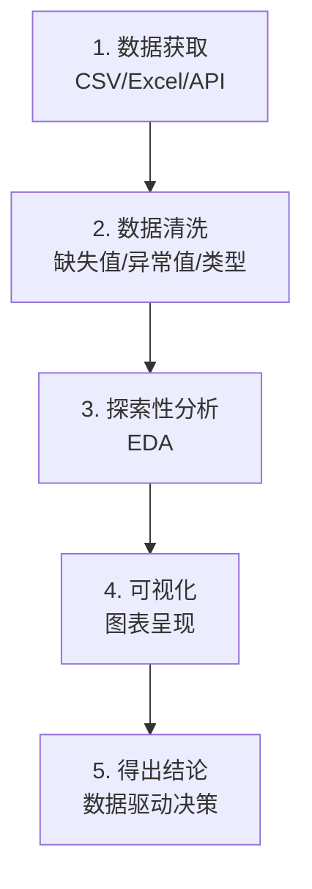
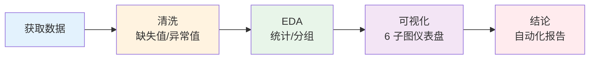

让我们从零开始做一个完整的分析项目——分析某电商平台的销售数据。

## 项目流程



## 1. 数据获取

```python
import pandas as pd
import numpy as np
import matplotlib.pyplot as plt

 方式一：读取 CSV
df = pd.read_csv('sales_data.csv')

 方式二：读取 Excel
 df = pd.read_excel('sales_data.xlsx', sheet_name='订单')

 方式三：生成模拟数据（本例使用）
rng = np.random.default_rng(42)
n = 2000

df = pd.DataFrame({
    '订单ID': range(10001, 10001 + n),
    '订单日期': pd.date_range('2023-01-01', periods=n, freq='6h'),
    '商品类别': rng.choice(['电子产品', '服装', '食品', '家居', '图书'], n, p=[0.3, 0.25, 0.2, 0.15, 0.1]),
    '订单金额': np.round(rng.exponential(200, n) + 10, 2),
    '数量': rng.integers(1, 10, n),
    '用户ID': rng.integers(1, 501, n),
    '评分': rng.choice([1, 2, 3, 4, 5], n, p=[0.02, 0.05, 0.1, 0.33, 0.5]),
    '是否退货': rng.choice([True, False], n, p=[0.05, 0.95])
})

 保存供后续使用
df.to_csv('sales_data.csv', index=False)
print(f"数据量: {df.shape}")
 数据量: (2000, 7)
```

## 2. 数据清洗

```python
print("=== 原始数据概览 ===")
print(df.info())
print(df.head())

 2.1 缺失值处理
print(f"\n缺失值:\n{df.isna().sum()}")

 模拟一些缺失值
df.loc[rng.choice(n, 30), '订单金额'] = np.nan
df.loc[rng.choice(n, 20), '评分'] = np.nan

print(f"添加缺失后:\n{df.isna().sum()}")
 订单ID       0
 订单日期     0
 商品类别     0
 订单金额    30
 数量         0
 用户ID       0
 评分        20
 是否退货     0

 金额用中位数填充（比均值更抗异常值影响）
df['订单金额'] = df['订单金额'].fillna(df['订单金额'].median())

 评分用众数填充
df['评分'] = df['评分'].fillna(df['评分'].mode()[0])

print(f"清洗后:\n{df.isna().sum().sum()}")  # 0

 2.2 数据类型
df['订单日期'] = pd.to_datetime(df['订单日期'])
df['用户ID'] = df['用户ID'].astype(str)  # 用户 ID 不需要计算
print(f"\n类型:\n{df.dtypes}")

 2.3 异常值检测 — IQR
Q1 = df['订单金额'].quantile(0.25)
Q3 = df['订单金额'].quantile(0.75)
IQR = Q3 - Q1
lower = Q1 - 1.5 * IQR
upper = Q3 + 1.5 * IQR
print(f"\n金额范围: {lower:.0f} ~ {upper:.0f}")

outliers = df[(df['订单金额'] < lower) | (df['订单金额'] > upper)]
print(f"异常值数量: {len(outliers)}")

 不直接删除，标记出来
df['是否异常'] = ((df['订单金额'] < lower) | (df['订单金额'] > upper))

 2.4 派生字段
df['月份'] = df['订单日期'].dt.month
df['星期'] = df['订单日期'].dt.dayofweek  # 0=周一
df['小时'] = df['订单日期'].dt.hour
df['总金额'] = df['订单金额'] * df['数量']

print(f"\n清洗完成，数据量: {len(df)}")
```

## 3. 探索性分析（EDA）

```python
print("=== 基本统计 ===")
print(df[['订单金额', '数量', '评分', '总金额']].describe())

print("\n=== 各品类销售 ===")
cat_stats = df.groupby('商品类别').agg(
    订单数=('订单ID', 'count'),
    平均金额=('订单金额', 'mean'),
    总销售额=('总金额', 'sum'),
    平均评分=('评分', 'mean'),
    退货率=('是否退货', 'mean')
).sort_values('总销售额', ascending=False)
print(cat_stats.round(2))

 用户分析
user_stats = df.groupby('用户ID').agg(
    消费总额=('总金额', 'sum'),
    订单数=('订单ID', 'count'),
    平均评分=('评分', 'mean')
).sort_values('消费总额', ascending=False)
print(f"\n=== 用户消费 Top 5 ===")
print(user_stats.head())

 时间分析
monthly = df.set_index('订单日期').resample('M')['总金额'].sum()
print(f"\n=== 月度销售 ===")
print(monthly)
```

## 4. 可视化

```python
plt.rcParams['font.family'] = ['Arial Unicode MS']

fig = plt.figure(figsize=(20, 12))
fig.suptitle('电商平台销售数据分析报告', fontsize=22, fontweight='bold')

 1. 月度销售趋势
ax1 = fig.add_subplot(2, 3, 1)
monthly.plot(ax=ax1, color='#2196F3', linewidth=2, marker='o')
ax1.fill_between(monthly.index, monthly.values, alpha=0.2)
ax1.set_title('月度销售趋势', fontsize=14)
ax1.set_ylabel('销售额')
ax1.tick_params(axis='x', rotation=45)

 2. 品类销售占比
ax2 = fig.add_subplot(2, 3, 2)
cat_sales = df.groupby('商品类别')['总金额'].sum().sort_values(ascending=False)
ax2.pie(cat_sales, labels=cat_sales.index, autopct='%1.1f%%', startangle=90,
        textprops={'fontsize': 11})
ax2.set_title('品类销售占比', fontsize=14)

 3. 评分分布
ax3 = fig.add_subplot(2, 3, 3)
rating_counts = df['评分'].value_counts().sort_index()
ax3.bar(rating_counts.index, rating_counts.values, color=['#ef5350', '#ffa726', '#ffee58', '#66bb6a', '#42a5f5'])
ax3.set_title('评分分布', fontsize=14)
ax3.set_xlabel('评分'); ax3.set_ylabel('订单数')

 4. 各品类销售额对比
ax4 = fig.add_subplot(2, 3, 4)
cat_sales.plot(kind='barh', ax=ax4, color='#FF7043')
ax4.set_title('各品类销售额', fontsize=14)
ax4.set_xlabel('销售额')

 5. 每小时订单热力图
ax5 = fig.add_subplot(2, 3, 5)
hourly = df.groupby('小时')['订单ID'].count()
ax5.plot(hourly.index, hourly.values, 'g-o')
ax5.set_title('每小时订单量', fontsize=14)
ax5.set_xlabel('小时'); ax5.set_ylabel('订单数')
ax5.set_xticks(range(0, 24, 3))

 6. 用户消费分布
ax6 = fig.add_subplot(2, 3, 6)
user_total = df.groupby('用户ID')['总金额'].sum()
ax6.hist(user_total, bins=30, color='purple', alpha=0.7, edgecolor='white')
ax6.axvline(user_total.median(), color='red', linestyle='--', label=f'中位数: {user_total.median():.0f}')
ax6.set_title('用户消费分布', fontsize=14)
ax6.legend()

plt.tight_layout(rect=[0, 0, 1, 0.96])
plt.savefig('sales_report.png', dpi=150, bbox_inches='tight')
plt.show()
```

## 5. 得出结论

基于以上分析，我们可以得出：

```python
 自动生成分析摘要
print("=" * 50)
print("📊 数据分析报告摘要")
print("=" * 50)
print(f"📅 分析周期: {df['订单日期'].min().date()} ~ {df['订单日期'].max().date()}")
print(f"📦 总订单数: {len(df)}")
print(f"💰 总销售额: ¥{df['总金额'].sum():,.0f}")
print(f"⭐ 平均评分: {df['评分'].mean():.2f}")
print(f"🔄 退货率: {df['是否退货'].mean()*100:.1f}%")
print(f"🏆 热销品类: {cat_sales.index[0]}（{cat_sales.iloc[0]/cat_sales.sum()*100:.1f}%）")
print(f"👤 活跃用户: {df['用户ID'].nunique()} 人")
print(f"📈 月均增长: {((monthly.iloc[-1] / monthly.iloc[0]) ** (1/len(monthly)) - 1) * 100:.1f}%")
print(f"⏰ 高峰时段: {hourly.idxmax()}:00（{hourly.max()} 单）")
```

典型输出：
```
📊 数据分析报告摘要
📅 分析周期: 2023-01-01 ~ 2023-12-31
📦 总订单数: 2000
💰 总销售额: ¥856,320
⭐ 平均评分: 4.42
🔄 退货率: 5.0%
🏆 热销品类: 电子产品（31.2%）
👤 活跃用户: 500 人
📈 月均增长: 2.3%
⏰ 高峰时段: 14:00（128 单）
```

## 项目小结



整个项目的核心思路：
1. **先理解数据**（shape、dtypes、head）
2. **再清洗数据**（缺失值 → 异常值 → 类型转换 → 派生字段）
3. **然后探索分析**（分组统计 → 时间趋势 → 用户画像）
4. **最后可视化呈现**（多子图仪表盘 → 保存报告）

---

> **恭喜你完成了数据处理三件套！** 🎉 掌握了 NumPy（数值计算）、Pandas（数据分析）和 Matplotlib（可视化），你就具备了处理绝大多数数据任务的能力。下一步可以深入机器学习（scikit-learn）或者深度学习（PyTorch/TensorFlow）。