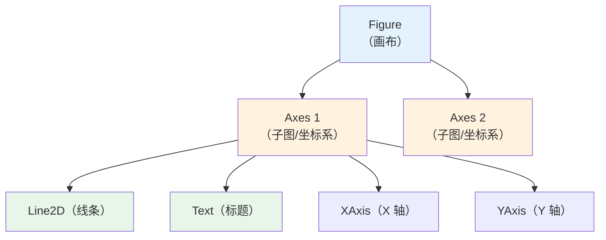
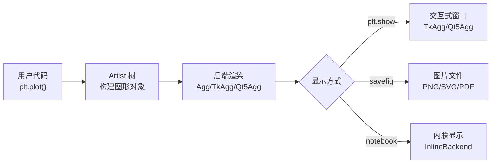

## 为什么需要可视化？

"一张图胜过一千行数据。" 可视化让你**一眼看到**数据中的模式、异常和趋势——这些在数字表格里很难发现。

## 安装

```bash
pip install matplotlib
```

## 基础概念：三层架构



- **Figure**：最外层的画布，可以包含多个子图
- **Axes**：实际的绘图区域（坐标系），包含坐标轴、标题、图例等
- **Artist**：图上的所有可见元素（线条、文字、刻度等）

```python
import matplotlib.pyplot as plt

fig, ax = plt.subplots()  # 创建画布 + 子图
ax.plot([1, 2, 3], [1, 4, 9])  # 在子图上画线
ax.set_title('我的第一张图')
plt.show()
```

## 中文显示配置

```python
import matplotlib.pyplot as plt

 macOS
plt.rcParams['font.family'] = ['Arial Unicode MS']

 Windows
plt.rcParams['font.family'] = ['SimHei']  # 黑体

 Linux
plt.rcParams['font.family'] = ['WenQuanYi Micro Hei']

 通用方案（推荐）— 直接指定字体文件路径
from matplotlib.font_manager import FontProperties
font = FontProperties(fname='/System/Library/Fonts/PingFang.ttc', size=14)
plt.title('中文标题', fontproperties=font)

 检查可用字体
from matplotlib.font_manager import fontManager
[f.name for f in fontManager.ttflist if 'Hei' in f.name or 'Ping' in f.name]
```

:::warning 中文乱字问题
如果图表中中文显示为方块，说明字体配置有问题。优先用上面的"通用方案"直接指定字体文件。
:::

## 常用图表类型

### 折线图 — 趋势分析

```python
import matplotlib.pyplot as plt
import numpy as np

months = ['1月', '2月', '3月', '4月', '5月', '6月']
sales = [100, 120, 90, 150, 130, 160]

plt.figure(figsize=(10, 5))
plt.plot(months, sales, marker='o', linewidth=2, color='#2196F3',
         label='月销售额', markersize=8)
plt.title('2024 年上半年销售趋势', fontsize=16)
plt.xlabel('月份', fontsize=12)
plt.ylabel('销售额（万元）', fontsize=12)
plt.grid(True, alpha=0.3)
plt.legend(fontsize=12)
plt.savefig('line_chart.png', dpi=150, bbox_inches='tight')
plt.show()
```

### 柱状图 — 对比分析

```python
categories = ['电子产品', '服装', '食品', '家居']
values = [4500, 3200, 2800, 1900]
colors = ['#FF6384', '#36A2EB', '#FFCE56', '#4BC0C0']

fig, (ax1, ax2) = plt.subplots(1, 2, figsize=(14, 5))

 竖直柱状图
ax1.bar(categories, values, color=colors, edgecolor='white', linewidth=1.5)
ax1.set_title('各品类销售额', fontsize=14)
ax1.set_ylabel('销售额（万元）')

 水平柱状图
ax2.barh(categories, values, color=colors)
ax2.set_title('各品类销售额（水平）', fontsize=14)
ax2.set_xlabel('销售额（万元）')

plt.tight_layout()
plt.show()
```

### 散点图 — 相关性分析

```python
rng = np.random.default_rng(42)
x = rng.normal(50, 15, 200)
y = 0.8 * x + rng.normal(0, 10, 200)  # 正相关 + 噪声

plt.figure(figsize=(8, 6))
plt.scatter(x, y, alpha=0.6, c=x, cmap='viridis', s=30, edgecolors='white', linewidth=0.5)
plt.colorbar(label='X 值')
plt.title('身高 vs 体重（正相关）', fontsize=14)
plt.xlabel('身高（cm）', fontsize=12)
plt.ylabel('体重（kg）', fontsize=12)
plt.show()
```

### 直方图 — 分布分析

```python
scores = rng.normal(75, 12, 1000)

plt.figure(figsize=(8, 5))
plt.hist(scores, bins=30, color='#5C6BC0', edgecolor='white', alpha=0.8, density=True)
plt.title('考试成绩分布', fontsize=14)
plt.xlabel('分数', fontsize=12)
plt.ylabel('概率密度', fontsize=12)
plt.axvline(scores.mean(), color='red', linestyle='--', label=f'均值: {scores.mean():.1f}')
plt.legend()
plt.show()
```

### 饼图 — 占比分析

```python
labels = ['电子产品', '服装', '食品', '家居', '其他']
sizes = [35, 25, 20, 12, 8]
colors = ['#FF6384', '#36A2EB', '#FFCE56', '#4BC0C0', '#9966FF']
explode = (0.05, 0, 0, 0, 0)  # 第一块突出

plt.figure(figsize=(8, 8))
plt.pie(sizes, labels=labels, colors=colors, explode=explode,
        autopct='%1.1f%%', startangle=90, textprops={'fontsize': 12},
        pctdistance=0.85)
plt.title('销售品类占比', fontsize=16)
plt.show()
```

### 箱线图 — 分布与异常值

```python
data = [rng.normal(m, s, 200) for m, s in [(60, 10), (70, 15), (80, 8)]]

plt.figure(figsize=(8, 5))
plt.boxplot(data, labels=['语文', '数学', '英语'], patch_artist=True,
            boxprops=dict(facecolor='#E3F2FD'))
plt.title('各科成绩分布', fontsize=14)
plt.ylabel('分数', fontsize=12)
plt.show()
 箱线图要素：下边缘(Q1)、中线(中位数)、上边缘(Q3)、须(1.5×IQR)、圆点(异常值)
```

### 热力图 — 相关矩阵

```python
import numpy as np

corr = np.array([
    [1.00, 0.85, 0.30, -0.20],
    [0.85, 1.00, 0.25, -0.15],
    [0.30, 0.25, 1.00, 0.60],
    [-0.20, -0.15, 0.60, 1.00]
])
labels = ['销售额', '利润', '广告费', '成本']

fig, ax = plt.subplots(figsize=(8, 6))
im = ax.imshow(corr, cmap='RdBu_r', vmin=-1, vmax=1)
ax.set_xticks(range(4)); ax.set_xticklabels(labels)
ax.set_yticks(range(4)); ax.set_yticklabels(labels)
for i in range(4):
    for j in range(4):
        ax.text(j, i, f'{corr[i, j]:.2f}', ha='center', va='center', fontsize=12)
plt.colorbar(im, label='相关系数')
plt.title('变量相关矩阵', fontsize=14)
plt.show()
```

### 面积图与堆叠图

```python
months = np.arange(1, 13)
online = rng.integers(50, 150, 12)
offline = rng.integers(30, 100, 12)

plt.figure(figsize=(10, 5))
plt.fill_between(months, online, alpha=0.5, label='线上', color='#2196F3')
plt.fill_between(months, offline, alpha=0.5, label='线下', color='#FF9800')
plt.title('线上线下销售趋势', fontsize=14)
plt.xlabel('月份'); plt.ylabel('销售额')
plt.legend()
plt.show()
```

### 子图组合

```python
fig, axes = plt.subplots(2, 2, figsize=(14, 10))

 折线图
axes[0, 0].plot(months, online, 'b-o', label='线上')
axes[0, 0].plot(months, offline, 'r-s', label='线下')
axes[0, 0].set_title('月度趋势')
axes[0, 0].legend()

 柱状图
axes[0, 1].bar(categories, values, color=colors)
axes[0, 1].set_title('品类对比')

 散点图
axes[1, 0].scatter(x, y, alpha=0.5)
axes[1, 0].set_title('相关性')

 直方图
axes[1, 1].hist(scores, bins=20, color='green', alpha=0.7)
axes[1, 1].set_title('成绩分布')

plt.tight_layout()
plt.savefig('dashboard.png', dpi=150, bbox_inches='tight', transparent=False)
plt.show()
```

## 图表美化

```python
fig, ax = plt.subplots(figsize=(10, 6))

 样式设置
plt.style.use('seaborn-v0_8-whitegrid')  # 全局样式

 画多条线
ax.plot([1, 2, 3, 4], [1, 4, 2, 3], 'r--o', label='系列A', linewidth=2, markersize=8)
ax.plot([1, 2, 3, 4], [2, 3, 4, 1], 'b-s', label='系列B', linewidth=2, markersize=8)

 标题与标签
ax.set_title('美化示例', fontsize=18, fontweight='bold', pad=20)
ax.set_xlabel('X 轴', fontsize=14)
ax.set_ylabel('Y 轴', fontsize=14)

 图例
ax.legend(fontsize=12, loc='upper right', framealpha=0.9)

 网格
ax.grid(True, alpha=0.3, linestyle='--')

 坐标轴设置
ax.set_xlim(0, 5)
ax.set_ylim(0, 5)
ax.set_xticks([1, 2, 3, 4])
ax.set_xticklabels(['Q1', 'Q2', 'Q3', 'Q4'], fontsize=12)

 注释
ax.annotate('最高点', xy=(2, 4), xytext=(2.5, 4.5),
            arrowprops=dict(arrowstyle='->', color='red'),
            fontsize=12, color='red')

 保存
plt.savefig('beautiful.png', dpi=200, bbox_inches='tight', transparent=True)
 dpi: 分辨率（300 适合印刷，150 适合网页）
 bbox_inches='tight': 去除白边
 transparent=True: 透明背景
plt.show()
```

## Matplotlib + Pandas 快速绑定

```python
import pandas as pd
import matplotlib.pyplot as plt

df = pd.DataFrame({
    '月份': ['1月', '2月', '3月', '4月', '5月', '6月'],
    '销售额': [100, 120, 90, 150, 130, 160],
    '利润': [20, 25, 15, 35, 28, 40]
})

 df.plot() 直接画图
df.plot(x='月份', y='销售额', kind='line', figsize=(8, 5), title='销售趋势')
df.plot(x='月份', kind='bar', figsize=(8, 5), title='月度对比')
df['销售额'].plot(kind='hist', bins=10, figsize=(8, 5), title='销售额分布')
df.plot(x='月份', y=['销售额', '利润'], kind='area', figsize=(8, 5))
plt.show()
```

## Seaborn 简介

Seaborn 是基于 Matplotlib 的统计可视化库，默认配色更美观：

```python
import seaborn as sns

 设置风格
sns.set_theme(style='whitegrid')

 内置数据集
tips = sns.load_dataset('tips')

 箱线图
sns.boxplot(x='day', y='total_bill', data=tips)
plt.title('每日消费分布')
plt.show()

 散点图 + 回归线
sns.regplot(x='total_bill', y='tip', data=tips)
plt.show()

 分面图（按类别分别画）
g = sns.FacetGrid(tips, col='time', row='smoker')
g.map_dataframe(sns.histplot, x='total_bill')
plt.show()

 热力图（一行搞定相关矩阵）
sns.heatmap(tips.corr(numeric_only=True), annot=True, cmap='coolwarm', center=0)
plt.show()
```

## 交互式可视化 — Plotly 简介

```python
import plotly.express as px

df = px.data.iris()

 交互式散点图（可缩放、悬停查看数据）
fig = px.scatter(df, x='sepal_width', y='sepal_length', color='species',
                 title='鸢尾花数据集', hover_data=['petal_width'])
fig.show()

 交互式柱状图
fig = px.bar(df.groupby('species').size().reset_index(name='count'),
             x='species', y='count', title='各类别数量')
fig.show()
```

## Matplotlib 底层渲染流程



- **Agg 后端**：非交互式，只生成图片文件（服务器环境常用）
- **TkAgg/Qt5Agg**：交互式后端，弹出窗口
- **矢量图（SVG/PDF）**：放大不失真，适合印刷
- **位图（PNG/JPEG）**：有像素点，适合网页

## Java 对比

| 特性 | Python Matplotlib | Java |
|------|-------------------|------|
| 基础绘图 | `plt.plot()` | JFreeChart / XChart |
| 统计可视化 | Seaborn | 无直接等价物 |
| 交互式 | Plotly | JavaFX Charts |
| 配置 | rcParams | 需要大量 Java 代码 |

```java
// Java XChart 示例
XYChart chart = QuickChart.getChart("Sample", "X", "Y", "y(x)",
    new double[]{1, 2, 3}, new double[]{1, 4, 9});
new SwingWrapper(chart).displayChart();
```

## 实战案例：数据报告可视化

```python
import matplotlib.pyplot as plt
import numpy as np

 创建 2×3 的仪表盘
fig = plt.figure(figsize=(18, 10))
fig.suptitle('2024 年 Q1-Q2 业务数据报告', fontsize=20, fontweight='bold', y=0.98)

 1. 销售趋势（折线图）
ax1 = fig.add_subplot(2, 3, 1)
months = np.arange(1, 7)
ax1.plot(months, [100, 120, 90, 150, 130, 160], 'b-o', linewidth=2)
ax1.fill_between(months, [100, 120, 90, 150, 130, 160], alpha=0.2)
ax1.set_title('月度销售趋势')
ax1.set_xlabel('月份'); ax1.set_ylabel('万元')

 2. 品类占比（饼图）
ax2 = fig.add_subplot(2, 3, 2)
ax2.pie([35, 25, 20, 12, 8], labels=['电子', '服装', '食品', '家居', '其他'],
        autopct='%1.1f%%', startangle=90, textprops={'fontsize': 10})
ax2.set_title('品类销售占比')

 3. 用户增长（柱状图）
ax3 = fig.add_subplot(2, 3, 3)
ax3.bar(['Q1', 'Q2'], [1200, 1800], color=['#4CAF50', '#2196F3'])
ax3.set_title('季度新增用户')

 4. 成绩分布（直方图）
ax4 = fig.add_subplot(2, 3, 4)
scores = np.random.normal(75, 12, 500)
ax4.hist(scores, bins=25, color='purple', alpha=0.7, edgecolor='white')
ax4.set_title('用户满意度评分分布')

 5. 相关性（散点图）
ax5 = fig.add_subplot(2, 3, 5)
x = np.random.normal(50, 15, 200)
y = 0.8 * x + np.random.normal(0, 10, 200)
ax5.scatter(x, y, alpha=0.5, c=x, cmap='viridis')
ax5.set_title('广告费 vs 销售额')

 6. 各部门绩效（水平柱状图）
ax6 = fig.add_subplot(2, 3, 6)
depts = ['技术部', '市场部', '销售部', '运营部']
perf = [92, 85, 88, 78]
colors = ['#4CAF50' if p >= 85 else '#FF9800' for p in perf]
ax6.barh(depts, perf, color=colors)
ax6.axvline(85, color='red', linestyle='--', label='目标线')
ax6.set_title('部门绩效评分')
ax6.legend()

plt.tight_layout(rect=[0, 0, 1, 0.96])
plt.savefig('report.png', dpi=150, bbox_inches='tight')
plt.show()
```

## 练习题

**1.** 画一张折线图展示 12 个月的温度变化，添加标题、标签、网格和图例。

**参考答案**

```python
months = range(1, 13)
temp_beijing = [2, 5, 12, 20, 26, 30, 31, 30, 24, 16, 8, 3]
temp_shanghai = [5, 6, 10, 16, 21, 25, 29, 29, 25, 20, 14, 7]
plt.plot(months, temp_beijing, 'r-o', label='北京')
plt.plot(months, temp_shanghai, 'b-s', label='上海')
plt.title('京沪月均温度对比'); plt.xlabel('月份'); plt.ylabel('温度(°C)')
plt.grid(True, alpha=0.3); plt.legend()
plt.show()
```


**2.** 用子图画 2×2 的图表：折线图、柱状图、散点图、饼图。

**参考答案**

```python
fig, axes = plt.subplots(2, 2, figsize=(12, 10))
axes[0,0].plot([1,2,3], [1,4,9])
axes[0,1].bar(['A','B','C'], [3,5,2])
axes[1,0].scatter([1,2,3,4], [1,3,2,4])
axes[1,1].pie([30,40,30], labels=['A','B','C'])
plt.tight_layout(); plt.show()
```


**3.** 用 Matplotlib 热力图展示一个 4×4 相关矩阵，在每格中标注数值。

**参考答案**

```python
corr = np.random.uniform(-1, 1, (4, 4))
np.fill_diagonal(corr, 1)
im = plt.imshow(corr, cmap='RdBu_r', vmin=-1, vmax=1)
plt.colorbar(im)
for i in range(4):
    for j in range(4):
        plt.text(j, i, f'{corr[i,j]:.2f}', ha='center', va='center')
plt.show()
```


**4.** 将图表保存为 300dpi 的 PNG，去除白边。

**参考答案**

```python
plt.savefig('chart.png', dpi=300, bbox_inches='tight')
```


**5.** 用 Seaborn 画一个箱线图，展示不同类别的数据分布。

**参考答案**

```python
import seaborn as sns
df = sns.load_dataset('tips')
sns.boxplot(x='day', y='total_bill', data=df)
plt.show()
```


**6.** 用 `fill_between` 画一个面积图，展示两组数据的堆叠趋势。

**参考答案**

```python
x = np.arange(1, 13)
a = np.random.randint(50, 150, 12)
b = np.random.randint(30, 100, 12)
plt.fill_between(x, a, alpha=0.5, label='线上')
plt.fill_between(x, a, a+b, alpha=0.5, label='线下')
plt.legend(); plt.show()
```


---